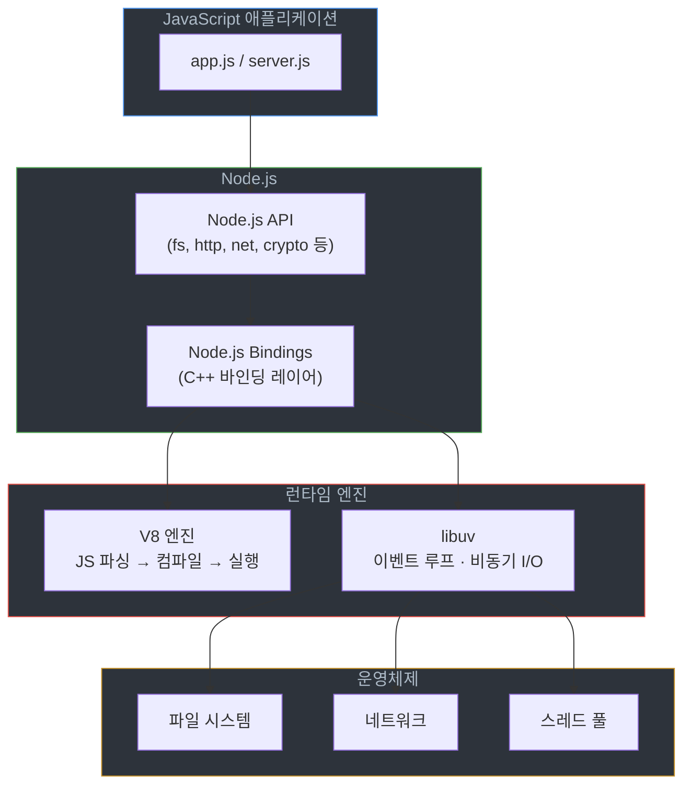
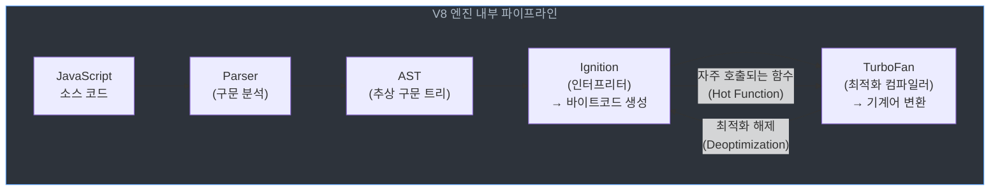
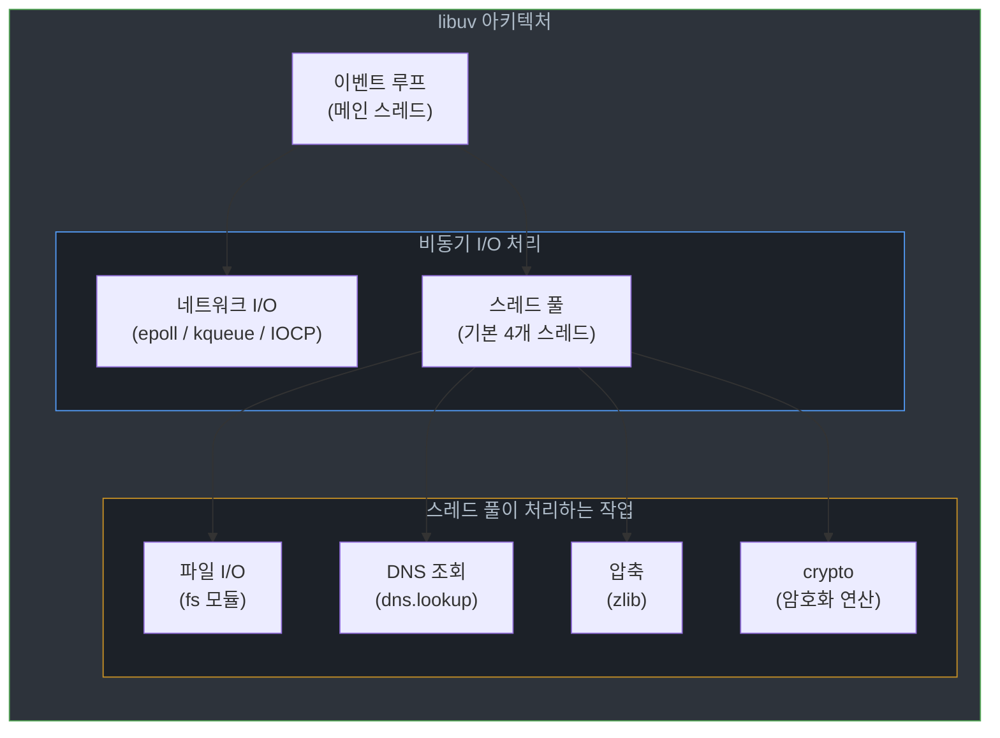

# Node.js 기본 개념과 구조

## 배경

Node.js는 JavaScript 실행 환경(Runtime)이다. 브라우저가 아닌 서버에서 JavaScript를 실행할 수 있게 해준다.

### Node.js의 특징
- JavaScript를 브라우저 밖에서 실행한다
- 싱글 스레드 기반의 이벤트 루프(Event Loop) 모델로 동작한다
- 비동기 논블로킹 I/O(Non-Blocking I/O)를 지원한다
- HTTP 서버가 내장되어 있어 별도 웹 서버 없이 서버를 만들 수 있다
- V8 엔진과 libuv 라이브러리 위에서 동작한다

### Node.js의 필요성
- **서버 사이드 JavaScript**: 프론트엔드와 백엔드를 같은 언어로 작성한다
- **비동기 I/O**: 동시 접속이 많은 I/O 바운드 서버에 적합하다
- **npm 생태계**: 라이브러리가 많아 프로토타이핑이 빠르다

## 핵심

### Node.js의 전체 구조

Node.js는 V8 엔진과 libuv 라이브러리를 활용하여 동작한다. 아래 그림은 Node.js 내부에서 JavaScript 코드가 실행되기까지 거치는 계층 구조다.



JavaScript 코드는 Node.js API를 호출하고, C++ 바인딩 레이어를 거쳐 V8(코드 실행)과 libuv(비동기 I/O)로 나뉘어 처리된다. libuv가 운영체제의 파일 시스템, 네트워크, 스레드 풀과 직접 통신한다.

### Node.js의 핵심 요소

#### V8 엔진
V8은 구글이 만든 오픈소스 JavaScript 엔진이다. 크롬 브라우저와 안드로이드 브라우저에서도 사용된다. Just-In-Time (JIT) 컴파일로 JavaScript 코드를 기계어로 변환해서 실행한다.



V8은 처음에 Ignition 인터프리터로 바이트코드를 만들어 빠르게 실행을 시작한다. 반복 호출되는 함수(Hot Function)가 감지되면 TurboFan이 해당 코드를 기계어로 최적화 컴파일한다. 타입이 바뀌는 등 최적화 가정이 깨지면 다시 바이트코드 실행으로 돌아간다(Deoptimization).

실무에서 주의할 점: 함수에 넘기는 인자 타입이 계속 바뀌면 TurboFan이 최적화와 해제를 반복하게 된다. 성능이 중요한 경로에서는 인자 타입을 일관되게 유지하는 게 좋다.

```javascript
// V8 엔진이 실행하는 JavaScript 코드
console.log("Hello, Node.js!");

// V8의 최적화된 기능들
const array = [1, 2, 3, 4, 5];
const doubled = array.map(x => x * 2); // 최적화된 배열 처리
console.log(doubled); // [2, 4, 6, 8, 10]
```

#### libuv 라이브러리
Node.js의 비동기 I/O 모델을 담당하는 C 라이브러리다. 이벤트 기반(Event-Driven) 및 논블로킹(Non-Blocking) I/O 모델을 구현하며, Windows·Linux·macOS에서 동작한다.



네트워크 I/O(TCP, UDP, HTTP)는 OS 커널의 비동기 메커니즘(Linux의 epoll, macOS의 kqueue, Windows의 IOCP)을 직접 사용한다. 파일 I/O, DNS 조회, 암호화 연산처럼 OS 레벨에서 비동기를 지원하지 않는 작업은 스레드 풀에서 처리한다.

스레드 풀 기본 크기는 4개다. `UV_THREADPOOL_SIZE` 환경 변수로 최대 1024까지 늘릴 수 있다. 파일 I/O가 많은 서버에서 스레드 풀이 부족하면 fs 콜백이 지연되는 현상이 생긴다.

libuv의 주요 역할:

- **이벤트 루프(Event Loop) 관리**
- **비동기 파일 입출력 (fs 모듈)**
- **네트워크 통신 관리 (HTTP, TCP, UDP)**
- **타이머 (setTimeout, setInterval)**

```javascript
// libuv가 관리하는 비동기 작업들
const fs = require('fs');

// 비동기 파일 읽기 (libuv가 관리)
fs.readFile('file.txt', 'utf8', (err, data) => {
    if (err) {
        console.error('파일 읽기 오류:', err);
        return;
    }
    console.log('파일 내용:', data);
});

// 타이머 (libuv가 관리)
setTimeout(() => {
    console.log('3초 후 실행');
}, 3000);

console.log('비동기 작업 시작');
```

### 이벤트 기반(Event-Driven) 프로그래밍

이벤트가 발생하면 미리 등록해둔 콜백 함수를 실행하는 방식이다. 이벤트 리스너(Event Listener)로 특정 이벤트 발생 시 동작을 정의한다.

```javascript
// 이벤트 기반 프로그래밍 예제
const EventEmitter = require('events');

class MyEmitter extends EventEmitter {}

const myEmitter = new MyEmitter();

// 이벤트 리스너 등록
myEmitter.on('event', (data) => {
    console.log('이벤트 발생:', data);
});

// 이벤트 발생
myEmitter.emit('event', 'Hello, Event-Driven Programming!');
```

### 이벤트 루프(Event Loop) 구조

Node.js의 이벤트 루프는 6단계를 반복하며 실행된다. 각 단계 사이에 마이크로태스크(nextTick, Promise)가 처리된다.

```mermaid
graph TD
    START(["이벤트 루프 시작"]) --> T

    T["1. Timers<br/>setTimeout, setInterval 콜백"]
    T --> MT1["마이크로태스크 처리<br/>(nextTick → Promise)"]
    MT1 --> P

    P["2. Pending Callbacks<br/>지연된 I/O 콜백<br/>(TCP 오류 등)"]
    P --> MT2["마이크로태스크 처리"]
    MT2 --> I

    I["3. Idle, Prepare<br/>(libuv 내부 용도)"]
    I --> MT3["마이크로태스크 처리"]
    MT3 --> PO

    PO["4. Poll<br/>새 I/O 이벤트 대기 및 처리<br/>(파일 읽기 완료, 네트워크 데이터 수신)"]
    PO --> MT4["마이크로태스크 처리"]
    MT4 --> C

    C["5. Check<br/>setImmediate 콜백"]
    C --> MT5["마이크로태스크 처리"]
    MT5 --> CL

    CL["6. Close Callbacks<br/>socket.on&#40;'close'&#41; 등<br/>리소스 정리"]
    CL --> MT6["마이크로태스크 처리"]
    MT6 --> CHECK{{"처리할 작업이<br/>남아있는가?"}}

    CHECK -- "예" --> T
    CHECK -- "아니오" --> END(["프로세스 종료"])

    style T fill:#2d333b,stroke:#539bf5,color:#adbac7
    style P fill:#2d333b,stroke:#539bf5,color:#adbac7
    style I fill:#2d333b,stroke:#636e7b,color:#768390
    style PO fill:#2d333b,stroke:#e5534b,color:#adbac7
    style C fill:#2d333b,stroke:#539bf5,color:#adbac7
    style CL fill:#2d333b,stroke:#539bf5,color:#adbac7
    style MT1 fill:#1c2128,stroke:#c69026,color:#c69026
    style MT2 fill:#1c2128,stroke:#c69026,color:#c69026
    style MT3 fill:#1c2128,stroke:#c69026,color:#c69026
    style MT4 fill:#1c2128,stroke:#c69026,color:#c69026
    style MT5 fill:#1c2128,stroke:#c69026,color:#c69026
    style MT6 fill:#1c2128,stroke:#c69026,color:#c69026
```



각 단계의 역할:

**1. Timers** — `setTimeout()`, `setInterval()`로 예약한 콜백을 실행한다. 정확한 시간 보장이 아니라 "최소 지연 시간" 이후 실행이다.

**2. Pending Callbacks** — 이전 루프에서 지연된 시스템 콜백을 처리한다. TCP 연결 오류 콜백이 대표적이다.

**3. Idle, Prepare** — libuv 내부에서 사용하는 단계다. 애플리케이션 코드에서 직접 다룰 일은 없다.

**4. Poll** — 이벤트 루프에서 가장 중요한 단계다. 새 I/O 이벤트를 가져와서 콜백을 실행한다. 대기 중인 타이머나 setImmediate가 없으면 여기서 블로킹하며 새 이벤트를 기다린다.

**5. Check** — `setImmediate()` 콜백이 실행된다. Poll 단계가 끝난 직후 실행되므로, I/O 콜백 안에서 `setImmediate()`를 호출하면 다음 `setTimeout(fn, 0)`보다 먼저 실행된다.

**6. Close Callbacks** — `socket.on('close')` 같은 종료 이벤트 콜백을 처리한다.

```javascript
// 이벤트 루프 단계별 실행 예제
console.log('1. 시작');

setTimeout(() => {
    console.log('2. Timer 단계');
}, 0);

setImmediate(() => {
    console.log('3. Check 단계');
});

process.nextTick(() => {
    console.log('4. nextTick (마이크로태스크)');
});

Promise.resolve().then(() => {
    console.log('5. Promise (마이크로태스크)');
});

console.log('6. 끝');

// 실행 순서: 1, 6, 4, 5, 2, 3
```

## 예시

### 기본 Node.js 애플리케이션 예제

#### HTTP 서버 생성
```javascript
const http = require('http');

// HTTP 서버 생성
const server = http.createServer((req, res) => {
    // 요청 URL에 따른 응답
    switch (req.url) {
        case '/':
            res.writeHead(200, { 'Content-Type': 'text/html' });
            res.end('<h1>Hello, Node.js!</h1>');
            break;
            
        case '/api/data':
            res.writeHead(200, { 'Content-Type': 'application/json' });
            res.end(JSON.stringify({
                message: 'Hello from Node.js API',
                timestamp: new Date().toISOString(),
                method: req.method
            }));
            break;
            
        default:
            res.writeHead(404, { 'Content-Type': 'text/plain' });
            res.end('Not Found');
    }
});

// 서버 시작
const PORT = process.env.PORT || 3000;
server.listen(PORT, () => {
    console.log(`서버가 포트 ${PORT}에서 실행 중입니다.`);
});

// 서버 이벤트 리스너
server.on('connection', (socket) => {
    console.log('새로운 연결:', socket.remoteAddress);
});

server.on('error', (err) => {
    console.error('서버 오류:', err);
});

// Graceful shutdown
process.on('SIGTERM', () => {
    console.log('SIGTERM 신호 수신, 서버 종료 중...');
    server.close(() => {
        console.log('서버가 정상적으로 종료되었습니다.');
        process.exit(0);
    });
});
```

#### 파일 시스템 작업
```javascript
const fs = require('fs');
const path = require('path');

// 파일 읽기 (동기)
function readFileSync(filePath) {
    try {
        const data = fs.readFileSync(filePath, 'utf8');
        console.log('파일 내용:', data);
        return data;
    } catch (error) {
        console.error('파일 읽기 오류:', error.message);
        return null;
    }
}

// 파일 읽기 (비동기)
function readFileAsync(filePath) {
    return new Promise((resolve, reject) => {
        fs.readFile(filePath, 'utf8', (err, data) => {
            if (err) {
                console.error('파일 읽기 오류:', err.message);
                reject(err);
                return;
            }
            console.log('파일 내용:', data);
            resolve(data);
        });
    });
}

// 파일 쓰기
function writeFile(filePath, content) {
    return new Promise((resolve, reject) => {
        fs.writeFile(filePath, content, 'utf8', (err) => {
            if (err) {
                console.error('파일 쓰기 오류:', err.message);
                reject(err);
                return;
            }
            console.log('파일이 성공적으로 작성되었습니다.');
            resolve();
        });
    });
}

// 디렉토리 생성 및 파일 작업
async function fileOperations() {
    const dirPath = './data';
    const filePath = path.join(dirPath, 'example.txt');
    
    try {
        // 디렉토리 생성 (존재하지 않는 경우)
        if (!fs.existsSync(dirPath)) {
            fs.mkdirSync(dirPath, { recursive: true });
            console.log('디렉토리 생성됨:', dirPath);
        }
        
        // 파일 작성
        await writeFile(filePath, 'Hello, Node.js File System!');
        
        // 파일 읽기
        const content = await readFileAsync(filePath);
        
        // 파일 정보 확인
        const stats = fs.statSync(filePath);
        console.log('파일 정보:', {
            size: stats.size,
            created: stats.birthtime,
            modified: stats.mtime
        });
        
    } catch (error) {
        console.error('파일 작업 오류:', error.message);
    }
}

// 파일 작업 실행
fileOperations();
```

#### 모듈 시스템 활용
```javascript
// math.js - 수학 유틸리티 모듈
const math = {
    add: (a, b) => a + b,
    subtract: (a, b) => a - b,
    multiply: (a, b) => a * b,
    divide: (a, b) => b !== 0 ? a / b : null,
    power: (base, exponent) => Math.pow(base, exponent),
    sqrt: (num) => Math.sqrt(num)
};

module.exports = math;

// utils.js - 유틸리티 함수들
const crypto = require('crypto');

const utils = {
    // 랜덤 문자열 생성
    generateRandomString: (length = 10) => {
        return crypto.randomBytes(length).toString('hex');
    },
    
    // 해시 생성
    createHash: (data, algorithm = 'sha256') => {
        return crypto.createHash(algorithm).update(data).digest('hex');
    },
    
    // 현재 시간 포맷팅
    formatDate: (date = new Date()) => {
        return date.toISOString().replace('T', ' ').substring(0, 19);
    },
    
    // 배열 셔플
    shuffleArray: (array) => {
        const shuffled = [...array];
        for (let i = shuffled.length - 1; i > 0; i--) {
            const j = Math.floor(Math.random() * (i + 1));
            [shuffled[i], shuffled[j]] = [shuffled[j], shuffled[i]];
        }
        return shuffled;
    }
};

module.exports = utils;

// main.js - 메인 애플리케이션
const math = require('./math');
const utils = require('./utils');

// 모듈 사용 예제
console.log('수학 연산:');
console.log('덧셈:', math.add(5, 3));
console.log('곱셈:', math.multiply(4, 7));
console.log('제곱근:', math.sqrt(16));

console.log('\n유틸리티 함수:');
console.log('랜덤 문자열:', utils.generateRandomString(8));
console.log('해시:', utils.createHash('Hello, Node.js!'));
console.log('현재 시간:', utils.formatDate());

const numbers = [1, 2, 3, 4, 5];
console.log('셔플된 배열:', utils.shuffleArray(numbers));
```

### 고급 Node.js 예제

#### 비동기 작업 체이닝
```javascript
const fs = require('fs').promises;
const path = require('path');

class AsyncTaskManager {
    constructor() {
        this.tasks = [];
        this.results = [];
    }
    
    // 작업 추가
    addTask(task) {
        this.tasks.push(task);
        return this;
    }
    
    // 순차 실행
    async executeSequentially() {
        console.log('순차 실행 시작...');
        const startTime = Date.now();
        
        for (const task of this.tasks) {
            try {
                const result = await task();
                this.results.push(result);
                console.log('작업 완료:', result);
            } catch (error) {
                console.error('작업 실패:', error.message);
                this.results.push({ error: error.message });
            }
        }
        
        const duration = Date.now() - startTime;
        console.log(`순차 실행 완료 (${duration}ms)`);
        return this.results;
    }
    
    // 병렬 실행
    async executeParallel() {
        console.log('병렬 실행 시작...');
        const startTime = Date.now();
        
        try {
            const promises = this.tasks.map(task => task());
            this.results = await Promise.all(promises);
            
            const duration = Date.now() - startTime;
            console.log(`병렬 실행 완료 (${duration}ms)`);
            return this.results;
        } catch (error) {
            console.error('병렬 실행 오류:', error.message);
            throw error;
        }
    }
    
    // 결과 조회
    getResults() {
        return this.results;
    }
}

// 사용 예제
async function demonstrateAsyncTasks() {
    const taskManager = new AsyncTaskManager();
    
    // 파일 읽기 작업들 추가
    taskManager
        .addTask(async () => {
            await new Promise(resolve => setTimeout(resolve, 1000));
            return '작업 1 완료';
        })
        .addTask(async () => {
            await new Promise(resolve => setTimeout(resolve, 800));
            return '작업 2 완료';
        })
        .addTask(async () => {
            await new Promise(resolve => setTimeout(resolve, 1200));
            return '작업 3 완료';
        });
    
    // 순차 실행
    console.log('=== 순차 실행 ===');
    await taskManager.executeSequentially();
    
    // 병렬 실행
    console.log('\n=== 병렬 실행 ===');
    await taskManager.executeParallel();
    
    console.log('\n최종 결과:', taskManager.getResults());
}

// 실행
demonstrateAsyncTasks();
```

#### 이벤트 기반 애플리케이션
```javascript
const EventEmitter = require('events');

class DataProcessor extends EventEmitter {
    constructor() {
        super();
        this.data = [];
        this.isProcessing = false;
    }
    
    // 데이터 추가
    addData(item) {
        this.data.push(item);
        this.emit('dataAdded', item);
        
        // 데이터가 10개 이상이면 처리 시작
        if (this.data.length >= 10 && !this.isProcessing) {
            this.processData();
        }
    }
    
    // 데이터 처리
    async processData() {
        if (this.isProcessing) return;
        
        this.isProcessing = true;
        this.emit('processingStarted', this.data.length);
        
        try {
            // 데이터 처리 시뮬레이션
            for (let i = 0; i < this.data.length; i++) {
                await new Promise(resolve => setTimeout(resolve, 100));
                this.emit('itemProcessed', this.data[i], i + 1);
            }
            
            const result = this.data.map(item => item * 2);
            this.emit('processingCompleted', result);
            
            // 데이터 초기화
            this.data = [];
            
        } catch (error) {
            this.emit('processingError', error);
        } finally {
            this.isProcessing = false;
        }
    }
    
    // 통계 조회
    getStats() {
        return {
            dataCount: this.data.length,
            isProcessing: this.isProcessing
        };
    }
}

// 이벤트 리스너 설정
function setupEventListeners(processor) {
    processor.on('dataAdded', (item) => {
        console.log(`데이터 추가됨: ${item}`);
    });
    
    processor.on('processingStarted', (count) => {
        console.log(`처리 시작: ${count}개 항목`);
    });
    
    processor.on('itemProcessed', (item, index) => {
        console.log(`항목 처리됨: ${item} (${index})`);
    });
    
    processor.on('processingCompleted', (result) => {
        console.log('처리 완료:', result);
    });
    
    processor.on('processingError', (error) => {
        console.error('처리 오류:', error.message);
    });
}

// 사용 예제
function demonstrateEventDriven() {
    const processor = new DataProcessor();
    setupEventListeners(processor);
    
    // 데이터 추가
    for (let i = 1; i <= 15; i++) {
        setTimeout(() => {
            processor.addData(i);
        }, i * 200);
    }
    
    // 주기적으로 통계 출력
    setInterval(() => {
        const stats = processor.getStats();
        console.log('현재 상태:', stats);
    }, 1000);
}

// 실행
demonstrateEventDriven();
```

## 운영 팁

### 성능 최적화

#### Node.js 성능 최적화 기법
```javascript
// 1. 메모리 사용량 모니터링
class MemoryMonitor {
    constructor() {
        this.startTime = Date.now();
        this.initialMemory = process.memoryUsage();
    }
    
    getMemoryUsage() {
        const currentMemory = process.memoryUsage();
        const uptime = Date.now() - this.startTime;
        
        return {
            uptime: Math.floor(uptime / 1000),
            rss: this.formatBytes(currentMemory.rss),
            heapUsed: this.formatBytes(currentMemory.heapUsed),
            heapTotal: this.formatBytes(currentMemory.heapTotal),
            external: this.formatBytes(currentMemory.external),
            change: {
                rss: this.formatBytes(currentMemory.rss - this.initialMemory.rss),
                heapUsed: this.formatBytes(currentMemory.heapUsed - this.initialMemory.heapUsed)
            }
        };
    }
    
    formatBytes(bytes) {
        if (bytes === 0) return '0 Bytes';
        const k = 1024;
        const sizes = ['Bytes', 'KB', 'MB', 'GB'];
        const i = Math.floor(Math.log(bytes) / Math.log(k));
        return parseFloat((bytes / Math.pow(k, i)).toFixed(2)) + ' ' + sizes[i];
    }
    
    startMonitoring(interval = 5000) {
        setInterval(() => {
            const usage = this.getMemoryUsage();
            console.log('메모리 사용량:', usage);
            
            // 메모리 누수 경고
            if (usage.heapUsed.includes('MB') && 
                parseInt(usage.heapUsed) > 100) {
                console.warn('높은 메모리 사용량 감지!');
            }
        }, interval);
    }
}

// 2. CPU 사용량 모니터링
class CPUMonitor {
    constructor() {
        this.lastCPUUsage = process.cpuUsage();
        this.lastTime = Date.now();
    }
    
    getCPUUsage() {
        const currentCPUUsage = process.cpuUsage();
        const currentTime = Date.now();
        
        const timeDiff = currentTime - this.lastTime;
        const userDiff = currentCPUUsage.user - this.lastCPUUsage.user;
        const systemDiff = currentCPUUsage.system - this.lastCPUUsage.system;
        
        const userPercent = (userDiff / timeDiff) * 100;
        const systemPercent = (systemDiff / timeDiff) * 100;
        
        this.lastCPUUsage = currentCPUUsage;
        this.lastTime = currentTime;
        
        return {
            user: userPercent.toFixed(2) + '%',
            system: systemPercent.toFixed(2) + '%',
            total: (userPercent + systemPercent).toFixed(2) + '%'
        };
    }
    
    startMonitoring(interval = 5000) {
        setInterval(() => {
            const usage = this.getCPUUsage();
            console.log('CPU 사용량:', usage);
        }, interval);
    }
}

// 3. 성능 최적화된 코드 패턴
class OptimizedCodePatterns {
    // 문자열 연결 최적화
    static optimizeStringConcatenation(items) {
        // 나쁜 예: 반복적인 문자열 연결
        let badResult = '';
        for (let item of items) {
            badResult += item + ', ';
        }
        
        // 좋은 예: 배열 join 사용
        const goodResult = items.join(', ');
        
        return goodResult;
    }
    
    // 배열 처리 최적화
    static optimizeArrayProcessing(array) {
        // 나쁜 예: 반복적인 배열 접근
        const badResult = [];
        for (let i = 0; i < array.length; i++) {
            badResult.push(array[i] * 2);
        }
        
        // 좋은 예: map 사용
        const goodResult = array.map(item => item * 2);
        
        return goodResult;
    }
    
    // 객체 생성 최적화
    static optimizeObjectCreation(count) {
        // 나쁜 예: 반복적인 객체 생성
        const badObjects = [];
        for (let i = 0; i < count; i++) {
            badObjects.push({
                id: i,
                name: 'Item ' + i,
                value: Math.random()
            });
        }
        
        // 좋은 예: Object.create 사용
        const prototype = {
            getId() { return this.id; },
            getName() { return this.name; },
            getValue() { return this.value; }
        };
        
        const goodObjects = [];
        for (let i = 0; i < count; i++) {
            const obj = Object.create(prototype);
            obj.id = i;
            obj.name = 'Item ' + i;
            obj.value = Math.random();
            goodObjects.push(obj);
        }
        
        return { badObjects, goodObjects };
    }
}

// 사용 예제
function demonstrateOptimization() {
    // 메모리 모니터링 시작
    const memoryMonitor = new MemoryMonitor();
    memoryMonitor.startMonitoring();
    
    // CPU 모니터링 시작
    const cpuMonitor = new CPUMonitor();
    cpuMonitor.startMonitoring();
    
    // 성능 최적화 예제
    const items = ['apple', 'banana', 'cherry', 'date'];
    console.log('문자열 연결 최적화:', 
        OptimizedCodePatterns.optimizeStringConcatenation(items));
    
    const numbers = [1, 2, 3, 4, 5];
    console.log('배열 처리 최적화:', 
        OptimizedCodePatterns.optimizeArrayProcessing(numbers));
    
    console.log('객체 생성 최적화:', 
        OptimizedCodePatterns.optimizeObjectCreation(1000));
}

// 실행
demonstrateOptimization();
```

### 디버깅 및 로깅

#### Node.js 디버깅 도구
```javascript
// 1. 디버깅 유틸리티
class DebugUtils {
    static logWithTimestamp(message, data = null) {
        const timestamp = new Date().toISOString();
        console.log(`[${timestamp}] ${message}`);
        if (data) {
            console.log('데이터:', data);
        }
    }
    
    static measureExecutionTime(fn, name = 'Function') {
        const start = process.hrtime.bigint();
        const result = fn();
        const end = process.hrtime.bigint();
        const duration = Number(end - start) / 1000000; // 밀리초
        
        console.log(`${name} 실행 시간: ${duration.toFixed(2)}ms`);
        return result;
    }
    
    static async measureAsyncExecutionTime(asyncFn, name = 'Async Function') {
        const start = process.hrtime.bigint();
        const result = await asyncFn();
        const end = process.hrtime.bigint();
        const duration = Number(end - start) / 1000000; // 밀리초
        
        console.log(`${name} 실행 시간: ${duration.toFixed(2)}ms`);
        return result;
    }
    
    static inspectObject(obj, depth = 2) {
        const util = require('util');
        console.log(util.inspect(obj, { depth, colors: true }));
    }
}

// 2. 로깅 시스템
class Logger {
    constructor(options = {}) {
        this.level = options.level || 'info';
        this.levels = {
            error: 0,
            warn: 1,
            info: 2,
            debug: 3
        };
    }
    
    shouldLog(level) {
        return this.levels[level] <= this.levels[this.level];
    }
    
    formatMessage(level, message, data = null) {
        const timestamp = new Date().toISOString();
        const formattedMessage = `[${timestamp}] [${level.toUpperCase()}] ${message}`;
        
        if (data) {
            return `${formattedMessage}\n${JSON.stringify(data, null, 2)}`;
        }
        
        return formattedMessage;
    }
    
    error(message, data = null) {
        if (this.shouldLog('error')) {
            console.error(this.formatMessage('error', message, data));
        }
    }
    
    warn(message, data = null) {
        if (this.shouldLog('warn')) {
            console.warn(this.formatMessage('warn', message, data));
        }
    }
    
    info(message, data = null) {
        if (this.shouldLog('info')) {
            console.info(this.formatMessage('info', message, data));
        }
    }
    
    debug(message, data = null) {
        if (this.shouldLog('debug')) {
            console.debug(this.formatMessage('debug', message, data));
        }
    }
}

// 사용 예제
function demonstrateDebugging() {
    const logger = new Logger({ level: 'debug' });
    
    // 로깅 예제
    logger.info('애플리케이션 시작됨');
    logger.debug('디버그 정보', { userId: 123, action: 'login' });
    
    // 실행 시간 측정
    const result = DebugUtils.measureExecutionTime(() => {
        let sum = 0;
        for (let i = 0; i < 1000000; i++) {
            sum += i;
        }
        return sum;
    }, 'Sum Calculation');
    
    logger.info('계산 완료', { result });
    
    // 객체 검사
    const complexObject = {
        user: {
            id: 1,
            profile: {
                name: 'John Doe',
                preferences: {
                    theme: 'dark',
                    language: 'ko'
                }
            }
        }
    };
    
    DebugUtils.inspectObject(complexObject);
    
    logger.warn('경고 메시지');
    logger.error('오류 발생', { error: 'Something went wrong' });
}

// 실행
demonstrateDebugging();
```

## 참고

### Node.js 버전별 주요 변경사항

#### Node.js 18+ 주요 기능
```javascript
// 1. Fetch API (Node.js 18+)
async function demonstrateFetch() {
    try {
        const response = await fetch('https://api.github.com/users/nodejs');
        const data = await response.json();
        console.log('GitHub API 응답:', data);
    } catch (error) {
        console.error('Fetch 오류:', error);
    }
}

// 2. Test Runner (Node.js 18+)
import test from 'node:test';
import assert from 'node:assert';

test('기본 테스트', async (t) => {
    await t.test('덧셈 테스트', () => {
        assert.strictEqual(2 + 2, 4);
    });
    
    await t.test('비동기 테스트', async () => {
        const result = await Promise.resolve(42);
        assert.strictEqual(result, 42);
    });
});

// 3. Web Streams API (Node.js 18+)
import { Readable, Transform } from 'node:stream';

const readable = new Readable({
    read() {
        this.push('Hello, ');
        this.push('Node.js ');
        this.push('Streams!');
        this.push(null);
    }
});

const transform = new Transform({
    transform(chunk, encoding, callback) {
        this.push(chunk.toString().toUpperCase());
        callback();
    }
});

readable.pipe(transform).pipe(process.stdout);
```

### 결론
Node.js는 V8 엔진과 libuv 위에서 동작하는 JavaScript 런타임이다. 이벤트 루프 기반 비동기 모델 덕분에 싱글 스레드로도 동시 접속을 잘 처리한다. 다만 CPU 집약적인 작업에는 약하니, Worker Threads나 별도 프로세스로 분리하는 방법을 알아둬야 한다.

