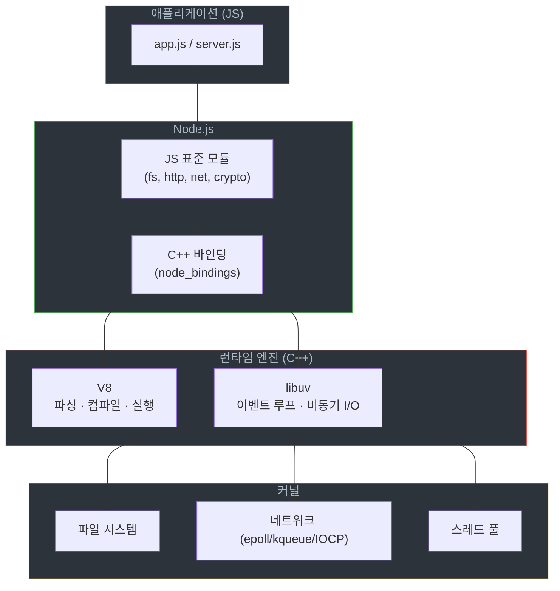
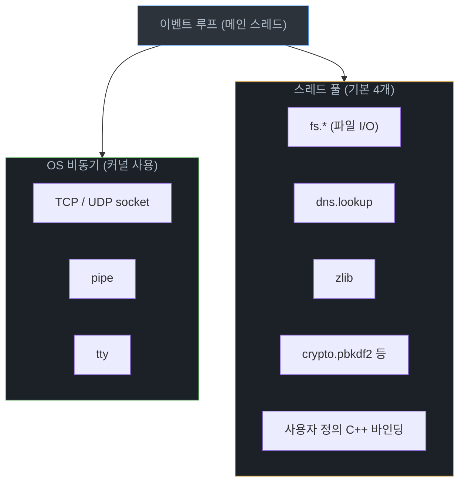
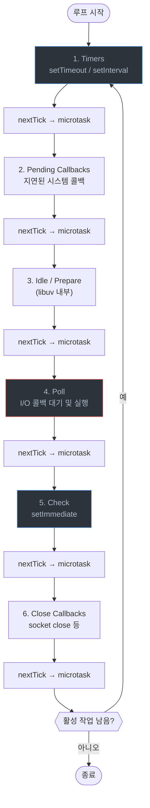

# Node.js 구조와 작동 원리

## 정의

Node.js는 V8 JavaScript 엔진과 libuv를 묶어 만든 서버용 자바스크립트 런타임이다. 브라우저 밖에서 자바스크립트를 돌리고, libuv가 제공하는 이벤트 루프와 비동기 I/O 모델로 동시 요청을 처리한다.

서버를 만들 때 자주 나오는 표현 — "싱글 스레드인데 어떻게 동시 요청을 잘 처리하나" — 의 답이 이 문서의 본 내용이다. 정답은 "자바스크립트 실행 자체는 싱글 스레드지만, I/O는 libuv가 OS의 비동기 메커니즘이나 스레드 풀로 처리한다"이다.

## 전체 계층 구조

자바스크립트 한 줄이 실행되기까지 거치는 계층을 먼저 잡고 가야 한다.



`fs.readFile()` 한 줄을 호출하면 다음과 같은 흐름을 탄다.

1. JS 레이어에서 `fs.readFile` 호출
2. C++ 바인딩이 libuv에 작업 등록
3. libuv가 스레드 풀에 작업 dispatch (파일 I/O는 OS가 비동기를 지원하지 않으므로)
4. 워커 스레드가 OS의 동기 `read()` 시스템 콜로 데이터를 읽음
5. 완료되면 libuv가 메인 이벤트 루프의 콜백 큐에 결과 enqueue
6. 이벤트 루프가 콜백을 꺼내 V8 위에서 실행

핵심은 "자바스크립트가 실행되는 스레드는 한 개뿐"이라는 것과 "I/O를 처리하는 스레드는 별개"라는 것이다.

## V8 엔진

### 파이프라인

V8은 자바스크립트를 한 번에 기계어로 컴파일하지 않는다. 시작 지연을 줄이기 위해 두 단계로 나눠 동작한다.


처음 진입하는 함수는 Ignition이 바이트코드로 만들어 인터프리터로 돌린다. 호출 빈도와 실행 패턴(인자 타입, 분기 결과)을 누적하다가 Hot 함수가 되면 TurboFan이 그 함수만 기계어로 컴파일한다. 컴파일 시점에 "이 인자는 항상 정수"같은 가정을 박아서 최적화한다.

### 최적화 해제 (Deoptimization)

TurboFan이 박은 가정이 깨지면 V8은 그 함수의 컴파일된 코드를 버리고 다시 바이트코드로 돌아간다. 실무에서 가장 자주 만나는 deopt 원인:

```javascript
// 좋지 않은 예 — 같은 자리에 다른 타입이 들어온다
function add(a, b) {
    return a + b;
}

add(1, 2);          // number, number → TurboFan이 정수 덧셈으로 최적화
add('hello', 'x');  // string, string → 가정 깨짐, deopt 발생
add(1.5, 2.5);      // float → 또 한 번 deopt
```

JSON 응답처럼 외부에서 들어온 데이터를 그대로 핫 패스에 흘려보내면 같은 필드에 string·number·undefined가 섞여 들어오기 쉽다. API 게이트웨이의 검증 로직이 사라진 직후 latency가 미세하게 올라가는 현상을 경험한 적이 있는데, 원인이 바로 이거였다.

진단할 때 쓰는 옵션:

```bash
# 어떤 함수가 deopt되는지 출력
node --trace-deopt server.js

# TurboFan 최적화 결정도 같이 보고 싶을 때
node --trace-opt --trace-deopt server.js
```

### V8 메모리 한계

V8은 자체 힙을 갖고 있고, 기본 상한이 있다. 64bit 기준 Old Generation 기본 한도는 약 1.4GB ~ 2GB(버전마다 다르다). 큰 페이로드를 메모리에 올리는 서비스(이미지 변환, 큰 JSON 파싱)에서는 자주 부딪힌다.

```bash
# 4GB로 늘림
node --max-old-space-size=4096 server.js
```

OOM이 떨어지면 메시지가 명확하다.

```
<--- Last few GCs --->
[12345:0x...] 12345 ms: Mark-sweep 1396.4 (1434.9) -> 1396.3 (1434.9) MB, 1234.5 / 0.0 ms ...
FATAL ERROR: Reached heap limit Allocation failed - JavaScript heap out of memory
```

이걸 보면 GC가 회수하지 못해 한계에 닿았다는 뜻이다. 무조건 힙 크기를 늘리지 말고 먼저 누수를 의심해야 한다.

## libuv

### 역할 분리

libuv가 처리하는 비동기 작업은 두 종류로 갈린다. 이 구분을 모르면 "왜 같은 비동기인데 어떤 건 빠르고 어떤 건 스레드 풀에 줄을 서나"가 설명되지 않는다.



**커널 비동기로 처리되는 작업**은 OS의 epoll(Linux) / kqueue(macOS, BSD) / IOCP(Windows)를 직접 쓴다. 네트워크 소켓이 대표적이다. 메인 스레드가 한 번에 수천 개의 소켓을 감시할 수 있어서, Node.js로 동시 접속 만 개를 처리해도 스레드는 거의 늘지 않는다.

**스레드 풀로 처리되는 작업**은 커널이 비동기 인터페이스를 안 주는 영역이다. POSIX `read()`는 본질적으로 블로킹이라서, 파일 시스템 호출은 어쩔 수 없이 워커 스레드 안에서 동기 호출로 실행한 뒤 결과만 메인 루프로 던진다. DNS의 `dns.lookup`도 내부적으로 `getaddrinfo`라는 동기 시스템 콜이라 스레드 풀을 쓴다. 반대로 `dns.resolve`는 자체 UDP 소켓으로 네트워크 비동기를 쓰니 스레드 풀을 점유하지 않는다.

### 스레드 풀 고갈

기본 스레드 풀 크기는 4다. `UV_THREADPOOL_SIZE` 환경 변수로 1024까지 늘릴 수 있다.

```bash
UV_THREADPOOL_SIZE=16 node server.js
```

4개라는 숫자가 실무에서 문제를 일으키는 패턴이 두 가지 있다.

**패턴 1 — 파일 I/O 대량 발행**. 첨부 파일 업로드 API에서 디스크 쓰기 4개가 동시에 진행 중이면, 다음 fs 호출은 워커가 빌 때까지 큐에서 대기한다. 응답 지연이 P99에서만 튀는데 원인이 보이지 않을 때 한번 의심해볼 만하다.

**패턴 2 — 동기 암호화 호출**. `crypto.pbkdf2`, `bcrypt`, `crypto.scrypt` 같은 함수는 스레드 풀을 점유한다. 로그인 폭주 시점에 fs 콜백이 같이 느려지는 현상이 나타난다.

진단할 때는 워커 점유를 그래프로 보고 싶다. `eventloop-utilization`을 직접 측정하거나, `perf_hooks`를 쓴다.

```javascript
const { performance, PerformanceObserver } = require('perf_hooks');

const obs = new PerformanceObserver((items) => {
    items.getEntries().forEach((entry) => {
        if (entry.duration > 100) {
            console.warn(`느린 작업: ${entry.name} ${entry.duration}ms`);
        }
    });
});
obs.observe({ entryTypes: ['function'] });
```

## 이벤트 루프 단계

### 6단계 + 마이크로태스크

libuv의 이벤트 루프는 정해진 단계(phase)를 순서대로 돈다. 각 단계 사이에 `process.nextTick` 큐와 마이크로태스크(Promise then/catch/finally) 큐가 비워진다.



각 단계의 의미를 짚어본다.

**Timers** — `setTimeout(fn, delay)`의 `delay`는 최소 대기 시간이지 정확한 발화 시점이 아니다. 직전 단계에서 무거운 콜백이 돌면 그만큼 늦게 실행된다. 1ms 단위 타이머가 정확히 1ms마다 돌 거라고 가정하는 코드는 운영 환경에서 깨진다.

**Pending Callbacks** — 일부 시스템 호출에서 다음 루프로 미뤄진 콜백이 처리되는 단계다. 직접 신경 쓸 일은 거의 없다.

**Idle / Prepare** — libuv 내부용. 무시해도 된다.

**Poll** — 가장 중요한 단계다. 이 단계에서 새 I/O 이벤트를 수집하고 콜백을 실행한다. 처리할 콜백이 없고 등록된 `setImmediate`도 없으면, 다음 타이머가 만료될 때까지 여기서 블로킹된다. 즉 idle 상태의 Node.js 프로세스는 Poll에서 잠들어 있다.

**Check** — `setImmediate` 콜백. Poll 직후에 실행된다.

**Close Callbacks** — `socket.on('close')`, `process.on('exit')`이 아닌 핸들의 종료 콜백 등.

### setTimeout(fn, 0) vs setImmediate

이 둘의 차이는 면접 단골이지만 실무에서도 가끔 헷갈린다.

```javascript
// 메인 모듈에서 직접 호출하면 순서는 결정되지 않음
setTimeout(() => console.log('timeout'), 0);
setImmediate(() => console.log('immediate'));
```

위 코드의 출력 순서는 V8과 libuv가 루프에 진입하는 타이밍에 따라 갈린다. 두 번 다 immediate가 먼저일 때도 있고 timeout이 먼저일 때도 있다.

```javascript
// I/O 콜백 안에서는 항상 immediate가 먼저
const fs = require('fs');
fs.readFile(__filename, () => {
    setTimeout(() => console.log('timeout'), 0);
    setImmediate(() => console.log('immediate'));
});
// → immediate, timeout 순서 보장
```

I/O 콜백은 Poll 단계 안에서 실행되니, 그 뒤에 바로 오는 단계가 Check다. 따라서 `setImmediate`가 항상 먼저 실행된다. I/O 후속 작업을 다음 틱으로 미루고 싶을 때는 `setTimeout(fn, 0)` 대신 `setImmediate(fn)`을 쓰는 게 정해진 동작을 얻는 방법이다.

### nextTick과 Promise

`process.nextTick`은 단계 사이가 아니라 "현재 작업이 끝나는 즉시" 실행된다. 마이크로태스크 큐보다도 먼저다.

```javascript
console.log('1');

setImmediate(() => console.log('2 immediate'));

Promise.resolve().then(() => console.log('3 promise'));

process.nextTick(() => console.log('4 nextTick'));

console.log('5');

// 출력: 1, 5, 4 nextTick, 3 promise, 2 immediate
```

`nextTick`을 재귀적으로 호출하면 이벤트 루프가 다음 단계로 못 넘어간다. I/O가 굶는다(I/O starvation). 그래서 `nextTick`은 "다음 동기 작업으로 미루기" 용도로만 쓰고, 반복 작업에는 `setImmediate`나 `setTimeout`을 쓴다.

## 블로킹 작업: 실제로 일어나는 일

### 동기 함수 한 줄이 모든 요청을 멈춘다

자바스크립트가 싱글 스레드라는 말은 "이벤트 루프 스레드가 자바스크립트를 실행하는 동안 다른 콜백을 못 돌린다"는 뜻이다. 동기 호출이 100ms 걸리면, 그 100ms 동안 들어온 요청은 전부 큐에 쌓인다.

```javascript
const http = require('http');
const fs = require('fs');

http.createServer((req, res) => {
    // 잘못된 코드 — 모든 요청이 이 동기 호출에서 직렬화된다
    const data = fs.readFileSync('/var/log/app.log', 'utf8');
    res.end(data);
}).listen(3000);
```

위 코드는 RPS가 낮을 때는 멀쩡해 보이다가, 동시 요청이 늘기 시작하면 갑자기 응답이 줄을 서기 시작한다. `fs.readFileSync` 대신 `fs.readFile`(콜백) 또는 `fs.promises.readFile`(Promise)을 쓰면 워커 스레드가 일하는 동안 메인 루프는 다른 요청을 받을 수 있다.

흔한 동기 함정 목록:

- `fs.readFileSync`, `fs.writeFileSync` 등 `*Sync` 접미사
- `JSON.parse`, `JSON.stringify` (큰 페이로드일 때)
- 정규식 — 특히 catastrophic backtracking이 일어나는 패턴
- 큰 배열의 `sort`, `reduce` 같은 동기 순회
- `crypto.createHash().update().digest()` 동기 형태

`JSON.parse`는 비동기 대안이 없다. 1MB 페이로드는 큰 문제 아니지만, 수십 MB짜리를 매 요청에서 파싱하면 latency가 흔들린다. 그럴 땐 `stream-json` 같은 스트리밍 파서를 쓰거나, 워커 스레드로 옮긴다.

### 이벤트 루프 지연 측정

루프가 얼마나 밀리고 있는지는 직접 측정해야 보인다. Node.js 11부터 `perf_hooks.monitorEventLoopDelay`가 제공된다.

```javascript
const { monitorEventLoopDelay } = require('perf_hooks');

const h = monitorEventLoopDelay({ resolution: 20 });
h.enable();

setInterval(() => {
    console.log({
        min: h.min / 1e6,         // ns → ms
        max: h.max / 1e6,
        mean: h.mean / 1e6,
        p99: h.percentile(99) / 1e6,
    });
    h.reset();
}, 5000);
```

`mean`이 수십 ms, `p99`가 수백 ms를 넘기면 어딘가에서 루프가 막히고 있다는 신호다. APM(Datadog, New Relic 등)에도 동일한 지표가 있다.

## CPU 집약 작업: Worker Threads로 분리

### 왜 분리해야 하나

이미지 리사이즈, 비밀번호 해싱, 큰 데이터 압축 — 이런 CPU 작업은 비동기 API가 있어도 결국 libuv 스레드 풀을 점유한다. 게다가 자바스크립트 코드 자체가 CPU를 오래 잡으면(예: 백만 건 정렬) 메인 루프가 통째로 막힌다.

해결책은 Worker Threads다. Node.js 10.5에서 실험적으로 들어왔고 12부터 안정화됐다. 별도 V8 인스턴스를 자식 스레드로 띄워서, 그 스레드 안에서 자바스크립트를 실행한다. 메인 루프와 메모리·이벤트 루프가 분리되므로 워커가 CPU를 100% 써도 메인은 멀쩡하다.

### 기본 패턴

```javascript
// main.js
const { Worker } = require('worker_threads');

function runHeavyTask(payload) {
    return new Promise((resolve, reject) => {
        const worker = new Worker('./heavy-worker.js', {
            workerData: payload,
        });
        worker.on('message', resolve);
        worker.on('error', reject);
        worker.on('exit', (code) => {
            if (code !== 0) {
                reject(new Error(`Worker exited with code ${code}`));
            }
        });
    });
}

const http = require('http');
http.createServer(async (req, res) => {
    try {
        const result = await runHeavyTask({ size: 1_000_000 });
        res.end(JSON.stringify(result));
    } catch (err) {
        res.statusCode = 500;
        res.end(err.message);
    }
}).listen(3000);
```

```javascript
// heavy-worker.js
const { parentPort, workerData } = require('worker_threads');

const arr = Array.from({ length: workerData.size }, () => Math.random());
arr.sort();
const sum = arr.reduce((a, b) => a + b, 0);

parentPort.postMessage({ count: arr.length, sum });
```

요청마다 Worker를 새로 띄우면 생성 비용(약 수십 ms)이 부담된다. 운영에서는 워커 풀을 미리 만들어두고 작업을 분배한다. `piscina` 라이브러리가 이 풀링을 잘 다듬어 놨다.

```javascript
const Piscina = require('piscina');
const pool = new Piscina({ filename: __dirname + '/heavy-worker.js' });

http.createServer(async (req, res) => {
    const result = await pool.run({ size: 1_000_000 });
    res.end(JSON.stringify(result));
}).listen(3000);
```

### SharedArrayBuffer로 복사 비용 줄이기

`postMessage`는 기본적으로 데이터를 직렬화(structured clone)해서 보낸다. 큰 Buffer를 매번 복사하면 그 자체로 부하가 생긴다. 두 가지 회피 방법이 있다.

1. **Transferable** — `ArrayBuffer`를 `transferList`로 넘기면 소유권만 이동한다. 복사 없음. 단, 보낸 쪽에서는 그 버퍼를 더 쓸 수 없다.
2. **SharedArrayBuffer** — 메인과 워커가 같은 메모리를 공유한다. `Atomics`로 동기화한다.

```javascript
const { Worker } = require('worker_threads');

const sharedBuffer = new SharedArrayBuffer(1024 * 1024);
const sharedView = new Int32Array(sharedBuffer);

const worker = new Worker('./worker.js', { workerData: sharedBuffer });
// 메인과 워커가 sharedView를 동시에 본다
```

공유 메모리는 자바스크립트답지 않은 문제(race condition)를 만들 수 있다. 정말 큰 데이터를 빈번하게 주고받는 게 아니면 transferable이 안전하다.

## 클러스터링: 멀티 코어 활용

Worker Threads가 한 프로세스 안에서 CPU를 쪼개는 방식이라면, 클러스터는 같은 코드를 여러 프로세스로 띄워 코어 수만큼 병렬화하는 방식이다. 두 방식은 충돌하지 않고, 보통 함께 쓴다.

```javascript
const cluster = require('cluster');
const os = require('os');

if (cluster.isPrimary) {
    const cpuCount = os.availableParallelism();
    for (let i = 0; i < cpuCount; i++) {
        cluster.fork();
    }

    cluster.on('exit', (worker, code, signal) => {
        console.log(`worker ${worker.process.pid} died (${signal || code})`);
        cluster.fork();
    });
} else {
    require('./server'); // 실제 HTTP 서버 코드
}
```

리눅스 커널이 `SO_REUSEPORT`로 같은 포트의 들어오는 연결을 워커 프로세스에 분배한다. PM2, Kubernetes의 HPA, AWS ECS의 Service Auto Scaling 등이 비슷한 일을 더 정교하게 한다.

운영에서는 클러스터 대신 컨테이너 한 개당 Node.js 한 프로세스를 띄우고, 컨테이너 수를 늘리는 방식이 점점 표준이 됐다. 메모리 격리와 OOM 대응이 깔끔하다.

## 운영에서 자주 만나는 문제

### 메모리 누수

전형적인 패턴:

- 모듈 전역 캐시(`Map`/`Object`)에 키를 계속 추가하고 만료 안 함
- `EventEmitter`에 리스너 등록만 하고 `off`/`removeListener` 안 함 → 경고: `MaxListenersExceededWarning`
- closure에서 큰 객체를 잡고 setTimeout/setInterval로 유지

진단은 힙 스냅샷이 정석이다.

```bash
node --inspect server.js
# 크롬에서 chrome://inspect → Memory 탭 → Heap snapshot
```

운영 중인 프로세스에서 스냅샷을 뜨고 싶으면 `v8.writeHeapSnapshot()`을 시그널 핸들러에 걸어두는 방법이 있다.

```javascript
const v8 = require('v8');
process.on('SIGUSR2', () => {
    const file = `/tmp/heap-${process.pid}-${Date.now()}.heapsnapshot`;
    v8.writeHeapSnapshot(file);
    console.log('snapshot written:', file);
});
```

### Unhandled Promise Rejection

Node.js 15부터 처리되지 않은 Promise rejection은 프로세스를 종료시키는 게 기본 동작이 됐다. 컨테이너 환경에서는 좋은 기본값이지만, 개발 중에는 어디서 던졌는지 추적하기 어렵다.

```javascript
process.on('unhandledRejection', (reason, promise) => {
    console.error('Unhandled Rejection:', reason);
    // 의도적으로 종료 — 프로세스 매니저가 재시작하게 둠
    process.exit(1);
});
```

`async` 함수를 호출하면서 `await`이나 `.catch`를 안 붙이면 거의 다 이 경로로 떨어진다. 라이브러리 코드에서 fire-and-forget 패턴을 쓰면 잘 안 보이는 곳에 누락이 생긴다.

### Graceful Shutdown

배포·스케일 아웃이 잦은 환경에서는 SIGTERM이 자주 들어온다. 진행 중인 요청을 끊지 않고 종료하려면:

```javascript
const server = http.createServer(handler);
server.listen(3000);

function shutdown() {
    server.close((err) => {
        if (err) {
            console.error('close error', err);
            process.exit(1);
        }
        process.exit(0);
    });
    // 안전망 — 정해진 시간 안에 안 닫히면 강제 종료
    setTimeout(() => process.exit(1), 10_000).unref();
}

process.on('SIGTERM', shutdown);
process.on('SIGINT', shutdown);
```

`server.close()`는 새 연결만 거부하고 기존 연결은 끝날 때까지 기다린다. keep-alive 연결이 많으면 영영 안 닫힐 수도 있어서 위 타임아웃이 필요하다.

## 자주 헷갈리는 지점 정리

**Q. Node.js는 정말 싱글 스레드인가?**
자바스크립트 실행 스레드 한 개 + libuv 스레드 풀(기본 4개) + V8 백그라운드 스레드(GC, 컴파일러) 등이 같이 돈다. "자바스크립트 코드는 싱글 스레드에서 돈다"가 정확한 표현이다.

**Q. `fs.readFile`은 정말 비동기인가?**
콜백을 받지만 내부적으로는 libuv 스레드 풀의 워커가 동기 `read()`로 처리한다. 메인 루프에서 볼 때 비동기지, OS 관점에서는 동기 호출이다.

**Q. `dns.lookup`과 `dns.resolve`의 차이는?**
`dns.lookup`은 OS의 `getaddrinfo`를 호출하므로 스레드 풀을 쓴다. `dns.resolve`는 직접 DNS 서버에 네트워크 쿼리를 보내므로 커널 비동기(epoll 등)를 쓴다. 대량 DNS 조회가 필요한 서비스에서 스레드 풀이 막히면 `dns.resolve`로 바꾸는 것을 고려할 만하다.

**Q. setImmediate와 setTimeout(fn, 0) 중 뭐가 빠른가?**
I/O 콜백 안에서는 `setImmediate`가 빠르다. 그 외 컨텍스트에서는 보장되지 않는다. 의도가 "다음 틱 실행"이면 `setImmediate`를 쓰는 게 옳다.

**Q. CPU 작업은 무조건 Worker Threads로 빼야 하나?**
짧은 CPU 작업(수 ms 이내)은 메인 스레드에서 그냥 돌리는 게 빠르다. Worker 생성·메시지 패싱 오버헤드가 있다. 100ms를 넘기는 작업, 또는 같은 요청에서 여러 번 도는 작업이라면 분리할 가치가 있다.

## 참고

- [Node.js 공식 문서 — Event Loop](https://nodejs.org/en/learn/asynchronous-work/event-loop-timers-and-nexttick)
- [libuv 디자인 개요](http://docs.libuv.org/en/v1.x/design.html)
- [V8 — Ignition and TurboFan 개요](https://v8.dev/docs)
- [Node.js Worker Threads](https://nodejs.org/api/worker_threads.html)
