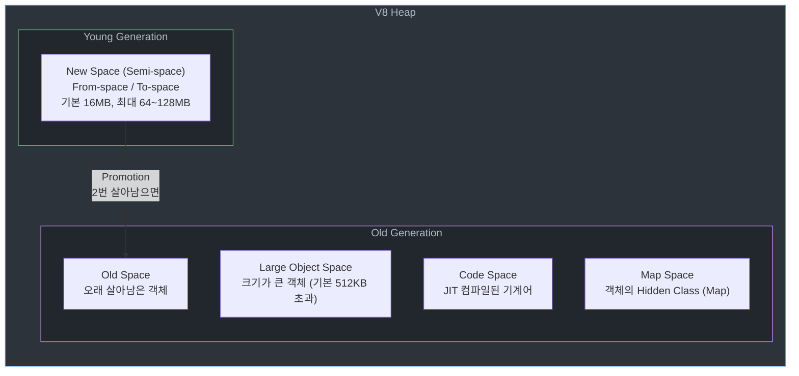

# Node.js 메모리 영역

## 배경

Node.js 프로세스가 물리 메모리를 어떻게 나눠 쓰는지 모르면 `process.memoryUsage()`가 찍어주는 숫자도, 컨테이너가 OOMKilled 되는 이유도 설명하지 못한다. 실제로 `heapUsed`는 200MB밖에 안 찍히는데 RSS는 1.5GB를 찍고 있어서 쿠버네티스 limit에 걸려 죽는 사례가 흔하다. 이 문서는 V8이 관리하는 힙 영역, V8 바깥에서 할당되는 외부 메모리, 그리고 이 둘을 합쳐 OS에 보이는 RSS가 어떻게 만들어지는지 정리한다.

Node.js의 메모리는 크게 네 덩어리로 본다.

- V8이 관리하는 JavaScript 힙 (New/Old/Large Object/Code/Map Space)
- V8이 관리하는 스택 (함수 호출 프레임)
- V8 바깥에서 할당되는 외부 메모리 (C++ 객체, Buffer, ArrayBuffer, 네이티브 애드온)
- Node.js 실행 파일·공유 라이브러리·메모리 매핑된 파일이 차지하는 영역

이 네 가지 합이 대략 RSS로 잡힌다고 보면 된다.

## 핵심

### V8 힙의 전체 구조

V8은 JavaScript 객체를 힙에 올려놓고 가비지 컬렉터(GC)로 관리한다. 힙은 성격이 다른 여러 영역(Space)으로 쪼개져 있고, 각 영역마다 GC 전략이 다르다.



객체가 처음 할당되면 거의 무조건 New Space에 들어간다. New Space에서 살아남은 객체만 Old Space로 승격(Promotion)된다. 대부분의 객체는 짧게 살다 사라진다는 "세대 가설(Generational Hypothesis)"이 V8 GC 설계의 출발점이다.

### New Space (Semi-space)

Young Generation이라고 부르기도 한다. 새로 만들어진 객체가 처음 할당되는 곳이다.

내부적으로는 From-space와 To-space라는 두 개의 반쪽으로 쪼개져 있다. 할당은 From-space에서만 일어나고, GC가 돌면 From-space에서 아직 참조되는 객체만 To-space로 복사한 뒤 두 공간의 역할을 맞바꾼다. 이게 Scavenge(스캐빈지) 알고리즘이다.

New Space는 의도적으로 작게 잡혀 있다. 기본값은 보통 16MB(반쪽은 8MB)이고, `--max-semi-space-size`로 반쪽 크기를 조절한다. 작기 때문에 Scavenge 한 번이 수 ms 안에 끝난다.

```bash
# 반쪽(semi-space) 크기를 64MB로 확장 → 총 New Space 128MB
node --max-semi-space-size=64 app.js
```

세미스페이스를 무작정 늘리면 Scavenge가 길어진다. 반대로 너무 작으면 승격이 자주 일어나 Old GC 부담이 커진다. 할당이 많은 서버에서는 32~64MB 정도로 올리는 게 경험적으로 무난했다.

### Old Space

Young Generation에서 두 번 살아남은 객체가 옮겨지는 곳이다. 실제 서비스의 워킹셋(오래 살아 있는 캐시, 커넥션 풀, 장수 객체)은 대부분 여기 쌓인다.

Old Space는 Mark-Sweep-Compact 알고리즘으로 수거된다. 전체를 훑어야 하므로 Scavenge보다 훨씬 느리고, 멈춤(stop-the-world)이 길어진다. V8은 이걸 완화하려고 Incremental Marking, Concurrent Marking, Lazy Sweeping 같은 기법을 쓴다.

기본 Old Space 최대 크기가 바로 그 유명한 "1.7GB 한계"의 정체다. 정확히는 64비트 빌드에서 기본 ~1400MB~1700MB 정도이고, `--max-old-space-size`로 변경한다.

```bash
# Old Space 최대 4GB로 확장
node --max-old-space-size=4096 app.js
```

컨테이너에서 돌릴 때는 반드시 이 값을 컨테이너 메모리 제한보다 낮게 잡아야 한다. 예를 들어 pod limit이 2GB인데 `--max-old-space-size=4096`을 주면 V8이 힙을 4GB까지 키우려다가 OOMKilled로 죽는다. 경험상 limit의 60~75% 정도를 주는 게 안전하다.

### Large Object Space

크기가 커서 New Space에 넣기 부적절한 객체는 처음부터 Large Object Space로 직행한다. 기본 임계값은 약 512KB다.

큰 문자열, 큰 배열, 큰 Buffer(힙 내부 Buffer에 한정), 큰 TypedArray 같은 게 여기 들어간다. Large Object Space는 Mark-Sweep만 돌고 Compact(압축)는 하지 않는다. 큰 객체를 이동시키는 비용이 너무 크기 때문이다. 그래서 이 영역은 조각화(fragmentation)에 취약하다.

대용량 페이로드를 한 번에 들고 있는 서버는 이 영역에서 파편화가 쌓이면서 힙 사용량은 그대로인데 heapTotal만 계속 커지는 패턴을 보이기도 한다.

### Code Space

V8의 JIT 컴파일러(TurboFan, Maglev 등)가 만들어낸 기계어가 저장되는 영역이다. 일반 데이터와 달리 실행 권한(executable)이 붙은 페이지에 들어간다.

평범한 웹 서버라면 Code Space는 수십 MB 수준에 머문다. 다만 동적으로 Function 생성자나 eval을 많이 쓰면 여기가 계속 늘어날 수 있다. 템플릿 엔진이나 룰 엔진 중에 함수를 동적 생성하는 구현을 쓸 때 조용히 누적되는 경우가 있다.

### Map Space

V8이 내부적으로 객체의 "Hidden Class"(V8 용어로는 Map)를 저장하는 공간이다. 객체의 프로퍼티 구조(shape)를 설명하는 메타데이터다.

같은 구조의 객체를 반복해서 만들면 Map이 공유되므로 Map Space는 거의 안 늘어난다. 반대로 객체마다 프로퍼티 키 순서나 개수가 다르면(이른바 polymorphic한 코드) Map이 계속 새로 만들어져서 Map Space와 최적화 성능 둘 다 망가진다.

### 스택 영역

V8은 힙과 별개로 네이티브 스레드마다 호출 스택을 가진다. 함수 호출 프레임, 지역 변수의 포인터, 레지스터 저장 영역이 여기 들어간다.

Node.js의 메인 스레드 스택은 기본 약 984KB 정도로 작다. 깊은 재귀가 터지면 `RangeError: Maximum call stack size exceeded`가 발생한다. 필요하면 `--stack-size`로 KB 단위 조정이 가능하지만, 보통은 재귀를 반복문/트램펄린/스택 자료구조로 바꾸는 게 정답이다.

주의할 점은 스택 크기 제한이 "V8 스택" 기준이라는 것이다. OS의 스레드 스택(보통 8MB)과는 다른 층위다.

### 외부 메모리 (External / Off-heap)

여기서부터가 `heapUsed`에 안 잡히는 영역이다. 실무에서 메모리 이슈의 상당수가 여기서 나온다.

대표적인 예.

- `Buffer.allocUnsafe(size)` / `Buffer.alloc(size)` — 크기가 크면 V8 힙 바깥에서 할당된다.
- `ArrayBuffer`, `SharedArrayBuffer` — 백업 스토어는 힙 바깥이다.
- `zlib`, `crypto`, `http-parser` 같은 C++ 바인딩이 내부적으로 들고 있는 메모리.
- 네이티브 애드온(N-API)이 `malloc`으로 잡아두는 메모리.

이 영역은 V8 GC가 직접 관리하지 않는다. JavaScript 쪽 참조가 끊겼을 때 V8이 C++ 핸들러(finalizer, weak reference)를 통해 해제를 지시하는 구조다. 그래서 해제 시점이 JS 객체 수거 시점과 약간 어긋나고, 네이티브 측 구현에 버그가 있으면 참조가 끊겨도 메모리가 안 빠진다.

```javascript
// 1MB Buffer 1만 개 — heapUsed는 거의 안 늘고 external이 치솟는다
const bufs = [];
for (let i = 0; i < 10000; i++) {
  bufs.push(Buffer.alloc(1024 * 1024));
}
console.log(process.memoryUsage());
// {
//   rss:          ~10.5 GB,
//   heapTotal:     ~30 MB,
//   heapUsed:      ~20 MB,
//   external:      ~10 GB,
//   arrayBuffers:  ~10 GB
// }
```

"힙은 충분한데 왜 OOM이 나지?"라는 질문의 답은 대부분 여기 있다.

### process.memoryUsage() 필드 해석

서버에 메트릭을 꽂을 때 이 필드들이 뭘 의미하는지 정확히 알아야 한다.

```javascript
const u = process.memoryUsage();
console.log(u);
// {
//   rss: 54853632,
//   heapTotal: 7159808,
//   heapUsed: 4455192,
//   external: 1089863,
//   arrayBuffers: 10515
// }
```

- **rss (Resident Set Size)**: OS 기준으로 이 프로세스가 점유 중인 물리 메모리. 힙 + 스택 + 외부 메모리 + 코드/공유 라이브러리 매핑까지 다 포함된다. 컨테이너 OOMKilled 판단 기준이 바로 이 값이다.
- **heapTotal**: V8이 확보해둔 힙 전체 크기. 실제 사용 중인 양이 아니라 "이만큼까지는 언제든 쓸 수 있게 잡아놨다"는 예약 크기에 가깝다. GC 후에도 OS로 반환되지 않고 V8이 내부적으로 쥐고 있는 경우가 많다.
- **heapUsed**: V8 힙 안에서 실제로 사용 중인 바이트. JavaScript 객체, 문자열, 클로저 등이 여기 잡힌다. 메모리 누수 조사 시 가장 먼저 보는 값.
- **external**: V8 힙 외부에서 C++ 객체가 관리하는 메모리. Buffer의 기반 스토어, ArrayBuffer 백업, zlib/crypto 내부 버퍼 등이 여기에 합산된다.
- **arrayBuffers**: `external`의 부분집합으로, ArrayBuffer와 SharedArrayBuffer가 차지하는 양만 따로 뽑아준다. Node.js 13에서 추가됐다.

주의할 포인트.

1. `heapUsed < heapTotal < rss`가 정상이다. 반대면 뭔가 이상하다.
2. `external`이 `heapUsed`보다 훨씬 큰 건 Buffer/ArrayBuffer를 많이 쓰는 서버에서 자연스럽다. 업로드/다운로드, 이미지 처리, 압축 서버가 그렇다.
3. `rss - heapTotal - external`이 비정상적으로 크면 네이티브 애드온이나 메모리 매핑 파일을 의심해야 한다.
4. 멀티 스레드(Worker Threads, cluster)를 쓸 때 `process.memoryUsage()`는 해당 워커/프로세스의 값만 보여준다. 전체 RSS 합산이 OS가 보는 값이다.

### GC 동작 방식

V8 GC는 두 가지 축으로 나뉜다. Generation(세대)과 알고리즘.

**Scavenge (Minor GC)**

- Young Generation 전용.
- Cheney의 복사 알고리즘. 살아남은 객체만 To-space로 복사하고 From-space를 통째로 비운다.
- 짧고 자주 돈다. 수 ms 이내.
- 두 번 살아남으면 Old Generation으로 승격.

**Mark-Sweep-Compact (Major GC)**

- Old Generation 전용.
- 세 단계. Mark(루트부터 도달 가능한 객체 표시) → Sweep(미표시 객체를 해제) → Compact(파편화 영역을 압축).
- 한 번에 다 하면 수백 ms~수 초가 걸려 서비스가 멈춘다.

**Incremental Marking**

- Mark 단계를 작은 조각으로 쪼개 JavaScript 실행과 번갈아 수행한다.
- 한 번의 멈춤을 여러 번의 짧은 멈춤으로 분산시키는 기법.

**Concurrent Marking / Sweeping**

- 별도 헬퍼 스레드에서 Mark나 Sweep을 수행. 메인 스레드가 JS를 실행하는 동안 병렬로 진행된다.
- 최신 V8 기본 기능.

**Idle-time GC**

- 이벤트 루프가 놀고 있는 틈을 활용해 GC 작업을 조금씩 해치운다.

Major GC가 튀면 p99 응답시간이 갑자기 튄다. `--trace-gc`로 로그를 찍어보면 Scavenge는 `[Scavenge]`, Major는 `[Mark-sweep]`로 구분된다.

```bash
node --trace-gc app.js 2>&1 | grep 'Mark-sweep'
# [123:0x...] 12345 ms: Mark-sweep 1024.0 (1100.0) -> 500.0 (1100.0) MB, 300.0 / 0.0 ms  ...
```

앞뒤 숫자를 보면 수거 전/후 힙 크기, 걸린 시간이 다 나온다. 수백 ms짜리 Major GC가 자주 찍히면 힙이 너무 크거나 누수가 쌓이고 있다는 신호다.

### 메모리 관련 V8 플래그

실무에서 자주 만지는 것만 추린다.

| 플래그 | 의미 | 경험적 기준 |
|---|---|---|
| `--max-old-space-size=<MB>` | Old Space 최대 크기 | 컨테이너 limit의 60~75% |
| `--max-semi-space-size=<MB>` | New Space 반쪽 크기 | 32~64 (할당 많은 서버) |
| `--max-http-header-size=<bytes>` | HTTP 헤더 최대 크기 | 기본 16KB, 쿠키 큰 경우 확장 |
| `--stack-size=<KB>` | 메인 스레드 스택 크기 | 기본 ~984KB |
| `--expose-gc` | `global.gc()` 수동 호출 허용 | 프로덕션 사용 지양, 테스트/프로파일링용 |
| `--trace-gc` | 모든 GC 로그 출력 | 사고 조사 시 |
| `--trace-gc-verbose` | 영역별 상세 GC 로그 | 정밀 분석용 |
| `--heap-prof` | 힙 프로파일 자동 수집 | 누수 조사 시 |

`--max-old-space-size`는 Dockerfile이나 런타임 환경변수로 박아두는 편이 좋다.

```bash
# pod memory limit 2Gi 환경
NODE_OPTIONS="--max-old-space-size=1400" node app.js
```

`NODE_OPTIONS`로 주면 자식 프로세스(`child_process.fork`, `worker_threads`)에도 전파된다.

### 메모리 누수 실무 사례

Node.js 서비스에서 반복적으로 마주친 누수 패턴이다.

**1) 끊기지 않는 클로저**

```javascript
function createHandler() {
  const huge = new Array(1e6).fill('data'); // 8MB 정도
  return function handler(req, res) {
    // huge는 안 쓰는데 클로저가 참조를 잡고 있다
    res.end('ok');
  };
}
```

핸들러를 반환할 때 외부 스코프의 큰 변수가 같이 참조 체인에 묶여 해제되지 않는 경우. V8이 "사용되지 않는 변수는 클로저에서 제거" 최적화를 하긴 하지만, `eval`이나 `with`, `debugger`가 끼면 최적화가 꺼진다.

**2) 제거되지 않는 이벤트 리스너**

```javascript
// 요청마다 리스너를 붙이는데 떼지 않는다
server.on('connection', (socket) => {
  eventBus.on('broadcast', (msg) => socket.write(msg));
  // socket이 닫혀도 eventBus가 참조를 계속 잡음
});
```

EventEmitter는 기본 리스너 10개를 넘기면 `MaxListenersExceededWarning`을 띄운다. 이 경고가 뜨면 십중팔구 누수다. `once`, `removeListener`, `AbortSignal`로 해제 시점을 명확히 해야 한다.

**3) 경계 없는 전역 캐시**

```javascript
const cache = new Map();
app.get('/user/:id', (req, res) => {
  if (!cache.has(req.params.id)) {
    cache.set(req.params.id, fetchUser(req.params.id));
  }
  res.json(cache.get(req.params.id));
});
```

아이디 수만큼 영구히 쌓인다. LRU 캐시(`lru-cache`)로 최대 크기나 TTL을 반드시 걸어야 한다. `WeakMap`은 키가 객체일 때만 쓸 수 있으니 상황에 맞게 선택한다.

**4) 해제되지 않는 타이머**

```javascript
function startPolling(userId) {
  setInterval(() => poll(userId), 1000);
  // 사용자가 나가도 interval이 계속 돈다
}
```

`setInterval`이 참조하는 콜백(그리고 클로저가 잡은 모든 것)은 `clearInterval`을 호출할 때까지 절대 해제되지 않는다. 요청 단위/세션 단위 타이머는 반드시 라이프사이클과 묶어서 종료 시점을 챙겨야 한다.

**5) Buffer 누적**

```javascript
// 스트림에서 흘러오는 데이터를 배열에 계속 모으면 external이 폭발
const chunks = [];
req.on('data', (c) => chunks.push(c));
```

스트리밍이 되는 엔드포인트를 버퍼링하다가 external이 터지는 경우다. `heapUsed`는 멀쩡해 보이는데 RSS만 치솟아서 발견이 늦어진다.

### 힙 스냅샷으로 누수 찾기

누수가 의심되면 힙 스냅샷을 두 시점에 찍어 비교한다. V8이 기본 제공한다.

```javascript
const v8 = require('v8');
const fs = require('fs');

// 1) 부팅 후 워밍업 끝난 시점
v8.writeHeapSnapshot('snapshot-1.heapsnapshot');

// ... 부하 발생 ...

// 2) 충분히 요청을 보낸 뒤
v8.writeHeapSnapshot('snapshot-2.heapsnapshot');
```

만들어진 `.heapsnapshot` 파일을 Chrome DevTools의 Memory 탭에서 열어 "Comparison" 뷰로 본다. 두 스냅샷 사이에 "Delta"가 양수로 크게 찍힌 타입이 범인이다. `#Objects`만큼 늘어난 `Closure`, `Array`, `Map` 엔트리를 역추적하면 참조 체인이 보인다.

실행 중인 프로세스에 직접 붙어 스냅샷을 뜰 수도 있다.

```bash
# 1) 프로세스를 인스펙터 모드로 실행
node --inspect=0.0.0.0:9229 app.js

# 2) Chrome에서 chrome://inspect 열기
# 3) Memory 탭 → Take heap snapshot
```

프로덕션에 `--inspect`를 열어두는 건 보안 문제가 있으니 `--inspect` 대신 `SIGUSR2`로 스냅샷을 유도하는 `heapdump` 모듈을 쓰거나, `v8.getHeapSnapshot()` 스트림을 로컬 파일로만 내리는 식으로 한정한다.

### RSS와 힙 차이로 인한 OOMKilled 사례

쿠버네티스에서 가장 흔하게 겪는 상황이다.

- pod `memory: limit 2Gi`로 설정
- `NODE_OPTIONS=--max-old-space-size=2048` 지정
- 부하가 올라가면서 Node.js 프로세스가 이상하게 OOMKilled 됨
- 로그를 봐도 Out of memory 에러는 없음. 그냥 kill 당함.

원인은 셋 중 하나다.

1. `max-old-space-size`는 Old Space만 제한한다. New Space, Code Space, 스택, external, 네이티브 애드온 메모리는 전부 별개다. 합치면 설정값을 쉽게 넘는다.
2. `heapTotal`이 2GB에 도달해도 V8은 그 이상을 절대 안 쓰지만, RSS 기준으로 이미 2GB를 초과한 상태다. cgroup은 RSS로 죽인다.
3. Buffer/ArrayBuffer를 많이 쓰는 서비스라면 external이 힙만큼 크거나 더 크다.

대응은 단순하다.

- `--max-old-space-size`를 컨테이너 limit보다 충분히 낮게 잡는다. 2Gi limit이면 `1400` 정도가 출발점이다.
- external이 많은 서비스는 Buffer 풀링, 스트리밍 처리로 피크를 낮춘다.
- 메트릭에 `rss`, `heapUsed`, `external`을 분리해서 기록한다. 셋 중 무엇이 튀는지로 원인이 갈린다.

### 64비트 기본 힙 제한과 확장

오래된 글에서 자주 보이는 "Node.js는 1.7GB 이상 못 쓴다"는 2017년 이전 기본값 얘기다. 현재 64비트 V8은 기본 Old Space 최대값이 4GB에 가깝게 조정되어 있다. 다만 빌드/버전/플랫폼에 따라 편차가 있어서 기본값을 신뢰하기보다 `--max-old-space-size`로 명시하는 편이 안전하다.

실제 운영에서는 한 프로세스가 10GB, 20GB 힙을 쓰는 구성보다 프로세스를 여러 개로 쪼개는 편이 GC pause 관점에서 훨씬 낫다. 힙이 크면 Major GC 한 번의 stop-the-world가 비례해서 길어지기 때문이다. 프로세스당 2~4GB 정도가 경험적 sweet spot이었다.

### V8 힙 통계 상세 조회

`process.memoryUsage()`로는 영역별 분리가 안 된다. 영역별로 보려면 `v8.getHeapSpaceStatistics()`를 쓴다.

```javascript
const v8 = require('v8');
console.table(v8.getHeapSpaceStatistics());
// [
//   { space_name: 'new_space',          space_size: 16777216, space_used_size: 1204296, ... },
//   { space_name: 'old_space',          space_size: 25165824, space_used_size: 20123456, ... },
//   { space_name: 'code_space',         space_size: 2097152,  space_used_size: 1503872,  ... },
//   { space_name: 'map_space',          space_size: 1069056,  space_used_size: 586944,   ... },
//   { space_name: 'large_object_space', space_size: 8388608,  space_used_size: 5242880,  ... },
//   ...
// ]
```

Old Space는 괜찮은데 Large Object Space만 비대하다면 큰 객체를 쪼개서 다루는 게 답이다. Code Space가 비정상적으로 크다면 함수 동적 생성을 의심한다.

`v8.getHeapStatistics()`는 전체 합산 값만 반환한다.

```javascript
v8.getHeapStatistics();
// {
//   total_heap_size:          xxx,  // heapTotal과 동일
//   total_heap_size_executable: xxx,
//   used_heap_size:           xxx,  // heapUsed와 동일
//   heap_size_limit:          xxx,  // --max-old-space-size에 의해 결정되는 상한
//   malloced_memory:          xxx,
//   external_memory:          xxx,
// }
```

`heap_size_limit`을 모니터링에 넣어두면 힙이 상한에 얼마나 근접했는지 비율로 볼 수 있다. 90%를 계속 넘는다면 누수이거나 설정값이 낮다.

## 마무리

Node.js 메모리를 제대로 이해하려면 "V8 힙 = 전부가 아니다"라는 사실에서 출발해야 한다. `heapUsed`만 보고 멀쩡하다고 판단했다가 external이나 RSS 기준으로 OOM이 터지는 일이 실제로 일어난다. 영역별 성격을 알고, 해당 영역을 누가 어떤 경로로 늘리는지 추적할 수 있으면 대부분의 메모리 사건은 풀린다. 모니터링에는 `rss`, `heapUsed`, `external`, `arrayBuffers`를 분리해서 기록하고, 컨테이너 limit과 `--max-old-space-size`의 관계를 항상 의식한다.
