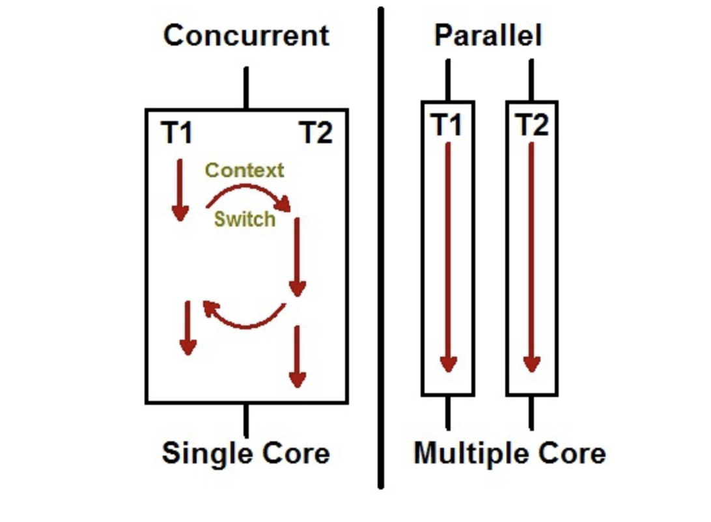

# Nodejs Threads 

## worker_thread
- Node.js 애플리케이션에서 별도의 스레드를 생성하여 빠르게 병렬처리를 할 수 있는 기능이다.

### 병렬 처리가 가능하다는 것이 무엇일까?
- 말 그대로 물리적 병렬성을 가지고 물리적으로 여러 스레드를 CPU에서 동시에 수행을 할 수 있음을 뜻한다.

---

### Node.js가 시작되면 생기는 일
1. #### 하나의 프로세스 
- 어디서든 접근 가능한 전역 객체이자 그 순간 실행되고 있는 것들의 정보를 가지고 있는 프로세스
2. #### 하나의 스레드
- 단일 스레드는 주어진 프로세스에서 오직 한 번에 하나의 명령만이 실행된다는 뜻.
3. #### 하나의 이벤트 루프 
- 노드를 이해하기 위해 가장 중요한 부분 중 하나입니다.
- 이는 자바스크립트가 단일 스레드라는 사실에도 불구하고, 언제든 가능한 callback, promise, async/await 를 통해 시스템 커널에 작업을 offload 하게 합니다. 이로서 노드가 비동기식, 비차단 I/O 의 특성을 가집니다.
4. #### 하나의 js 엔진 인스턴스 
- js 코드를 실행하는 컴퓨터 프로그램입니다.
5. #### 하나의 노드js 인스턴스 
- 노드js 코드를 실행하는 컴퓨터 프로그램입니다.

> 즉, 노드는 단일 스레드에서 실행되고, 이벤트 루프에는 한 번에 하나의 프로세스만 발생합니다. 하나의 코드, 하나의 실행, (코드는 병렬로 실행되지 않습니다).

---

### 싱글스레드 :  아리토스테네스의 체 소수 구하기

```javascript
let
    min = 2,
    max = 10000000,
    primes = [];

// 아리토스테네스의 체 소수구하기
function generatePrimes(start, range) {
    let isPrime = true;
    const end = start + range;
    for (let i = start; i < end; i++) {
        for (let j = min; j < Math.sqrt(end); j++) {
            if (i !== j && i % j === 0) {
                isPrime = false;
                break;
            }
        }

        if (isPrime) {
            primes.push(i)
        }
        isPrime = true;
    }
}

console.time('prime');
generatePrimes(min, max)
console.timeEnd('prime');
console.log(primes.length);
```

### 멀티스레드 :  아리토스테네스의 체 소수 구하기

```javascript
const { Worker, isMainThread, parentPort, workerData } = require('worker_threads');

let
   min = 2,
   max = 10_000_000,
   primes = [];

function generatePrimes(start, range) {
   let isPrime = true;
   const end = start + range;
   for (let i = start; i < end; i++) {
      for (let j = min; j < Math.sqrt(end); j++) {
         if (i !== j && i % j === 0) {
            isPrime = false;
            break;
         }
      }

      if (isPrime) {
         primes.push(i)
      }
      isPrime = true;
   }
}


if (isMainThread) {
   const threadCount = 8;
   const threads = new Set()
   const range = Math.ceil((max - min) / threadCount); // 10_000_000 max를 8개의 쓰레드에 분배를 해서 처리하기 위해서

   let start = min;
   console.time('prime2');

   for (let i = 0; i < threadCount - 1; i++) {
      const wStart = start;
      threads.add(new Worker(__filename, { workerData: { start: wStart, range: range } }))
      start += range;
   }
   
   threads.add(new Worker(__filename, { workerData: { start: start, range: range + ((max - min + 1) % threadCount) } }));

   for (let worker of threads) {

      worker.on('error', (err) => {
         throw err;
      })

      worker.on('exit', () => {

         threads.delete(worker);

         if (threads.size ===0){
            console.timeEnd('prime2')
            console.log(primes.length);
         }
      });

          
      worker.on('message', (msg) => {
         primes = primes.concat(msg);
      })
   }

} else {
   generatePrimes(workerData.start, workerData.range);
   parentPort.postMessage(primes);
}
```

---

## 싱글스레드와 멀티스레드의 처리결과 비교
- 처리된 결과 값은 똑같지만 처리 시간을 worker_threads를 이용한 방식이 월등히 빠르다.
- 하나의 작업을 두 스레드가 나누어서 물리적으로 동시에 수행함으로써 병렬처리가 가능하다는 것을 증명하는 것이고, Node.js에서 여러 스레드를 동시에 구동시킬 수 있음을 뜻한다.


### Node는 비동기 처리가 가능한 동시성을 가지고 있는 환경인데, 동시성도 멀티스레드처럼 병렬처리가 가능한가?
- 우선 비동기 처리는 병렬처리를 하는 방식이 아니라, 단지 CPU Time Sharing을 통해 여러 일을 동시에 작업하는 것처럼 보이게 하는 것일 뿐이다.

---
> #### **잠깐!** 알고 넘어가는, 동시성과 병렬성의 차이

**동시성** : 하나의 스레드 위에서 여러 작업이 CPU가 한번씩 빠르게 돌아가면서 동시에 수행되는 것처럼 보이는 것
<br>
**병렬성** :  실제 CPU 위에서 여러 스레드를 물리적으로 동시에 수행되는 것을 뜻한다.


<div align="center">
    
</div>

--- 

## Workers_threads에 대해 자세히 알아보자.

- 작업을 처리할 새로운 스레드 풀을 생성 후 스레드 별 비동기 처리가 가능하도록 지원해 주는 libuv 엔진이 세팅된다.
- 그리고 각 스레드에서 Javascript 엔진으로 코드를 실행시키고, 하나의 이벤트 루프를 통해서 각 스레드들끼리의 응답 처리를 Task Queue를 통해서 전달된다.


<div align="center">
    
</div>

---

### Worker Thread 사용

#### 메인 스레드 <-> Worker 데이터 송수신 
- **worker.postMessage** 로 부모에서 워커로 데이터를 보냄
- parentPort.on(message)로 부모로부터 데이터를 받고, postMessage로 데이터를 보냄


```javascript
const { Worker, isMainThread, parentPort } = require('worker_threads');

if (isMainThread) { // 메인 스레드
   const worker = new Worker(__filename);

   worker.on('message', (value) => {
      console.log('워커로부터', value)
   })
   worker.on('exit', (value) => { // parentPort.close()가 일어나면 이벤트 발생
      console.log('워커 끝~');
   })

   worker.postMessage('ping'); // 워커스레드에게 메세지를 보낸다.

} else { // 워커스레드

   parentPort.on('message', (value) => {
      console.log("부모로부터", value);
      parentPort.postMessage('pong');
      parentPort.close(); // 워커스레드 종료라고 메인스레드에 알려줘야 exit이벤트 발생
   })
}
```

> 출처 
> 1. https://helloinyong.tistory.com/350
> 2. https://inpa.tistory.com/entry/NODE-%F0%9F%93%9A-workerthreads-%EB%AA%A8%EB%93%88