# Node.js 성능 최적화 및 프로파일링

## 개요

성능 최적화는 애플리케이션의 응답 시간, 처리량, 리소스 사용률을 개선하여 더 나은 사용자 경험과 비용 효율성을 달성하는 과정입니다.

## 목차
1. [Node.js 성능 최적화 개요](#nodejs-성능-최적화-개요)
2. [성능 프로파일링 도구](#성능-프로파일링-도구)
3. [메모리 누수 탐지 및 해결](#메모리-누수-탐지-및-해결)
4. [CPU 사용률 최적화](#cpu-사용률-최적화)
5. [비동기 처리 최적화](#비동기-처리-최적화) *기존 파일들 통합*
6. [실제 성능 병목 지점 분석 및 해결 사례](#실제-성능-병목-지점-분석-및-해결-사례)
7. [성능 모니터링 및 알림](#성능-모니터링-및-알림)

### 통합된 기존 파일들
이 문서는 다음 기존 파일들의 내용을 통합한 것입니다:
- **논블로킹 I/O**: 논블로킹 개념, 블로킹 vs 논블로킹 비교, 실행 순서 예제, 활용 사례
- **Promise**: Promise 기초, 체이닝, 고급 패턴, API 클라이언트 구현
- **async/await**: async/await 문법, 에러 처리, 실용적인 예제들
- **Event Loop**: 이벤트 루프 동작 과정, 마이크로태스크/매크로태스크 큐, 실행 우선순위

## Node.js 성능 최적화 개요

Node.js 성능 최적화는 애플리케이션의 응답 시간, 처리량, 리소스 사용률을 개선하여 더 나은 사용자 경험과 비용 효율성을 달성하는 과정입니다.

### 성능 최적화 프로세스

효과적인 성능 최적화를 위해서는 체계적인 프로세스를 따르는 것이 중요합니다. 다음 플로우차트는 성능 최적화의 전체 프로세스를 보여줍니다.

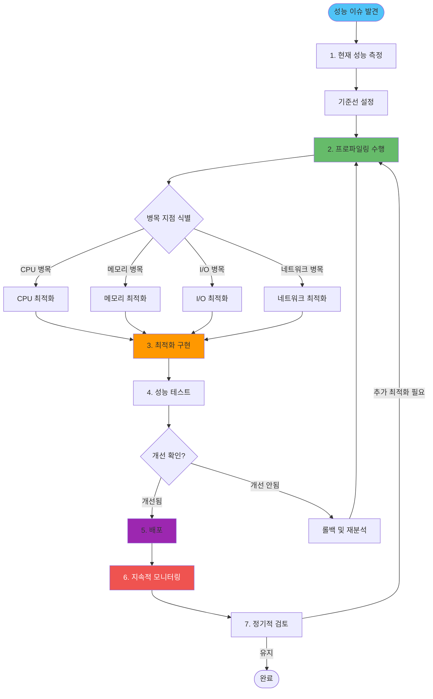

### 성능 최적화의 핵심 원칙

1. **측정 우선**: 최적화 전에 현재 성능을 정확히 측정
2. **병목 지점 식별**: 실제 성능 저하 원인 파악
3. **점진적 개선**: 한 번에 하나씩 최적화
4. **지속적 모니터링**: 성능 변화 추적

### Node.js 성능 특성

- **싱글 스레드 이벤트 루프**: CPU 집약적 작업에 취약
- **비동기 I/O**: I/O 바운드 작업에 강점
- **메모리 관리**: V8 엔진의 가비지 컬렉션 의존
- **모듈 시스템**: CommonJS와 ES Modules의 성능 차이

### 성능 병목 지점 분류

성능 문제는 크게 네 가지 영역으로 분류할 수 있습니다:

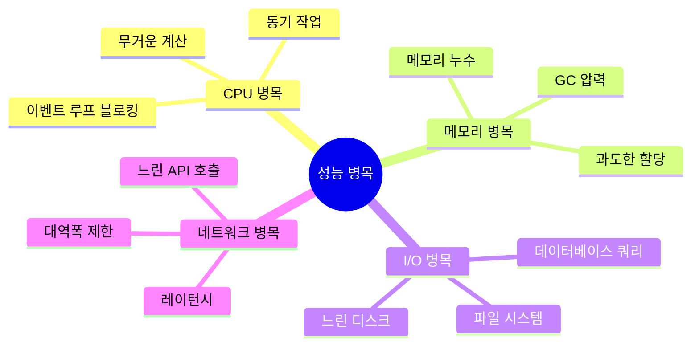

## 성능 프로파일링 도구

### 프로파일링 도구 선택 가이드

**의사결정 트리:**

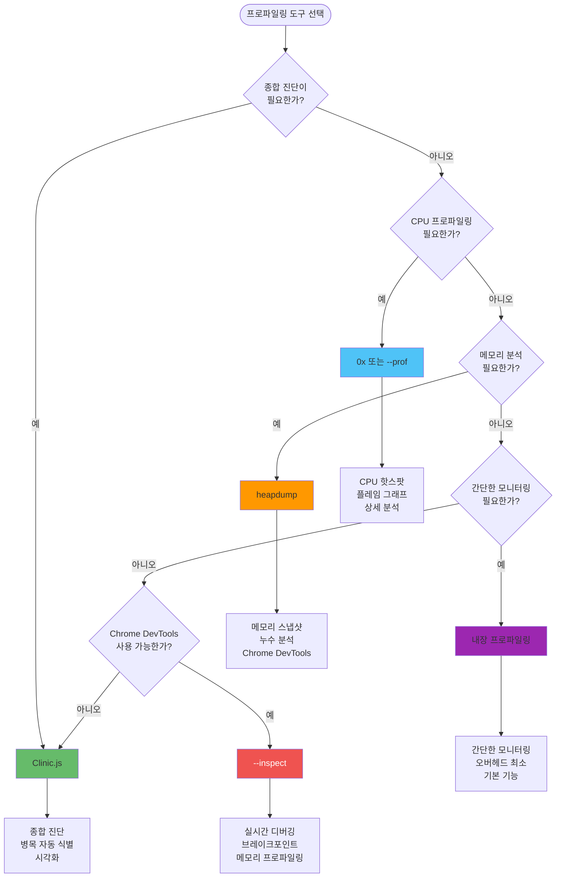

**프로파일링 도구 비교표:**

| 도구 | 용도 | 장점 | 단점 | 사용 시기 |
|------|------|------|------|----------|
| **Clinic.js** | 종합 진단 | 자동 병목 식별, 시각화 | 설정 복잡 | 초기 성능 분석 |
| **0x** | CPU 프로파일링 | 플레임 그래프, 상세 분석 | 결과 해석 필요 | CPU 병목 분석 |
| **heapdump** | 메모리 분석 | 스냅샷 비교, 누수 탐지 | 오버헤드 있음 | 메모리 누수 조사 |
| **--prof** | CPU 프로파일링 | 내장 도구, 무료 | 결과 해석 어려움 | 기본 CPU 분석 |
| **--inspect** | 디버깅 | 실시간, 브레이크포인트 | 개발 환경용 | 개발 중 디버깅 |

**트레이드오프 분석:**

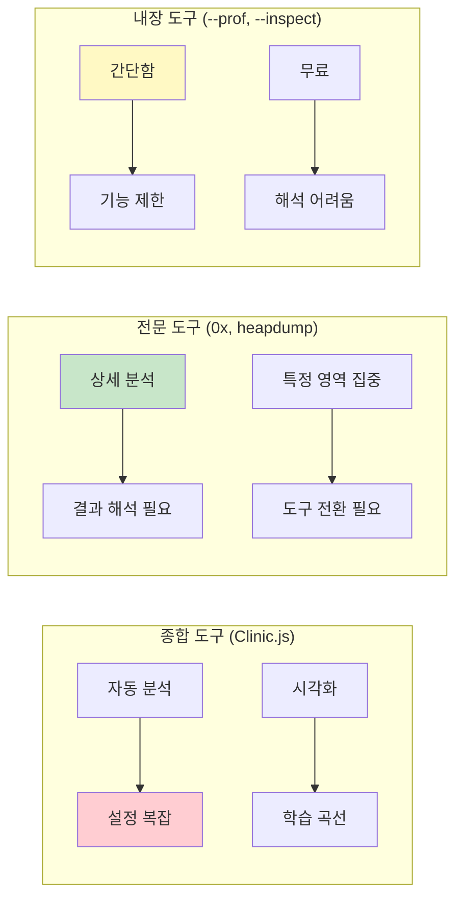

**실무 권장사항:**
- **초기 분석**: Clinic.js로 전체적인 병목 지점 파악
- **CPU 병목**: 0x로 상세한 CPU 사용 패턴 분석
- **메모리 문제**: heapdump로 스냅샷 비교 분석
- **개발 중**: --inspect로 실시간 디버깅
- **프로덕션**: 내장 프로파일링으로 최소 오버헤드 모니터링

### 1. Clinic.js - 종합 성능 진단 도구

#### Clinic.js 설치 및 기본 사용법
```bash
# Clinic.js 설치
npm install -g clinic

# 기본 성능 진단
clinic doctor -- node app.js

# 특정 기능별 진단
clinic bubbleprof -- node app.js  # 비동기 흐름 분석
clinic flame -- node app.js       # CPU 사용률 분석
clinic heapprofiler -- node app.js # 메모리 사용량 분석
```

#### Clinic.js 설정

Clinic.js는 설정 파일을 통해 세밀한 프로파일링을 수행할 수 있습니다. 주요 설정 항목은 다음과 같습니다:

**진단 설정 (doctor)**:
- **duration**: 프로파일링 지속 시간 (기본 30초)
- **sampleInterval**: 샘플링 간격 (10ms 권장)
- **threshold**: 경고를 발생시킬 지연 시간 임계값 (100ms 권장)

**메모리 프로파일링 (heapprofiler)**:
- **duration**: 메모리 추적 시간 (60초 이상 권장)
- **sampleInterval**: 메모리 샘플링 간격 (100ms 권장)
- **maxMemory**: 메모리 사용량 제한 설정

**CPU 프로파일링 (flame)**:
- **duration**: CPU 추적 시간 (30초 권장)
- **sampleInterval**: CPU 샘플링 간격 (1ms 권장)
- **threshold**: 추적할 최소 CPU 사용률 (0.1% 권장)

**참고:**
- 프로덕션 환경에서는 짧은 duration으로 시작하여 점진적으로 늘립니다
- 샘플링 간격이 너무 짧으면 오버헤드가 발생할 수 있으므로 적절히 조정합니다
- 메모리 프로파일링은 충분한 시간을 두고 실행하여 패턴을 파악합니다

### 2. 0x - V8 프로파일링 도구

#### 0x 설치 및 사용법
```bash
# 0x 설치
npm install -g 0x

# 기본 프로파일링
0x -- node app.js

# 고급 옵션
0x --on-port 'echo "서버 시작됨"' -- node app.js
0x --collect-only -- node app.js
```

#### 0x 결과 분석

0x는 프로파일링 결과를 HTML 형식으로 제공하며, 다음 정보를 분석해야 합니다:

**핫스팟(Hot Spots) 식별**:
- **selfTime**: 함수 자체 실행 시간 (100ms 이상이면 주의)
- **totalTime**: 함수와 하위 함수 포함 총 실행 시간
- **callCount**: 함수 호출 횟수
- **location**: 함수 위치 정보

**메모리 누수 패턴 감지**:
- **selfSize**: 함수에서 직접 할당한 메모리 크기 (1MB 이상이면 주의)
- **할당 패턴**: 반복적으로 큰 메모리를 할당하는 함수 식별
- **참조 유지**: 메모리를 해제하지 않는 패턴 확인

**분석 우선순위**:
1. 실행 시간이 가장 긴 함수 (selfTime 기준)
2. 호출 빈도가 높은 함수 (callCount 기준)
3. 메모리 할당이 큰 함수 (selfSize 기준)
4. 재귀 호출이나 무한 루프 가능성이 있는 함수

**참고:**
- 0x 결과의 플레임 그래프를 통해 호출 체인을 시각적으로 파악합니다
- 상위 10개 핫스팟에 집중하여 최적화를 진행합니다
- 메모리 누수는 시간에 따른 메모리 증가 패턴을 확인합니다

### 3. Node.js 내장 프로파일링 도구

#### --prof 플래그를 사용한 프로파일링
```bash
# V8 프로파일링 활성화
node --prof app.js

# 프로파일링 결과 분석
node --prof-process isolate-*.log > profile.txt
```

#### --inspect 플래그를 사용한 디버깅
```bash
# Chrome DevTools 연결
node --inspect app.js

# 브레이크포인트 설정
node --inspect-brk app.js
```

#### 내장 프로파일링 활용

Node.js의 내장 프로파일링 기능을 활용하면 외부 도구 없이도 기본적인 성능 분석이 가능합니다.

**메모리 사용량 추적**:
- `process.memoryUsage()`를 주기적으로 호출하여 메모리 사용 패턴을 파악합니다
- **rss**: 실제 메모리 사용량 (Resident Set Size)
- **heapTotal**: 힙 메모리 총량
- **heapUsed**: 힙 메모리 사용량
- **external**: V8 엔진 외부 메모리 사용량

**CPU 사용률 추적**:
- `process.cpuUsage()`를 통해 CPU 사용 패턴을 분석합니다
- **user**: 사용자 모드 CPU 시간
- **system**: 시스템 모드 CPU 시간

**프로파일링 데이터 수집**:
- 샘플링 간격: 1초 간격이면 충분하며, 더 자세한 분석이 필요하면 100ms 간격 사용
- 수집 기간: 최소 30초 이상 수집하여 패턴을 파악
- 데이터 저장: JSON 형식으로 저장하여 추후 분석 가능하도록 구성

**참고:**
- 프로덕션 환경에서는 오버헤드를 최소화하기 위해 샘플링 간격을 늘립니다
- 메모리 증가 추세를 그래프로 시각화하여 누수 패턴을 식별합니다
- CPU 사용률이 지속적으로 높은 구간을 식별하여 최적화 대상으로 선정합니다

## 메모리 누수 탐지 및 해결

### 메모리 누수 패턴 개요

메모리 누수는 애플리케이션이 더 이상 사용하지 않는 메모리를 해제하지 않아 발생하는 문제입니다. Node.js에서 흔히 발생하는 메모리 누수 패턴을 이해하는 것이 중요합니다.

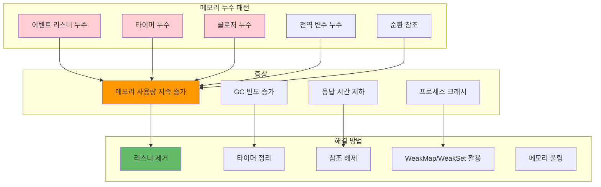

### 메모리 누수 생명주기

메모리 누수가 발생하는 과정을 이해하면 더 효과적으로 방지할 수 있습니다:

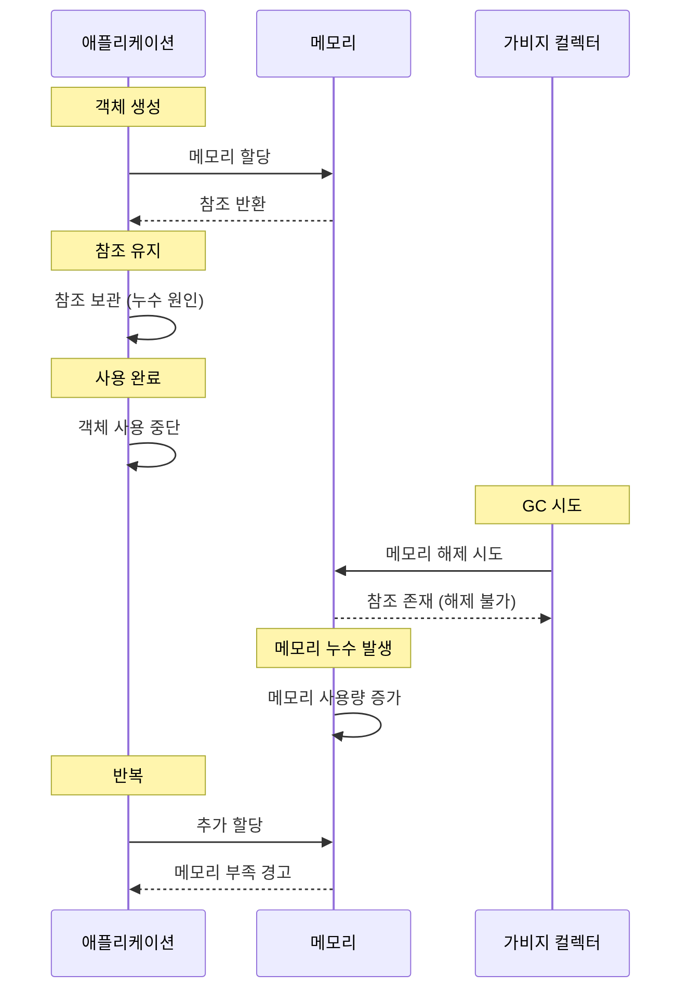

### 1. 메모리 누수 패턴 및 감지

#### 일반적인 메모리 누수 패턴
```javascript
// 메모리 누수 패턴 예시
class MemoryLeakPatterns {
  constructor() {
    this.listeners = new Map();
    this.timers = new Set();
    this.data = new Map();
  }
  
  // 1. 이벤트 리스너 누수
  addEventListenerLeak(element, eventType, handler) {
    element.addEventListener(eventType, handler);
    // 문제: 이벤트 리스너가 제거되지 않음
  }
  
  // 해결책: 적절한 제거
  addEventListenerSafe(element, eventType, handler) {
    element.addEventListener(eventType, handler);
    
    // 제거 함수 반환
    return () => {
      element.removeEventListener(eventType, handler);
    };
  }
  
  // 2. 타이머 누수
  createTimerLeak() {
    const timer = setInterval(() => {
      console.log('타이머 실행 중...');
    }, 1000);
    // 문제: clearInterval이 호출되지 않음
  }
  
  // 해결책: 타이머 관리
  createTimerSafe() {
    const timer = setInterval(() => {
      console.log('타이머 실행 중...');
    }, 1000);
    
    this.timers.add(timer);
    
    return () => {
      clearInterval(timer);
      this.timers.delete(timer);
    };
  }
  
  // 3. 클로저 누수
  createClosureLeak() {
    const largeData = new Array(1000000).fill('data');
    
    return function() {
      console.log('클로저에서 largeData 참조');
      // 문제: largeData가 계속 메모리에 유지됨
    };
  }
  
  // 해결책: 필요 없을 때 null 설정
  createClosureSafe() {
    let largeData = new Array(1000000).fill('data');
    
    return function() {
      console.log('클로저에서 largeData 참조');
      // 사용 후 참조 해제
      largeData = null;
    };
  }
}
```

### 2. 메모리 누수 감지 도구

#### heapdump를 사용한 메모리 스냅샷

heapdump는 Node.js 애플리케이션의 메모리 힙 스냅샷을 생성하여 메모리 누수를 분석할 수 있게 해주는 도구입니다.

**heapdump 활용:**

**스냅샷 생성 시점:**
- 애플리케이션 시작 직후 (기준선 설정)
- 특정 작업 수행 전후 (작업별 메모리 영향 분석)
- 메모리 사용량이 임계값을 초과할 때 (자동 스냅샷)
- 정기적인 간격으로 (트렌드 분석)

**메모리 모니터링:**
- **임계값 설정**: 일반적으로 50MB 이상이면 주의가 필요합니다
- **모니터링 간격**: 5초 간격이면 충분하며, 더 자세한 분석이 필요하면 1초 간격 사용
- **스냅샷 비교**: 시간에 따른 여러 스냅샷을 비교하여 메모리 증가 패턴을 파악합니다

**스냅샷 분석 방법:**
- Chrome DevTools의 Memory 프로파일러로 `.heapsnapshot` 파일을 열어 분석합니다
- Comparison 모드를 사용하여 스냅샷 간 차이를 확인합니다
- Retainers를 확인하여 메모리를 유지하는 참조를 찾습니다

**참고:**
- 프로덕션 환경에서는 스냅샷 생성이 성능에 영향을 줄 수 있으므로 신중하게 사용합니다
- 메모리 사용량이 지속적으로 증가하는 패턴을 확인합니다
- 큰 객체나 배열이 메모리에 남아있는지 확인합니다

### 3. 메모리 누수 해결

#### WeakMap과 WeakSet 활용

WeakMap과 WeakSet은 객체를 키로 사용하되, 해당 객체에 대한 강한 참조를 유지하지 않습니다. 이는 메모리 누수를 방지하는 데 매우 유용합니다.

**WeakMap 활용 시나리오:**

**메모리 효율적인 캐싱:**
- 객체를 키로 사용하는 캐시를 구현할 때 WeakMap을 사용합니다
- 객체가 가비지 컬렉션되면 자동으로 캐시에서도 제거됩니다
- 별도의 정리 로직이 필요 없어 메모리 관리가 자동화됩니다

**메타데이터 저장:**
- 객체에 추가 정보를 저장해야 할 때 WeakMap을 사용합니다
- 원본 객체를 수정하지 않고도 추가 정보를 연결할 수 있습니다
- 객체가 사라지면 메타데이터도 자동으로 정리됩니다

**WeakSet 활용 시나리오:**

**객체 추적:**
- 특정 객체를 추적해야 할 때 WeakSet을 사용합니다
- 객체가 가비지 컬렉션되면 자동으로 추적 목록에서 제거됩니다
- 순회가 필요 없는 경우 WeakSet이 적합합니다

**중복 체크:**
- 객체의 중복 여부를 확인할 때 WeakSet을 사용합니다
- 메모리 효율적이며 자동 정리가 가능합니다

**사용 시 주의사항:**
- WeakMap/WeakSet은 객체만 키로 사용할 수 있습니다 (원시 타입 불가)
- 키로 사용된 객체가 다른 곳에서 참조되지 않으면 자동으로 제거됩니다
- 순회(iteration)가 불가능하므로 모든 키를 확인할 수 없습니다

#### 메모리 풀링 패턴

메모리 풀링은 객체를 재사용하여 메모리 할당과 해제의 오버헤드를 줄이는 기법입니다. 자주 생성되고 삭제되는 객체에 특히 효과적입니다.

**메모리 풀링의 원리:**

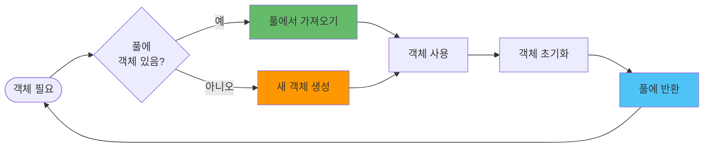

**메모리 풀링 적용 시나리오:**

**적합한 경우:**
- 객체 생성 비용이 높은 경우 (복잡한 초기화 로직)
- 객체가 자주 생성되고 삭제되는 경우 (높은 할당 빈도)
- 메모리 할당이 성능 병목인 경우
- 가비지 컬렉션 압력을 줄이고 싶은 경우

**부적합한 경우:**
- 객체 생성 비용이 낮은 경우 (오버헤드가 더 클 수 있음)
- 객체가 거의 생성되지 않는 경우 (풀 관리 비용만 증가)
- 객체 상태가 복잡하여 초기화가 어려운 경우

**풀 크기 관리:**
- **초기 크기**: 예상 최대 동시 사용량의 50-70%로 설정
- **최대 크기**: 메모리 제한을 고려하여 설정
- **동적 조정**: 사용 패턴에 따라 풀 크기를 조정

**참고:**
- 데이터베이스 연결 풀, HTTP 요청 객체, 버퍼 등에 활용
- 풀 크기를 모니터링하여 최적값을 찾습니다
- 과도한 풀링은 오히려 메모리를 낭비할 수 있으므로 신중하게 적용합니다

## CPU 사용률 최적화

### 1. CPU 집약적 작업 최적화

#### Worker Threads를 사용한 CPU 집약적 작업 분산

Worker Threads는 Node.js에서 CPU 집약적 작업을 별도의 스레드에서 실행하여 메인 스레드를 블로킹하지 않게 해줍니다.

**Worker Threads 아키텍처:**

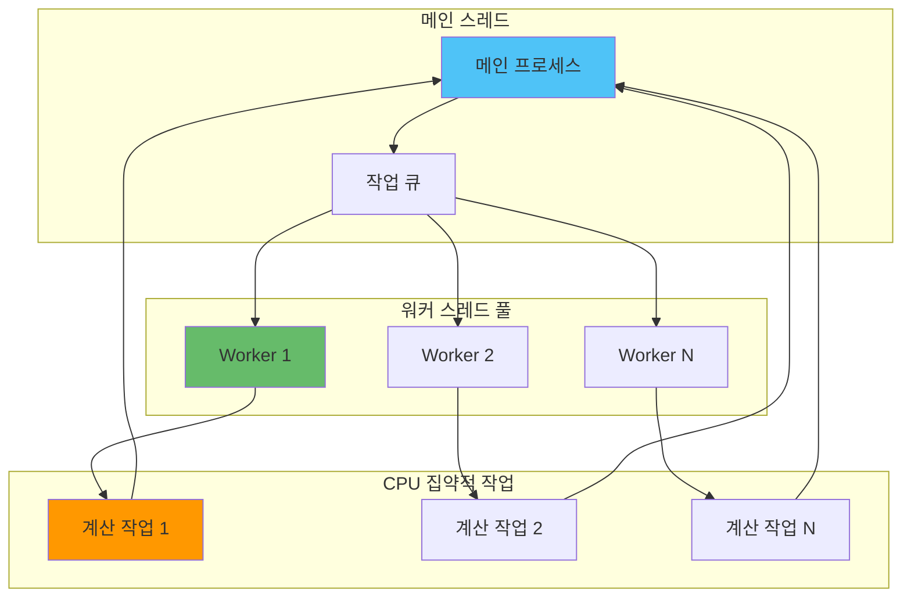

**Worker Threads 활용:**

**워커 수 결정:**
- CPU 코어 수와 동일하게 설정하는 것이 일반적입니다
- I/O 작업이 포함된 경우 워커 수를 늘릴 수 있습니다
- 메모리 제한을 고려하여 워커 수를 조정합니다

**작업 분산 방식:**
- **Round Robin**: 작업을 순차적으로 워커에 할당
- **Least Busy**: 가장 한가한 워커에 할당
- **Work Stealing**: 워커가 작업을 가져가도록 구성

**워커 풀 관리:**
- 워커를 미리 생성하여 초기화 오버헤드를 줄입니다
- 작업 큐를 사용하여 워커가 모두 사용 중일 때 대기시킵니다
- 워커 오류 시 재생성하거나 대체 워커를 사용합니다

**적용 시나리오:**
- 이미지 처리, 암호화, 데이터 압축 등 CPU 집약적 작업
- 대량 데이터 처리 및 변환
- 복잡한 수학 계산

**주의사항:**
- 워커 간 메모리 공유가 불가능하므로 데이터 복사 오버헤드가 있습니다
- 작은 작업에는 워커 오버헤드가 더 클 수 있습니다
- I/O 작업에는 Worker Threads보다 비동기 I/O가 더 효율적입니다

### 2. 알고리즘 최적화

#### 효율적인 데이터 구조 선택

알고리즘 최적화의 핵심은 적절한 데이터 구조를 선택하는 것입니다. 각 데이터 구조의 시간 복잡도를 이해하고 상황에 맞게 선택해야 합니다.

**데이터 구조별 시간 복잡도 비교:**

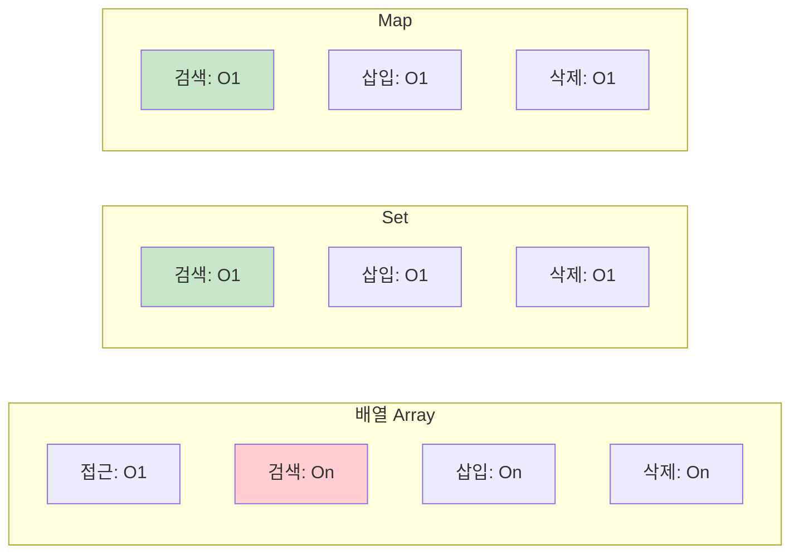

**데이터 구조 선택 가이드:**

| 작업 | 배열 | Set | Map | 선택 기준 |
|------|------|-----|-----|----------|
| **중복 제거** | O(n²) | O(n) | - | Set 사용 |
| **빠른 검색** | O(n) | O(1) | O(1) | Set/Map 사용 |
| **키-값 매핑** | - | - | O(1) | Map 사용 |
| **순서 유지** | O(1) | - | - | 배열 사용 |
| **인덱스 접근** | O(1) | - | - | 배열 사용 |

**실무 활용 시나리오:**

**중복 제거:**
- 배열의 `indexOf()` 사용: O(n²) 시간 복잡도로 비효율적
- Set 사용: O(n) 시간 복잡도로 효율적
- 대량 데이터 처리 시 성능 차이가 크게 발생

**빠른 검색:**
- 배열 순회: O(n) 시간 복잡도
- Map/Set 사용: O(1) 시간 복잡도
- 반복적인 검색이 필요한 경우 Map/Set이 필수

**메모리 고려사항:**
- Set과 Map은 해시 테이블을 사용하므로 메모리 오버헤드가 있습니다
- 작은 데이터셋에서는 배열이 더 효율적일 수 있습니다
- 데이터 크기와 접근 패턴을 고려하여 선택합니다

#### 메모이제이션을 통한 계산 최적화

메모이제이션은 함수의 결과를 캐시하여 동일한 입력에 대해 재계산을 방지하는 최적화 기법입니다.

**메모이제이션 원리:**

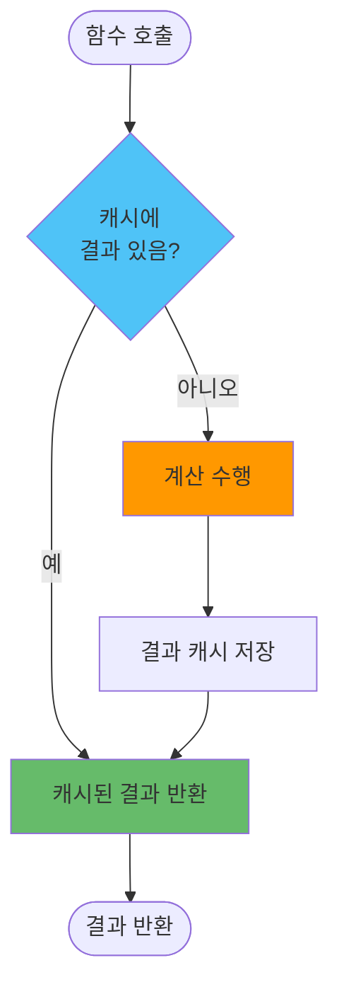

**메모이제이션 적용 시나리오:**

**적합한 경우:**
- 순수 함수 (동일 입력에 항상 동일 출력)
- 계산 비용이 높은 함수
- 동일한 입력이 반복적으로 사용되는 경우
- 재귀 함수의 중복 계산 제거

**부적합한 경우:**
- 부수 효과(side effect)가 있는 함수
- 입력이 거의 중복되지 않는 경우
- 캐시 메모리 관리 비용이 계산 비용보다 큰 경우

**캐시:**
- **LRU (Least Recently Used)**: 가장 오래 사용되지 않은 항목 제거
- **TTL (Time To Live)**: 일정 시간 후 캐시 만료
- **크기 제한**: 캐시 크기를 제한하여 메모리 사용량 관리

**참고:**
- 피보나치 수열, 팩토리얼 등 재귀 계산에 매우 효과적
- API 응답 캐싱, 데이터베이스 쿼리 결과 캐싱에도 활용
- 캐시 크기를 모니터링하여 메모리 사용량을 관리합니다

### 3. 비동기 처리 최적화

#### Promise.all을 사용한 병렬 처리

비동기 작업을 병렬로 처리하면 전체 실행 시간을 크게 단축할 수 있습니다. 하지만 모든 상황에서 병렬 처리가 최선은 아닙니다.

**처리 방식 비교:**

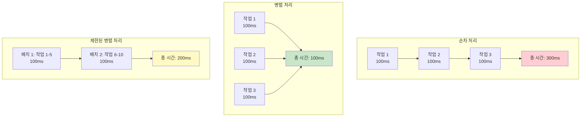

**처리 방식 선택 가이드:**

| 상황 | 순차 처리 | 병렬 처리 | 제한된 병렬 |
|------|----------|----------|------------|
| **작업 수** | 적음 (< 10) | 적음-중간 | 많음 (> 100) |
| **의존성** | 의존적 | 독립적 | 독립적 |
| **리소스 제한** | - | - | 있음 |
| **에러 처리** | 즉시 중단 | 모두 실패 | 배치별 처리 |

**병렬 처리:**

**Promise.all 사용:**
- 모든 작업이 성공해야 하는 경우
- 하나라도 실패하면 전체 실패
- 빠른 실행 시간이 중요할 때

**Promise.allSettled 사용:**
- 일부 실패해도 나머지 결과가 필요한 경우
- 각 작업의 성공/실패를 개별적으로 처리
- 에러 복구가 중요한 경우

**제한된 병렬 처리:**
- 동시 실행 수를 제한하여 리소스 보호
- API Rate Limit을 준수해야 할 때
- 메모리나 연결 수 제한이 있을 때

**참고:**
- I/O 바운드 작업은 병렬 처리가 매우 효과적입니다
- CPU 바운드 작업은 Worker Threads를 고려합니다
- 외부 API 호출 시 Rate Limit을 고려하여 제한된 병렬 처리를 사용합니다

#### 스트림을 사용한 대용량 데이터 처리
```javascript
const fs = require('fs');
const { Transform } = require('stream');

// 대용량 파일 처리 최적화
class DataProcessor extends Transform {
  constructor(options = {}) {
    super(options);
    this.processedCount = 0;
  }
  
  _transform(chunk, encoding, callback) {
    try {
      // 데이터 처리 로직
      const processed = this.processChunk(chunk);
      this.processedCount++;
      
      if (this.processedCount % 1000 === 0) {
        console.log(`처리된 항목 수: ${this.processedCount}`);
      }
      
      callback(null, processed);
    } catch (error) {
      callback(error);
    }
  }
  
  processChunk(chunk) {
    // 실제 데이터 처리 로직
    return chunk.toString().toUpperCase();
  }
}

// 스트림 사용 예시
const processor = new DataProcessor();
const inputStream = fs.createReadStream('large-file.txt');
const outputStream = fs.createWriteStream('processed-file.txt');

inputStream
  .pipe(processor)
  .pipe(outputStream)
  .on('finish', () => {
    console.log('파일 처리 완료');
  });
```

## 비동기 처리 최적화

**통합된 기존 파일들**: 이 섹션은 다음 기존 파일들의 내용을 통합한 것입니다.
> - JavaScript 비동기 처리 메커니즘 (동기 vs 비동기, 이벤트 루프)
> - Node.js 비동기 콜백 패턴 및 콜백 지옥 해결
> - Promise 개념, 체이닝, 고급 패턴 (Promise.all, Promise.allSettled, Promise.race)
> - async/await 문법 및 실용적인 예제
> - 이벤트 루프 동작 원리 및 큐 우선순위
> - Web Workers와 멀티스레딩 활용

### 1. JavaScript 비동기 처리 메커니즘

#### 동기(Synchronous) vs 비동기(Asynchronous)

JavaScript는 기본적으로 싱글 스레드 언어입니다. 즉, 한 번에 하나의 작업만 수행할 수 있습니다. 하지만 웹 애플리케이션에서는 네트워크 요청, 파일 읽기, 타이머 등 여러 작업을 동시에 처리해야 할 필요가 있습니다.

```javascript
// 동기적 실행
console.log('1. 시작');
console.log('2. 중간');
console.log('3. 끝');
// 출력: 1. 시작, 2. 중간, 3. 끝 (순차적 실행)

// 비동기적 실행
console.log('1. 시작');
setTimeout(() => {
    console.log('2. 비동기 작업');
}, 1000);
console.log('3. 끝');
// 출력: 1. 시작, 3. 끝, 2. 비동기 작업 (1초 후)
```

#### 이벤트 루프(Event Loop) 상세 분석

이벤트 루프는 JavaScript의 비동기 처리를 가능하게 하는 핵심 메커니즘입니다. Node.js의 이벤트 루프 구조를 이해하면 성능 최적화에 큰 도움이 됩니다.

**이벤트 루프 전체 구조:**

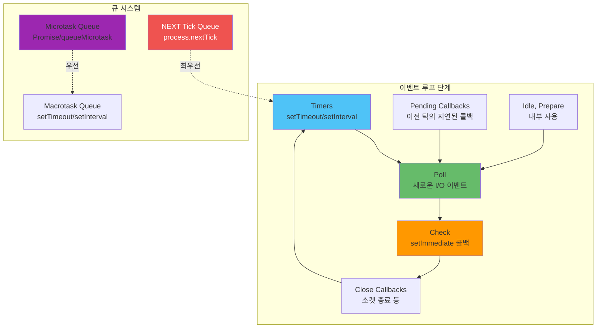

**이벤트 루프 실행 순서:**

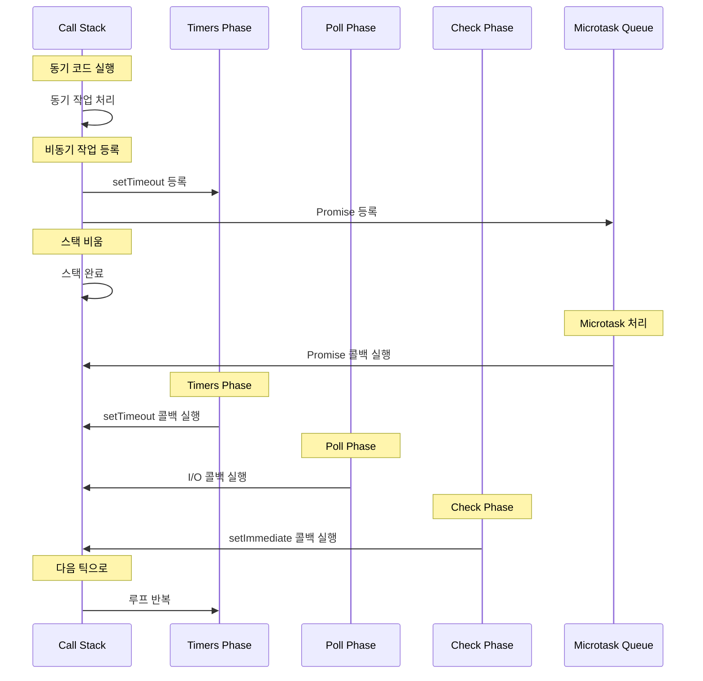

```javascript
console.log('1. 스크립트 시작');

setTimeout(() => {
    console.log('2. setTimeout 콜백');
}, 0);

Promise.resolve().then(() => {
    console.log('3. Promise 콜백');
});

console.log('4. 스크립트 끝');

// 출력:
// 1. 스크립트 시작
// 4. 스크립트 끝
// 3. Promise 콜백
// 2. setTimeout 콜백
```

**이벤트 루프 구성요소:**
1. **콜 스택(Call Stack)**: 실행 중인 코드의 위치를 추적
2. **태스크 큐(Task Queue)**: 비동기 작업의 콜백 함수들이 대기하는 곳
3. **마이크로태스크 큐(Microtask Queue)**: Promise의 콜백 함수들이 대기하는 곳

### 2. 콜백 패턴과 콜백 지옥 해결

#### 콜백 함수의 기본 개념

콜백 함수는 다른 함수에 인자로 전달되어 나중에 실행되는 함수입니다. Node.js에서는 비동기 작업의 결과를 처리하기 위해 콜백 패턴을 광범위하게 사용합니다.

```javascript
// 기본적인 콜백 예제
function fetchData(callback) {
    setTimeout(() => {
        const data = { id: 1, name: 'John Doe' };
        callback(data);
    }, 1000);
}

fetchData((data) => {
    console.log('데이터:', data);
});
```

#### Node.js에서의 콜백 패턴

```javascript
const fs = require('fs');

// 파일 읽기
fs.readFile('example.txt', 'utf8', (err, data) => {
    if (err) {
        console.error('파일 읽기 오류:', err);
        return;
    }
    console.log('파일 내용:', data);
});

// HTTP 요청
const http = require('http');

http.get('http://api.example.com/data', (res) => {
    let data = '';
    
    res.on('data', (chunk) => {
        data += chunk;
    });
    
    res.on('end', () => {
        console.log('응답 데이터:', data);
    });
}).on('error', (err) => {
    console.error('요청 오류:', err);
});
```

#### 콜백 지옥(Callback Hell) 문제

콜백을 과도하게 사용하면 코드가 복잡해지고 가독성이 떨어지는 "콜백 지옥"이 발생할 수 있습니다.

```javascript
// 콜백 지옥 예제
fs.readFile('file1.txt', 'utf8', (err, data1) => {
    if (err) {
        console.error('첫 번째 파일 읽기 오류:', err);
        return;
    }
    
    fs.readFile('file2.txt', 'utf8', (err, data2) => {
        if (err) {
            console.error('두 번째 파일 읽기 오류:', err);
            return;
        }
        
        fs.writeFile('result.txt', data1 + data2, (err) => {
            if (err) {
                console.error('파일 쓰기 오류:', err);
                return;
            }
            console.log('작업 완료!');
        });
    });
});
```

#### 콜백 지옥 해결 방법

##### 1. 콜백 분리
```javascript
function readFileCallback(err, data) {
    if (err) {
        console.error('파일 읽기 오류:', err);
        return;
    }
    console.log('파일 내용:', data);
}

fs.readFile('example.txt', 'utf8', readFileCallback);
```

##### 2. Promise로 변환
```javascript
const fs = require('fs').promises;

async function readAndProcessFile() {
    try {
        const data = await fs.readFile('example.txt', 'utf8');
        const processedData = data.toUpperCase();
        await fs.writeFile('processed.txt', processedData);
        console.log('파일 처리가 완료되었습니다.');
    } catch (err) {
        console.error('처리 중 오류 발생:', err);
    }
}
```

### 3. Promise 최적화

#### Promise 기본 개념

Promise는 비동기 작업의 최종 완료(또는 실패)와 그 결과값을 나타내는 객체입니다.

```javascript
const promise = new Promise((resolve, reject) => {
    setTimeout(() => {
        const success = true;
        if (success) {
            resolve('작업 성공!');
        } else {
            reject('작업 실패!');
        }
    }, 1000);
});

promise
    .then((result) => {
        console.log(result);
    })
    .catch((error) => {
        console.error(error);
    });
```

#### Promise 체이닝 최적화

```javascript
// 비효율적인 Promise 체이닝
function inefficientPromiseChain() {
    return fetchUser(1)
        .then(user => {
            return fetchUserProfile(user.id)
                .then(profile => {
                    return fetchUserPosts(user.id)
                        .then(posts => {
                            return { user, profile, posts };
                        });
                });
        });
}

// 효율적인 Promise 체이닝
async function efficientPromiseChain() {
    const user = await fetchUser(1);
    const [profile, posts] = await Promise.all([
        fetchUserProfile(user.id),
        fetchUserPosts(user.id)
    ]);
    
    return { user, profile, posts };
}
```

#### Promise 병렬 처리 방법들

##### Promise.all() - 모든 Promise가 성공해야 하는 경우
```javascript
const promises = [
    fetch('/api/users'),
    fetch('/api/posts'),
    fetch('/api/comments')
];

Promise.all(promises)
    .then(([users, posts, comments]) => {
        console.log('모든 데이터 로드 완료');
        console.log('사용자:', users);
        console.log('게시글:', posts);
        console.log('댓글:', comments);
    })
    .catch(error => {
        // 하나라도 실패하면 전체 실패
        console.error('하나라도 실패:', error);
    });
```

##### Promise.allSettled() - 일부가 실패해도 나머지 결과를 얻고 싶은 경우
```javascript
const promises = [
    Promise.resolve('성공1'),
    Promise.reject('실패1'),
    Promise.resolve('성공2'),
    Promise.reject('실패2')
];

Promise.allSettled(promises)
    .then(results => {
        results.forEach((result, index) => {
            if (result.status === 'fulfilled') {
                console.log(`Promise ${index} 성공:`, result.value);
            } else {
                console.log(`Promise ${index} 실패:`, result.reason);
            }
        });
    });
```

##### Promise.race() - 가장 먼저 완료되는 Promise의 결과만 필요한 경우
```javascript
// 여러 API 중 가장 빠른 응답을 받고 싶을 때
const apiPromises = [
    fetch('https://api1.example.com/data'),
    fetch('https://api2.example.com/data'),
    fetch('https://api3.example.com/data')
];

Promise.race(apiPromises)
    .then(response => response.json())
    .then(data => {
        console.log('가장 빠른 API 응답:', data);
    });
```

##### Promise.any() - 하나라도 성공하면 되는 경우
```javascript
const promises = [
    Promise.reject('실패1'),
    Promise.resolve('성공1'),
    Promise.reject('실패2')
];

Promise.any(promises)
    .then(result => {
        console.log('하나라도 성공:', result); // "성공1" 출력
    })
    .catch(error => {
        // 모든 Promise가 실패한 경우에만 실행
        console.error('모든 Promise 실패:', error);
    });
```

### 4. Node.js 비동기 처리 기초

#### 논블로킹 I/O의 핵심 개념
Node.js는 기본적으로 **논블로킹 I/O(Non-Blocking I/O) 모델**을 사용하여 싱글 스레드에서도 높은 성능을 유지합니다.

> **✨ 논블로킹의 핵심 개념**
> - **작업이 끝날 때까지 기다리지 않고 즉시 다음 코드 실행**
> - **비동기(Asynchronous) 방식으로 실행**
> - **CPU가 유휴 상태가 되지 않도록 최적화**
> - **파일 시스템, 네트워크 요청, 데이터베이스 등 I/O 작업을 효율적으로 처리**

#### 블로킹 vs 논블로킹 비교

| 비교 항목 | 블로킹(Blocking) | 논블로킹(Non-Blocking) |
|-----------|-----------------|-----------------|
| **기본 개념** | 작업이 끝날 때까지 기다린 후 다음 코드 실행 | 작업을 요청한 후 바로 다음 코드 실행 |
| **처리 방식** | 동기(Synchronous) | 비동기(Asynchronous) |
| **예제** | 파일 읽기가 완료될 때까지 다음 코드 실행 안 됨 | 파일 읽기를 요청한 후 다른 코드 실행 가능 |
| **성능 영향** | 응답 속도 저하 (동시에 하나의 작업만 가능) | 높은 처리량 (여러 작업을 동시에 진행 가능) |
| **사용 사례** | 단순한 스크립트, CPU 집중적인 작업 | 서버 애플리케이션, 네트워크 요청, DB 작업 |

#### 실행 순서 비교 예제

```javascript
// 블로킹 방식 (비효율적)
const fs = require('fs');
console.log("1️⃣ 파일 읽기 시작");
const data = fs.readFileSync('example.txt', 'utf8'); // 블로킹
console.log("2️⃣ 파일 내용:", data);
console.log("3️⃣ 파일 읽기 완료");

// 출력 결과 (동기적 실행)
// 1️⃣ 파일 읽기 시작
// 2️⃣ 파일 내용: (파일 내용 출력)
// 3️⃣ 파일 읽기 완료
```

```javascript
// 논블로킹 방식 (효율적)
console.log("1️⃣ 파일 읽기 시작");
fs.readFile('example.txt', 'utf8', (err, data) => {
    if (err) throw err;
    console.log("3️⃣ 파일 내용:", data);
});
console.log("2️⃣ 파일 읽기 요청 완료");

// 출력 결과 (비동기적 실행)
// 1️⃣ 파일 읽기 시작
// 2️⃣ 파일 읽기 요청 완료
// 3️⃣ 파일 내용: (파일 내용 출력)
```

#### 이벤트 루프 실행 순서 예제

```javascript
console.log("1️⃣ Start");

setTimeout(() => console.log("4️⃣ setTimeout 실행"), 0);
setImmediate(() => console.log("3️⃣ setImmediate 실행"));

Promise.resolve().then(() => console.log("2️⃣ Promise 실행"));

console.log("1️⃣ End");

// 출력 결과:
// 1️⃣ Start
// 1️⃣ End
// 2️⃣ Promise 실행
// 3️⃣ setImmediate 실행
// 4️⃣ setTimeout 실행
```

**참고**: `Promise.then()`이 먼저 실행되고, `setImmediate()`가 `setTimeout(0)`보다 먼저 실행될 가능성이 높음

#### 이벤트 루프의 동작 과정

Node.js의 Event Loop는 다음과 같은 단계로 실행됩니다. 각 단계의 역할과 실행 순서를 이해하면 비동기 코드의 동작을 정확히 예측할 수 있습니다.

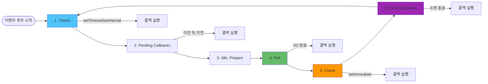

**각 단계의 상세 설명:**

1. **Timers**: `setTimeout()`, `setInterval()` 콜백 실행
   - 타이머가 만료된 콜백들을 실행합니다
   - 이 단계에서 실행할 콜백이 없으면 다음 단계로 진행합니다

2. **Pending Callbacks**: 완료된 비동기 I/O 콜백 실행
   - 이전 루프에서 지연된 콜백들을 실행합니다
   - 대부분의 I/O 콜백은 Poll 단계에서 처리됩니다

3. **Idle, Prepare**: 내부 정리 작업
   - Node.js 내부에서만 사용되는 단계입니다
   - 일반적으로 개발자가 직접 제어하지 않습니다

4. **Poll**: 새로운 I/O 이벤트 대기 및 처리
   - 새로운 I/O 이벤트를 가져와 관련 콜백을 실행합니다
   - 실행할 콜백이 없으면 Check 단계로 진행합니다
   - 이 단계에서 대부분의 I/O 작업이 처리됩니다

5. **Check**: `setImmediate()` 콜백 실행
   - Poll 단계가 완료된 후 즉시 실행됩니다
   - Poll 단계에서 대기 중인 콜백이 없으면 이 단계로 진행합니다

6. **Close Callbacks**: 소켓 종료 등 작업 처리
   - 소켓이나 핸들이 갑자기 닫힌 경우의 콜백을 처리합니다
   - 예: `socket.on('close', ...)`

#### 이벤트 큐의 종류와 우선순위

이벤트 루프는 여러 종류의 큐를 관리하며, 각 큐는 서로 다른 우선순위를 가집니다. 이 우선순위를 이해하면 비동기 코드의 실행 순서를 정확히 예측할 수 있습니다.

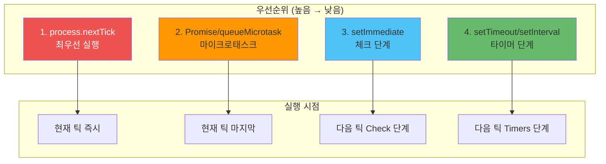

##### 1. Microtask Queue (마이크로태스크 큐)
```javascript
// Microtask Queue에 들어가는 작업들
Promise.then(() => console.log('Promise resolved'));
process.nextTick(() => console.log('nextTick'));
queueMicrotask(() => console.log('queueMicrotask'));
```

##### 2. Macrotask Queue (매크로태스크 큐)
```javascript
// Macrotask Queue에 들어가는 작업들
setTimeout(() => console.log('setTimeout'), 0);
setInterval(() => console.log('setInterval'), 1000);
setImmediate(() => console.log('setImmediate'));
```

##### 3. 실행 우선순위
```javascript
// 실행 우선순위: nextTick > Promise > setImmediate > setTimeout
process.nextTick(() => console.log('1. nextTick'));
Promise.resolve().then(() => console.log('2. Promise'));
setImmediate(() => console.log('3. setImmediate'));
setTimeout(() => console.log('4. setTimeout'), 0);
```

#### 논블로킹이 중요한 이유

✔ **동시 요청 처리 가능** → 서버가 한 번에 여러 요청을 처리할 수 있음  
✔ **CPU 유휴 상태 최소화** → 하나의 요청이 끝날 때까지 기다리지 않고 다른 작업 수행  
✔ **빠른 응답 속도** → 파일, 데이터베이스, 네트워크 요청을 병렬로 처리 가능  
✔ **Node.js 서버 성능 극대화** → 싱글 스레드에서도 고성능 처리 가능

#### 논블로킹 방식 활용 사례

##### 웹 서버 구축 (Express.js)
```javascript
const express = require('express');
const fs = require('fs');

const app = express();

app.get('/', (req, res) => {
    fs.readFile('example.txt', 'utf8', (err, data) => {
        if (err) return res.status(500).send("파일 읽기 오류");
        res.send(data);
    });
});

app.listen(3000, () => console.log("서버 실행 중..."));
```

##### 데이터베이스 연동 (MongoDB - Mongoose)
```javascript
const mongoose = require('mongoose');

mongoose.connect('mongodb://localhost:27017/testDB')
    .then(() => console.log("DB 연결 성공"))
    .catch(err => console.error("DB 연결 실패:", err));
```

##### 네트워크 요청 (Axios)
```javascript
const axios = require('axios');

axios.get('https://jsonplaceholder.typicode.com/posts/1')
    .then(response => console.log(response.data))
    .catch(error => console.error("네트워크 오류:", error));
```

### 2. Promise 최적화

#### Promise 체이닝 최적화
```javascript
// 비효율적인 Promise 체이닝
function inefficientPromiseChain() {
  return fetchUser(1)
    .then(user => {
      return fetchUserProfile(user.id)
        .then(profile => {
          return fetchUserPosts(user.id)
            .then(posts => {
              return { user, profile, posts };
            });
        });
    });
}

// 효율적인 Promise 체이닝
async function efficientPromiseChain() {
  const user = await fetchUser(1);
  const [profile, posts] = await Promise.all([
    fetchUserProfile(user.id),
    fetchUserPosts(user.id)
  ]);
  
  return { user, profile, posts };
}
```

#### Promise 풀링을 통한 리소스 관리
```javascript
class PromisePool {
  constructor(size = 10) {
    this.size = size;
    this.running = 0;
    this.queue = [];
  }
  
  async execute(task) {
    return new Promise((resolve, reject) => {
      this.queue.push({ task, resolve, reject });
      this.process();
    });
  }
  
  async process() {
    if (this.running >= this.size || this.queue.length === 0) {
      return;
    }
    
    this.running++;
    const { task, resolve, reject } = this.queue.shift();
    
    try {
      const result = await task();
      resolve(result);
    } catch (error) {
      reject(error);
    } finally {
      this.running--;
      this.process();
    }
  }
}

// 사용 예시
const pool = new PromisePool(5);
const tasks = Array.from({ length: 20 }, (_, i) => 
  () => fetch(`https://api.example.com/data/${i}`)
);
const results = await Promise.all(tasks.map(task => pool.execute(task)));
```

#### API 클라이언트 구현 예제
```javascript
class ApiClient {
  constructor(baseUrl) {
    this.baseUrl = baseUrl;
  }

  async request(endpoint, options = {}) {
    try {
      const response = await fetch(`${this.baseUrl}${endpoint}`, {
        ...options,
        headers: {
          'Content-Type': 'application/json',
          ...options.headers
        }
      });

      if (!response.ok) {
        throw new Error(`HTTP 에러! 상태: ${response.status}`);
      }

      return await response.json();
    } catch (error) {
      console.error('API 요청 실패:', error);
      throw error;
    }
  }

  async get(endpoint) {
    return this.request(endpoint);
  }

  async post(endpoint, data) {
    return this.request(endpoint, {
      method: 'POST',
      body: JSON.stringify(data)
    });
  }

  async put(endpoint, data) {
    return this.request(endpoint, {
      method: 'PUT',
      body: JSON.stringify(data)
    });
  }

  async delete(endpoint) {
    return this.request(endpoint, {
      method: 'DELETE'
    });
  }
}

// 사용 예시
const apiClient = new ApiClient('https://api.example.com');

// 병렬 API 호출
async function fetchUserData(userId) {
  const [user, posts, comments] = await Promise.all([
    apiClient.get(`/users/${userId}`),
    apiClient.get(`/users/${userId}/posts`),
    apiClient.get(`/users/${userId}/comments`)
  ]);
  
  return { user, posts, comments };
}
```

#### 실용적인 async/await 예제

##### 파일 읽기 Promise 래퍼
```javascript
// 파일 읽기 Promise
function readFileAsync(filename) {
  return new Promise((resolve, reject) => {
    // 실제 파일 읽기 작업 시뮬레이션
    setTimeout(() => {
      if (filename === 'data.txt') {
        resolve('파일 내용: Hello World!');
      } else {
        reject(new Error('파일을 찾을 수 없습니다.'));
      }
    }, 1000);
  });
}

// 사용하기
async function processFile() {
  try {
    const content = await readFileAsync('data.txt');
    console.log('파일 내용:', content);
  } catch (error) {
    console.error('파일 읽기 실패:', error.message);
  }
}
```

##### API 호출 예시
```javascript
// 비동기적으로 데이터를 가져오는 함수
async function fetchUserData(userId) {
  try {
    // API 호출
    const response = await fetch(`https://api.example.com/users/${userId}`);
    
    // 응답이 성공적이지 않으면 에러 발생
    if (!response.ok) {
      throw new Error(`HTTP error! status: ${response.status}`);
    }
    
    // JSON 데이터 파싱
    const userData = await response.json();
    return userData;
    
  } catch (error) {
    console.error('사용자 데이터 가져오기 실패:', error);
    throw error;
  }
}

// 사용 예시
async function displayUserInfo(userId) {
  try {
    const user = await fetchUserData(userId);
    console.log('사용자 정보:', user);
    return user;
  } catch (error) {
    console.error('사용자 정보 표시 실패:', error);
  }
}
```

##### 지연 함수와 활용
```javascript
// Promise를 반환하는 지연 함수
function delay(ms) {
  return new Promise(resolve => {
    setTimeout(resolve, ms);
  });
}

// async/await를 사용한 지연 처리
async function waitAndLog() {
  console.log('시작');
  await delay(2000); // 2초 대기
  console.log('2초 후 실행');
  return '완료';
}

// 사용
waitAndLog().then(result => {
  console.log(result); // '완료'
});
```

### 5. async/await 고급 패턴

#### async/await 기본 개념

async/await는 Promise를 더 쉽게 사용할 수 있게 해주는 문법적 설탕입니다.

```javascript
// 기존 Promise 방식
function fetchUserData(userId) {
    return fetch(`/api/users/${userId}`)
        .then(response => response.json())
        .then(data => {
            console.log('사용자 데이터:', data);
            return data;
        })
        .catch(error => {
            console.error('에러 발생:', error);
        });
}

// async/await 방식
async function fetchUserData(userId) {
    try {
        const response = await fetch(`/api/users/${userId}`);
        const data = await response.json();
        console.log('사용자 데이터:', data);
        return data;
    } catch (error) {
        console.error('에러 발생:', error);
    }
}
```

#### 순차 처리 vs 병렬 처리

```javascript
// 순차 처리 (느림)
async function fetchMultipleUsers(userIds) {
    const users = [];
    
    for (const id of userIds) {
        const user = await fetchUserData(id);
        users.push(user);
    }
    
    return users;
}

// 병렬 처리 (빠름)
async function fetchMultipleUsersParallel(userIds) {
    const promises = userIds.map(id => fetchUserData(id));
    const users = await Promise.all(promises);
    
    return users;
}
```

#### 복잡한 비동기 처리 예제

```javascript
async function processUserData() {
    try {
        // 사용자 데이터 가져오기
        const user = await fetchUserData();
        console.log('사용자:', user);

        // 사용자의 게시물 가져오기
        const posts = await fetchUserPosts(user.id);
        console.log('게시물:', posts);

        // 각 게시물의 댓글 가져오기
        const commentsPromises = posts.map(post => 
            fetchPostComments(post.id)
        );
        const comments = await Promise.all(commentsPromises);
        console.log('댓글들:', comments);

        return { user, posts, comments };
    } catch (error) {
        console.error('처리 중 에러 발생:', error);
        throw error;
    }
}
```

### 6. Web Workers와 멀티스레딩

#### Web Workers란?

JavaScript는 기본적으로 **싱글 스레드**로 동작합니다. 즉, 한 번에 하나의 작업만 처리할 수 있습니다. Web Workers를 사용하면 **별도의 스레드에서 작업을 수행**할 수 있어 메인 스레드가 멈추지 않습니다.

#### 기본 Web Worker 사용법

##### worker.js (별도 파일)
```javascript
// Worker 스레드에서 실행되는 코드
self.onmessage = function(e) {
    const data = e.data;
    
    // 복잡한 계산 작업
    let result = 0;
    for (let i = 0; i < data.iterations; i++) {
        result += Math.sqrt(i) * Math.PI;
    }
    
    // 계산 완료 후 메인 스레드로 결과 전송
    self.postMessage({
        result: result,
        message: '계산 완료!'
    });
};
```

##### main.js (메인 스레드)
```javascript
// Worker 생성
const worker = new Worker('worker.js');

// Worker로부터 메시지 받기
worker.onmessage = function(e) {
    const data = e.data;
    console.log('계산 결과:', data.result);
    console.log('메시지:', data.message);
};

// Worker로 데이터 전송
worker.postMessage({
    iterations: 1000000
});

// 메인 스레드는 계속 다른 작업 수행 가능
console.log('Worker에게 작업 요청 완료');
console.log('메인 스레드는 다른 작업 계속 수행 중...');
```

#### 이미지 처리 Worker 예제

##### imageWorker.js
```javascript
self.onmessage = function(e) {
    const imageData = e.data;
    const canvas = new OffscreenCanvas(imageData.width, imageData.height);
    const ctx = canvas.getContext('2d');
    
    // 이미지 데이터를 캔버스에 그리기
    ctx.putImageData(imageData, 0, 0);
    
    // 이미지 필터 적용 (예: 흑백 변환)
    const filteredData = applyGrayscaleFilter(imageData);
    
    self.postMessage(filteredData);
};

function applyGrayscaleFilter(imageData) {
    const data = imageData.data;
    
    for (let i = 0; i < data.length; i += 4) {
        const gray = data[i] * 0.299 + data[i + 1] * 0.587 + data[i + 2] * 0.114;
        data[i] = gray;     // Red
        data[i + 1] = gray; // Green
        data[i + 2] = gray; // Blue
    }
    
    return imageData;
}
```

##### 메인 스레드에서 사용
```javascript
const imageWorker = new Worker('imageWorker.js');

// 이미지 파일 선택 시
fileInput.addEventListener('change', function(e) {
    const file = e.target.files[0];
    const reader = new FileReader();
    
    reader.onload = function(e) {
        const img = new Image();
        img.onload = function() {
            const canvas = document.createElement('canvas');
            const ctx = canvas.getContext('2d');
            
            canvas.width = img.width;
            canvas.height = img.height;
            ctx.drawImage(img, 0, 0);
            
            // 이미지 데이터를 Worker로 전송
            const imageData = ctx.getImageData(0, 0, canvas.width, canvas.height);
            imageWorker.postMessage(imageData);
        };
        img.src = e.target.result;
    };
    
    reader.readAsDataURL(file);
});

// Worker로부터 처리된 이미지 받기
imageWorker.onmessage = function(e) {
    const processedImageData = e.data;
    const canvas = document.createElement('canvas');
    const ctx = canvas.getContext('2d');
    
    canvas.width = processedImageData.width;
    canvas.height = processedImageData.height;
    ctx.putImageData(processedImageData, 0, 0);
    
    // 처리된 이미지를 화면에 표시
    document.body.appendChild(canvas);
};
```

#### Web Workers 제약사항

- Worker는 DOM에 직접 접근할 수 없습니다
- Worker와 메인 스레드 간 통신은 `postMessage()`를 통해서만 가능합니다
- 복사 가능한 데이터만 전송할 수 있습니다 (함수, DOM 객체 등은 전송 불가)

### 7. async/await 최적화

#### 에러 처리 최적화
```javascript
// 비효율적인 에러 처리
async function inefficientErrorHandling() {
  try {
    const user = await fetchUser(1);
    try {
      const profile = await fetchUserProfile(user.id);
      try {
        const posts = await fetchUserPosts(user.id);
        return { user, profile, posts };
      } catch (error) {
        console.error('Posts fetch failed:', error);
        return { user, profile, posts: [] };
      }
    } catch (error) {
      console.error('Profile fetch failed:', error);
      return { user, profile: null, posts: [] };
    }
  } catch (error) {
    console.error('User fetch failed:', error);
    return null;
  }
}

// 효율적인 에러 처리
async function efficientErrorHandling() {
  try {
    const user = await fetchUser(1);
    const [profile, posts] = await Promise.allSettled([
      fetchUserProfile(user.id),
      fetchUserPosts(user.id)
    ]);
    
    return {
      user,
      profile: profile.status === 'fulfilled' ? profile.value : null,
      posts: posts.status === 'fulfilled' ? posts.value : []
    };
  } catch (error) {
    console.error('User fetch failed:', error);
    return null;
  }
}
```

#### 타임아웃 처리 최적화
```javascript
// 타임아웃이 있는 Promise 래퍼
function withTimeout(promise, timeoutMs) {
  return Promise.race([
    promise,
    new Promise((_, reject) => 
      setTimeout(() => reject(new Error('Timeout')), timeoutMs)
    )
  ]);
}

// 사용 예시
async function fetchWithTimeout() {
  try {
    const result = await withTimeout(
      fetch('https://api.example.com/slow-endpoint'),
      5000 // 5초 타임아웃
    );
    return result;
  } catch (error) {
    if (error.message === 'Timeout') {
      console.error('요청이 타임아웃되었습니다');
    } else {
      console.error('요청 실패:', error);
    }
  }
}
```

### 8. 이벤트 루프 최적화

#### setImmediate와 process.nextTick 활용

```javascript
// process.nextTick - 마이크로태스크 큐에 추가 (최우선)
process.nextTick(() => {
    console.log('nextTick 1');
});

// setImmediate - 체크 단계에서 실행
setImmediate(() => {
    console.log('setImmediate 1');
});

// setTimeout - 타이머 단계에서 실행
setTimeout(() => {
    console.log('setTimeout 1');
}, 0);

console.log('메인 스레드');

// 출력 순서:
// 메인 스레드
// nextTick 1
// setTimeout 1
// setImmediate 1
```

#### 이벤트 루프 블로킹 방지

```javascript
// CPU 집약적 작업을 청크로 분할
async function processLargeDataset(data) {
    const chunkSize = 1000;
    const results = [];
    
    for (let i = 0; i < data.length; i += chunkSize) {
        const chunk = data.slice(i, i + chunkSize);
        
        // 청크 처리
        const processedChunk = processChunk(chunk);
        results.push(...processedChunk);
        
        // 이벤트 루프에 제어권 양보
        await new Promise(resolve => setImmediate(resolve));
    }
    
    return results;
}

// 사용 예시
const largeData = Array.from({ length: 100000 }, (_, i) => i);
processLargeDataset(largeData).then(results => {
    console.log('처리 완료:', results.length);
});
```

#### 이벤트 루프 모니터링

```javascript
// 이벤트 루프 지연 시간 측정
function measureEventLoopDelay() {
    const start = process.hrtime.bigint();
    
    setImmediate(() => {
        const delay = Number(process.hrtime.bigint() - start) / 1000000; // ms
        console.log(`이벤트 루프 지연: ${delay.toFixed(2)}ms`);
        
        if (delay > 10) {
            console.warn('이벤트 루프 지연이 높습니다!');
        }
    });
}

// 주기적으로 이벤트 루프 지연 측정
setInterval(measureEventLoopDelay, 1000);
```

### 9. 비동기 처리 성능 모니터링

#### Promise 성능 측정

```javascript
// Promise 실행 시간 측정
async function measurePromisePerformance() {
    const start = performance.now();
    
    try {
        const result = await fetchUserData(1);
        const end = performance.now();
        
        console.log(`Promise 실행 시간: ${(end - start).toFixed(2)}ms`);
        return result;
    } catch (error) {
        const end = performance.now();
        console.log(`Promise 실패 시간: ${(end - start).toFixed(2)}ms`);
        throw error;
    }
}
```

#### 병렬 처리 성능 비교

```javascript
// 순차 처리 vs 병렬 처리 성능 비교
async function performanceComparison() {
    const userIds = [1, 2, 3, 4, 5];
    
    // 순차 처리
    console.time('순차 처리');
    const sequentialResults = [];
    for (const id of userIds) {
        const user = await fetchUserData(id);
        sequentialResults.push(user);
    }
    console.timeEnd('순차 처리');
    
    // 병렬 처리
    console.time('병렬 처리');
    const parallelResults = await Promise.all(
        userIds.map(id => fetchUserData(id))
    );
    console.timeEnd('병렬 처리');
    
    console.log('순차 처리 결과:', sequentialResults.length);
    console.log('병렬 처리 결과:', parallelResults.length);
}
```

#### 메모리 사용량 모니터링

```javascript
// 비동기 작업의 메모리 사용량 모니터링
function monitorMemoryUsage() {
    const memUsage = process.memoryUsage();
    
    console.log('메모리 사용량:');
    console.log(`RSS: ${(memUsage.rss / 1024 / 1024).toFixed(2)} MB`);
    console.log(`Heap Used: ${(memUsage.heapUsed / 1024 / 1024).toFixed(2)} MB`);
    console.log(`Heap Total: ${(memUsage.heapTotal / 1024 / 1024).toFixed(2)} MB`);
    console.log(`External: ${(memUsage.external / 1024 / 1024).toFixed(2)} MB`);
}

// 주기적으로 메모리 사용량 확인
setInterval(monitorMemoryUsage, 5000);
```

#### 비동기 작업 추적

```javascript
// 비동기 작업 추적 시스템
class AsyncTaskTracker {
    constructor() {
        this.tasks = new Map();
        this.completedTasks = 0;
        this.failedTasks = 0;
    }
    
    startTask(taskId, description) {
        this.tasks.set(taskId, {
            description,
            startTime: performance.now(),
            status: 'running'
        });
    }
    
    completeTask(taskId, result) {
        const task = this.tasks.get(taskId);
        if (task) {
            task.endTime = performance.now();
            task.duration = task.endTime - task.startTime;
            task.status = 'completed';
            task.result = result;
            this.completedTasks++;
        }
    }
    
    failTask(taskId, error) {
        const task = this.tasks.get(taskId);
        if (task) {
            task.endTime = performance.now();
            task.duration = task.endTime - task.startTime;
            task.status = 'failed';
            task.error = error;
            this.failedTasks++;
        }
    }
    
    getStats() {
        return {
            total: this.tasks.size,
            completed: this.completedTasks,
            failed: this.failedTasks,
            running: this.tasks.size - this.completedTasks - this.failedTasks
        };
    }
}

// 사용 예시
const tracker = new AsyncTaskTracker();

async function trackedAsyncOperation(taskId, operation) {
    tracker.startTask(taskId, '비동기 작업');
    
    try {
        const result = await operation();
        tracker.completeTask(taskId, result);
        return result;
    } catch (error) {
        tracker.failTask(taskId, error);
        throw error;
    }
}
```

### 10. 이벤트 루프 최적화

#### 이벤트 루프 블로킹 방지
```javascript
// CPU 집약적 작업을 청크로 분할
async function processLargeDataset(data) {
  const chunkSize = 1000;
  const chunks = [];
  
  for (let i = 0; i < data.length; i += chunkSize) {
    chunks.push(data.slice(i, i + chunkSize));
  }
  
  const results = [];
  
  for (const chunk of chunks) {
    // 각 청크를 처리
    const chunkResult = await processChunk(chunk);
    results.push(...chunkResult);
    
    // 이벤트 루프에 제어권 양보
    await new Promise(resolve => setImmediate(resolve));
  }
  
  return results;
}

// setImmediate를 사용한 비동기 처리
function asyncProcess(items, processor) {
  return new Promise((resolve) => {
    const results = [];
    let index = 0;
    
    function processNext() {
      if (index >= items.length) {
        resolve(results);
        return;
      }
      
      const result = processor(items[index]);
      results.push(result);
      index++;
      
      // 다음 틱에서 계속 처리
      setImmediate(processNext);
    }
    
    processNext();
  });
}
```

### 5. 비동기 처리 성능 모니터링

#### 비동기 작업 성능 측정
```javascript
class AsyncPerformanceMonitor {
  constructor() {
    this.metrics = {
      promiseResolveTime: [],
      asyncFunctionTime: [],
      eventLoopDelay: []
    };
  }
  
  // Promise 해결 시간 측정
  measurePromiseResolve(promise, label) {
    const start = Date.now();
    return promise.then(result => {
      const duration = Date.now() - start;
      this.metrics.promiseResolveTime.push({ label, duration });
      return result;
    });
  }
  
  // async 함수 실행 시간 측정
  async measureAsyncFunction(asyncFn, label) {
    const start = Date.now();
    const result = await asyncFn();
    const duration = Date.now() - start;
    this.metrics.asyncFunctionTime.push({ label, duration });
    return result;
  }
  
  // 이벤트 루프 지연 측정
  measureEventLoopDelay() {
    const start = process.hrtime.bigint();
    setImmediate(() => {
      const delay = Number(process.hrtime.bigint() - start) / 1000000; // ms
      this.metrics.eventLoopDelay.push(delay);
    });
  }
  
  // 성능 리포트 생성
  generateReport() {
    return {
      averagePromiseResolveTime: this.calculateAverage(this.metrics.promiseResolveTime),
      averageAsyncFunctionTime: this.calculateAverage(this.metrics.asyncFunctionTime),
      averageEventLoopDelay: this.calculateAverage(this.metrics.eventLoopDelay),
      maxEventLoopDelay: Math.max(...this.metrics.eventLoopDelay)
    };
  }
  
  calculateAverage(metrics) {
    if (metrics.length === 0) return 0;
    return metrics.reduce((sum, m) => sum + m.duration, 0) / metrics.length;
  }
}
```

## 실제 성능 병목 지점 분석 및 해결 사례

### 1. 데이터베이스 쿼리 최적화 사례

#### N+1 쿼리 문제 해결
```javascript
// 문제가 있는 코드 (N+1 쿼리)
async function getUsersWithPosts() {
  const users = await User.findAll();
  
  for (const user of users) {
    user.posts = await Post.findAll({ where: { userId: user.id } });
  }
  
  return users;
}

// 최적화된 코드 (JOIN 사용)
async function getUsersWithPostsOptimized() {
  return await User.findAll({
    include: [{
      model: Post,
      as: 'posts'
    }]
  });
}

// 또는 별도 쿼리로 최적화
async function getUsersWithPostsOptimized2() {
  const users = await User.findAll();
  const userIds = users.map(user => user.id);
  
  const posts = await Post.findAll({
    where: { userId: { [Op.in]: userIds } }
  });
  
  // 메모리에서 조인
  const postsByUser = posts.reduce((acc, post) => {
    if (!acc[post.userId]) acc[post.userId] = [];
    acc[post.userId].push(post);
    return acc;
  }, {});
  
  return users.map(user => ({
    ...user.toJSON(),
    posts: postsByUser[user.id] || []
  }));
}
```

### 2. API 응답 시간 최적화 사례

#### 캐싱을 통한 응답 시간 개선
```javascript
const NodeCache = require('node-cache');
const cache = new NodeCache({ stdTTL: 600 }); // 10분 TTL

class APIOptimizer {
  // 캐시를 사용한 API 응답 최적화
  async getCachedData(key, fetchFn, ttl = 600) {
    const cached = cache.get(key);
    if (cached) {
      return cached;
    }
    
    const data = await fetchFn();
    cache.set(key, data, ttl);
    return data;
  }
  
  // Redis를 사용한 분산 캐싱
  async getDistributedCache(key, fetchFn) {
    const redis = require('redis');
    const client = redis.createClient();
    
    try {
      const cached = await client.get(key);
      if (cached) {
        return JSON.parse(cached);
      }
      
      const data = await fetchFn();
      await client.setex(key, 600, JSON.stringify(data));
      return data;
    } finally {
      client.quit();
    }
  }
}

// 사용 예시
const optimizer = new APIOptimizer();

app.get('/api/users/:id', async (req, res) => {
  const userId = req.params.id;
  
  const user = await optimizer.getCachedData(
    `user:${userId}`,
    () => User.findByPk(userId)
  );
  
  res.json(user);
});
```

### 3. 메모리 사용량 최적화 사례

#### 스트림을 사용한 대용량 파일 처리
```javascript
const fs = require('fs');
const { Transform } = require('stream');

// 메모리 효율적인 CSV 처리
class CSVProcessor extends Transform {
  constructor() {
    super({ objectMode: true });
    this.header = null;
    this.rowCount = 0;
  }
  
  _transform(chunk, encoding, callback) {
    const lines = chunk.toString().split('\n');
    
    for (const line of lines) {
      if (!line.trim()) continue;
      
      const columns = line.split(',');
      
      if (!this.header) {
        this.header = columns;
        continue;
      }
      
      const row = {};
      this.header.forEach((col, index) => {
        row[col] = columns[index];
      });
      
      this.rowCount++;
      this.push(row);
      
      // 메모리 사용량 모니터링
      if (this.rowCount % 10000 === 0) {
        const usage = process.memoryUsage();
        console.log(`처리된 행 수: ${this.rowCount}, 메모리 사용량: ${(usage.heapUsed / 1024 / 1024).toFixed(2)} MB`);
      }
    }
    
    callback();
  }
}

// 사용 예시
const processor = new CSVProcessor();
const inputStream = fs.createReadStream('large-file.csv');
const outputStream = fs.createWriteStream('processed-data.json');

inputStream
  .pipe(processor)
  .pipe(outputStream)
  .on('finish', () => {
    console.log('CSV 처리 완료');
  });
```

## 성능 모니터링 및 알림

### 1. 실시간 성능 모니터링

#### 성능 메트릭 수집
```javascript
class PerformanceMonitor {
  constructor() {
    this.metrics = {
      responseTime: [],
      memoryUsage: [],
      cpuUsage: [],
      errorRate: 0,
      requestCount: 0
    };
    
    this.thresholds = {
      responseTime: 1000, // 1초
      memoryUsage: 500 * 1024 * 1024, // 500MB
      errorRate: 0.05 // 5%
    };
  }
  
  // 응답 시간 측정
  measureResponseTime(req, res, next) {
    const start = Date.now();
    
    res.on('finish', () => {
      const duration = Date.now() - start;
      this.metrics.responseTime.push(duration);
      
      // 최근 100개만 유지
      if (this.metrics.responseTime.length > 100) {
        this.metrics.responseTime.shift();
      }
      
      // 임계값 체크
      if (duration > this.thresholds.responseTime) {
        this.alert('High Response Time', { duration, url: req.url });
      }
    });
    
    next();
  }
  
  // 메모리 사용량 모니터링
  monitorMemory() {
    setInterval(() => {
      const usage = process.memoryUsage();
      this.metrics.memoryUsage.push({
        timestamp: Date.now(),
        heapUsed: usage.heapUsed,
        heapTotal: usage.heapTotal
      });
      
      if (usage.heapUsed > this.thresholds.memoryUsage) {
        this.alert('High Memory Usage', { heapUsed: usage.heapUsed });
      }
    }, 5000);
  }
  
  // 알림 발송
  alert(type, data) {
    console.warn(`ALERT: ${type}:`, data);
    
    // 실제 환경에서는 Slack, 이메일 등으로 알림
    // this.sendSlackNotification(type, data);
  }
  
  // 성능 리포트 생성
  generateReport() {
    const avgResponseTime = this.metrics.responseTime.reduce((a, b) => a + b, 0) / this.metrics.responseTime.length;
    const maxResponseTime = Math.max(...this.metrics.responseTime);
    
    return {
      averageResponseTime: avgResponseTime,
      maxResponseTime: maxResponseTime,
      requestCount: this.metrics.requestCount,
      errorRate: this.metrics.errorRate,
      memoryUsage: this.metrics.memoryUsage.slice(-10) // 최근 10개
    };
  }
}

// Express 미들웨어로 사용
const monitor = new PerformanceMonitor();
monitor.monitorMemory();

app.use(monitor.measureResponseTime.bind(monitor));
```

### 2. 성능 알림 시스템

#### 임계값 기반 알림
```javascript
class PerformanceAlert {
  constructor() {
    this.alerts = [];
    this.cooldown = 5 * 60 * 1000; // 5분 쿨다운
  }
  
  // 알림 조건 체크
  checkAlerts(metrics) {
    const now = Date.now();
    
    // 응답 시간 알림
    if (metrics.avgResponseTime > 1000) {
      this.sendAlert('HIGH_RESPONSE_TIME', {
        value: metrics.avgResponseTime,
        threshold: 1000
      });
    }
    
    // 메모리 사용량 알림
    if (metrics.memoryUsage > 500 * 1024 * 1024) {
      this.sendAlert('HIGH_MEMORY_USAGE', {
        value: metrics.memoryUsage,
        threshold: 500 * 1024 * 1024
      });
    }
    
    // 에러율 알림
    if (metrics.errorRate > 0.05) {
      this.sendAlert('HIGH_ERROR_RATE', {
        value: metrics.errorRate,
        threshold: 0.05
      });
    }
  }
  
  // 알림 발송
  sendAlert(type, data) {
    const alertKey = `${type}_${Math.floor(Date.now() / this.cooldown)}`;
    
    if (this.alerts.includes(alertKey)) {
      return; // 쿨다운 중
    }
    
    this.alerts.push(alertKey);
    
    // 알림 데이터 구성
    const alert = {
      type,
      timestamp: new Date().toISOString(),
      data,
      severity: this.getSeverity(type)
    };
    
    // 실제 알림 발송
    this.sendSlackNotification(alert);
    this.sendEmailNotification(alert);
    
    // 쿨다운 관리
    setTimeout(() => {
      const index = this.alerts.indexOf(alertKey);
      if (index > -1) {
        this.alerts.splice(index, 1);
      }
    }, this.cooldown);
  }
  
  // 심각도 결정
  getSeverity(type) {
    const severityMap = {
      'HIGH_RESPONSE_TIME': 'warning',
      'HIGH_MEMORY_USAGE': 'critical',
      'HIGH_ERROR_RATE': 'critical'
    };
    
    return severityMap[type] || 'info';
  }
  
  // Slack 알림
  sendSlackNotification(alert) {
    const webhook = process.env.SLACK_WEBHOOK_URL;
    if (!webhook) return;
    
    const message = {
      text: `Performance Alert: ${alert.type}`,
      attachments: [{
        color: alert.severity === 'critical' ? 'danger' : 'warning',
        fields: [
          { title: 'Type', value: alert.type, short: true },
          { title: 'Time', value: alert.timestamp, short: true },
          { title: 'Data', value: JSON.stringify(alert.data), short: false }
        ]
      }]
    };
    
    // 실제 Slack API 호출
    // fetch(webhook, { method: 'POST', body: JSON.stringify(message) });
  }
  
  // 이메일 알림
  sendEmailNotification(alert) {
    // 실제 이메일 발송 로직
    console.log('Email alert:', alert);
  }
}
```

## 트러블슈팅 가이드

### 일반적인 성능 문제와 해결책

**문제 해결 플로우차트:**

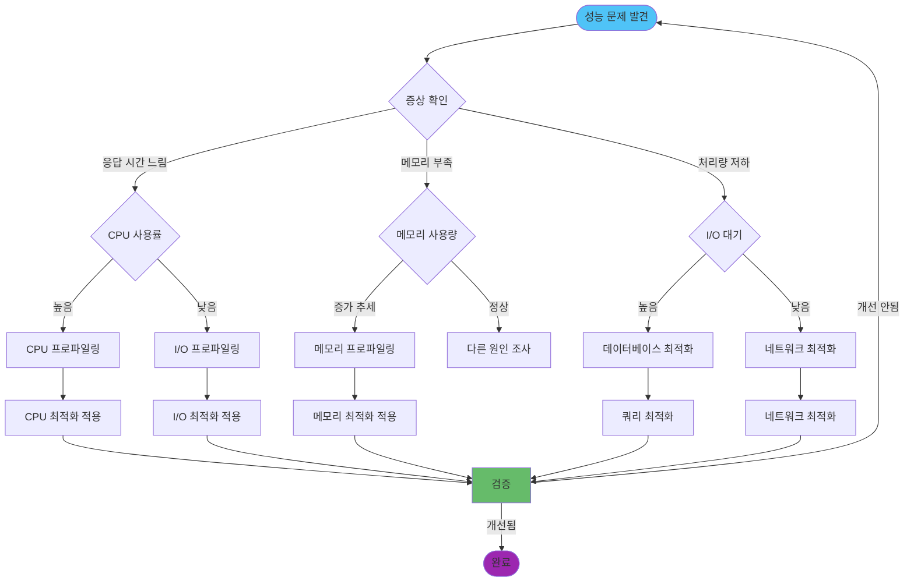

### 일반적인 문제와 해결책

**1. 응답 시간이 느린 경우:**

| 원인 | 증상 | 해결 방법 |
|------|------|----------|
| **CPU 병목** | CPU 사용률 80% 이상 | Worker Threads 사용, 알고리즘 최적화 |
| **동기 작업** | 이벤트 루프 블로킹 | 비동기 처리로 전환 |
| **N+1 쿼리** | 데이터베이스 쿼리 과다 | Eager Loading, 배치 쿼리 |
| **메모리 부족** | GC 빈도 증가 | 메모리 누수 제거, 메모리 풀링 |

**2. 메모리 사용량이 지속적으로 증가하는 경우:**

| 원인 | 증상 | 해결 방법 |
|------|------|----------|
| **메모리 누수** | 힙 메모리 지속 증가 | 이벤트 리스너 제거, WeakMap 활용 |
| **큰 객체 캐싱** | 캐시 크기 증가 | LRU 캐시, TTL 설정 |
| **순환 참조** | GC가 해제하지 못함 | 참조 구조 재설계 |
| **스트림 누수** | 스트림이 닫히지 않음 | 스트림 명시적 종료 |

**3. 처리량이 낮은 경우:**

| 원인 | 증상 | 해결 방법 |
|------|------|----------|
| **I/O 대기** | 대부분 시간이 I/O 대기 | 비동기 I/O 활용, 연결 풀 최적화 |
| **순차 처리** | 병렬 처리 가능한 작업을 순차 처리 | Promise.all, 병렬 처리 |
| **불필요한 작업** | 캐싱되지 않은 중복 계산 | 메모이제이션, 캐싱 |
| **리소스 경쟁** | 동시 접근 제한 | 큐 관리, Rate Limiting 조정 |

## 고급 활용

### 주의사항

**1. 성능 최적화 우선순위:**

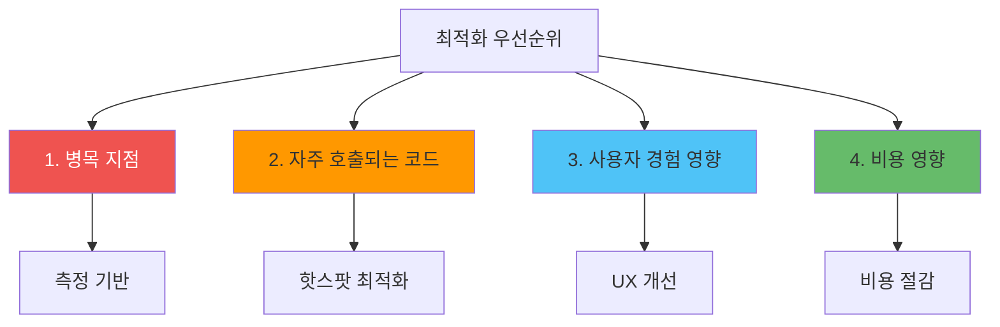

**2. 비용 고려사항:**

- **인프라 비용**: CPU/메모리 사용량 감소로 인한 비용 절감
- **개발 비용**: 최적화에 투입되는 시간 vs 성능 개선 효과
- **운영 비용**: 모니터링 도구, 알림 시스템 운영 비용
- **기회 비용**: 최적화에 투입한 시간을 다른 기능 개발에 사용할 수 있는 기회

**3. 팀 협업 관점:**

- **성능 목표 공유**: 팀 전체가 성능 목표를 이해하고 공유
- **코드 리뷰**: 성능에 영향을 주는 코드 변경 시 리뷰
- **지식 공유**: 최적화 경험과 노하우를 문서화하여 공유
- **모니터링 공유**: 모든 팀원이 성능 메트릭에 접근 가능

**4. 아키텍처 패턴 선택 기준:**

| 패턴 | 사용 시기 | 트레이드오프 |
|------|----------|------------|
| **Worker Threads** | CPU 집약적 작업 | 메모리 사용량 증가 vs CPU 효율 |
| **메모리 풀링** | 자주 생성/삭제되는 객체 | 메모리 사용량 vs 할당 오버헤드 |
| **캐싱** | 반복적인 계산/조회 | 메모리 사용량 vs 응답 시간 |
| **스트림** | 대용량 데이터 처리 | 복잡도 증가 vs 메모리 효율 |

**5. 실무에서 자주 놓치는 부분:**

- **프로파일링 없이 최적화**: 추측 기반 최적화는 오히려 성능을 저하시킬 수 있음
- **로컬 환경만 테스트**: 프로덕션 환경과의 차이를 고려하지 않음
- **단일 메트릭만 확인**: 전체 시스템 성능을 종합적으로 보지 않음
- **최적화 후 검증 부족**: 최적화 효과를 측정하지 않고 배포

## 요약
Node.js 성능 최적화는 지속적인 모니터링과 개선이 필요한 과정입니다.

### 주요 내용

- **측정 우선**: 최적화 전에 현재 성능을 정확히 측정
- **도구 활용**: Clinic.js, 0x, heapdump 등 전문 도구 사용
- **메모리 관리**: 메모리 누수 방지 및 효율적인 메모리 사용
- **비동기 최적화**: Promise, async/await, 스트림 활용
- **지속적 모니터링**: 실시간 성능 추적 및 알림 시스템

### 참고

1. **프로파일링 우선**: 최적화 전에 반드시 프로파일링 수행
2. **병목 지점 식별**: 실제 성능 저하 원인을 정확히 파악
3. **점진적 개선**: 한 번에 하나씩 최적화하고 측정
4. **모니터링 자동화**: 지속적인 성능 추적 및 알림 설정
5. **문서화**: 최적화 과정과 결과를 문서화하여 팀과 공유

### 관련 문서

- [부하 테스트](../성능/부하_테스트_전략.md) - 성능 벤치마킹 및 부하 테스트
- [Observability](../모니터링/Observability_전략.md) - 모니터링 및 성능 추적
- [캐싱](../캐싱/캐싱_전략.md) - 성능 향상을 위한 캐싱
- [ORM 심화](../데이터베이스/ORM_심화_전략.md) - 데이터베이스 쿼리 최적화
