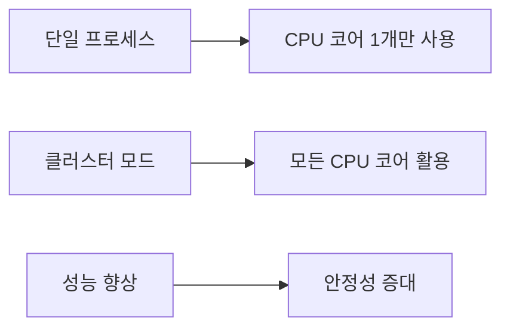

# PM2 클러스터 모드 (Cluster Mode)

## 배경
- [개념 이해](#개념-이해)
- [기본 사용법](#기본-사용법)
- [설정 파일 활용](#설정-파일-활용)
- [주요 명령어](#주요-명령어)
- [모니터링 및 관리](#모니터링-및-관리)
- [실제 사용 예시](#실제-사용-예시)
- [장점 및 특징](#장점-및-특징)

---


### PM2 클러스터 모드란?
PM2의 클러스터 모드는 단일 애플리케이션을 여러 인스턴스로 실행하여 **멀티코어를 활용**하는 방식입니다.

**핵심 특징:**
- ✅ **로드 밸런싱**: 요청을 각 인스턴스에 고르게 분배
- ✅ **CPU 최대 활용**: Node.js 싱글 스레드 한계 극복
- ✅ **자동 장애 복구**: 프로세스 중단 시 자동 재시작
- ✅ **간편한 관리**: 설정 파일을 통한 중앙 집중식 관리

### 왜 클러스터 모드가 필요한가?


---


---


### 1. 모든 CPU 코어 활용
```bash
pm2 start app.js -i max
```

### 2. 특정 인스턴스 개수 지정
```bash
pm2 start app.js -i 4
```

### 3. 애플리케이션 이름 지정
```bash
pm2 start app.js --name "my-app" -i max
```

**옵션 설명:**
- `-i max`: 사용 가능한 모든 CPU 코어 사용
- `-i 4`: 4개의 인스턴스 실행
- `--name`: 애플리케이션 이름 지정

---


### ecosystem.config.js 생성
```javascript
module.exports = {
  apps: [
    {
      name: "my-cluster-app",        // 애플리케이션 이름
      script: "app.js",              // 실행할 파일
      instances: "max",              // 모든 CPU 코어 사용
      exec_mode: "cluster",          // 클러스터 모드 활성화
      watch: true,                   // 파일 변경 시 자동 재시작
      max_memory_restart: "1G",      // 메모리 초과 시 재시작
      env: {                         // 환경 변수
        NODE_ENV: "production",
        PORT: 3000
      },
      error_file: "./logs/err.log",  // 에러 로그 파일
      out_file: "./logs/out.log",    // 출력 로그 파일
      log_file: "./logs/combined.log", // 통합 로그 파일
      time: true                     // 로그에 타임스탬프 추가
    }
  ]
}
```

### 설정 파일로 실행
```bash
pm2 start ecosystem.config.js
```

---

```bash
pm2 start ecosystem.config.js
```

---


### 프로세스 관리
| 명령어 | 설명 | 예시 |
|--------|------|------|
| `pm2 list` | 실행 중인 프로세스 목록 확인 | `pm2 list` |
| `pm2 show <id>` | 특정 프로세스 상세 정보 | `pm2 show 0` |
| `pm2 stop <id>` | 프로세스 중지 | `pm2 stop all` |
| `pm2 restart <id>` | 프로세스 재시작 | `pm2 restart all` |
| `pm2 delete <id>` | 프로세스 삭제 | `pm2 delete all` |

### 로그 관리
| 명령어 | 설명 | 예시 |
|--------|------|------|
| `pm2 logs` | 모든 로그 확인 | `pm2 logs` |
| `pm2 logs <id>` | 특정 프로세스 로그 | `pm2 logs 0` |
| `pm2 flush` | 로그 파일 초기화 | `pm2 flush` |

### 모니터링
| 명령어 | 설명 | 예시 |
|--------|------|------|
| `pm2 monit` | 실시간 모니터링 대시보드 | `pm2 monit` |
| `pm2 status` | 프로세스 상태 확인 | `pm2 status` |

---

| 명령어 | 설명 | 예시 |
|--------|------|------|
| `pm2 list` | 실행 중인 프로세스 목록 확인 | `pm2 list` |
| `pm2 show <id>` | 특정 프로세스 상세 정보 | `pm2 show 0` |
| `pm2 stop <id>` | 프로세스 중지 | `pm2 stop all` |
| `pm2 restart <id>` | 프로세스 재시작 | `pm2 restart all` |
| `pm2 delete <id>` | 프로세스 삭제 | `pm2 delete all` |

| 명령어 | 설명 | 예시 |
|--------|------|------|
| `pm2 logs` | 모든 로그 확인 | `pm2 logs` |
| `pm2 logs <id>` | 특정 프로세스 로그 | `pm2 logs 0` |
| `pm2 flush` | 로그 파일 초기화 | `pm2 flush` |

| 명령어 | 설명 | 예시 |
|--------|------|------|
| `pm2 monit` | 실시간 모니터링 대시보드 | `pm2 monit` |
| `pm2 status` | 프로세스 상태 확인 | `pm2 status` |

---


### PM2 대시보드 실행
```bash
pm2 monit
```

**대시보드에서 확인 가능한 정보:**
- 📈 CPU 사용률
- 💾 메모리 사용량
- 🔄 프로세스 상태
- 📝 실시간 로그
- ⚡ 응답 시간

### 로그 확인 및 관리
```bash

```bash

pm2 logs --lines 100

pm2 logs my-app --lines 50


### 1. Express.js 애플리케이션 클러스터 모드 실행
```javascript
// app.js
const express = require('express');
const app = express();
const port = process.env.PORT || 3000;

app.get('/', (req, res) => {
  res.json({
    message: 'Hello from PM2 Cluster Mode!',
    processId: process.pid,
    timestamp: new Date().toISOString()
  });
});

app.listen(port, () => {
  console.log(`Server running on port ${port} with PID: ${process.pid}`);
});
```

### 2. 프로덕션 환경 설정
```javascript
// ecosystem.config.js
module.exports = {
  apps: [
    {
      name: "api-server",
      script: "app.js",
      instances: "max",
      exec_mode: "cluster",
      env: {
        NODE_ENV: "production",
        PORT: 3000
      },
      env_production: {
        NODE_ENV: "production",
        PORT: 3000
      },
      max_memory_restart: "1G",
      min_uptime: "10s",
      max_restarts: 10,
      watch: false,
      ignore_watch: ["node_modules", "logs"],
      log_date_format: "YYYY-MM-DD HH:mm:ss Z"
    }
  ]
};
```

### 3. 실행 및 관리 스크립트
```bash

pm2 stop api-server

pm2 start ecosystem.config.js --env production

pm2 status

echo "✅ Deployment completed!"
```

---


---


---


```bash
pm2 start ecosystem.config.js
```

---

```bash
pm2 start ecosystem.config.js
```

---


| 명령어 | 설명 | 예시 |
|--------|------|------|
| `pm2 list` | 실행 중인 프로세스 목록 확인 | `pm2 list` |
| `pm2 show <id>` | 특정 프로세스 상세 정보 | `pm2 show 0` |
| `pm2 stop <id>` | 프로세스 중지 | `pm2 stop all` |
| `pm2 restart <id>` | 프로세스 재시작 | `pm2 restart all` |
| `pm2 delete <id>` | 프로세스 삭제 | `pm2 delete all` |

| 명령어 | 설명 | 예시 |
|--------|------|------|
| `pm2 logs` | 모든 로그 확인 | `pm2 logs` |
| `pm2 logs <id>` | 특정 프로세스 로그 | `pm2 logs 0` |
| `pm2 flush` | 로그 파일 초기화 | `pm2 flush` |

| 명령어 | 설명 | 예시 |
|--------|------|------|
| `pm2 monit` | 실시간 모니터링 대시보드 | `pm2 monit` |
| `pm2 status` | 프로세스 상태 확인 | `pm2 status` |

---

| 명령어 | 설명 | 예시 |
|--------|------|------|
| `pm2 list` | 실행 중인 프로세스 목록 확인 | `pm2 list` |
| `pm2 show <id>` | 특정 프로세스 상세 정보 | `pm2 show 0` |
| `pm2 stop <id>` | 프로세스 중지 | `pm2 stop all` |
| `pm2 restart <id>` | 프로세스 재시작 | `pm2 restart all` |
| `pm2 delete <id>` | 프로세스 삭제 | `pm2 delete all` |

| 명령어 | 설명 | 예시 |
|--------|------|------|
| `pm2 logs` | 모든 로그 확인 | `pm2 logs` |
| `pm2 logs <id>` | 특정 프로세스 로그 | `pm2 logs 0` |
| `pm2 flush` | 로그 파일 초기화 | `pm2 flush` |

| 명령어 | 설명 | 예시 |
|--------|------|------|
| `pm2 monit` | 실시간 모니터링 대시보드 | `pm2 monit` |
| `pm2 status` | 프로세스 상태 확인 | `pm2 status` |

---


```bash

```bash

pm2 logs --lines 100

pm2 logs my-app --lines 50


### 성능 향상
- **CPU 코어 최대 활용**: 모든 코어를 사용하여 처리량 증가
- **로드 밸런싱**: 요청을 여러 프로세스에 분산
- **응답 시간 단축**: 병렬 처리로 인한 성능 향상

### 안정성 증대
- **자동 장애 복구**: 프로세스 중단 시 자동 재시작
- **무중단 배포**: 롤링 업데이트 지원
- **메모리 관리**: 메모리 초과 시 자동 재시작

### 개발 편의성
- **간편한 설정**: JSON 설정 파일로 직관적 관리
- **실시간 모니터링**: 대시보드를 통한 상태 확인
- **로그 관리**: 중앙집중식 로그 수집 및 관리

---

- **CPU 코어 최대 활용**: 모든 코어를 사용하여 처리량 증가
- **로드 밸런싱**: 요청을 여러 프로세스에 분산
- **응답 시간 단축**: 병렬 처리로 인한 성능 향상

- **자동 장애 복구**: 프로세스 중단 시 자동 재시작
- **무중단 배포**: 롤링 업데이트 지원
- **메모리 관리**: 메모리 초과 시 자동 재시작

- **간편한 설정**: JSON 설정 파일로 직관적 관리
- **실시간 모니터링**: 대시보드를 통한 상태 확인
- **로그 관리**: 중앙집중식 로그 수집 및 관리

---


### 메모리 사용량
- 각 인스턴스가 독립적인 메모리 공간 사용
- 전체 메모리 사용량 = 인스턴스 수 × 단일 인스턴스 메모리

### 세션 관리
- 클러스터 모드에서는 세션 공유가 필요할 수 있음
- Redis 등을 활용한 세션 스토리지 권장

### 파일 업로드
- 파일 업로드 시 임시 디렉토리 관리 주의
- 공유 스토리지 사용 권장

---

- 각 인스턴스가 독립적인 메모리 공간 사용
- 전체 메모리 사용량 = 인스턴스 수 × 단일 인스턴스 메모리

- 클러스터 모드에서는 세션 공유가 필요할 수 있음
- Redis 등을 활용한 세션 스토리지 권장

- 파일 업로드 시 임시 디렉토리 관리 주의
- 공유 스토리지 사용 권장

---


- [PM2 공식 문서](https://pm2.keymetrics.io/)
- [PM2 GitHub Repository](https://github.com/Unitech/pm2)
- [Node.js Cluster Module](https://nodejs.org/api/cluster.html)

---

> 💡 **팁**: 프로덕션 환경에서는 `ecosystem.config.js` 파일을 사용하여 설정을 관리하는 것을 권장합니다. 이를 통해 버전 관리와 배포 자동화가 용이해집니다.


### 성능 향상
- **CPU 코어 최대 활용**: 모든 코어를 사용하여 처리량 증가
- **로드 밸런싱**: 요청을 여러 프로세스에 분산
- **응답 시간 단축**: 병렬 처리로 인한 성능 향상

### 안정성 증대
- **자동 장애 복구**: 프로세스 중단 시 자동 재시작
- **무중단 배포**: 롤링 업데이트 지원
- **메모리 관리**: 메모리 초과 시 자동 재시작

### 개발 편의성
- **간편한 설정**: JSON 설정 파일로 직관적 관리
- **실시간 모니터링**: 대시보드를 통한 상태 확인
- **로그 관리**: 중앙집중식 로그 수집 및 관리

---

- **CPU 코어 최대 활용**: 모든 코어를 사용하여 처리량 증가
- **로드 밸런싱**: 요청을 여러 프로세스에 분산
- **응답 시간 단축**: 병렬 처리로 인한 성능 향상

- **자동 장애 복구**: 프로세스 중단 시 자동 재시작
- **무중단 배포**: 롤링 업데이트 지원
- **메모리 관리**: 메모리 초과 시 자동 재시작

- **간편한 설정**: JSON 설정 파일로 직관적 관리
- **실시간 모니터링**: 대시보드를 통한 상태 확인
- **로그 관리**: 중앙집중식 로그 수집 및 관리

---


### 메모리 사용량
- 각 인스턴스가 독립적인 메모리 공간 사용
- 전체 메모리 사용량 = 인스턴스 수 × 단일 인스턴스 메모리

### 세션 관리
- 클러스터 모드에서는 세션 공유가 필요할 수 있음
- Redis 등을 활용한 세션 스토리지 권장

### 파일 업로드
- 파일 업로드 시 임시 디렉토리 관리 주의
- 공유 스토리지 사용 권장

---

- 각 인스턴스가 독립적인 메모리 공간 사용
- 전체 메모리 사용량 = 인스턴스 수 × 단일 인스턴스 메모리

- 클러스터 모드에서는 세션 공유가 필요할 수 있음
- Redis 등을 활용한 세션 스토리지 권장

- 파일 업로드 시 임시 디렉토리 관리 주의
- 공유 스토리지 사용 권장

---


- [PM2 공식 문서](https://pm2.keymetrics.io/)
- [PM2 GitHub Repository](https://github.com/Unitech/pm2)
- [Node.js Cluster Module](https://nodejs.org/api/cluster.html)

---

> 💡 **팁**: 프로덕션 환경에서는 `ecosystem.config.js` 파일을 사용하여 설정을 관리하는 것을 권장합니다. 이를 통해 버전 관리와 배포 자동화가 용이해집니다.


> PM2는 Node.js 애플리케이션의 프로세스를 효율적으로 관리하고, **고가용성**과 **부하 분산**을 제공하는 **프로세스 관리자**입니다.

- **CPU 코어 최대 활용**: 모든 코어를 사용하여 처리량 증가
- **로드 밸런싱**: 요청을 여러 프로세스에 분산
- **응답 시간 단축**: 병렬 처리로 인한 성능 향상

- **자동 장애 복구**: 프로세스 중단 시 자동 재시작
- **무중단 배포**: 롤링 업데이트 지원
- **메모리 관리**: 메모리 초과 시 자동 재시작

- **간편한 설정**: JSON 설정 파일로 직관적 관리
- **실시간 모니터링**: 대시보드를 통한 상태 확인
- **로그 관리**: 중앙집중식 로그 수집 및 관리

---

- **CPU 코어 최대 활용**: 모든 코어를 사용하여 처리량 증가
- **로드 밸런싱**: 요청을 여러 프로세스에 분산
- **응답 시간 단축**: 병렬 처리로 인한 성능 향상

- **자동 장애 복구**: 프로세스 중단 시 자동 재시작
- **무중단 배포**: 롤링 업데이트 지원
- **메모리 관리**: 메모리 초과 시 자동 재시작

- **간편한 설정**: JSON 설정 파일로 직관적 관리
- **실시간 모니터링**: 대시보드를 통한 상태 확인
- **로그 관리**: 중앙집중식 로그 수집 및 관리

---


- 각 인스턴스가 독립적인 메모리 공간 사용
- 전체 메모리 사용량 = 인스턴스 수 × 단일 인스턴스 메모리

- 클러스터 모드에서는 세션 공유가 필요할 수 있음
- Redis 등을 활용한 세션 스토리지 권장

- 파일 업로드 시 임시 디렉토리 관리 주의
- 공유 스토리지 사용 권장

---

- 각 인스턴스가 독립적인 메모리 공간 사용
- 전체 메모리 사용량 = 인스턴스 수 × 단일 인스턴스 메모리

- 클러스터 모드에서는 세션 공유가 필요할 수 있음
- Redis 등을 활용한 세션 스토리지 권장

- 파일 업로드 시 임시 디렉토리 관리 주의
- 공유 스토리지 사용 권장

---


- [PM2 공식 문서](https://pm2.keymetrics.io/)
- [PM2 GitHub Repository](https://github.com/Unitech/pm2)
- [Node.js Cluster Module](https://nodejs.org/api/cluster.html)

---

> 💡 **팁**: 프로덕션 환경에서는 `ecosystem.config.js` 파일을 사용하여 설정을 관리하는 것을 권장합니다. 이를 통해 버전 관리와 배포 자동화가 용이해집니다.


> PM2는 Node.js 애플리케이션의 프로세스를 효율적으로 관리하고, **고가용성**과 **부하 분산**을 제공하는 **프로세스 관리자**입니다.


# JSON 형식으로 로그 출력
pm2 logs --json
```

---

#!/bin/bash
# deploy.sh

echo "🚀 Starting deployment..."

