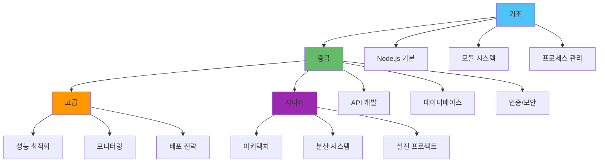

# 📚 Node.js 프레임워크 문서 인덱스

> Node.js 백엔드 개발을 위한 종합 학습 자료입니다. 시니어 개발자 수준의 실전 지식을 다룹니다.

## 🎯 학습 경로

### 초급 → 중급 → 고급

## 📖 주제별 문서 분류

### 🔧 기초 및 구조

#### Node.js 기본
- [Node.js 기본 개념과 구조](./Nodejs의%20구조%20및%20작동%20원리/Node.md) - V8 엔진, libuv, 이벤트 루프
- [Cluster와 Multi Thread](./Nodejs의%20구조%20및%20작동%20원리/Cluster와%20Multi%20Thread.md) - 멀티프로세싱, 워커 스레드
- [Thread](./Nodejs의%20구조%20및%20작동%20원리/Thread.md) - 워커 스레드 상세

#### 모듈 시스템
- [CommonJS vs ESM](./모듈%20시스템/CommonJS%20vs%20ESM.md) - 모듈 시스템 비교
- [npm](./모듈%20시스템/npm.md) - 패키지 관리
- [npx](./모듈%20시스템/npx.md) - 패키지 실행
- [pnpm](./모듈%20시스템/pnpm.md) - 효율적인 패키지 관리

#### 프로세스 관리
- [PM2](./Process%20Management%20Tool/pm2/pm2.md) - 프로세스 관리
- [PM2 클러스터 모드](./Process%20Management%20Tool/pm2/클러스터_모드.md) - 클러스터링
- [PM2 Ecosystem](./Process%20Management%20Tool/pm2/ecosystem.md) - 설정 파일 관리
- [Forever](./Process%20Management%20Tool/forever.md) - 간단한 프로세스 관리

### 🌐 API 개발

#### API 설계
- [API 설계 원칙](./API/API_설계_원칙.md) - RESTful 고급 패턴, 버저닝, 문서화
- [GraphQL](./API/GraphQL.md) - GraphQL 상세 전략
- [Rate Limiting](./API/Rate_Limiting.md) - API 제한 및 보호

#### 통신
- [WebSocket/Socket.io](./통신/WebSocket_SocketIO.md) - 실시간 통신 전략
- [스트림](./데이터%20처리%20및%20통신/스트림(Stream).md) - 스트림 처리

### 💾 데이터베이스

- [ORM 심화 전략](./데이터베이스/ORM_심화_전략.md) - TypeORM, Sequelize, Prisma
- [연결 풀 관리](./데이터베이스/연결_풀_관리.md) - 연결 풀 최적화, Read/Write 분리
- [분산 트랜잭션 전략](./데이터베이스/분산_트랜잭션_전략.md) - Saga, 이벤트 소싱, CQRS

### 🔐 인증 및 보안

- [JWT 구현 및 보안](./인증/JWT_구현_및_보안.md) - Access/Refresh Token, 보안
- [보안 모범 사례](./보안/Node.js_보안_모범사례.md) - Helmet, CORS, 입력 검증

### ⚡ 성능 및 최적화

- [성능 최적화 및 프로파일링](./Performance/Node.js_성능_최적화_및_프로파일링.md) - 프로파일링, 메모리, CPU 최적화
- [부하 테스트 전략](./성능/부하_테스트_전략.md) - k6, Artillery, 벤치마킹
- [캐싱 전략](./캐싱/캐싱_전략.md) - Redis 패턴, 캐시 무효화

### 📊 모니터링 및 관찰 가능성

- [로깅 전략](./로깅/로깅_전략.md) - Winston, Pino, 구조화 로깅
- [Observability 전략](./모니터링/Observability_전략.md) - APM, 분산 추적, OpenTelemetry

### 🛡️ 안정성 및 품질

- [에러 핸들링 전략](./에러_핸들링/에러_핸들링_전략.md) - 에러 타입, 커스텀 에러, 복구
- [코드 품질 및 리팩토링](./코드_품질/리팩토링_전략.md) - 코드 냄새, 리팩토링 패턴

### 🚀 배포 및 운영

- [배포 전략](./배포/배포_전략.md) - Blue-Green, Canary, Rolling 배포
- [Bitbucket Pipeline](./Bitbucket_Pipeline.md) - CI/CD 파이프라인

### 🔄 백그라운드 작업

- [작업 큐 처리](./백그라운드_작업/작업_큐_처리.md) - Bull Queue, Agenda, 재시도

### 📁 파일 처리

- [파일 업로드 및 처리](./파일_처리/파일_업로드_및_처리.md) - Multer, S3, 이미지 최적화

### 🧪 테스트

- [테스트 자동화 및 품질 보증](./Testing/테스트_자동화_및_품질_보증.md) - 테스트 전략, CI/CD 통합
- [API E2E 테스트 패턴](./Testing/API_E2E_테스트_패턴.md) - E2E 테스트
- [데이터베이스 통합 테스트](./Testing/Database_Integration_Testing.md) - DB 테스트
- [외부 API 모킹](./Testing/외부_API_모킹.md) - 모킹 전략

### 🏗️ 프레임워크

#### NestJS
- [NestJS 사용법](./NestJS/How_To_USE.md) - NestJS 상세 가이드
- [NestJS vs Express](./NestJS/NestJs%20vs%20ExpressJs.md) - 프레임워크 비교

#### 프레임워크 비교
- [NestJS vs Hapi vs Express vs Fastify](./Nest_Hapi_Express_fastify.md) - 종합 비교

### 🏛️ 아키텍처

- [마이크로서비스 통신 패턴](./아키텍처/마이크로서비스_통신_패턴.md) - 동기/비동기 통신, Circuit Breaker, Service Discovery

### 📚 실전 예제

- [프로젝트 구조 예제](./실전_예제/프로젝트_구조_예제.md) - Express/NestJS 프로젝트 구조

### 💡 기타

- [함수형 프로그래밍](./함수형%20프로그래밍.md) - 함수형 패러다임

## 🗺️ 실전 시나리오별 학습 경로

### 시나리오 1: RESTful API 개발

1. [API 설계 원칙](./API/API_설계_원칙.md) - API 설계 기초
2. [JWT 구현 및 보안](./인증/JWT_구현_및_보안.md) - 인증 구현
3. [ORM 심화 전략](./데이터베이스/ORM_심화_전략.md) - 데이터베이스 연동
4. [Rate Limiting](./API/Rate_Limiting.md) - API 보호
5. [에러 핸들링](./에러_핸들링/에러_핸들링_전략.md) - 에러 처리
6. [로깅 전략](./로깅/로깅_전략.md) - 로깅 구현

### 시나리오 2: 실시간 애플리케이션

1. [WebSocket/Socket.io](./통신/WebSocket_SocketIO.md) - 실시간 통신
2. [JWT 구현 및 보안](./인증/JWT_구현_및_보안.md) - WebSocket 인증
3. [캐싱 전략](./캐싱/캐싱_전략.md) - 실시간 데이터 캐싱
4. [Observability 전략](./모니터링/Observability_전략.md) - 실시간 모니터링

### 시나리오 3: 고성능 시스템 구축

1. [성능 최적화](./Performance/Node.js_성능_최적화_및_프로파일링.md) - 성능 최적화 기초
2. [연결 풀 관리](./데이터베이스/연결_풀_관리.md) - 데이터베이스 최적화
3. [캐싱 전략](./캐싱/캐싱_전략.md) - 캐싱 구현
4. [부하 테스트](./성능/부하_테스트_전략.md) - 성능 검증
5. [Observability 전략](./모니터링/Observability_전략.md) - 성능 모니터링

### 시나리오 4: 안전한 프로덕션 배포

1. [보안 모범 사례](./보안/Node.js_보안_모범사례.md) - 보안 강화
2. [에러 핸들링](./에러_핸들링/에러_핸들링_전략.md) - 안정성 확보
3. [로깅 전략](./로깅/로깅_전략.md) - 운영 로깅
4. [Observability 전략](./모니터링/Observability_전략.md) - 모니터링 구축
5. [배포 전략](./배포/배포_전략.md) - 무중단 배포

## 📊 문서 통계

### 주제별 문서 수

| 주제 | 문서 수 | 주요 문서 |
|------|---------|----------|
| **API** | 3 | API 설계, GraphQL, Rate Limiting |
| **데이터베이스** | 3 | ORM, 연결 풀, 분산 트랜잭션 |
| **아키텍처** | 1 | 마이크로서비스 통신 |
| **실전 예제** | 1 | 프로젝트 구조 |
| **인증/보안** | 2 | JWT, 보안 모범 사례 |
| **성능** | 2 | 성능 최적화, 부하 테스트 |
| **모니터링** | 2 | 로깅, Observability |
| **배포** | 1 | 배포 전략 |
| **기타** | 6+ | 에러 핸들링, 파일 처리, 백그라운드 작업 등 |

## 🔗 빠른 참조

### 자주 사용되는 패턴

- **인증**: [JWT 구현](./인증/JWT_구현_및_보안.md) → [보안 모범 사례](./보안/Node.js_보안_모범사례.md)
- **데이터베이스**: [ORM 심화](./데이터베이스/ORM_심화_전략.md) → [연결 풀](./데이터베이스/연결_풀_관리.md)
- **성능**: [성능 최적화](./Performance/Node.js_성능_최적화_및_프로파일링.md) → [부하 테스트](./성능/부하_테스트_전략.md)
- **모니터링**: [로깅](./로깅/로깅_전략.md) → [Observability](./모니터링/Observability_전략.md)

### 문제 해결 가이드

| 문제 | 관련 문서 |
|------|----------|
| 느린 API 응답 | [성능 최적화](./Performance/Node.js_성능_최적화_및_프로파일링.md), [캐싱](./캐싱/캐싱_전략.md) |
| 메모리 누수 | [성능 최적화](./Performance/Node.js_성능_최적화_및_프로파일링.md) |
| 데이터베이스 병목 | [ORM 심화](./데이터베이스/ORM_심화_전략.md), [연결 풀](./데이터베이스/연결_풀_관리.md) |
| 보안 취약점 | [보안 모범 사례](./보안/Node.js_보안_모범사례.md), [JWT](./인증/JWT_구현_및_보안.md) |
| 배포 중 장애 | [배포 전략](./배포/배포_전략.md), [에러 핸들링](./에러_핸들링/에러_핸들링_전략.md) |
| 모니터링 부족 | [Observability](./모니터링/Observability_전략.md), [로깅](./로깅/로깅_전략.md) |

## 🎓 학습 단계별 추천

### 1단계: 기초 (1-2년차)

- Node.js 기본 개념
- 모듈 시스템
- Express 기초
- 기본 인증 구현

### 2단계: 중급 (3-4년차)

- API 설계 원칙
- ORM 활용
- 에러 핸들링
- 로깅 전략
- 기본 보안

### 3단계: 고급 (5년차+)

- 성능 최적화
- 분산 시스템
- 고급 배포 전략
- Observability
- 아키텍처 설계

## 📝 문서 업데이트

- **최종 업데이트**: 2025-11-17
- **문서 버전**: v2.0
- **대상 독자**: 5년차+ 시니어 Node.js 백엔드 개발자

## 💬 피드백

문서에 대한 피드백이나 개선 제안은 언제든 환영합니다.

