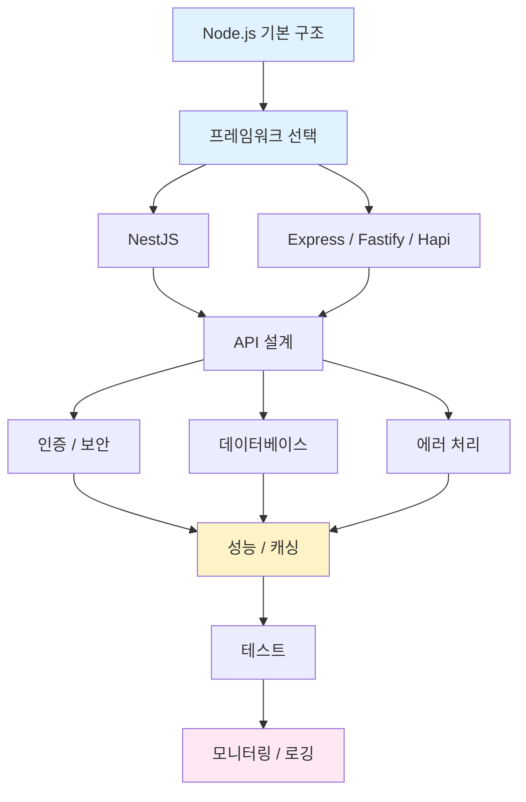

# Node.js 프레임워크 문서 인덱스

Node.js 백엔드 개발 과정에서 마주치는 주제별 기술 문서 모음이다. 문서 간 관계를 파악하고, 지금 필요한 문서를 빠르게 찾는 데 초점을 맞췄다.

---

## 문서 구조 한눈에 보기

```mermaid
graph TD
    A[Node.js 기본 구조] --> B[프레임워크 선택]
    B --> C[NestJS]
    B --> D[Express / Fastify / Hapi]

    C --> E[API 설계]
    D --> E

    E --> F[인증 / 보안]
    E --> G[데이터베이스]
    E --> H[에러 처리]

    F --> I[성능 / 캐싱]
    G --> I
    H --> I

    I --> J[테스트]
    J --> K[모니터링 / 로깅]

    style A fill:#e0f2fe
    style B fill:#e0f2fe
    style I fill:#fef3c7
    style K fill:#fce7f3
```

문서를 처음 읽는 순서와 프로젝트 진행 흐름이 대체로 일치한다. 위에서 아래로 따라가면 된다.

---

## 주제별 문서 분류

### 프레임워크 개요

프레임워크를 선택하기 전에 읽어야 한다. Express, Fastify, NestJS, Koa, Hapi의 설계 철학 차이와 실제 프레임워크 교체 시 부딪히는 문제를 정리했다.

- [Node.js 프레임워크 개요](./Nodejs_Framework_Overview.md) - Express, Fastify, NestJS, Koa, Hapi의 등장 배경과 설계 방향 차이. 프레임워크 선택·교체 시 판단 기준
- [NestJS vs Hapi vs Express vs Fastify](./Nest_Hapi_Express_fastify.md) - 4개 프레임워크의 성능, 생태계, 학습 곡선 비교. 벤치마크 수치 포함

### Node.js 기본 구조

V8 엔진과 libuv가 어떻게 동작하는지 모르면 성능 문제를 만났을 때 원인을 못 찾는다. 이벤트 루프, 클러스터, 워커 스레드 개념을 잡고 넘어가야 한다.

- [Node.js 기본 개념과 구조](./Nodejs의%20구조%20및%20작동%20원리/Node.md) - V8 엔진, libuv, 이벤트 루프 동작 원리
- [Cluster](./Nodejs의%20구조%20및%20작동%20원리/Cluster.md) - Cluster 모듈로 멀티프로세싱 구성, 마스터-워커 패턴
- [Cluster와 Multi Thread](./Nodejs의%20구조%20및%20작동%20원리/Cluster와%20Multi%20Thread.md) - 멀티프로세싱과 워커 스레드의 차이, CPU 활용 방식 비교
- [Thread](./Nodejs의%20구조%20및%20작동%20원리/Thread.md) - Worker Threads API로 CPU 집약적 작업 처리

### 모듈 시스템

패키지 매니저 선택과 모듈 시스템 방식은 프로젝트 초기에 결정해야 한다. 나중에 바꾸면 의존성 지옥에 빠진다.

- [CommonJS vs ESM](./모듈%20시스템/CommonJS%20vs%20ESM.md) - require와 import의 차이, 동적/정적 로딩, 혼용 시 발생하는 문제
- [npm](./모듈%20시스템/npm.md) - package.json 설정, 버전 관리, lock 파일 역할
- [npx](./모듈%20시스템/npx.md) - 로컬 설치 없이 패키지 실행하는 방법
- [pnpm](./모듈%20시스템/pnpm.md) - 심볼릭 링크 기반 디스크 절약, 엄격한 의존성 관리

### 프로세스 관리

PM2가 사실상 표준이다. 프로덕션에서 프로세스가 죽었을 때 자동 재시작, 클러스터 모드 활용, 환경별 설정 분리 방법을 다룬다.

- [PM2](./Process%20Management%20Tool/pm2/pm2.md) - 프로세스 관리, 자동 재시작, 로그 관리, 메모리 모니터링
- [PM2 클러스터 모드](./Process%20Management%20Tool/pm2/클러스터_모드.md) - 멀티 코어 활용, 무중단 재시작 설정
- [PM2 Ecosystem](./Process%20Management%20Tool/pm2/ecosystem.md) - ecosystem.config.js로 환경별 설정 분리, 배포 자동화
- [Forever](./Process%20Management%20Tool/forever.md) - 단순한 프로세스 관리 도구. 개발 환경에서만 사용 권장

### API 설계

REST든 GraphQL이든 설계 단계에서 놓치면 나중에 고치기 어렵다. Rate Limiting은 서비스 오픈 전에 반드시 붙여야 한다.

- [API 설계 원칙](./API/API_설계_원칙.md) - RESTful 원칙, API 버저닝, OpenAPI/Swagger 문서화
- [GraphQL](./API/GraphQL.md) - 스키마 설계, 리졸버 구현, N+1 문제와 데이터 로더
- [Rate Limiting](./API/Rate_Limiting.md) - 토큰 버킷, 슬라이딩 윈도우 알고리즘, DDoS 방어

### 에러 처리

에러 처리를 대충 하면 서버가 죽거나 내부 정보가 클라이언트에 노출된다. Express, NestJS, Fastify 각각 에러 처리 방식이 다르다.

- [Node.js 에러 처리](./Error_Handling.md) - 에러 분류, 프레임워크별 에러 핸들링 차이, 커스텀 에러 클래스 설계
- [에러 핸들링 심화](./에러_핸들링/에러_핸들링_전략.md) - 에러 타입별 분류, 에러 복구 패턴, 일관된 에러 응답 형식

### 데이터베이스

ORM 선택은 한 번 하면 쉽게 못 바꾼다. TypeORM, Sequelize, Prisma 중 뭘 쓸지 먼저 정하고, 연결 풀 설정과 분산 트랜잭션은 트래픽이 늘어날 때 필요하다.

- [ORM 심화](./데이터베이스/ORM_심화_전략.md) - TypeORM, Sequelize, Prisma 비교, 관계 매핑, 쿼리 튜닝, 마이그레이션
- [연결 풀 관리](./데이터베이스/연결_풀_관리.md) - 풀 크기 결정 기준, 타임아웃 설정, Read/Write 분리
- [분산 트랜잭션](./데이터베이스/분산_트랜잭션_전략.md) - Saga 패턴, 이벤트 소싱, CQRS 구현

### 인증 및 보안

JWT 토큰 관리를 잘못하면 보안 사고가 난다. 토큰 저장 위치, 갱신 방법, XSS/CSRF 방어를 확인해야 한다.

- [JWT 구현 및 보안](./인증/JWT_구현_및_보안.md) - Access/Refresh Token 패턴, 토큰 갱신 흐름, XSS/CSRF 방어
- [보안 사례](./보안/Node.js_보안_모범사례.md) - Helmet 설정, CORS, 입력 검증, SQL Injection 방지

### 데이터 처리

대용량 파일을 메모리에 한 번에 올리면 OOM으로 죽는다. 스트림을 써야 하는 시점을 알아야 한다.

- [스트림](./데이터%20처리%20및%20통신/스트림(Stream).md) - Readable, Writable, Transform 스트림, 대용량 데이터 처리

### 성능 및 캐싱

"느리다"는 제보가 오면 프로파일링부터 한다. 원인을 찾은 다음 캐싱을 적용하고, 부하 테스트로 검증한다. 이 순서를 지켜야 한다.

- [성능 최적화 및 프로파일링](./Performance/Node.js_성능_최적화_및_프로파일링.md) - CPU/메모리 프로파일링, 비동기 처리 병목 분석, 메모리 누수 탐지
- [부하 테스트](./성능/부하_테스트_전략.md) - k6, Artillery로 시나리오 작성, 벤치마킹, 병목 지점 확인
- [캐싱](./캐싱/캐싱_전략.md) - Redis 캐싱 패턴, 캐시 무효화, 캐시 스탬피드 방지

### 모니터링 및 로깅

로그 없으면 장애 원인을 못 찾고, APM 없으면 느린 구간을 못 찾는다. 프로덕션 운영에서 빠질 수 없는 부분이다.

- [로깅](./로깅/로깅_전략.md) - Winston, Pino 비교, 구조화 로깅, 로그 레벨 설정
- [Observability](./모니터링/Observability_전략.md) - APM, 분산 추적, OpenTelemetry 구성

### 백그라운드 작업

이메일 발송, 이미지 처리 같은 작업을 API 요청 안에서 동기로 처리하면 응답이 느려진다. 작업 큐로 빼야 한다.

- [작업 큐 처리](./백그라운드_작업/작업_큐_처리.md) - Bull Queue, Agenda 활용, 작업 우선순위, 재시도 설정, 모니터링

### 파일 처리

- [파일 업로드 및 처리](./파일_처리/파일_업로드_및_처리.md) - Multer로 업로드, AWS S3 연동, 이미지 리사이징, 파일 검증

### 테스트

테스트 코드 없이 리팩토링하면 장애가 난다. 단위 테스트 → 통합 테스트 → E2E 테스트 순서로 커버리지를 넓혀야 한다.

- [테스트 자동화 및 품질 보증](./Testing/테스트_자동화_및_품질_보증.md) - Jest, Mocha 활용, 커버리지 관리
- [API E2E 테스트 패턴](./Testing/API_E2E_테스트_패턴.md) - 엔드포인트 E2E 테스트, 테스트 데이터 관리, 격리
- [데이터베이스 통합 테스트](./Testing/Database_Integration_Testing.md) - 테스트용 DB 설정, 트랜잭션 롤백으로 격리
- [외부 API 모킹](./Testing/외부_API_모킹.md) - nock, MSW로 HTTP 모킹, 외부 의존성 제거

### NestJS

NestJS를 쓰기로 했으면 이 순서로 읽는다: 사용법 → 모듈 시스템 → 요청 라이프사이클 → 설정 관리 → 마이크로서비스.

- [NestJS 사용법](./NestJS/How_To_USE.md) - 아키텍처, 모듈, 의존성 주입, 데코레이터
- [NestJS vs Express](./NestJS/NestJs%20vs%20ExpressJs.md) - NestJS와 Express의 차이점, 사용 사례별 선택
- [NestJS 부트스트랩 및 모듈 시스템](./NestJS/Nest_JS_부트스트랩_및_모듈_시스템.md) - 애플리케이션 부트스트랩 과정, 모듈 구성 방법
- [NestJS 요청 라이프사이클](./NestJS/Nest_JS_요청_라이프사이클.md) - Guard, Interceptor, Pipe, Filter 실행 순서
- [NestJS 설정 관리](./NestJS/Nest_JS_설정_관리.md) - ConfigModule 활용, 환경별 설정 분리
- [NestJS 마이크로서비스](./NestJS/Nest_JS_마이크로서비스.md) - Transport Layer, 메시지 패턴, 서비스 간 통신
- [NestJS 실전 예제](./NestJS/실전_예제.md) - REST API, DB 연동, 인증/인가, WebSocket 구현

### 아키텍처

서비스가 커지면 모놀리스에서 마이크로서비스로 전환을 고민하게 된다. 통신 패턴과 이벤트 기반 아키텍처를 미리 알아두면 전환 비용이 줄어든다.

- [마이크로서비스 통신 패턴](./아키텍처/마이크로서비스_통신_패턴.md) - 동기/비동기 통신, Circuit Breaker, Service Discovery, API Gateway
- [Event Driven Architecture with AWS](./아키텍처/Event_Driven_Architecture_with_AWS.md) - NestJS + AWS SNS/SQS 이벤트 아키텍처, Lambda 통합

### 기타

- [함수형 프로그래밍](./함수형%20프로그래밍.md) - 불변성, 고차 함수, 함수 합성

---

## 상황별 문서 찾기

단순 목록이 아니라, 지금 처한 상황에 맞는 문서를 골라 읽어야 한다.

### "API 서버를 새로 만들어야 한다"

프레임워크를 고르는 것부터 시작한다.

| 순서 | 문서 | 왜 읽어야 하는가 |
|:---:|------|-----------------|
| 1 | [Node.js 프레임워크 개요](./Nodejs_Framework_Overview.md) | Express, Fastify, NestJS 중 뭘 쓸지 판단 기준을 잡는다 |
| 2 | [API 설계 원칙](./API/API_설계_원칙.md) | URL 설계, 버저닝, 응답 형식을 초기에 정해야 나중에 안 흔들린다 |
| 3 | [ORM 심화](./데이터베이스/ORM_심화_전략.md) | DB 접근 계층을 먼저 정해야 엔티티 설계가 가능하다 |
| 4 | [JWT 구현 및 보안](./인증/JWT_구현_및_보안.md) | 인증은 미루면 나중에 전체 API에 영향을 준다 |
| 5 | [Node.js 에러 처리](./Error_Handling.md) | 에러 응답 형식을 초기에 통일해야 프론트엔드와 협업이 된다 |
| 6 | [Rate Limiting](./API/Rate_Limiting.md) | 오픈 전에 반드시 붙여야 한다 |

### "서비스가 느려졌다"

느려진 원인이 뭔지부터 찾아야 한다. 감으로 캐싱부터 붙이면 안 된다.

| 순서 | 문서 | 왜 읽어야 하는가 |
|:---:|------|-----------------|
| 1 | [성능 최적화 및 프로파일링](./Performance/Node.js_성능_최적화_및_프로파일링.md) | CPU, 메모리 프로파일링으로 병목 지점을 찾는다 |
| 2 | [연결 풀 관리](./데이터베이스/연결_풀_관리.md) | DB 커넥션 부족이 원인인 경우가 많다 |
| 3 | [캐싱](./캐싱/캐싱_전략.md) | 병목 원인이 반복 조회라면 캐싱을 적용한다 |
| 4 | [부하 테스트](./성능/부하_테스트_전략.md) | 개선 후 실제로 빨라졌는지 수치로 확인한다 |

### "프로덕션 장애가 났다"

로그와 모니터링 데이터가 없으면 원인 파악이 안 된다. 평소에 준비해둬야 한다.

| 순서 | 문서 | 왜 읽어야 하는가 |
|:---:|------|-----------------|
| 1 | [로깅](./로깅/로깅_전략.md) | 구조화된 로그가 있어야 원인 추적이 가능하다 |
| 2 | [Observability](./모니터링/Observability_전략.md) | 분산 추적으로 어느 서비스에서 문제가 생겼는지 찾는다 |
| 3 | [Node.js 에러 처리](./Error_Handling.md) | 에러가 제대로 잡히고 있는지, 프로세스가 왜 죽었는지 확인한다 |
| 4 | [PM2](./Process%20Management%20Tool/pm2/pm2.md) | 프로세스 재시작 이력과 메모리 사용량을 확인한다 |

### "NestJS 프로젝트를 시작한다"

NestJS 문서를 순서대로 읽으면 된다.

| 순서 | 문서 | 왜 읽어야 하는가 |
|:---:|------|-----------------|
| 1 | [NestJS 사용법](./NestJS/How_To_USE.md) | 모듈, DI, 데코레이터 등 NestJS 기본 개념 |
| 2 | [NestJS 부트스트랩 및 모듈 시스템](./NestJS/Nest_JS_부트스트랩_및_모듈_시스템.md) | 앱 구동 과정과 모듈 구성 방법 |
| 3 | [NestJS 요청 라이프사이클](./NestJS/Nest_JS_요청_라이프사이클.md) | Guard → Interceptor → Pipe → Handler → Filter 순서 이해 |
| 4 | [NestJS 설정 관리](./NestJS/Nest_JS_설정_관리.md) | 환경별 설정 분리 방법 |
| 5 | [NestJS 실전 예제](./NestJS/실전_예제.md) | 실제 구현 코드 참고 |

---

## 문서 간 연관 관계

같은 작업을 할 때 함께 읽어야 하는 문서 조합이다.

| 작업 | 함께 볼 문서 | 이유 |
|------|------------|------|
| 인증 구현 | JWT + 보안 사례 | JWT만 구현하고 Helmet, CORS를 빠뜨리는 경우가 있다 |
| DB 성능 개선 | ORM 심화 + 연결 풀 관리 | 쿼리 튜닝만 하고 커넥션 풀 설정을 안 건드리면 효과가 반감된다 |
| 성능 개선 | 프로파일링 → 캐싱 → 부하 테스트 | 이 순서를 안 지키면 원인도 모르고 캐시만 쌓게 된다 |
| 운영 환경 구축 | 로깅 + Observability + PM2 | 세 가지 중 하나라도 빠지면 장애 대응이 어렵다 |
| 마이크로서비스 전환 | 통신 패턴 + Event Driven + 분산 트랜잭션 | 서비스 분리만 하고 통신/트랜잭션 처리를 못 하면 모놀리스보다 못하다 |

---

## 문서 업데이트

- **최종 업데이트**: 2026-04-09
- **총 문서 수**: 44개
