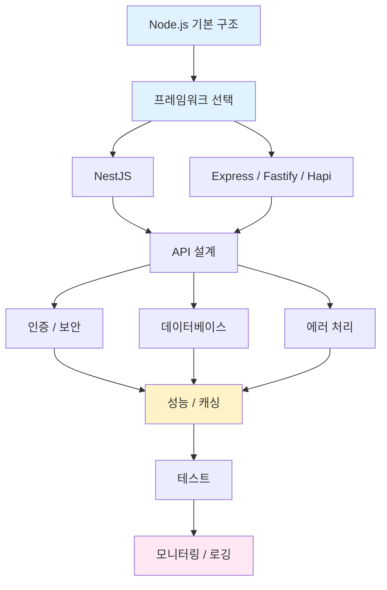
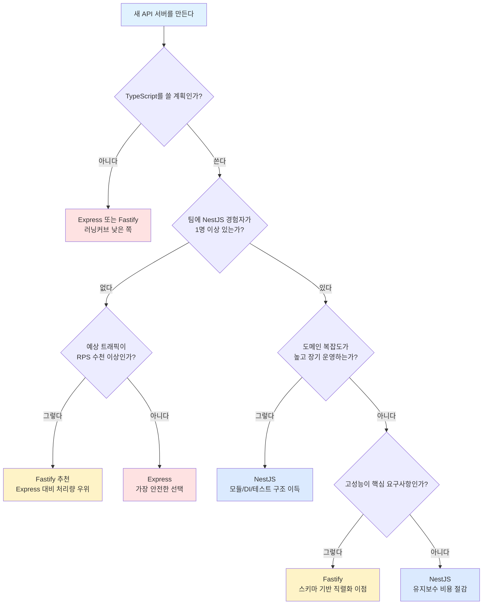

# Node.js 프레임워크 문서 인덱스

Node.js 백엔드 개발 과정에서 마주치는 주제별 기술 문서 모음이다. 문서 간 관계를 파악하고, 지금 필요한 문서를 빠르게 찾는 데 초점을 맞췄다.

---

## 5초 만에 길 찾기

지금 떠오른 질문 그대로 골라 가면 된다.

- 처음 와서 뭐부터 봐야 하는지 모르겠다 → [Node.js 기본 개념과 구조](./Nodejs의%20구조%20및%20작동%20원리/Node.md), [Node.js 프레임워크 개요](./Nodejs_Framework_Overview.md)
- 프레임워크를 못 정하겠다 → 아래 [프레임워크 선택 의사결정 트리](#프레임워크-선택-의사결정-트리)
- 지금 서비스가 느려서 원인을 찾고 있다 → [성능 최적화 및 프로파일링](./Performance/Node.js_성능_최적화_및_프로파일링.md), [상황별: 서비스가 느려졌다](#서비스가-느려졌다)
- 프로덕션에 올리기 전 마지막 점검 중이다 → [프로덕션 배포 전 확인해야 할 것들](#프로덕션-배포-전-확인해야-할-것들)

---

## 문서 구조 한눈에 보기


```mermaid
graph TD
    A[Node.js 기본 구조] --> B[프레임워크 선택]
    B --> C[NestJS]
    B --> D[Express / Fastify / Hapi]

    C --> E[API 설계]
    D --> E

    E --> F[인증 / 보안]
    E --> G[데이터베이스]
    E --> H[에러 처리]

    F --> I[성능 / 캐싱]
    G --> I
    H --> I

    I --> J[테스트]
    J --> K[모니터링 / 로깅]

    style A fill:#e0f2fe
    style B fill:#e0f2fe
    style I fill:#fef3c7
    style K fill:#fce7f3
```

문서를 처음 읽는 순서와 프로젝트 진행 흐름이 대체로 일치한다. 위에서 아래로 따라가면 된다.

---

## Node.js LTS 버전과 라이브러리 호환성

LTS 라인은 짝수 버전만 사용한다. 홀수 버전은 6개월짜리라 운영 환경에 들이면 보통 6개월 뒤 다시 마이그레이션하느라 시간을 쓴다. 새 프로젝트는 가능하면 **Active LTS**를 깐다. **Maintenance LTS**는 보안 패치만 들어오는 단계라 신규 프로젝트의 첫 선택지로 잡지 않는다.

| Node.js | 상태 (2026-05 기준) | 지원 종료 | 비고 |
|---------|--------------------|-----------|------|
| 18.x | EOL | 2025-04-30 | 지원 종료. 마이그레이션 대상 |
| 20.x | Maintenance LTS | 2026-04-30 | 신규 프로젝트는 피하는 편이 낫다 |
| 22.x | Active LTS | 2027-04-30 | 신규 프로젝트 기본값 |
| 24.x | Active LTS | 2028-04-30 | ESM 기본 동작 강화, 일부 라이브러리 호환성 확인 필요 |

운영 클러스터에는 `nvm` 또는 컨테이너 베이스 이미지(예: `node:22-alpine`)로 한 가지 마이너 버전을 고정한다. CI에서 마이너 버전이 바뀌면서 `node-gyp` 빌드가 깨지는 식의 사고가 자주 난다.

### NestJS / TypeORM / Prisma 호환성

생태계가 빠르게 움직이지만 실무에서 부딪히는 조합은 한정적이다. 새 프로젝트라면 표 가장 아래쪽 행에 가깝게 잡는다.

| Node.js | NestJS | TypeORM | Prisma | TypeScript | 비고 |
|---------|--------|---------|--------|------------|------|
| 18.x | 9.x | 0.3.x | 4.x | 4.7~5.0 | 레거시 유지보수용 |
| 20.x | 10.x | 0.3.x | 5.x | 5.1~5.3 | 2025년 표준 조합 |
| 22.x | 10.x / 11.x | 0.3.x | 5.x / 6.x | 5.4~5.6 | 신규 프로젝트 권장 |
| 24.x | 11.x | 0.3.x | 6.x | 5.6+ | ESM-first 빌드 시 권장 |

주의할 지점이 몇 가지 있다.

- TypeORM 0.3 이전(0.2.x)은 데코레이터 기반 메타데이터가 호환되지 않는 부분이 있다. 0.2 → 0.3 마이그레이션은 엔티티 정의를 손봐야 해서 한 번에 끝나지 않는다.
- Prisma는 `prisma generate`가 빌드 단계에 끼어들어 컨테이너 이미지 빌드 시간이 늘어난다. 멀티스테이지 빌드로 분리해두는 편이 낫다.
- NestJS 11은 RxJS 7을 요구한다. 10에서 11로 올릴 때 `Observable` 관련 타입 에러가 한 번에 폭발한다.
- ESM 전환은 `package.json`의 `"type": "module"` 한 줄로 끝나지 않는다. `__dirname` 같은 CommonJS 전제 코드가 곳곳에 박혀 있어서 한 번에 가지 말고 패키지 단위로 점진적으로 옮긴다.

---

## 프레임워크 선택 의사결정 트리

신규 서비스에서 프레임워크를 고를 때 흐름이다. 절대적 기준은 아니지만 결정이 안 잡힐 때 출발점으로 쓴다.


```mermaid
graph TD
    Start[새 API 서버를 만든다] --> TS{TypeScript를 쓸 계획인가?}
    TS -->|아니다| Express1[Express 또는 Fastify<br/>러닝커브 낮은 쪽]
    TS -->|쓴다| Team{팀에 NestJS 경험자가<br/>1명 이상 있는가?}

    Team -->|없다| Scale1{예상 트래픽이<br/>RPS 수천 이상인가?}
    Team -->|있다| Domain{도메인 복잡도가<br/>높고 장기 운영하는가?}

    Scale1 -->|그렇다| Fastify1[Fastify 추천<br/>Express 대비 처리량 우위]
    Scale1 -->|아니다| Express2[Express<br/>가장 안전한 선택]

    Domain -->|그렇다| Nest1[NestJS<br/>모듈/DI/테스트 구조 이득]
    Domain -->|아니다| Scale2{고성능이 핵심 요구사항인가?}

    Scale2 -->|그렇다| Fastify2[Fastify<br/>스키마 기반 직렬화 이점]
    Scale2 -->|아니다| Nest2[NestJS<br/>유지보수 비용 절감]

    style Start fill:#e0f2fe
    style Nest1 fill:#dbeafe
    style Nest2 fill:#dbeafe
    style Fastify1 fill:#fef3c7
    style Fastify2 fill:#fef3c7
    style Express1 fill:#fee2e2
    style Express2 fill:#fee2e2
```

판단할 때 자주 빠뜨리는 요소.

- 팀 숙련도. NestJS는 모듈/DI/데코레이터의 학습 곡선이 가파르다. 처음 쓰는 팀이면 첫 한두 달 생산성이 떨어진다.
- 마이크로서비스 전환 가능성. 1년 안에 분리할 가능성이 있으면 NestJS의 Microservices 모듈을 미리 깔아두는 편이 낫다.
- 라이브러리 생태계. Express 미들웨어를 직접 가져다 쓸 수 있느냐가 의외로 결정 요인이 된다. Fastify는 어댑터로 우회 가능하지만 일부 미들웨어는 동작이 미묘하게 다르다.

---

## 주제별 문서 분류

### 프레임워크 개요

프레임워크를 선택하기 전에 읽어야 한다. Express, Fastify, NestJS, Koa, Hapi의 설계 철학 차이와 실제 프레임워크 교체 시 부딪히는 문제를 정리했다.

- [Node.js 프레임워크 개요](./Nodejs_Framework_Overview.md) - Express, Fastify, NestJS, Koa, Hapi의 등장 배경과 설계 방향 차이. 프레임워크 선택·교체 시 판단 기준
- [NestJS vs Hapi vs Express vs Fastify](./Nest_Hapi_Express_fastify.md) - 4개 프레임워크의 성능, 생태계, 학습 곡선 비교. 벤치마크 수치 포함

### Node.js 기본 구조

V8 엔진과 libuv가 어떻게 동작하는지 모르면 성능 문제를 만났을 때 원인을 못 찾는다. 이벤트 루프, 클러스터, 워커 스레드 개념을 잡고 넘어가야 한다.

- [Node.js 기본 개념과 구조](./Nodejs의%20구조%20및%20작동%20원리/Node.md) - V8 엔진, libuv, 이벤트 루프 동작 원리
- [Cluster](./Nodejs의%20구조%20및%20작동%20원리/Cluster.md) - Cluster 모듈로 멀티프로세싱 구성, 마스터-워커 패턴
- [Cluster와 Multi Thread](./Nodejs의%20구조%20및%20작동%20원리/Cluster와%20Multi%20Thread.md) - 멀티프로세싱과 워커 스레드의 차이, CPU 활용 방식 비교
- [Thread](./Nodejs의%20구조%20및%20작동%20원리/Thread.md) - Worker Threads API로 CPU 집약적 작업 처리

### 모듈 시스템

패키지 매니저 선택과 모듈 시스템 방식은 프로젝트 초기에 결정해야 한다. 나중에 바꾸면 의존성 지옥에 빠진다.

- [CommonJS vs ESM](./모듈%20시스템/CommonJS%20vs%20ESM.md) - require와 import의 차이, 동적/정적 로딩, 혼용 시 발생하는 문제
- [npm](./모듈%20시스템/npm.md) - package.json 설정, 버전 관리, lock 파일 역할
- [npx](./모듈%20시스템/npx.md) - 로컬 설치 없이 패키지 실행하는 방법
- [pnpm](./모듈%20시스템/pnpm.md) - 심볼릭 링크 기반 디스크 절약, 엄격한 의존성 관리

### 프로세스 관리

PM2가 사실상 표준이다. 프로덕션에서 프로세스가 죽었을 때 자동 재시작, 클러스터 모드 활용, 환경별 설정 분리 방법을 다룬다.

- [PM2](./Process%20Management%20Tool/pm2/pm2.md) - 프로세스 관리, 자동 재시작, 로그 관리, 메모리 모니터링
- [PM2 클러스터 모드](./Process%20Management%20Tool/pm2/클러스터_모드.md) - 멀티 코어 활용, 무중단 재시작 설정
- [PM2 Ecosystem](./Process%20Management%20Tool/pm2/ecosystem.md) - ecosystem.config.js로 환경별 설정 분리, 배포 자동화
- [Forever](./Process%20Management%20Tool/forever.md) - 단순한 프로세스 관리 도구. 개발 환경에서만 사용 권장

### API 설계

REST든 GraphQL이든 설계 단계에서 놓치면 나중에 고치기 어렵다. Rate Limiting은 서비스 오픈 전에 반드시 붙여야 한다.

- [API 설계 원칙](./API/API_설계_원칙.md) - RESTful 원칙, API 버저닝, OpenAPI/Swagger 문서화
- [GraphQL](./API/GraphQL.md) - 스키마 설계, 리졸버 구현, N+1 문제와 데이터 로더
- [Rate Limiting](./API/Rate_Limiting.md) - 토큰 버킷, 슬라이딩 윈도우 알고리즘, DDoS 방어

### 에러 처리

에러 처리를 대충 하면 서버가 죽거나 내부 정보가 클라이언트에 노출된다. Express, NestJS, Fastify 각각 에러 처리 방식이 다르다.

- [Node.js 에러 처리](./Error_Handling.md) - 에러 분류, 프레임워크별 에러 핸들링 차이, 커스텀 에러 클래스 설계
- [에러 핸들링 심화](./에러_핸들링/에러_핸들링_전략.md) - 에러 타입별 분류, 에러 복구 패턴, 일관된 에러 응답 형식

### 데이터베이스

ORM 선택은 한 번 하면 쉽게 못 바꾼다. TypeORM, Sequelize, Prisma 중 뭘 쓸지 먼저 정하고, 연결 풀 설정과 분산 트랜잭션은 트래픽이 늘어날 때 필요하다.

- [ORM 심화](./데이터베이스/ORM_심화_전략.md) - TypeORM, Sequelize, Prisma 비교, 관계 매핑, 쿼리 튜닝, 마이그레이션
- [연결 풀 관리](./데이터베이스/연결_풀_관리.md) - 풀 크기 결정 기준, 타임아웃 설정, Read/Write 분리
- [분산 트랜잭션](./데이터베이스/분산_트랜잭션_전략.md) - Saga 패턴, 이벤트 소싱, CQRS 구현

### 인증 및 보안

JWT 토큰 관리를 잘못하면 보안 사고가 난다. 토큰 저장 위치, 갱신 방법, XSS/CSRF 방어를 확인해야 한다.

- [JWT 구현 및 보안](./인증/JWT_구현_및_보안.md) - Access/Refresh Token 패턴, 토큰 갱신 흐름, XSS/CSRF 방어
- [보안 사례](./보안/Node.js_보안_모범사례.md) - Helmet 설정, CORS, 입력 검증, SQL Injection 방지

### 데이터 처리

대용량 파일을 메모리에 한 번에 올리면 OOM으로 죽는다. 스트림을 써야 하는 시점을 알아야 한다.

- [스트림](./데이터%20처리%20및%20통신/스트림(Stream).md) - Readable, Writable, Transform 스트림, 대용량 데이터 처리

### 성능 및 캐싱

"느리다"는 제보가 오면 프로파일링부터 한다. 원인을 찾은 다음 캐싱을 적용하고, 부하 테스트로 검증한다. 이 순서를 지켜야 한다.

- [성능 최적화 및 프로파일링](./Performance/Node.js_성능_최적화_및_프로파일링.md) - CPU/메모리 프로파일링, 비동기 처리 병목 분석, 메모리 누수 탐지
- [부하 테스트](./성능/부하_테스트_전략.md) - k6, Artillery로 시나리오 작성, 벤치마킹, 병목 지점 확인
- [캐싱](./캐싱/캐싱_전략.md) - Redis 캐싱 패턴, 캐시 무효화, 캐시 스탬피드 방지

### 모니터링 및 로깅

로그 없으면 장애 원인을 못 찾고, APM 없으면 느린 구간을 못 찾는다. 프로덕션 운영에서 빠질 수 없는 부분이다.

- [로깅](./로깅/로깅_전략.md) - Winston, Pino 비교, 구조화 로깅, 로그 레벨 설정
- [Observability](./모니터링/Observability_전략.md) - APM, 분산 추적, OpenTelemetry 구성

### 백그라운드 작업

이메일 발송, 이미지 처리 같은 작업을 API 요청 안에서 동기로 처리하면 응답이 느려진다. 작업 큐로 빼야 한다.

- [작업 큐 처리](./백그라운드_작업/작업_큐_처리.md) - Bull Queue, Agenda 활용, 작업 우선순위, 재시도 설정, 모니터링

### 파일 처리

- [파일 업로드 및 처리](./파일_처리/파일_업로드_및_처리.md) - Multer로 업로드, AWS S3 연동, 이미지 리사이징, 파일 검증

### 테스트

테스트 코드 없이 리팩토링하면 장애가 난다. 단위 테스트 → 통합 테스트 → E2E 테스트 순서로 커버리지를 넓혀야 한다.

- [테스트 자동화 및 품질 보증](./Testing/테스트_자동화_및_품질_보증.md) - Jest, Mocha 활용, 커버리지 관리
- [API E2E 테스트 패턴](./Testing/API_E2E_테스트_패턴.md) - 엔드포인트 E2E 테스트, 테스트 데이터 관리, 격리
- [데이터베이스 통합 테스트](./Testing/Database_Integration_Testing.md) - 테스트용 DB 설정, 트랜잭션 롤백으로 격리
- [외부 API 모킹](./Testing/외부_API_모킹.md) - nock, MSW로 HTTP 모킹, 외부 의존성 제거

### NestJS

NestJS를 쓰기로 했으면 이 순서로 읽는다: 사용법 → 모듈 시스템 → 요청 라이프사이클 → 설정 관리 → 마이크로서비스.

- [NestJS 사용법](./NestJS/How_To_USE.md) - 아키텍처, 모듈, 의존성 주입, 데코레이터
- [NestJS vs Express](./NestJS/NestJs%20vs%20ExpressJs.md) - NestJS와 Express의 차이점, 사용 사례별 선택
- [NestJS 부트스트랩 및 모듈 시스템](./NestJS/Nest_JS_부트스트랩_및_모듈_시스템.md) - 애플리케이션 부트스트랩 과정, 모듈 구성 방법
- [NestJS 요청 라이프사이클](./NestJS/Nest_JS_요청_라이프사이클.md) - Guard, Interceptor, Pipe, Filter 실행 순서
- [NestJS 설정 관리](./NestJS/Nest_JS_설정_관리.md) - ConfigModule 활용, 환경별 설정 분리
- [NestJS 마이크로서비스](./NestJS/Nest_JS_마이크로서비스.md) - Transport Layer, 메시지 패턴, 서비스 간 통신
- [NestJS 실전 예제](./NestJS/실전_예제.md) - REST API, DB 연동, 인증/인가, WebSocket 구현

### 아키텍처

서비스가 커지면 모놀리스에서 마이크로서비스로 전환을 고민하게 된다. 통신 패턴과 이벤트 기반 아키텍처를 미리 알아두면 전환 비용이 줄어든다.

- [마이크로서비스 통신 패턴](./아키텍처/마이크로서비스_통신_패턴.md) - 동기/비동기 통신, Circuit Breaker, Service Discovery, API Gateway
- [Event Driven Architecture with AWS](./아키텍처/Event_Driven_Architecture_with_AWS.md) - NestJS + AWS SNS/SQS 이벤트 아키텍처, Lambda 통합

### 기타

- [함수형 프로그래밍](./함수형%20프로그래밍.md) - 불변성, 고차 함수, 함수 합성

---

## 상황별 문서 찾기

단순 목록이 아니라, 지금 처한 상황에 맞는 문서를 골라 읽어야 한다.

### "API 서버를 새로 만들어야 한다"

프레임워크를 고르는 것부터 시작한다.

| 순서 | 문서 | 왜 읽어야 하는가 |
|:---:|------|-----------------|
| 1 | [Node.js 프레임워크 개요](./Nodejs_Framework_Overview.md) | Express, Fastify, NestJS 중 뭘 쓸지 판단 기준을 잡는다 |
| 2 | [API 설계 원칙](./API/API_설계_원칙.md) | URL 설계, 버저닝, 응답 형식을 초기에 정해야 나중에 안 흔들린다 |
| 3 | [ORM 심화](./데이터베이스/ORM_심화_전략.md) | DB 접근 계층을 먼저 정해야 엔티티 설계가 가능하다 |
| 4 | [JWT 구현 및 보안](./인증/JWT_구현_및_보안.md) | 인증은 미루면 나중에 전체 API에 영향을 준다 |
| 5 | [Node.js 에러 처리](./Error_Handling.md) | 에러 응답 형식을 초기에 통일해야 프론트엔드와 협업이 된다 |
| 6 | [Rate Limiting](./API/Rate_Limiting.md) | 오픈 전에 반드시 붙여야 한다 |

### "서비스가 느려졌다"

느려진 원인이 뭔지부터 찾아야 한다. 감으로 캐싱부터 붙이면 안 된다.

| 순서 | 문서 | 왜 읽어야 하는가 |
|:---:|------|-----------------|
| 1 | [성능 최적화 및 프로파일링](./Performance/Node.js_성능_최적화_및_프로파일링.md) | CPU, 메모리 프로파일링으로 병목 지점을 찾는다 |
| 2 | [연결 풀 관리](./데이터베이스/연결_풀_관리.md) | DB 커넥션 부족이 원인인 경우가 많다 |
| 3 | [캐싱](./캐싱/캐싱_전략.md) | 병목 원인이 반복 조회라면 캐싱을 적용한다 |
| 4 | [부하 테스트](./성능/부하_테스트_전략.md) | 개선 후 실제로 빨라졌는지 수치로 확인한다 |

### "프로덕션 장애가 났다"

로그와 모니터링 데이터가 없으면 원인 파악이 안 된다. 평소에 준비해둬야 한다.

| 순서 | 문서 | 왜 읽어야 하는가 |
|:---:|------|-----------------|
| 1 | [로깅](./로깅/로깅_전략.md) | 구조화된 로그가 있어야 원인 추적이 가능하다 |
| 2 | [Observability](./모니터링/Observability_전략.md) | 분산 추적으로 어느 서비스에서 문제가 생겼는지 찾는다 |
| 3 | [Node.js 에러 처리](./Error_Handling.md) | 에러가 제대로 잡히고 있는지, 프로세스가 왜 죽었는지 확인한다 |
| 4 | [PM2](./Process%20Management%20Tool/pm2/pm2.md) | 프로세스 재시작 이력과 메모리 사용량을 확인한다 |

### "NestJS 프로젝트를 시작한다"

NestJS 문서를 순서대로 읽으면 된다.

| 순서 | 문서 | 왜 읽어야 하는가 |
|:---:|------|-----------------|
| 1 | [NestJS 사용법](./NestJS/How_To_USE.md) | 모듈, DI, 데코레이터 등 NestJS 기본 개념 |
| 2 | [NestJS 부트스트랩 및 모듈 시스템](./NestJS/Nest_JS_부트스트랩_및_모듈_시스템.md) | 앱 구동 과정과 모듈 구성 방법 |
| 3 | [NestJS 요청 라이프사이클](./NestJS/Nest_JS_요청_라이프사이클.md) | Guard → Interceptor → Pipe → Handler → Filter 순서 이해 |
| 4 | [NestJS 설정 관리](./NestJS/Nest_JS_설정_관리.md) | 환경별 설정 분리 방법 |
| 5 | [NestJS 실전 예제](./NestJS/실전_예제.md) | 실제 구현 코드 참고 |

### "WebSocket 실시간 기능을 추가한다"

채팅, 알림, 실시간 대시보드 같은 요구가 들어오면 HTTP 위에 WebSocket을 얹는다. 프로토콜만 바꾼다고 끝이 아니다. 멀티 인스턴스 환경에서 메시지 브로드캐스트, 인증 토큰 검증, 연결 끊김 처리까지 같이 봐야 한다.

| 순서 | 문서 | 왜 읽어야 하는가 |
|:---:|------|-----------------|
| 1 | [NestJS 실전 예제](./NestJS/실전_예제.md) | NestJS Gateway로 WebSocket 다루는 기본 코드 |
| 2 | [JWT 구현 및 보안](./인증/JWT_구현_및_보안.md) | 핸드셰이크 시점에 토큰 검증을 어떻게 끼워 넣을지 |
| 3 | [캐싱](./캐싱/캐싱_전략.md) | 멀티 인스턴스 브로드캐스트는 Redis Pub/Sub 또는 어댑터로 풀어야 한다 |
| 4 | [Observability](./모니터링/Observability_전략.md) | 끊긴 연결, 재연결 폭주를 메트릭으로 보지 못하면 원인 추적이 안 된다 |

### "Express에서 NestJS로 마이그레이션한다"

서비스가 커져서 컨트롤러가 수십 개를 넘으면 모듈화 압박이 온다. 한 번에 갈아엎지 않고 라우터 단위로 점진 이전하는 편이 안전하다.

| 순서 | 문서 | 왜 읽어야 하는가 |
|:---:|------|-----------------|
| 1 | [NestJS vs Express](./NestJS/NestJs%20vs%20ExpressJs.md) | 코드 구조 차이를 먼저 이해한다 |
| 2 | [NestJS 부트스트랩 및 모듈 시스템](./NestJS/Nest_JS_부트스트랩_및_모듈_시스템.md) | NestJS는 Express 인스턴스를 그대로 받을 수 있다. 점진 마이그레이션의 출발점 |
| 3 | [NestJS 요청 라이프사이클](./NestJS/Nest_JS_요청_라이프사이클.md) | 기존 미들웨어를 Guard/Interceptor 중 어디로 옮길지 판단 |
| 4 | [Node.js 에러 처리](./Error_Handling.md) | 에러 핸들러가 가장 많이 깨지는 부분 |
| 5 | [API E2E 테스트 패턴](./Testing/API_E2E_테스트_패턴.md) | 회귀 방지용 E2E 테스트가 없으면 마이그레이션 도중 실수를 못 잡는다 |

### "메모리 누수가 의심된다"

힙 사용량이 시간에 따라 우상향한다. PM2 또는 컨테이너의 OOM Kill 로그가 주기적으로 뜬다. 이런 신호가 보이면 추측 말고 힙 스냅샷을 찍어 비교한다.

| 순서 | 문서 | 왜 읽어야 하는가 |
|:---:|------|-----------------|
| 1 | [성능 최적화 및 프로파일링](./Performance/Node.js_성능_최적화_및_프로파일링.md) | heap snapshot 두 장 찍고 diff 보는 흐름 |
| 2 | [Node.js 기본 개념과 구조](./Nodejs의%20구조%20및%20작동%20원리/Node.md) | V8 GC가 어떤 객체를 못 회수하는지 이해해야 의심 코드를 좁힌다 |
| 3 | [캐싱](./캐싱/캐싱_전략.md) | 인메모리 캐시가 무한 증식하는 패턴이 가장 흔한 누수 원인이다 |
| 4 | [Observability](./모니터링/Observability_전략.md) | RSS/heap_used 메트릭을 안 보고 있으면 같은 사고가 반복된다 |

### "대용량 파일 처리 요구사항이 들어왔다"

수 GB짜리 CSV 가공, 비디오 업로드 같은 요구. `fs.readFile`로 통째 읽으면 OOM으로 즉사한다. 스트림으로 흘려야 한다.

| 순서 | 문서 | 왜 읽어야 하는가 |
|:---:|------|-----------------|
| 1 | [스트림](./데이터%20처리%20및%20통신/스트림(Stream).md) | 청크 단위 처리, backpressure 개념 |
| 2 | [파일 업로드 및 처리](./파일_처리/파일_업로드_및_처리.md) | Multer 메모리 저장 vs 디스크 저장, S3 멀티파트 업로드 |
| 3 | [작업 큐 처리](./백그라운드_작업/작업_큐_처리.md) | 변환 같은 무거운 작업은 워커로 빼야 API가 안 막힌다 |
| 4 | [Thread](./Nodejs의%20구조%20및%20작동%20원리/Thread.md) | CPU 집약적 변환은 Worker Thread로 본 이벤트 루프를 풀어준다 |

### "API 응답 시간이 들쭉날쭉하다"

p50은 양호한데 p99가 이상하게 튀는 경우다. GC pause, 동기 호출 끼임, libuv 스레드풀 포화 셋 중 하나일 때가 많다.

| 순서 | 문서 | 왜 읽어야 하는가 |
|:---:|------|-----------------|
| 1 | [Node.js 기본 개념과 구조](./Nodejs의%20구조%20및%20작동%20원리/Node.md) | 이벤트 루프 단계별로 막히는 지점이 어디인지 짚는다 |
| 2 | [성능 최적화 및 프로파일링](./Performance/Node.js_성능_최적화_및_프로파일링.md) | GC pause를 trace 옵션과 clinic.js로 측정 |
| 3 | [Cluster](./Nodejs의%20구조%20및%20작동%20원리/Cluster.md) | 단일 프로세스가 GC pause 동안 모든 요청을 막는다. 클러스터로 분산 |
| 4 | [부하 테스트](./성능/부하_테스트_전략.md) | 평균이 아니라 p95/p99로 봐야 튐을 잡는다 |

### "컨테이너 환경(K8s)으로 이전한다"

VM이나 PM2로 굴리던 서비스를 쿠버네티스에 올린다. 프로세스 모델, 로깅 경로, 시그널 처리 모두 다시 점검해야 한다.

| 순서 | 문서 | 왜 읽어야 하는가 |
|:---:|------|-----------------|
| 1 | [PM2](./Process%20Management%20Tool/pm2/pm2.md) | K8s에서는 PM2 클러스터를 쓰지 않는다. Replica로 대체하는 이유 |
| 2 | [PM2 Ecosystem](./Process%20Management%20Tool/pm2/ecosystem.md) | 환경변수 기반 설정 분리는 ConfigMap으로 옮겨갈 때 그대로 쓰인다 |
| 3 | [로깅](./로깅/로깅_전략.md) | stdout JSON 라인이 K8s 로그 수집의 표준이다 |
| 4 | [Observability](./모니터링/Observability_전략.md) | Prometheus 스크래핑, OpenTelemetry 익스포터 구성 |
| 5 | [Node.js 에러 처리](./Error_Handling.md) | SIGTERM 받으면 graceful shutdown 처리가 되어야 롤링 업데이트가 안전하다 |

---

## 주니어 → 시니어 학습 로드맵

처음 Node.js를 잡은 사람이 시간 순으로 읽으면 좋은 순서다. 다 외울 필요 없고, 한 번 훑고 다시 돌아오는 식으로 쓴다.

### 1주차 — 일단 굴러가게 만든다

기본 개념과 한 가지 프레임워크의 손에 익은 사용법까지가 목표다.

- [Node.js 기본 개념과 구조](./Nodejs의%20구조%20및%20작동%20원리/Node.md) — 이벤트 루프와 비동기가 왜 중요한지부터 잡는다
- [Node.js 프레임워크 개요](./Nodejs_Framework_Overview.md) — 큰 그림만 본다
- [npm](./모듈%20시스템/npm.md) — package.json, lock 파일 의미
- [API 설계 원칙](./API/API_설계_원칙.md) — RESTful의 기본만

### 1개월 — 작은 서비스 한 개를 만든다

CRUD API + 인증 + DB 연동까지 직접 짠다. 아래 문서를 옆에 두고 본다.

- [ORM 심화](./데이터베이스/ORM_심화_전략.md) — TypeORM 또는 Prisma 한쪽만 깊이
- [JWT 구현 및 보안](./인증/JWT_구현_및_보안.md) — 토큰 갱신 흐름까지
- [Node.js 에러 처리](./Error_Handling.md) — try/catch와 글로벌 핸들러
- [CommonJS vs ESM](./모듈%20시스템/CommonJS%20vs%20ESM.md) — 임포트 에러로 시간 안 버리려고
- [테스트 자동화 및 품질 보증](./Testing/테스트_자동화_및_품질_보증.md) — 단위 테스트 한 개라도 쓴다

### 3개월 — 실제 운영 환경에 들어간다

프로덕션 신호를 읽고 대응하는 단계.

- [Cluster](./Nodejs의%20구조%20및%20작동%20원리/Cluster.md), [Thread](./Nodejs의%20구조%20및%20작동%20원리/Thread.md)
- [PM2](./Process%20Management%20Tool/pm2/pm2.md), [PM2 Ecosystem](./Process%20Management%20Tool/pm2/ecosystem.md)
- [연결 풀 관리](./데이터베이스/연결_풀_관리.md) — 트래픽 늘면 가장 먼저 터지는 곳
- [Rate Limiting](./API/Rate_Limiting.md), [보안 사례](./보안/Node.js_보안_모범사례.md)
- [로깅](./로깅/로깅_전략.md) — 구조화 로그를 안 쓰면 장애 때 후회한다
- [캐싱](./캐싱/캐싱_전략.md) — Redis 도입 시점

### 6개월 — 시스템을 설계한다

서비스가 커지고 운영 책임이 늘면서 마주치는 주제들.

- [성능 최적화 및 프로파일링](./Performance/Node.js_성능_최적화_및_프로파일링.md) — 본격 프로파일링
- [부하 테스트](./성능/부하_테스트_전략.md) — k6 시나리오 직접 짠다
- [Observability](./모니터링/Observability_전략.md) — APM, 분산 추적
- [에러 핸들링 심화](./에러_핸들링/에러_핸들링_전략.md), [작업 큐 처리](./백그라운드_작업/작업_큐_처리.md)
- [분산 트랜잭션](./데이터베이스/분산_트랜잭션_전략.md), [마이크로서비스 통신 패턴](./아키텍처/마이크로서비스_통신_패턴.md)
- [Event Driven Architecture with AWS](./아키텍처/Event_Driven_Architecture_with_AWS.md)

---

## Node.js 백엔드에서 자주 하는 실수 10가지

리뷰에서 반복적으로 잡는 항목들이다. 코드를 짜기 전에 한 번 훑고 가면 좋다.

1. **`async` 함수에서 `await`을 빠뜨린다.** 함수가 Promise를 반환만 하고 끝나서 에러가 안 잡힌다. 트랜잭션 안에서 발생하면 데이터 정합성이 깨진다. → [Node.js 에러 처리](./Error_Handling.md)
2. **`unhandledRejection`을 처리하지 않는다.** Node 15부터 기본 동작이 프로세스 종료다. 글로벌 핸들러를 안 걸어두면 컨테이너가 의문의 재시작을 반복한다. → [에러 핸들링 심화](./에러_핸들링/에러_핸들링_전략.md)
3. **`Promise.all`로 병렬 실행하다 한 개 실패로 전체가 깨진다.** 부분 실패가 허용되는 작업이면 `Promise.allSettled`를 써야 한다. 결제·알림 묶음 전송에서 자주 사고가 난다. → [Node.js 에러 처리](./Error_Handling.md)
4. **동기 `fs` 호출을 요청 핸들러 안에서 쓴다.** `fs.readFileSync`가 한 번 끼면 그 사이 들어온 모든 요청이 막힌다. 설정 로딩이 아닌 곳에서는 비동기 API만 쓴다. → [Node.js 기본 개념과 구조](./Nodejs의%20구조%20및%20작동%20원리/Node.md)
5. **`setInterval`을 끄지 않고 모듈에 박아둔다.** 테스트 종료가 안 되거나 graceful shutdown이 막힌다. 컨테이너 환경에서 SIGTERM 받고도 안 죽으면 강제 kill 당한다. → [PM2](./Process%20Management%20Tool/pm2/pm2.md)
6. **DB 커넥션 풀 크기를 기본값으로 둔다.** TypeORM 기본은 10, Prisma는 CPU 기반 자동값이라 트래픽이 늘면 풀 부족으로 latency가 튄다. 인스턴스 수와 DB max_connections를 같이 봐야 한다. → [연결 풀 관리](./데이터베이스/연결_풀_관리.md)
7. **JWT를 `localStorage`에 저장한다.** XSS 한 방에 토큰이 털린다. Access는 메모리, Refresh는 HttpOnly Secure 쿠키가 기본 가이드다. → [JWT 구현 및 보안](./인증/JWT_구현_및_보안.md)
8. **Helmet, CORS 설정을 안 한다.** 서버를 띄우자마자 보안 스캐너가 헤더 누락으로 경고를 뱉는다. 미들웨어 한 줄로 끝나는데 이걸 빠뜨리는 경우가 많다. → [보안 사례](./보안/Node.js_보안_모범사례.md)
9. **에러 객체의 stack trace를 응답에 그대로 노출한다.** 내부 파일 경로, 라이브러리 버전이 다 나간다. 운영 환경에서는 `message`만 내려주고 trace는 로그로만 남긴다. → [Node.js 에러 처리](./Error_Handling.md)
10. **로그에 PII를 평문으로 남긴다.** 이메일, 전화번호, 주민번호가 검색 가능한 상태로 ELK나 CloudWatch에 들어간다. 마스킹 미들웨어 또는 직렬화 단계에서 거른다. → [로깅](./로깅/로깅_전략.md)

---

## Node.js 메모리/CPU 프로파일링 명령어 모음

지금 손에 익혀두면 장애 났을 때 검색할 시간이 줄어든다. 자세한 분석법은 [성능 최적화 및 프로파일링](./Performance/Node.js_성능_최적화_및_프로파일링.md)에 있다.

```bash
# 1. 힙 스냅샷 (Chrome DevTools에서 비교)
node --inspect=0.0.0.0:9229 dist/main.js
# 또는 코드에 직접
npm i heapdump
# require('heapdump').writeSnapshot('./heap-' + Date.now() + '.heapsnapshot')

# 2. clinic.js — Doctor / Bubbleprof / Flame 한 번에
npx clinic doctor -- node dist/main.js
npx clinic flame   -- node dist/main.js
npx clinic bubbleprof -- node dist/main.js

# 3. 0x — V8 flame graph (CPU bound 추적용)
npx 0x -- node dist/main.js
# 종료 후 자동으로 flamegraph.html 생성

# 4. GC trace — pause 시간 의심될 때
node --trace-gc --trace-gc-verbose dist/main.js 2> gc.log

# 5. CPU 프로파일 — V8 내장
node --cpu-prof --cpu-prof-dir=./profiles dist/main.js
# 생성된 .cpuprofile을 Chrome DevTools Performance 탭에서 로드

# 6. 컨테이너 안에서 힙 덤프 강제 (이미 떠 있는 프로세스)
kill -USR2 $(pgrep -f "node dist/main")
# heapdump 모듈이 USR2 시그널을 잡아 덤프를 떨어뜨린다
```

부하 테스트를 같이 돌려서 트래픽이 들어가는 동안 측정해야 의미 있는 데이터가 나온다. 한가한 상태에서 측정하면 진짜 병목은 안 보인다.

---

## 프로덕션 배포 전 확인해야 할 것들

오픈을 앞두고 마지막 며칠이 가장 중요하다. 코드 자체는 이미 동작하지만, 운영에 필요한 주변 장치가 빠져 있는 경우가 대부분이다.

먼저 **에러가 새지 않는지** 본다. 에러 응답에 stack trace나 내부 SQL이 묻어 나오는지, `unhandledRejection`이 잡혀 있는지 확인한다. 이 부분이 안 잡히면 운영 첫 주에 원인 모를 재시작이 반복된다. [Node.js 에러 처리](./Error_Handling.md)와 [에러 핸들링 심화](./에러_핸들링/에러_핸들링_전략.md)에 정리해둔 글로벌 핸들러 코드를 한 번 더 본다.

다음으로 **로그와 메트릭이 흐르는지** 본다. stdout에 구조화 로그(JSON)가 떨어지는지, 요청 ID가 모든 로그에 들어가 있는지, 응답 시간/에러율 메트릭이 Prometheus든 APM이든 어디 한 곳에 쌓이고 있는지 확인한다. [로깅](./로깅/로깅_전략.md), [Observability](./모니터링/Observability_전략.md)가 같이 갖춰져야 장애 났을 때 30분 안에 원인을 좁힐 수 있다.

세 번째로 **트래픽을 받을 준비**다. Rate Limiting이 붙어 있는지, DB 커넥션 풀 크기와 인스턴스 수의 곱이 DB의 `max_connections`를 넘지 않는지, Helmet과 CORS가 의도한 대로 설정됐는지 본다. [Rate Limiting](./API/Rate_Limiting.md), [연결 풀 관리](./데이터베이스/연결_풀_관리.md), [보안 사례](./보안/Node.js_보안_모범사례.md)가 이 단계에서 같이 펼쳐두는 문서들이다.

네 번째는 **죽었다 살아날 수 있는지**다. 컨테이너 환경이면 SIGTERM 처리, livenessProbe/readinessProbe 응답, graceful shutdown 후 in-flight 요청이 끊기지 않는지 체크한다. PM2 환경이면 클러스터 모드에서 무중단 재시작이 도는지를 본다. 무중단 배포가 안 되는 상태로 오픈하면 배포할 때마다 알람이 울린다. [PM2 클러스터 모드](./Process%20Management%20Tool/pm2/클러스터_모드.md)와 [PM2 Ecosystem](./Process%20Management%20Tool/pm2/ecosystem.md)을 본다.

마지막으로 **부하 시나리오를 한 번 돌려둔다**. 예상 RPS의 1.5배 정도로 30분 정도 돌려보고 p95/p99, 에러율, 메모리 추이를 본다. 평균만 보면 GC pause로 튀는 구간을 놓친다. [부하 테스트](./성능/부하_테스트_전략.md)와 [성능 최적화 및 프로파일링](./Performance/Node.js_성능_최적화_및_프로파일링.md)을 함께 본다. 이 단계에서 한 번 잡지 못한 문제는 거의 항상 운영 중에 다시 만난다.

---

## 문서 간 연관 관계

같은 작업을 할 때 함께 읽어야 하는 문서 조합이다.

| 작업 | 함께 볼 문서 | 이유 |
|------|------------|------|
| 인증 구현 | JWT + 보안 사례 | JWT만 구현하고 Helmet, CORS를 빠뜨리는 경우가 있다 |
| DB 성능 개선 | ORM 심화 + 연결 풀 관리 | 쿼리 튜닝만 하고 커넥션 풀 설정을 안 건드리면 효과가 반감된다 |
| 성능 개선 | 프로파일링 → 캐싱 → 부하 테스트 | 이 순서를 안 지키면 원인도 모르고 캐시만 쌓게 된다 |
| 운영 환경 구축 | 로깅 + Observability + PM2 | 세 가지 중 하나라도 빠지면 장애 대응이 어렵다 |
| 마이크로서비스 전환 | 통신 패턴 + Event Driven + 분산 트랜잭션 | 서비스 분리만 하고 통신/트랜잭션 처리를 못 하면 모놀리스보다 못하다 |
| WebSocket 구현 | NestJS 실전 예제 + JWT + 캐싱(Pub/Sub) | 멀티 인스턴스에서 브로드캐스트가 끊긴다. Redis 어댑터가 필수 |
| 파일 업로드 시스템 | 스트림 + 파일 업로드 + 작업 큐 | 메모리 기반 업로드는 OOM. 변환은 큐로 빼야 응답이 안 막힌다 |
| 결제/이커머스 트랜잭션 | 분산 트랜잭션 + 작업 큐 + 에러 핸들링 심화 | 외부 PG 호출 실패 시 보상 트랜잭션이 없으면 상태가 어긋난다 |

---

## 문서가 부족한 영역

지금 인덱스에서 비어 있는 자리다. 운영을 하면서 자주 부딪히는데 정리는 안 된 주제들이다.

- **WebSocket 심화** — Socket.IO vs ws, NestJS Gateway 내부, Redis Adapter 멀티 인스턴스 브로드캐스트, 재연결/하트비트 설계
- **gRPC** — Protobuf 스키마 관리, NestJS의 GrpcOptions, 스트리밍 RPC, REST와의 게이트웨이 패턴
- **서버리스(AWS Lambda) 패턴** — Cold start 최소화, Lambda + NestJS, Provisioned Concurrency 비용 trade-off, 이벤트 소스(API Gateway/SQS) 매핑
- **OpenAPI / Swagger 자동화** — NestJS 데코레이터로 스펙 생성, 클라이언트 SDK 자동 생성, 버저닝
- **GraphQL Federation** — Apollo Federation 2, 서브그래프 분리, 인증 컨텍스트 전파
- **Kafka 연동** — kafkajs 패턴, Consumer Group 운영, 재처리 전략
- **백오프와 서킷 브레이커 라이브러리 비교** — opossum, cockatiel 사용 사례
- **데이터베이스 마이그레이션 운영** — 무중단 스키마 변경, expand/contract 패턴, online migration 도구

이 주제들은 추가될 때마다 인덱스에 넣는다. 빠르게 볼 자료가 필요하면 외부 레퍼런스(공식 문서, 발표 슬라이드)를 우선 참고한다.

---

## 문서 업데이트

- **최종 업데이트**: 2026-05-06
- **총 문서 수**: 44개
