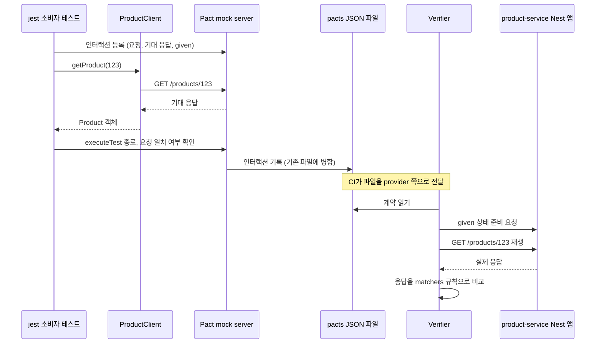
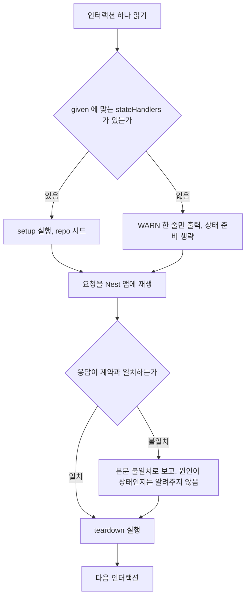
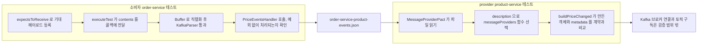
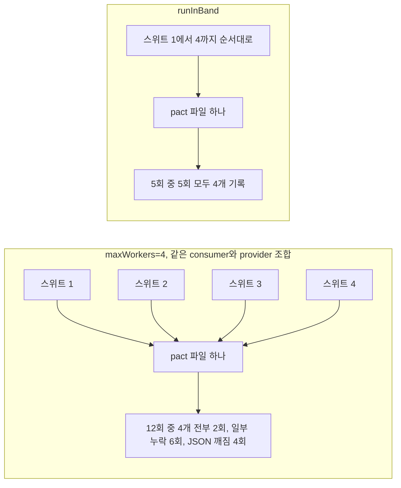

# NestJS 계약 테스트 Pact 실습

저장소의 계약 테스트 문서는 Pact Java 예제만 있다. 계약 테스트가 왜 필요한지, 브로커와 `can-i-deploy`를 어떻게 운영하는지는 [서비스 계약 테스트](../../../Architecture/MSA/Service_Contract_Testing.md)와 [MSA 테스트](../../../Architecture/MSA/MSA_테스트_전략.md)에 있다. 이 문서는 그 반대편, NestJS 서비스에서 Pact를 실제로 붙일 때 막히는 지점만 다룬다. 소비자 테스트에서 클라이언트에 mock server 주소를 넣는 방법, provider로 Nest 앱을 띄워 검증하는 방법, Kafka 이벤트의 JSON 페이로드를 메시지 계약으로 검증하는 방법, 그리고 돌려보다가 실제로 깨진 것들이다.

아래 내용은 전부 다음 환경에서 직접 실행한 결과다. 버전이 다르면 동작이 다를 수 있다.

| 항목 | 버전 |
|---|---|
| Node.js | v20.20.0 |
| @pact-foundation/pact | 17.1.4 (pact-core 20.2.0, 네이티브 FFI 0.5.8) |
| @pact-foundation/pact-cli | 18.1.2 |
| NestJS | 10.x (`@nestjs/axios` 3.x, `@nestjs/microservices` 10.x) |
| jest / ts-jest | 29.x |
| OS | Ubuntu 22.04, x86_64, glibc 2.35 |

예제는 주문 서비스(`order-service`)가 상품 서비스(`product-service`)를 HTTP로 호출하고, 상품 서비스가 가격 변경 이벤트를 Kafka로 내보내면 주문 서비스가 그걸 받는 구성이다. HTTP 계약과 메시지 계약을 둘 다 다룬다.

## 한 사이클이 파일로 어떻게 남는지

Pact 테스트는 소비자 쪽에서 시작한다. 소비자 테스트가 Pact mock server를 띄우고, 운영 코드(`ProductClient`)가 그 서버를 호출하면, mock server가 요청과 응답을 `pacts/*.json`에 기록한다. provider 쪽은 그 파일을 읽어서 자기 앱에 같은 요청을 다시 보내고 응답이 계약에 맞는지 본다.



그림에서 볼 것은 두 가지다. 소비자 쪽은 mock server가 기록하는 것이지 테스트 코드가 직접 쓰는 게 아니라서, 운영 코드가 보내지 않은 요청은 계약에 안 남는다. 그리고 파일에 쓸 때 기존 내용에 병합한다는 점이 뒤에서 문제가 된다.

## 설치와 소비자 테스트

```bash
npm i -D @pact-foundation/pact jest ts-jest @types/jest typescript
npm i @nestjs/common @nestjs/core @nestjs/axios axios rxjs
```

`@pact-foundation/pact`는 플랫폼별 네이티브 바이너리(`pact-core-linux-x64-glibc` 같은 선택 의존성)를 같이 받는다. Alpine(musl)이나 arm 이미지에서는 해당 패키지가 설치되는지 먼저 확인해야 한다. 이 환경에서는 glibc x64 패키지가 설치됐다.

API는 세 가지가 공존한다. `PactV3`(spec 3.0), `PactV4`(spec 4.0, `addInteraction()` 빌더), 옛 `Pact`(V2). 17.1.4에서 `PactV3`로 만든 파일은 `pactSpecification.version`이 `3.0.0`, `PactV4`는 `4.0`으로 찍혔다. 새로 쓰면 `PactV4`를 쓴다. 메시지 계약의 `addAsynchronousInteraction()`도 V4에만 있다. 매처는 `MatchersV3`를 그대로 쓴다.

### 클라이언트에 mock server 주소 넣기

계약 테스트가 운영 코드를 거치지 않고 axios를 직접 호출하면 계약은 테스트 코드의 호출을 기록할 뿐이다. 그래서 `ProductClient`를 그대로 쓰고 base URL만 바꿔야 한다. 클라이언트가 `process.env`를 모듈 로드 시점에 읽어서 상수로 굳히면 바꿀 방법이 없으니, 주입 토큰으로 받게 만든다.

```typescript
export const PRODUCT_BASE_URL = 'PRODUCT_BASE_URL';

@Injectable()
export class ProductClient {
  constructor(
    private readonly http: HttpService,
    @Inject(PRODUCT_BASE_URL) private readonly baseUrl: string,
  ) {}

  async getProduct(id: number): Promise<Product> {
    const res = await firstValueFrom(
      this.http.get<Product>(`${this.baseUrl}/products/${id}`, {
        headers: { Accept: 'application/json' },
      }),
    );
    return res.data;
  }
}
```

mock server 포트는 `executeTest` 콜백 안에서야 알 수 있다. 그래서 테스트는 인터랙션마다 `Test.createTestingModule`로 `ProductClient`를 새로 만들면서 토큰 값만 mock server URL로 바꾼다. 운영 코드는 설정에서 값을 받는 모양 그대로고 테스트가 값만 갈아끼운다.

```typescript
const { like, eachLike, integer, datetime } = MatchersV3;

const pact = new PactV4({
  consumer: 'order-service',
  provider: 'product-service',
  dir: path.resolve(__dirname, '../pacts'),
  logLevel: 'warn',
});

async function clientFor(baseUrl: string): Promise<ProductClient> {
  const mod = await Test.createTestingModule({
    imports: [HttpModule],
    providers: [{ provide: PRODUCT_BASE_URL, useValue: baseUrl }, ProductClient],
  }).compile();
  return mod.get(ProductClient);
}

it('상품 단건 조회', async () => {
  await pact
    .addInteraction()
    .given('상품 123이 존재한다')
    .uponReceiving('상품 123 조회')
    .withRequest('GET', '/products/123', (b) => b.headers({ Accept: 'application/json' }))
    .willRespondWith(200, (b) =>
      b.headers({ 'Content-Type': 'application/json' }).jsonBody({
        id: integer(123),
        name: like('키보드'),
        price: integer(39000),
        createdAt: datetime("yyyy-MM-dd'T'HH:mm:ss.SSSX", '2026-01-02T03:04:05.000Z'),
      }),
    )
    .executeTest(async (mockServer) => {
      const client = await clientFor(mockServer.url);
      const p = await client.getProduct(123);
      expect(p.price).toBe(39000);
    });
});
```

`executeTest` 콜백이 끝나면 Pact가 mock server가 받은 요청을 등록한 인터랙션과 대조한다. 불일치가 있으면 콜백이 에러 없이 끝났어도 테스트가 실패한다. 쿼리 파라미터 이름을 `category` 대신 `cat`으로 보내고 axios가 500을 삼키도록(`validateStatus: () => true`) 만들어서 확인했는데, 클라이언트는 500 응답을 받았지만 테스트는 이렇게 실패했다.

```text
Mock server failed with the following mismatches:
  0) The following request was incorrect:
        GET /products
     1.0 Expected query parameter 'category' but was missing
     1.1 Unexpected query parameter 'cat' received
```

### jest 타임아웃이 불일치 메시지를 가린다

위 메시지는 테스트가 `executeTest` 끝까지 가야 나온다. 클라이언트에 재시도가 있으면 사정이 달라진다. mock server는 일치하지 않는 요청에 500(`Request-Mismatch`)을 돌려주는데, 재시도 3회에 백오프 2초인 클라이언트로 같은 상황을 만들자 jest 기본 타임아웃 5초에 먼저 걸렸다.

```text
thrown: "Exceeded timeout of 5000 ms for a test."
```

mismatch 내용은 어디에도 안 나온다. 재시도 로직이 있는 클라이언트를 계약 테스트에 쓸 때는 테스트에서만 재시도 횟수를 0으로 주입하거나 백오프를 0으로 줄여야 한다. 반대로 타임아웃을 무작정 늘리면 불일치가 있을 때 CI가 그만큼 오래 멈춘다.

타임아웃 자체는 이 환경에서 문제가 되지 않았다. ts-jest 컴파일과 네이티브 라이브러리 로딩 때문에 스위트 하나가 15초쯤 걸렸지만 그 시간은 테스트 타임아웃에 포함되지 않았고, 첫 인터랙션은 100ms 안팎이었다. 기본 5초로 소비자 테스트 3개가 전부 통과했다.

### 포트 충돌

`PactV4`의 `port`를 생략하면 빈 포트를 고른다. 고정 포트를 쓰면 jest가 스위트를 워커로 나눠 돌릴 때 부딪힌다. 4개 스위트가 전부 `port: 8991`을 쓰는 상태에서 `--maxWorkers=4`로 돌리면 1개만 통과했다.

```text
ERROR pact_ffi::mock_server: Failed to start mock server - Address already in use (os error 98)
FAIL test/par3.pact.spec.ts
    Error in native callback
```

jest 쪽에는 `Error in native callback`만 보이고 원인은 네이티브 로그에만 있다. 이 에러를 보면 포트부터 확인한다. 포트를 직접 지정해야 하는 이유가 없다면 지정하지 않는다.

## provider 검증은 Nest 앱을 실제로 띄운다

provider 쪽은 `Verifier`가 HTTP로 앱을 호출하므로 앱이 실제로 포트를 열고 있어야 한다. `supertest`처럼 메모리 안에서 요청을 처리하는 방식은 Verifier가 접속할 포트가 없어서 쓸 수 없다. Nest 앱을 `listen(0)`으로 띄우되 repository만 테스트용 구현으로 바꾼다.

```typescript
class InMemoryProductsRepository extends ProductsRepository {
  rows: ProductRow[] = [];
  async findById(id: number) {
    return this.rows.find((r) => r.id === id) ?? null;
  }
  async findByCategory(category: string) {
    return this.rows.filter((r) => r.category === category);
  }
}

beforeAll(async () => {
  repo = new InMemoryProductsRepository();
  const mod = await Test.createTestingModule({ imports: [ProductsModule] })
    .overrideProvider(ProductsRepository)
    .useValue(repo)
    .compile();
  app = mod.createNestApplication();
  await app.listen(0, '127.0.0.1');
  baseUrl = await app.getUrl();
});

it('소비자 계약을 만족한다', async () => {
  await new Verifier({
    provider: 'product-service',
    providerBaseUrl: baseUrl,
    pactUrls: [path.resolve(__dirname, '../pacts/order-service-product-service.json')],
    stateHandlers: {
      '상품 123이 존재한다': {
        setup: async () => {
          repo.rows = [{ id: 123, name: '키보드', price: 39000, category: 'keyboard',
                         createdAt: new Date('2026-01-02T03:04:05.000Z') }];
        },
        teardown: async () => { repo.rows = []; },
      },
      'keyboard 카테고리 상품이 있다': {
        setup: async () => { repo.rows = [{ id: 1, name: '키보드', price: 1000, category: 'keyboard', createdAt: new Date() }]; },
        teardown: async () => { repo.rows = []; },
      },
    },
  }).verifyProvider();
});
```

`listen(0)`에 호스트를 안 주면 Node 20에서 `app.getUrl()`이 `http://[::1]:39489` 형태로 나왔다. 이 값이 Verifier에서 문제가 되는지는 확인하지 않았고, 확인 없이 쓸 이유도 없어서 `127.0.0.1`을 명시했다.

repository를 `useValue`로 바꾸는 이유는 컨트롤러와 서비스 코드는 진짜로 태우면서 DB는 빼기 위해서다. 서비스 계층까지 stub으로 바꾸면 응답을 만드는 코드(필드 이름 변환, 날짜 직렬화)가 검증 범위에서 빠지고, 그게 계약 테스트가 잡으려는 부분이다. 컨트롤러가 `row.createdAt.toISOString()`으로 직렬화하는 줄이 이 테스트에서 실제로 실행된다.

Verifier는 계약의 인터랙션을 하나씩 다음 순서로 처리한다. 상태 준비가 인터랙션마다 새로 일어나고, 핸들러가 없을 때도 흐름은 멈추지 않는다.



흐름에서 핸들러가 없는 갈래(`W`)가 실패 보고(`G`)로 이어질 수 있다는 점을 아래에서 확인한다.

### stateHandlers를 빼먹으면 조용히 넘어간다

`given` 문자열과 `stateHandlers` 키가 하나라도 안 맞으면 어떻게 되는지 `'keyboard 카테고리 상품이 있다'` 핸들러를 일부러 지워서 확인했다. Verifier는 경고 한 줄만 찍고 계속 진행한다.

```text
WARN pact@17.1.4: no state handler found for state: "keyboard 카테고리 상품이 있다"
```

상태가 준비되지 않았으니 repository는 비어 있고, 실패는 상태 문제가 아니라 본문 불일치로 나온다.

```text
$ -> Expected [] (size 0) to have minimum size of 1
```

이 메시지만 보면 provider가 빈 배열을 내려주는 버그처럼 읽힌다. 계약 테스트가 실패했는데 provider 코드가 멀쩡해 보이면 로그에서 `no state handler found`부터 찾는다. 소비자 쪽에서 `given` 문자열을 바꾸면 provider 쪽 키도 같이 바꿔야 하는데, 이 둘이 서로 다른 저장소에 있으면 이 경고가 가장 흔한 원인이다.

`teardown`을 넣은 이유도 있다. 상태 하나가 repo에 남긴 데이터가 다음 인터랙션의 전제를 오염시킨다. 위 코드는 인터랙션마다 `rows`를 통째로 갈아끼우지만, 시드 로직이 누적 방식이면 `teardown`이 없을 때 앞 인터랙션의 데이터가 뒤 인터랙션 응답에 섞인다.

### Verifier가 끝에서 segfault로 죽는다

이 환경에서 가장 먼저 부딪힌 문제다. `Verifier`를 jest로 돌리면 검증이 끝난 직후 프로세스가 죽었다.

```text
pact_verifier: Running teardown provider state change handler '상품 123이 존재한다' for '상품 123 조회'
WARN pact_matching::metrics: Please note: We are tracking events anonymously ...
Segmentation fault (core dumped)
```

종료 코드는 139다. jest 요약(`Tests: 1 passed`)이 안 나오니 CI에서는 단순히 실패로 보인다. 같은 검증을 jest 없이 `node`로 돌려도 똑같이 죽었고(1회 시도), 같은 jest 명령을 연달아 3번 돌려도 3번 다 죽었다. `MessageProviderPact`도 마찬가지였다. 소비자 쪽 테스트(`executeTest`)는 영향이 없었다.

`PACT_DO_NOT_TRACK=true`를 주면 jest 2회, node 1회 모두 정상 종료했다. 크래시 위치가 사용 통계를 보내는 `pact_matching::metrics` 직후라서 거기 원인이 있는 것으로 보이지만, 네이티브 쪽을 더 파보지는 않았다. 다른 OS나 버전에서는 안 날 수 있다.

주의할 점은 jest의 `setupFiles`에서 `process.env.PACT_DO_NOT_TRACK = 'true'`를 넣는 방식이 안 먹혔다는 것이다. 그렇게 설정하고 돌려도 종료 코드는 139였다. jest가 테스트 샌드박스 안의 `process.env`를 복사본으로 쓰기 때문으로 짐작한다. 환경 변수는 jest를 실행하는 셸 쪽에서 줘야 한다.

```json
{
  "scripts": {
    "pact:clean": "node -e \"require('fs').rmSync('pacts',{recursive:true,force:true})\"",
    "test:pact:consumer": "npm run pact:clean && jest --runInBand test/.*consumer",
    "test:pact:provider": "PACT_DO_NOT_TRACK=true jest --runInBand test/.*provider"
  }
}
```

`pact:clean`과 `--runInBand`가 들어간 이유는 뒤의 병렬 실행 절에 있다.

## 메시지 Pact는 페이로드 모양만 검증한다

Kafka 이벤트에 Pact를 쓸 때 가장 먼저 정해야 할 것은 무엇을 검증하지 않는지다. 메시지 Pact는 브로커, 토픽, 파티션, 컨슈머 그룹을 전혀 띄우지 않는다. 검증하는 건 JSON 페이로드(와 메타데이터)가 소비자 핸들러가 읽을 수 있는 모양인지 하나다. 토픽 구독 설정이나 리밸런싱은 [NestJS Kafka 연동](../NestJS/Nest_JS_Kafka.md)에서 다룬 것처럼 별도 통합 테스트의 몫이다.



그림에서 소비자 쪽은 핸들러가 계약 페이로드를 받아서 문제없이 처리하는지, provider 쪽은 이벤트를 만드는 함수가 계약대로 내놓는지를 각각 본다. 둘 사이를 Kafka가 아니라 JSON 파일이 잇는다.

### 소비자 쪽은 Buffer에서 시작한다

`executeTest`가 콜백에 주는 `message.contents.content`는 이미 파싱된 객체다. 이걸 핸들러에 그대로 넘기면 운영에서 일어나는 변환 한 단계를 건너뛴다. 브로커가 주는 `value`는 `Buffer`고, Nest의 Kafka 트랜스포트는 `KafkaParser`로 이걸 디코딩한 다음 핸들러를 호출한다. 그래서 Buffer로 만들어서 `KafkaParser`를 한 번 통과시킨다.

```typescript
const pact = new PactV4({
  consumer: 'order-service',
  provider: 'product-events',
  dir: path.resolve(__dirname, '../pacts'),
  logLevel: 'warn',
});

it('가격 변경 이벤트를 파싱해서 장바구니 가격을 갱신한다', async () => {
  await pact
    .addAsynchronousInteraction()
    .expectsToReceive('상품 가격 변경 이벤트', (b) =>
      b
        .withJSONContent({
          productId: integer(123),
          oldPrice: integer(39000),
          newPrice: integer(35000),
          changedAt: datetime("yyyy-MM-dd'T'HH:mm:ss.SSSX", '2026-01-02T03:04:05.000Z'),
        })
        .withMetadata({ topic: 'product.price-changed' }),
    )
    .executeTest(async (message) => {
      const calls: unknown[][] = [];
      const store = { updatePrice: async (...a: unknown[]) => { calls.push(a); } } as unknown as CartPriceStore;
      const handler = new PriceEventsHandler(store);

      const kafkaMessage = {
        value: Buffer.from(JSON.stringify((message.contents as any).content)),
        key: null,
        headers: {},
      };
      const parsed = new KafkaParser().parse(kafkaMessage as any);
      await handler.onPriceChanged(parsed.value);

      expect(calls[0][1]).toBe(35000);
    });
});
```

`message`의 모양은 17.1.4에서 직접 찍어 봤다. `{ contents: { content: {...} }, metadata: { topic: '...' } }`다. `content`가 한 겹 더 있다는 걸 모르고 `message.contents.productId`를 읽으면 `undefined`가 나온다.

이 단계를 거치는 이유는 `KafkaParser`가 JSON 파싱에 실패해도 에러를 안 내기 때문이다. `{"a":1`처럼 닫히지 않은 문자열을 넣어 보니 객체가 아니라 원본 문자열이 `value`로 나왔다. 그러면 핸들러는 `e.newPrice`가 `undefined`인 문자열을 받는다. 예제 핸들러는 `typeof e.newPrice !== 'number'`로 막고 있어서 이런 경우에 예외를 던지지만, 핸들러에 검증이 없으면 `NaN`이 DB에 들어가는 쪽으로 간다.

### provider 쪽은 metadata를 돌려줘야 한다

이벤트 provider 검증은 `MessageProviderPact`를 쓴다. 이벤트를 만드는 함수를 `description`에 연결한다.

```typescript
const verifier = new MessageProviderPact({
  provider: 'product-events',
  pactUrls: [path.resolve(__dirname, '../pacts/order-service-product-events.json')],
  messageProviders: {
    '상품 가격 변경 이벤트': providerWithMetadata(
      async () => buildPriceChanged({
        productId: 123, oldPrice: 39000, newPrice: 35000,
        changedAt: new Date('2026-02-03T04:05:06.789Z'),
      }),
      { topic: 'product.price-changed' },
    ),
  },
  logLevel: 'warn',
});
await verifier.verify();
```

처음에는 `providerWithMetadata` 없이 함수만 연결했고, 검증이 이렇게 실패했다.

```text
Expected message metadata 'topic' to have value 'product.price-changed' but was ''
```

소비자가 `withMetadata({ topic })`을 계약에 넣으면 provider 쪽도 그 값을 돌려줘야 한다. 페이로드 본문은 맞는데 메타데이터가 비어 있어서 생긴 실패다. 토픽 이름이 실제 `emit`에 쓰는 값과 같은지는 이 테스트가 보장하지 않는다. 함수가 메타데이터로 상수를 돌려줄 뿐이라, `producer.emit('product.price-changed', ...)`에 쓰는 문자열과 `providerWithMetadata`에 쓴 문자열이 따로 놀 수 있다. 토픽 이름을 상수로 빼서 `emit`과 테스트가 같은 상수를 쓰게 한다.

메시지 계약은 HTTP 계약과 provider 이름을 분리했다. 한 provider(`product-service`) 아래에 HTTP와 메시지를 섞는 구성은 시도하지 않았다. 이 문서의 예제에서는 이벤트 쪽을 `product-events`로 둬서 파일이 `order-service-product-events.json`으로 갈라지고, 검증 테스트도 각자 자기 파일만 읽는다.

## 매처에서 자주 나는 실수

매처는 계약이 "이 값 그대로"가 아니라 "이 모양이면 됨"이라고 말하게 하는 장치다. 소비자 테스트에서는 예제 값이 그대로 돌아오니 항상 통과하고, 깨지는 건 provider 검증 때다. 그래서 실수가 늦게 발견된다. 계약 23개를 만들고 provider가 내려주는 실제 JSON을 바꿔가며 `Verifier`를 돌린 결과다. 계약이 `eachLike`, `like`, `datetime`, `regex`, `integer`일 때 provider 응답이 어떻게 판정되는지 본다.

배열은 `eachLike` 기본값이 최소 1개라서 빈 배열이 실패한다.

| 계약 | provider 응답 | 결과 |
|---|---|---|
| `eachLike(x)` | `[]` | 실패 (`Expected [] (size 0) to have minimum size of 1`) |
| `eachLike(x)` | 원소 2개 | 통과 |
| `eachLike(x, 0)` | `[]` | 통과 |
| `like([x])` | `[]` | 통과 |

`eachLike`는 "원소가 이 모양인 배열"이면서 최소 길이 1을 계약에 박는다. 소비자가 빈 목록도 처리한다면 `eachLike(x, 0)`이 맞다. `like([x])`도 빈 배열을 통과시킨다. 소비자가 빈 목록을 허용하는지가 계약에 드러나야 하니, 허용한다면 `eachLike(x, 0)`처럼 최소 길이를 명시하는 쪽이 읽는 사람에게 의도가 분명하다.

날짜는 `datetime`의 포맷 문자열이 정확히 맞아야 한다. 계약에 `yyyy-MM-dd'T'HH:mm:ss.SSSX`를 쓰고 provider 응답을 바꿨다.

| provider 응답 | 결과 |
|---|---|
| `2026-02-03T04:05:06.789Z` | 통과 |
| `2026-02-03T04:05:06Z` (밀리초 없음) | 실패 |
| `2026-02-03T04:05:06.789+09:00` | 실패 |
| `2026-02-03T04:05:06.789123Z` (마이크로초) | 실패 |
| `2026-02-03 04:05:06` (공백 구분, MySQL 형식) | 실패 |

Node의 `Date#toISOString()`은 항상 밀리초 3자리와 `Z`를 붙이니까 NestJS provider끼리는 문제가 없다. 상대가 Java나 Python 서비스면 이야기가 다르다. 밀리초가 0일 때 생략하거나 마이크로초를 붙이는 직렬화기가 있다. 오프셋을 받아야 하면 포맷을 `yyyy-MM-dd'T'HH:mm:ss.SSSXXX`로 바꿔야 한다. 이 포맷은 `+09:00`과 `Z`를 둘 다 통과시켰다. `X`는 `+09:00`의 콜론 때문에 안 된다.

포맷 하나로 다 받으려는 대신 `regex`를 쓰는 방법도 있다. 앵커를 안 붙여도 전체 문자열이 일치해야 한다는 점이 함정이다. `^\d{4}-\d{2}-\d{2}T\d{2}:\d{2}:\d{2}`처럼 앞부분만 쓰면 뒤에 `Z`가 붙은 값이 실패했다. 끝까지 맞는 패턴으로 써야 한다.

```typescript
// 밀리초 선택, Z 또는 오프셋 허용. ms 없음, +09:00, 마이크로초 모두 통과했다.
regex('\\d{4}-\\d{2}-\\d{2}T\\d{2}:\\d{2}:\\d{2}(\\.\\d+)?(Z|[+-]\\d{2}:\\d{2})', '2026-01-02T03:04:05.000Z')
```

이 패턴도 공백 구분 형식(`2026-02-03 04:05:06`)은 통과시키지 않았다. 그건 계약이 잡아야 하는 어긋남이라 의도한 결과다. 소비자가 `new Date(...)`로 파싱하는 값이면 이 정도 엄격함이 맞다.

타입 매처는 숫자와 null에서 놀랄 수 있다.

| 계약 | provider 응답 | 결과 |
|---|---|---|
| `like(39000)` | `39000.5` | 통과 |
| `integer(39000)` | `39000.5` | 실패 |
| `like(39000)` | `"39000"` | 실패 |
| `like('abc')` | `null` | 실패 |
| `like('abc')` | `""` | 통과 |
| `like({a: like('x')})` | 필드 `extra` 추가 | 통과 |
| `like({a: like('x'), b: like(1)})` | `b` 누락 | 실패 |

`like(39000)`은 정수 검증이 아니라 숫자 검증이다. 소비자가 `price`를 정수로만 처리한다면(`BigInt`, 원 단위 계산) `integer()`를 써야 한다. 빈 문자열이 `like('abc')`를 통과하는 건 소비자가 비어 있지 않은 이름을 전제하면 구멍이다. 이 경우는 `regex('.+', '키보드')` 같은 쪽으로 좁힌다. 응답에 필드가 늘어나는 건 계약을 깨지 않는다. 소비자가 안 쓰는 필드를 provider가 마음대로 추가해도 되는 이유가 이것이고, 필드가 빠지는 쪽만 막는다.

## 병렬 실행에서 pact 파일이 깨진다

가장 시간을 쓴 부분이다. 소비자 테스트가 쓰는 `pacts/<consumer>-<provider>.json`은 같은 consumer와 provider 이름 조합이면 하나의 파일이고, 쓸 때마다 기존 내용에 병합한다.

병합에는 두 문제가 있다. 첫째, 스위트가 여러 개고 jest가 워커로 나눠 돌리면 같은 파일에 동시에 쓴다. 같은 consumer/provider 조합으로 4개 스위트(스위트마다 인터랙션 1개)를 만들고 `--maxWorkers=4 --no-cache`로 12번 돌려서 결과 파일을 확인했다.

| 결과 | 횟수 (12회 중) |
|---|---|
| 인터랙션 4개 모두 기록 | 2 |
| 일부만 남음 (1~3개) | 6 |
| JSON이 깨짐 (`Extra data`로 파싱 실패) | 4 |



왼쪽 갈래는 같은 파일을 여러 워커가 동시에 쓰는 경우, 오른쪽은 순차 실행이다. 입력 스위트와 파일은 같고 실행 방식만 다르다.

인터랙션이 빠지면 테스트는 전부 초록인데 계약에는 일부만 남는다. provider는 남은 것만 검증하고 통과한다. JSON이 깨진 경우는 provider 검증이나 publish에서 터지니까 차라리 낫다. 같은 4개 스위트를 `--runInBand`로 5번 돌리면 5번 모두 4개가 남았다.

해결은 둘 중 하나다. 한 consumer/provider 조합의 소비자 테스트를 스위트 하나에 몰아넣거나, 순차 실행을 쓴다. 이 문서의 npm 스크립트가 `--runInBand`로 소비자 테스트를 돌리는 이유다. 스위트를 나눠야 하면 provider 이름을 다르게 줘서 파일을 분리한다. 인터랙션 하나는 이 환경에서 100ms 안팎이라, 순차 실행으로 늘어나는 시간은 ts-jest 컴파일 시간(스위트당 10초 넘게)에 비하면 작다.

둘째 문제는 병합이 실행 사이에도 일어난다는 것이다. 인터랙션 설명을 `interaction 1`에서 `interaction 1 renamed`로 바꾸고 다시 돌리니 파일에 둘 다 남았다.

```text
['interaction 1']
['interaction 1', 'interaction 1 renamed']
```

테스트에서 지운 인터랙션, 이름을 바꾼 인터랙션이 파일에 계속 남고, provider는 그 낡은 인터랙션까지 검증한다. 소비자가 더는 쓰지 않는 필드를 provider가 계속 지켜야 하는 상황이 이렇게 생긴다. 소비자 테스트 전에 `pacts/`를 지운다(위의 `pact:clean`). 이 동작은 작업 디렉터리에 남아 있던 옛 계약 파일에 새 인터랙션이 합쳐진 걸 보고 알았다.

## CI에서 계약 올리기

소비자 CI가 계약을 만들면 브로커에 올려야 provider CI가 가져간다. 올릴 때 버전과 브랜치를 반드시 붙인다. 버전이 없으면 브로커가 어느 커밋의 계약인지 모르고, `can-i-deploy`가 판단할 근거가 없다. 환경 매트릭스와 `can-i-deploy` 쪽 운영은 [서비스 계약 테스트](../../../Architecture/MSA/Service_Contract_Testing.md)에 있어서 여기서는 올리는 스크립트만 둔다.

`@pact-foundation/pact-cli`(18.1.2)의 `pact-broker publish`를 쓴다.

```bash
#!/usr/bin/env bash
set -euo pipefail

: "${PACT_BROKER_BASE_URL:?PACT_BROKER_BASE_URL 이 필요하다}"

VERSION="${PACT_CONSUMER_VERSION:-$(git rev-parse HEAD)}"
BRANCH="${PACT_BRANCH:-${GITHUB_HEAD_REF:-${GITHUB_REF_NAME:-$(git rev-parse --abbrev-ref HEAD)}}}"

if [ -z "$(ls pacts/*.json 2>/dev/null)" ]; then
  echo "pacts/ 에 계약 파일이 없다. 소비자 테스트가 먼저 돌았는지 확인한다." >&2
  exit 1
fi

ARGS=(--consumer-app-version "$VERSION" --branch "$BRANCH" --validate)
if [ -n "${BUILD_URL:-}" ]; then
  ARGS+=(--build-url "$BUILD_URL")
fi

npx pact-broker publish ./pacts "${ARGS[@]}"
```

이 스크립트는 실제 브로커가 없어서 요청을 기록하는 가짜 HTTP 서버에 붙여서 확인했다. 가짜 서버가 받은 요청에는 이런 값이 들어 있었다.

```json
{"branch":"feature/price-event","pacticipantName":"order-service","pacticipantVersionNumber":"0642e795b223e4de45aff2b36c189aa8eaf0ef89"}
```

계약 파일마다 한 번씩 `POST /contracts/publish`가 나갔고(파일이 둘이라 두 번), 브랜치와 커밋 SHA가 의도한 대로 실렸다. `pacts/`가 비어 있을 때는 종료 코드 1로 멈춘다. 가짜 서버는 응답 형식을 간략히 흉내 냈기 때문에 CLI가 `missing field pb:contracts` 경고를 찍었다. 진짜 브로커 응답에서 어떻게 나오는지, `--validate`가 어떤 검증을 하는지는 확인하지 않았다.

몇 가지는 스크립트 밖에서 챙겨야 한다. GitHub Actions의 `pull_request` 이벤트에서 `GITHUB_SHA`는 PR 헤드가 아니라 머지 커밋이다. 브로커에는 PR 헤드 SHA(`github.event.pull_request.head.sha`)를 `PACT_CONSUMER_VERSION`으로 넘기는 게 맞다. 브랜치도 `GITHUB_REF_NAME`이 `123/merge` 형태라서 `GITHUB_HEAD_REF`를 먼저 보게 했다. 이 부분은 Actions에서 실행해 보지 않았고 환경 변수 정의를 근거로 한 것이다.

provider 검증은 `PACT_DO_NOT_TRACK=true`가 필요하다는 점을 CI 환경 변수에도 넣어야 한다. 로컬에서 npm 스크립트로 돌릴 때만 넣고 CI 워크플로에 빠뜨리면 CI에서만 종료 코드 139로 죽는다.

## 여기까지의 한계

이 문서는 HTTP 계약과 JSON 이벤트 계약만 다룬다. Kafka 메시지의 키, 헤더, 파티셔닝, Avro나 Protobuf 직렬화는 계약에 넣지 않았다. 스키마 레지스트리를 쓰는 환경은 Pact보다 레지스트리의 호환성 검사가 먼저다. 기존 외부 API 호출 로직을 계약 없이 모킹하는 방법은 [외부 API 모킹](외부_API_모킹.md)에 있고, 모킹이 "우리가 상상한 응답"만 검증한다는 한계를 이 문서의 소비자 테스트가 메운다.
