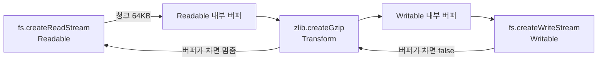
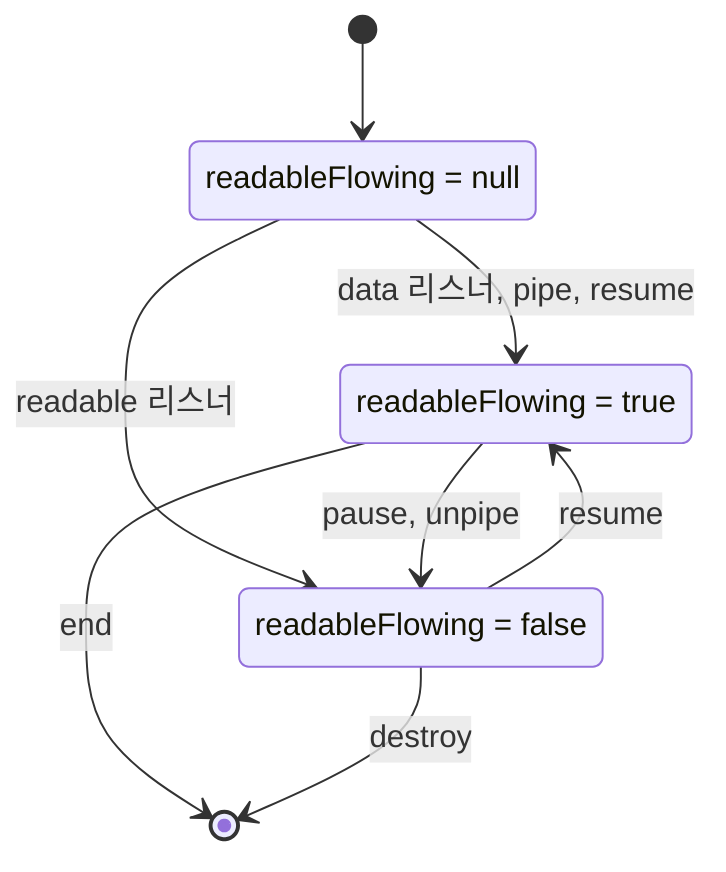
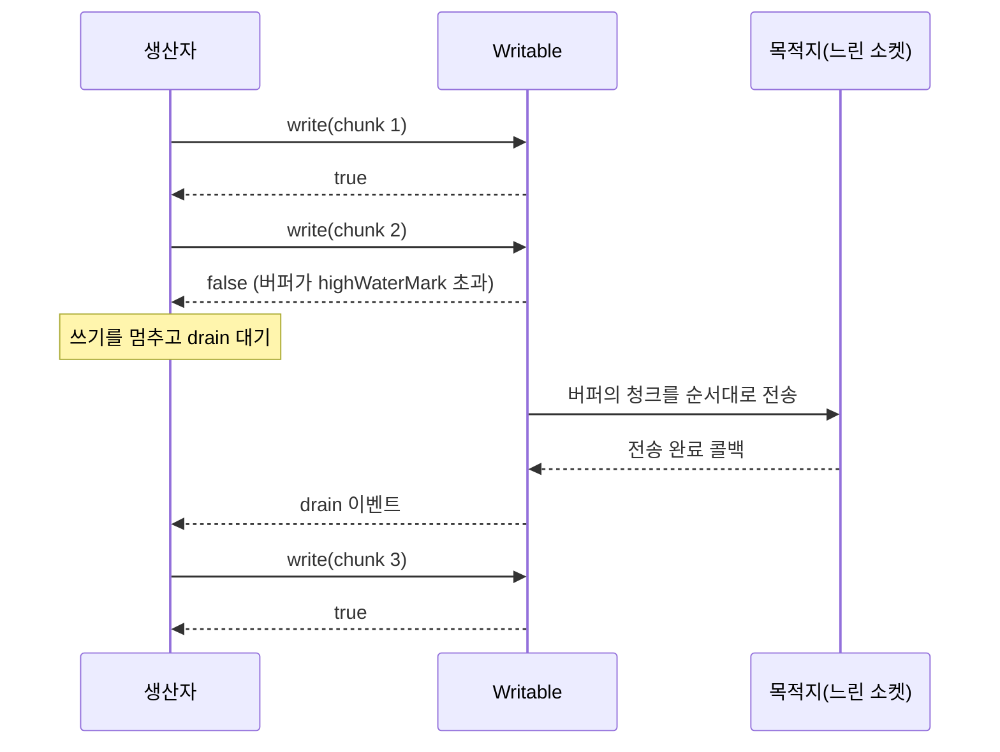
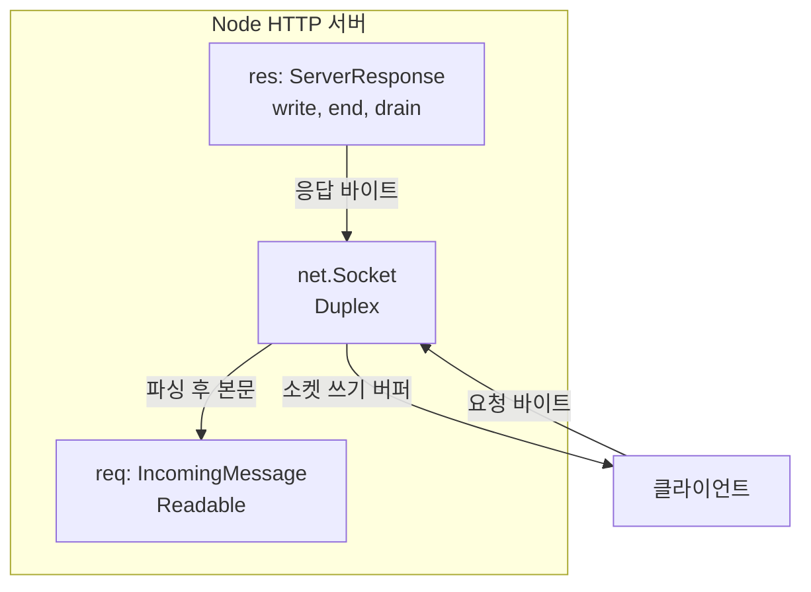
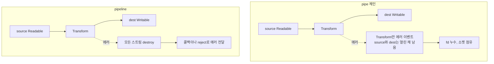
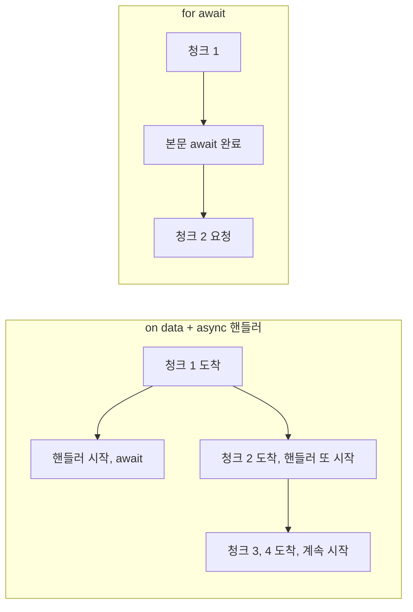

# Node.js Stream

파일을 한 번에 메모리에 올려서 처리하면, 1GB 파일을 다룰 때 서버 메모리가 그만큼 잡아먹힌다. 스트림은 데이터를 청크(chunk) 단위로 쪼개서 흘려보내는 방식이라, 파일 크기에 상관없이 메모리를 `highWaterMark` 크기 언저리로 유지한다. `fs.createReadStream`, HTTP 요청 객체, TCP 소켓이 모두 스트림 기반이다.

스트림은 네 가지 타입이다. Readable은 데이터를 읽어들이는 쪽, Writable은 데이터를 쓰는 쪽, Duplex는 읽기와 쓰기가 독립적으로 동시에 가능한 양방향, Transform은 Duplex의 일종으로 입력을 변환해서 출력한다.

스트림에서 실제로 사고가 나는 곳은 문법이 아니라 **속도가 다른 두 끝을 연결하는 지점**이다. 파일 복사 같은 로컬 작업에서는 티가 안 나다가, 프록시나 업로드 서버처럼 한쪽이 네트워크에 묶이는 순간 메모리가 터진다. 아래 내용은 그 지점을 중심으로 정리했다.

## 데이터가 흐르는 구조

Readable에서 나온 청크가 Transform을 거쳐 Writable로 들어간다. 각 스트림은 자기 안에 버퍼를 하나씩 갖고 있고, 그 버퍼의 상한이 `highWaterMark`다.



화살표가 앞으로만 가지 않는다는 점을 봐야 한다. 맨 끝 Writable의 버퍼가 차면 그 신호가 Transform을 거쳐 Readable까지 거꾸로 올라가서, Readable이 디스크에서 더 읽지 않는다. 이 역방향 신호가 backpressure다. 중간에 버퍼가 세 군데 있으니 최악의 경우 메모리에는 `highWaterMark`의 세 배 정도가 올라간다.

## Readable 모드와 상태 전이

Readable은 flowing, paused 두 모드로 동작한다. `data` 이벤트 리스너를 붙이거나 `pipe()`, `resume()`을 호출하면 flowing이 되어 청크가 이벤트로 밀려 나온다. paused 상태에서는 데이터가 내부 버퍼에 쌓이고, `read()`를 직접 불러야 꺼낼 수 있다.



처음에는 `null`이다. 소비자가 아무 신호도 주지 않은 상태라 데이터를 읽지 않는다. 이 값은 직접 찍어서 확인할 수 있다.

```javascript
const r = new Readable({ read() {} });
r.readableFlowing;                      // null
r.on('data', () => {});  r.readableFlowing;   // true
r.pause();               r.readableFlowing;   // false
```

`readable` 리스너를 붙이면 flowing 모드로 가지 않고 `false`가 된다. 이 상태에서 `data` 리스너를 같이 달면 `data` 이벤트가 오지 않는다. 실제로 `readable`을 먼저 달고 `data`를 뒤에 달아도, `data`를 먼저 달고 `readable`을 뒤에 달아도 `data`는 한 번도 호출되지 않았고 `readableFlowing`은 `false`였다. 에러도 안 난다. 로그 수집용으로 `data`를 달아 두고 다른 모듈에서 `readable`을 달면 수집이 조용히 멈춘다.

`highWaterMark`는 내부 버퍼의 임계값이고 기본값은 **64KB**(65536)다. 이 값을 넘으면 `_read()`가 더 호출되지 않는다.

```javascript
new Readable({ read() {} }).readableHighWaterMark;   // 65536
require('fs').createReadStream('/etc/hosts').readableHighWaterMark;  // 65536
```

16KB로 적힌 자료는 소켓 기준이거나 옛 판본이다. 값을 외우기보다 찍어 보는 게 낫고, objectMode에서는 단위 자체가 바뀐다.

### 직접 구현할 때 push 반환값

Readable을 직접 상속할 때 `push()`가 `false`를 반환하면 "버퍼가 찼으니 그만 밀어라"는 신호로 읽기 쉽다. 그래서 다음처럼 `break`를 넣는 코드가 흔하다.

```javascript
class DatabaseCursor extends Readable {
  constructor(queryFn, options = {}) {
    super({ objectMode: true, highWaterMark: 100, ...options });
    this.queryFn = queryFn;
    this.offset = 0;
    this.pageSize = 100;
    this.done = false;
  }

  async _read() {
    if (this.done) {
      this.push(null);
      return;
    }

    try {
      const rows = await this.queryFn(this.offset, this.pageSize);
      if (rows.length < this.pageSize) {
        this.done = true;
      }
      this.offset += rows.length;
      for (const row of rows) {
        this.push(row);   // 반환값이 false여도 이미 가져온 행은 전부 밀어 넣는다
      }
      if (this.done) this.push(null);
    } catch (err) {
      this.destroy(err);
    }
  }
}
```

원래 이 문서의 예제에는 `if (!this.push(row)) break;`가 있었는데, 이건 **데이터를 버리는 버그**다. `offset`은 이미 페이지 크기만큼 전진했는데 루프를 중간에 끊었으니 끊긴 뒤의 행은 어디에도 남지 않는다. 1000건짜리 가짜 데이터에 `highWaterMark: 10`을 주고 돌려 보니 받은 행이 19건이었고 에러는 없었다. `break`를 지우고 전부 `push()`하면 1000건이 다 온다.

`push()`가 `false`를 줘도 버퍼에 넣는 동작은 이미 끝난 상태다. `false`는 "다음 `_read()` 호출을 잠시 미룰 테니 지금 쥔 데이터는 마저 내라"는 뜻이지 "멈춰라"가 아니다. 한 번에 가져오는 양(`pageSize`)이 버퍼 한도를 넘지 않게 잡는 것이 메모리 상한을 지키는 방법이다.

## Writable과 backpressure

`write()`는 내부 버퍼가 `highWaterMark`를 넘으면 `false`를 반환한다. 이 값을 무시하고 계속 쓰면 버퍼가 끝없이 커진다. 버퍼가 비워지면 `drain` 이벤트가 발생하고, 그때 쓰기를 재개해야 한다.



두 번째 `write()`가 `false`를 돌려주는 지점부터 생산자는 `drain`이 올 때까지 손을 떼야 한다. `false`가 나온 뒤에도 `write()`는 에러 없이 받아 주기 때문에, 신호를 무시한 코드도 테스트에서는 잘 돈다. 차이는 느린 목적지를 만났을 때만 드러난다.

직접 구현하면 이렇게 된다.

```javascript
const fs = require('fs');

function copyWithBackpressure(src, dest) {
  const readable = fs.createReadStream(src);
  const writable = fs.createWriteStream(dest);

  readable.on('data', (chunk) => {
    if (!writable.write(chunk)) {
      readable.pause();
    }
  });

  writable.on('drain', () => readable.resume());

  return new Promise((resolve, reject) => {
    writable.on('finish', resolve);
    readable.on('error', reject);
    writable.on('error', reject);
  });
}
```

이 패턴은 Readable 하나, Writable 하나일 때만 성립한다. 한 Readable을 Writable 둘에 나눠 쓰면 어느 쪽 `drain`에 `resume()`을 걸지 정해야 하고, 빠른 쪽이 `resume()`해 버리면 느린 쪽 버퍼가 다시 커진다. 이런 팬아웃은 가장 느린 쪽에 맞춰 직접 조정해야 하고, `pipe()` 두 개를 붙이는 것으로는 해결되지 않는다.

### 프록시에서 backpressure를 무시했을 때

가장 흔한 사고가 대용량 다운로드 프록시다. 업스트림에서 받은 응답을 클라이언트로 흘려보내는데, 업스트림은 사내망이라 빠르고 클라이언트는 모바일이라 느리다. 아래는 이 상황을 로컬에서 재현한 것이다. 업스트림이 400MB를 64KB 청크로 최대한 빠르게 보내고, 프록시가 그걸 받아 느린 클라이언트(64KB마다 1ms 멈춤)에게 전달한다. 프록시 프로세스의 최대 RSS만 비교한다.

```javascript
// ignore: write() 반환값을 안 본다
up.on('data', (c) => res.write(c));
up.on('end', () => res.end());

// pipeline: backpressure를 스트림이 처리한다
pipeline(up, res).catch(() => {});
```

Node v20.20.0에서 실행한 결과다.

```text
ignore: proxy peak RSS 468 MB
pipeline: proxy peak RSS 81 MB
```

`ignore`는 업스트림이 400MB를 다 보낼 때까지 `res`의 쓰기 버퍼에 쌓아 두고, 클라이언트가 읽는 속도대로만 비워진다. `pipeline`은 `res.write()`가 `false`가 되면 `up`을 멈추고, TCP 수신 버퍼가 차면 업스트림 쪽 전송도 멈춘다. 81MB는 Node 기본 상주분(40MB 안팎)에 버퍼 몇 개를 더한 값이다.

실서비스에서는 이게 요청 한 건당 벌어진다. 동시 다운로드가 100개면 468MB가 아니라 수십 GB가 되고, 그 시점에는 OOM 킬러가 프로세스를 죽인다. 로컬에서 테스트할 때는 클라이언트도 로컬이라 빠르게 받아 가서 재현되지 않는다. 증상은 "특정 고객이 느린 회선에서 큰 파일을 받는 시간대에만 메모리가 오른다"는 모양으로 나온다.

## Transform

Transform은 `_transform()`에서 `this.push()`로 결과를 내보내고, `callback()`을 호출해야 다음 청크를 받는다. `callback()`을 빠뜨리면 스트림이 그 자리에서 멈추고 에러도 없다.

```javascript
const { Transform } = require('stream');

class LineCounter extends Transform {
  constructor(options = {}) {
    super(options);
    this.lineCount = 0;
    this.remainder = '';
  }

  _transform(chunk, encoding, callback) {
    const str = this.remainder + chunk.toString();
    const lines = str.split('\n');
    this.remainder = lines.pop();
    this.lineCount += lines.length;
    this.push(chunk);
    callback();
  }

  _flush(callback) {
    if (this.remainder) {
      this.lineCount++;
    }
    console.log(`총 ${this.lineCount}줄`);
    callback();
  }
}
```

`_flush()`는 마지막 `_transform()` 뒤, 스트림이 닫히기 전에 한 번 호출된다. 위 예제처럼 청크 경계에 걸린 불완전한 줄을 `remainder`에 들고 있다가 `_flush()`에서 내보낸다.

여기서 한 가지 조용히 깨지는 곳이 있다. `chunk.toString()`은 청크 경계에서 UTF-8 멀티바이트 문자를 자른다. 한글은 3바이트라 64KB 경계에 걸리면 깨진 문자(`�`)가 나온다. 줄 수만 세는 이 예제는 영향이 없지만, 문자열을 변환해서 내보내는 Transform이라면 `string_decoder`의 `StringDecoder`를 쓰거나 스트림에 `setEncoding('utf8')`을 호출해야 한다. 테스트 파일이 영어이거나 작으면 한 번도 안 걸리다가 운영의 한글 로그에서 간헐적으로 터진다.

또 하나, `_transform()` 안에서 비동기 작업을 하는 경우 `callback()`을 `await` 뒤에 불러야 backpressure가 유지된다. `callback()`을 먼저 부르고 작업을 백그라운드로 돌리면 Transform은 "처리 끝"으로 알고 계속 청크를 받는다. 결국 비동기 작업이 무한히 쌓인다.

## Duplex와 네트워크 객체

Duplex는 읽기와 쓰기 채널이 독립적이다. `net.Socket`이 대표적이다. TCP 연결은 받으면서 동시에 보낼 수 있으니 한 객체 안에 Readable과 Writable이 같이 들어 있다.

HTTP 객체는 헷갈리기 쉬워서 직접 확인했다.

```javascript
net.Socket.prototype instanceof Duplex;                       // true
http.IncomingMessage.prototype instanceof Readable;           // true
http.IncomingMessage.prototype instanceof Duplex;             // false
http.ServerResponse.prototype instanceof Writable;            // false
http.ServerResponse.prototype instanceof Duplex;              // false
```

서버가 받는 `req`(그리고 클라이언트가 받는 응답)는 `IncomingMessage`라서 Readable이다. `res`(`ServerResponse`)는 `write()`, `end()`, `drain`을 갖고 있지만 `stream.Writable`을 상속하지 않는 옛 `Stream` 계열이다. `instanceof Writable` 검사에 의존하는 코드는 `res`에서 실패한다. `pipe()`와 `pipeline()`은 인터페이스만 맞으면 동작하므로 `res`에 연결해도 문제가 없다.



`req`의 본문을 읽는 속도와 `res`가 쓰는 속도는 모두 같은 소켓의 읽기·쓰기 채널에 매여 있다. 업로드 서버에서 `req`를 디스크로 `pipeline()`하면 디스크가 느릴 때 `req`가 멈추고, 소켓 수신 버퍼가 차서 클라이언트의 TCP 전송이 줄어든다. 아무 코드도 짜지 않았는데 클라이언트까지 속도 조절이 전달되는 구조다.

반대로 `req.on('data')`에서 본문을 배열에 쌓아 두었다가 `end`에 처리하는 코드는 업로드 크기만큼 힙을 쓴다. 크기 제한을 안 걸었다면 큰 요청 하나가 프로세스를 죽인다.

소켓 서버 예제다.

```javascript
const net = require('net');

const server = net.createServer((socket) => {
  socket.on('data', (data) => {
    const message = data.toString().trim();
    socket.write(`Echo: ${message}\n`);
  });

  socket.on('end', () => {
    socket.destroy();
  });

  socket.on('error', (err) => {
    console.error('소켓 오류:', err.message);
  });
});

server.listen(3000);
```

이 에코 서버는 `socket.write()`의 반환값을 안 본다. 클라이언트가 요청만 계속 보내고 응답을 안 읽으면 `Echo:` 응답이 서버 쪽 쓰기 버퍼에 쌓인다. 에코 정도는 응답이 작아서 문제가 안 되지만, 응답이 큰 프로토콜이라면 `socket.pipe(socket)`처럼 스트림 연결로 바꾸거나 `write()` 반환값에 맞춰 `socket.pause()`를 걸어야 한다.

직접 Duplex를 구현할 일은 드물다. 커스텀 프로토콜 파서나 WebSocket 클라이언트를 만들 때 쓰고, `_read()`와 `_write()`를 둘 다 구현해야 한다.

## pipe와 pipeline의 에러 처리

`pipe()`는 backpressure는 처리하지만 에러가 나도 스트림을 정리해 주지 않는다. 어느 한 스트림이 죽어도 나머지는 그대로 열려 있다. `pipeline()`은 한 곳에서 에러가 나면 연결된 전체를 `destroy()`한다.



왼쪽 체인에서는 에러가 난 스트림 하나만 상태가 바뀐다. 실제로 확인한 결과다. 5MB 파일을 읽어서, 첫 청크에서 에러를 내는 Transform을 거쳐, 파일로 쓰는 체인을 만들었다.

```javascript
r1.pipe(t1).pipe(w1);               // t1.on('error') 만 달았다
pipeline(r2, boom(), w2, callback); // 같은 구성
```

```text
pipe     : src.destroyed=false dst.destroyed=false fd +2
pipeline : src.destroyed=true dst.destroyed=true fd +0
```

`pipe`는 읽기 파일과 쓰기 파일이 둘 다 열린 채 남았고 `/proc/self/fd`로 센 파일 디스크립터가 2개 늘었다. 요청마다 이 일이 벌어지면 `EMFILE: too many open files`가 나온다. 에러 로그는 `EMFILE` 한 줄만 찍히기 때문에 원인이 몇 시간 전에 흘린 에러 한 건이라는 사실을 연결하기 어렵다.

프록시에서는 클라이언트가 중간에 연결을 끊는 경우가 훨씬 흔하다. 같은 로컬 환경에서 업스트림이 5ms마다 64KB를 계속 쓰고, 클라이언트가 첫 청크를 받고 100ms 뒤에 연결을 끊게 했다.

```text
pipe: client 끊김 후 up.destroyed=false socket.destroyed=false
pipeline: client 끊김 후 up.destroyed=true socket.destroyed=true
  upstream: 연결 닫힘 감지
```

`up.pipe(res)`는 `res`가 닫히면 pipe 연결만 풀고 `up`을 건드리지 않는다. 업스트림 응답은 멈춘 채로 소켓을 계속 잡고 있고, 업스트림 서버는 연결이 끊겼다는 걸 알지 못해 계속 쓴다. `pipeline`은 `res`가 닫히는 순간 `up`을 destroy하고, 그 결과 업스트림 서버가 `close`를 감지했다. 프록시 서버에서 업스트림 연결 수가 시간이 지나며 계속 늘어나는 증상은 대개 이 지점이다.

`pipe()`를 쓰면서 안전하게 하려면 모든 스트림에 에러·close 핸들러를 달고 서로 `destroy()`해야 한다. 스트림이 셋이면 핸들러가 여섯 개고, 하나를 빼먹기 쉽다. 새 코드는 `pipeline()`으로 쓰는 편이 낫다.

```javascript
const { pipeline } = require('stream/promises');
const fs = require('fs');
const zlib = require('zlib');

async function compressFile(inputPath, outputPath) {
  await pipeline(
    fs.createReadStream(inputPath, { highWaterMark: 64 * 1024 }),
    new LineCounter(),
    zlib.createGzip(),
    fs.createWriteStream(outputPath)
  );
}

compressFile('data.csv', 'data.csv.gz').catch(console.error);
```

`stream/promises`는 Node.js 15부터 있다. 콜백 버전은 `require('stream').pipeline`이고 마지막 인자로 콜백을 받는다.

`pipeline()`에도 걸리는 곳이 있다. 마지막 스트림이 `res`처럼 클라이언트에 응답을 쓰는 스트림인 경우, `pipeline()`이 에러로 `res`를 destroy하면 이미 헤더가 나간 뒤라 클라이언트는 응답이 중간에 끊긴 것으로 받는다. 상태 코드를 바꿀 수 없다. 스트림 응답은 에러가 날 수 있는 작업(DB 조회, 업스트림 호출)을 헤더를 보내기 전에 먼저 해 두어야 한다.

## AbortSignal로 중단하기

`pipeline()`은 `signal` 옵션으로 `AbortController`를 받는다. 신호가 abort되면 연결된 모든 스트림이 destroy되고 `AbortError`로 reject된다.

```javascript
const ac = new AbortController();
const timer = setTimeout(() => ac.abort(), 30_000);

try {
  await pipeline(upstreamRes, gunzip, fs.createWriteStream(tmpPath), { signal: ac.signal });
} catch (err) {
  if (err.name === 'AbortError') {
    await fs.promises.unlink(tmpPath).catch(() => {});
  }
  throw err;
} finally {
  clearTimeout(timer);
}
```

느린 Readable과 싱크를 `pipeline()`에 넣고 50ms 뒤 abort했더니 이렇게 나왔다.

```text
abort: AbortError ABORT_ERR slow.destroyed true sink.destroyed true
```

두 스트림이 모두 destroy됐다. 이게 요청 타임아웃을 거는 정석이다. `setTimeout`으로 `res.destroy()`만 부르면 다른 스트림 하나가 남는다.

주의할 점이 두 가지다. 첫째, abort는 스트림을 destroy할 뿐 **이미 디스크에 쓴 부분을 지우지 않는다.** 위 예제에서 `unlink`를 직접 부르는 이유다. 둘째, `http.get()`의 `signal`과 `pipeline()`의 `signal`은 서로 별개다. 같은 컨트롤러를 둘 다에 넘겨야 업스트림 요청과 파이프가 함께 정리된다.

## 이벤트 방식과 async iterator

스트림을 소비하는 방법은 이벤트(`on('data')`)와 async iterator(`for await`) 두 가지다. 둘은 backpressure 동작이 다르다.

```javascript
// 이벤트: 핸들러가 async 여도 스트림은 안 기다린다
stream.on('data', async (row) => {
  await db.insert(row);
});

// iterator: 루프 본문이 끝나야 다음 청크를 가져온다
for await (const row of stream) {
  await db.insert(row);
}
```



`data` 이벤트는 핸들러가 반환한 Promise를 쳐다보지 않는다. 핸들러가 `await`에 걸려 있어도 다음 청크는 바로 들어온다. 4건짜리 스트림에 20ms 걸리는 async 핸들러를 달아서 동시에 실행 중인 핸들러 수를 재 보니 이벤트 방식은 최대 4, `for await`는 최대 1이었다. 건수가 100만이면 DB 커넥션 풀이 바닥나거나 대기 중인 Promise가 힙을 채운다. 이벤트 방식에서 처리 순서도 보장되지 않는다. 핸들러마다 걸리는 시간이 다르면 나중 청크가 먼저 끝난다.

`for await`를 쓰면 이 문제가 사라지지만, 순차 처리라 처리량이 낮다. 동시성이 필요하면 `Readable.prototype.map(fn, { concurrency: 8 })`(Node.js 17.4 이상, 실험적 표시) 같은 방법이 있고, 쓰기 쪽이 따로 있다면 Writable의 `_write()`에서 `callback`을 늦추는 방식으로 상한을 건다.

`for await` 루프를 `break`나 `throw`로 빠져나가면 스트림이 자동으로 destroy된다. 3개짜리 스트림에서 첫 요소만 읽고 `break`한 뒤 `destroyed`를 확인하니 `true`였다. 스트림을 재사용하려고 일부만 읽고 나왔다면 이미 닫힌 뒤다. 이어서 읽을 거라면 `for await` 대신 `readable.read()`를 직접 써야 한다.

## objectMode의 highWaterMark

같은 이름의 옵션인데 objectMode에서는 **단위가 바이트에서 개수로 바뀐다.** 기본값도 함께 바뀐다.

```javascript
new Readable({ read() {} }).readableHighWaterMark;                  // 65536  (바이트)
new Readable({ objectMode: true, read() {} }).readableHighWaterMark; // 16     (개수)
new Writable({ write(c,e,cb){cb();} }).writableHighWaterMark;                  // 65536
new Writable({ objectMode: true, write(c,e,cb){cb();} }).writableHighWaterMark; // 16
```

`16`은 16KB가 아니라 객체 16개다. 객체 하나가 크면 16개만으로 메모리가 크게 부푼다. 10MB짜리 객체를 느린 소비자에게 밀어 넣어 보면 알 수 있다.

```javascript
const w = new Writable({ objectMode: true, write(c, e, cb) { setTimeout(cb, 50); } });
let n = 0, ok = true;
while (ok) { ok = w.write({ payload: 'x'.repeat(10 * 1024 * 1024) }); n++; }
// 16개째에 false 반환. 그때 버퍼에 약 160MB 가 쌓여 있다
```

바이트 모드였다면 64KB에서 배압이 걸렸을 텐데, 객체 모드는 160MB를 다 받고 나서야 신호를 준다. 같은 `write()`를 빈 객체로 호출해서 확인하면 16번째에 `false`가 나온다. DB 커서에서 행을 읽어 흘리는 파이프라인에서 행 하나가 크면(BLOB 컬럼, 큰 JSON) 이 모양이 된다.

객체 크기를 알면 `highWaterMark`를 직접 잡는다.

```javascript
// 행 하나가 수 MB 인 커서 스트림: 기본값 16 이면 수십 MB 가 버퍼에 뜬다
new Readable({ objectMode: true, highWaterMark: 2, read() {} });

// 작은 이벤트 객체라면 늘려서 처리량을 올린다
new Readable({ objectMode: true, highWaterMark: 256, read() {} });
```

기본값 16은 객체 하나가 작다는 전제로 정한 숫자다. 그 전제가 안 맞으면 조정하고, 근거는 객체 하나의 실제 크기다.

객체 모드와 버퍼 모드를 섞을 때도 조심해야 한다. 객체 모드 Readable을 버퍼 모드 Writable에 바로 연결하면 `ERR_INVALID_ARG_TYPE`이 나온다. 이 에러는 `pipeline()` 콜백으로 전달되지 않고 `data` 이벤트 처리 중에 동기로 throw되어 uncaught exception으로 프로세스를 죽인다. 중간에 Transform을 끼워 `JSON.stringify(obj) + '\n'`처럼 바이트로 바꿔 줘야 한다. Transform 하나에서 한쪽만 객체 모드로 쓰려면 `readableObjectMode`와 `writableObjectMode`를 따로 지정한다.

## Writable 배치 쓰기

`_final()`은 스트림이 끝날 때 한 번 호출된다. 배치로 모아 쓰는 Writable에서 마지막에 남은 묶음을 처리하는 자리다.

```javascript
const { Writable } = require('stream');

class BatchWriter extends Writable {
  constructor(db, options = {}) {
    super({ objectMode: true, highWaterMark: 50, ...options });
    this.db = db;
    this.batch = [];
  }

  async _write(chunk, encoding, callback) {
    this.batch.push(chunk);
    if (this.batch.length >= 50) {
      try {
        await this.db.bulkInsert(this.batch);
        this.batch = [];
        callback();
      } catch (err) {
        callback(err);
      }
    } else {
      callback();
    }
  }

  async _final(callback) {
    if (this.batch.length > 0) {
      try {
        await this.db.bulkInsert(this.batch);
        callback();
      } catch (err) {
        callback(err);
      }
    } else {
      callback();
    }
  }
}
```

`callback()`을 빠뜨리면 `finish`가 발생하지 않는다. 배치가 50건 미만일 때 `callback()`을 즉시 부르는 위 코드는 쓰기 버퍼가 `highWaterMark`에 걸릴 일이 없어 backpressure가 사실상 꺼진다. 건수가 아니라 DB 부하에 맞추고 싶다면 `bulkInsert`가 끝난 뒤에만 `callback()`을 부르게 해야 하고, 위 구현은 그 시점이 50건 단위로만 온다는 점을 알아 두어야 한다. 마지막 `bulkInsert`가 실패하면 `_final`의 에러가 `finish` 대신 `error`로 전달된다.

## 메모리 비교 요약

`fs.readFile()`로 전체를 읽어서 가공하면 파일 크기만큼 힙에 올라간다. 1GB 파일이면 1GB가 메모리를 잡는다. `createReadStream()`과 Transform을 조합하면 `highWaterMark`와 중간 버퍼 수만큼만 유지된다. 이 문서에서 직접 돌린 결과를 한곳에 모았다. 환경은 Node.js v20.20.0, 로컬 루프백이다.

| 상황 | 관측값 |
|---|---|
| 프록시, `data`에서 `res.write()` 반환값 무시 (400MB 전송) | 프록시 최대 RSS 468MB |
| 프록시, `pipeline(up, res)` | 프록시 최대 RSS 81MB |
| `pipe()` 체인에서 Transform 에러 | 읽기·쓰기 스트림 모두 열린 채, fd 2개 증가 |
| `pipeline()` 에서 같은 에러 | 스트림 모두 destroy, fd 증가 0 |
| 클라이언트 중간 종료, `up.pipe(res)` | 업스트림 응답 스트림과 소켓 유지 |
| 클라이언트 중간 종료, `pipeline(up, res)` | 업스트림 소켓 destroy, 서버가 close 감지 |
| `on('data')` + async 핸들러 (4건) | 동시 실행 최대 4 |
| `for await` + 같은 본문 | 동시 실행 최대 1 |
| objectMode `write()` | 16번째에 `false` |

숫자는 장비와 청크 크기에 따라 달라진다. 값 자체보다 같은 조건에서 배압 처리 유무에 따라 갈리는 차이가 의미 있다.

## 그 밖의 주의사항

`stream.destroy()`를 호출하면 `close` 이벤트는 발생하지만 `finish`나 `end`는 발생하지 않는다. 정리 코드를 `finish`에만 붙였다면 에러나 중단 때 실행되지 않는다. 자원 정리는 `close`에 붙이거나 `pipeline()`의 콜백·`finally`에서 한다.

`readable` 이벤트와 `data` 이벤트는 서로 다른 모드를 가정한다. 앞에서 확인했듯 `readable` 리스너가 있으면 `data`가 오지 않으므로 한 스트림에는 한 방식만 쓴다.

`stream.Readable.from(iterable)`은 편하지만 배열을 넘기면 이미 메모리에 올라온 배열을 스트림 모양으로 감쌀 뿐이다. 대용량을 다루는 용도라면 제너레이터를 넘겨야 필요할 때 한 건씩 만든다.
