# ORM 심화 및 실전 활용

## 개요

ORM (Object-Relational Mapping)은 객체 지향 프로그래밍과 관계형 데이터베이스 간의 불일치를 해결하는 기술입니다. Node.js 생태계에서는 TypeORM, Sequelize, Prisma가 주요 ORM입니다.

### ORM의 핵심 가치

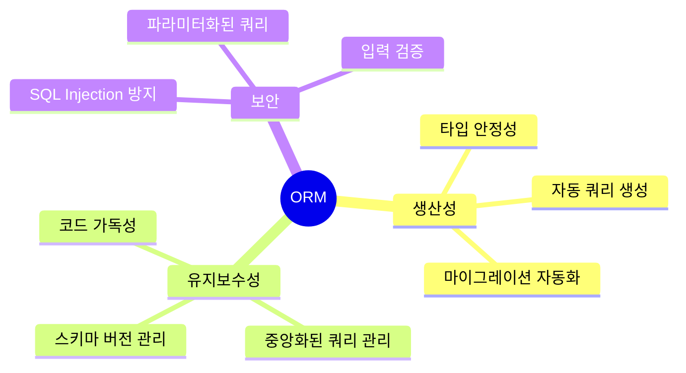

### 주요 ORM 비교

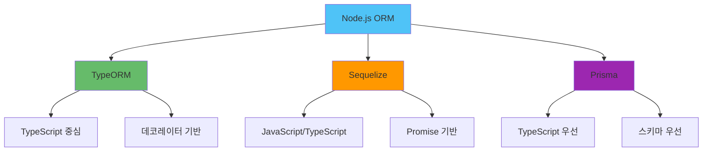

## TypeORM vs Sequelize vs Prisma

### 상세 비교표

| 항목 | TypeORM | Sequelize | Prisma |
|------|---------|-----------|--------|
| **언어** | TypeScript 우선 | JavaScript/TypeScript | TypeScript 우선 |
| **학습 곡선** | 중간 | 낮음 | 중간 |
| **성능** | 좋음 | 좋음 | 매우 좋음 |
| **마이그레이션** | 자동 생성 | 수동/자동 | 자동 생성 |
| **쿼리 빌더** | 강력함 | 강력함 | 제한적 |
| **관계 관리** | 데코레이터 기반 | 메서드 기반 | 선언적 |
| **Raw Query** | 지원 | 지원 | 지원 |
| **트랜잭션** | 강력함 | 강력함 | 제한적 |
| **커뮤니티** | 활발 | 매우 활발 | 빠르게 성장 |

### 선택 기준

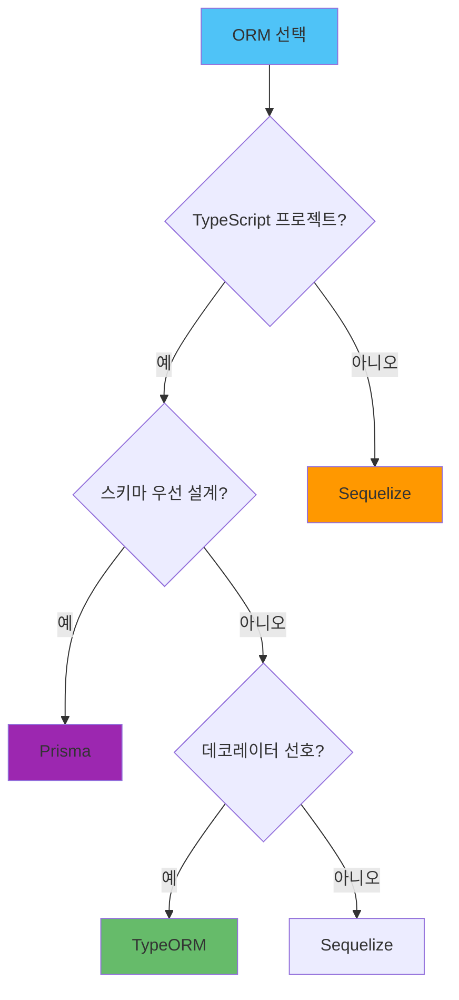

## TypeORM 심화

### TypeORM 설정

TypeORM은 TypeScript 중심의 ORM으로, 데코레이터 기반의 선언적 엔티티 정의를 제공합니다.

**DataSource 설정:**

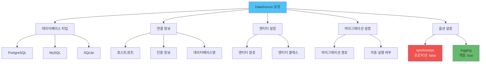

**주요 설정 항목:**
- **type**: 데이터베이스 타입 (postgres, mysql, sqlite 등)
- **synchronize**: 자동 스키마 동기화 (프로덕션에서는 반드시 false)
- **logging**: 쿼리 로깅 활성화 (개발 환경에서만 true)
- **entities**: 엔티티 클래스 또는 경로 지정
- **migrations**: 마이그레이션 파일 경로

**엔티티 정의:**

TypeORM은 데코레이터를 사용하여 엔티티를 정의합니다. 주요 데코레이터:

- **@Entity()**: 테이블 매핑
- **@PrimaryGeneratedColumn()**: 자동 증가 기본 키
- **@Column()**: 컬럼 정의 (타입, 길이, 제약조건)
- **@OneToMany()**, **@ManyToOne()**, **@ManyToMany()**: 관계 정의
- **@CreateDateColumn()**, **@UpdateDateColumn()**: 자동 타임스탬프

**관계 설정:**

- **One-to-Many**: `@OneToMany()`와 `@ManyToOne()` 조합
- **Many-to-Many**: `@ManyToMany()`와 `@JoinTable()` 사용
- **Cascade 옵션**: `onDelete: 'CASCADE'`로 연관 데이터 자동 삭제
- **JoinColumn**: 외래 키 컬럼명 커스터마이징

## Sequelize 심화

### Sequelize 설정

Sequelize는 JavaScript/TypeScript 모두 지원하는 ORM으로, Promise 기반의 비동기 API를 제공합니다.

**Sequelize 인스턴스 설정:**

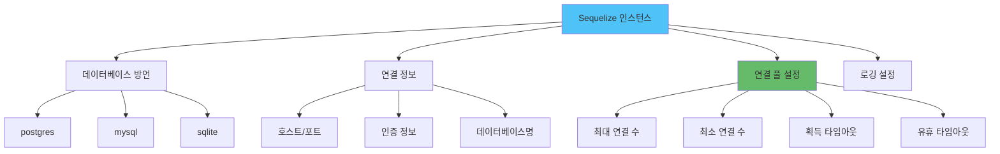

**주요 설정 항목:**
- **dialect**: 데이터베이스 타입 (postgres, mysql, sqlite 등)
- **pool**: 연결 풀 설정 (max, min, acquire, idle)
- **logging**: 쿼리 로깅 (개발 환경에서만 활성화)
- **define**: 전역 모델 옵션 (timestamps, underscored 등)

**모델 정의:**

Sequelize는 `define()` 메서드를 사용하여 모델을 정의합니다:

- **필드 타입**: DataTypes를 사용하여 타입 지정
- **제약조건**: allowNull, unique, primaryKey 등
- **검증**: validate 옵션으로 입력 검증
- **옵션**: tableName, timestamps, underscored 등

**관계 정의:**

- **hasMany()**: 일대다 관계 (부모 → 자식)
- **belongsTo()**: 다대일 관계 (자식 → 부모)
- **hasOne()**: 일대일 관계
- **belongsToMany()**: 다대다 관계
- **as 옵션**: 관계 별칭 지정

## Prisma 심화

### Prisma 설정

Prisma는 스키마 우선 설계를 채택한 현대적인 ORM으로, 타입 안정성과 성능에 중점을 둡니다.

**Prisma Schema 구조:**

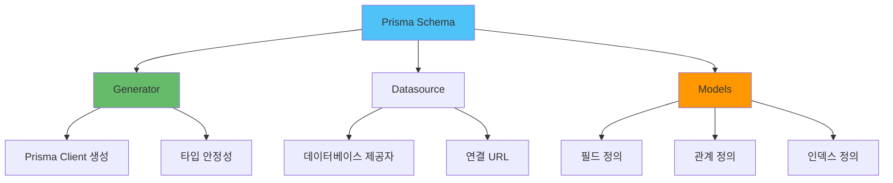

**Prisma Schema 주요 구성:**

- **generator**: Prisma Client 생성 설정
- **datasource**: 데이터베이스 연결 정보
- **model**: 데이터 모델 정의 (테이블 매핑)
- **@id**: 기본 키 지정
- **@default()**: 기본값 설정
- **@unique**: 유니크 제약조건
- **@db.타입**: 데이터베이스별 타입 지정
  password  String   @db.VarChar(255)
  posts     Post[]
  createdAt DateTime @default(now()) @map("created_at")
  updatedAt DateTime @updatedAt @map("updated_at")

  @@map("users")
}

model Post {
  id        String   @id @default(uuid())
  title     String   @db.VarChar(255)
  content   String   @db.Text
  authorId  String   @map("author_id")
  author    User     @relation(fields: [authorId], references: [id], onDelete: Cascade)
  createdAt DateTime @default(now()) @map("created_at")
  updatedAt DateTime @updatedAt @map("updated_at")

  @@map("posts")
}
```

### Prisma Client 사용

```typescript
import { PrismaClient } from '@prisma/client';

const prisma = new PrismaClient({
  log: process.env.NODE_ENV === 'development' 
    ? ['query', 'error', 'warn'] 
    : ['error']
});

// 사용 예시
async function getUserWithPosts(userId: string) {
  return await prisma.user.findUnique({
    where: { id: userId },
    include: {
      posts: true
    }
  });
}
```

## ORM 성능 최적화

### N+1 문제 해결

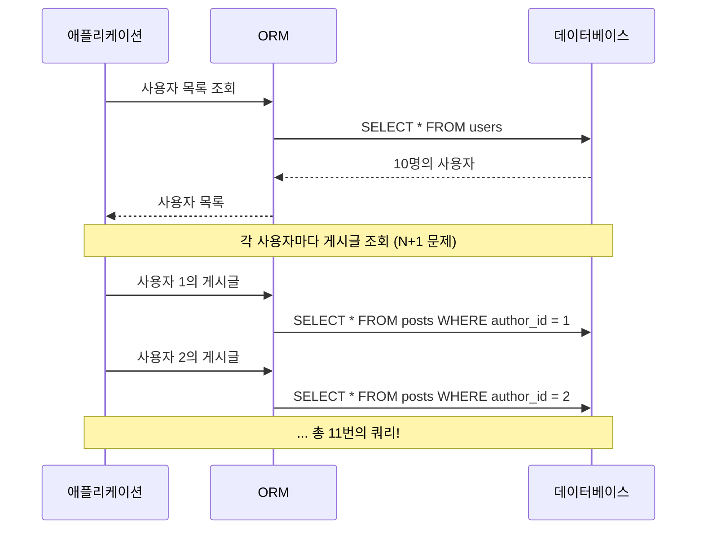

#### TypeORM: Eager Loading

```typescript
// 나쁜 예시: N+1 문제 발생
const users = await userRepository.find();
for (const user of users) {
  const posts = await postRepository.find({ where: { authorId: user.id } });
  // 각 사용자마다 쿼리 실행
}

// 좋은 예시: Eager Loading
const users = await userRepository.find({
  relations: ['posts'] // 한 번에 로드
});

// 좋은 예시: Query Builder 사용
const users = await userRepository
  .createQueryBuilder('user')
  .leftJoinAndSelect('user.posts', 'post')
  .getMany();
```

#### Sequelize: Include 사용

Sequelize는 `include` 옵션을 사용하여 관계 데이터를 한 번에 로드합니다:

- **N+1 문제 발생**: 루프 내에서 개별 쿼리 실행
- **해결 방법**: `include` 옵션으로 JOIN 쿼리 생성
- **중첩 include**: 여러 단계의 관계도 한 번에 로드 가능

**Include 옵션:**
- **required**: INNER JOIN 사용 (기본값: false, LEFT JOIN)
- **attributes**: 포함할 필드 선택
- **where**: 관계 데이터 필터링

#### Prisma: Include 사용

Prisma는 기본적으로 N+1 문제를 방지하도록 설계되었습니다:

- **자동 최적화**: `include` 사용 시 자동으로 JOIN 쿼리 생성
- **타입 안정성**: TypeScript로 관계 타입 자동 추론
- **중첩 include**: 여러 단계의 관계 포함 가능

### 쿼리 최적화

**Select 필드 제한:**

불필요한 필드를 제외하여 네트워크 트래픽과 메모리 사용량을 줄입니다:

- **TypeORM**: `select` 옵션으로 필요한 필드만 지정
- **Sequelize**: `attributes` 옵션으로 필드 선택
- **Prisma**: `select` 객체로 필드 지정

**인덱스 활용:**

자주 조회되는 컬럼에 인덱스를 생성하여 쿼리 성능을 향상시킵니다:

- **단일 컬럼 인덱스**: 자주 WHERE 절에 사용되는 컬럼
- **복합 인덱스**: 여러 컬럼을 함께 조회하는 경우
- **유니크 인덱스**: 중복 방지가 필요한 컬럼

**인덱스 정의 방법:**
- **TypeORM**: `@Index()` 데코레이터 사용
- **Sequelize**: `indexes` 옵션 사용
- **Prisma**: `@@index()` 지시어 사용

## 트랜잭션 관리

트랜잭션은 여러 데이터베이스 작업을 하나의 원자적 단위로 묶어 데이터 일관성을 보장합니다.

**트랜잭션 처리 흐름:**

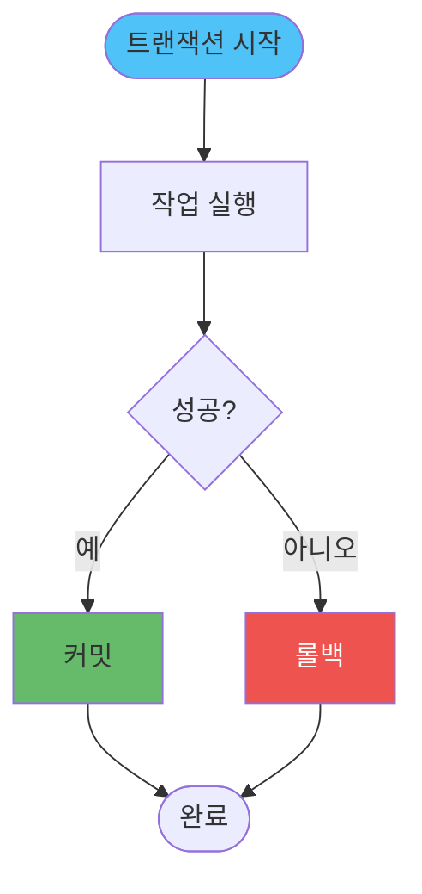

### TypeORM 트랜잭션

**QueryRunner 방식:**
- 수동으로 트랜잭션을 시작하고 관리
- 세밀한 제어가 필요한 경우 사용
- 반드시 `release()`로 연결 해제

**Transaction 데코레이터:**
- 메서드 레벨에서 트랜잭션 자동 관리
- 예외 발생 시 자동 롤백
- 코드 간결성 향상

### Sequelize 트랜잭션

**수동 트랜잭션:**
- 트랜잭션 객체를 명시적으로 생성하고 관리
- 각 쿼리에 `transaction` 옵션 전달 필요
- 예외 처리와 롤백을 직접 관리

**자동 트랜잭션:**
- 콜백 함수 내에서 자동으로 트랜잭션 관리
- 예외 발생 시 자동 롤백
- 코드 가독성 향상

### Prisma 트랜잭션

**Interactive Transaction:**
- 콜백 함수 내에서 여러 작업을 순차적으로 실행
- 이전 작업 결과를 다음 작업에 활용 가능
- 복잡한 비즈니스 로직에 적합

**Batch Transaction:**
- 여러 독립적인 작업을 동시에 실행
- 모든 작업이 성공해야 커밋
- 병렬 처리 가능한 작업에 적합

## 마이그레이션

마이그레이션은 데이터베이스 스키마의 버전을 관리하고, 변경 이력을 추적하는 핵심 메커니즘입니다.

**마이그레이션 프로세스:**

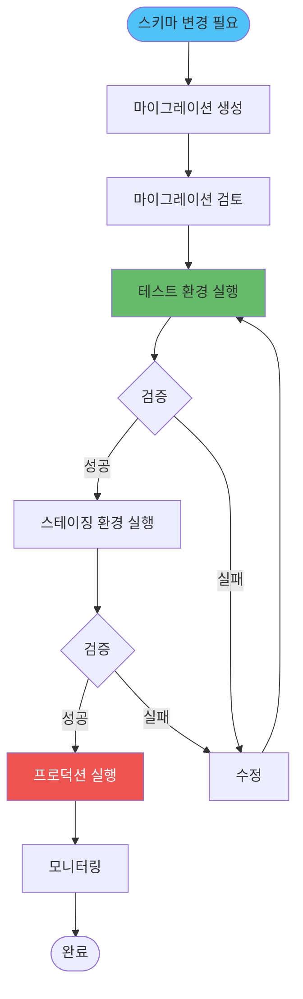

### 마이그레이션 비교

**TypeORM 마이그레이션:**
- 수동으로 마이그레이션 파일 작성
- `up()` 메서드: 스키마 변경 적용
- `down()` 메서드: 롤백 처리
- 유연한 제어 가능, 하지만 작성 비용 높음

**Sequelize 마이그레이션:**
- CLI로 마이그레이션 파일 생성
- `up()` / `down()` 메서드로 변경/롤백
- JavaScript 기반으로 작성 용이
- 테이블 생성/수정/삭제 헬퍼 메서드 제공

**Prisma 마이그레이션:**
- 스키마 변경 시 자동 생성
- 개발 환경: `prisma migrate dev`로 자동 적용
- 프로덕션: `prisma migrate deploy`로 수동 적용
- 가장 간편하지만 커스터마이징 제한적

**마이그레이션 모범 사례:**
- **역방향 호환성**: 기존 데이터와 호환되도록 설계
- **데이터 마이그레이션**: 스키마 변경 시 데이터 변환 로직 포함
- **롤백 계획**: 항상 롤백 방법을 준비
- **테스트**: 스테이징 환경에서 충분히 테스트

## 복잡한 쿼리 작성

ORM의 기본 메서드로 표현하기 어려운 복잡한 쿼리는 Raw Query나 Query Builder를 사용합니다.

**쿼리 작성 방법 선택 가이드:**

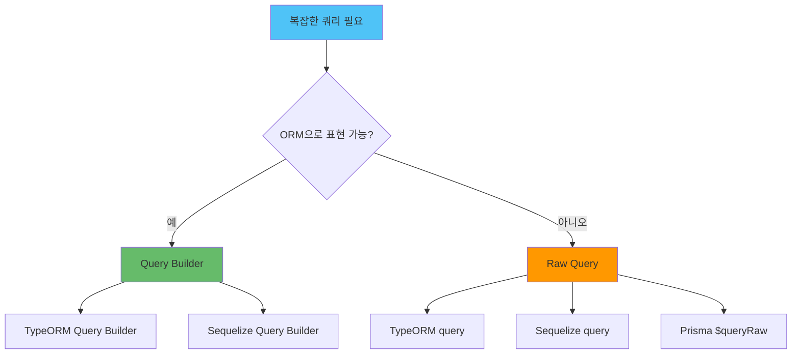

### Raw Query vs Query Builder

**Raw Query 사용 시기:**
- 복잡한 집계 함수나 윈도우 함수 사용
- ORM이 지원하지 않는 데이터베이스 특화 기능
- 성능이 매우 중요한 경우
- 기존 SQL 쿼리를 그대로 활용

**Query Builder 사용 시기:**
- 동적 쿼리 생성이 필요한 경우
- 조건부 WHERE 절 구성
- 타입 안정성을 유지하고 싶은 경우
- ORM의 기능을 최대한 활용하고 싶은 경우

**보안 고려사항:**
- Raw Query 사용 시 SQL Injection 방지를 위해 파라미터화된 쿼리 사용
- 사용자 입력은 절대 직접 쿼리에 포함하지 않음
- Query Builder는 자동으로 파라미터화 처리

## 관계형 데이터 모델링

### 관계 타입

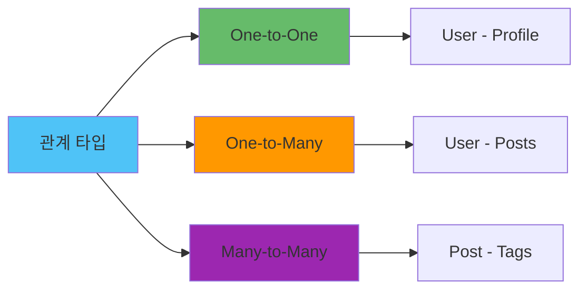

### One-to-One 관계

```typescript
// TypeORM
@Entity('profiles')
export class Profile {
  @PrimaryGeneratedColumn('uuid')
  id: string;

  @Column({ type: 'text', nullable: true })
  bio: string;

  @OneToOne(() => User, user => user.profile)
  @JoinColumn()
  user: User;
}

@Entity('users')
export class User {
  @OneToOne(() => Profile, profile => profile.user)
  profile: Profile;
}
```

### Many-to-Many 관계

```typescript
// TypeORM
@Entity('post_tags')
export class PostTag {
  @PrimaryColumn()
  postId: string;

  @PrimaryColumn()
  tagId: string;

  @ManyToOne(() => Post, post => post.postTags)
  post: Post;

  @ManyToOne(() => Tag, tag => tag.postTags)
  tag: Tag;
}

@Entity('posts')
export class Post {
  @ManyToMany(() => Tag, tag => tag.posts)
  @JoinTable({
    name: 'post_tags',
    joinColumn: { name: 'post_id', referencedColumnName: 'id' },
    inverseJoinColumn: { name: 'tag_id', referencedColumnName: 'id' }
  })
  tags: Tag[];
}
```

## 실전 ORM 설정

프로덕션 환경에서 ORM을 설정할 때는 성능, 안정성, 보안을 모두 고려해야 합니다.

**프로덕션 ORM 설정 체크리스트:**

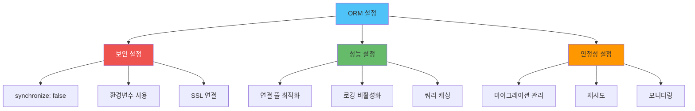

**주요 설정 항목:**

**보안 설정:**
- **synchronize**: 프로덕션에서는 반드시 false (자동 스키마 변경 방지)
- **인증 정보**: 환경변수로 관리, 절대 하드코딩 금지
- **SSL 연결**: 프로덕션 데이터베이스는 SSL 필수

**성능 설정:**
- **연결 풀**: 최대/최소 크기 적절히 설정
- **로깅**: 프로덕션에서는 비활성화 (성능 오버헤드)
- **쿼리 캐싱**: 가능한 경우 활성화

**안정성 설정:**
- **마이그레이션**: 자동 실행 비활성화, 수동 관리
- **재시도**: 연결 실패 시 재시도 로직
- **모니터링**: 연결 상태 및 쿼리 성능 모니터링
    connectionTimeoutMillis: 2000
  }
});

// 서비스 레이어
class UserService {
  async createUserWithPosts(userData: CreateUserDto, postsData: CreatePostDto[]) {
    const queryRunner = AppDataSource.createQueryRunner();
    await queryRunner.connect();
    await queryRunner.startTransaction();

    try {
      const user = await queryRunner.manager.save(User, userData);
      
      const posts = await Promise.all(
        postsData.map(postData => 
          queryRunner.manager.save(Post, {
            ...postData,
            authorId: user.id
          })
        )
      );

      await queryRunner.commitTransaction();
      return { user, posts };
    } catch (error) {
      await queryRunner.rollbackTransaction();
      throw error;
    } finally {
      await queryRunner.release();
    }
  }

  async getUserWithPosts(userId: string) {
    return await AppDataSource
      .getRepository(User)
      .findOne({
        where: { id: userId },
        relations: ['posts'],
        select: ['id', 'name', 'email', 'createdAt']
      });
  }
}
```

## 실전 통합: ORM + 연결 풀 + 캐싱

실무에서는 ORM을 단독으로 사용하기보다는 연결 풀과 캐싱을 함께 활용하여 성능과 안정성을 확보합니다.

**통합 아키텍처:**

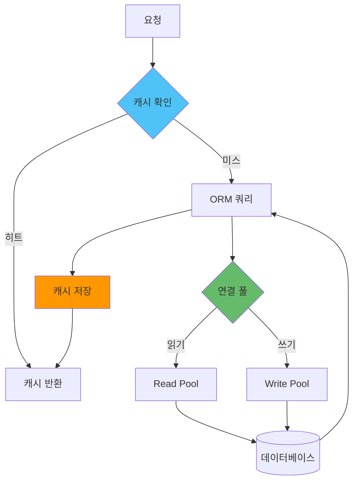

**통합 방법:**

**1. 캐싱 + ORM:**
- 조회 쿼리 결과를 캐시에 저장하여 반복 조회 성능 향상
- 캐시 키는 리소스 타입과 ID를 조합하여 구성 (예: `user:123`)
- TTL(Time To Live)을 설정하여 데이터 신선도 유지 (일반적으로 1시간)

**2. 트랜잭션 + 캐시 무효화:**
- 데이터 변경 시 관련 캐시를 즉시 무효화
- 트랜잭션 커밋 후 캐시 무효화를 수행하여 일관성 보장
- 와일드카드를 사용하여 관련 캐시를 일괄 무효화 (예: `user:list:*`)

**3. N+1 문제 해결 + 캐싱:**
- JOIN 쿼리로 N+1 문제를 해결하고 결과를 캐시
- 여러 리소스 ID를 조합한 캐시 키 사용 (예: `users:posts:123,456,789`)
- 관계 데이터까지 포함하여 캐싱하여 추가 쿼리 방지

**4. Read/Write 분리:**
- 읽기 작업은 Read Pool 사용 (복제본 데이터베이스)
- 쓰기 작업은 Write Pool 사용 (마스터 데이터베이스)
- 부하 분산과 가용성 향상

**실무 운영 고려사항:**
- 캐시와 데이터베이스 간의 일관성 관리가 중요합니다
- 캐시 무효화를 명확히 수립하여 stale 데이터 방지
- 연결 풀 크기와 캐시 TTL의 균형을 모니터링하여 조정

## 트러블슈팅 가이드

### 일반적인 ORM 문제와 해결책

**문제 해결 플로우차트:**

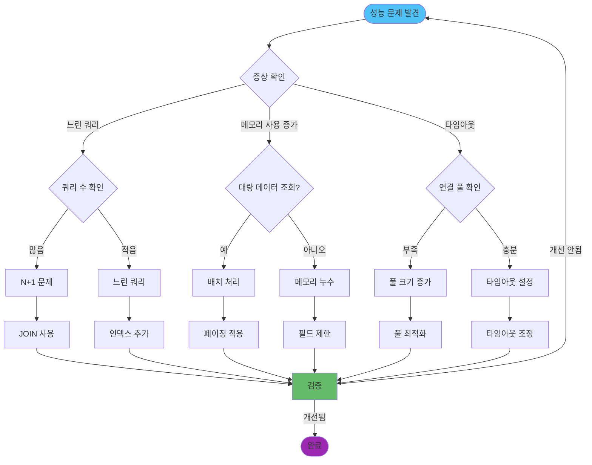

### 일반적인 문제와 해결책

**1. N+1 쿼리 문제:**

| 증상 | 원인 | 해결 방법 |
|------|------|----------|
| 쿼리 수가 데이터 수만큼 증가 | 루프 내에서 개별 쿼리 실행 | JOIN 또는 Include 사용 |
| 응답 시간이 데이터 수에 비례 | 반복적인 데이터베이스 접근 | Eager Loading 적용 |
| 데이터베이스 부하 증가 | 불필요한 쿼리 반복 | 배치 조회로 통합 |

**2. 느린 쿼리:**

| 증상 | 원인 | 해결 방법 |
|------|------|----------|
| 단일 쿼리 실행 시간이 길음 | 인덱스 부재 | 적절한 인덱스 추가 |
| 전체 테이블 스캔 | WHERE 조건 최적화 부족 | 쿼리 조건 최적화 |
| 대량 데이터 조회 | 불필요한 데이터 로드 | Select 필드 제한, 페이징 |

**3. 메모리 문제:**

| 증상 | 원인 | 해결 방법 |
|------|------|----------|
| 메모리 사용량 지속 증가 | 대량 데이터를 한 번에 로드 | 페이징 또는 스트리밍 |
| 힙 메모리 부족 | 불필요한 필드 로드 | Select로 필요한 필드만 조회 |
| GC 빈도 증가 | 큰 객체 반복 생성 | 데이터 변환 최소화 |

**4. 연결 풀 문제:**

| 증상 | 원인 | 해결 방법 |
|------|------|----------|
| 연결 타임아웃 | 풀 크기 부족 | 풀 크기 증가 |
| 연결 누수 | 연결 해제 누락 | try-finally로 보장 |
| 데드락 발생 | 트랜잭션 시간 과다 | 트랜잭션 범위 최소화 |

## 고급 활용

### 주의사항

**1. ORM 선택 우선순위:**

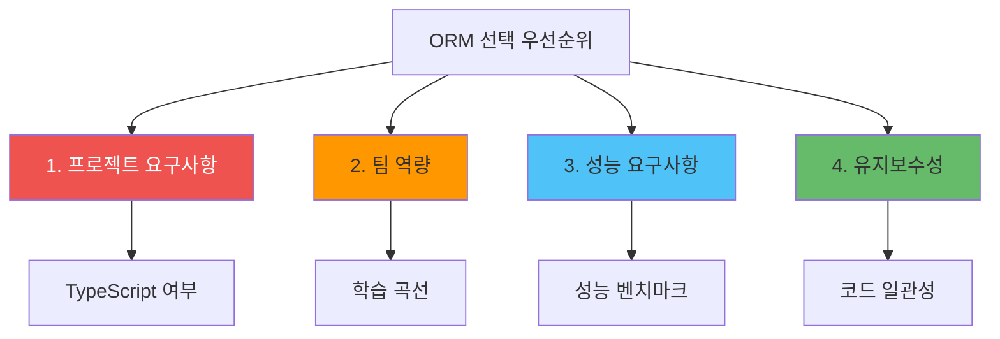

**2. 비용 고려사항:**

- **개발 비용**: ORM 학습 및 도입 시간
- **운영 비용**: 쿼리 최적화 및 성능 튜닝 시간
- **인프라 비용**: ORM 오버헤드로 인한 추가 리소스
- **유지보수 비용**: 마이그레이션 관리 및 스키마 변경

**3. 팀 협업 관점:**

- **코드 일관성**: ORM 패턴을 팀 전체가 공유
- **코드 리뷰**: N+1 문제, 성능 이슈를 리뷰에서 체크
- **문서화**: 복잡한 쿼리와 트랜잭션 로직 문서화
- **지식 공유**: ORM 최적화 경험과 노하우 공유

**4. 실무에서 자주 놓치는 부분:**

- **인덱스 관리**: ORM으로 생성한 인덱스의 실제 효과 측정 부족
- **쿼리 로깅**: 프로덕션에서 쿼리 로깅을 비활성화하여 문제 파악 어려움
- **트랜잭션 범위**: 불필요하게 넓은 트랜잭션 범위로 데드락 발생
- **마이그레이션 검증**: 마이그레이션을 스테이징 환경에서 충분히 테스트하지 않음

**5. 아키텍처 패턴 선택 기준:**

| 패턴 | 사용 시기 | 트레이드오프 |
|------|----------|------------|
| **Repository 패턴** | 복잡한 비즈니스 로직 | 추상화 오버헤드 vs 유지보수성 |
| **Active Record** | 간단한 CRUD | 편의성 vs 유연성 |
| **Data Mapper** | 복잡한 도메인 모델 | 복잡도 vs 명확성 |
| **Unit of Work** | 복잡한 트랜잭션 | 메모리 사용 vs 일관성 |

## 요약
ORM은 개발 생산성을 크게 향상시키지만, 올바르게 사용하지 않으면 성능 문제가 발생할 수 있습니다.

### 주요 내용

- **ORM 선택**: 프로젝트 요구사항에 맞는 ORM 선택
- **성능 최적화**: N+1 문제 해결, 인덱스 활용, Select 최적화
- **트랜잭션 관리**: 데이터 일관성 보장
- **마이그레이션**: 스키마 버전 관리
- **복잡한 쿼리**: Raw Query와 Query Builder 활용

### 선택 가이드

**TypeORM을 선택해야 하는 경우:**
- TypeScript 프로젝트
- 데코레이터 기반 설계 선호
- 복잡한 쿼리가 많은 경우

**Sequelize를 선택해야 하는 경우:**
- JavaScript 프로젝트
- 낮은 학습 곡선
- 안정적인 커뮤니티 지원 필요

**Prisma를 선택해야 하는 경우:**
- TypeScript 프로젝트
- 스키마 우선 설계
- 최고의 타입 안정성 필요
- 최신 기능과 성능 중요

### 관련 문서

- [연결 풀 관리](./연결_풀_관리.md) - ORM과 연결 풀 통합
- [캐싱](../캐싱/캐싱_전략.md) - ORM 쿼리 결과 캐싱
- [성능 최적화](../Performance/Node.js_성능_최적화_및_프로파일링.md) - ORM 성능 최적화
- [에러 핸들링](../에러_핸들링/에러_핸들링_전략.md) - 데이터베이스 에러 처리

