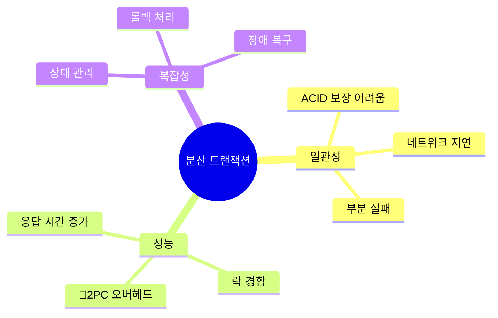
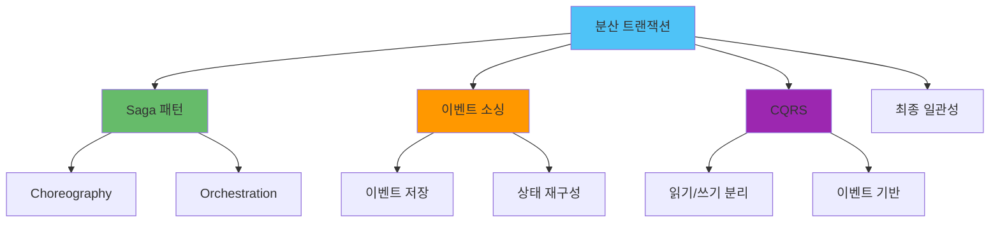
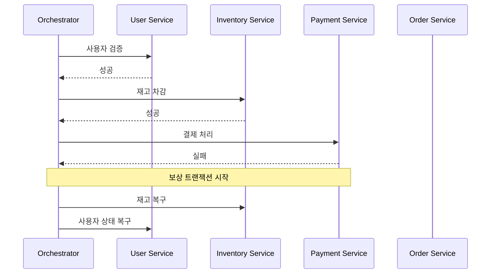
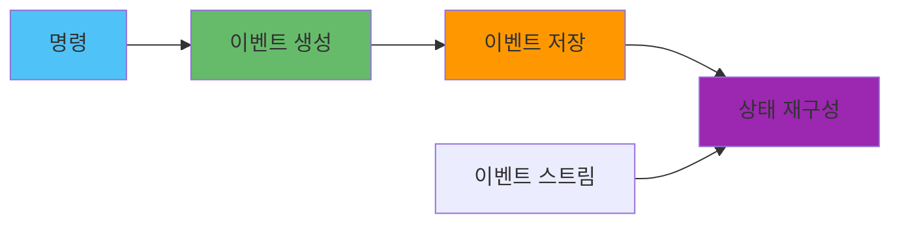
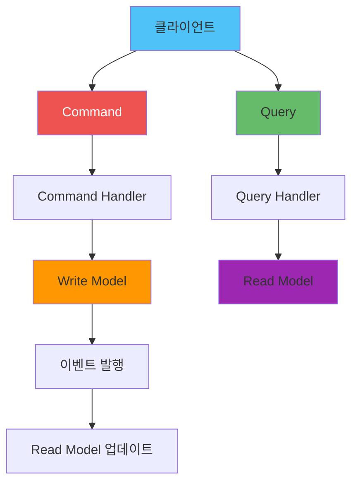
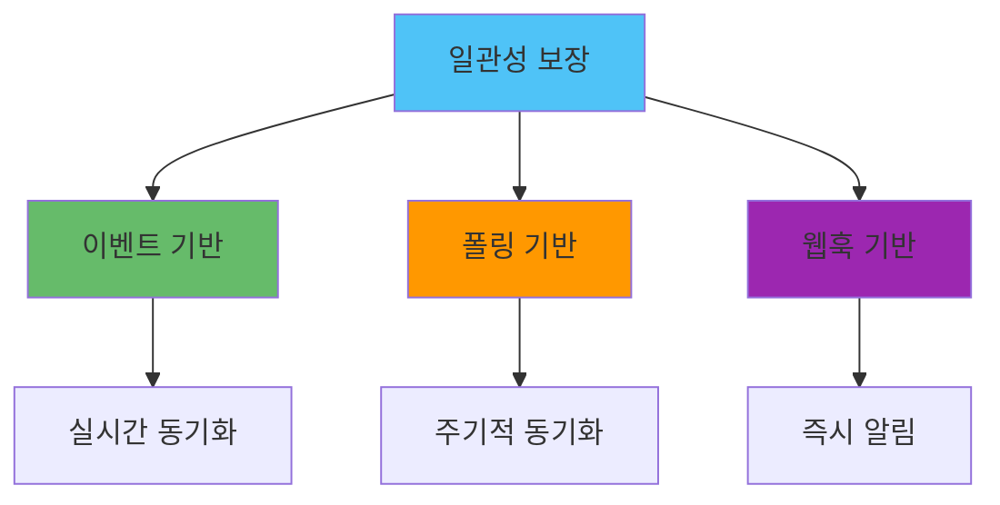

# 🔄 분산 트랜잭션 전략

## 📌 개요

> **분산 트랜잭션**은 여러 서비스나 데이터베이스에 걸쳐 데이터 일관성을 보장하는 복잡한 문제입니다. Node.js 환경에서 실용적인 분산 트랜잭션 패턴을 다룹니다.

### 🎯 분산 트랜잭션의 도전 과제



### 📊 분산 트랜잭션 패턴



## 🎭 Saga 패턴

### Saga 패턴 개요

Saga 패턴은 긴 트랜잭션을 여러 작은 트랜잭션으로 분할하고, 각 단계마다 보상(Compensating) 트랜잭션을 정의하는 패턴입니다.



### Orchestration 패턴

#### Saga Orchestrator 구현

```javascript
class SagaOrchestrator {
  constructor() {
    this.sagas = new Map();
    this.executions = new Map();
  }
  
  // Saga 정의
  defineSaga(name, steps) {
    this.sagas.set(name, {
      steps,
      compensations: new Map()
    });
  }
  
  // Saga 실행
  async execute(sagaName, initialData) {
    const saga = this.sagas.get(sagaName);
    if (!saga) {
      throw new Error(`Saga ${sagaName} not found`);
    }
    
    const executionId = this.generateExecutionId();
    const execution = {
      id: executionId,
      sagaName,
      steps: [],
      currentStep: 0,
      data: initialData,
      status: 'running'
    };
    
    this.executions.set(executionId, execution);
    
    try {
      // 각 단계 실행
      for (let i = 0; i < saga.steps.length; i++) {
        execution.currentStep = i;
        const step = saga.steps[i];
        
        const result = await this.executeStep(step, execution.data);
        execution.steps.push({
          step: step.name,
          result,
          completed: true
        });
        
        // 결과를 다음 단계로 전달
        execution.data = { ...execution.data, ...result };
      }
      
      execution.status = 'completed';
      return execution;
    } catch (error) {
      execution.status = 'failed';
      execution.error = error.message;
      
      // 보상 트랜잭션 실행
      await this.compensate(executionId);
      
      throw error;
    }
  }
  
  // 단계 실행
  async executeStep(step, data) {
    try {
      const result = await step.action(data);
      return result;
    } catch (error) {
      throw new Error(`Step ${step.name} failed: ${error.message}`);
    }
  }
  
  // 보상 트랜잭션
  async compensate(executionId) {
    const execution = this.executions.get(executionId);
    if (!execution) return;
    
    const saga = this.sagas.get(execution.sagaName);
    
    // 역순으로 보상 실행
    for (let i = execution.currentStep; i >= 0; i--) {
      const step = saga.steps[i];
      if (step.compensate && execution.steps[i]?.completed) {
        try {
          await step.compensate(execution.data);
          console.log(`Compensated step: ${step.name}`);
        } catch (error) {
          console.error(`Compensation failed for ${step.name}:`, error);
        }
      }
    }
    
    execution.status = 'compensated';
  }
  
  generateExecutionId() {
    return `saga-${Date.now()}-${Math.random().toString(36).substr(2, 9)}`;
  }
}

// 주문 생성 Saga 정의
const orchestrator = new SagaOrchestrator();

orchestrator.defineSaga('createOrder', [
  {
    name: 'validateUser',
    action: async (data) => {
      const user = await userService.getUser(data.userId);
      if (!user || user.status !== 'active') {
        throw new Error('Invalid user');
      }
      return { user };
    },
    compensate: async (data) => {
      // 사용자 검증은 보상 불필요
    }
  },
  {
    name: 'reserveInventory',
    action: async (data) => {
      const reservation = await inventoryService.reserve(data.items);
      return { reservationId: reservation.id };
    },
    compensate: async (data) => {
      await inventoryService.release(data.reservationId);
    }
  },
  {
    name: 'processPayment',
    action: async (data) => {
      const payment = await paymentService.charge({
        userId: data.userId,
        amount: data.total
      });
      return { paymentId: payment.id };
    },
    compensate: async (data) => {
      await paymentService.refund(data.paymentId);
    }
  },
  {
    name: 'createOrder',
    action: async (data) => {
      const order = await orderService.create({
        userId: data.userId,
        items: data.items,
        reservationId: data.reservationId,
        paymentId: data.paymentId
      });
      return { orderId: order.id };
    },
    compensate: async (data) => {
      await orderService.cancel(data.orderId);
    }
  }
]);

// Saga 실행
const result = await orchestrator.execute('createOrder', {
  userId: '123',
  items: [{ productId: '1', quantity: 2 }],
  total: 10000
});
```

### Choreography 패턴

#### 이벤트 기반 Saga

```javascript
class SagaChoreography {
  constructor(eventBus) {
    this.eventBus = eventBus;
    this.sagaState = new Map();
    this.setupEventHandlers();
  }
  
  setupEventHandlers() {
    // 주문 생성 이벤트
    this.eventBus.subscribe('order.create.initiated', async (event) => {
      const sagaId = event.data.sagaId;
      this.sagaState.set(sagaId, {
        status: 'started',
        steps: []
      });
      
      // 사용자 검증 이벤트 발행
      await this.eventBus.publish('user.validate.requested', {
        sagaId,
        userId: event.data.userId
      });
    });
    
    // 사용자 검증 완료
    this.eventBus.subscribe('user.validate.completed', async (event) => {
      const sagaId = event.data.sagaId;
      this.updateSagaState(sagaId, 'userValidated', event.data);
      
      // 재고 예약 이벤트 발행
      await this.eventBus.publish('inventory.reserve.requested', {
        sagaId,
        items: event.data.items
      });
    });
    
    // 재고 예약 완료
    this.eventBus.subscribe('inventory.reserve.completed', async (event) => {
      const sagaId = event.data.sagaId;
      this.updateSagaState(sagaId, 'inventoryReserved', event.data);
      
      // 결제 처리 이벤트 발행
      await this.eventBus.publish('payment.process.requested', {
        sagaId,
        userId: event.data.userId,
        amount: event.data.total
      });
    });
    
    // 결제 처리 완료
    this.eventBus.subscribe('payment.process.completed', async (event) => {
      const sagaId = event.data.sagaId;
      this.updateSagaState(sagaId, 'paymentProcessed', event.data);
      
      // 주문 생성 이벤트 발행
      await this.eventBus.publish('order.create.requested', {
        sagaId,
        ...event.data
      });
    });
    
    // 에러 처리
    this.eventBus.subscribe('saga.failed', async (event) => {
      await this.compensate(event.data.sagaId);
    });
  }
  
  updateSagaState(sagaId, step, data) {
    const state = this.sagaState.get(sagaId);
    if (state) {
      state.steps.push({ step, data, timestamp: Date.now() });
    }
  }
  
  async compensate(sagaId) {
    const state = this.sagaState.get(sagaId);
    if (!state) return;
    
    // 역순으로 보상 이벤트 발행
    const steps = state.steps.reverse();
    
    for (const step of steps) {
      if (step.step === 'inventoryReserved') {
        await this.eventBus.publish('inventory.release.requested', {
          sagaId,
          reservationId: step.data.reservationId
        });
      } else if (step.step === 'paymentProcessed') {
        await this.eventBus.publish('payment.refund.requested', {
          sagaId,
          paymentId: step.data.paymentId
        });
      }
    }
  }
}
```

## 📝 이벤트 소싱

### 이벤트 소싱 개념

이벤트 소싱은 상태 변경을 이벤트로 저장하고, 이벤트를 재생하여 현재 상태를 재구성하는 패턴입니다.



### 이벤트 소싱 구현

```javascript
class EventStore {
  constructor() {
    this.events = [];
    this.projections = new Map();
  }
  
  // 이벤트 저장
  async append(streamId, eventType, eventData, expectedVersion = null) {
    const currentVersion = this.getStreamVersion(streamId);
    
    // 낙관적 동시성 제어
    if (expectedVersion !== null && currentVersion !== expectedVersion) {
      throw new Error('Concurrency conflict');
    }
    
    const event = {
      streamId,
      type: eventType,
      data: eventData,
      version: currentVersion + 1,
      timestamp: Date.now(),
      id: this.generateEventId()
    };
    
    this.events.push(event);
    
    // 프로젝션 업데이트
    await this.updateProjections(event);
    
    return event;
  }
  
  // 스트림 조회
  getStream(streamId) {
    return this.events
      .filter(e => e.streamId === streamId)
      .sort((a, b) => a.version - b.version);
  }
  
  // 상태 재구성
  async replay(streamId, initialState = {}) {
    const events = this.getStream(streamId);
    
    return events.reduce((state, event) => {
      return this.applyEvent(state, event);
    }, initialState);
  }
  
  // 이벤트 적용
  applyEvent(state, event) {
    switch (event.type) {
      case 'order.created':
        return {
          ...state,
          id: event.data.orderId,
          status: 'created',
          items: event.data.items
        };
      case 'order.confirmed':
        return {
          ...state,
          status: 'confirmed'
        };
      case 'order.cancelled':
        return {
          ...state,
          status: 'cancelled',
          cancelledAt: event.timestamp
        };
      default:
        return state;
    }
  }
  
  // 프로젝션 등록
  registerProjection(name, handler) {
    this.projections.set(name, handler);
  }
  
  // 프로젝션 업데이트
  async updateProjections(event) {
    for (const [name, handler] of this.projections) {
      await handler(event);
    }
  }
  
  getStreamVersion(streamId) {
    const stream = this.getStream(streamId);
    return stream.length > 0 ? stream[stream.length - 1].version : 0;
  }
  
  generateEventId() {
    return `${Date.now()}-${Math.random().toString(36).substr(2, 9)}`;
  }
}

// 사용 예시
const eventStore = new EventStore();

// 주문 프로젝션
eventStore.registerProjection('order', async (event) => {
  if (event.type === 'order.created') {
    await db.orders.create({
      id: event.streamId,
      ...event.data
    });
  }
});

// 이벤트 저장
await eventStore.append('order-123', 'order.created', {
  orderId: 'order-123',
  userId: 'user-456',
  items: [{ productId: '1', quantity: 2 }],
  total: 10000
});

// 상태 재구성
const orderState = await eventStore.replay('order-123');
```

## 📊 CQRS 패턴

### CQRS 개념

CQRS(Command Query Responsibility Segregation)는 명령(Command)과 조회(Query)를 분리하는 패턴입니다.



### CQRS 구현

```javascript
class CQRSBus {
  constructor(eventStore) {
    this.eventStore = eventStore;
    this.commandHandlers = new Map();
    this.queryHandlers = new Map();
    this.readModels = new Map();
  }
  
  // Command 핸들러 등록
  registerCommand(commandType, handler) {
    this.commandHandlers.set(commandType, handler);
  }
  
  // Query 핸들러 등록
  registerQuery(queryType, handler) {
    this.queryHandlers.set(queryType, handler);
  }
  
  // Command 실행
  async executeCommand(command) {
    const handler = this.commandHandlers.get(command.type);
    if (!handler) {
      throw new Error(`Command handler not found: ${command.type}`);
    }
    
    // Command 처리
    const result = await handler(command.data);
    
    // 이벤트 저장
    if (result.events) {
      for (const event of result.events) {
        await this.eventStore.append(
          command.streamId,
          event.type,
          event.data
        );
      }
    }
    
    return result;
  }
  
  // Query 실행
  async executeQuery(query) {
    const handler = this.queryHandlers.get(query.type);
    if (!handler) {
      throw new Error(`Query handler not found: ${query.type}`);
    }
    
    return await handler(query.data);
  }
  
  // Read Model 등록
  registerReadModel(name, handler) {
    this.readModels.set(name, handler);
    
    // 이벤트 구독
    this.eventStore.registerProjection(name, async (event) => {
      await handler(event);
    });
  }
}

// Command 정의
class CreateOrderCommand {
  constructor(userId, items, total) {
    this.type = 'createOrder';
    this.streamId = `order-${Date.now()}`;
    this.data = { userId, items, total };
  }
}

// Command Handler
async function createOrderHandler(data) {
  // 비즈니스 로직
  const order = {
    id: generateId(),
    userId: data.userId,
    items: data.items,
    total: data.total,
    status: 'created'
  };
  
  // 이벤트 생성
  return {
    order,
    events: [{
      type: 'order.created',
      data: order
    }]
  };
}

// Query 정의
class GetOrderQuery {
  constructor(orderId) {
    this.type = 'getOrder';
    this.data = { orderId };
  }
}

// Query Handler (Read Model에서 조회)
async function getOrderHandler(data) {
  // Read Model에서 조회 (최적화된 쿼리)
  return await readModelDb.orders.findById(data.orderId);
}

// Read Model 업데이트
async function updateOrderReadModel(event) {
  if (event.type === 'order.created') {
    await readModelDb.orders.create({
      id: event.streamId,
      ...event.data,
      createdAt: event.timestamp
    });
  } else if (event.type === 'order.status.changed') {
    await readModelDb.orders.update(event.streamId, {
      status: event.data.status,
      updatedAt: event.timestamp
    });
  }
}

// 사용 예시
const eventStore = new EventStore();
const bus = new CQRSBus(eventStore);

// 핸들러 등록
bus.registerCommand('createOrder', createOrderHandler);
bus.registerQuery('getOrder', getOrderHandler);
bus.registerReadModel('order', updateOrderReadModel);

// Command 실행
const command = new CreateOrderCommand('user-123', [...], 10000);
const result = await bus.executeCommand(command);

// Query 실행
const query = new GetOrderQuery(result.order.id);
const order = await bus.executeQuery(query);
```

## 🔄 최종 일관성 보장

### 최종 일관성 전략



#### 이벤트 기반 동기화

```javascript
class ConsistencyManager {
  constructor(eventBus) {
    this.eventBus = eventBus;
    this.syncState = new Map();
    this.setupSyncHandlers();
  }
  
  setupSyncHandlers() {
    // 주문 생성 이벤트
    this.eventBus.subscribe('order.created', async (event) => {
      // 여러 Read Model 동기화
      await Promise.all([
        this.syncOrderReadModel(event),
        this.syncUserOrderCount(event),
        this.syncInventoryReadModel(event)
      ]);
    });
  }
  
  async syncOrderReadModel(event) {
    await readModelDb.orders.create({
      id: event.data.orderId,
      ...event.data
    });
  }
  
  async syncUserOrderCount(event) {
    await readModelDb.users.incrementOrderCount(event.data.userId);
  }
  
  async syncInventoryReadModel(event) {
    for (const item of event.data.items) {
      await readModelDb.inventory.decreaseStock(
        item.productId,
        item.quantity
      );
    }
  }
}
```

#### 폴링 기반 동기화

```javascript
class PollingSync {
  constructor(sourceDb, targetDb) {
    this.sourceDb = sourceDb;
    this.targetDb = targetDb;
    this.lastSyncTime = Date.now();
  }
  
  async startSync(interval = 5000) {
    setInterval(async () => {
      await this.sync();
    }, interval);
  }
  
  async sync() {
    // 변경된 데이터 조회
    const changes = await this.sourceDb.orders.find({
      updatedAt: { $gt: new Date(this.lastSyncTime) }
    });
    
    // Read Model 동기화
    for (const order of changes) {
      await this.targetDb.orders.upsert({
        id: order.id
      }, order);
    }
    
    this.lastSyncTime = Date.now();
  }
}
```

## 🎯 실전 예제: 완전한 분산 트랜잭션 시스템

```javascript
class DistributedTransactionManager {
  constructor(eventStore, eventBus) {
    this.eventStore = eventStore;
    this.eventBus = eventBus;
    this.sagas = new Map();
    this.cqrsBus = new CQRSBus(eventStore);
  }
  
  // Saga 기반 주문 생성
  async createOrderWithSaga(userId, items, total) {
    const sagaId = `saga-${Date.now()}`;
    
    try {
      // 1. 사용자 검증
      const user = await this.validateUser(userId);
      
      // 2. 재고 예약
      const reservation = await this.reserveInventory(items);
      
      // 3. 결제 처리
      const payment = await this.processPayment(userId, total);
      
      // 4. 주문 생성 (이벤트 저장)
      const order = await this.cqrsBus.executeCommand(
        new CreateOrderCommand(userId, items, total)
      );
      
      return order;
    } catch (error) {
      // 보상 트랜잭션
      await this.compensate(sagaId, error);
      throw error;
    }
  }
  
  async validateUser(userId) {
    const user = await userService.getUser(userId);
    if (!user || user.status !== 'active') {
      throw new Error('Invalid user');
    }
    return user;
  }
  
  async reserveInventory(items) {
    const reservation = await inventoryService.reserve(items);
    return reservation;
  }
  
  async processPayment(userId, amount) {
    const payment = await paymentService.charge(userId, amount);
    return payment;
  }
  
  async compensate(sagaId, error) {
    // 보상 이벤트 발행
    await this.eventBus.publish('saga.compensation.started', {
      sagaId,
      error: error.message
    });
    
    // 각 단계의 보상 실행
    // (구현 생략)
  }
}

// 사용 예시
const manager = new DistributedTransactionManager(eventStore, eventBus);

try {
  const order = await manager.createOrderWithSaga(
    'user-123',
    [{ productId: '1', quantity: 2 }],
    10000
  );
  
  console.log('Order created:', order);
} catch (error) {
  console.error('Transaction failed:', error);
  // 보상 트랜잭션이 자동 실행됨
}
```

## 📝 결론

분산 트랜잭션은 마이크로서비스 아키텍처에서 필수적인 패턴입니다.

### 핵심 포인트

- ✅ **Saga 패턴**: 긴 트랜잭션을 작은 단위로 분할
- ✅ **이벤트 소싱**: 상태 변경을 이벤트로 저장
- ✅ **CQRS**: 명령과 조회 분리로 성능 향상
- ✅ **최종 일관성**: 완벽한 일관성 대신 실용적 접근
- ✅ **보상 트랜잭션**: 실패 시 롤백 대신 보상

### 모범 사례

1. **Saga 선택**: Orchestration (제어) vs Choreography (자율)
2. **이벤트 소싱**: 감사 추적이 중요한 경우
3. **CQRS**: 읽기/쓰기 부하가 다른 경우
4. **최종 일관성**: 실시간 일관성보다 성능이 중요한 경우
5. **보상 전략**: 모든 단계에 보상 로직 정의

### 관련 문서

- [마이크로서비스 통신 패턴](../아키텍처/마이크로서비스_통신_패턴.md) - 서비스 간 통신
- [ORM 심화 전략](./ORM_심화_전략.md) - 트랜잭션 관리
- [에러 핸들링](../에러_핸들링/에러_핸들링_전략.md) - 분산 트랜잭션 에러 처리
- [Observability 전략](../모니터링/Observability_전략.md) - 분산 추적

