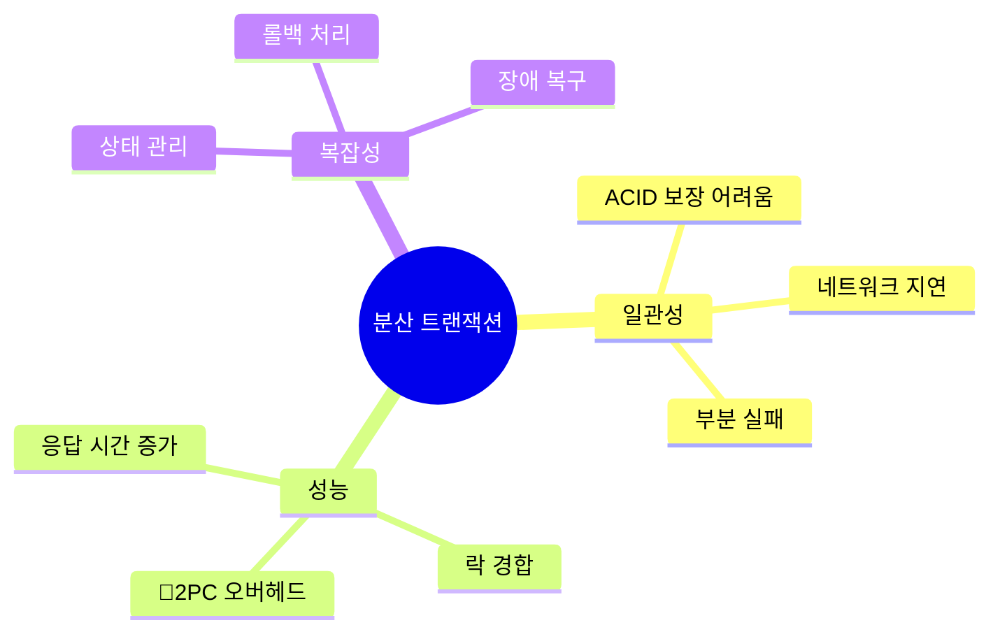
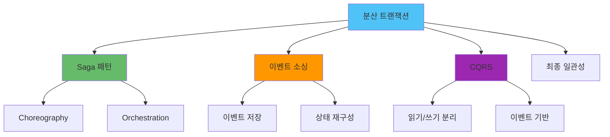
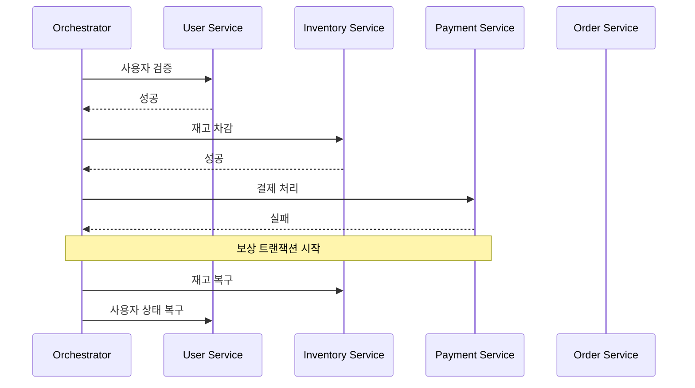
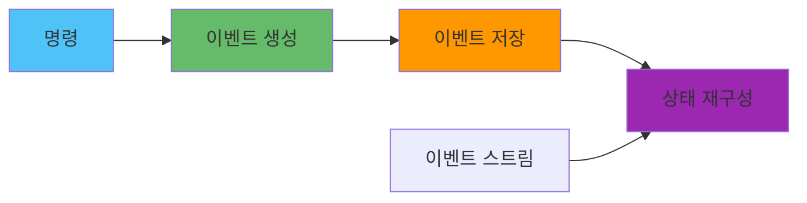
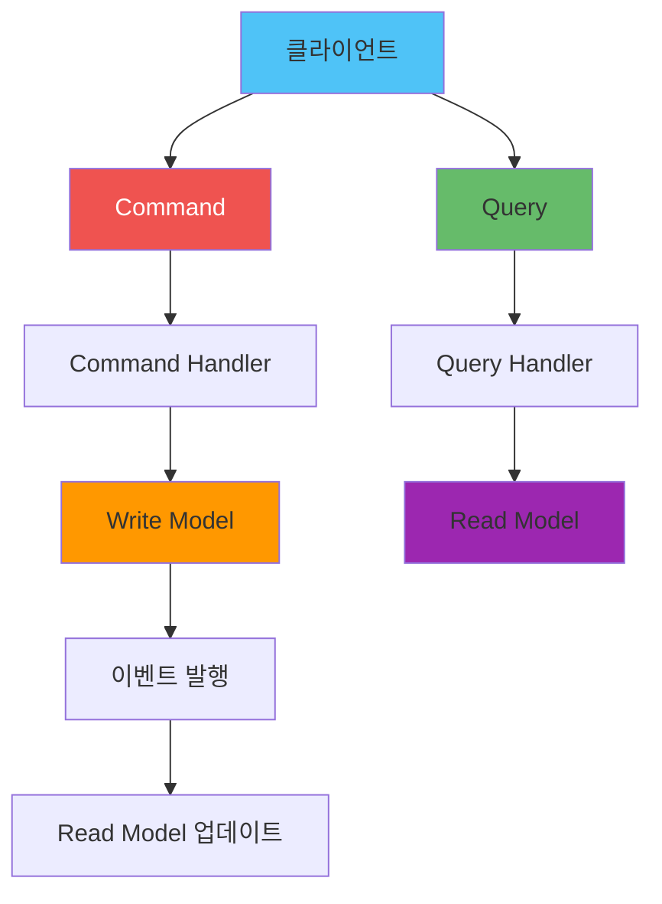
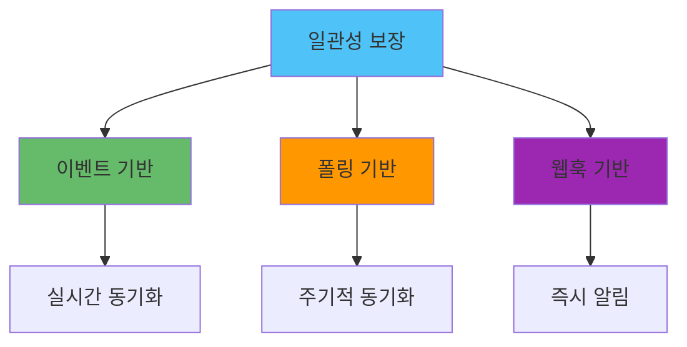

# Node.js 분산 트랜잭션 전략
## 개요

분산 트랜잭션은 여러 서비스나 데이터베이스에 걸쳐 데이터 일관성을 맞춰야 하는 까다로운 문제다. 여기서는 Node.js 환경에서 실제로 쓸 만한 분산 트랜잭션 패턴을 다룬다.

### 분산 트랜잭션이 어려운 이유


```mermaid
mindmap
  root((분산 트랜잭션))
    일관성
      ACID 보장 어려움
      네트워크 지연
      부분 실패
    성능
      2PC 오버헤드
      락 경합
      응답 시간 증가
    복잡성
      상태 관리
      롤백 처리
      장애 복구
```

### 분산 트랜잭션 패턴


```mermaid
graph TD
    A[분산 트랜잭션] --> B[Saga 패턴]
    A --> C[이벤트 소싱]
    A --> D[CQRS]
    A --> E[최종 일관성]
    
    B --> F[Choreography]
    B --> G[Orchestration]
    
    C --> H[이벤트 저장]
    C --> I[상태 재구성]
    
    D --> J[읽기/쓰기 분리]
    D --> K[이벤트 기반]
    
    style A fill:#4fc3f7
    style B fill:#66bb6a
    style C fill:#ff9800
    style D fill:#9c27b0
```

## Saga 패턴

### Saga 패턴 개요

Saga 패턴은 긴 트랜잭션을 작은 트랜잭션 여러 개로 쪼개고, 단계마다 되돌리는 보상(Compensating) 트랜잭션을 정의한다.


```mermaid
sequenceDiagram
    participant O as Orchestrator
    participant U as User Service
    participant I as Inventory Service
    participant P as Payment Service
    participant O2 as Order Service
    
    O->>U: 사용자 검증
    U-->>O: 성공
    O->>I: 재고 차감
    I-->>O: 성공
    O->>P: 결제 처리
    P-->>O: 실패
    
    Note over O,P: 보상 트랜잭션 시작
    O->>I: 재고 복구
    O->>U: 사용자 상태 복구
```

### Orchestration 패턴

#### Saga Orchestrator 구현

```javascript
class SagaOrchestrator {
  constructor() {
    this.sagas = new Map();
    this.executions = new Map();
  }
  
  // Saga 정의
  defineSaga(name, steps) {
    this.sagas.set(name, {
      steps,
      compensations: new Map()
    });
  }
  
  // Saga 실행
  async execute(sagaName, initialData) {
    const saga = this.sagas.get(sagaName);
    if (!saga) {
      throw new Error(`Saga ${sagaName} not found`);
    }
    
    const executionId = this.generateExecutionId();
    const execution = {
      id: executionId,
      sagaName,
      steps: [],
      currentStep: 0,
      data: initialData,
      status: 'running'
    };
    
    this.executions.set(executionId, execution);
    
    try {
      // 각 단계 실행
      for (let i = 0; i < saga.steps.length; i++) {
        execution.currentStep = i;
        const step = saga.steps[i];
        
        const result = await this.executeStep(step, execution.data);
        execution.steps.push({
          step: step.name,
          result,
          completed: true
        });
        
        // 결과를 다음 단계로 전달
        execution.data = { ...execution.data, ...result };
      }
      
      execution.status = 'completed';
      return execution;
    } catch (error) {
      execution.status = 'failed';
      execution.error = error.message;
      
      // 보상 트랜잭션 실행
      await this.compensate(executionId);
      
      throw error;
    }
  }
  
  // 단계 실행
  async executeStep(step, data) {
    try {
      const result = await step.action(data);
      return result;
    } catch (error) {
      throw new Error(`Step ${step.name} failed: ${error.message}`);
    }
  }
  
  // 보상 트랜잭션
  async compensate(executionId) {
    const execution = this.executions.get(executionId);
    if (!execution) return;
    
    const saga = this.sagas.get(execution.sagaName);
    
    // 역순으로 보상 실행
    for (let i = execution.currentStep; i >= 0; i--) {
      const step = saga.steps[i];
      if (step.compensate && execution.steps[i]?.completed) {
        try {
          await step.compensate(execution.data);
          console.log(`Compensated step: ${step.name}`);
        } catch (error) {
          console.error(`Compensation failed for ${step.name}:`, error);
        }
      }
    }
    
    execution.status = 'compensated';
  }
  
  generateExecutionId() {
    return `saga-${Date.now()}-${Math.random().toString(36).substr(2, 9)}`;
  }
}

// 주문 생성 Saga 정의
const orchestrator = new SagaOrchestrator();

orchestrator.defineSaga('createOrder', [
  {
    name: 'validateUser',
    action: async (data) => {
      const user = await userService.getUser(data.userId);
      if (!user || user.status !== 'active') {
        throw new Error('Invalid user');
      }
      return { user };
    },
    compensate: async (data) => {
      // 사용자 검증은 보상 불필요
    }
  },
  {
    name: 'reserveInventory',
    action: async (data) => {
      const reservation = await inventoryService.reserve(data.items);
      return { reservationId: reservation.id };
    },
    compensate: async (data) => {
      await inventoryService.release(data.reservationId);
    }
  },
  {
    name: 'processPayment',
    action: async (data) => {
      const payment = await paymentService.charge({
        userId: data.userId,
        amount: data.total
      });
      return { paymentId: payment.id };
    },
    compensate: async (data) => {
      await paymentService.refund(data.paymentId);
    }
  },
  {
    name: 'createOrder',
    action: async (data) => {
      const order = await orderService.create({
        userId: data.userId,
        items: data.items,
        reservationId: data.reservationId,
        paymentId: data.paymentId
      });
      return { orderId: order.id };
    },
    compensate: async (data) => {
      await orderService.cancel(data.orderId);
    }
  }
]);

// Saga 실행
const result = await orchestrator.execute('createOrder', {
  userId: '123',
  items: [{ productId: '1', quantity: 2 }],
  total: 10000
});
```

#### 결제가 되고 환불이 안 되는 경로가 열려 있다

`compensate` 는 `execution.steps[i]?.completed` 인 단계만 되돌린다. 실패한 단계는 `steps` 에 기록되지 않으므로 **보상 대상에서 빠진다.** 대부분의 실패에서는 맞는 판단인데, 딱 하나 아닌 경우가 있다 — **요청은 처리됐고 응답만 못 받은 경우**다.

`processPayment` 가 결제사에 요청을 보내 승인까지 났는데 응답이 타임아웃으로 끊기면 이렇게 된다.

```
보상 건너뜀: processPayment          ← completed 가 아니라 제외된다
  inventory.release(R1)
보상 실행: reserveInventory
최종 상태 = compensated              ← 다 되돌렸다고 보고한다
결제 원장 = [{"id":"P1","state":"CHARGED"}]   ← 돈은 빠졌다
data.paymentId = undefined
```

재고는 풀렸고 주문은 없는데 **결제만 남는다.** 게다가 `execution.status` 는 `'compensated'` 라서 모니터링에도 정상 보상으로 잡힌다. 사용자가 카드 명세서를 보고 문의할 때까지 아무도 모른다.

보상은 "성공한 것만 되돌린다"가 아니라 **"시도한 것은 모두 되돌린다"** 로 짜야 한다. 그러려면 두 가지가 필요하다.

- **호출 전에 시도를 기록한다.** `steps.push({ ..., completed: false })` 를 액션 **앞에서** 하고 성공 후에 `completed` 를 올린다. 그러면 실패한 단계도 보상 대상에 남는다.
- **보상이 아무것도 안 되돌려도 안전해야 한다.** 결제가 실제로 안 됐다면 `refund` 는 "그런 결제 없음"을 받고 조용히 끝나야 한다. 그래서 보상 함수에는 대상 ID 대신 **saga 실행 ID 같은 안정된 키**를 넘기고, 상대 서비스가 그 키로 조회해서 처리하게 만드는 편이 낫다. `data.paymentId` 처럼 성공했을 때만 생기는 값에 의존하면 위 경로에서 `undefined` 가 넘어간다.

#### 오케스트레이터가 프로세스 메모리에 산다

`this.executions = new Map()` 이 전부다. 여기서 오는 문제가 세 가지다.

**프로세스가 죽으면 보상이 영영 안 돈다.** 3단계와 4단계 사이에서 배포·OOM·크래시가 나면 진행 중이던 saga 는 흔적 없이 사라진다. 재고는 예약된 채, 결제는 된 채 남고, 다시 뜬 프로세스는 그런 saga 가 있었다는 것조차 모른다. **Saga 오케스트레이터에서 상태 영속화는 선택이 아니다** — 각 단계 전후로 DB 에 기록하고, 기동 시 미완료 saga 를 찾아 이어서 처리하거나 보상해야 한다.

**서버가 여러 대면 아무도 그 saga 를 모른다.** 요청을 받은 인스턴스의 메모리에만 있으므로, 다른 인스턴스는 개입할 수 없다.

**`executions` 는 계속 자란다.** 삭제 경로가 없다. 완료된 saga 도 그대로 쌓인다.

#### 보상 실패를 삼키고 성공했다고 보고한다

```javascript
catch (error) {
  console.error(`Compensation failed for ${step.name}:`, error);
}
...
execution.status = 'compensated';
```

보상이 실패해도 다음 보상으로 넘어가고, 끝나면 무조건 `'compensated'` 를 찍는다. **정합성이 깨진 상태인데 상태값은 정상이다.** 보상 실패는 사람이 개입해야 하는 사건이므로, 별도 상태(`'compensation_failed'`)로 남기고 알림을 보내야 한다. 그리고 실패한 보상은 재시도해야 하는데 — 재시도하면 성공했던 보상이 두 번 실행될 수 있으므로 **보상은 여러 번 실행돼도 결과가 같아야 한다.** 재고를 두 번 풀거나 두 번 환불하지 않으려면 중복 방지 키가 필요하고, 그 키는 saga 실행 ID + 단계 이름으로 만드는 것이 자연스럽다.

Saga 를 도입하면서 함께 떠안는 것이 이 목록이다.

| 항목 | 없으면 생기는 일 |
|---|---|
| 상태 영속화 | 프로세스가 죽으면 정합성이 깨진 채 방치된다 |
| 시도 기록(액션 전) | 응답만 못 받은 호출이 보상에서 빠진다 |
| 보상의 중복 실행 안전성 | 재시도가 이중 환불·이중 복구를 만든다 |
| 보상 실패 상태와 알림 | 깨진 상태를 아무도 모른다 |
| 중간 상태를 표현하는 UI·API | 사용자가 "주문이 됐는지 안 됐는지" 모른다 |

**"2단계 커밋을 안 쓰는 대신 이 다섯 개를 직접 만든다"** 가 Saga 의 실제 값이다. 서비스가 둘뿐이고 한 DB 안에 있다면 그냥 트랜잭션을 쓰는 편이 훨씬 싸다.

### Choreography 패턴

#### 이벤트 기반 Saga

```javascript
class SagaChoreography {
  constructor(eventBus) {
    this.eventBus = eventBus;
    this.sagaState = new Map();
    this.setupEventHandlers();
  }
  
  setupEventHandlers() {
    // 주문 생성 이벤트
    this.eventBus.subscribe('order.create.initiated', async (event) => {
      const sagaId = event.data.sagaId;
      this.sagaState.set(sagaId, {
        status: 'started',
        steps: []
      });
      
      // 사용자 검증 이벤트 발행
      await this.eventBus.publish('user.validate.requested', {
        sagaId,
        userId: event.data.userId
      });
    });
    
    // 사용자 검증 완료
    this.eventBus.subscribe('user.validate.completed', async (event) => {
      const sagaId = event.data.sagaId;
      this.updateSagaState(sagaId, 'userValidated', event.data);
      
      // 재고 예약 이벤트 발행
      await this.eventBus.publish('inventory.reserve.requested', {
        sagaId,
        items: event.data.items
      });
    });
    
    // 재고 예약 완료
    this.eventBus.subscribe('inventory.reserve.completed', async (event) => {
      const sagaId = event.data.sagaId;
      this.updateSagaState(sagaId, 'inventoryReserved', event.data);
      
      // 결제 처리 이벤트 발행
      await this.eventBus.publish('payment.process.requested', {
        sagaId,
        userId: event.data.userId,
        amount: event.data.total
      });
    });
    
    // 결제 처리 완료
    this.eventBus.subscribe('payment.process.completed', async (event) => {
      const sagaId = event.data.sagaId;
      this.updateSagaState(sagaId, 'paymentProcessed', event.data);
      
      // 주문 생성 이벤트 발행
      await this.eventBus.publish('order.create.requested', {
        sagaId,
        ...event.data
      });
    });
    
    // 에러 처리
    this.eventBus.subscribe('saga.failed', async (event) => {
      await this.compensate(event.data.sagaId);
    });
  }
  
  updateSagaState(sagaId, step, data) {
    const state = this.sagaState.get(sagaId);
    if (state) {
      state.steps.push({ step, data, timestamp: Date.now() });
    }
  }
  
  async compensate(sagaId) {
    const state = this.sagaState.get(sagaId);
    if (!state) return;
    
    // 역순으로 보상 이벤트 발행
    const steps = state.steps.reverse();
    
    for (const step of steps) {
      if (step.step === 'inventoryReserved') {
        await this.eventBus.publish('inventory.release.requested', {
          sagaId,
          reservationId: step.data.reservationId
        });
      } else if (step.step === 'paymentProcessed') {
        await this.eventBus.publish('payment.refund.requested', {
          sagaId,
          paymentId: step.data.paymentId
        });
      }
    }
  }
}
```

#### `state.steps.reverse()` 가 상태를 망가뜨린다

`Array.prototype.reverse` 는 새 배열을 만들지 않고 **원본을 그 자리에서 뒤집는다.** `state.steps` 는 사가 상태 그 자체라, 보상이 한 번 돌 때마다 기록된 순서가 영구히 반대가 된다.

```
1차 보상 순서: paymentProcessed → inventoryReserved → userValidated
2차 보상 순서: userValidated → inventoryReserved → paymentProcessed   ← 원래 순서로 돌아옴
```

메시지 브로커는 **최소 한 번(at-least-once) 전달이 기본**이라 `saga.failed` 가 두 번 오는 건 예외 상황이 아니라 정상 동작이다. 그때 보상이 **정방향으로** 실행된다. 결제를 환불하기 전에 재고를 풀거나, 순서 의존성이 있는 보상이 뒤집혀 도는 것이다.

고치는 건 한 글자다.

```javascript
const steps = [...state.steps].reverse();   // 복사본을 뒤집는다
```

다만 이건 증상만 없앤다. **Choreography 사가에서 진짜로 필요한 건 보상의 중복 실행 방지**다. 같은 `sagaId` 의 보상이 이미 시작됐는지 상태로 기록하고, 각 보상 핸들러(재고 해제·환불)도 같은 요청을 두 번 받으면 한 번만 반영해야 한다. 환불이 두 번 나가면 돈이 두 번 나간다.

이 예제에는 그 방어가 전혀 없다. `sagaState` 는 메모리 `Map` 이라 프로세스가 재시작되면 진행 중이던 사가가 통째로 사라지기도 한다. 어느 단계까지 갔는지 아무도 모르게 되므로, 사가 상태는 **영속 저장소에 둬야 한다.**

## 이벤트 소싱

### 이벤트 소싱 개념

이벤트 소싱은 상태 변경을 이벤트로 저장해두고, 그 이벤트를 재생해서 현재 상태를 다시 만들어내는 패턴이다.


```mermaid
graph LR
    A[명령] --> B[이벤트 생성]
    B --> C[이벤트 저장]
    C --> D[상태 재구성]
    
    E[이벤트 스트림] --> D
    
    style A fill:#4fc3f7
    style B fill:#66bb6a
    style C fill:#ff9800
    style D fill:#9c27b0
```

### 이벤트 소싱 구현

```javascript
class EventStore {
  constructor() {
    this.events = [];
    this.projections = new Map();
  }
  
  // 이벤트 저장
  async append(streamId, eventType, eventData, expectedVersion = null) {
    const currentVersion = this.getStreamVersion(streamId);
    
    // 낙관적 동시성 제어
    if (expectedVersion !== null && currentVersion !== expectedVersion) {
      throw new Error('Concurrency conflict');
    }
    
    const event = {
      streamId,
      type: eventType,
      data: eventData,
      version: currentVersion + 1,
      timestamp: Date.now(),
      id: this.generateEventId()
    };
    
    this.events.push(event);
    
    // 프로젝션 업데이트
    await this.updateProjections(event);
    
    return event;
  }
  
  // 스트림 조회
  getStream(streamId) {
    return this.events
      .filter(e => e.streamId === streamId)
      .sort((a, b) => a.version - b.version);
  }
  
  // 상태 재구성
  async replay(streamId, initialState = {}) {
    const events = this.getStream(streamId);
    
    return events.reduce((state, event) => {
      return this.applyEvent(state, event);
    }, initialState);
  }
  
  // 이벤트 적용
  applyEvent(state, event) {
    switch (event.type) {
      case 'order.created':
        return {
          ...state,
          id: event.data.orderId,
          status: 'created',
          items: event.data.items
        };
      case 'order.confirmed':
        return {
          ...state,
          status: 'confirmed'
        };
      case 'order.cancelled':
        return {
          ...state,
          status: 'cancelled',
          cancelledAt: event.timestamp
        };
      default:
        return state;
    }
  }
  
  // 프로젝션 등록
  registerProjection(name, handler) {
    this.projections.set(name, handler);
  }
  
  // 프로젝션 업데이트
  async updateProjections(event) {
    for (const [name, handler] of this.projections) {
      await handler(event);
    }
  }
  
  getStreamVersion(streamId) {
    const stream = this.getStream(streamId);
    return stream.length > 0 ? stream[stream.length - 1].version : 0;
  }
  
  generateEventId() {
    return `${Date.now()}-${Math.random().toString(36).substr(2, 9)}`;
  }
}

// 사용 예시
const eventStore = new EventStore();

// 주문 프로젝션
eventStore.registerProjection('order', async (event) => {
  if (event.type === 'order.created') {
    await db.orders.create({
      id: event.streamId,
      ...event.data
    });
  }
});

// 이벤트 저장
await eventStore.append('order-123', 'order.created', {
  orderId: 'order-123',
  userId: 'user-456',
  items: [{ productId: '1', quantity: 2 }],
  total: 10000
});

// 상태 재구성
const orderState = await eventStore.replay('order-123');
```

## CQRS 패턴

### CQRS 개념

CQRS(Command Query Responsibility Segregation)는 명령(Command)과 조회(Query)를 분리하는 패턴이다.


```mermaid
graph TD
    A[클라이언트] --> B[Command]
    A --> C[Query]
    
    B --> D[Command Handler]
    C --> E[Query Handler]
    
    D --> F[Write Model]
    E --> G[Read Model]
    
    F --> H[이벤트 발행]
    H --> I[Read Model 업데이트]
    
    style A fill:#4fc3f7
    style B fill:#ef5350,color:#fff
    style C fill:#66bb6a
    style F fill:#ff9800
    style G fill:#9c27b0
```

### CQRS 구현

```javascript
class CQRSBus {
  constructor(eventStore) {
    this.eventStore = eventStore;
    this.commandHandlers = new Map();
    this.queryHandlers = new Map();
    this.readModels = new Map();
  }
  
  // Command 핸들러 등록
  registerCommand(commandType, handler) {
    this.commandHandlers.set(commandType, handler);
  }
  
  // Query 핸들러 등록
  registerQuery(queryType, handler) {
    this.queryHandlers.set(queryType, handler);
  }
  
  // Command 실행
  async executeCommand(command) {
    const handler = this.commandHandlers.get(command.type);
    if (!handler) {
      throw new Error(`Command handler not found: ${command.type}`);
    }
    
    // Command 처리
    const result = await handler(command.data);
    
    // 이벤트 저장
    if (result.events) {
      for (const event of result.events) {
        await this.eventStore.append(
          command.streamId,
          event.type,
          event.data
        );
      }
    }
    
    return result;
  }
  
  // Query 실행
  async executeQuery(query) {
    const handler = this.queryHandlers.get(query.type);
    if (!handler) {
      throw new Error(`Query handler not found: ${query.type}`);
    }
    
    return await handler(query.data);
  }
  
  // Read Model 등록
  registerReadModel(name, handler) {
    this.readModels.set(name, handler);
    
    // 이벤트 구독
    this.eventStore.registerProjection(name, async (event) => {
      await handler(event);
    });
  }
}

// Command 정의
class CreateOrderCommand {
  constructor(userId, items, total) {
    this.type = 'createOrder';
    this.streamId = `order-${Date.now()}`;
    this.data = { userId, items, total };
  }
}

// Command Handler
async function createOrderHandler(data) {
  // 비즈니스 로직
  const order = {
    id: generateId(),
    userId: data.userId,
    items: data.items,
    total: data.total,
    status: 'created'
  };
  
  // 이벤트 생성
  return {
    order,
    events: [{
      type: 'order.created',
      data: order
    }]
  };
}

// Query 정의
class GetOrderQuery {
  constructor(orderId) {
    this.type = 'getOrder';
    this.data = { orderId };
  }
}

// Query Handler (Read Model에서 조회)
async function getOrderHandler(data) {
  // Read Model에서 조회 (최적화된 쿼리)
  return await readModelDb.orders.findById(data.orderId);
}

// Read Model 업데이트
async function updateOrderReadModel(event) {
  if (event.type === 'order.created') {
    await readModelDb.orders.create({
      id: event.streamId,
      ...event.data,
      createdAt: event.timestamp
    });
  } else if (event.type === 'order.status.changed') {
    await readModelDb.orders.update(event.streamId, {
      status: event.data.status,
      updatedAt: event.timestamp
    });
  }
}

// 사용 예시
const eventStore = new EventStore();
const bus = new CQRSBus(eventStore);

// 핸들러 등록
bus.registerCommand('createOrder', createOrderHandler);
bus.registerQuery('getOrder', getOrderHandler);
bus.registerReadModel('order', updateOrderReadModel);

// Command 실행
const command = new CreateOrderCommand('user-123', [...], 10000);
const result = await bus.executeCommand(command);

// Query 실행
const query = new GetOrderQuery(result.order.id);
const order = await bus.executeQuery(query);
```

#### 이 CQRS 예제는 방금 만든 주문을 못 찾는다

식별자가 **세 군데에서 따로 만들어진다.**

| 위치 | 값 |
|---|---|
| `CreateOrderCommand` | `streamId = order-${Date.now()}` |
| `createOrderHandler` | `order.id = generateId()` |
| `updateOrderReadModel` | Read Model 에 `id: event.streamId` 로 저장 |

마지막 두 줄이 어긋난다. Read Model 은 `streamId` 를 키로 저장했는데, 조회는 `result.order.id` 로 한다.

```
Command 결과의 order.id : generated-abc123
Read Model 에 저장된 id  : order-1700000000000
GetOrderQuery(order.id) 로 찾을 수 있나? false
```

`null` 이 돌아온다. 그런데 이 코드는 어디서도 에러를 내지 않는다 — 명령은 성공하고, 이벤트도 저장되고, Read Model 에도 행이 생긴다. **조회만 조용히 빈손으로 돌아온다.** CQRS 를 처음 붙일 때 "쓰기는 되는데 목록에 안 나온다"로 나타나고, 사람들은 복제 지연을 먼저 의심한다. 실제 원인은 키가 다른 것뿐이다.

**애그리게이트 ID 는 한 곳에서 만들고 끝까지 그것만 쓴다.** 명령을 만들 때 ID 를 정하고, `streamId`·이벤트 데이터·Read Model 키가 모두 같은 값을 가리키게 한다.

한 가지 더, `streamId` 를 `order-${Date.now()}` 로 만드는 것 자체가 위험하다.

```
주문 1000건 생성 시 서로 다른 streamId 개수: 1
```

같은 밀리초에 만들어진 주문들이 **하나의 이벤트 스트림을 공유한다.** 이벤트 소싱에서 스트림이 섞이면 `replay` 가 남의 주문 이벤트까지 적용해 엉뚱한 상태를 만들어낸다. 게다가 낙관적 동시성 검사(`expectedVersion`)도 무의미해진다. ID 는 `crypto.randomUUID()` 처럼 충돌하지 않는 것을 쓴다. 같은 이유로 `EventStore.generateEventId` 의 `Date.now()-랜덤문자열` 조합도 다시 볼 필요가 있다.

## 최종 일관성 보장

### 최종 일관성


```mermaid
graph TD
    A[일관성 보장] --> B[이벤트 기반]
    A --> C[폴링 기반]
    A --> D[웹훅 기반]
    
    B --> E[실시간 동기화]
    C --> F[주기적 동기화]
    D --> G[즉시 알림]
    
    style A fill:#4fc3f7
    style B fill:#66bb6a
    style C fill:#ff9800
    style D fill:#9c27b0
```

#### 이벤트 기반 동기화

```javascript
class ConsistencyManager {
  constructor(eventBus) {
    this.eventBus = eventBus;
    this.syncState = new Map();
    this.setupSyncHandlers();
  }
  
  setupSyncHandlers() {
    // 주문 생성 이벤트
    this.eventBus.subscribe('order.created', async (event) => {
      // 여러 Read Model 동기화
      await Promise.all([
        this.syncOrderReadModel(event),
        this.syncUserOrderCount(event),
        this.syncInventoryReadModel(event)
      ]);
    });
  }
  
  async syncOrderReadModel(event) {
    await readModelDb.orders.create({
      id: event.data.orderId,
      ...event.data
    });
  }
  
  async syncUserOrderCount(event) {
    await readModelDb.users.incrementOrderCount(event.data.userId);
  }
  
  async syncInventoryReadModel(event) {
    for (const item of event.data.items) {
      await readModelDb.inventory.decreaseStock(
        item.productId,
        item.quantity
      );
    }
  }
}
```

#### 폴링 기반 동기화

```javascript
class PollingSync {
  constructor(sourceDb, targetDb) {
    this.sourceDb = sourceDb;
    this.targetDb = targetDb;
    this.lastSyncTime = Date.now();
  }
  
  async startSync(interval = 5000) {
    setInterval(async () => {
      await this.sync();
    }, interval);
  }
  
  async sync() {
    // 변경된 데이터 조회
    const changes = await this.sourceDb.orders.find({
      updatedAt: { $gt: new Date(this.lastSyncTime) }
    });
    
    // Read Model 동기화
    for (const order of changes) {
      await this.targetDb.orders.upsert({
        id: order.id
      }, order);
    }
    
    this.lastSyncTime = Date.now();
  }
}
```

## 실전 예제: 완전한 분산 트랜잭션 시스템

```javascript
class DistributedTransactionManager {
  constructor(eventStore, eventBus) {
    this.eventStore = eventStore;
    this.eventBus = eventBus;
    this.sagas = new Map();
    this.cqrsBus = new CQRSBus(eventStore);
  }
  
  // Saga 기반 주문 생성
  async createOrderWithSaga(userId, items, total) {
    const sagaId = `saga-${Date.now()}`;
    
    try {
      // 1. 사용자 검증
      const user = await this.validateUser(userId);
      
      // 2. 재고 예약
      const reservation = await this.reserveInventory(items);
      
      // 3. 결제 처리
      const payment = await this.processPayment(userId, total);
      
      // 4. 주문 생성 (이벤트 저장)
      const order = await this.cqrsBus.executeCommand(
        new CreateOrderCommand(userId, items, total)
      );
      
      return order;
    } catch (error) {
      // 보상 트랜잭션
      await this.compensate(sagaId, error);
      throw error;
    }
  }
  
  async validateUser(userId) {
    const user = await userService.getUser(userId);
    if (!user || user.status !== 'active') {
      throw new Error('Invalid user');
    }
    return user;
  }
  
  async reserveInventory(items) {
    const reservation = await inventoryService.reserve(items);
    return reservation;
  }
  
  async processPayment(userId, amount) {
    const payment = await paymentService.charge(userId, amount);
    return payment;
  }
  
  async compensate(sagaId, error) {
    // 보상 이벤트 발행
    await this.eventBus.publish('saga.compensation.started', {
      sagaId,
      error: error.message
    });
    
    // 각 단계의 보상 실행
    // (구현 생략)
  }
}

// 사용 예시
const manager = new DistributedTransactionManager(eventStore, eventBus);

try {
  const order = await manager.createOrderWithSaga(
    'user-123',
    [{ productId: '1', quantity: 2 }],
    10000
  );
  
  console.log('Order created:', order);
} catch (error) {
  console.error('Transaction failed:', error);
  // 보상 트랜잭션이 자동 실행됨
}
```

마지막 줄 주석은 사실이 아니다. `compensate()` 는 `saga.compensation.started` 이벤트를 하나 발행하고 끝나며, 그 아래에 `// 각 단계의 보상 실행 (구현 생략)` 이라고 적혀 있다. **보상은 실행되지 않는다.**

이걸 굳이 짚는 이유는, 사가에서 가장 어렵고 가장 자주 생략되는 부분이 정확히 이 자리이기 때문이다. 정상 경로는 순서대로 부르면 되니 금방 만들어진다. 어려운 건 이쪽이다.

- 결제는 성공했는데 **환불 호출이 실패**하면 어떻게 하나 (보상의 보상은 없다 — 재시도 큐와 수동 개입 창구가 필요하다)
- 재고 해제 요청이 **두 번 도착**하면 재고가 두 배로 늘지 않나
- 프로세스가 **보상 도중에 죽으면** 어디까지 했는지 누가 아나

이 셋에 답이 없으면 사가는 "실패했을 때 데이터가 어중간하게 남는" 구조가 된다. 단일 DB 트랜잭션보다 나쁘다. 그래서 **분산 트랜잭션을 도입하기 전에 정말 서비스를 나눠야 하는지부터** 따져보는 게 순서다. 한 DB 안에서 끝낼 수 있으면 `BEGIN`/`COMMIT` 한 줄이 위 모든 문제를 대신한다.

## 요약
분산 트랜잭션은 마이크로서비스 아키텍처에서 빼놓을 수 없는 패턴이다.

### 주요 내용

- **Saga 패턴**: 긴 트랜잭션을 작은 단위로 분할
- **이벤트 소싱**: 상태 변경을 이벤트로 저장
- **CQRS**: 명령과 조회 분리로 성능 향상
- **최종 일관성**: 완벽한 일관성 대신 실용적 접근
- **보상 트랜잭션**: 실패 시 롤백 대신 보상

### 참고

1. **Saga 선택**: Orchestration (제어) vs Choreography (자율)
2. **이벤트 소싱**: 감사 추적이 중요한 경우
3. **CQRS**: 읽기/쓰기 부하가 다른 경우
4. **최종 일관성**: 실시간 일관성보다 성능이 중요한 경우
5. **보상**: 모든 단계에 보상 로직 정의

### 관련 문서

- [마이크로서비스 통신 패턴](../아키텍처/마이크로서비스_통신_패턴.md) - 서비스 간 통신
- [ORM 심화](./ORM_심화_전략.md) - 트랜잭션 관리
- [에러 핸들링](../에러_핸들링/에러_핸들링_전략.md) - 분산 트랜잭션 에러 처리
- [Observability](../모니터링/Observability_전략.md) - 분산 추적

---
이 문서는 [트랜잭션과 동시성 허브](../../../_hub/트랜잭션과_동시성.md)의 일부다.

