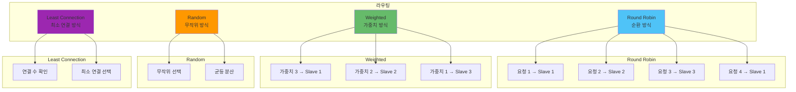

# 데이터베이스 연결 풀 관리

## 개요

연결 풀(Connection Pool)은 데이터베이스 연결을 미리 생성하고 재사용하여 연결 오버헤드를 줄이고 성능을 향상시키는 메커니즘입니다.

### 연결 풀의 목적


### 연결 풀 vs 직접 연결


## 연결 풀 구조

### 연결 풀 아키텍처

연결 풀은 데이터베이스 연결을 효율적으로 관리하는 핵심 메커니즘입니다. 다음 다이어그램은 연결 풀의 전체 구조를 보여줍니다.


### 연결 풀 생명주기

연결이 생성되어 해제되기까지의 전체 생명주기를 이해하는 것이 중요합니다:


### 연결 풀 상태 전이

연결이 다양한 상태를 거치며 전이되는 과정:


### 연결 풀 상태

| 상태 | 설명 | 특징 |
|------|------|------|
| **Active** | 현재 사용 중인 연결 | 쿼리 실행 중 |
| **Idle** | 사용 가능한 연결 | 재사용 대기 |
| **Pending** | 연결 요청 대기 | 풀이 가득 찬 경우 |
| **Closed** | 종료된 연결 | 정리 필요 |

## 연결 풀 설정 및 최적화

### 기본 설정

```javascript
const { Pool } = require('pg');

const pool = new Pool({
  host: process.env.DB_HOST,
  port: process.env.DB_PORT || 5432,
  database: process.env.DB_NAME,
  user: process.env.DB_USER,
  password: process.env.DB_PASSWORD,
  
  // 연결 풀 설정
  max: 20,                    // 최대 연결 수
  min: 5,                     // 최소 연결 수
  idleTimeoutMillis: 30000,   // 유휴 연결 타임아웃 (30초)
  connectionTimeoutMillis: 2000, // 연결 타임아웃 (2초)
  
  // 재시도 설정
  maxUses: 7500,              // 연결 재사용 최대 횟수
  allowExitOnIdle: false      // 유휴 시 종료 허용
});
```

### 최적화된 설정

```javascript
class DatabasePoolManager {
  constructor(config) {
    this.config = {
      // 기본 설정
      ...config,
      
      // 연결 풀 최적화
      max: this.calculateMaxConnections(),
      min: Math.ceil(this.calculateMaxConnections() * 0.25),
      idleTimeoutMillis: 30000,
      connectionTimeoutMillis: 2000,
      
      // 성능 최적화
      statement_timeout: 30000,  // 쿼리 타임아웃
      query_timeout: 30000,
      application_name: 'node-app',
      
      // 모니터링
      log: (msg) => {
        if (process.env.NODE_ENV === 'development') {
          console.log('[DB Pool]', msg);
        }
      }
    };
    
    this.pool = new Pool(this.config);
    this.setupEventHandlers();
  }
  
  // 최대 연결 수 계산 (데이터베이스 제한 고려)
  calculateMaxConnections() {
    const dbMaxConnections = parseInt(process.env.DB_MAX_CONNECTIONS || '100');
    const appInstances = parseInt(process.env.APP_INSTANCES || '1');
    
    // 데이터베이스 최대 연결 수 / 애플리케이션 인스턴스 수
    // 80% 사용 (20% 여유)
    return Math.floor((dbMaxConnections * 0.8) / appInstances);
  }
  
  setupEventHandlers() {
    // 연결 오류 처리
    this.pool.on('error', (err, client) => {
      console.error('Unexpected error on idle client', err);
      // 연결 제거 및 재연결
    });
    
    // 연결 획득 이벤트
    this.pool.on('connect', (client) => {
      console.log('New client connected');
    });
    
    // 연결 제거 이벤트
    this.pool.on('remove', (client) => {
      console.log('Client removed from pool');
    });
  }
  
  async getConnection() {
    try {
      const client = await this.pool.connect();
      return client;
    } catch (error) {
      console.error('Failed to get connection from pool', error);
      throw error;
    }
  }
  
  async query(text, params) {
    const start = Date.now();
    try {
      const result = await this.pool.query(text, params);
      const duration = Date.now() - start;
      
      // 느린 쿼리 로깅
      if (duration > 1000) {
        console.warn('Slow query detected', {
          query: text,
          duration,
          params
        });
      }
      
      return result;
    } catch (error) {
      console.error('Query error', {
        query: text,
        error: error.message
      });
      throw error;
    }
  }
  
  async getPoolStats() {
    return {
      totalCount: this.pool.totalCount,
      idleCount: this.pool.idleCount,
      waitingCount: this.pool.waitingCount
    };
  }
}
```

## 타임아웃 및 재연결

### 타임아웃 설정


#### 타임아웃 구현

```javascript
class ConnectionPoolWithTimeout {
  constructor(config) {
    this.pool = new Pool(config);
    this.connectionTimeout = config.connectionTimeoutMillis || 2000;
    this.queryTimeout = config.queryTimeout || 30000;
  }
  
  async getConnectionWithTimeout() {
    return new Promise((resolve, reject) => {
      const timeout = setTimeout(() => {
        reject(new Error('Connection timeout: Pool is full'));
      }, this.connectionTimeout);
      
      this.pool.connect()
        .then(client => {
          clearTimeout(timeout);
          resolve(client);
        })
        .catch(error => {
          clearTimeout(timeout);
          reject(error);
        });
    });
  }
  
  async queryWithTimeout(text, params) {
    return Promise.race([
      this.pool.query(text, params),
      new Promise((_, reject) => {
        setTimeout(() => {
          reject(new Error('Query timeout'));
        }, this.queryTimeout);
      })
    ]);
  }
}
```

### 재연결

```javascript
class ResilientConnectionPool {
  constructor(config) {
    this.config = config;
    this.pool = null;
    this.reconnectAttempts = 0;
    this.maxReconnectAttempts = 5;
    this.reconnectDelay = 1000;
    
    this.initializePool();
  }
  
  initializePool() {
    this.pool = new Pool(this.config);
    this.setupReconnectHandlers();
  }
  
  setupReconnectHandlers() {
    this.pool.on('error', async (err, client) => {
      console.error('Pool error:', err);
      
      // 연결 오류인 경우 재연결 시도
      if (err.code === 'ECONNREFUSED' || err.code === 'ETIMEDOUT') {
        await this.reconnect();
      }
    });
  }
  
  async reconnect() {
    if (this.reconnectAttempts >= this.maxReconnectAttempts) {
      console.error('Max reconnect attempts reached');
      return;
    }
    
    this.reconnectAttempts++;
    const delay = this.reconnectDelay * Math.pow(2, this.reconnectAttempts - 1);
    
    console.log(`Reconnecting in ${delay}ms (attempt ${this.reconnectAttempts})`);
    
    await new Promise(resolve => setTimeout(resolve, delay));
    
    try {
      // 기존 풀 종료
      await this.pool.end();
      
      // 새 풀 생성
      this.initializePool();
      
      // 연결 테스트
      await this.pool.query('SELECT 1');
      
      console.log('Reconnection successful');
      this.reconnectAttempts = 0;
    } catch (error) {
      console.error('Reconnection failed:', error);
      await this.reconnect();
    }
  }
  
  async healthCheck() {
    try {
      const result = await this.pool.query('SELECT 1');
      return { healthy: true, result };
    } catch (error) {
      return { healthy: false, error: error.message };
    }
  }
}
```

## Read/Write 분리

### Master-Slave 구조

Read/Write 분리는 데이터베이스 부하를 분산하고 성능을 향상시키는 핵심 기법입니다. 다음 다이어그램은 Master-Slave 구조의 전체 아키텍처를 보여줍니다.


### Read/Write 분리 라우팅

Read 쿼리를 여러 Slave에 분산하는 다양한 방법:



### Read/Write 분리 요청 흐름

요청이 어떻게 Write와 Read로 분리되어 처리되는지:


### 실무 운영 시나리오: Read/Write 분리

**시나리오 1: 부하 분산**
- Read 쿼리가 많은 경우 여러 Slave로 분산하여 부하를 줄입니다
- 각 Slave의 성능에 따라 가중치를 조정합니다

**시나리오 2: 고가용성**
- Master 장애 시 자동으로 Slave를 Master로 승격합니다
- Read 쿼리는 계속 처리할 수 있도록 합니다

**시나리오 3: 지리적 분산**
- 지역별로 Slave를 배치하여 지연 시간을 줄입니다
- 사용자 위치에 따라 가장 가까운 Slave로 라우팅합니다

#### Read/Write 분리 구현

```javascript
class ReadWritePoolManager {
  constructor(config) {
    // Master (Write) Pool
    this.masterPool = new Pool({
      ...config.master,
      max: config.master.max || 10,
      min: config.master.min || 2
    });
    
    // Slave (Read) Pools
    this.slavePools = config.slaves.map(slaveConfig => ({
      pool: new Pool({
        ...slaveConfig,
        max: slaveConfig.max || 10,
        min: slaveConfig.min || 2
      }),
      weight: slaveConfig.weight || 1
    }));
    
    this.currentSlaveIndex = 0;
  }
  
  // Write 쿼리 (Master)
  async writeQuery(text, params) {
    return await this.masterPool.query(text, params);
  }
  
  // Read 쿼리 (Slave - Round Robin)
  async readQuery(text, params) {
    if (this.slavePools.length === 0) {
      // Slave가 없으면 Master 사용
      return await this.masterPool.query(text, params);
    }
    
    // Round Robin 방식으로 Slave 선택
    const slave = this.slavePools[this.currentSlaveIndex];
    this.currentSlaveIndex = (this.currentSlaveIndex + 1) % this.slavePools.length;
    
    try {
      return await slave.pool.query(text, params);
    } catch (error) {
      // Slave 실패 시 다른 Slave 시도
      console.error('Slave query failed, trying next slave', error);
      return await this.readQueryWithFallback(text, params);
    }
  }
  
  async readQueryWithFallback(text, params) {
    for (const slave of this.slavePools) {
      try {
        return await slave.pool.query(text, params);
      } catch (error) {
        console.error('Slave query failed', error);
        continue;
      }
    }
    
    // 모든 Slave 실패 시 Master 사용
    console.warn('All slaves failed, using master');
    return await this.masterPool.query(text, params);
  }
  
  // 가중치 기반 Read 쿼리
  async readQueryWithWeight(text, params) {
    if (this.slavePools.length === 0) {
      return await this.masterPool.query(text, params);
    }
    
    // 가중치 기반 선택
    const totalWeight = this.slavePools.reduce((sum, s) => sum + s.weight, 0);
    let random = Math.random() * totalWeight;
    
    for (const slave of this.slavePools) {
      random -= slave.weight;
      if (random <= 0) {
        return await slave.pool.query(text, params);
      }
    }
    
    // Fallback
    return await this.slavePools[0].pool.query(text, params);
  }
}

// 사용 예시
const dbManager = new ReadWritePoolManager({
  master: {
    host: 'master.db.example.com',
    database: 'mydb',
    user: 'user',
    password: 'password'
  },
  slaves: [
    {
      host: 'slave1.db.example.com',
      database: 'mydb',
      user: 'user',
      password: 'password',
      weight: 2
    },
    {
      host: 'slave2.db.example.com',
      database: 'mydb',
      user: 'user',
      password: 'password',
      weight: 1
    }
  ]
});

// Write 쿼리
await dbManager.writeQuery('INSERT INTO users (name, email) VALUES ($1, $2)', ['John', 'john@example.com']);

// Read 쿼리
const users = await dbManager.readQuery('SELECT * FROM users WHERE id = $1', [userId]);
```

## 연결 풀 모니터링

### 모니터링 메트릭


#### 모니터링 구현

```javascript
class PoolMonitor {
  constructor(pool) {
    this.pool = pool;
    this.metrics = {
      totalConnections: 0,
      activeConnections: 0,
      idleConnections: 0,
      waitingRequests: 0,
      queryCount: 0,
      errorCount: 0,
      slowQueries: 0,
      averageQueryTime: 0,
      connectionAcquisitionTime: []
    };
    
    this.startMonitoring();
  }
  
  startMonitoring() {
    // 주기적으로 메트릭 수집
    setInterval(() => {
      this.collectMetrics();
    }, 5000); // 5초마다
    
    // 이벤트 리스너 설정
    this.pool.on('connect', () => {
      this.metrics.totalConnections++;
    });
    
    this.pool.on('acquire', () => {
      this.metrics.activeConnections++;
    });
    
    this.pool.on('release', () => {
      this.metrics.activeConnections--;
      this.metrics.idleConnections++;
    });
  }
  
  collectMetrics() {
    const stats = {
      total: this.pool.totalCount,
      idle: this.pool.idleCount,
      waiting: this.pool.waitingCount,
      active: this.pool.totalCount - this.pool.idleCount
    };
    
    this.metrics.activeConnections = stats.active;
    this.metrics.idleConnections = stats.idle;
    this.metrics.waitingRequests = stats.waiting;
    
    // 메트릭 로깅
    if (process.env.NODE_ENV === 'development') {
      console.log('Pool Metrics:', stats);
    }
    
    // 알림 체크
    this.checkAlerts(stats);
  }
  
  checkAlerts(stats) {
    // 연결 풀 가득 참
    if (stats.waiting > 10) {
      console.warn('WARNING: Pool is full, many requests waiting:', stats.waiting);
    }
    
    // 활성 연결 비율이 높음
    const activeRatio = stats.active / stats.total;
    if (activeRatio > 0.9) {
      console.warn('WARNING: High active connection ratio:', activeRatio);
    }
    
    // 유휴 연결이 없음
    if (stats.idle === 0 && stats.waiting > 0) {
      console.warn('WARNING: No idle connections available');
    }
  }
  
  getMetrics() {
    return {
      ...this.metrics,
      poolStats: {
        total: this.pool.totalCount,
        idle: this.pool.idleCount,
        waiting: this.pool.waitingCount,
        active: this.pool.totalCount - this.pool.idleCount
      }
    };
  }
  
  // 쿼리 성능 추적
  async trackQuery(queryFn) {
    const start = Date.now();
    try {
      const result = await queryFn();
      const duration = Date.now() - start;
      
      this.metrics.queryCount++;
      this.updateAverageQueryTime(duration);
      
      if (duration > 1000) {
        this.metrics.slowQueries++;
      }
      
      return result;
    } catch (error) {
      this.metrics.errorCount++;
      throw error;
    }
  }
  
  updateAverageQueryTime(duration) {
    const currentAvg = this.metrics.averageQueryTime;
    const count = this.metrics.queryCount;
    this.metrics.averageQueryTime = 
      (currentAvg * (count - 1) + duration) / count;
  }
}

// 사용 예시
const pool = new Pool(config);
const monitor = new PoolMonitor(pool);

// 메트릭 조회
app.get('/metrics/pool', (req, res) => {
  res.json(monitor.getMetrics());
});
```

## 장애 대응

### 장애 시나리오


#### Circuit Breaker 패턴

```javascript
class CircuitBreaker {
  constructor(options = {}) {
    this.failureThreshold = options.failureThreshold || 5;
    this.resetTimeout = options.resetTimeout || 60000;
    this.state = 'CLOSED'; // CLOSED, OPEN, HALF_OPEN
    this.failureCount = 0;
    this.nextAttempt = Date.now();
  }
  
  async execute(fn) {
    if (this.state === 'OPEN') {
      if (Date.now() < this.nextAttempt) {
        throw new Error('Circuit breaker is OPEN');
      }
      this.state = 'HALF_OPEN';
    }
    
    try {
      const result = await fn();
      this.onSuccess();
      return result;
    } catch (error) {
      this.onFailure();
      throw error;
    }
  }
  
  onSuccess() {
    this.failureCount = 0;
    this.state = 'CLOSED';
  }
  
  onFailure() {
    this.failureCount++;
    if (this.failureCount >= this.failureThreshold) {
      this.state = 'OPEN';
      this.nextAttempt = Date.now() + this.resetTimeout;
    }
  }
}

// 연결 풀에 Circuit Breaker 적용
class ResilientPool {
  constructor(config) {
    this.pool = new Pool(config);
    this.circuitBreaker = new CircuitBreaker({
      failureThreshold: 5,
      resetTimeout: 60000
    });
  }
  
  async query(text, params) {
    return await this.circuitBreaker.execute(async () => {
      return await this.pool.query(text, params);
    });
  }
}
```

### Graceful Degradation

```javascript
class DegradablePool {
  constructor(config) {
    this.primaryPool = new Pool(config.primary);
    this.fallbackPool = config.fallback ? new Pool(config.fallback) : null;
    this.degraded = false;
  }
  
  async query(text, params) {
    try {
      return await this.primaryPool.query(text, params);
    } catch (error) {
      if (this.fallbackPool) {
        console.warn('Primary pool failed, using fallback', error);
        this.degraded = true;
        return await this.fallbackPool.query(text, params);
      }
      throw error;
    }
  }
  
  async healthCheck() {
    try {
      await this.primaryPool.query('SELECT 1');
      if (this.degraded) {
        this.degraded = false;
        console.log('Primary pool recovered');
      }
      return { healthy: true, degraded: false };
    } catch (error) {
      if (this.fallbackPool) {
        try {
          await this.fallbackPool.query('SELECT 1');
          return { healthy: true, degraded: true };
        } catch (fallbackError) {
          return { healthy: false, error: fallbackError.message };
        }
      }
      return { healthy: false, error: error.message };
    }
  }
}
```

## 실전 예제: 완전한 연결 풀 시스템

```javascript
const { Pool } = require('pg');
const EventEmitter = require('events');

class ProductionReadyPool extends EventEmitter {
  constructor(config) {
    super();
    this.config = config;
    this.masterPool = null;
    this.slavePools = [];
    this.monitor = null;
    this.circuitBreaker = null;
    
    this.initialize();
  }
  
  initialize() {
    // Master Pool
    this.masterPool = new Pool({
      ...this.config.master,
      max: this.calculateMaxConnections('master'),
      min: Math.ceil(this.calculateMaxConnections('master') * 0.25),
      idleTimeoutMillis: 30000,
      connectionTimeoutMillis: 2000
    });
    
    // Slave Pools
    if (this.config.slaves) {
      this.slavePools = this.config.slaves.map(slaveConfig => ({
        pool: new Pool({
          ...slaveConfig,
          max: this.calculateMaxConnections('slave'),
          min: Math.ceil(this.calculateMaxConnections('slave') * 0.25),
          idleTimeoutMillis: 30000,
          connectionTimeoutMillis: 2000
        }),
        weight: slaveConfig.weight || 1
      }));
    }
    
    this.setupEventHandlers();
    this.startMonitoring();
  }
  
  calculateMaxConnections(type) {
    const dbMax = parseInt(process.env.DB_MAX_CONNECTIONS || '100');
    const instances = parseInt(process.env.APP_INSTANCES || '1');
    const poolCount = type === 'master' ? 1 : this.config.slaves?.length || 1;
    
    return Math.floor((dbMax * 0.8) / (instances * poolCount));
  }
  
  setupEventHandlers() {
    [this.masterPool, ...this.slavePools.map(s => s.pool)].forEach(pool => {
      pool.on('error', (err, client) => {
        this.emit('error', err);
        console.error('Pool error:', err);
      });
      
      pool.on('connect', (client) => {
        this.emit('connect', client);
      });
    });
  }
  
  startMonitoring() {
    setInterval(() => {
      const metrics = this.getMetrics();
      this.emit('metrics', metrics);
      
      // 알림 체크
      if (metrics.master.waiting > 10) {
        this.emit('alert', {
          type: 'pool_full',
          message: 'Master pool is full',
          metrics
        });
      }
    }, 5000);
  }
  
  async writeQuery(text, params) {
    try {
      const start = Date.now();
      const result = await this.masterPool.query(text, params);
      const duration = Date.now() - start;
      
      if (duration > 1000) {
        this.emit('slow_query', { query: text, duration });
      }
      
      return result;
    } catch (error) {
      this.emit('query_error', { query: text, error });
      throw error;
    }
  }
  
  async readQuery(text, params) {
    if (this.slavePools.length === 0) {
      return await this.writeQuery(text, params);
    }
    
    // Round Robin으로 Slave 선택
    const slave = this.slavePools[
      Math.floor(Math.random() * this.slavePools.length)
    ];
    
    try {
      return await slave.pool.query(text, params);
    } catch (error) {
      // Slave 실패 시 Master 사용
      console.warn('Slave query failed, using master', error);
      return await this.writeQuery(text, params);
    }
  }
  
  getMetrics() {
    return {
      master: {
        total: this.masterPool.totalCount,
        idle: this.masterPool.idleCount,
        waiting: this.masterPool.waitingCount,
        active: this.masterPool.totalCount - this.masterPool.idleCount
      },
      slaves: this.slavePools.map((slave, index) => ({
        index,
        total: slave.pool.totalCount,
        idle: slave.pool.idleCount,
        waiting: slave.pool.waitingCount,
        active: slave.pool.totalCount - slave.pool.idleCount
      }))
    };
  }
  
  async healthCheck() {
    const checks = {
      master: await this.checkPool(this.masterPool),
      slaves: await Promise.all(
        this.slavePools.map(s => this.checkPool(s.pool))
      )
    };
    
    return {
      healthy: checks.master && checks.slaves.every(s => s),
      details: checks
    };
  }
  
  async checkPool(pool) {
    try {
      await pool.query('SELECT 1');
      return true;
    } catch (error) {
      return false;
    }
  }
  
  async close() {
    await Promise.all([
      this.masterPool.end(),
      ...this.slavePools.map(s => s.pool.end())
    ]);
  }
}

// 사용 예시
const dbPool = new ProductionReadyPool({
  master: {
    host: process.env.DB_MASTER_HOST,
    database: process.env.DB_NAME,
    user: process.env.DB_USER,
    password: process.env.DB_PASSWORD
  },
  slaves: [
    {
      host: process.env.DB_SLAVE1_HOST,
      database: process.env.DB_NAME,
      user: process.env.DB_USER,
      password: process.env.DB_PASSWORD,
      weight: 2
    },
    {
      host: process.env.DB_SLAVE2_HOST,
      database: process.env.DB_NAME,
      user: process.env.DB_USER,
      password: process.env.DB_PASSWORD,
      weight: 1
    }
  ]
});

// 이벤트 리스너
dbPool.on('alert', (alert) => {
  console.error('Pool alert:', alert);
  // 알림 시스템에 전송
});

dbPool.on('slow_query', (data) => {
  console.warn('Slow query detected:', data);
});

// 헬스체크 엔드포인트
app.get('/health/db', async (req, res) => {
  const health = await dbPool.healthCheck();
  const metrics = dbPool.getMetrics();
  
  res.json({
    health,
    metrics
  });
});
```

### 주요 내용

- **연결 풀 설정**: 최대/최소 연결 수, 타임아웃 최적화
- **Read/Write 분리**: Master-Slave 구조로 부하 분산
- **모니터링**: 연결 상태, 쿼리 성능 추적
- **장애 대응**: Circuit Breaker, Graceful Degradation
- **재연결**: 자동 재연결 및 복구

### 주의사항

1. **적절한 연결 수**: 데이터베이스 제한과 애플리케이션 인스턴스 수 고려
2. **타임아웃 설정**: 연결 및 쿼리 타임아웃 적절히 설정
3. **모니터링**: 지속적인 메트릭 수집 및 알림
4. **장애 대응**: Circuit Breaker 및 Fallback
5. **Read/Write 분리**: 부하 분산 및 성능 향상

### 관련 문서

- [ORM 심화](./ORM_심화_전략.md) - ORM과 연결 풀 통합
- [Observability](../모니터링/Observability_전략.md) - 연결 풀 메트릭 모니터링
- [성능 최적화](../Performance/Node.js_성능_최적화_및_프로파일링.md) - 데이터베이스 성능 최적화
- [에러 핸들링](../에러_핸들링/에러_핸들링_전략.md) - 연결 실패 에러 처리

