# 🔌 데이터베이스 연결 풀 관리 전략

## 📌 개요

> **연결 풀 (Connection Pool)**은 데이터베이스 연결을 미리 생성하고 재사용하여 연결 오버헤드를 줄이고 성능을 향상시키는 메커니즘입니다.

### 🎯 연결 풀의 목적

```mermaid
mindmap
  root((연결 풀))
    성능 향상
      연결 재사용
      연결 오버헤드 감소
      응답 시간 단축
    리소스 관리
      연결 수 제한
      메모리 효율성
      서버 부하 감소
    안정성
      연결 타임아웃 관리
      자동 재연결
      장애 대응
```

### 📊 연결 풀 vs 직접 연결

```mermaid
sequenceDiagram
    participant A as 애플리케이션
    participant P as 연결 풀
    participant D as 데이터베이스
    
    Note over A,D: 연결 풀 사용
    A->>P: 연결 요청
    P->>D: 기존 연결 재사용
    D-->>P: 연결 반환
    P-->>A: 연결 제공
    A->>D: 쿼리 실행
    A->>P: 연결 반환
    
    Note over A,D: 직접 연결 (비효율적)
    A->>D: 새 연결 생성
    D-->>A: 연결 수립
    A->>D: 쿼리 실행
    A->>D: 연결 종료
```

## 🏗️ 연결 풀 구조

### 연결 풀 아키텍처

연결 풀은 데이터베이스 연결을 효율적으로 관리하는 핵심 메커니즘입니다. 다음 다이어그램은 연결 풀의 전체 구조를 보여줍니다.

```mermaid
graph TB
    subgraph "애플리케이션 계층"
        APP[애플리케이션]
        REQ[요청]
    end
    
    subgraph "연결 풀 매니저"
        POOL[연결 풀]
        MANAGER[풀 매니저]
    end
    
    subgraph "연결 상태"
        ACTIVE[활성 연결<br/>Active]
        IDLE[유휴 연결<br/>Idle]
        PENDING[대기 요청<br/>Pending]
        CLOSED[종료된 연결<br/>Closed]
    end
    
    subgraph "설정 파라미터"
        MAX[최대 연결 수]
        MIN[최소 연결 수]
        TIMEOUT[타임아웃]
        IDLE_TIME[유휴 타임아웃]
    end
    
    subgraph "데이터베이스"
        DB[(데이터베이스)]
    end
    
    APP --> REQ
    REQ --> POOL
    POOL --> MANAGER
    
    MANAGER --> ACTIVE
    MANAGER --> IDLE
    MANAGER --> PENDING
    MANAGER --> CLOSED
    
    MAX --> MANAGER
    MIN --> MANAGER
    TIMEOUT --> MANAGER
    IDLE_TIME --> MANAGER
    
    ACTIVE --> DB
    IDLE --> DB
    
    style APP fill:#4fc3f7
    style POOL fill:#66bb6a
    style ACTIVE fill:#ff9800
    style IDLE fill:#9e9e9e
    style DB fill:#9c27b0
```

### 연결 풀 생명주기

연결이 생성되어 해제되기까지의 전체 생명주기를 이해하는 것이 중요합니다:

```mermaid
stateDiagram-v2
    [*] --> 초기화: 풀 생성
    초기화 --> 최소연결생성: 최소 연결 수 생성
    
    최소연결생성 --> 유휴: 연결 준비 완료
    
    유휴 --> 활성: 요청 수신
    활성 --> 유휴: 쿼리 완료
    
    유휴 --> 유휴타임아웃: 유휴 시간 초과
    유휴타임아웃 --> 종료: 연결 종료
    
    활성 --> 오류: 연결 오류
    오류 --> 종료: 연결 종료
    
    활성 --> 최대연결도달: 최대 연결 수 도달
    최대연결도달 --> 대기: 요청 대기
    
    대기 --> 활성: 연결 사용 가능
    대기 --> 타임아웃: 대기 시간 초과
    타임아웃 --> 오류반환: 오류 반환
    
    종료 --> [*]
    오류반환 --> [*]
    
    note right of 유휴
        재사용 가능한 연결
        최소 연결 수 유지
    end note
    
    note right of 활성
        쿼리 실행 중
        최대 연결 수 제한
    end note
```

### 연결 풀 상태 전이

연결이 다양한 상태를 거치며 전이되는 과정:

```mermaid
flowchart TD
    START([연결 요청]) --> CHECK1{풀에 유휴<br/>연결 있음?}
    
    CHECK1 -->|예| GET[유휴 연결 획득]
    CHECK1 -->|아니오| CHECK2{최대 연결 수<br/>도달?}
    
    CHECK2 -->|아니오| CREATE[새 연결 생성]
    CHECK2 -->|예| WAIT[대기 큐에 추가]
    
    CREATE --> VALIDATE[연결 검증]
    VALIDATE -->|성공| ACTIVE[활성 상태]
    VALIDATE -->|실패| RETRY{재시도?}
    RETRY -->|예| CREATE
    RETRY -->|아니오| ERROR[오류 반환]
    
    GET --> ACTIVE
    WAIT --> TIMEOUT_CHECK{타임아웃?}
    TIMEOUT_CHECK -->|예| ERROR
    TIMEOUT_CHECK -->|아니오| CHECK1
    
    ACTIVE --> QUERY[쿼리 실행]
    QUERY --> RELEASE[연결 반환]
    RELEASE --> IDLE[유휴 상태]
    
    IDLE --> IDLE_CHECK{유휴 타임아웃?}
    IDLE_CHECK -->|예| CLOSE[연결 종료]
    IDLE_CHECK -->|아니오| CHECK1
    
    CLOSE --> END([종료])
    ERROR --> END
    
    style START fill:#4fc3f7
    style ACTIVE fill:#ff9800
    style IDLE fill:#66bb6a
    style ERROR fill:#ef5350,color:#fff
```

### 연결 풀 상태

| 상태 | 설명 | 특징 |
|------|------|------|
| **Active** | 현재 사용 중인 연결 | 쿼리 실행 중 |
| **Idle** | 사용 가능한 연결 | 재사용 대기 |
| **Pending** | 연결 요청 대기 | 풀이 가득 찬 경우 |
| **Closed** | 종료된 연결 | 정리 필요 |

## ⚙️ 연결 풀 설정 및 최적화

### 기본 설정

```javascript
const { Pool } = require('pg');

const pool = new Pool({
  host: process.env.DB_HOST,
  port: process.env.DB_PORT || 5432,
  database: process.env.DB_NAME,
  user: process.env.DB_USER,
  password: process.env.DB_PASSWORD,
  
  // 연결 풀 설정
  max: 20,                    // 최대 연결 수
  min: 5,                     // 최소 연결 수
  idleTimeoutMillis: 30000,   // 유휴 연결 타임아웃 (30초)
  connectionTimeoutMillis: 2000, // 연결 타임아웃 (2초)
  
  // 재시도 설정
  maxUses: 7500,              // 연결 재사용 최대 횟수
  allowExitOnIdle: false      // 유휴 시 종료 허용
});
```

### 최적화된 설정

```javascript
class DatabasePoolManager {
  constructor(config) {
    this.config = {
      // 기본 설정
      ...config,
      
      // 연결 풀 최적화
      max: this.calculateMaxConnections(),
      min: Math.ceil(this.calculateMaxConnections() * 0.25),
      idleTimeoutMillis: 30000,
      connectionTimeoutMillis: 2000,
      
      // 성능 최적화
      statement_timeout: 30000,  // 쿼리 타임아웃
      query_timeout: 30000,
      application_name: 'node-app',
      
      // 모니터링
      log: (msg) => {
        if (process.env.NODE_ENV === 'development') {
          console.log('[DB Pool]', msg);
        }
      }
    };
    
    this.pool = new Pool(this.config);
    this.setupEventHandlers();
  }
  
  // 최대 연결 수 계산 (데이터베이스 제한 고려)
  calculateMaxConnections() {
    const dbMaxConnections = parseInt(process.env.DB_MAX_CONNECTIONS || '100');
    const appInstances = parseInt(process.env.APP_INSTANCES || '1');
    
    // 데이터베이스 최대 연결 수 / 애플리케이션 인스턴스 수
    // 80% 사용 (20% 여유)
    return Math.floor((dbMaxConnections * 0.8) / appInstances);
  }
  
  setupEventHandlers() {
    // 연결 오류 처리
    this.pool.on('error', (err, client) => {
      console.error('Unexpected error on idle client', err);
      // 연결 제거 및 재연결
    });
    
    // 연결 획득 이벤트
    this.pool.on('connect', (client) => {
      console.log('New client connected');
    });
    
    // 연결 제거 이벤트
    this.pool.on('remove', (client) => {
      console.log('Client removed from pool');
    });
  }
  
  async getConnection() {
    try {
      const client = await this.pool.connect();
      return client;
    } catch (error) {
      console.error('Failed to get connection from pool', error);
      throw error;
    }
  }
  
  async query(text, params) {
    const start = Date.now();
    try {
      const result = await this.pool.query(text, params);
      const duration = Date.now() - start;
      
      // 느린 쿼리 로깅
      if (duration > 1000) {
        console.warn('Slow query detected', {
          query: text,
          duration,
          params
        });
      }
      
      return result;
    } catch (error) {
      console.error('Query error', {
        query: text,
        error: error.message
      });
      throw error;
    }
  }
  
  async getPoolStats() {
    return {
      totalCount: this.pool.totalCount,
      idleCount: this.pool.idleCount,
      waitingCount: this.pool.waitingCount
    };
  }
}
```

## ⏱️ 타임아웃 및 재연결 전략

### 타임아웃 설정

```mermaid
graph TD
    A[연결 요청] --> B{연결 풀에<br/>연결 있음?}
    B -->|예| C[연결 제공]
    B -->|아니오| D{최대 연결 수<br/>도달?}
    
    D -->|아니오| E[새 연결 생성]
    D -->|예| F[대기]
    
    F --> G{타임아웃<br/>초과?}
    G -->|예| H[에러 반환]
    G -->|아니오| I[연결 대기]
    
    style A fill:#4fc3f7
    style C fill:#66bb6a
    style H fill:#ef5350,color:#fff
```

#### 타임아웃 구현

```javascript
class ConnectionPoolWithTimeout {
  constructor(config) {
    this.pool = new Pool(config);
    this.connectionTimeout = config.connectionTimeoutMillis || 2000;
    this.queryTimeout = config.queryTimeout || 30000;
  }
  
  async getConnectionWithTimeout() {
    return new Promise((resolve, reject) => {
      const timeout = setTimeout(() => {
        reject(new Error('Connection timeout: Pool is full'));
      }, this.connectionTimeout);
      
      this.pool.connect()
        .then(client => {
          clearTimeout(timeout);
          resolve(client);
        })
        .catch(error => {
          clearTimeout(timeout);
          reject(error);
        });
    });
  }
  
  async queryWithTimeout(text, params) {
    return Promise.race([
      this.pool.query(text, params),
      new Promise((_, reject) => {
        setTimeout(() => {
          reject(new Error('Query timeout'));
        }, this.queryTimeout);
      })
    ]);
  }
}
```

### 재연결 전략

```javascript
class ResilientConnectionPool {
  constructor(config) {
    this.config = config;
    this.pool = null;
    this.reconnectAttempts = 0;
    this.maxReconnectAttempts = 5;
    this.reconnectDelay = 1000;
    
    this.initializePool();
  }
  
  initializePool() {
    this.pool = new Pool(this.config);
    this.setupReconnectHandlers();
  }
  
  setupReconnectHandlers() {
    this.pool.on('error', async (err, client) => {
      console.error('Pool error:', err);
      
      // 연결 오류인 경우 재연결 시도
      if (err.code === 'ECONNREFUSED' || err.code === 'ETIMEDOUT') {
        await this.reconnect();
      }
    });
  }
  
  async reconnect() {
    if (this.reconnectAttempts >= this.maxReconnectAttempts) {
      console.error('Max reconnect attempts reached');
      return;
    }
    
    this.reconnectAttempts++;
    const delay = this.reconnectDelay * Math.pow(2, this.reconnectAttempts - 1);
    
    console.log(`Reconnecting in ${delay}ms (attempt ${this.reconnectAttempts})`);
    
    await new Promise(resolve => setTimeout(resolve, delay));
    
    try {
      // 기존 풀 종료
      await this.pool.end();
      
      // 새 풀 생성
      this.initializePool();
      
      // 연결 테스트
      await this.pool.query('SELECT 1');
      
      console.log('Reconnection successful');
      this.reconnectAttempts = 0;
    } catch (error) {
      console.error('Reconnection failed:', error);
      await this.reconnect();
    }
  }
  
  async healthCheck() {
    try {
      const result = await this.pool.query('SELECT 1');
      return { healthy: true, result };
    } catch (error) {
      return { healthy: false, error: error.message };
    }
  }
}
```

## 📊 Read/Write 분리

### Master-Slave 구조

Read/Write 분리는 데이터베이스 부하를 분산하고 성능을 향상시키는 핵심 전략입니다. 다음 다이어그램은 Master-Slave 구조의 전체 아키텍처를 보여줍니다.

```mermaid
graph TB
    subgraph "애플리케이션 계층"
        APP[애플리케이션]
        QUERY[쿼리 요청]
    end
    
    subgraph "연결 풀 매니저"
        MANAGER[풀 매니저]
        ROUTER[라우터]
    end
    
    subgraph "Write 풀"
        MASTER_POOL[Master Pool]
        WRITE[Write 쿼리]
    end
    
    subgraph "Read 풀"
        SLAVE1_POOL[Slave Pool 1]
        SLAVE2_POOL[Slave Pool 2]
        SLAVE3_POOL[Slave Pool 3]
        READ[Read 쿼리]
    end
    
    subgraph "데이터베이스 계층"
        MASTER_DB[(Master DB<br/>Primary)]
        SLAVE1_DB[(Slave DB 1<br/>Replica)]
        SLAVE2_DB[(Slave DB 2<br/>Replica)]
        SLAVE3_DB[(Slave DB 3<br/>Replica)]
    end
    
    subgraph "복제"
        REPLICATION[데이터 복제]
    end
    
    APP --> QUERY
    QUERY --> MANAGER
    MANAGER --> ROUTER
    
    ROUTER -->|INSERT/UPDATE/DELETE| WRITE
    ROUTER -->|SELECT| READ
    
    WRITE --> MASTER_POOL
    READ --> SLAVE1_POOL
    READ --> SLAVE2_POOL
    READ --> SLAVE3_POOL
    
    MASTER_POOL --> MASTER_DB
    SLAVE1_POOL --> SLAVE1_DB
    SLAVE2_POOL --> SLAVE2_DB
    SLAVE3_POOL --> SLAVE3_DB
    
    MASTER_DB --> REPLICATION
    REPLICATION --> SLAVE1_DB
    REPLICATION --> SLAVE2_DB
    REPLICATION --> SLAVE3_DB
    
    style APP fill:#4fc3f7
    style MASTER_POOL fill:#ef5350,color:#fff
    style SLAVE1_POOL fill:#66bb6a
    style SLAVE2_POOL fill:#66bb6a
    style SLAVE3_POOL fill:#66bb6a
    style REPLICATION fill:#ff9800
```

### Read/Write 분리 라우팅 전략

Read 쿼리를 여러 Slave에 분산하는 다양한 전략:

```mermaid
graph TD
    subgraph "라우팅 전략"
        ROUND_ROBIN[Round Robin<br/>순환 방식]
        WEIGHTED[Weighted<br/>가중치 방식]
        RANDOM[Random<br/>무작위 방식]
        LEAST_CONN[Least Connection<br/>최소 연결 방식]
    end
    
    subgraph "Round Robin"
        RR1[요청 1 → Slave 1]
        RR2[요청 2 → Slave 2]
        RR3[요청 3 → Slave 3]
        RR4[요청 4 → Slave 1]
    end
    
    subgraph "Weighted"
        W1[가중치 3 → Slave 1]
        W2[가중치 2 → Slave 2]
        W3[가중치 1 → Slave 3]
    end
    
    subgraph "Random"
        R1[무작위 선택]
        R2[균등 분산]
    end
    
    subgraph "Least Connection"
        LC1[연결 수 확인]
        LC2[최소 연결 선택]
    end
    
    ROUND_ROBIN --> RR1
    ROUND_ROBIN --> RR2
    ROUND_ROBIN --> RR3
    ROUND_ROBIN --> RR4
    
    WEIGHTED --> W1
    WEIGHTED --> W2
    WEIGHTED --> W3
    
    RANDOM --> R1
    RANDOM --> R2
    
    LEAST_CONN --> LC1
    LEAST_CONN --> LC2
    
    style ROUND_ROBIN fill:#4fc3f7
    style WEIGHTED fill:#66bb6a
    style RANDOM fill:#ff9800
    style LEAST_CONN fill:#9c27b0
```

### Read/Write 분리 요청 흐름

요청이 어떻게 Write와 Read로 분리되어 처리되는지:

```mermaid
sequenceDiagram
    participant APP as 애플리케이션
    participant ROUTER as 라우터
    participant MASTER as Master Pool
    participant SLAVE as Slave Pool
    participant MASTER_DB as Master DB
    participant SLAVE_DB as Slave DB
    
    Note over APP: Write 요청
    APP->>ROUTER: INSERT/UPDATE/DELETE
    ROUTER->>MASTER: Write 쿼리
    MASTER->>MASTER_DB: 쿼리 실행
    MASTER_DB-->>MASTER: 결과
    MASTER-->>ROUTER: 결과
    ROUTER-->>APP: 응답
    
    Note over MASTER_DB,SLAVE_DB: 데이터 복제
    MASTER_DB->>SLAVE_DB: 복제
    
    Note over APP: Read 요청
    APP->>ROUTER: SELECT
    ROUTER->>SLAVE: Read 쿼리 (라우팅)
    SLAVE->>SLAVE_DB: 쿼리 실행
    SLAVE_DB-->>SLAVE: 결과
    SLAVE-->>ROUTER: 결과
    ROUTER-->>APP: 응답
```

### 실무 운영 시나리오: Read/Write 분리

**시나리오 1: 부하 분산**
- Read 쿼리가 많은 경우 여러 Slave로 분산하여 부하를 줄입니다
- 각 Slave의 성능에 따라 가중치를 조정합니다

**시나리오 2: 고가용성**
- Master 장애 시 자동으로 Slave를 Master로 승격합니다
- Read 쿼리는 계속 처리할 수 있도록 합니다

**시나리오 3: 지리적 분산**
- 지역별로 Slave를 배치하여 지연 시간을 줄입니다
- 사용자 위치에 따라 가장 가까운 Slave로 라우팅합니다

#### Read/Write 분리 구현

```javascript
class ReadWritePoolManager {
  constructor(config) {
    // Master (Write) Pool
    this.masterPool = new Pool({
      ...config.master,
      max: config.master.max || 10,
      min: config.master.min || 2
    });
    
    // Slave (Read) Pools
    this.slavePools = config.slaves.map(slaveConfig => ({
      pool: new Pool({
        ...slaveConfig,
        max: slaveConfig.max || 10,
        min: slaveConfig.min || 2
      }),
      weight: slaveConfig.weight || 1
    }));
    
    this.currentSlaveIndex = 0;
  }
  
  // Write 쿼리 (Master)
  async writeQuery(text, params) {
    return await this.masterPool.query(text, params);
  }
  
  // Read 쿼리 (Slave - Round Robin)
  async readQuery(text, params) {
    if (this.slavePools.length === 0) {
      // Slave가 없으면 Master 사용
      return await this.masterPool.query(text, params);
    }
    
    // Round Robin 방식으로 Slave 선택
    const slave = this.slavePools[this.currentSlaveIndex];
    this.currentSlaveIndex = (this.currentSlaveIndex + 1) % this.slavePools.length;
    
    try {
      return await slave.pool.query(text, params);
    } catch (error) {
      // Slave 실패 시 다른 Slave 시도
      console.error('Slave query failed, trying next slave', error);
      return await this.readQueryWithFallback(text, params);
    }
  }
  
  async readQueryWithFallback(text, params) {
    for (const slave of this.slavePools) {
      try {
        return await slave.pool.query(text, params);
      } catch (error) {
        console.error('Slave query failed', error);
        continue;
      }
    }
    
    // 모든 Slave 실패 시 Master 사용
    console.warn('All slaves failed, using master');
    return await this.masterPool.query(text, params);
  }
  
  // 가중치 기반 Read 쿼리
  async readQueryWithWeight(text, params) {
    if (this.slavePools.length === 0) {
      return await this.masterPool.query(text, params);
    }
    
    // 가중치 기반 선택
    const totalWeight = this.slavePools.reduce((sum, s) => sum + s.weight, 0);
    let random = Math.random() * totalWeight;
    
    for (const slave of this.slavePools) {
      random -= slave.weight;
      if (random <= 0) {
        return await slave.pool.query(text, params);
      }
    }
    
    // Fallback
    return await this.slavePools[0].pool.query(text, params);
  }
}

// 사용 예시
const dbManager = new ReadWritePoolManager({
  master: {
    host: 'master.db.example.com',
    database: 'mydb',
    user: 'user',
    password: 'password'
  },
  slaves: [
    {
      host: 'slave1.db.example.com',
      database: 'mydb',
      user: 'user',
      password: 'password',
      weight: 2
    },
    {
      host: 'slave2.db.example.com',
      database: 'mydb',
      user: 'user',
      password: 'password',
      weight: 1
    }
  ]
});

// Write 쿼리
await dbManager.writeQuery('INSERT INTO users (name, email) VALUES ($1, $2)', ['John', 'john@example.com']);

// Read 쿼리
const users = await dbManager.readQuery('SELECT * FROM users WHERE id = $1', [userId]);
```

## 📈 연결 풀 모니터링

### 모니터링 메트릭

```mermaid
graph TD
    A[연결 풀 모니터링] --> B[연결 수]
    A --> C[대기 시간]
    A --> D[쿼리 성능]
    A --> E[에러율]
    
    B --> F[활성 연결]
    B --> G[유휴 연결]
    B --> H[대기 중인 요청]
    
    C --> I[연결 획득 시간]
    C --> J[쿼리 실행 시간]
    
    style A fill:#4fc3f7
    style B fill:#66bb6a
    style C fill:#ff9800
    style D fill:#9c27b0
    style E fill:#ef5350,color:#fff
```

#### 모니터링 구현

```javascript
class PoolMonitor {
  constructor(pool) {
    this.pool = pool;
    this.metrics = {
      totalConnections: 0,
      activeConnections: 0,
      idleConnections: 0,
      waitingRequests: 0,
      queryCount: 0,
      errorCount: 0,
      slowQueries: 0,
      averageQueryTime: 0,
      connectionAcquisitionTime: []
    };
    
    this.startMonitoring();
  }
  
  startMonitoring() {
    // 주기적으로 메트릭 수집
    setInterval(() => {
      this.collectMetrics();
    }, 5000); // 5초마다
    
    // 이벤트 리스너 설정
    this.pool.on('connect', () => {
      this.metrics.totalConnections++;
    });
    
    this.pool.on('acquire', () => {
      this.metrics.activeConnections++;
    });
    
    this.pool.on('release', () => {
      this.metrics.activeConnections--;
      this.metrics.idleConnections++;
    });
  }
  
  collectMetrics() {
    const stats = {
      total: this.pool.totalCount,
      idle: this.pool.idleCount,
      waiting: this.pool.waitingCount,
      active: this.pool.totalCount - this.pool.idleCount
    };
    
    this.metrics.activeConnections = stats.active;
    this.metrics.idleConnections = stats.idle;
    this.metrics.waitingRequests = stats.waiting;
    
    // 메트릭 로깅
    if (process.env.NODE_ENV === 'development') {
      console.log('Pool Metrics:', stats);
    }
    
    // 알림 체크
    this.checkAlerts(stats);
  }
  
  checkAlerts(stats) {
    // 연결 풀 가득 참
    if (stats.waiting > 10) {
      console.warn('⚠️ Pool is full, many requests waiting:', stats.waiting);
    }
    
    // 활성 연결 비율이 높음
    const activeRatio = stats.active / stats.total;
    if (activeRatio > 0.9) {
      console.warn('⚠️ High active connection ratio:', activeRatio);
    }
    
    // 유휴 연결이 없음
    if (stats.idle === 0 && stats.waiting > 0) {
      console.warn('⚠️ No idle connections available');
    }
  }
  
  getMetrics() {
    return {
      ...this.metrics,
      poolStats: {
        total: this.pool.totalCount,
        idle: this.pool.idleCount,
        waiting: this.pool.waitingCount,
        active: this.pool.totalCount - this.pool.idleCount
      }
    };
  }
  
  // 쿼리 성능 추적
  async trackQuery(queryFn) {
    const start = Date.now();
    try {
      const result = await queryFn();
      const duration = Date.now() - start;
      
      this.metrics.queryCount++;
      this.updateAverageQueryTime(duration);
      
      if (duration > 1000) {
        this.metrics.slowQueries++;
      }
      
      return result;
    } catch (error) {
      this.metrics.errorCount++;
      throw error;
    }
  }
  
  updateAverageQueryTime(duration) {
    const currentAvg = this.metrics.averageQueryTime;
    const count = this.metrics.queryCount;
    this.metrics.averageQueryTime = 
      (currentAvg * (count - 1) + duration) / count;
  }
}

// 사용 예시
const pool = new Pool(config);
const monitor = new PoolMonitor(pool);

// 메트릭 조회
app.get('/metrics/pool', (req, res) => {
  res.json(monitor.getMetrics());
});
```

## 🛡️ 장애 대응 전략

### 장애 시나리오

```mermaid
graph TD
    A[장애 발생] --> B{장애 타입}
    B -->|연결 실패| C[재연결 시도]
    B -->|쿼리 타임아웃| D[쿼리 취소]
    B -->|연결 풀 고갈| E[대기 또는 에러]
    
    C --> F{재연결 성공?}
    F -->|예| G[정상 복구]
    F -->|아니오| H[Fallback]
    
    D --> I[에러 반환]
    E --> J[Circuit Breaker]
    
    style A fill:#ef5350,color:#fff
    style G fill:#66bb6a
    style H fill:#ff9800
```

#### Circuit Breaker 패턴

```javascript
class CircuitBreaker {
  constructor(options = {}) {
    this.failureThreshold = options.failureThreshold || 5;
    this.resetTimeout = options.resetTimeout || 60000;
    this.state = 'CLOSED'; // CLOSED, OPEN, HALF_OPEN
    this.failureCount = 0;
    this.nextAttempt = Date.now();
  }
  
  async execute(fn) {
    if (this.state === 'OPEN') {
      if (Date.now() < this.nextAttempt) {
        throw new Error('Circuit breaker is OPEN');
      }
      this.state = 'HALF_OPEN';
    }
    
    try {
      const result = await fn();
      this.onSuccess();
      return result;
    } catch (error) {
      this.onFailure();
      throw error;
    }
  }
  
  onSuccess() {
    this.failureCount = 0;
    this.state = 'CLOSED';
  }
  
  onFailure() {
    this.failureCount++;
    if (this.failureCount >= this.failureThreshold) {
      this.state = 'OPEN';
      this.nextAttempt = Date.now() + this.resetTimeout;
    }
  }
}

// 연결 풀에 Circuit Breaker 적용
class ResilientPool {
  constructor(config) {
    this.pool = new Pool(config);
    this.circuitBreaker = new CircuitBreaker({
      failureThreshold: 5,
      resetTimeout: 60000
    });
  }
  
  async query(text, params) {
    return await this.circuitBreaker.execute(async () => {
      return await this.pool.query(text, params);
    });
  }
}
```

### Graceful Degradation

```javascript
class DegradablePool {
  constructor(config) {
    this.primaryPool = new Pool(config.primary);
    this.fallbackPool = config.fallback ? new Pool(config.fallback) : null;
    this.degraded = false;
  }
  
  async query(text, params) {
    try {
      return await this.primaryPool.query(text, params);
    } catch (error) {
      if (this.fallbackPool) {
        console.warn('Primary pool failed, using fallback', error);
        this.degraded = true;
        return await this.fallbackPool.query(text, params);
      }
      throw error;
    }
  }
  
  async healthCheck() {
    try {
      await this.primaryPool.query('SELECT 1');
      if (this.degraded) {
        this.degraded = false;
        console.log('Primary pool recovered');
      }
      return { healthy: true, degraded: false };
    } catch (error) {
      if (this.fallbackPool) {
        try {
          await this.fallbackPool.query('SELECT 1');
          return { healthy: true, degraded: true };
        } catch (fallbackError) {
          return { healthy: false, error: fallbackError.message };
        }
      }
      return { healthy: false, error: error.message };
    }
  }
}
```

## 🎯 실전 예제: 완전한 연결 풀 시스템

```javascript
const { Pool } = require('pg');
const EventEmitter = require('events');

class ProductionReadyPool extends EventEmitter {
  constructor(config) {
    super();
    this.config = config;
    this.masterPool = null;
    this.slavePools = [];
    this.monitor = null;
    this.circuitBreaker = null;
    
    this.initialize();
  }
  
  initialize() {
    // Master Pool
    this.masterPool = new Pool({
      ...this.config.master,
      max: this.calculateMaxConnections('master'),
      min: Math.ceil(this.calculateMaxConnections('master') * 0.25),
      idleTimeoutMillis: 30000,
      connectionTimeoutMillis: 2000
    });
    
    // Slave Pools
    if (this.config.slaves) {
      this.slavePools = this.config.slaves.map(slaveConfig => ({
        pool: new Pool({
          ...slaveConfig,
          max: this.calculateMaxConnections('slave'),
          min: Math.ceil(this.calculateMaxConnections('slave') * 0.25),
          idleTimeoutMillis: 30000,
          connectionTimeoutMillis: 2000
        }),
        weight: slaveConfig.weight || 1
      }));
    }
    
    this.setupEventHandlers();
    this.startMonitoring();
  }
  
  calculateMaxConnections(type) {
    const dbMax = parseInt(process.env.DB_MAX_CONNECTIONS || '100');
    const instances = parseInt(process.env.APP_INSTANCES || '1');
    const poolCount = type === 'master' ? 1 : this.config.slaves?.length || 1;
    
    return Math.floor((dbMax * 0.8) / (instances * poolCount));
  }
  
  setupEventHandlers() {
    [this.masterPool, ...this.slavePools.map(s => s.pool)].forEach(pool => {
      pool.on('error', (err, client) => {
        this.emit('error', err);
        console.error('Pool error:', err);
      });
      
      pool.on('connect', (client) => {
        this.emit('connect', client);
      });
    });
  }
  
  startMonitoring() {
    setInterval(() => {
      const metrics = this.getMetrics();
      this.emit('metrics', metrics);
      
      // 알림 체크
      if (metrics.master.waiting > 10) {
        this.emit('alert', {
          type: 'pool_full',
          message: 'Master pool is full',
          metrics
        });
      }
    }, 5000);
  }
  
  async writeQuery(text, params) {
    try {
      const start = Date.now();
      const result = await this.masterPool.query(text, params);
      const duration = Date.now() - start;
      
      if (duration > 1000) {
        this.emit('slow_query', { query: text, duration });
      }
      
      return result;
    } catch (error) {
      this.emit('query_error', { query: text, error });
      throw error;
    }
  }
  
  async readQuery(text, params) {
    if (this.slavePools.length === 0) {
      return await this.writeQuery(text, params);
    }
    
    // Round Robin으로 Slave 선택
    const slave = this.slavePools[
      Math.floor(Math.random() * this.slavePools.length)
    ];
    
    try {
      return await slave.pool.query(text, params);
    } catch (error) {
      // Slave 실패 시 Master 사용
      console.warn('Slave query failed, using master', error);
      return await this.writeQuery(text, params);
    }
  }
  
  getMetrics() {
    return {
      master: {
        total: this.masterPool.totalCount,
        idle: this.masterPool.idleCount,
        waiting: this.masterPool.waitingCount,
        active: this.masterPool.totalCount - this.masterPool.idleCount
      },
      slaves: this.slavePools.map((slave, index) => ({
        index,
        total: slave.pool.totalCount,
        idle: slave.pool.idleCount,
        waiting: slave.pool.waitingCount,
        active: slave.pool.totalCount - slave.pool.idleCount
      }))
    };
  }
  
  async healthCheck() {
    const checks = {
      master: await this.checkPool(this.masterPool),
      slaves: await Promise.all(
        this.slavePools.map(s => this.checkPool(s.pool))
      )
    };
    
    return {
      healthy: checks.master && checks.slaves.every(s => s),
      details: checks
    };
  }
  
  async checkPool(pool) {
    try {
      await pool.query('SELECT 1');
      return true;
    } catch (error) {
      return false;
    }
  }
  
  async close() {
    await Promise.all([
      this.masterPool.end(),
      ...this.slavePools.map(s => s.pool.end())
    ]);
  }
}

// 사용 예시
const dbPool = new ProductionReadyPool({
  master: {
    host: process.env.DB_MASTER_HOST,
    database: process.env.DB_NAME,
    user: process.env.DB_USER,
    password: process.env.DB_PASSWORD
  },
  slaves: [
    {
      host: process.env.DB_SLAVE1_HOST,
      database: process.env.DB_NAME,
      user: process.env.DB_USER,
      password: process.env.DB_PASSWORD,
      weight: 2
    },
    {
      host: process.env.DB_SLAVE2_HOST,
      database: process.env.DB_NAME,
      user: process.env.DB_USER,
      password: process.env.DB_PASSWORD,
      weight: 1
    }
  ]
});

// 이벤트 리스너
dbPool.on('alert', (alert) => {
  console.error('Pool alert:', alert);
  // 알림 시스템에 전송
});

dbPool.on('slow_query', (data) => {
  console.warn('Slow query detected:', data);
});

// 헬스체크 엔드포인트
app.get('/health/db', async (req, res) => {
  const health = await dbPool.healthCheck();
  const metrics = dbPool.getMetrics();
  
  res.json({
    health,
    metrics
  });
});
```

## 📝 결론

효과적인 연결 풀 관리는 데이터베이스 성능과 안정성을 보장하는 핵심 요소입니다.

### 핵심 포인트

- ✅ **연결 풀 설정**: 최대/최소 연결 수, 타임아웃 최적화
- ✅ **Read/Write 분리**: Master-Slave 구조로 부하 분산
- ✅ **모니터링**: 연결 상태, 쿼리 성능 추적
- ✅ **장애 대응**: Circuit Breaker, Graceful Degradation
- ✅ **재연결 전략**: 자동 재연결 및 복구

### 모범 사례

1. **적절한 연결 수**: 데이터베이스 제한과 애플리케이션 인스턴스 수 고려
2. **타임아웃 설정**: 연결 및 쿼리 타임아웃 적절히 설정
3. **모니터링**: 지속적인 메트릭 수집 및 알림
4. **장애 대응**: Circuit Breaker 및 Fallback 전략
5. **Read/Write 분리**: 부하 분산 및 성능 향상

### 관련 문서

- [ORM 심화 전략](./ORM_심화_전략.md) - ORM과 연결 풀 통합
- [Observability 전략](../모니터링/Observability_전략.md) - 연결 풀 메트릭 모니터링
- [성능 최적화](../Performance/Node.js_성능_최적화_및_프로파일링.md) - 데이터베이스 성능 최적화
- [에러 핸들링](../에러_핸들링/에러_핸들링_전략.md) - 연결 실패 에러 처리

