# Node.js 로깅

## 개요

로깅은 애플리케이션의 동작을 추적하고, 문제를 진단하며, 성능을 모니터링하는 핵심 도구입니다. 구조화된 로깅은 운영 환경에서 필수적입니다.

### 로깅의 목적

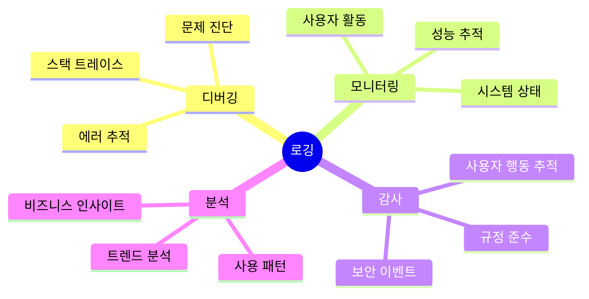

### 로깅 레벨

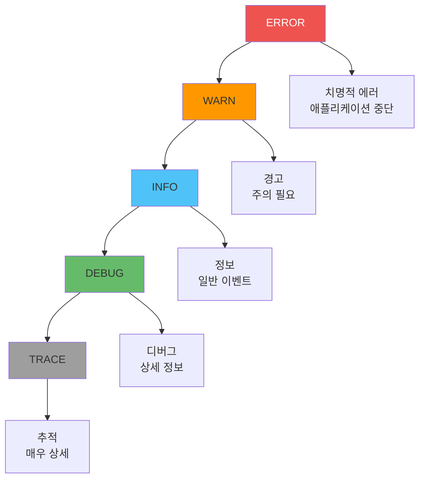

#### 로그 레벨 우선순위

| 레벨 | 우선순위 | 사용 시점 | 예시 |
|------|----------|----------|------|
| **ERROR** | 0 | 치명적 에러 | 데이터베이스 연결 실패 |
| **WARN** | 1 | 경고 | 느린 쿼리, 사용 중단된 API |
| **INFO** | 2 | 정보성 이벤트 | 사용자 로그인, 요청 처리 |
| **DEBUG** | 3 | 디버깅 정보 | 함수 진입, 변수 값 |
| **TRACE** | 4 | 매우 상세한 추적 | 모든 함수 호출 |

## Winston vs Pino 비교

### 성능 비교

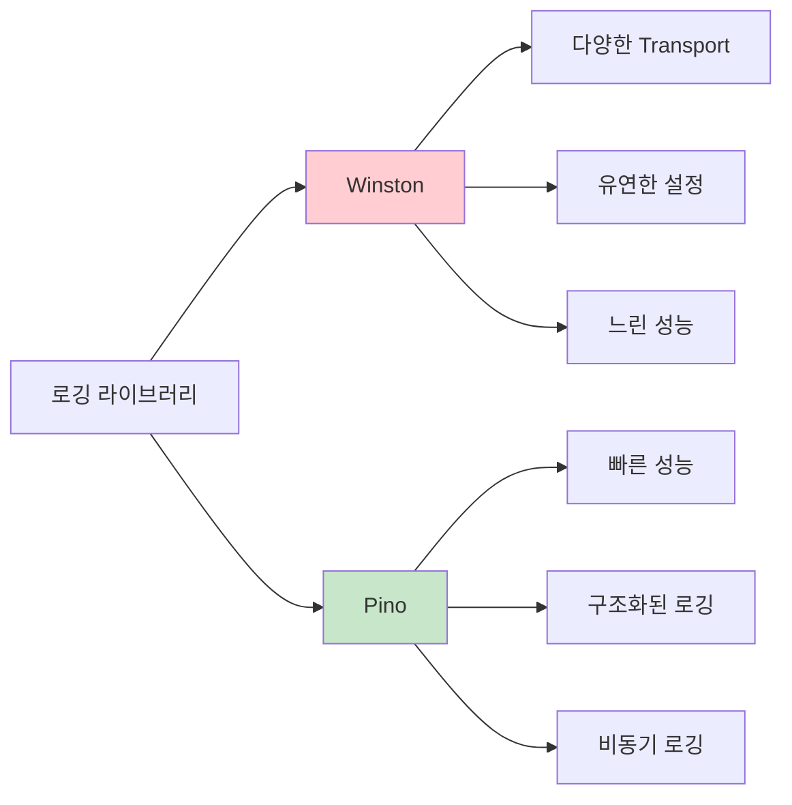

#### 상세 비교표

| 항목 | Winston | Pino |
|------|---------|------|
| **성능** | 중간 (동기) | 매우 빠름 (비동기) |
| **메모리 사용** | 높음 | 낮음 |
| **구조화 로깅** | 지원 | 기본 지원 |
| **Transport** | 다양함 | 플러그인 필요 |
| **학습 곡선** | 낮음 | 중간 |
| **커뮤니티** | 매우 활발 | 활발 |
| **JSON 출력** | 설정 필요 | 기본 |

### 성능 벤치마크

**성능 테스트 결과 (100,000 로그):**
- Winston: ~2.5초 (동기 로깅)
- Pino: ~0.3초 (비동기 로깅)

**메모리 사용량:**
- Winston: ~50MB
- Pino: ~10MB

### 로깅 라이브러리 선택 가이드

**의사결정 트리:**

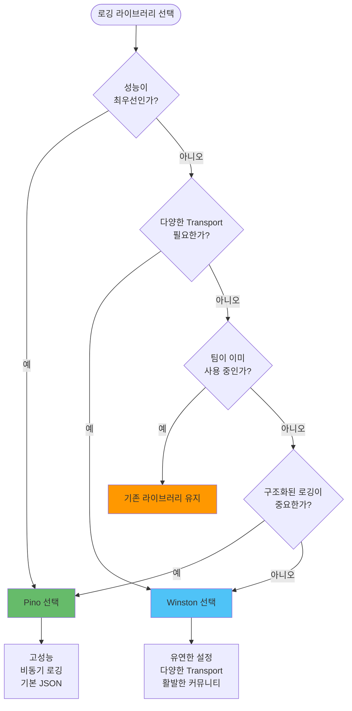

**선택 기준표:**

| 기준 | Winston | Pino | 권장 상황 |
|------|---------|------|----------|
| **고성능 필요** | 비권장 | 권장 | 대용량 트래픽, 실시간 시스템 |
| **다양한 Transport** | 권장 | 비권장 | 복잡한 로그 라우팅 필요 |
| **구조화된 로깅** | 설정 필요 | 기본 지원 | 로그 분석 자동화 |
| **학습 곡선** | 낮음 | 중간 | 신규 팀원 많음 |
| **메모리 제약** | 비권장 | 권장 | 제한된 리소스 환경 |
| **기존 코드베이스** | 권장 | 주의 필요 | 마이그레이션 비용 고려 |

**트레이드오프 분석:**

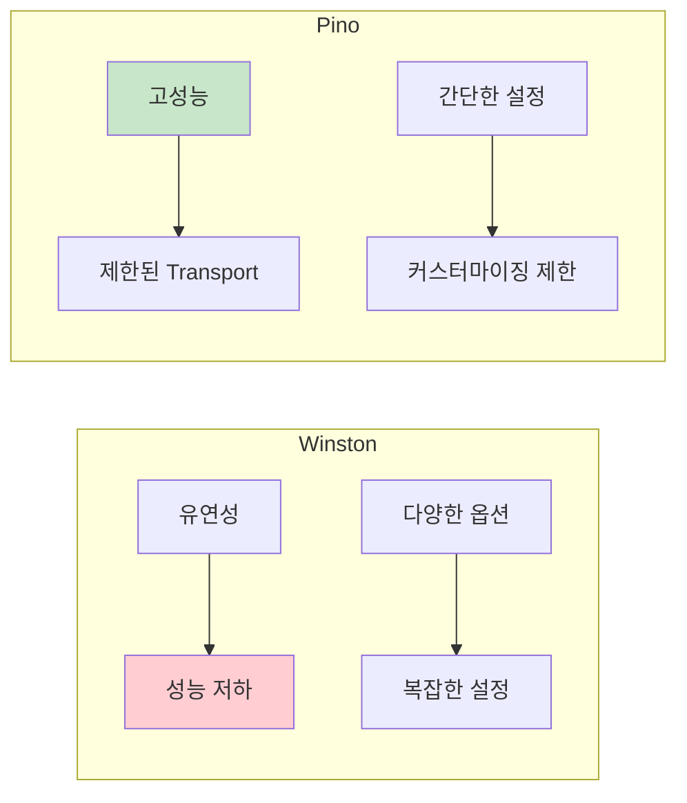

**실무 권장사항:**
- **신규 프로젝트**: Pino 권장 (성능과 구조화된 로깅의 이점)
- **기존 프로젝트**: 현재 라이브러리 유지 (마이그레이션 비용 고려)
- **고성능 요구**: Pino 필수
- **복잡한 로그 라우팅**: Winston 고려

## Winston 구현

Winston은 유연한 설정과 다양한 Transport를 제공하는 로깅 라이브러리입니다. 프로덕션 환경에 맞게 구성하는 것이 중요합니다.

### Winston 설정

**기본 설정 구성 요소:**

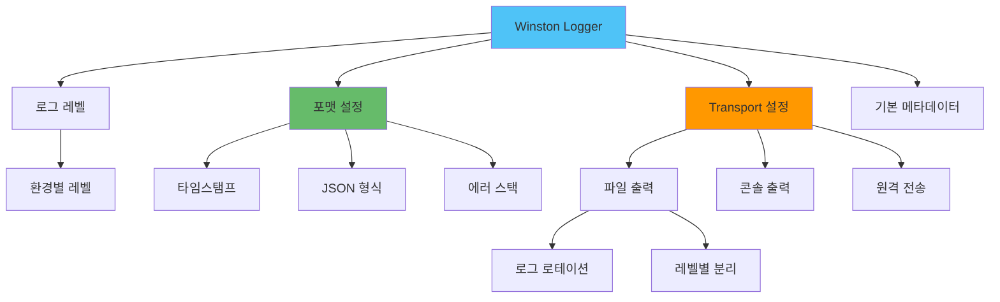

**환경별 설정:**

**개발 환경:**
- 콘솔 출력 활성화하여 즉시 확인 가능
- 색상 포맷 사용하여 가독성 향상
- DEBUG 레벨까지 로깅하여 상세 정보 확인

**프로덕션 환경:**
- 파일 출력만 사용하여 성능 최적화
- JSON 형식으로 구조화된 로그 생성
- INFO 레벨 이상만 로깅하여 로그 볼륨 관리

**로그 로테이션:**
- 일일 로그 파일로 분할하여 관리 용이성 향상
- 파일 크기 제한 (예: 20MB) 설정
- 보존 기간 설정 (일반 로그: 14일, 에러 로그: 30일)

**예외 처리 설정:**
- 처리되지 않은 예외를 별도 파일에 기록
- Promise 거부를 별도 파일에 기록
- 애플리케이션 크래시 시에도 로그 보존

**참고:**
- 서비스 이름과 환경 정보를 기본 메타데이터로 포함
- 에러 로그는 별도 파일로 분리하여 모니터링 용이
- 로그 포맷을 일관되게 유지하여 파싱 효율 향상

## Pino 구현

Pino는 성능에 최적화된 로깅 라이브러리로, 비동기 로깅을 통해 높은 처리량을 제공합니다.

### Pino 설정

**Pino의 핵심 특징:**

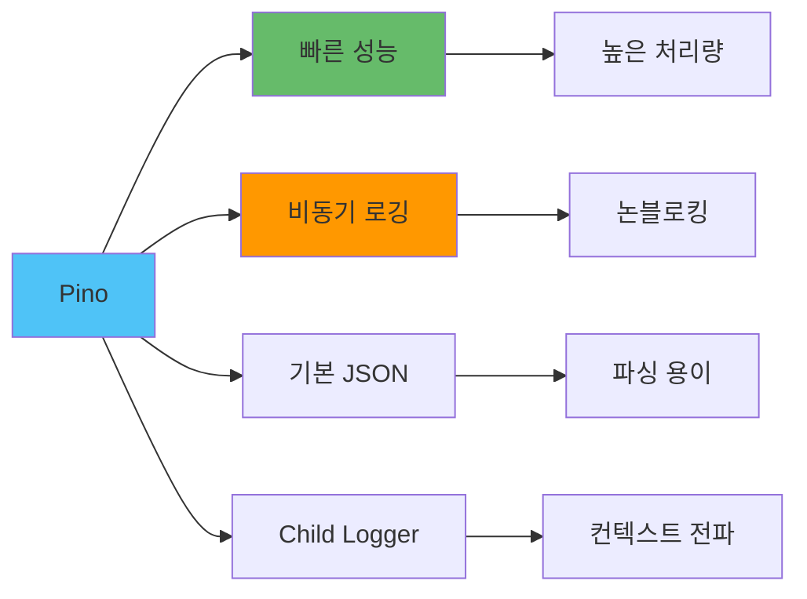

**환경별 설정:**

**프로덕션 환경:**
- 기본 JSON 출력으로 구조화된 로그 생성
- 표준 시리얼라이저 사용 (req, res, err)
- 서비스 이름과 환경 정보를 base에 포함

**개발 환경:**
- pino-pretty를 사용하여 가독성 향상
- 색상 출력으로 로그 레벨 구분
- 타임스탬프를 사람이 읽기 쉬운 형식으로 변환

**파일 로깅:**
- multistream을 사용하여 여러 출력 대상 설정
- 콘솔과 파일을 동시에 출력
- 에러 로그는 별도 파일로 분리하여 관리

**성능 최적화:**
- 기본적으로 비동기 로깅을 사용하여 메인 스레드 블로킹 방지
- JSON 직렬화가 최적화되어 있어 빠른 처리 속도
- Child logger를 사용하여 컨텍스트를 효율적으로 전파

**참고:**
- 프로덕션에서는 pino-pretty를 사용하지 않아 성능 오버헤드를 방지합니다
- Child logger를 활용하여 요청별 컨텍스트를 유지합니다
- 로그 레벨을 환경변수로 관리하여 유연하게 조정합니다

## 구조화된 로깅

### 구조화 로깅의 장점

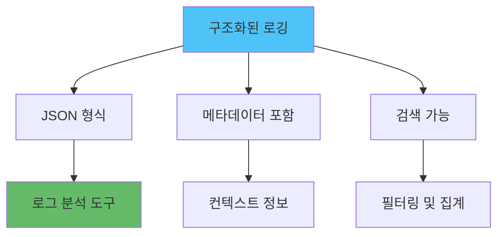

### 구조화 로깅 구현

```javascript
// Winston 구조화 로깅
const logger = winston.createLogger({
  format: winston.format.combine(
    winston.format.timestamp(),
    winston.format.json()
  ),
  transports: [
    new winston.transports.Console()
  ]
});

// 구조화된 로그 작성
logger.info('User action', {
  userId: '123',
  action: 'login',
  ip: '192.168.1.1',
  userAgent: 'Mozilla/5.0...',
  timestamp: new Date().toISOString()
});

// Pino 구조화 로깅 (기본)
const pino = require('pino');
const logger = pino();

// 구조화된 로그 작성
logger.info({
  userId: '123',
  action: 'login',
  ip: '192.168.1.1',
  userAgent: 'Mozilla/5.0...'
}, 'User action');
```

### 로깅 헬퍼 함수

```javascript
// 로깅 헬퍼 클래스
class LoggerHelper {
  constructor(logger) {
    this.logger = logger;
  }
  
  // 요청 로깅
  logRequest(req, res, responseTime) {
    this.logger.info({
      type: 'http_request',
      method: req.method,
      path: req.path,
      statusCode: res.statusCode,
      responseTime,
      ip: req.ip,
      userAgent: req.get('user-agent'),
      userId: req.user?.id
    }, `${req.method} ${req.path} ${res.statusCode}`);
  }
  
  // 에러 로깅
  logError(error, context = {}) {
    this.logger.error({
      type: 'error',
      error: {
        message: error.message,
        stack: error.stack,
        name: error.name,
        code: error.code
      },
      ...context
    }, error.message);
  }
  
  // 비즈니스 이벤트 로깅
  logBusinessEvent(event, data = {}) {
    this.logger.info({
      type: 'business_event',
      event,
      ...data
    }, `Business event: ${event}`);
  }
  
  // 성능 메트릭 로깅
  logPerformance(metric, value, unit = 'ms') {
    this.logger.info({
      type: 'performance',
      metric,
      value,
      unit
    }, `Performance: ${metric} = ${value}${unit}`);
  }
}

// 사용 예시
const loggerHelper = new LoggerHelper(logger);

// Express 미들웨어
function requestLogger(req, res, next) {
  const startTime = Date.now();
  
  res.on('finish', () => {
    const responseTime = Date.now() - startTime;
    loggerHelper.logRequest(req, res, responseTime);
  });
  
  next();
}

// 에러 로깅
app.use((error, req, res, next) => {
  loggerHelper.logError(error, {
    path: req.path,
    method: req.method,
    userId: req.user?.id
  });
  next(error);
});
```

## 분산 추적 (Correlation ID)

### Correlation ID 개념

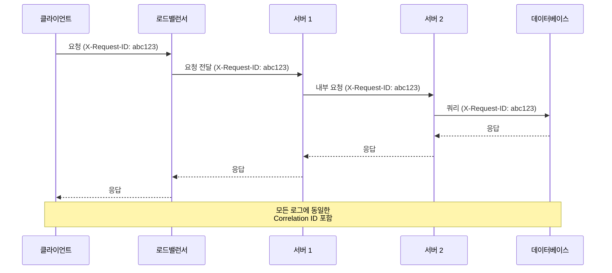

### Correlation ID 구현

```javascript
const { v4: uuidv4 } = require('uuid');

// Express 미들웨어
function correlationIdMiddleware(req, res, next) {
  // 요청 헤더에서 Correlation ID 가져오기 또는 생성
  const correlationId = req.headers['x-request-id'] || uuidv4();
  
  // 요청 객체에 저장
  req.id = correlationId;
  
  // 응답 헤더에 추가
  res.setHeader('X-Request-ID', correlationId);
  
  // 로거에 Correlation ID 추가
  req.logger = logger.child({ correlationId });
  
  next();
}

// 사용 예시
app.use(correlationIdMiddleware);

app.get('/users/:id', async (req, res) => {
  // 모든 로그에 자동으로 Correlation ID 포함
  req.logger.info('Fetching user', { userId: req.params.id });
  
  try {
    const user = await db.users.findById(req.params.id);
    req.logger.info('User found', { userId: user.id });
    res.json(user);
  } catch (error) {
    req.logger.error('Failed to fetch user', { error: error.message });
    throw error;
  }
});
```

### Pino Child Logger

```javascript
const pino = require('pino');

const logger = pino();

// Child logger 생성
function createRequestLogger(req) {
  const correlationId = req.headers['x-request-id'] || uuidv4();
  
  return logger.child({
    correlationId,
    userId: req.user?.id,
    ip: req.ip,
    userAgent: req.get('user-agent')
  });
}

// 사용 예시
app.get('/users/:id', async (req, res) => {
  const log = createRequestLogger(req);
  
  log.info('Fetching user');
  
  try {
    const user = await db.users.findById(req.params.id);
    log.info({ userId: user.id }, 'User found');
    res.json(user);
  } catch (error) {
    log.error({ error: error.message }, 'Failed to fetch user');
    throw error;
  }
});
```

## 로그 집계 및 분석

### 로그 집계 아키텍처

프로덕션 환경에서의 로그 집계는 여러 계층을 거쳐 처리됩니다. 다음 다이어그램은 전체 로그 수집 파이프라인을 보여줍니다.

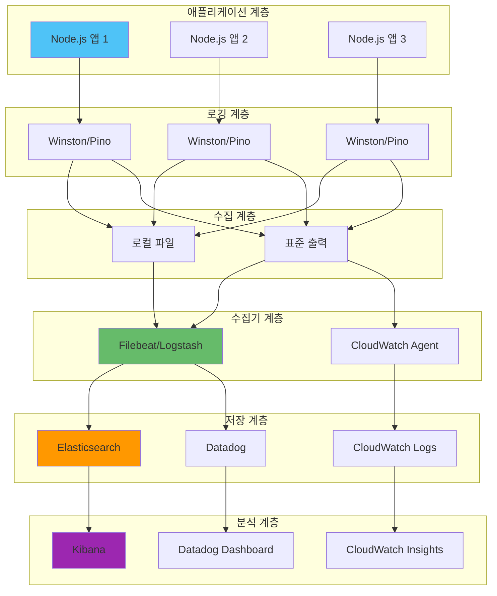

### 로그 수집 파이프라인 흐름도

로그가 생성되어 최종 분석 도구에 도달하기까지의 전체 흐름을 시각화합니다.

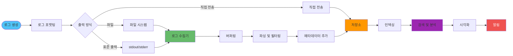

### 로그 수집 방식 비교

다양한 로그 수집 방식의 특징과 사용 시나리오를 비교합니다.

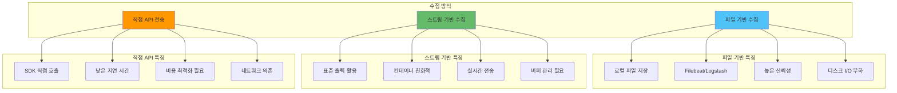

### 실무 운영 시나리오: 로그 수집

**시나리오 1: 단일 서버 환경**
- 파일 기반 수집이 가장 안정적입니다
- 로그 로테이션을 통해 디스크 공간을 관리합니다
- Filebeat를 사용하여 중앙 집계 시스템으로 전송합니다

**시나리오 2: 컨테이너 환경 (Docker/Kubernetes)**
- 표준 출력 기반 수집이 권장됩니다
- 컨테이너 로그는 자동으로 수집되도록 설정합니다
- 로그 드라이버를 활용하여 직접 전송합니다

**시나리오 3: 서버리스 환경 (Lambda)**
- CloudWatch Logs에 자동으로 전송됩니다
- 구조화된 로그 형식을 사용하여 분석 효율을 높입니다
- 로그 그룹과 스트림을 적절히 구성합니다

### 로그 수집 설정

다음은 각 환경에 맞는 로그 수집 설정 예시입니다:

```javascript
// Winston + Filebeat
const winston = require('winston');

const logger = winston.createLogger({
  format: winston.format.json(),
  transports: [
    // 표준 출력 (Filebeat가 수집)
    new winston.transports.Console({
      format: winston.format.json()
    })
  ]
});

// Pino + Filebeat
const pino = require('pino');

const logger = pino({
  // 표준 출력으로 JSON 로그 출력
  // Filebeat가 수집하여 Elasticsearch로 전송
});
```

### CloudWatch 통합

```javascript
const winston = require('winston');
const WinstonCloudWatch = require('winston-cloudwatch');

const logger = winston.createLogger({
  transports: [
    new winston.transports.Console(),
    new WinstonCloudWatch({
      logGroupName: 'api-server',
      logStreamName: process.env.NODE_ENV,
      awsRegion: 'us-east-1',
      messageFormatter: ({ level, message, ...meta }) => {
        return JSON.stringify({
          level,
          message,
          ...meta
        });
      }
    })
  ]
});
```

## 성능 최적화

### 비동기 로깅

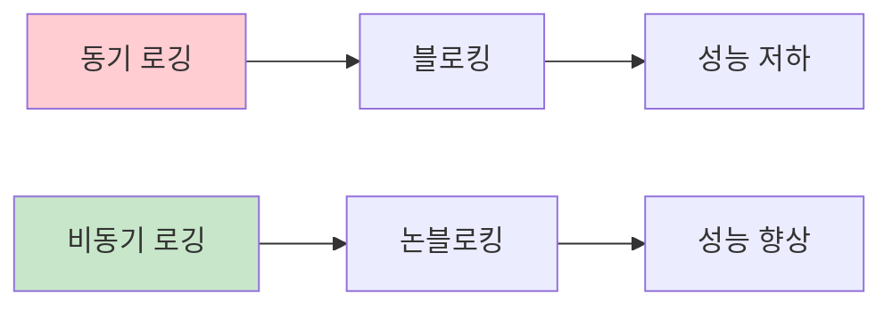

#### 비동기 로깅 구현

```javascript
// Pino는 기본적으로 비동기
const pino = require('pino');

const logger = pino({
  // 기본적으로 비동기 로깅
  // 매우 빠른 성능
});

// Winston 비동기 로깅
const winston = require('winston');

const logger = winston.createLogger({
  transports: [
    new winston.transports.Console({
      // 비동기 옵션
      handleExceptions: true,
      handleRejections: true
    })
  ]
});

// 커스텀 비동기 Transport
class AsyncFileTransport extends winston.transports.File {
  log(info, callback) {
    setImmediate(() => {
      super.log(info, callback);
    });
  }
}
```

### 로그 레벨 최적화

```javascript
// 프로덕션에서는 INFO 레벨만
const logger = winston.createLogger({
  level: process.env.NODE_ENV === 'production' ? 'info' : 'debug',
  // ...
});

// 환경별 로그 레벨
const logLevels = {
  development: 'debug',
  staging: 'info',
  production: 'warn'
};

const logger = winston.createLogger({
  level: logLevels[process.env.NODE_ENV] || 'info',
  // ...
});
```

### 로그 샘플링

```javascript
// 높은 볼륨 로그 샘플링
function createSampledLogger(baseLogger, sampleRate = 0.1) {
  return {
    debug: (...args) => {
      if (Math.random() < sampleRate) {
        baseLogger.debug(...args);
      }
    },
    info: (...args) => {
      if (Math.random() < sampleRate) {
        baseLogger.info(...args);
      }
    },
    // ERROR는 항상 로깅
    error: (...args) => baseLogger.error(...args),
    warn: (...args) => baseLogger.warn(...args)
  };
}

const sampledLogger = createSampledLogger(logger, 0.1);
```

## 실전 예제: 완전한 로깅 시스템

```javascript
const express = require('express');
const pino = require('pino');
const pinoHttp = require('pino-http');
const { v4: uuidv4 } = require('uuid');

// Pino 로거 생성
const logger = pino({
  level: process.env.LOG_LEVEL || 'info',
  formatters: {
    level: (label) => {
      return { level: label };
    }
  },
  timestamp: pino.stdTimeFunctions.isoTime,
  base: {
    service: 'api-server',
    environment: process.env.NODE_ENV
  },
  serializers: {
    req: pino.stdSerializers.req,
    res: pino.stdSerializers.res,
    err: pino.stdSerializers.err
  }
});

// Express 앱 설정
const app = express();

// Correlation ID 미들웨어
app.use((req, res, next) => {
  req.id = req.headers['x-request-id'] || uuidv4();
  res.setHeader('X-Request-ID', req.id);
  next();
});

// Pino HTTP 미들웨어
app.use(pinoHttp({
  logger,
  genReqId: (req) => req.id,
  customSuccessMessage: (req, res) => {
    return `${req.method} ${req.url} ${res.statusCode}`;
  },
  customErrorMessage: (req, res, error) => {
    return `${req.method} ${req.url} ${res.statusCode} - ${error.message}`;
  }
}));

// 요청 로깅 미들웨어
app.use((req, res, next) => {
  const startTime = Date.now();
  
  res.on('finish', () => {
    const duration = Date.now() - startTime;
    logger.info({
      type: 'http_request',
      method: req.method,
      path: req.path,
      statusCode: res.statusCode,
      duration,
      correlationId: req.id
    });
  });
  
  next();
});

// 라우트 예시
app.get('/users/:id', async (req, res) => {
  const log = logger.child({ correlationId: req.id });
  
  log.info({ userId: req.params.id }, 'Fetching user');
  
  try {
    const user = await db.users.findById(req.params.id);
    
    if (!user) {
      log.warn({ userId: req.params.id }, 'User not found');
      return res.status(404).json({ error: 'User not found' });
    }
    
    log.info({ userId: user.id }, 'User found');
    res.json(user);
  } catch (error) {
    log.error({ error: error.message, stack: error.stack }, 'Failed to fetch user');
    res.status(500).json({ error: 'Internal server error' });
  }
});

// 에러 핸들링 미들웨어
app.use((error, req, res, next) => {
  logger.error({
    type: 'error',
    error: {
      message: error.message,
      stack: error.stack,
      name: error.name
    },
    correlationId: req.id,
    path: req.path,
    method: req.method
  });
  
  res.status(error.statusCode || 500).json({
    error: {
      message: error.message,
      correlationId: req.id
    }
  });
});

const PORT = process.env.PORT || 3000;
app.listen(PORT, () => {
  logger.info({ port: PORT }, 'Server started');
});
```

## 실전 통합 예제: 로깅 + 모니터링 + 에러 핸들링

여러 개념을 통합한 실전 예제입니다.

```javascript
const express = require('express');
const pino = require('pino');
const { v4: uuidv4 } = require('uuid');

// 로거 설정
const logger = pino({
  level: process.env.LOG_LEVEL || 'info',
  formatters: {
    level: (label) => {
      return { level: label };
    }
  },
  serializers: {
    req: (req) => ({
      method: req.method,
      url: req.url,
      headers: {
        'user-agent': req.headers['user-agent'],
        'content-type': req.headers['content-type']
      }
    }),
    err: (err) => ({
      type: err.type,
      message: err.message,
      stack: err.stack
    })
  }
});

const app = express();

// Correlation ID 미들웨어
app.use((req, res, next) => {
  req.id = req.headers['x-correlation-id'] || uuidv4();
  res.setHeader('X-Correlation-ID', req.id);
  next();
});

// 요청 로깅 미들웨어
app.use((req, res, next) => {
  const log = logger.child({ correlationId: req.id });
  req.log = log;
  
  const start = Date.now();
  
  res.on('finish', () => {
    const duration = Date.now() - start;
    log.info({
      req,
      res: {
        statusCode: res.statusCode
      },
      duration
    }, 'Request completed');
  });
  
  next();
});

// 에러 핸들링 미들웨어
app.use((error, req, res, next) => {
  const log = req.log || logger.child({ correlationId: req.id });
  
  // 에러 로깅
  log.error({
    err: error,
    req,
    stack: error.stack
  }, 'Request failed');
  
  // 모니터링 메트릭 (예: Prometheus)
  // errorCounter.inc({ status: error.statusCode || 500 });
  
  // 사용자 친화적 응답
  const statusCode = error.statusCode || 500;
  res.status(statusCode).json({
    error: {
      message: error.message,
      correlationId: req.id,
      ...(process.env.NODE_ENV === 'development' && { stack: error.stack })
    }
  });
});

// API 엔드포인트
app.get('/users/:id', async (req, res, next) => {
  const log = req.log;
  
  try {
    log.info({ userId: req.params.id }, 'Fetching user');
    
    const user = await db.users.findById(req.params.id);
    
    if (!user) {
      log.warn({ userId: req.params.id }, 'User not found');
      return res.status(404).json({ error: 'User not found' });
    }
    
    log.info({ userId: user.id }, 'User found');
    res.json(user);
  } catch (error) {
    // 에러를 다음 미들웨어로 전달
    next(error);
  }
});

// 헬스 체크
app.get('/health', (req, res) => {
  res.json({ status: 'healthy', timestamp: new Date().toISOString() });
});

const PORT = process.env.PORT || 3000;
app.listen(PORT, () => {
  logger.info({ port: PORT }, 'Server started');
});
```

## 요약
체계적인 로깅은 운영 환경에서 필수적입니다. 구조화된 로깅과 분산 추적을 통해 효과적인 모니터링과 디버깅이 가능합니다.

### 주요 내용

- **로깅 라이브러리 선택**: Winston (유연성) vs Pino (성능)
- **구조화된 로깅**: JSON 형식, 메타데이터 포함
- **로그 레벨 관리**: 환경별 적절한 레벨 설정
- **분산 추적**: Correlation ID로 요청 추적
- **성능 최적화**: 비동기 로깅, 샘플링
- **로그 집계**: 중앙 집중식 로그 관리

### 주의사항

1. **구조화된 로깅 사용**: JSON 형식으로 일관된 로그 구조
2. **적절한 로그 레벨**: 환경별 레벨 설정
3. **Correlation ID**: 모든 요청에 고유 ID 부여
4. **성능 고려**: 비동기 로깅, 샘플링 활용
5. **보안**: 민감한 정보 로깅 금지
6. **로그 보관**: 적절한 보관 기간 설정

### 관련 문서

- [에러 핸들링](../에러_핸들링/에러_핸들링_전략.md) - 에러 로깅 및 추적
- [Observability](../모니터링/Observability_전략.md) - 로그, 메트릭, 트레이스 통합
- [성능 최적화](../Performance/Node.js_성능_최적화_및_프로파일링.md) - 로깅 성능 최적화
- [보안 모범 사례](../보안/Node.js_보안_모범사례.md) - 보안 로깅 및 감사

