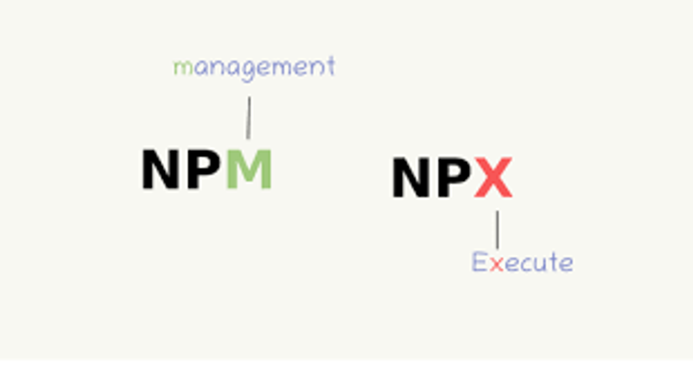

## npx ? npm ≠ npx
⇒ 자바스크립트 패키지 관리 모듈
- npm(node pacakage module)의 5.2.0 버전부터 새로 추가되어 기본 패키지로 제공되기 시작했다. 
- npm과 비교 대상이 아닌 npm을 좀 더 편하게 사용하기 위해 npm에서 제공하는 하나의 도구이다.
- npx는 npm 레지스트리에 있는 패키지를 더 쉽게 설치하고 관리하도록 도와주는 CLI(Command-line interface) 도구이다. 
- npm 패키지를 실행할 수 있는 도구

<div align="center">
    
</div>

> 정리! 
>
> npm = Package Manager (관리)
> 
> npm은 그 자체로 어떤 패키지로 “실행”하지 않는다.
> 
> npx = Package Runner (실행)


---

```
출처
1. https://80000coding.oopy.io/3adce195-8c34-4e0a-b1fe-5c44b0768bad

```