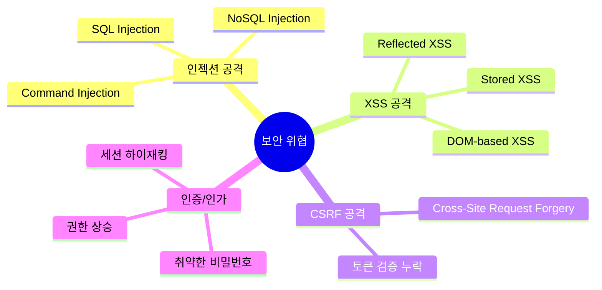
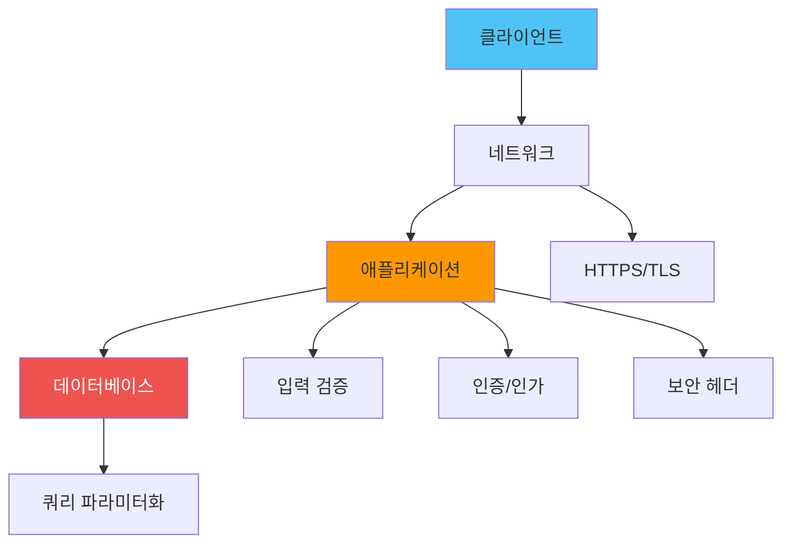
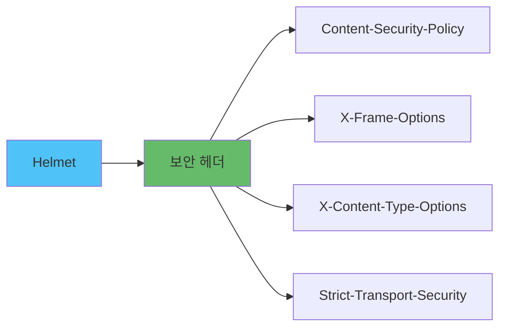
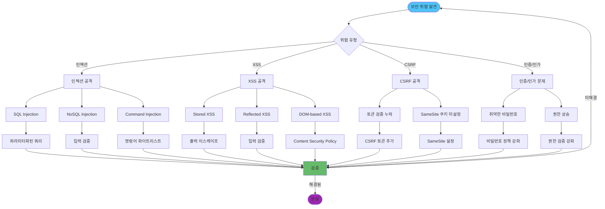

# 🛡️ Node.js 보안 모범 사례

## 📌 개요

> **보안**은 Node.js 애플리케이션의 핵심 요소로, 다양한 공격 벡터로부터 애플리케이션과 사용자 데이터를 보호해야 합니다.

### 🎯 보안 위협



### 📊 보안 계층



## 🔒 Helmet.js 설정

### Helmet 개요

Helmet.js는 Express 애플리케이션의 보안 헤더를 설정하는 미들웨어입니다.



### 기본 설정

```javascript
const helmet = require('helmet');
const express = require('express');

const app = express();

// 기본 Helmet 설정
app.use(helmet());

// 커스텀 설정
app.use(helmet({
  contentSecurityPolicy: {
    directives: {
      defaultSrc: ["'self'"],
      styleSrc: ["'self'", "'unsafe-inline'", "https://fonts.googleapis.com"],
      fontSrc: ["'self'", "https://fonts.gstatic.com"],
      imgSrc: ["'self'", "data:", "https:"],
      scriptSrc: ["'self'"],
      objectSrc: ["'none'"],
      upgradeInsecureRequests: []
    }
  },
  crossOriginEmbedderPolicy: true,
  crossOriginOpenerPolicy: true,
  crossOriginResourcePolicy: { policy: "cross-origin" },
  dnsPrefetchControl: true,
  frameguard: { action: 'deny' },
  hidePoweredBy: true,
  hsts: {
    maxAge: 31536000,
    includeSubDomains: true,
    preload: true
  },
  ieNoOpen: true,
  noSniff: true,
  permittedCrossDomainPolicies: false,
  referrerPolicy: { policy: "no-referrer" },
  xssFilter: true
}));
```

### Content Security Policy (CSP)

```javascript
// 엄격한 CSP 설정
app.use(helmet.contentSecurityPolicy({
  directives: {
    defaultSrc: ["'self'"],
    scriptSrc: [
      "'self'",
      "'unsafe-inline'", // 가능하면 제거
      "https://trusted-cdn.com"
    ],
    styleSrc: [
      "'self'",
      "'unsafe-inline'",
      "https://fonts.googleapis.com"
    ],
    imgSrc: [
      "'self'",
      "data:",
      "https:"
    ],
    connectSrc: [
      "'self'",
      "https://api.example.com"
    ],
    fontSrc: [
      "'self'",
      "https://fonts.gstatic.com"
    ],
    objectSrc: ["'none'"],
    mediaSrc: ["'self'"],
    frameSrc: ["'none'"],
    upgradeInsecureRequests: []
  },
  reportOnly: false // 프로덕션에서는 false
}));
```

## 🌐 CORS 상세 설정

### CORS 기본 설정

```javascript
const cors = require('cors');

// 기본 설정 (모든 출처 허용 - 개발 환경만)
app.use(cors());

// 프로덕션 설정
const corsOptions = {
  origin: (origin, callback) => {
    const allowedOrigins = [
      'https://example.com',
      'https://www.example.com',
      'https://app.example.com'
    ];
    
    // origin이 없으면 (같은 출처 요청) 허용
    if (!origin || allowedOrigins.includes(origin)) {
      callback(null, true);
    } else {
      callback(new Error('Not allowed by CORS'));
    }
  },
  credentials: true, // 쿠키 포함 허용
  methods: ['GET', 'POST', 'PUT', 'DELETE', 'PATCH'],
  allowedHeaders: ['Content-Type', 'Authorization'],
  exposedHeaders: ['X-Total-Count'],
  maxAge: 86400 // 24시간
};

app.use(cors(corsOptions));
```

### 동적 CORS 설정

```javascript
// 환경별 CORS 설정
function getCorsOptions() {
  if (process.env.NODE_ENV === 'development') {
    return {
      origin: true, // 모든 출처 허용
      credentials: true
    };
  }
  
  // 프로덕션
  return {
    origin: async (origin, callback) => {
      // 데이터베이스에서 허용된 도메인 확인
      const allowedDomain = await db.allowedDomains.findOne({ domain: origin });
      
      if (allowedDomain) {
        callback(null, true);
      } else {
        callback(new Error('Not allowed by CORS'));
      }
    },
    credentials: true,
    methods: ['GET', 'POST', 'PUT', 'DELETE'],
    allowedHeaders: ['Content-Type', 'Authorization']
  };
}

app.use(cors(getCorsOptions()));
```

## ✅ 입력 검증

### Joi를 사용한 검증

```javascript
const Joi = require('joi');

// 사용자 생성 스키마
const createUserSchema = Joi.object({
  email: Joi.string()
    .email()
    .required()
    .messages({
      'string.email': '유효한 이메일 주소를 입력하세요',
      'any.required': '이메일은 필수입니다'
    }),
  password: Joi.string()
    .min(8)
    .pattern(new RegExp('^(?=.*[a-z])(?=.*[A-Z])(?=.*[0-9])(?=.*[!@#\$%\^&\*])'))
    .required()
    .messages({
      'string.min': '비밀번호는 최소 8자 이상이어야 합니다',
      'string.pattern.base': '비밀번호는 대문자, 소문자, 숫자, 특수문자를 포함해야 합니다'
    }),
  age: Joi.number()
    .integer()
    .min(13)
    .max(120)
    .optional(),
  username: Joi.string()
    .alphanum()
    .min(3)
    .max(30)
    .required()
});

// 검증 미들웨어
function validate(schema) {
  return (req, res, next) => {
    const { error, value } = schema.validate(req.body, {
      abortEarly: false, // 모든 에러 수집
      stripUnknown: true // 알 수 없는 필드 제거
    });
    
    if (error) {
      const errors = error.details.map(detail => ({
        field: detail.path.join('.'),
        message: detail.message
      }));
      
      return res.status(400).json({
        error: 'Validation failed',
        details: errors
      });
    }
    
    // 검증된 데이터로 교체
    req.body = value;
    next();
  };
}

// 사용 예시
app.post('/users', validate(createUserSchema), async (req, res) => {
  const user = await db.users.create(req.body);
  res.status(201).json(user);
});
```

### class-validator 사용 (TypeScript)

```typescript
import { IsEmail, IsString, MinLength, Matches, IsOptional, IsInt, Min, Max } from 'class-validator';
import { validate } from 'class-validator';

class CreateUserDto {
  @IsEmail({}, { message: '유효한 이메일 주소를 입력하세요' })
  email: string;
  
  @IsString()
  @MinLength(8, { message: '비밀번호는 최소 8자 이상이어야 합니다' })
  @Matches(/^(?=.*[a-z])(?=.*[A-Z])(?=.*[0-9])(?=.*[!@#\$%\^&\*])/, {
    message: '비밀번호는 대문자, 소문자, 숫자, 특수문자를 포함해야 합니다'
  })
  password: string;
  
  @IsOptional()
  @IsInt()
  @Min(13)
  @Max(120)
  age?: number;
  
  @IsString()
  @MinLength(3)
  @MaxLength(30)
  username: string;
}

// 검증 미들웨어
async function validateDto(dtoClass: any) {
  return async (req, res, next) => {
    const dto = Object.assign(new dtoClass(), req.body);
    const errors = await validate(dto);
    
    if (errors.length > 0) {
      const errorMessages = errors.map(error => ({
        field: error.property,
        messages: Object.values(error.constraints || {})
      }));
      
      return res.status(400).json({
        error: 'Validation failed',
        details: errorMessages
      });
    }
    
    req.body = dto;
    next();
  };
}

// 사용 예시
app.post('/users', validateDto(CreateUserDto), async (req, res) => {
  const user = await db.users.create(req.body);
  res.status(201).json(user);
});
```

## 🚫 SQL Injection 방지

### ORM 사용

```javascript
// ❌ 취약한 코드
app.get('/users', (req, res) => {
  const query = `SELECT * FROM users WHERE id = ${req.query.id}`;
  db.query(query, (err, results) => {
    // SQL Injection 가능!
  });
});

// ✅ 안전한 코드 (Sequelize)
const { Op } = require('sequelize');

app.get('/users', async (req, res) => {
  const users = await User.findAll({
    where: {
      id: req.query.id // 자동으로 파라미터화됨
    }
  });
  res.json(users);
});

// ✅ 안전한 코드 (TypeORM)
app.get('/users', async (req, res) => {
  const users = await userRepository.find({
    where: {
      id: req.query.id
    }
  });
  res.json(users);
});

// ✅ 안전한 코드 (Raw Query with Parameterization)
app.get('/users', async (req, res) => {
  const query = 'SELECT * FROM users WHERE id = ?';
  const users = await db.query(query, [req.query.id]);
  res.json(users);
});
```

### NoSQL Injection 방지

```javascript
// ❌ 취약한 코드
app.post('/login', async (req, res) => {
  const user = await User.findOne({
    email: req.body.email,
    password: req.body.password
  });
  // NoSQL Injection 가능!
});

// ✅ 안전한 코드
app.post('/login', async (req, res) => {
  // 입력 검증
  const { email, password } = req.body;
  
  if (typeof email !== 'string' || typeof password !== 'string') {
    return res.status(400).json({ error: 'Invalid input' });
  }
  
  // 이메일 형식 검증
  if (!/^[^\s@]+@[^\s@]+\.[^\s@]+$/.test(email)) {
    return res.status(400).json({ error: 'Invalid email format' });
  }
  
  // 사용자 조회
  const user = await User.findOne({ email });
  
  if (!user) {
    return res.status(401).json({ error: 'Invalid credentials' });
  }
  
  // 비밀번호 검증
  const isValid = await bcrypt.compare(password, user.password);
  
  if (!isValid) {
    return res.status(401).json({ error: 'Invalid credentials' });
  }
  
  res.json({ token: generateToken(user) });
});
```

## 🛡️ XSS 및 CSRF 방어

### XSS 방어

```javascript
// 입력 데이터 이스케이프
const escapeHtml = (text) => {
  const map = {
    '&': '&amp;',
    '<': '&lt;',
    '>': '&gt;',
    '"': '&quot;',
    "'": '&#039;'
  };
  
  return text.replace(/[&<>"']/g, m => map[m]);
};

// 템플릿 엔진에서 자동 이스케이프 (EJS 예시)
app.set('view engine', 'ejs');
// EJS는 기본적으로 자동 이스케이프

// JSON 응답에서 XSS 방어
app.use((req, res, next) => {
  const originalJson = res.json;
  
  res.json = function(data) {
    // 문자열 값 이스케이프
    const sanitized = sanitizeObject(data);
    return originalJson.call(this, sanitized);
  };
  
  next();
});

function sanitizeObject(obj) {
  if (typeof obj === 'string') {
    return escapeHtml(obj);
  }
  
  if (Array.isArray(obj)) {
    return obj.map(sanitizeObject);
  }
  
  if (obj && typeof obj === 'object') {
    const sanitized = {};
    for (const [key, value] of Object.entries(obj)) {
      sanitized[key] = sanitizeObject(value);
    }
    return sanitized;
  }
  
  return obj;
}
```

### CSRF 방어

```javascript
const csrf = require('csurf');
const cookieParser = require('cookie-parser');

// 쿠키 파서 설정
app.use(cookieParser());

// CSRF 보호 설정
const csrfProtection = csrf({
  cookie: {
    httpOnly: true,
    secure: process.env.NODE_ENV === 'production',
    sameSite: 'strict'
  }
});

// CSRF 토큰 생성 엔드포인트
app.get('/csrf-token', csrfProtection, (req, res) => {
  res.json({ csrfToken: req.csrfToken() });
});

// CSRF 보호가 필요한 라우트
app.post('/api/users', csrfProtection, (req, res) => {
  // CSRF 토큰이 자동으로 검증됨
  // 검증 실패 시 403 Forbidden
  res.json({ message: 'User created' });
});

// Double Submit Cookie 패턴 (대안)
app.use((req, res, next) => {
  if (req.method === 'POST' || req.method === 'PUT' || req.method === 'DELETE') {
    const tokenFromCookie = req.cookies['XSRF-TOKEN'];
    const tokenFromHeader = req.headers['x-xsrf-token'];
    
    if (!tokenFromCookie || tokenFromCookie !== tokenFromHeader) {
      return res.status(403).json({ error: 'CSRF token mismatch' });
    }
  }
  next();
});
```

## 🔍 의존성 취약점 스캔

### npm audit

```bash
# 취약점 검사
npm audit

# 자동 수정 (가능한 경우)
npm audit fix

# 강제 수정 (주의 필요)
npm audit fix --force

# 상세 정보
npm audit --json
```

### 자동화된 스캔

```javascript
// package.json에 스크립트 추가
{
  "scripts": {
    "security:audit": "npm audit",
    "security:fix": "npm audit fix",
    "security:check": "npm audit --audit-level=moderate"
  }
}

// CI/CD 파이프라인에 통합
// .github/workflows/security.yml
name: Security Audit

on: [push, pull_request]

jobs:
  audit:
    runs-on: ubuntu-latest
    steps:
      - uses: actions/checkout@v2
      - uses: actions/setup-node@v2
      - run: npm ci
      - run: npm audit --audit-level=moderate
```

### Snyk 통합

```javascript
// Snyk CLI 설치
// npm install -g snyk

// Snyk 테스트
// snyk test

// Snyk 모니터링
// snyk monitor

// package.json 스크립트
{
  "scripts": {
    "snyk:test": "snyk test",
    "snyk:monitor": "snyk monitor"
  }
}
```

## 🔐 비밀번호 보안

### 비밀번호 해싱

```javascript
const bcrypt = require('bcrypt');

// 비밀번호 해싱
async function hashPassword(password) {
  const saltRounds = 12; // 충분한 라운드 수
  return await bcrypt.hash(password, saltRounds);
}

// 비밀번호 검증
async function verifyPassword(password, hash) {
  return await bcrypt.compare(password, hash);
}

// 사용 예시
app.post('/register', async (req, res) => {
  const { email, password } = req.body;
  
  // 비밀번호 해싱
  const hashedPassword = await hashPassword(password);
  
  // 사용자 생성
  const user = await db.users.create({
    email,
    password: hashedPassword
  });
  
  res.status(201).json({ id: user.id, email: user.email });
});

app.post('/login', async (req, res) => {
  const { email, password } = req.body;
  
  const user = await db.users.findOne({ email });
  
  if (!user) {
    return res.status(401).json({ error: 'Invalid credentials' });
  }
  
  // 비밀번호 검증
  const isValid = await verifyPassword(password, user.password);
  
  if (!isValid) {
    return res.status(401).json({ error: 'Invalid credentials' });
  }
  
  // 토큰 생성
  const token = generateToken(user);
  res.json({ token });
});
```

## 🔧 보안 트러블슈팅

### 보안 위협별 대응 플로우차트



### 보안 점검 체크리스트

**1. 입력 검증:**
- [ ] 모든 사용자 입력 검증
- [ ] SQL Injection 방지
- [ ] XSS 방지 (출력 이스케이프)
- [ ] Command Injection 방지

**2. 인증/인가:**
- [ ] 강력한 비밀번호 정책
- [ ] 세션 관리 보안
- [ ] 권한 검증 강화
- [ ] 토큰 보안 관리

**3. 보안 헤더:**
- [ ] Helmet.js 설정
- [ ] CORS 설정
- [ ] Content Security Policy
- [ ] HTTPS 강제

## 💡 5년차 개발자를 위한 고급 전략

**1. 보안 사고 대응 절차:**
- 즉시 위협 차단
- 영향 범위 파악
- 취약점 패치
- 사후 분석 및 개선

**2. 비용 고려사항:**
- 보안 도구 비용
- 취약점 패치 비용
- 보안 사고 비용
- 규정 준수 비용

**3. 팀 협업 관점:**
- 보안 코드 리뷰
- 보안 교육 및 인식 제고
- 보안 점검 정기화
- 보안 사고 대응 팀 구성

## 📝 결론

Node.js 애플리케이션의 보안은 여러 계층에서의 방어가 필요합니다.

### 핵심 포인트

- ✅ **Helmet.js**: 보안 헤더 설정
- ✅ **CORS**: 적절한 출처 제한
- ✅ **입력 검증**: Joi, class-validator 사용
- ✅ **SQL Injection 방지**: ORM 사용, 파라미터화
- ✅ **XSS/CSRF 방어**: 입력 이스케이프, CSRF 토큰
- ✅ **의존성 스캔**: npm audit, Snyk
- ✅ **비밀번호 보안**: bcrypt 해싱

### 보안 체크리스트

1. ✅ **HTTPS 사용**: 프로덕션 환경 필수
2. ✅ **보안 헤더**: Helmet.js로 설정
3. ✅ **입력 검증**: 모든 사용자 입력 검증
4. ✅ **인증/인가**: 강력한 인증 메커니즘

### 관련 문서

- [JWT 구현 및 보안](../인증/JWT_구현_및_보안.md) - 인증 및 토큰 보안
- [Rate Limiting](../API/Rate_Limiting.md) - DDoS 방어 및 API 보호
- [에러 핸들링](../에러_핸들링/에러_핸들링_전략.md) - 보안 에러 처리
- [파일 업로드 및 처리](../파일_처리/파일_업로드_및_처리.md) - 파일 업로드 보안
5. ✅ **의존성 관리**: 정기적인 취약점 스캔
6. ✅ **에러 처리**: 민감한 정보 노출 방지
7. ✅ **로깅**: 보안 이벤트 로깅
8. ✅ **비밀번호 정책**: 강력한 비밀번호 요구사항

