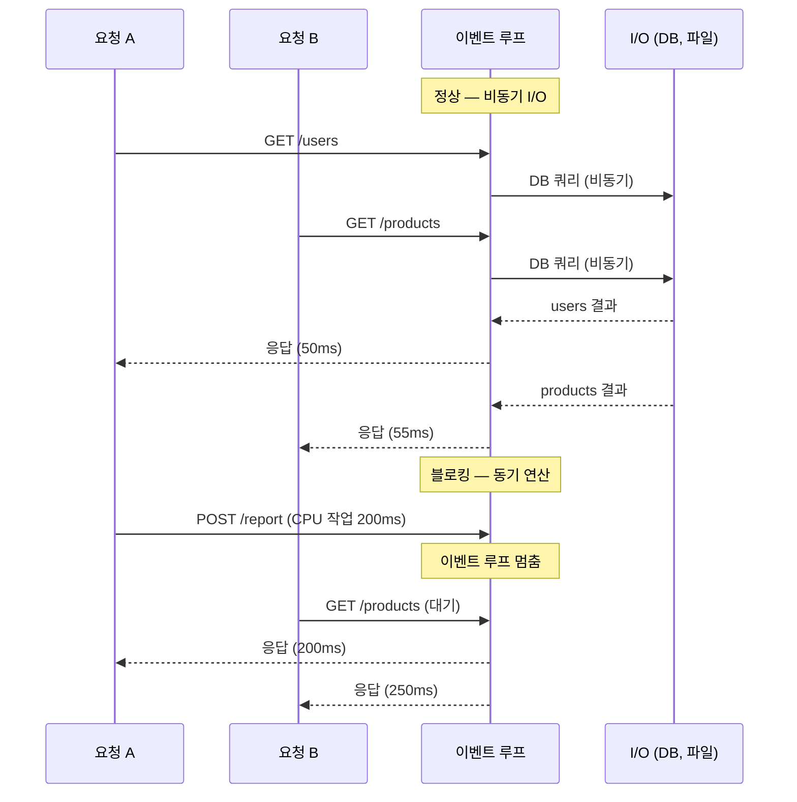
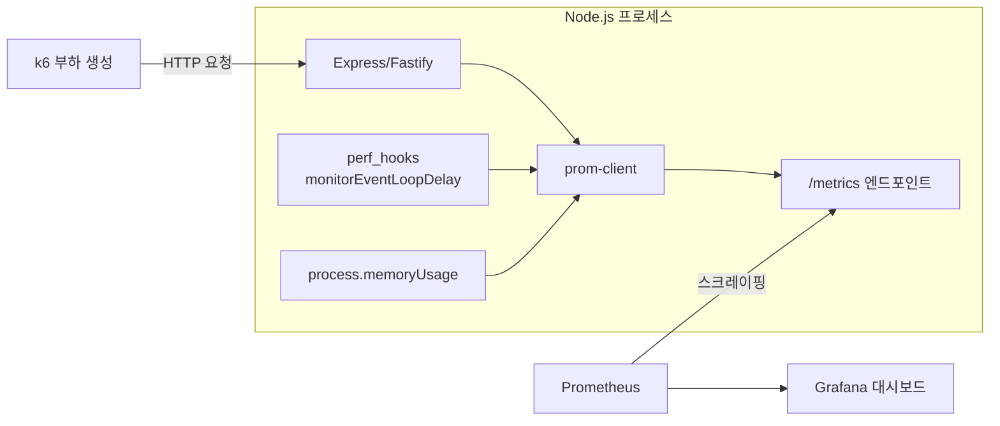
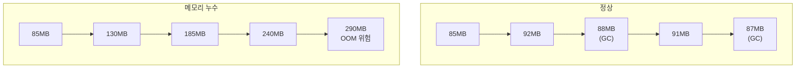
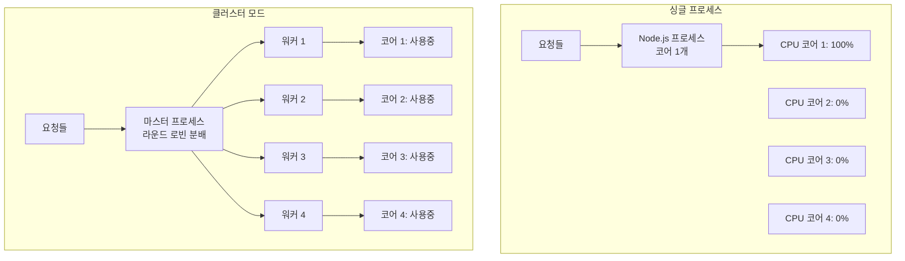

# Node.js 부하 테스트

## 개요

Node.js는 싱글 스레드 이벤트 루프 기반이라 부하 테스트에서 드러나는 병목 패턴이 다른 런타임과 다르다. Java나 Go처럼 요청마다 스레드를 할당하는 구조가 아니기 때문에, CPU를 오래 점유하는 작업 하나가 전체 요청의 응답 시간을 망가뜨린다.

부하 테스트 도구(k6, JMeter 등)의 설치와 시나리오 작성은 [DevOps - 부하 테스트](../../../DevOps/Testing/부하_테스트.md) 문서에 정리되어 있다. 이 문서는 **Node.js 애플리케이션을 대상으로 부하 테스트를 돌릴 때** 어디서 병목이 생기고, 어떻게 측정하고, 어떻게 해결하는지를 다룬다.

---

## 이벤트 루프 블로킹

Node.js 부하 테스트에서 가장 먼저 확인해야 하는 병목이다. 이벤트 루프가 블로킹되면 동시 접속 수와 관계없이 전체 처리량이 급락한다.

### 발생 원리

Node.js는 하나의 스레드에서 모든 요청을 처리한다. 요청 A가 이벤트 루프를 100ms 동안 점유하면, 같은 시간에 들어온 요청 B, C, D 모두 100ms를 기다린다.

```
이벤트 루프가 정상인 경우:
  요청 A → [I/O 시작] → (이벤트 루프 반환) → [I/O 완료 콜백]
  요청 B → [I/O 시작] → (이벤트 루프 반환) → [I/O 완료 콜백]
  → 두 요청이 거의 동시에 처리됨

이벤트 루프가 블로킹된 경우:
  요청 A → [JSON.parse(50MB)] → 200ms 동안 이벤트 루프 독점
  요청 B → (대기 200ms) → 그제서야 처리 시작
  요청 C → (대기 200ms+) → ...
  → 50 VU면 마지막 요청은 10초 이상 대기
```



### 흔한 블로킹 코드

실제 프로젝트에서 자주 발견되는 패턴이다.

```javascript
// 1. 큰 JSON 처리
app.post('/import', (req, res) => {
  const data = JSON.parse(hugeJsonString); // 50MB JSON → 200ms+ 블로킹
  // ...
});

// 2. 동기 파일 I/O
const config = fs.readFileSync('/path/to/large-file.csv'); // 서버 시작 시에만 써야 함

// 3. 정규식 ReDoS
const pattern = /^(a+)+$/;   // 악의적 입력에 exponential 시간
pattern.test('aaaaaaaaaaaaaaaaaaaX'); // 수 초 블로킹

// 4. 루프 안에서 동기 작업
for (const item of largeArray) {
  const result = heavyComputation(item); // 10만 건이면 이벤트 루프 장시간 독점
}
```

### 이벤트 루프 지연 측정

부하 테스트를 돌리면서 이벤트 루프 지연을 동시에 측정해야 한다. 응답 시간이 느린 게 DB 문제인지 이벤트 루프 블로킹인지 구분하는 데 쓴다.

```javascript
// monitorEventLoop.js
const { monitorEventLoopDelay } = require('node:perf_hooks');

const histogram = monitorEventLoopDelay({ resolution: 20 });
histogram.enable();

setInterval(() => {
  const min = (histogram.min / 1e6).toFixed(2);
  const max = (histogram.max / 1e6).toFixed(2);
  const mean = (histogram.mean / 1e6).toFixed(2);
  const p99 = (histogram.percentile(99) / 1e6).toFixed(2);

  console.log(`[EventLoop] min=${min}ms mean=${mean}ms p99=${p99}ms max=${max}ms`);

  histogram.reset();
}, 5000);
```

이 코드를 앱에 심고 부하 테스트를 돌리면 이런 결과가 나온다.

```
정상:   [EventLoop] min=0.01ms mean=0.52ms p99=1.20ms max=2.10ms
블로킹: [EventLoop] min=0.01ms mean=45.30ms p99=210.50ms max=340.00ms
```

p99가 10ms를 넘으면 이벤트 루프에 문제가 있다. 50ms를 넘으면 사용자가 체감할 수준이다.

Prometheus에 메트릭으로 노출하면 부하 테스트 중 Grafana에서 실시간으로 볼 수 있다.

```javascript
// prom-client 연동 예시
const client = require('prom-client');

const eventLoopLag = new client.Summary({
  name: 'nodejs_eventloop_lag_seconds',
  help: 'Event loop lag in seconds',
  percentiles: [0.5, 0.9, 0.99],
});

const h = monitorEventLoopDelay({ resolution: 20 });
h.enable();

setInterval(() => {
  eventLoopLag.observe(h.mean / 1e9);
  h.reset();
}, 5000);
```



### 블로킹 해결 방법

```javascript
// Worker Threads로 CPU 작업 분리
const { Worker } = require('node:worker_threads');

app.post('/report', async (req, res) => {
  const result = await runInWorker('./heavyTask.js', req.body);
  res.json(result);
});

function runInWorker(workerFile, data) {
  return new Promise((resolve, reject) => {
    const worker = new Worker(workerFile, { workerData: data });
    worker.on('message', resolve);
    worker.on('error', reject);
  });
}
```

```javascript
// heavyTask.js
const { parentPort, workerData } = require('node:worker_threads');

const result = JSON.parse(workerData.hugeJson);
// 무거운 연산 수행
parentPort.postMessage(result);
```

Worker Threads를 도입한 뒤 같은 부하 테스트를 다시 돌리면 이벤트 루프 지연이 정상 범위로 돌아온다. 단, Worker를 요청마다 생성하면 오버헤드가 크다. Worker Pool을 만들어 재사용한다. `piscina` 같은 라이브러리가 이 용도에 맞다.

```javascript
const Piscina = require('piscina');

const pool = new Piscina({
  filename: './heavyTask.js',
  maxThreads: 4, // CPU 코어 수에 맞춤
});

app.post('/report', async (req, res) => {
  const result = await pool.run(req.body);
  res.json(result);
});
```

---

## 힙 메모리 추적

Node.js에서 메모리 누수는 부하 테스트의 Soak Test(장시간 테스트)로 발견한다. 4시간 정도 일정 부하를 주면서 힙 메모리 추이를 관찰한다.

### 메모리 측정 코드

```javascript
setInterval(() => {
  const usage = process.memoryUsage();
  console.log({
    rss: `${(usage.rss / 1024 / 1024).toFixed(1)}MB`,        // 전체 메모리
    heapTotal: `${(usage.heapTotal / 1024 / 1024).toFixed(1)}MB`, // V8 힙 전체
    heapUsed: `${(usage.heapUsed / 1024 / 1024).toFixed(1)}MB`,  // V8 힙 사용량
    external: `${(usage.external / 1024 / 1024).toFixed(1)}MB`,   // C++ 바인딩 메모리
  });
}, 10000);
```

```
정상 패턴 (4시간 Soak Test):
  시작:  heapUsed=85MB
  1시간: heapUsed=92MB
  2시간: heapUsed=88MB   ← GC 후 원래 수준으로 복귀
  3시간: heapUsed=91MB
  4시간: heapUsed=87MB

누수 패턴:
  시작:  heapUsed=85MB
  1시간: heapUsed=130MB
  2시간: heapUsed=185MB  ← 계속 증가, GC로 안 내려감
  3시간: heapUsed=240MB
  4시간: heapUsed=290MB → OOM 임박
```



### Node.js에서 흔한 메모리 누수 원인

**1. 전역 변수에 데이터 누적**

```javascript
// 요청마다 캐시에 쌓이는데 지우는 로직이 없음
const cache = {};

app.get('/user/:id', async (req, res) => {
  if (!cache[req.params.id]) {
    cache[req.params.id] = await db.getUser(req.params.id);
  }
  res.json(cache[req.params.id]);
});
// 100만 명이 접속하면 100만 건이 메모리에 쌓임
```

해결: TTL이 있는 캐시 라이브러리(`lru-cache` 등)를 쓰거나 Redis로 외부화한다.

```javascript
const { LRUCache } = require('lru-cache');

const cache = new LRUCache({
  max: 1000,          // 최대 1000개 항목
  ttl: 1000 * 60 * 5, // 5분 후 만료
});
```

**2. 이벤트 리스너 미해제**

```javascript
app.get('/stream/:id', (req, res) => {
  const emitter = getDataEmitter(req.params.id);
  
  const handler = (data) => res.write(JSON.stringify(data));
  emitter.on('data', handler);
  
  // 클라이언트가 연결을 끊어도 리스너가 남아 있음
  // 요청마다 리스너가 쌓여서 메모리 누수 + MaxListenersExceededWarning
});
```

```javascript
// 수정: 연결 종료 시 리스너 제거
app.get('/stream/:id', (req, res) => {
  const emitter = getDataEmitter(req.params.id);
  
  const handler = (data) => res.write(JSON.stringify(data));
  emitter.on('data', handler);
  
  req.on('close', () => {
    emitter.off('data', handler);
  });
});
```

**3. 클로저가 큰 객체를 참조**

```javascript
function createHandler() {
  const largeBuffer = Buffer.alloc(10 * 1024 * 1024); // 10MB
  
  return (req, res) => {
    // largeBuffer를 직접 쓰지 않아도 클로저가 참조를 유지
    res.json({ status: 'ok' });
  };
}
```

### 힙 스냅샷으로 누수 지점 찾기

부하 테스트 중 힙 스냅샷을 두 번 찍어서 비교하면 어떤 객체가 늘어나고 있는지 알 수 있다.

```javascript
const v8 = require('node:v8');
const fs = require('node:fs');

// API로 힙 스냅샷을 찍을 수 있게 엔드포인트를 만들어둔다
// 프로덕션에서는 인증을 걸어야 한다
app.post('/debug/heapsnapshot', (req, res) => {
  const filename = `/tmp/heap-${Date.now()}.heapsnapshot`;
  const snapshotStream = v8.writeHeapSnapshot(filename);
  res.json({ file: snapshotStream });
});
```

사용 순서:

1. 부하 테스트 시작 직후 스냅샷 1 촬영
2. 1~2시간 후 스냅샷 2 촬영
3. Chrome DevTools > Memory > Load에서 두 스냅샷을 로드
4. Comparison 뷰에서 `#Delta` (객체 수 변화)가 큰 항목을 찾는다

---

## 클러스터 모드 성능 차이

Node.js 싱글 프로세스는 CPU 코어 하나만 사용한다. 멀티코어 서버에서 부하 테스트를 돌리면 CPU 사용률이 25%(4코어 기준)에서 더 안 올라가는 경우가 있다. 이때 클러스터 모드를 써야 한다.

### 싱글 vs 클러스터 성능 비교

```
4코어 서버에서 k6 Stress Test 결과:

싱글 프로세스 (node app.js):
  RPS: 1,200
  CPU 사용률: 25% (코어 1개만 사용)
  p95: 380ms
  한계점: 80 VU

클러스터 4 프로세스 (pm2 start app.js -i 4):
  RPS: 4,100
  CPU 사용률: 92% (4코어 모두 사용)
  p95: 120ms
  한계점: 280 VU
```



### 클러스터 구성

```javascript
// cluster.js — Node.js 내장 cluster 모듈
const cluster = require('node:cluster');
const os = require('node:os');

if (cluster.isPrimary) {
  const cpuCount = os.cpus().length;
  console.log(`마스터 PID ${process.pid}, 워커 ${cpuCount}개 생성`);

  for (let i = 0; i < cpuCount; i++) {
    cluster.fork();
  }

  cluster.on('exit', (worker, code) => {
    console.log(`워커 ${worker.process.pid} 종료 (code: ${code}), 재시작`);
    cluster.fork();
  });
} else {
  require('./app'); // Express/Fastify 앱 실행
}
```

PM2를 쓰면 이 코드 없이 CLI로 처리된다.

```bash
# PM2 클러스터 모드
pm2 start app.js -i max        # CPU 코어 수만큼 프로세스 생성
pm2 start app.js -i 4          # 4개 프로세스
pm2 monit                      # 각 프로세스 CPU/메모리 모니터링
```

### 클러스터 모드에서 주의할 점

**메모리 격리**: 각 워커 프로세스는 메모리를 공유하지 않는다. 인메모리 세션이나 캐시를 쓰고 있었다면 워커 간 데이터가 다르다.

```javascript
// 이렇게 하면 워커마다 다른 세션 저장소를 가짐
const sessions = {}; // 워커 1에서 저장한 세션을 워커 2에서 못 읽음

// Redis 같은 외부 저장소로 변경해야 함
const RedisStore = require('connect-redis').default;
const session = require('express-session');

app.use(session({
  store: new RedisStore({ client: redisClient }),
  secret: 'secret',
}));
```

**포트 공유**: 마스터 프로세스가 포트를 열고 워커에 분배하는 구조다. 워커가 직접 포트를 열면 `EADDRINUSE` 에러가 난다.

**Sticky Session**: WebSocket을 쓰는 경우, 같은 클라이언트의 요청이 같은 워커로 가야 한다. Nginx의 `ip_hash`나 PM2의 `--sticky` 옵션을 설정한다.

---

## 부하 테스트 시 프로파일링

부하 테스트를 돌리면서 동시에 프로파일링을 해야 어느 함수에서 시간을 잡아먹는지 알 수 있다.

### --prof 플래그

```bash
# V8 프로파일링 활성화
node --prof app.js

# k6 부하 테스트 실행 (별도 터미널)
k6 run load-test.js

# 테스트 끝나면 프로파일 로그를 사람이 읽을 수 있는 형태로 변환
node --prof-process isolate-0x*.log > profile.txt
```

`profile.txt`에서 `[Summary]` 섹션을 보면 시간 분포가 나온다.

```
[Summary]:
   ticks  total  nonlib   name
   3200   45.2%   52.1%  JavaScript
   2100   29.7%   34.2%  C++
    840   11.9%   13.7%  GC
    940   13.3%          Shared libraries
```

GC 비율이 20%를 넘으면 메모리 할당이 과도한 것이다. JavaScript 비율이 높으면 `[JavaScript]` 섹션에서 어떤 함수가 CPU를 많이 쓰는지 확인한다.

### 0x — 플레임 그래프

`--prof`보다 시각적으로 병목을 찾기 쉽다.

```bash
npm install -g 0x

# 플레임 그래프와 함께 앱 실행
0x app.js

# k6 부하 테스트 실행 (별도 터미널)
k6 run --duration 30s --vus 50 load-test.js

# Ctrl+C로 앱 종료하면 플레임 그래프 HTML이 생성됨
# 넓은 막대 = 해당 함수에서 오래 머문 것
```

플레임 그래프에서 평평하고 넓은 막대(plateau)가 보이면 그 함수가 병목이다. 폭이 전체의 10% 이상이면 개선 대상이다.

### Clinic.js

Node.js 전용 성능 진단 도구다. 이벤트 루프 블로킹, I/O 병목, 메모리 문제를 자동으로 분류해준다.

```bash
npm install -g clinic

# 이벤트 루프 상태 시각화
clinic doctor -- node app.js
# 부하 테스트 후 Ctrl+C → HTML 리포트 생성

# 플레임 그래프
clinic flame -- node app.js

# I/O 병목 분석
clinic bubbleprof -- node app.js
```

`clinic doctor`는 부하 테스트 결과를 분석해서 "이벤트 루프 블로킹 감지", "I/O 대기 과다", "GC 과부하" 같은 진단을 자동으로 내린다. 어디를 먼저 봐야 하는지 판단하는 데 쓸만하다.

---

## Fastify vs Express 부하 테스트 차이

같은 로직이라도 프레임워크에 따라 처리량이 다르다. 부하 테스트 전에 프레임워크 선택이 미치는 영향을 알아두면 좋다.

```
동일 4코어 서버, 클러스터 모드 4 프로세스, 단순 JSON 응답:

Express 4:
  RPS: 12,000
  p95: 8.2ms
  이벤트 루프 평균 지연: 1.8ms

Fastify:
  RPS: 28,000
  p95: 3.1ms
  이벤트 루프 평균 지연: 0.4ms
```

이 차이는 Fastify가 JSON 직렬화에 `fast-json-stringify`를 쓰고, 라우팅에 Radix Tree를 쓰는 구조적 차이에서 온다. 순수 I/O 바운드 API라면 차이가 줄어들지만, JSON 응답이 큰 API에서는 격차가 벌어진다.

프레임워크를 바꾸라는 뜻이 아니라, 부하 테스트 결과의 기대치를 잡을 때 프레임워크 오버헤드를 감안해야 한다는 뜻이다.

---

## 부하 테스트 실행 구성

k6 시나리오 작성이나 결과 해석 방법은 [DevOps - 부하 테스트](../../../DevOps/Testing/부하_테스트.md)를 참고한다. 여기서는 Node.js 앱을 대상으로 부하 테스트를 돌릴 때 추가로 설정해야 하는 것만 정리한다.

### Node.js 프로세스 모니터링과 동시 실행

부하 테스트를 돌리면서 Node.js 프로세스의 내부 상태를 같이 봐야 병목을 정확히 짚을 수 있다.

```bash
# 터미널 1: Node.js 앱 (프로파일링 + 이벤트 루프 모니터링 포함)
node --max-old-space-size=4096 app.js

# 터미널 2: k6 부하 생성
k6 run -e BASE_URL=http://localhost:3000 load-test.js

# 터미널 3: 프로세스 상태 관찰
watch -n 1 'ps -o pid,rss,vsz,%cpu -p $(pgrep -f "node app")'
```

### V8 힙 크기 설정

기본 힙 크기는 약 1.5GB(64비트 시스템)다. 부하 테스트에서 OOM이 발생하면 힙 크기를 늘려야 한다. 단, 힙을 무작정 키우면 GC 시간이 길어져 이벤트 루프 지연이 커진다.

```bash
# 힙 크기 명시적 설정
node --max-old-space-size=4096 app.js  # Old Space 4GB

# GC 로그 활성화 (V8 GC 동작 확인)
node --trace-gc app.js
```

```
--trace-gc 출력 예시:
[8521:0x3a5]  120543 ms: Scavenge 98.2 (112.0) -> 85.1 (112.0) MB, 2.3 / 0.0 ms
[8521:0x3a5]  180234 ms: Mark-sweep 210.5 (240.0) -> 145.2 (240.0) MB, 35.2 / 0.0 ms

→ Scavenge(Young GC)는 2~3ms로 짧아서 문제 없음
→ Mark-sweep(Full GC)이 35ms 걸림. 빈번하면 이벤트 루프에 영향
```

### 커넥션 수 제한 확인

Node.js의 HTTP 클라이언트(axios, node-fetch 등)에는 기본 소켓 수 제한이 있다. 외부 API를 호출하는 서비스라면 이 제한 때문에 부하 테스트에서 병목이 생길 수 있다.

```javascript
const http = require('node:http');
const https = require('node:https');

// 기본값: maxSockets = Infinity (Node.js 12+)
// 하지만 keep-alive가 꺼져 있으면 매 요청마다 TCP 연결을 새로 맺음

const agent = new http.Agent({
  keepAlive: true,
  maxSockets: 100,       // 대상 호스트당 최대 동시 소켓 수
  maxFreeSockets: 10,    // 유휴 상태로 유지할 소켓 수
  timeout: 30000,
});

// axios 사용 시
const axios = require('axios');
const instance = axios.create({
  httpAgent: agent,
  httpsAgent: new https.Agent({ keepAlive: true, maxSockets: 100 }),
});
```

---

## 실제 트러블슈팅 사례

### 사례 1: 이벤트 루프 블로킹으로 전체 API 응답 지연

**증상**: 50 VU 부하 테스트에서 특정 API(`POST /export`)가 호출될 때마다 모든 API의 p95가 500ms → 3초로 뛴다. `GET /health`까지 느려졌다.

**원인**: `/export` 핸들러에서 10만 건의 주문 데이터를 `JSON.stringify`로 한 번에 직렬화하고 있었다. 직렬화에 300ms가 걸리면서 이벤트 루프를 독점했다.

```javascript
// 문제 코드
app.post('/export', async (req, res) => {
  const orders = await db.query('SELECT * FROM orders'); // 10만 건
  const csv = convertToCsv(orders);  // 동기 연산, 300ms 소요
  res.send(csv);
});
```

**해결**: Stream으로 변경해서 청크 단위로 처리했다.

```javascript
const { Transform } = require('node:stream');
const { pipeline } = require('node:stream/promises');

app.post('/export', async (req, res) => {
  res.setHeader('Content-Type', 'text/csv');
  
  const dbStream = db.queryStream('SELECT * FROM orders');
  
  const csvTransform = new Transform({
    objectMode: true,
    transform(row, encoding, callback) {
      callback(null, `${row.id},${row.product},${row.amount}\n`);
    },
  });

  await pipeline(dbStream, csvTransform, res);
});
```

부하 테스트를 다시 돌리니 `/export` 호출 중에도 다른 API의 p95가 정상 범위를 유지했다. 이벤트 루프 지연도 2ms 이하로 돌아왔다.

### 사례 2: 클러스터 모드 전환 후 세션 유실

**증상**: 싱글 프로세스에서 PM2 클러스터 모드(4 프로세스)로 전환한 뒤 부하 테스트를 돌리자 로그인 API 성공률이 100% → 25%로 떨어졌다.

**원인**: 세션을 메모리에 저장하고 있었다. 로그인 요청이 워커 1에서 처리되면 세션이 워커 1의 메모리에만 있는데, 다음 요청이 워커 2로 가면 세션을 못 찾는다.

**해결**: Redis 세션 스토어로 변경했다. 부하 테스트 결과 성공률이 100%로 복구되고, RPS는 싱글 프로세스 대비 3.5배 올라갔다.

### 사례 3: Keep-Alive 미설정으로 인한 소켓 고갈

**증상**: 외부 결제 API를 호출하는 서비스에서 100 VU 이상 올리면 `ECONNRESET`과 `socket hang up` 에러가 급증했다.

**원인**: axios에 keepAlive 설정 없이 매 요청마다 새 TCP 연결을 맺고 있었다. TIME_WAIT 상태의 소켓이 쌓여 OS의 임시 포트가 고갈됐다.

```bash
# 소켓 상태 확인
ss -s
# TCP: 28543 (estab 142, closed 27800, timewait 27650)
```

**해결**: keepAlive Agent를 설정하고 maxSockets를 제한했다. TIME_WAIT 소켓이 사라지고 200 VU까지 안정적으로 처리됐다.
