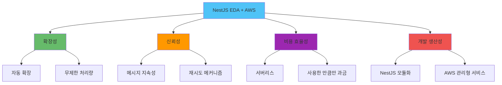
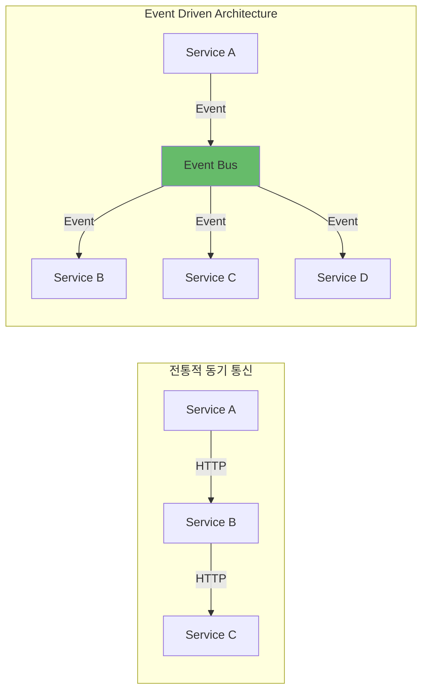
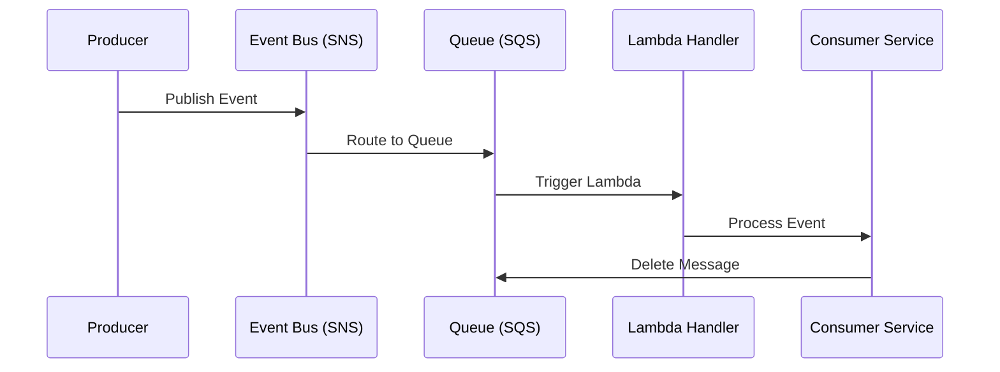
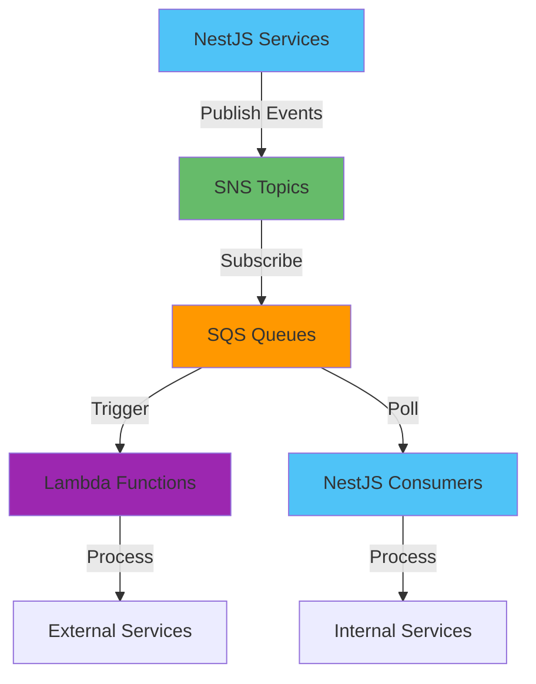
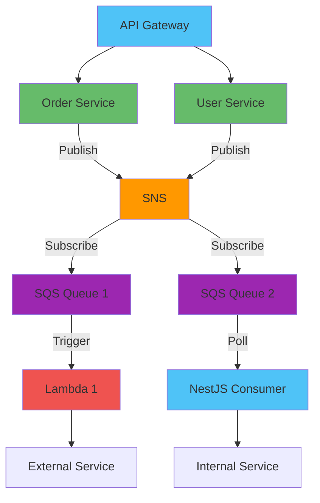

# NestJS Event Driven Architecture with AWS 실전 가이드

## 📋 목차

1. [개요](#개요)
2. [Event Driven Architecture 기본 개념](#event-driven-architecture-기본-개념)
3. [NestJS에서 EDA 구현 패턴](#nestjs에서-eda-구현-패턴)
4. [AWS SNS/SQS를 활용한 이벤트 버스](#aws-snssqs를-활용한-이벤트-버스)
5. [Lambda를 활용한 이벤트 핸들러](#lambda를-활용한-이벤트-핸들러)
6. [NestJS 마이크로서비스와 AWS 통합](#nestjs-마이크로서비스와-aws-통합)
7. [실전 프로젝트 구조](#실전-프로젝트-구조)
8. [테스트 전략](#테스트-전략)
9. [트러블슈팅](#트러블슈팅)

---

## 개요

### Event Driven Architecture란?

Event Driven Architecture(EDA)는 이벤트의 생성, 감지, 소비, 반응을 중심으로 구성된 아키텍처 패턴입니다. 서비스 간 느슨한 결합을 제공하며, 확장성과 유연성을 높입니다.

### NestJS와 AWS를 활용한 EDA의 장점



### 아키텍처 비교



---

## Event Driven Architecture 기본 개념

### 핵심 구성 요소

#### 1. Event Producer (이벤트 생산자)
이벤트를 생성하고 발행하는 서비스

#### 2. Event Bus (이벤트 버스)
이벤트를 라우팅하고 전달하는 중앙 허브

#### 3. Event Consumer (이벤트 소비자)
이벤트를 수신하고 처리하는 서비스

### 이벤트 흐름



### 이벤트 설계 원칙

#### 1. 이벤트는 과거 시제로 명명
- ✅ `order.created`
- ✅ `user.registered`
- ✅ `payment.completed`
- ❌ `create.order`
- ❌ `register.user`

#### 2. 이벤트는 불변(Immutable)
이벤트는 발생한 사실을 기록하므로 변경할 수 없습니다.

#### 3. 이벤트는 자급자족(Self-contained)
이벤트를 처리하는 데 필요한 모든 정보를 포함해야 합니다.

---

## NestJS에서 EDA 구현 패턴

### 패턴 1: 내부 이벤트 버스 (EventEmitter)

간단한 내부 이벤트 처리를 위한 패턴입니다.

#### 이벤트 모듈 생성

```typescript
// src/events/events.module.ts
import { Module } from '@nestjs/common';
import { EventEmitterModule } from '@nestjs/event-emitter';
import { OrdersModule } from '../orders/orders.module';
import { EmailModule } from '../email/email.module';

@Module({
  imports: [
    EventEmitterModule.forRoot({
      wildcard: true,
      delimiter: '.',
      maxListeners: 10,
      verboseMemoryLeak: true,
    }),
    OrdersModule,
    EmailModule,
  ],
})
export class EventsModule {}
```

#### 이벤트 발행

```typescript
// src/orders/orders.service.ts
import { Injectable } from '@nestjs/common';
import { EventEmitter2 } from '@nestjs/event-emitter';

@Injectable()
export class OrdersService {
  constructor(private eventEmitter: EventEmitter2) {}

  async createOrder(orderData: any) {
    const order = await this.saveOrder(orderData);

    // 이벤트 발행
    this.eventEmitter.emit('order.created', {
      orderId: order.id,
      userId: order.userId,
      items: order.items,
      totalAmount: order.totalAmount,
      timestamp: new Date(),
    });

    return order;
  }
}
```

#### 이벤트 구독

```typescript
// src/email/email.service.ts
import { Injectable } from '@nestjs/common';
import { OnEvent } from '@nestjs/event-emitter';

@Injectable()
export class EmailService {
  @OnEvent('order.created')
  async handleOrderCreated(payload: {
    orderId: string;
    userId: string;
    items: any[];
    totalAmount: number;
  }) {
    console.log('Sending order confirmation email:', payload.orderId);
    
    // 이메일 발송 로직
    await this.sendEmail({
      to: payload.userId,
      subject: '주문 확인',
      body: `주문 번호: ${payload.orderId}`,
    });
  }
}
```

### 패턴 2: AWS SNS 기반 이벤트 버스

분산 환경에서 사용하는 패턴입니다.

#### 이벤트 버스 서비스

```typescript
// src/events/aws-event-bus.service.ts
import { Injectable, Logger } from '@nestjs/common';
import { ConfigService } from '@nestjs/config';
import { SNSClient, PublishCommand } from '@aws-sdk/client-sns';

export interface DomainEvent {
  eventType: string;
  eventVersion: string;
  aggregateId: string;
  occurredOn: string;
  data: Record<string, any>;
  metadata?: Record<string, any>;
}

@Injectable()
export class AwsEventBusService {
  private readonly logger = new Logger(AwsEventBusService.name);
  private readonly snsClient: SNSClient;
  private readonly topicArnPrefix: string;

  constructor(private configService: ConfigService) {
    this.snsClient = new SNSClient({
      region: this.configService.get<string>('AWS_REGION'),
    });

    this.topicArnPrefix = this.configService.get<string>('AWS_SNS_TOPIC_ARN_PREFIX');
  }

  /**
   * 도메인 이벤트 발행
   */
  async publish(event: DomainEvent): Promise<string> {
    const topicArn = `${this.topicArnPrefix}:${event.eventType}`;

    try {
      const command = new PublishCommand({
        TopicArn: topicArn,
        Message: JSON.stringify(event),
        MessageAttributes: {
          'event-type': {
            DataType: 'String',
            StringValue: event.eventType,
          },
          'event-version': {
            DataType: 'String',
            StringValue: event.eventVersion,
          },
          'aggregate-id': {
            DataType: 'String',
            StringValue: event.aggregateId,
          },
        },
      });

      const response = await this.snsClient.send(command);
      
      this.logger.log({
        message: 'Event published',
        eventType: event.eventType,
        messageId: response.MessageId,
        aggregateId: event.aggregateId,
      });

      return response.MessageId;
    } catch (error) {
      this.logger.error({
        message: 'Failed to publish event',
        eventType: event.eventType,
        error: error.message,
      });
      throw error;
    }
  }

  /**
   * 여러 이벤트 배치 발행
   */
  async publishBatch(events: DomainEvent[]): Promise<string[]> {
    const results = await Promise.allSettled(
      events.map(event => this.publish(event))
    );

    const messageIds: string[] = [];
    const errors: Error[] = [];

    results.forEach((result, index) => {
      if (result.status === 'fulfilled') {
        messageIds.push(result.value);
      } else {
        errors.push(new Error(`Failed to publish event ${events[index].eventType}: ${result.reason}`));
      }
    });

    if (errors.length > 0) {
      this.logger.error({
        message: 'Some events failed to publish',
        errors: errors.map(e => e.message),
      });
    }

    return messageIds;
  }
}
```

#### 이벤트 팩토리

```typescript
// src/events/event.factory.ts
import { DomainEvent } from './aws-event-bus.service';

export class EventFactory {
  static createOrderCreatedEvent(data: {
    orderId: string;
    userId: string;
    items: Array<{ productId: string; quantity: number }>;
    totalAmount: number;
  }): DomainEvent {
    return {
      eventType: 'order.created',
      eventVersion: '1.0',
      aggregateId: data.orderId,
      occurredOn: new Date().toISOString(),
      data,
      metadata: {
        source: 'order-service',
        correlationId: this.generateCorrelationId(),
      },
    };
  }

  static createUserRegisteredEvent(data: {
    userId: string;
    email: string;
    name: string;
  }): DomainEvent {
    return {
      eventType: 'user.registered',
      eventVersion: '1.0',
      aggregateId: data.userId,
      occurredOn: new Date().toISOString(),
      data,
      metadata: {
        source: 'user-service',
        correlationId: this.generateCorrelationId(),
      },
    };
  }

  private static generateCorrelationId(): string {
    return `${Date.now()}-${Math.random().toString(36).substr(2, 9)}`;
  }
}
```

#### 사용 예제

```typescript
// src/orders/orders.service.ts
import { Injectable } from '@nestjs/common';
import { AwsEventBusService } from '../events/aws-event-bus.service';
import { EventFactory } from '../events/event.factory';

@Injectable()
export class OrdersService {
  constructor(private eventBus: AwsEventBusService) {}

  async createOrder(orderData: any) {
    const order = await this.saveOrder(orderData);

    // 이벤트 생성 및 발행
    const event = EventFactory.createOrderCreatedEvent({
      orderId: order.id,
      userId: order.userId,
      items: order.items,
      totalAmount: order.totalAmount,
    });

    await this.eventBus.publish(event);

    return order;
  }
}
```

---

## AWS SNS/SQS를 활용한 이벤트 버스

### 이벤트 버스 아키텍처



### SQS 기반 이벤트 소비자 구현

#### 이벤트 소비자 서비스

```typescript
// src/events/sqs-event-consumer.service.ts
import { Injectable, Logger, OnModuleInit, OnModuleDestroy } from '@nestjs/common';
import { ConfigService } from '@nestjs/config';
import {
  SQSClient,
  ReceiveMessageCommand,
  DeleteMessageCommand,
} from '@aws-sdk/client-sqs';
import { DomainEvent } from './aws-event-bus.service';

export interface EventHandler {
  handle(event: DomainEvent): Promise<void>;
}

@Injectable()
export class SqsEventConsumerService implements OnModuleInit, OnModuleDestroy {
  private readonly logger = new Logger(SqsEventConsumerService.name);
  private readonly sqsClient: SQSClient;
  private readonly queueUrl: string;
  private readonly handlers = new Map<string, EventHandler[]>();
  private isPolling = false;
  private pollingInterval: NodeJS.Timeout;

  constructor(private configService: ConfigService) {
    this.sqsClient = new SQSClient({
      region: this.configService.get<string>('AWS_REGION'),
    });

    this.queueUrl = this.configService.get<string>('EVENT_QUEUE_URL');
  }

  /**
   * 이벤트 핸들러 등록
   */
  registerHandler(eventType: string, handler: EventHandler) {
    if (!this.handlers.has(eventType)) {
      this.handlers.set(eventType, []);
    }
    this.handlers.get(eventType)!.push(handler);
  }

  /**
   * 모듈 초기화 시 폴링 시작
   */
  async onModuleInit() {
    this.logger.log('Starting event consumer polling');
    this.startPolling();
  }

  /**
   * 모듈 종료 시 폴링 중지
   */
  async onModuleDestroy() {
    this.logger.log('Stopping event consumer polling');
    this.stopPolling();
  }

  /**
   * 메시지 폴링 시작
   */
  private startPolling() {
    this.isPolling = true;
    this.poll();
  }

  /**
   * 메시지 폴링 중지
   */
  private stopPolling() {
    this.isPolling = false;
    if (this.pollingInterval) {
      clearTimeout(this.pollingInterval);
    }
  }

  /**
   * 메시지 폴링 및 처리
   */
  private async poll() {
    if (!this.isPolling) {
      return;
    }

    try {
      const command = new ReceiveMessageCommand({
        QueueUrl: this.queueUrl,
        MaxNumberOfMessages: 10,
        WaitTimeSeconds: 20, // Long Polling
        MessageAttributeNames: ['All'],
      });

      const response = await this.sqsClient.send(command);

      if (response.Messages && response.Messages.length > 0) {
        await this.processMessages(response.Messages);
      }

      // 다음 폴링 예약
      this.pollingInterval = setTimeout(() => this.poll(), 100);
    } catch (error) {
      this.logger.error('Error polling messages:', error);
      // 에러 발생 시 잠시 대기 후 재시도
      this.pollingInterval = setTimeout(() => this.poll(), 5000);
    }
  }

  /**
   * 메시지 처리
   */
  private async processMessages(messages: any[]) {
    const promises = messages.map(async (message) => {
      try {
        // SNS 메시지 형식 파싱
        const snsMessage = JSON.parse(message.Body);
        const event: DomainEvent = JSON.parse(snsMessage.Message);

        // 이벤트 타입에 맞는 핸들러 실행
        const handlers = this.handlers.get(event.eventType) || [];
        
        await Promise.all(
          handlers.map(handler => handler.handle(event))
        );

        // 처리 완료 후 메시지 삭제
        await this.deleteMessage(message.ReceiptHandle);
        
        this.logger.log({
          message: 'Event processed successfully',
          eventType: event.eventType,
          aggregateId: event.aggregateId,
        });
      } catch (error) {
        this.logger.error({
          message: 'Failed to process event',
          error: error.message,
          messageId: message.MessageId,
        });
        // 에러 발생 시 메시지는 삭제하지 않음 (재시도)
      }
    });

    await Promise.allSettled(promises);
  }

  /**
   * 메시지 삭제
   */
  private async deleteMessage(receiptHandle: string) {
    try {
      const command = new DeleteMessageCommand({
        QueueUrl: this.queueUrl,
        ReceiptHandle: receiptHandle,
      });

      await this.sqsClient.send(command);
    } catch (error) {
      this.logger.error('Failed to delete message:', error);
    }
  }
}
```

#### 이벤트 핸들러 데코레이터

```typescript
// src/events/event-handler.decorator.ts
import { SetMetadata } from '@nestjs/common';

export const EVENT_HANDLER_KEY = 'event:handler';

export const EventHandler = (eventType: string) =>
  SetMetadata(EVENT_HANDLER_KEY, eventType);
```

#### 이벤트 핸들러 구현

```typescript
// src/email/email.event-handler.ts
import { Injectable, Logger } from '@nestjs/common';
import { EventHandler } from '../events/event-handler.decorator';
import { DomainEvent, EventHandler as IEventHandler } from '../events/sqs-event-consumer.service';

@Injectable()
export class EmailEventHandler implements IEventHandler {
  private readonly logger = new Logger(EmailEventHandler.name);

  @EventHandler('order.created')
  async handleOrderCreated(event: DomainEvent) {
    this.logger.log(`Handling order.created event: ${event.aggregateId}`);
    
    const { orderId, userId, totalAmount } = event.data;
    
    // 이메일 발송 로직
    await this.sendOrderConfirmationEmail(userId, {
      orderId,
      totalAmount,
    });
  }

  @EventHandler('user.registered')
  async handleUserRegistered(event: DomainEvent) {
    this.logger.log(`Handling user.registered event: ${event.aggregateId}`);
    
    const { userId, email, name } = event.data;
    
    // 환영 이메일 발송
    await this.sendWelcomeEmail(email, { name });
  }

  async handle(event: DomainEvent): Promise<void> {
    // 이벤트 타입에 따라 적절한 메서드 호출
    switch (event.eventType) {
      case 'order.created':
        await this.handleOrderCreated(event);
        break;
      case 'user.registered':
        await this.handleUserRegistered(event);
        break;
      default:
        this.logger.warn(`Unknown event type: ${event.eventType}`);
    }
  }

  private async sendOrderConfirmationEmail(userId: string, data: any) {
    // 이메일 발송 구현
  }

  private async sendWelcomeEmail(email: string, data: any) {
    // 이메일 발송 구현
  }
}
```

---

## Lambda를 활용한 이벤트 핸들러

### Lambda 함수 구조

#### Lambda 핸들러 예제

```typescript
// lambda/order-processor/index.ts
import { SQSHandler, SQSEvent } from 'aws-lambda';
import { DynamoDBClient } from '@aws-sdk/client-dynamodb';
import { DynamoDBDocumentClient, PutCommand } from '@aws-sdk/lib-dynamodb';

const dynamoClient = DynamoDBDocumentClient.from(new DynamoDBClient({}));

interface OrderCreatedEvent {
  eventType: 'order.created';
  eventVersion: string;
  aggregateId: string;
  occurredOn: string;
  data: {
    orderId: string;
    userId: string;
    items: Array<{ productId: string; quantity: number }>;
    totalAmount: number;
  };
}

export const handler: SQSHandler = async (event: SQSEvent) => {
  console.log('Received SQS event:', JSON.stringify(event, null, 2));

  for (const record of event.Records) {
    try {
      // SNS 메시지 파싱
      const snsMessage = JSON.parse(record.body);
      const domainEvent: OrderCreatedEvent = JSON.parse(snsMessage.Message);

      console.log('Processing event:', domainEvent.eventType);

      // 이벤트 타입별 처리
      switch (domainEvent.eventType) {
        case 'order.created':
          await handleOrderCreated(domainEvent);
          break;
        default:
          console.warn(`Unknown event type: ${domainEvent.eventType}`);
      }
    } catch (error) {
      console.error('Error processing event:', error);
      throw error; // 재시도 트리거
    }
  }
};

async function handleOrderCreated(event: OrderCreatedEvent) {
  const { orderId, userId, items, totalAmount } = event.data;

  // 주문 정보를 DynamoDB에 저장
  await dynamoClient.send(
    new PutCommand({
      TableName: process.env.ORDERS_TABLE_NAME!,
      Item: {
        orderId,
        userId,
        items,
        totalAmount,
        status: 'created',
        createdAt: new Date().toISOString(),
      },
    })
  );

  // 재고 차감 로직
  for (const item of items) {
    await updateInventory(item.productId, item.quantity);
  }

  console.log(`Order ${orderId} processed successfully`);
}

async function updateInventory(productId: string, quantity: number) {
  // 재고 업데이트 로직
  console.log(`Updating inventory for product ${productId}: -${quantity}`);
}
```

### Lambda 배포 설정

#### serverless.yml 예제

```yaml
service: order-processor

provider:
  name: aws
  runtime: nodejs18.x
  region: ap-northeast-2
  environment:
    ORDERS_TABLE_NAME: ${self:custom.ordersTableName}
  iam:
    role:
      statements:
        - Effect: Allow
          Action:
            - dynamodb:PutItem
            - dynamodb:UpdateItem
          Resource: arn:aws:dynamodb:${self:provider.region}:*:table/${self:provider.environment.ORDERS_TABLE_NAME}

functions:
  orderProcessor:
    handler: lambda/order-processor/index.handler
    events:
      - sqs:
          arn: arn:aws:sqs:${self:provider.region}:*:order-queue
          batchSize: 10
          maximumBatchingWindowInSeconds: 5
    timeout: 30
    memorySize: 256
    reservedConcurrentExecutions: 10

resources:
  Resources:
    OrdersTable:
      Type: AWS::DynamoDB::Table
      Properties:
        TableName: ${self:provider.environment.ORDERS_TABLE_NAME}
        BillingMode: PAY_PER_REQUEST
        AttributeDefinitions:
          - AttributeName: orderId
            AttributeType: S
        KeySchema:
          - AttributeName: orderId
            KeyType: HASH
```

---

## NestJS 마이크로서비스와 AWS 통합

### 하이브리드 아키텍처



### NestJS 마이크로서비스 설정

#### 마이크로서비스 모듈

```typescript
// src/app.module.ts
import { Module } from '@nestjs/common';
import { ConfigModule } from '@nestjs/config';
import { OrdersModule } from './orders/orders.module';
import { EventsModule } from './events/events.module';

@Module({
  imports: [
    ConfigModule.forRoot({
      isGlobal: true,
    }),
    EventsModule,
    OrdersModule,
  ],
})
export class AppModule {}
```

#### 이벤트 모듈 통합

```typescript
// src/events/events.module.ts
import { Module } from '@nestjs/common';
import { AwsEventBusService } from './aws-event-bus.service';
import { SqsEventConsumerService } from './sqs-event-consumer.service';
import { EmailEventHandler } from '../email/email.event-handler';

@Module({
  providers: [
    AwsEventBusService,
    SqsEventConsumerService,
    EmailEventHandler,
  ],
  exports: [AwsEventBusService],
})
export class EventsModule {
  constructor(
    private consumer: SqsEventConsumerService,
    private emailHandler: EmailEventHandler,
  ) {
    // 이벤트 핸들러 등록
    this.consumer.registerHandler('order.created', this.emailHandler);
    this.consumer.registerHandler('user.registered', this.emailHandler);
  }
}
```

---

## 실전 프로젝트 구조

### 프로젝트 디렉토리 구조

```
project/
├── src/
│   ├── events/
│   │   ├── aws-event-bus.service.ts
│   │   ├── sqs-event-consumer.service.ts
│   │   ├── event.factory.ts
│   │   ├── event-handler.decorator.ts
│   │   └── events.module.ts
│   ├── orders/
│   │   ├── orders.controller.ts
│   │   ├── orders.service.ts
│   │   └── orders.module.ts
│   ├── email/
│   │   ├── email.service.ts
│   │   ├── email.event-handler.ts
│   │   └── email.module.ts
│   └── app.module.ts
├── lambda/
│   ├── order-processor/
│   │   ├── index.ts
│   │   └── package.json
│   └── inventory-updater/
│       ├── index.ts
│       └── package.json
├── infrastructure/
│   ├── terraform/
│   │   ├── sns.tf
│   │   ├── sqs.tf
│   │   └── lambda.tf
│   └── serverless/
│       └── serverless.yml
├── test/
│   ├── unit/
│   ├── integration/
│   └── e2e/
└── package.json
```

### Terraform 인프라 설정

#### SNS Topic 생성

```hcl
# infrastructure/terraform/sns.tf
resource "aws_sns_topic" "order_events" {
  name              = "order-events"
  display_name      = "Order Events"
  
  tags = {
    Environment = var.environment
    Service     = "order-service"
  }
}

resource "aws_sns_topic" "user_events" {
  name              = "user-events"
  display_name      = "User Events"
  
  tags = {
    Environment = var.environment
    Service     = "user-service"
  }
}
```

#### SQS Queue 및 구독 설정

```hcl
# infrastructure/terraform/sqs.tf
resource "aws_sqs_queue" "order_email_queue" {
  name                      = "order-email-queue"
  visibility_timeout_seconds = 300
  message_retention_seconds  = 1209600
  receive_wait_time_seconds  = 20

  redrive_policy = jsonencode({
    deadLetterTargetArn = aws_sqs_queue.order_email_dlq.arn
    maxReceiveCount     = 3
  })
}

resource "aws_sqs_queue" "order_email_dlq" {
  name = "order-email-queue-dlq"
}

resource "aws_sns_topic_subscription" "order_email_subscription" {
  topic_arn = aws_sns_topic.order_events.arn
  protocol  = "sqs"
  endpoint  = aws_sqs_queue.order_email_queue.arn
}

resource "aws_sqs_queue_policy" "order_email_queue_policy" {
  queue_url = aws_sqs_queue.order_email_queue.id

  policy = jsonencode({
    Version = "2012-10-17"
    Statement = [
      {
        Effect = "Allow"
        Principal = "*"
        Action   = "sqs:SendMessage"
        Resource = aws_sqs_queue.order_email_queue.arn
        Condition = {
          ArnEquals = {
            "aws:SourceArn" = aws_sns_topic.order_events.arn
          }
        }
      }
    ]
  })
}
```

---

## 테스트 전략

### 단위 테스트

```typescript
// src/events/aws-event-bus.service.spec.ts
import { Test, TestingModule } from '@nestjs/testing';
import { ConfigService } from '@nestjs/config';
import { AwsEventBusService } from './aws-event-bus.service';
import { SNSClient } from '@aws-sdk/client-sns';

describe('AwsEventBusService', () => {
  let service: AwsEventBusService;
  let snsClient: jest.Mocked<SNSClient>;

  beforeEach(async () => {
    const module: TestingModule = await Test.createTestingModule({
      providers: [
        AwsEventBusService,
        {
          provide: ConfigService,
          useValue: {
            get: jest.fn((key: string) => {
              const config = {
                AWS_REGION: 'ap-northeast-2',
                AWS_SNS_TOPIC_ARN_PREFIX: 'arn:aws:sns:ap-northeast-2:123456789012',
              };
              return config[key];
            }),
          },
        },
      ],
    }).compile();

    service = module.get<AwsEventBusService>(AwsEventBusService);
  });

  it('should publish event successfully', async () => {
    const event = {
      eventType: 'order.created',
      eventVersion: '1.0',
      aggregateId: 'order-123',
      occurredOn: new Date().toISOString(),
      data: { orderId: 'order-123', userId: 'user-456' },
    };

    const messageId = await service.publish(event);

    expect(messageId).toBeDefined();
  });
});
```

### 통합 테스트 (LocalStack)

```typescript
// test/integration/event-bus.integration.spec.ts
import { Test, TestingModule } from '@nestjs/testing';
import { AwsEventBusService } from '../../src/events/aws-event-bus.service';
import { SqsEventConsumerService } from '../../src/events/sqs-event-consumer.service';

describe('Event Bus Integration', () => {
  let eventBus: AwsEventBusService;
  let consumer: SqsEventConsumerService;

  beforeAll(async () => {
    // LocalStack 환경 설정
    process.env.AWS_ENDPOINT = 'http://localhost:4566';
    process.env.AWS_REGION = 'us-east-1';

    const module: TestingModule = await Test.createTestingModule({
      providers: [AwsEventBusService, SqsEventConsumerService, ConfigService],
    }).compile();

    eventBus = module.get<AwsEventBusService>(AwsEventBusService);
    consumer = module.get<SqsEventConsumerService>(SqsEventConsumerService);
  });

  it('should publish and consume event', async () => {
    const event = {
      eventType: 'order.created',
      eventVersion: '1.0',
      aggregateId: 'order-123',
      occurredOn: new Date().toISOString(),
      data: { orderId: 'order-123', userId: 'user-456' },
    };

    // 이벤트 발행
    const messageId = await eventBus.publish(event);
    expect(messageId).toBeDefined();

    // 잠시 대기
    await new Promise(resolve => setTimeout(resolve, 2000));

    // 이벤트 소비 확인 (실제로는 핸들러에서 확인)
  });
});
```

---

## 트러블슈팅

### 일반적인 문제

#### 문제 1: 이벤트가 발행되었지만 소비되지 않음

**원인:**
- SNS Topic과 SQS Queue 구독 설정 오류
- IAM 권한 부족

**해결:**
```bash
# SNS 구독 확인
aws sns list-subscriptions-by-topic --topic-arn <topic-arn>

# SQS Queue 정책 확인
aws sqs get-queue-attributes --queue-url <queue-url> --attribute-names Policy
```

#### 문제 2: 이벤트 중복 처리

**원인:**
- 멱등성 키 미사용
- Standard Queue 사용 시 중복 가능

**해결:**
- FIFO Queue 사용
- DynamoDB 조건부 쓰기로 멱등성 보장

---

## 참고 자료

### NestJS 관련
- [NestJS Event Emitter](https://docs.nestjs.com/techniques/events)
- [NestJS Microservices](https://docs.nestjs.com/microservices/basics)

### AWS 관련
- [AWS SNS 개발자 가이드](https://docs.aws.amazon.com/ko_kr/sns/latest/dg/welcome.html)
- [AWS SQS 개발자 가이드](https://docs.aws.amazon.com/ko_kr/AWSSimpleQueueService/latest/SQSDeveloperGuide/welcome.html)
- [AWS Lambda 개발자 가이드](https://docs.aws.amazon.com/ko_kr/lambda/latest/dg/welcome.html)

### 도구
- [LocalStack](https://localstack.cloud/)
- [Serverless Framework](https://www.serverless.com/)
- [Terraform AWS Provider](https://registry.terraform.io/providers/hashicorp/aws/latest/docs)

---

**문서 작성일:** 2025-01-16  
**최종 업데이트:** 2025-01-16


