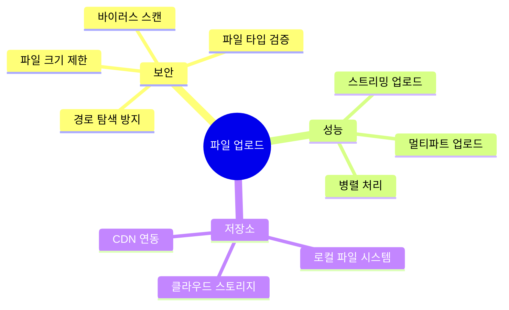
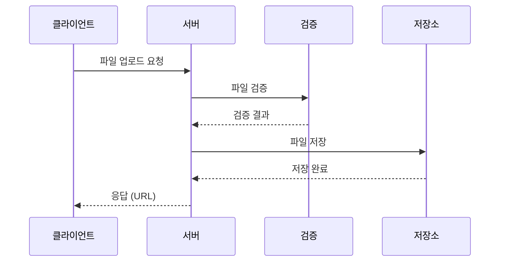
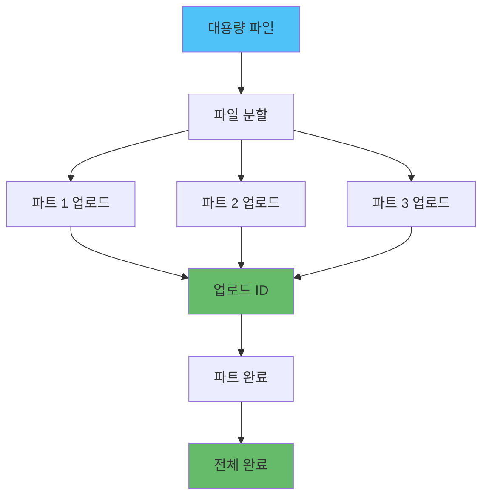

# Node.js 파일 업로드 및 처리

## 개요

파일 업로드는 현대 웹 애플리케이션의 핵심 기능으로, 사용자 생성 콘텐츠, 프로필 이미지, 문서 등을 처리합니다.

### 파일 업로드의 주요 고려사항



### 파일 업로드 흐름



## Multer 설정 및 최적화

Multer는 Node.js에서 multipart/form-data를 처리하는 미들웨어로, 파일 업로드를 위한 가장 널리 사용되는 라이브러리입니다. Express와 함께 사용하여 파일을 메모리나 디스크에 저장할 수 있습니다.

### Multer 기본 설정

```javascript
const multer = require('multer');
const path = require('path');
const fs = require('fs');

// 업로드 디렉토리 생성
const uploadDir = 'uploads';
if (!fs.existsSync(uploadDir)) {
  fs.mkdirSync(uploadDir, { recursive: true });
}

// 저장소 설정
const storage = multer.diskStorage({
  destination: (req, file, cb) => {
    // 파일 타입별 디렉토리 분리
    let dir = uploadDir;
    if (file.mimetype.startsWith('image/')) {
      dir = path.join(uploadDir, 'images');
    } else if (file.mimetype.startsWith('video/')) {
      dir = path.join(uploadDir, 'videos');
    } else {
      dir = path.join(uploadDir, 'documents');
    }
    
    if (!fs.existsSync(dir)) {
      fs.mkdirSync(dir, { recursive: true });
    }
    
    cb(null, dir);
  },
  filename: (req, file, cb) => {
    // 고유한 파일명 생성
    const uniqueSuffix = Date.now() + '-' + Math.round(Math.random() * 1E9);
    const ext = path.extname(file.originalname);
    const name = path.basename(file.originalname, ext);
    cb(null, `${name}-${uniqueSuffix}${ext}`);
  }
});

// 파일 필터
const fileFilter = (req, file, cb) => {
  // 허용된 파일 타입
  const allowedTypes = /jpeg|jpg|png|gif|pdf|doc|docx/;
  const extname = allowedTypes.test(path.extname(file.originalname).toLowerCase());
  const mimetype = allowedTypes.test(file.mimetype);
  
  if (extname && mimetype) {
    cb(null, true);
  } else {
    cb(new Error('Invalid file type. Only images and documents are allowed.'));
  }
};

// Multer 설정
const upload = multer({
  storage: storage,
  limits: {
    fileSize: 10 * 1024 * 1024, // 10MB
    files: 5 // 최대 5개 파일
  },
  fileFilter: fileFilter
});

// Express 라우터 - 단일 파일 업로드
app.post('/upload', upload.single('file'), (req, res) => {
  if (!req.file) {
    return res.status(400).json({ error: 'No file uploaded' });
  }
  
  res.json({
    message: 'File uploaded successfully',
    file: {
      filename: req.file.filename,
      originalname: req.file.originalname,
      mimetype: req.file.mimetype,
      size: req.file.size,
      path: req.file.path
    }
  });
});

// 여러 파일 업로드
app.post('/upload/multiple', upload.array('files', 5), (req, res) => {
  if (!req.files || req.files.length === 0) {
    return res.status(400).json({ error: 'No files uploaded' });
  }
  
  const files = req.files.map(file => ({
    filename: file.filename,
    originalname: file.originalname,
    mimetype: file.mimetype,
    size: file.size,
    path: file.path
  }));
  
  res.json({
    message: 'Files uploaded successfully',
    files
  });
});

// 에러 처리 미들웨어
app.use((error, req, res, next) => {
  if (error instanceof multer.MulterError) {
    if (error.code === 'LIMIT_FILE_SIZE') {
      return res.status(400).json({ error: 'File too large' });
    }
    if (error.code === 'LIMIT_FILE_COUNT') {
      return res.status(400).json({ error: 'Too many files' });
    }
    if (error.code === 'LIMIT_UNEXPECTED_FILE') {
      return res.status(400).json({ error: 'Unexpected file field' });
    }
  }
  
  if (error.message === 'Invalid file type. Only images and documents are allowed.') {
    return res.status(400).json({ error: error.message });
  }
  
  res.status(500).json({ error: 'Upload failed' });
});
```

### 메모리 스토리지

메모리 스토리지는 파일을 디스크에 저장하지 않고 메모리에 임시로 보관합니다. 클라우드 스토리지로 바로 전송하거나 이미지 처리 후 저장할 때 유용합니다. 단, 메모리 사용량이 증가하므로 대용량 파일에는 주의가 필요합니다.

```javascript
const multer = require('multer');

// 메모리 스토리지 설정
const memoryStorage = multer.memoryStorage();

const upload = multer({
  storage: memoryStorage,
  limits: {
    fileSize: 10 * 1024 * 1024 // 10MB
  }
});

// S3 업로드 헬퍼 함수
async function uploadToS3(buffer, filename) {
  const AWS = require('aws-sdk');
  const s3 = new AWS.S3({
    accessKeyId: process.env.AWS_ACCESS_KEY_ID,
    secretAccessKey: process.env.AWS_SECRET_ACCESS_KEY,
    region: process.env.AWS_REGION
  });
  
  const key = `uploads/${Date.now()}-${filename}`;
  const params = {
    Bucket: process.env.S3_BUCKET_NAME,
    Key: key,
    Body: buffer,
    ContentType: 'application/octet-stream'
  };
  
  const result = await s3.upload(params).promise();
  return result.Location;
}

app.post('/upload-to-s3', upload.single('file'), async (req, res) => {
  if (!req.file) {
    return res.status(400).json({ error: 'No file uploaded' });
  }
  
  try {
    // S3에 업로드
    const s3Url = await uploadToS3(req.file.buffer, req.file.originalname);
    
    res.json({
      message: 'File uploaded to S3',
      url: s3Url
    });
  } catch (error) {
    res.status(500).json({ error: error.message });
  }
});
```

## S3 업로드

AWS S3는 확장 가능한 객체 스토리지 서비스로, 파일을 안전하게 저장하고 전 세계 어디서나 접근할 수 있습니다. multer-s3를 사용하면 Multer와 S3를 직접 연동할 수 있습니다.

### 기본 S3 업로드

```javascript
const AWS = require('aws-sdk');
const multer = require('multer');
const multerS3 = require('multer-s3');
const path = require('path');

// S3 설정
const s3 = new AWS.S3({
  accessKeyId: process.env.AWS_ACCESS_KEY_ID,
  secretAccessKey: process.env.AWS_SECRET_ACCESS_KEY,
  region: process.env.AWS_REGION
});

// S3 스토리지 설정
const s3Storage = multerS3({
  s3: s3,
  bucket: process.env.S3_BUCKET_NAME,
  acl: 'public-read',
  key: (req, file, cb) => {
    const folder = file.mimetype.startsWith('image/') ? 'images' : 'documents';
    const uniqueSuffix = Date.now() + '-' + Math.round(Math.random() * 1E9);
    const ext = path.extname(file.originalname);
    const filename = `${folder}/${uniqueSuffix}${ext}`;
    cb(null, filename);
  },
  contentType: multerS3.AUTO_CONTENT_TYPE
});

const upload = multer({
  storage: s3Storage,
  limits: {
    fileSize: 50 * 1024 * 1024 // 50MB
  }
});

app.post('/upload-s3', upload.single('file'), (req, res) => {
  if (!req.file) {
    return res.status(400).json({ error: 'No file uploaded' });
  }
  
  res.json({
    message: 'File uploaded to S3',
    url: req.file.location,
    key: req.file.key,
    size: req.file.size,
    mimetype: req.file.mimetype
  });
});
```

### 멀티파트 업로드

멀티파트 업로드는 대용량 파일을 여러 작은 파트로 나누어 업로드하는 방식입니다. 네트워크 오류 발생 시 전체 파일을 다시 업로드할 필요 없이 실패한 파트만 재시도할 수 있어 효율적입니다. 일반적으로 100MB 이상의 파일에 사용합니다.



#### 멀티파트 업로드 구현

```javascript
const AWS = require('aws-sdk');
const fs = require('fs');
const path = require('path');

class S3MultipartUpload {
  constructor(options = {}) {
    this.s3 = new AWS.S3({
      accessKeyId: process.env.AWS_ACCESS_KEY_ID,
      secretAccessKey: process.env.AWS_SECRET_ACCESS_KEY,
      region: process.env.AWS_REGION
    });
    this.bucket = process.env.S3_BUCKET_NAME;
    this.partSize = options.partSize || 5 * 1024 * 1024; // 기본 5MB
    this.maxRetries = options.maxRetries || 3;
    this.onProgress = options.onProgress || null;
  }
  
  // 파트 업로드 재시도 로직
  async uploadPartWithRetry(params, retries = 0) {
    try {
      const { ETag } = await this.s3.uploadPart(params).promise();
      return ETag;
    } catch (error) {
      if (retries < this.maxRetries) {
        await new Promise(resolve => setTimeout(resolve, 1000 * (retries + 1)));
        return this.uploadPartWithRetry(params, retries + 1);
      }
      throw error;
    }
  }
  
  async uploadLargeFile(filePath, key) {
    const fileSize = fs.statSync(filePath).size;
    const partCount = Math.ceil(fileSize / this.partSize);
    
    // 멀티파트 업로드 시작
    const { UploadId } = await this.s3.createMultipartUpload({
      Bucket: this.bucket,
      Key: key,
      ContentType: 'application/octet-stream'
    }).promise();
    
    const parts = [];
    
    try {
      // 각 파트 업로드
      for (let partNumber = 1; partNumber <= partCount; partNumber++) {
        const start = (partNumber - 1) * this.partSize;
        const end = Math.min(start + this.partSize, fileSize);
        
        const partData = fs.createReadStream(filePath, { start, end });
        
        const ETag = await this.uploadPartWithRetry({
          Bucket: this.bucket,
          Key: key,
          PartNumber: partNumber,
          UploadId: UploadId,
          Body: partData
        });
        
        parts.push({
          ETag,
          PartNumber: partNumber
        });
        
        // 진행률 콜백 호출
        if (this.onProgress) {
          const progress = Math.round((partNumber / partCount) * 100);
          this.onProgress(progress, partNumber, partCount);
        }
      }
      
      // 멀티파트 업로드 완료
      const { Location } = await this.s3.completeMultipartUpload({
        Bucket: this.bucket,
        Key: key,
        UploadId: UploadId,
        MultipartUpload: {
          Parts: parts
        }
      }).promise();
      
      return Location;
    } catch (error) {
      // 실패 시 업로드 취소
      try {
        await this.s3.abortMultipartUpload({
          Bucket: this.bucket,
          Key: key,
          UploadId: UploadId
        }).promise();
      } catch (abortError) {
        console.error('Failed to abort multipart upload:', abortError);
      }
      throw error;
    }
  }
  
  // 스트림을 통한 멀티파트 업로드
  async uploadLargeFileStream(stream, key, fileSize) {
    const partCount = Math.ceil(fileSize / this.partSize);
    
    // 멀티파트 업로드 시작
    const { UploadId } = await this.s3.createMultipartUpload({
      Bucket: this.bucket,
      Key: key,
      ContentType: 'application/octet-stream'
    }).promise();
    
    const parts = [];
    let partNumber = 1;
    let buffer = Buffer.alloc(0);
    let uploadedBytes = 0;
    
    return new Promise((resolve, reject) => {
      const uploadPromises = [];
      
      stream.on('data', (chunk) => {
        buffer = Buffer.concat([buffer, chunk]);
        
        while (buffer.length >= this.partSize) {
          const partData = buffer.slice(0, this.partSize);
          buffer = buffer.slice(this.partSize);
          
          const currentPartNumber = partNumber++;
          const uploadPromise = this.uploadPartWithRetry({
            Bucket: this.bucket,
            Key: key,
            PartNumber: currentPartNumber,
            UploadId: UploadId,
            Body: partData
          }).then(ETag => {
            parts.push({
              ETag,
              PartNumber: currentPartNumber
            });
            
            uploadedBytes += partData.length;
            if (this.onProgress) {
              const progress = Math.round((uploadedBytes / fileSize) * 100);
              this.onProgress(progress, currentPartNumber, partCount);
            }
          });
          
          uploadPromises.push(uploadPromise);
        }
      });
      
      stream.on('end', async () => {
        // 마지막 파트 업로드
        if (buffer.length > 0) {
          const currentPartNumber = partNumber;
          try {
            const ETag = await this.uploadPartWithRetry({
              Bucket: this.bucket,
              Key: key,
              PartNumber: currentPartNumber,
              UploadId: UploadId,
              Body: buffer
            });
            
            parts.push({
              ETag,
              PartNumber: currentPartNumber
            });
            
            uploadedBytes += buffer.length;
            if (this.onProgress) {
              this.onProgress(100, currentPartNumber, partCount);
            }
          } catch (error) {
            reject(error);
            return;
          }
        }
        
        // 모든 파트 업로드 완료 대기
        try {
          await Promise.all(uploadPromises);
          
          // 파트 번호 순서대로 정렬
          parts.sort((a, b) => a.PartNumber - b.PartNumber);
          
          // 멀티파트 업로드 완료
          const { Location } = await this.s3.completeMultipartUpload({
            Bucket: this.bucket,
            Key: key,
            UploadId: UploadId,
            MultipartUpload: {
              Parts: parts
            }
          }).promise();
          
          resolve(Location);
        } catch (error) {
          // 실패 시 업로드 취소
          try {
            await this.s3.abortMultipartUpload({
              Bucket: this.bucket,
              Key: key,
              UploadId: UploadId
            }).promise();
          } catch (abortError) {
            console.error('Failed to abort multipart upload:', abortError);
          }
          reject(error);
        }
      });
      
      stream.on('error', async (error) => {
        // 스트림 에러 시 업로드 취소
        try {
          await this.s3.abortMultipartUpload({
            Bucket: this.bucket,
            Key: key,
            UploadId: UploadId
          }).promise();
        } catch (abortError) {
          console.error('Failed to abort multipart upload:', abortError);
        }
        reject(error);
      });
    });
  }
}

// 사용 예시
app.post('/upload-large', upload.single('file'), async (req, res) => {
  if (!req.file) {
    return res.status(400).json({ error: 'No file uploaded' });
  }
  
  const key = `uploads/${Date.now()}-${req.file.originalname}`;
  
  // 진행률 추적을 위한 콜백 함수
  const onProgress = (progress, partNumber, totalParts) => {
    console.log(`Upload progress: ${progress}% (${partNumber}/${totalParts})`);
    // WebSocket이나 Server-Sent Events로 클라이언트에 진행률 전송 가능
  };
  
  const multipartUpload = new S3MultipartUpload({
    partSize: 10 * 1024 * 1024, // 10MB per part
    maxRetries: 3,
    onProgress: onProgress
  });
  
  try {
    const url = await multipartUpload.uploadLargeFile(req.file.path, key);
    
    // 임시 파일 삭제
    if (fs.existsSync(req.file.path)) {
      fs.unlinkSync(req.file.path);
    }
    
    res.json({
      message: 'Large file uploaded successfully',
      url,
      key
    });
  } catch (error) {
    // 에러 발생 시 임시 파일 정리
    if (fs.existsSync(req.file.path)) {
      fs.unlinkSync(req.file.path);
    }
    res.status(500).json({ error: error.message });
  }
});
```

## 이미지 리사이징 및 최적화

이미지 파일은 용량이 크고 다양한 디바이스에서 표시되므로, 업로드 시 여러 크기로 리사이징하고 최적화하는 것이 중요합니다. Sharp는 Node.js에서 가장 빠른 이미지 처리 라이브러리로, 리사이징, 포맷 변환, 품질 조정 등을 효율적으로 처리합니다.

### Sharp를 사용한 이미지 처리

```javascript
const sharp = require('sharp');
const multer = require('multer');
const path = require('path');

// 메모리 스토리지
const upload = multer({
  storage: multer.memoryStorage(),
  fileFilter: (req, file, cb) => {
    if (file.mimetype.startsWith('image/')) {
      cb(null, true);
    } else {
      cb(new Error('Only images are allowed'));
    }
  },
  limits: {
    fileSize: 10 * 1024 * 1024 // 10MB
  }
});

// 이미지 리사이징 및 최적화
async function processImage(buffer, options = {}) {
  const {
    width = 800,
    height = 600,
    quality = 80,
    format = 'jpeg'
  } = options;
  
  let image = sharp(buffer);
  
  // 메타데이터 가져오기
  const metadata = await image.metadata();
  
  // 리사이징
  image = image.resize(width, height, {
    fit: 'inside',
    withoutEnlargement: true
  });
  
  // 포맷 변환 및 최적화
  if (format === 'jpeg' || format === 'jpg') {
    image = image.jpeg({ quality });
  } else if (format === 'png') {
    image = image.png({ compressionLevel: 9 });
  } else if (format === 'webp') {
    image = image.webp({ quality });
  }
  
  return {
    buffer: await image.toBuffer(),
    metadata: {
      width: metadata.width,
      height: metadata.height,
      format: metadata.format
    }
  };
}

// 여러 크기로 리사이징
async function generateThumbnails(buffer) {
  const sizes = [
    { name: 'thumbnail', width: 150, height: 150 },
    { name: 'small', width: 400, height: 400 },
    { name: 'medium', width: 800, height: 800 },
    { name: 'large', width: 1200, height: 1200 }
  ];
  
  const thumbnails = {};
  
  for (const size of sizes) {
    const { buffer: resized } = await processImage(buffer, {
      width: size.width,
      height: size.height,
      format: 'webp',
      quality: 85
    });
    
    thumbnails[size.name] = resized;
  }
  
  return thumbnails;
}

// S3 업로드 헬퍼 함수
async function uploadToS3(buffer, key, contentType = 'application/octet-stream') {
  const AWS = require('aws-sdk');
  const s3 = new AWS.S3({
    accessKeyId: process.env.AWS_ACCESS_KEY_ID,
    secretAccessKey: process.env.AWS_SECRET_ACCESS_KEY,
    region: process.env.AWS_REGION
  });
  
  const params = {
    Bucket: process.env.S3_BUCKET_NAME,
    Key: key,
    Body: buffer,
    ContentType: contentType,
    ACL: 'public-read'
  };
  
  const result = await s3.upload(params).promise();
  return result.Location;
}

// Express 라우터
app.post('/upload-image', upload.single('image'), async (req, res) => {
  if (!req.file) {
    return res.status(400).json({ error: 'No image uploaded' });
  }
  
  try {
    const timestamp = Date.now();
    const originalName = path.basename(req.file.originalname, path.extname(req.file.originalname));
    
    // 원본 이미지 저장
    const originalKey = `images/original/${timestamp}-${originalName}${path.extname(req.file.originalname)}`;
    const originalUrl = await uploadToS3(
      req.file.buffer, 
      originalKey,
      req.file.mimetype
    );
    
    // 썸네일 생성
    const thumbnails = await generateThumbnails(req.file.buffer);
    
    // 썸네일 업로드
    const thumbnailUrls = {};
    for (const [size, buffer] of Object.entries(thumbnails)) {
      const key = `images/${size}/${timestamp}-${originalName}-${size}.webp`;
      const url = await uploadToS3(buffer, key, 'image/webp');
      thumbnailUrls[size] = url;
    }
    
    res.json({
      message: 'Image uploaded and processed',
      original: originalUrl,
      thumbnails: thumbnailUrls,
      metadata: {
        originalSize: req.file.size,
        originalMimetype: req.file.mimetype
      }
    });
  } catch (error) {
    console.error('Image processing error:', error);
    res.status(500).json({ error: error.message });
  }
});
```

## 파일 검증 및 보안

파일 업로드는 보안 위험이 높은 기능입니다. 악성 파일 업로드, 경로 탐색 공격, 서버 리소스 고갈 등을 방지하기 위해 철저한 검증이 필요합니다. 파일 확장자, MIME 타입, 파일 시그니처(매직 넘버)를 모두 확인해야 합니다.

### 파일 검증

```javascript
const fileType = require('file-type');
const crypto = require('crypto');
const path = require('path');

class FileValidator {
  // 허용된 MIME 타입
  static allowedMimeTypes = {
    image: ['image/jpeg', 'image/png', 'image/gif', 'image/webp'],
    document: ['application/pdf', 'application/msword', 'application/vnd.openxmlformats-officedocument.wordprocessingml.document'],
    video: ['video/mp4', 'video/webm']
  };
  
  // 허용된 파일 확장자
  static allowedExtensions = {
    image: ['.jpg', '.jpeg', '.png', '.gif', '.webp'],
    document: ['.pdf', '.doc', '.docx'],
    video: ['.mp4', '.webm']
  };
  
  // 파일 타입 검증
  static async validateFileType(buffer, originalname) {
    // 파일 시그니처 확인 (매직 넘버)
    const type = await fileType.fromBuffer(buffer);
    
    if (!type) {
      throw new Error('Unable to determine file type');
    }
    
    // 확장자 확인
    const ext = path.extname(originalname).toLowerCase();
    const allowedExts = [
      ...this.allowedExtensions.image,
      ...this.allowedExtensions.document,
      ...this.allowedExtensions.video
    ];
    
    if (!allowedExts.includes(ext)) {
      throw new Error('Invalid file extension');
    }
    
    // MIME 타입 확인
    const allowedMimes = [
      ...this.allowedMimeTypes.image,
      ...this.allowedMimeTypes.document,
      ...this.allowedMimeTypes.video
    ];
    
    if (!allowedMimes.includes(type.mime)) {
      throw new Error('Invalid MIME type');
    }
    
    // 확장자와 MIME 타입 일치 확인
    const expectedMime = this.getMimeFromExtension(ext);
    if (expectedMime && expectedMime !== type.mime) {
      throw new Error('File extension and MIME type mismatch');
    }
    
    return type;
  }
  
  // 확장자에서 MIME 타입 가져오기
  static getMimeFromExtension(ext) {
    const mimeMap = {
      '.jpg': 'image/jpeg',
      '.jpeg': 'image/jpeg',
      '.png': 'image/png',
      '.gif': 'image/gif',
      '.webp': 'image/webp',
      '.pdf': 'application/pdf',
      '.doc': 'application/msword',
      '.docx': 'application/vnd.openxmlformats-officedocument.wordprocessingml.document',
      '.mp4': 'video/mp4',
      '.webm': 'video/webm'
    };
    
    return mimeMap[ext.toLowerCase()];
  }
  
  // 파일 크기 검증
  static validateFileSize(size, maxSize = 10 * 1024 * 1024) {
    if (size > maxSize) {
      throw new Error(`File size exceeds maximum allowed size of ${maxSize / 1024 / 1024}MB`);
    }
  }
  
  // 파일명 검증 (경로 탐색 방지)
  static validateFileName(filename) {
    // 위험한 문자 제거
    const dangerous = /[<>:"|?*\x00-\x1f]/g;
    if (dangerous.test(filename)) {
      throw new Error('Invalid characters in filename');
    }
    
    // 경로 탐색 방지
    if (filename.includes('..') || filename.includes('/') || filename.includes('\\')) {
      throw new Error('Path traversal detected');
    }
    
    return filename.replace(dangerous, '');
  }
  
  // 파일 해시 생성 (중복 검사)
  static generateFileHash(buffer) {
    return crypto.createHash('sha256').update(buffer).digest('hex');
  }
}

// 사용 예시
app.post('/upload-secure', upload.single('file'), async (req, res) => {
  if (!req.file) {
    return res.status(400).json({ error: 'No file uploaded' });
  }
  
  try {
    // 파일 타입 검증
    await FileValidator.validateFileType(req.file.buffer, req.file.originalname);
    
    // 파일 크기 검증
    FileValidator.validateFileSize(req.file.size, 10 * 1024 * 1024);
    
    // 파일명 검증
    const safeFilename = FileValidator.validateFileName(req.file.originalname);
    
    // 파일 해시 생성
    const fileHash = FileValidator.generateFileHash(req.file.buffer);
    
    // 중복 파일 확인
    const existingFile = await db.files.findOne({ hash: fileHash });
    if (existingFile) {
      return res.json({
        message: 'File already exists',
        url: existingFile.url
      });
    }
    
    // 파일 저장
    const key = `uploads/${fileHash}-${safeFilename}`;
    const url = await uploadToS3(req.file.buffer, key);
    
    // 데이터베이스에 기록
    await db.files.create({
      filename: safeFilename,
      hash: fileHash,
      url: url,
      size: req.file.size,
      mimetype: req.file.mimetype
    });
    
    res.json({
      message: 'File uploaded successfully',
      url
    });
  } catch (error) {
    res.status(400).json({ error: error.message });
  }
});
```

### 파일 삭제

업로드된 파일을 삭제하는 기능도 필요합니다. S3에서 파일을 삭제하고 데이터베이스에서도 관련 정보를 제거해야 합니다.

```javascript
const AWS = require('aws-sdk');
const fs = require('fs');

class FileManager {
  constructor() {
    this.s3 = new AWS.S3({
      accessKeyId: process.env.AWS_ACCESS_KEY_ID,
      secretAccessKey: process.env.AWS_SECRET_ACCESS_KEY,
      region: process.env.AWS_REGION
    });
    this.bucket = process.env.S3_BUCKET_NAME;
  }
  
  // S3 파일 삭제
  async deleteFile(key) {
    try {
      await this.s3.deleteObject({
        Bucket: this.bucket,
        Key: key
      }).promise();
      return true;
    } catch (error) {
      console.error('Failed to delete file from S3:', error);
      throw error;
    }
  }
  
  // 여러 파일 삭제
  async deleteFiles(keys) {
    if (keys.length === 0) return;
    
    const objects = keys.map(key => ({ Key: key }));
    
    try {
      await this.s3.deleteObjects({
        Bucket: this.bucket,
        Delete: {
          Objects: objects
        }
      }).promise();
      return true;
    } catch (error) {
      console.error('Failed to delete files from S3:', error);
      throw error;
    }
  }
  
  // 로컬 파일 삭제
  deleteLocalFile(filePath) {
    try {
      if (fs.existsSync(filePath)) {
        fs.unlinkSync(filePath);
        return true;
      }
      return false;
    } catch (error) {
      console.error('Failed to delete local file:', error);
      throw error;
    }
  }
}

const fileManager = new FileManager();

// 파일 삭제 엔드포인트
app.delete('/files/:fileId', async (req, res) => {
  try {
    const file = await db.files.findById(req.params.fileId);
    if (!file) {
      return res.status(404).json({ error: 'File not found' });
    }
    
    // S3에서 파일 삭제
    await fileManager.deleteFile(file.key);
    
    // 데이터베이스에서 삭제
    await db.files.deleteById(req.params.fileId);
    
    res.json({ message: 'File deleted successfully' });
  } catch (error) {
    res.status(500).json({ error: error.message });
  }
});

// 여러 파일 삭제
app.delete('/files', async (req, res) => {
  try {
    const { fileIds } = req.body;
    if (!Array.isArray(fileIds) || fileIds.length === 0) {
      return res.status(400).json({ error: 'Invalid file IDs' });
    }
    
    const files = await db.files.find({ _id: { $in: fileIds } });
    const keys = files.map(file => file.key);
    
    // S3에서 파일 삭제
    await fileManager.deleteFiles(keys);
    
    // 데이터베이스에서 삭제
    await db.files.deleteMany({ _id: { $in: fileIds } });
    
    res.json({ message: 'Files deleted successfully' });
  } catch (error) {
    res.status(500).json({ error: error.message });
  }
});
```

## 요약

파일 업로드 및 처리는 보안과 성능을 모두 고려해야 하는 복잡한 작업입니다.

### 주요 내용

- **Multer 설정**: 디스크 스토리지와 메모리 스토리지 선택, 파일 크기 및 개수 제한 설정
- **S3 업로드**: multer-s3를 통한 직접 업로드, 멀티파트 업로드로 대용량 파일 처리
- **이미지 최적화**: Sharp를 사용한 리사이징, 포맷 변환, 여러 크기의 썸네일 생성
- **파일 검증**: 확장자, MIME 타입, 파일 시그니처(매직 넘버) 확인
- **보안**: 경로 탐색 방지, 위험한 문자 제거, 파일명 정규화
- **에러 처리**: Multer 에러 처리, 재시도 로직, 임시 파일 정리
- **파일 삭제**: S3 및 로컬 파일 삭제, 데이터베이스 정리

### 주의사항

1. **파일 타입 검증**: 확장자만 확인하지 말고 MIME 타입과 파일 시그니처를 모두 확인해야 합니다.
2. **파일 크기 제한**: 서버와 클라이언트 양쪽에서 제한을 설정해야 합니다.
3. **안전한 파일명**: 위험한 문자를 제거하고 경로 탐색을 방지해야 합니다.
4. **이미지 최적화**: 여러 크기로 리사이징하고 WebP 같은 최신 포맷을 사용하면 용량을 크게 줄일 수 있습니다.
5. **클라우드 스토리지**: 로컬 저장소 대신 S3 같은 클라우드 스토리지를 사용하면 확장성과 안정성이 향상됩니다.
6. **중복 파일 검사**: 파일 해시를 사용하여 중복 업로드를 방지하고 스토리지 비용을 절감할 수 있습니다.
7. **에러 처리**: 업로드 실패 시 임시 파일을 정리하고, 멀티파트 업로드 실패 시 진행 중인 업로드를 취소해야 합니다.
8. **진행률 추적**: 대용량 파일 업로드 시 진행률을 추적하여 사용자 경험을 개선할 수 있습니다.

### 관련 문서

- [보안 모범 사례](../보안/Node.js_보안_모범사례.md)
- [백그라운드 작업](../백그라운드_작업/작업_큐_처리.md)
- [성능 최적화](../Performance/Node.js_성능_최적화_및_프로파일링.md)
- [에러 핸들링](../에러_핸들링/에러_핸들링_전략.md)

