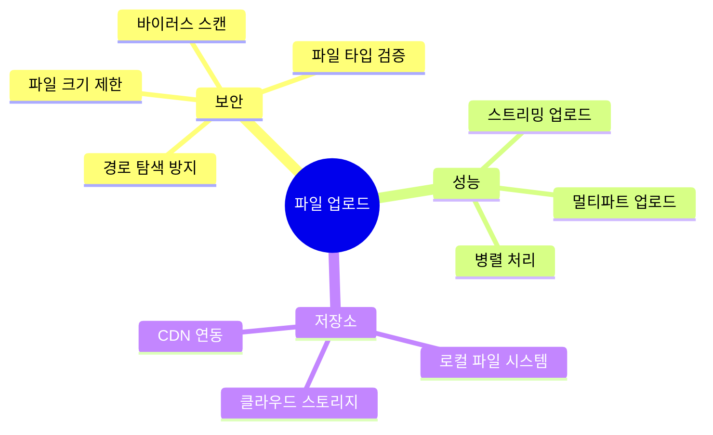
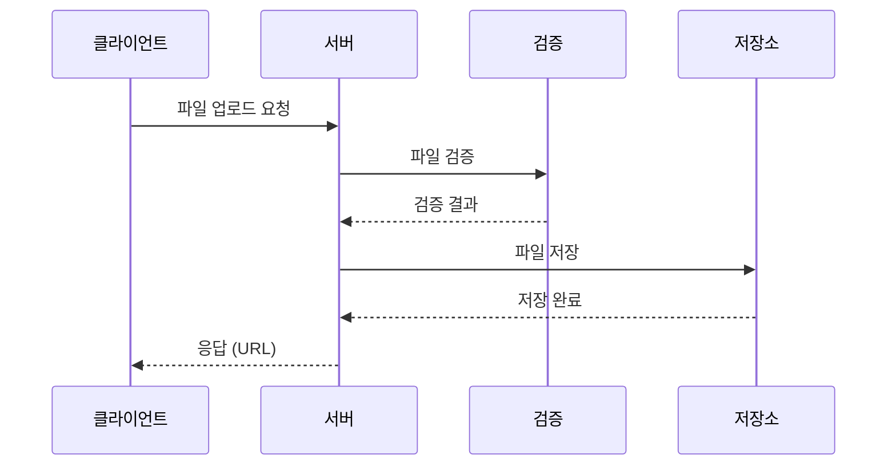
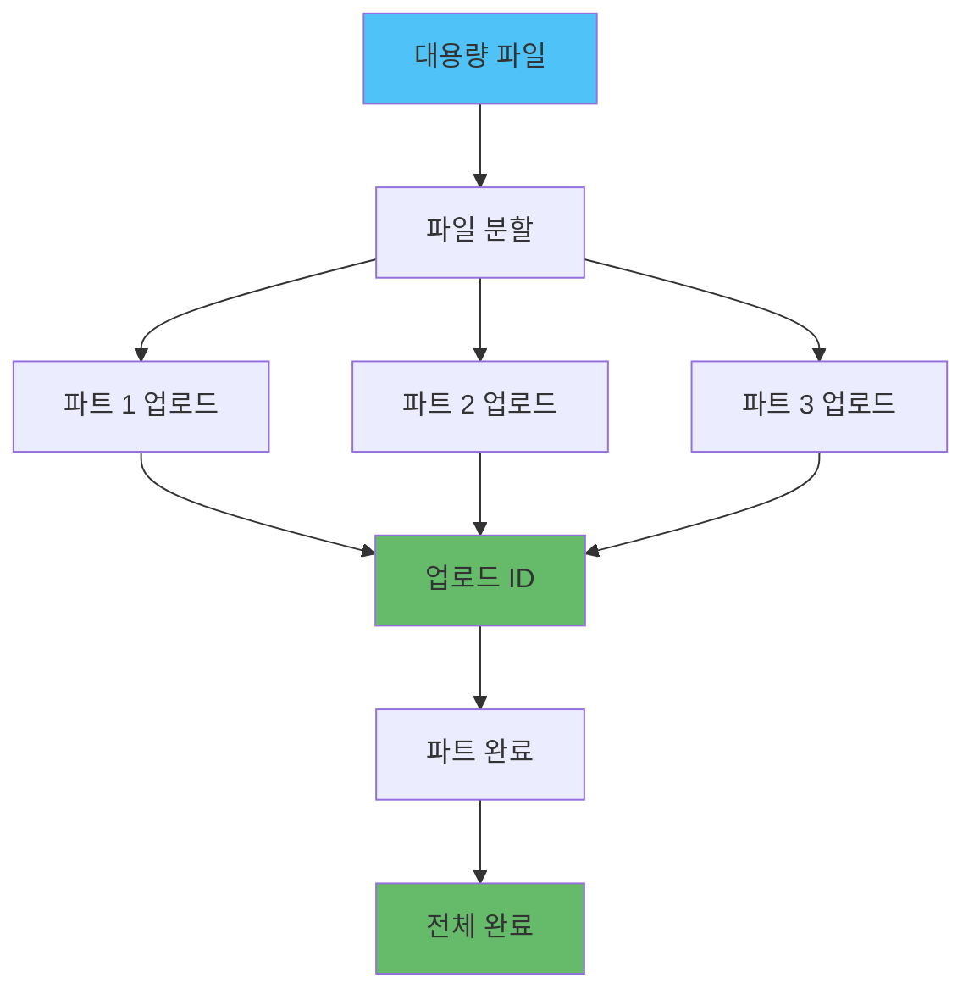

# 📁 Node.js 파일 업로드 및 처리

## 📌 개요

> **파일 업로드**는 현대 웹 애플리케이션의 핵심 기능으로, 사용자 생성 콘텐츠, 프로필 이미지, 문서 등을 처리합니다.

### 🎯 파일 업로드의 주요 고려사항



### 📊 파일 업로드 흐름



## 🔧 Multer 설정 및 최적화

### Multer 기본 설정

```javascript
const multer = require('multer');
const path = require('path');
const fs = require('fs');

// 업로드 디렉토리 생성
const uploadDir = 'uploads';
if (!fs.existsSync(uploadDir)) {
  fs.mkdirSync(uploadDir, { recursive: true });
}

// 저장소 설정
const storage = multer.diskStorage({
  destination: (req, file, cb) => {
    // 파일 타입별 디렉토리 분리
    let dir = uploadDir;
    if (file.mimetype.startsWith('image/')) {
      dir = path.join(uploadDir, 'images');
    } else if (file.mimetype.startsWith('video/')) {
      dir = path.join(uploadDir, 'videos');
    } else {
      dir = path.join(uploadDir, 'documents');
    }
    
    if (!fs.existsSync(dir)) {
      fs.mkdirSync(dir, { recursive: true });
    }
    
    cb(null, dir);
  },
  filename: (req, file, cb) => {
    // 고유한 파일명 생성
    const uniqueSuffix = Date.now() + '-' + Math.round(Math.random() * 1E9);
    const ext = path.extname(file.originalname);
    const name = path.basename(file.originalname, ext);
    cb(null, `${name}-${uniqueSuffix}${ext}`);
  }
});

// 파일 필터
const fileFilter = (req, file, cb) => {
  // 허용된 파일 타입
  const allowedTypes = /jpeg|jpg|png|gif|pdf|doc|docx/;
  const extname = allowedTypes.test(path.extname(file.originalname).toLowerCase());
  const mimetype = allowedTypes.test(file.mimetype);
  
  if (extname && mimetype) {
    cb(null, true);
  } else {
    cb(new Error('Invalid file type. Only images and documents are allowed.'));
  }
};

// Multer 설정
const upload = multer({
  storage: storage,
  limits: {
    fileSize: 10 * 1024 * 1024, // 10MB
    files: 5 // 최대 5개 파일
  },
  fileFilter: fileFilter
});

// Express 라우터
app.post('/upload', upload.single('file'), (req, res) => {
  if (!req.file) {
    return res.status(400).json({ error: 'No file uploaded' });
  }
  
  res.json({
    message: 'File uploaded successfully',
    file: {
      filename: req.file.filename,
      originalname: req.file.originalname,
      mimetype: req.file.mimetype,
      size: req.file.size,
      path: req.file.path
    }
  });
});

// 여러 파일 업로드
app.post('/upload/multiple', upload.array('files', 5), (req, res) => {
  if (!req.files || req.files.length === 0) {
    return res.status(400).json({ error: 'No files uploaded' });
  }
  
  const files = req.files.map(file => ({
    filename: file.filename,
    originalname: file.originalname,
    mimetype: file.mimetype,
    size: file.size,
    path: file.path
  }));
  
  res.json({
    message: 'Files uploaded successfully',
    files
  });
});
```

### 메모리 스토리지 (임시 저장)

```javascript
const multer = require('multer');

// 메모리 스토리지 (S3 업로드 전 임시 저장)
const memoryStorage = multer.memoryStorage();

const upload = multer({
  storage: memoryStorage,
  limits: {
    fileSize: 10 * 1024 * 1024 // 10MB
  }
});

app.post('/upload-to-s3', upload.single('file'), async (req, res) => {
  if (!req.file) {
    return res.status(400).json({ error: 'No file uploaded' });
  }
  
  // S3에 업로드
  const s3Url = await uploadToS3(req.file.buffer, req.file.originalname);
  
  res.json({
    message: 'File uploaded to S3',
    url: s3Url
  });
});
```

## ☁️ S3 업로드 (멀티파트)

### 기본 S3 업로드

```javascript
const AWS = require('aws-sdk');
const multer = require('multer');
const multerS3 = require('multer-s3');

// S3 설정
const s3 = new AWS.S3({
  accessKeyId: process.env.AWS_ACCESS_KEY_ID,
  secretAccessKey: process.env.AWS_SECRET_ACCESS_KEY,
  region: process.env.AWS_REGION
});

// S3 스토리지 설정
const s3Storage = multerS3({
  s3: s3,
  bucket: process.env.S3_BUCKET_NAME,
  acl: 'public-read',
  key: (req, file, cb) => {
    const folder = file.mimetype.startsWith('image/') ? 'images' : 'documents';
    const uniqueSuffix = Date.now() + '-' + Math.round(Math.random() * 1E9);
    const ext = path.extname(file.originalname);
    const filename = `${folder}/${uniqueSuffix}${ext}`;
    cb(null, filename);
  },
  contentType: multerS3.AUTO_CONTENT_TYPE
});

const upload = multer({
  storage: s3Storage,
  limits: {
    fileSize: 50 * 1024 * 1024 // 50MB
  }
});

app.post('/upload-s3', upload.single('file'), (req, res) => {
  res.json({
    message: 'File uploaded to S3',
    url: req.file.location,
    key: req.file.key
  });
});
```

### 멀티파트 업로드 (대용량 파일)



#### 멀티파트 업로드 구현

```javascript
const AWS = require('aws-sdk');
const fs = require('fs');
const path = require('path');

class S3MultipartUpload {
  constructor() {
    this.s3 = new AWS.S3({
      accessKeyId: process.env.AWS_ACCESS_KEY_ID,
      secretAccessKey: process.env.AWS_SECRET_ACCESS_KEY,
      region: process.env.AWS_REGION
    });
    this.bucket = process.env.S3_BUCKET_NAME;
    this.partSize = 5 * 1024 * 1024; // 5MB per part
  }
  
  async uploadLargeFile(filePath, key) {
    const fileSize = fs.statSync(filePath).size;
    const partCount = Math.ceil(fileSize / this.partSize);
    
    // 멀티파트 업로드 시작
    const { UploadId } = await this.s3.createMultipartUpload({
      Bucket: this.bucket,
      Key: key,
      ContentType: 'application/octet-stream'
    }).promise();
    
    const parts = [];
    
    // 각 파트 업로드
    for (let partNumber = 1; partNumber <= partCount; partNumber++) {
      const start = (partNumber - 1) * this.partSize;
      const end = Math.min(start + this.partSize, fileSize);
      
      const partData = fs.createReadStream(filePath, { start, end });
      
      const { ETag } = await this.s3.uploadPart({
        Bucket: this.bucket,
        Key: key,
        PartNumber: partNumber,
        UploadId: UploadId,
        Body: partData
      }).promise();
      
      parts.push({
        ETag,
        PartNumber: partNumber
      });
      
      console.log(`Part ${partNumber}/${partCount} uploaded`);
    }
    
    // 멀티파트 업로드 완료
    const { Location } = await this.s3.completeMultipartUpload({
      Bucket: this.bucket,
      Key: key,
      UploadId: UploadId,
      MultipartUpload: {
        Parts: parts
      }
    }).promise();
    
    return Location;
  }
  
  async uploadLargeFileStream(stream, key, fileSize) {
    const partCount = Math.ceil(fileSize / this.partSize);
    
    // 멀티파트 업로드 시작
    const { UploadId } = await this.s3.createMultipartUpload({
      Bucket: this.bucket,
      Key: key,
      ContentType: 'application/octet-stream'
    }).promise();
    
    const parts = [];
    let partNumber = 1;
    let buffer = Buffer.alloc(0);
    
    return new Promise((resolve, reject) => {
      stream.on('data', async (chunk) => {
        buffer = Buffer.concat([buffer, chunk]);
        
        while (buffer.length >= this.partSize) {
          const partData = buffer.slice(0, this.partSize);
          buffer = buffer.slice(this.partSize);
          
          try {
            const { ETag } = await this.s3.uploadPart({
              Bucket: this.bucket,
              Key: key,
              PartNumber: partNumber,
              UploadId: UploadId,
              Body: partData
            }).promise();
            
            parts.push({
              ETag,
              PartNumber: partNumber
            });
            
            partNumber++;
          } catch (error) {
            reject(error);
            return;
          }
        }
      });
      
      stream.on('end', async () => {
        // 마지막 파트 업로드
        if (buffer.length > 0) {
          try {
            const { ETag } = await this.s3.uploadPart({
              Bucket: this.bucket,
              Key: key,
              PartNumber: partNumber,
              UploadId: UploadId,
              Body: buffer
            }).promise();
            
            parts.push({
              ETag,
              PartNumber: partNumber
            });
          } catch (error) {
            reject(error);
            return;
          }
        }
        
        // 멀티파트 업로드 완료
        try {
          const { Location } = await this.s3.completeMultipartUpload({
            Bucket: this.bucket,
            Key: key,
            UploadId: UploadId,
            MultipartUpload: {
              Parts: parts
            }
          }).promise();
          
          resolve(Location);
        } catch (error) {
          reject(error);
        }
      });
      
      stream.on('error', reject);
    });
  }
}

// 사용 예시
const multipartUpload = new S3MultipartUpload();

app.post('/upload-large', upload.single('file'), async (req, res) => {
  if (!req.file) {
    return res.status(400).json({ error: 'No file uploaded' });
  }
  
  const key = `uploads/${Date.now()}-${req.file.originalname}`;
  
  try {
    const url = await multipartUpload.uploadLargeFile(req.file.path, key);
    
    // 임시 파일 삭제
    fs.unlinkSync(req.file.path);
    
    res.json({
      message: 'Large file uploaded successfully',
      url
    });
  } catch (error) {
    res.status(500).json({ error: error.message });
  }
});
```

## 🖼️ 이미지 리사이징 및 최적화

### Sharp를 사용한 이미지 처리

```javascript
const sharp = require('sharp');
const multer = require('multer');
const path = require('path');

// 메모리 스토리지
const upload = multer({
  storage: multer.memoryStorage(),
  fileFilter: (req, file, cb) => {
    if (file.mimetype.startsWith('image/')) {
      cb(null, true);
    } else {
      cb(new Error('Only images are allowed'));
    }
  },
  limits: {
    fileSize: 10 * 1024 * 1024 // 10MB
  }
});

// 이미지 리사이징 및 최적화
async function processImage(buffer, options = {}) {
  const {
    width = 800,
    height = 600,
    quality = 80,
    format = 'jpeg'
  } = options;
  
  let image = sharp(buffer);
  
  // 메타데이터 가져오기
  const metadata = await image.metadata();
  
  // 리사이징
  image = image.resize(width, height, {
    fit: 'inside',
    withoutEnlargement: true
  });
  
  // 포맷 변환 및 최적화
  if (format === 'jpeg' || format === 'jpg') {
    image = image.jpeg({ quality });
  } else if (format === 'png') {
    image = image.png({ compressionLevel: 9 });
  } else if (format === 'webp') {
    image = image.webp({ quality });
  }
  
  return {
    buffer: await image.toBuffer(),
    metadata: {
      width: metadata.width,
      height: metadata.height,
      format: metadata.format
    }
  };
}

// 여러 크기로 리사이징
async function generateThumbnails(buffer) {
  const sizes = [
    { name: 'thumbnail', width: 150, height: 150 },
    { name: 'small', width: 400, height: 400 },
    { name: 'medium', width: 800, height: 800 },
    { name: 'large', width: 1200, height: 1200 }
  ];
  
  const thumbnails = {};
  
  for (const size of sizes) {
    const { buffer: resized } = await processImage(buffer, {
      width: size.width,
      height: size.height,
      format: 'webp',
      quality: 85
    });
    
    thumbnails[size.name] = resized;
  }
  
  return thumbnails;
}

// Express 라우터
app.post('/upload-image', upload.single('image'), async (req, res) => {
  if (!req.file) {
    return res.status(400).json({ error: 'No image uploaded' });
  }
  
  try {
    // 원본 이미지 저장
    const originalKey = `images/original/${Date.now()}-${req.file.originalname}`;
    await uploadToS3(req.file.buffer, originalKey);
    
    // 썸네일 생성
    const thumbnails = await generateThumbnails(req.file.buffer);
    
    // 썸네일 업로드
    const thumbnailUrls = {};
    for (const [size, buffer] of Object.entries(thumbnails)) {
      const key = `images/${size}/${Date.now()}-${size}.webp`;
      const url = await uploadToS3(buffer, key);
      thumbnailUrls[size] = url;
    }
    
    res.json({
      message: 'Image uploaded and processed',
      original: `https://${process.env.S3_BUCKET_NAME}.s3.amazonaws.com/${originalKey}`,
      thumbnails: thumbnailUrls
    });
  } catch (error) {
    res.status(500).json({ error: error.message });
  }
});
```

## 🔒 파일 검증 및 보안

### 파일 검증

```javascript
const fileType = require('file-type');
const crypto = require('crypto');

class FileValidator {
  // 허용된 MIME 타입
  static allowedMimeTypes = {
    image: ['image/jpeg', 'image/png', 'image/gif', 'image/webp'],
    document: ['application/pdf', 'application/msword', 'application/vnd.openxmlformats-officedocument.wordprocessingml.document'],
    video: ['video/mp4', 'video/webm']
  };
  
  // 허용된 파일 확장자
  static allowedExtensions = {
    image: ['.jpg', '.jpeg', '.png', '.gif', '.webp'],
    document: ['.pdf', '.doc', '.docx'],
    video: ['.mp4', '.webm']
  };
  
  // 파일 타입 검증
  static async validateFileType(buffer, originalname) {
    // 파일 시그니처 확인 (매직 넘버)
    const type = await fileType.fromBuffer(buffer);
    
    if (!type) {
      throw new Error('Unable to determine file type');
    }
    
    // 확장자 확인
    const ext = path.extname(originalname).toLowerCase();
    const allowedExts = [
      ...this.allowedExtensions.image,
      ...this.allowedExtensions.document,
      ...this.allowedExtensions.video
    ];
    
    if (!allowedExts.includes(ext)) {
      throw new Error('Invalid file extension');
    }
    
    // MIME 타입 확인
    const allowedMimes = [
      ...this.allowedMimeTypes.image,
      ...this.allowedMimeTypes.document,
      ...this.allowedMimeTypes.video
    ];
    
    if (!allowedMimes.includes(type.mime)) {
      throw new Error('Invalid MIME type');
    }
    
    // 확장자와 MIME 타입 일치 확인
    const expectedMime = this.getMimeFromExtension(ext);
    if (expectedMime && expectedMime !== type.mime) {
      throw new Error('File extension and MIME type mismatch');
    }
    
    return type;
  }
  
  // 확장자에서 MIME 타입 가져오기
  static getMimeFromExtension(ext) {
    const mimeMap = {
      '.jpg': 'image/jpeg',
      '.jpeg': 'image/jpeg',
      '.png': 'image/png',
      '.gif': 'image/gif',
      '.webp': 'image/webp',
      '.pdf': 'application/pdf',
      '.doc': 'application/msword',
      '.docx': 'application/vnd.openxmlformats-officedocument.wordprocessingml.document',
      '.mp4': 'video/mp4',
      '.webm': 'video/webm'
    };
    
    return mimeMap[ext.toLowerCase()];
  }
  
  // 파일 크기 검증
  static validateFileSize(size, maxSize = 10 * 1024 * 1024) {
    if (size > maxSize) {
      throw new Error(`File size exceeds maximum allowed size of ${maxSize / 1024 / 1024}MB`);
    }
  }
  
  // 파일명 검증 (경로 탐색 방지)
  static validateFileName(filename) {
    // 위험한 문자 제거
    const dangerous = /[<>:"|?*\x00-\x1f]/g;
    if (dangerous.test(filename)) {
      throw new Error('Invalid characters in filename');
    }
    
    // 경로 탐색 방지
    if (filename.includes('..') || filename.includes('/') || filename.includes('\\')) {
      throw new Error('Path traversal detected');
    }
    
    return filename.replace(dangerous, '');
  }
  
  // 파일 해시 생성 (중복 검사)
  static generateFileHash(buffer) {
    return crypto.createHash('sha256').update(buffer).digest('hex');
  }
}

// 사용 예시
app.post('/upload-secure', upload.single('file'), async (req, res) => {
  if (!req.file) {
    return res.status(400).json({ error: 'No file uploaded' });
  }
  
  try {
    // 파일 타입 검증
    await FileValidator.validateFileType(req.file.buffer, req.file.originalname);
    
    // 파일 크기 검증
    FileValidator.validateFileSize(req.file.size, 10 * 1024 * 1024);
    
    // 파일명 검증
    const safeFilename = FileValidator.validateFileName(req.file.originalname);
    
    // 파일 해시 생성
    const fileHash = FileValidator.generateFileHash(req.file.buffer);
    
    // 중복 파일 확인
    const existingFile = await db.files.findOne({ hash: fileHash });
    if (existingFile) {
      return res.json({
        message: 'File already exists',
        url: existingFile.url
      });
    }
    
    // 파일 저장
    const key = `uploads/${fileHash}-${safeFilename}`;
    const url = await uploadToS3(req.file.buffer, key);
    
    // 데이터베이스에 기록
    await db.files.create({
      filename: safeFilename,
      hash: fileHash,
      url: url,
      size: req.file.size,
      mimetype: req.file.mimetype
    });
    
    res.json({
      message: 'File uploaded successfully',
      url
    });
  } catch (error) {
    res.status(400).json({ error: error.message });
  }
});
```

## 📝 결론

파일 업로드 및 처리는 보안과 성능을 모두 고려해야 하는 복잡한 작업입니다.

### 핵심 포인트

- ✅ **Multer 설정**: 적절한 스토리지 및 제한 설정
- ✅ **S3 업로드**: 멀티파트 업로드로 대용량 파일 처리
- ✅ **이미지 최적화**: Sharp를 사용한 리사이징 및 포맷 변환
- ✅ **파일 검증**: 타입, 크기, 파일명 검증
- ✅ **보안**: 경로 탐색 방지, 파일 시그니처 확인

### 모범 사례

1. **파일 타입 검증**: MIME 타입과 파일 시그니처 모두 확인
2. **파일 크기 제한**: 서버 및 클라이언트 모두에서 제한
3. **안전한 파일명**: 위험한 문자 제거 및 경로 탐색 방지
4. **이미지 최적화**: 여러 크기로 리사이징 및 포맷 변환
5. **클라우드 스토리지**: 로컬 저장소 대신 S3 등 사용
6. **중복 파일 검사**: 해시를 사용한 중복 방지

### 관련 문서

- [보안 모범 사례](../보안/Node.js_보안_모범사례.md) - 파일 업로드 보안
- [백그라운드 작업](../백그라운드_작업/작업_큐_처리.md) - 대용량 파일 처리 작업 큐
- [성능 최적화](../Performance/Node.js_성능_최적화_및_프로파일링.md) - 파일 처리 성능 최적화
- [에러 핸들링](../에러_핸들링/에러_핸들링_전략.md) - 파일 업로드 에러 처리

