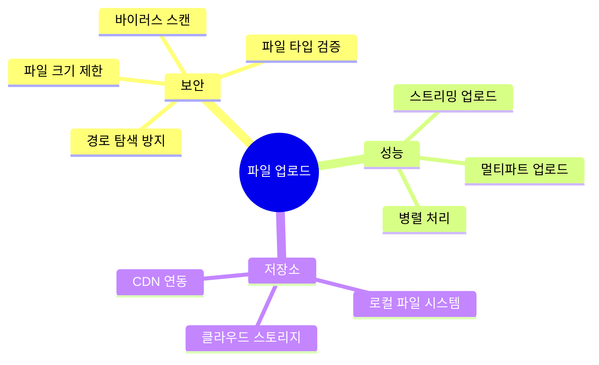
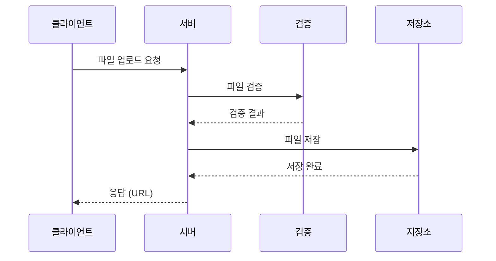
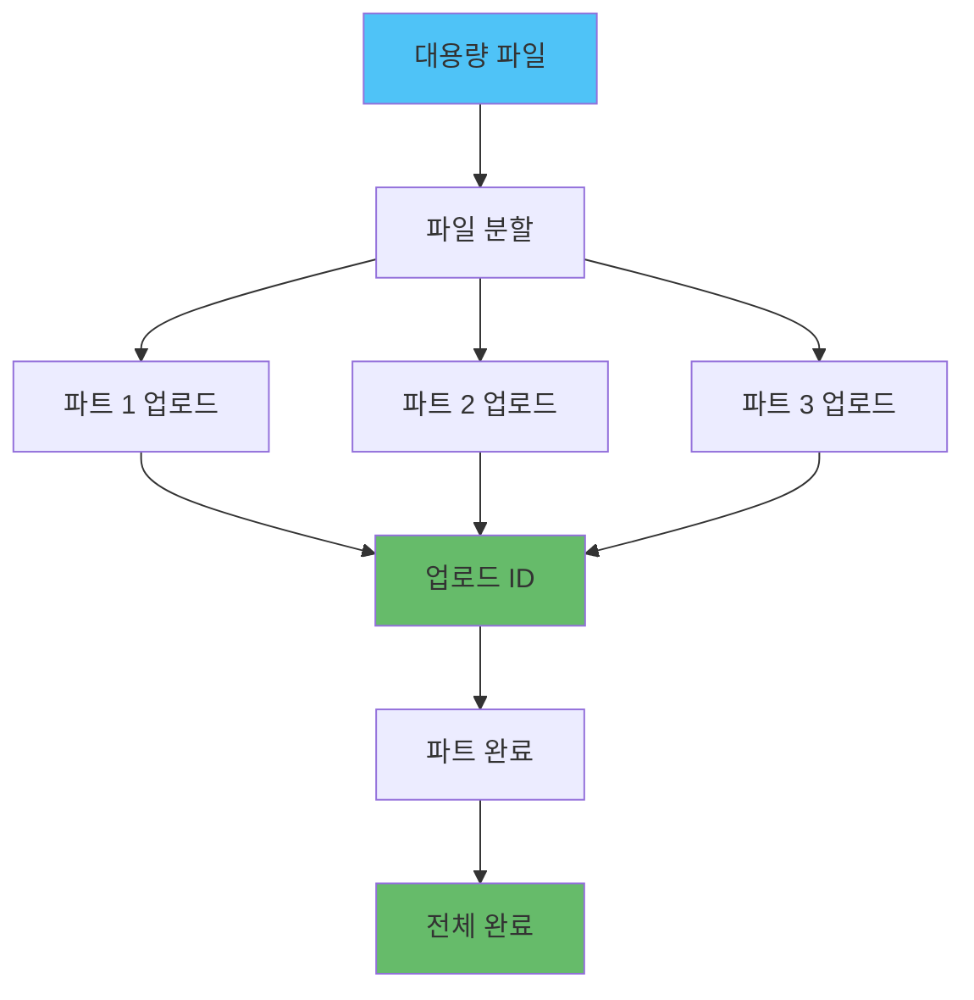

# Node.js 파일 업로드 및 처리

## 개요

파일 업로드는 현대 웹 애플리케이션의 핵심 기능으로, 사용자 생성 콘텐츠, 프로필 이미지, 문서 등을 처리합니다.

### 파일 업로드의 주요 고려사항


```mermaid
mindmap
  root((파일 업로드))
    보안
      파일 타입 검증
      파일 크기 제한
      바이러스 스캔
      경로 탐색 방지
    성능
      스트리밍 업로드
      멀티파트 업로드
      병렬 처리
    저장소
      로컬 파일 시스템
      클라우드 스토리지
      CDN 연동
```

### 파일 업로드 흐름


```mermaid
sequenceDiagram
    participant C as 클라이언트
    participant S as 서버
    participant V as 검증
    participant St as 저장소
    
    C->>S: 파일 업로드 요청
    S->>V: 파일 검증
    V-->>S: 검증 결과
    S->>St: 파일 저장
    St-->>S: 저장 완료
    S-->>C: 응답 (URL)
```

## Multer 설정 및 최적화

Multer는 Node.js에서 multipart/form-data를 처리하는 미들웨어로, 파일 업로드를 위한 가장 널리 사용되는 라이브러리입니다. Express와 함께 사용하여 파일을 메모리나 디스크에 저장할 수 있습니다.

### Multer 기본 설정

```javascript
const multer = require('multer');
const path = require('path');
const fs = require('fs');

// 업로드 디렉토리 생성
const uploadDir = 'uploads';
if (!fs.existsSync(uploadDir)) {
  fs.mkdirSync(uploadDir, { recursive: true });
}

// 저장소 설정
const storage = multer.diskStorage({
  destination: (req, file, cb) => {
    // 파일 타입별 디렉토리 분리
    let dir = uploadDir;
    if (file.mimetype.startsWith('image/')) {
      dir = path.join(uploadDir, 'images');
    } else if (file.mimetype.startsWith('video/')) {
      dir = path.join(uploadDir, 'videos');
    } else {
      dir = path.join(uploadDir, 'documents');
    }
    
    if (!fs.existsSync(dir)) {
      fs.mkdirSync(dir, { recursive: true });
    }
    
    cb(null, dir);
  },
  filename: (req, file, cb) => {
    // 고유한 파일명 생성
    const uniqueSuffix = Date.now() + '-' + Math.round(Math.random() * 1E9);
    const ext = path.extname(file.originalname);
    const name = path.basename(file.originalname, ext);
    cb(null, `${name}-${uniqueSuffix}${ext}`);
  }
});

// 파일 필터
const fileFilter = (req, file, cb) => {
  // 허용된 파일 타입
  const allowedTypes = /jpeg|jpg|png|gif|pdf|doc|docx/;
  const extname = allowedTypes.test(path.extname(file.originalname).toLowerCase());
  const mimetype = allowedTypes.test(file.mimetype);
  
  if (extname && mimetype) {
    cb(null, true);
  } else {
    cb(new Error('Invalid file type. Only images and documents are allowed.'));
  }
};

// Multer 설정
const upload = multer({
  storage: storage,
  limits: {
    fileSize: 10 * 1024 * 1024, // 10MB
    files: 5 // 최대 5개 파일
  },
  fileFilter: fileFilter
});

// Express 라우터 - 단일 파일 업로드
app.post('/upload', upload.single('file'), (req, res) => {
  if (!req.file) {
    return res.status(400).json({ error: 'No file uploaded' });
  }
  
  res.json({
    message: 'File uploaded successfully',
    file: {
      filename: req.file.filename,
      originalname: req.file.originalname,
      mimetype: req.file.mimetype,
      size: req.file.size,
      path: req.file.path
    }
  });
});

// 여러 파일 업로드
app.post('/upload/multiple', upload.array('files', 5), (req, res) => {
  if (!req.files || req.files.length === 0) {
    return res.status(400).json({ error: 'No files uploaded' });
  }
  
  const files = req.files.map(file => ({
    filename: file.filename,
    originalname: file.originalname,
    mimetype: file.mimetype,
    size: file.size,
    path: file.path
  }));
  
  res.json({
    message: 'Files uploaded successfully',
    files
  });
});

// 에러 처리 미들웨어
app.use((error, req, res, next) => {
  if (error instanceof multer.MulterError) {
    if (error.code === 'LIMIT_FILE_SIZE') {
      return res.status(400).json({ error: 'File too large' });
    }
    if (error.code === 'LIMIT_FILE_COUNT') {
      return res.status(400).json({ error: 'Too many files' });
    }
    if (error.code === 'LIMIT_UNEXPECTED_FILE') {
      return res.status(400).json({ error: 'Unexpected file field' });
    }
  }
  
  if (error.message === 'Invalid file type. Only images and documents are allowed.') {
    return res.status(400).json({ error: error.message });
  }
  
  res.status(500).json({ error: 'Upload failed' });
});
```

#### `fileFilter` 의 `mimetype` 은 **클라이언트가 적어 보낸 값**이다

`file.mimetype` 은 서버가 파일 내용을 보고 판정한 게 아니라, 멀티파트 본문의 `Content-Type` 헤더를 그대로 옮긴 것이다. 요청을 직접 만들어 보내면 확인된다.

```
--X
Content-Disposition: form-data; name="file"; filename="shell.php.jpg"
Content-Type: image/jpeg

<?php system($_GET["c"]); ?>
--X--
```

```
받은 originalname=shell.php.jpg mimetype=image/jpeg → ext:true mime:true
서버 응답: {"accepted":true,"head":"<?php system($_GET[\""}
```

(multer 2.2.0 / Express)

**확장자 검사와 MIME 검사를 둘 다 통과했다.** 확장자는 `.jpg` 로 끝나니 통과하고, MIME 은 공격자가 `image/jpeg` 라고 적었으니 통과한다. 두 검사가 사실상 같은 출처(요청 본문)를 보기 때문에 겹쳐 놔도 방어가 두 배가 되지 않는다.

내용으로 판정하려면 **파일 시그니처(매직 넘버)를 읽어야 한다.** 이 문서 뒤쪽 `FileValidator.validateFileType` 이 `fileType.fromBuffer(buffer)` 를 쓰는 게 그 방법이다. `fileFilter` 단계에서는 아직 파일 내용이 없으므로(스트림이 시작되기 전이다) 여기서는 **명백히 아닌 것만 걸러내는 1차 필터**로 쓰고, 진짜 판정은 내용을 읽은 뒤에 한 번 더 한다.

정규식 자체에도 구멍이 있다. `allowedTypes.test(file.mimetype)` 는 **부분 문자열 검사**라 `application/x-doc-evil` 같은 값도 `doc` 이 들어 있어서 통과한다. 목록으로 비교하는 편이 안전하다.

```javascript
const ALLOWED = new Set(['image/jpeg', 'image/png', 'image/gif', 'application/pdf']);
if (!ALLOWED.has(file.mimetype)) return cb(null, false);
```

그리고 업로드된 파일이 **정적 경로에서 그대로 서빙되지 않게** 한다. 검증을 아무리 해도, 웹서버가 그 디렉터리의 파일을 실행하거나 원본 HTML 로 내려주면 방어가 무너진다. 저장은 웹 루트 밖이나 S3 에 하고, 다운로드는 별도 핸들러로 `Content-Disposition: attachment` 를 붙여 내보낸다.

#### 확장자 쪽 정규식은 양쪽으로 다 틀린다

같은 정규식이 확장자 검사에도 쓰인다. 실제 값을 넣어 보면 통과해서는 안 되는 것이 통과하고, 통과해야 할 것이 막힌다.

```
파일명            extname   통과?
macro.docm        .docm     true     ← 매크로 포함 워드 문서
x.gifx            .gifx     true
a.pdfx            .pdfx     true
template.dotm     .dotm     false

application/msword          false    ← .doc 의 진짜 MIME 인데 막힌다
application/x-docker        true
text/x-gif-script           true
```

앵커가 없어서 `.docm` 은 `doc` 을 포함하니 통과한다. `.docm` 은 매크로를 담을 수 있는 형식이라 "문서니까 안전하다"고 볼 수 없다. 반대로 `application/msword` 는 `doc` 이라는 글자가 없어서 거부된다 — **허용하려던 형식이 막히고 막으려던 형식이 통과하는** 상태다.

정규식으로 확장자를 검사할 거면 최소한 앵커를 붙이고, 목록으로 비교하는 편이 더 낫다.

```javascript
const ALLOWED_EXT = new Set(['.jpg', '.jpeg', '.png', '.gif', '.pdf']);
if (!ALLOWED_EXT.has(path.extname(file.originalname).toLowerCase())) return cb(null, false);
```

`.doc`·`.docx` 를 목록에서 뺀 것은 실수가 아니다. **오피스 문서를 받을 거면 매크로·외부 참조를 어떻게 처리할지 따로 정해야 한다.** 이미지·PDF 와 같은 취급을 하면 안 된다.

#### 저장 파일명에 사용자 입력이 그대로 들어간다

```javascript
const name = path.basename(file.originalname, ext);
cb(null, `${name}-${uniqueSuffix}${ext}`);
```

`path.basename` 이 `/` 를 잘라 주므로 POSIX 에서 상위 디렉터리로 빠져나가지는 못한다. 다만 나머지는 그대로 남는다.

```
"../../../etc/passwd.jpg"  → "passwd-123.jpg"          경로는 잘린다
"..\\..\\win.jpg"          → "..\\..\\win-123.jpg"     백슬래시는 안 잘린다
"a\nb.png"                 → "a\nb-123.png"            개행이 파일명에 들어간다
```

리눅스에서 백슬래시는 경로 구분자가 아니라서 저 파일명이 그대로 만들어진다. 그 파일을 나중에 Windows 로 옮기거나, 파일명을 URL·헤더·셸 명령에 넣는 순간 문제가 된다. 개행이 들어간 파일명을 `Content-Disposition` 헤더에 그대로 쓰면 헤더 주입이다.

**원본 파일명을 저장 파일명으로 쓰지 않는 것이 가장 단순한 해법이다.** UUID 로 저장하고 원본 이름은 DB 컬럼에 값으로 보관한 뒤, 다운로드할 때 인코딩해서 헤더에 넣는다.

```javascript
filename: (req, file, cb) => {
  cb(null, `${crypto.randomUUID()}${path.extname(file.originalname).toLowerCase()}`);
}
```

`Date.now() + Math.random()` 조합도 다시 볼 만하다. 충돌 확률이 낮을 뿐 0 은 아니고, 충돌하면 **먼저 올라온 파일이 덮어써진다.** 조용히 데이터가 사라지는 종류의 실패다.

#### `limits` 를 초과했을 때 무엇이 응답되는가

`upload.single('file')` 은 크기·개수 제한을 넘기면 `MulterError` 를 `next(err)` 로 넘긴다. 이 문서의 라우터에는 그걸 받는 에러 핸들러가 없다. 그러면 Express 기본 핸들러가 처리하고, **개발 모드에서는 스택 트레이스가 담긴 HTML 이 클라이언트로 나간다.** 클라이언트는 왜 실패했는지 알 수 없고, 서버는 내부 경로를 노출한다.

업로드 라우트 뒤에는 전용 에러 핸들러를 붙인다.

```javascript
app.use((err, req, res, next) => {
  if (err instanceof multer.MulterError) {
    const map = {
      LIMIT_FILE_SIZE: [413, '파일이 너무 큽니다'],
      LIMIT_FILE_COUNT: [400, '파일 개수를 초과했습니다'],
      LIMIT_UNEXPECTED_FILE: [400, '허용되지 않은 필드입니다'],
    };
    const [status, message] = map[err.code] ?? [400, '업로드 실패'];
    return res.status(status).json({ code: err.code, message });
  }
  next(err);
});
```

`fileFilter` 에서 `cb(new Error(...))` 로 던진 것은 `MulterError` 가 아니라 일반 `Error` 라 위 분기에 안 걸린다. 코드로 구분하고 싶으면 필터에서도 `err.code` 를 붙여 던지거나 `cb(null, false)` 로 조용히 거르고 라우터에서 `req.file` 이 없는 경우로 처리한다.

### 메모리 스토리지

메모리 스토리지는 파일을 디스크에 저장하지 않고 메모리에 임시로 보관합니다. 클라우드 스토리지로 바로 전송하거나 이미지 처리 후 저장할 때 유용합니다. 단, 메모리 사용량이 증가하므로 대용량 파일에는 주의가 필요합니다.

```javascript
const multer = require('multer');

// 메모리 스토리지 설정
const memoryStorage = multer.memoryStorage();

const upload = multer({
  storage: memoryStorage,
  limits: {
    fileSize: 10 * 1024 * 1024 // 10MB
  }
});

// S3 업로드 헬퍼 함수
async function uploadToS3(buffer, filename) {
  const AWS = require('aws-sdk');
  const s3 = new AWS.S3({
    accessKeyId: process.env.AWS_ACCESS_KEY_ID,
    secretAccessKey: process.env.AWS_SECRET_ACCESS_KEY,
    region: process.env.AWS_REGION
  });
  
  const key = `uploads/${Date.now()}-${filename}`;
  const params = {
    Bucket: process.env.S3_BUCKET_NAME,
    Key: key,
    Body: buffer,
    ContentType: 'application/octet-stream'
  };
  
  const result = await s3.upload(params).promise();
  return result.Location;
}

app.post('/upload-to-s3', upload.single('file'), async (req, res) => {
  if (!req.file) {
    return res.status(400).json({ error: 'No file uploaded' });
  }
  
  try {
    // S3에 업로드
    const s3Url = await uploadToS3(req.file.buffer, req.file.originalname);
    
    res.json({
      message: 'File uploaded to S3',
      url: s3Url
    });
  } catch (error) {
    res.status(500).json({ error: error.message });
  }
});
```

## S3 업로드

AWS S3는 확장 가능한 객체 스토리지 서비스로, 파일을 안전하게 저장하고 전 세계 어디서나 접근할 수 있습니다. multer-s3를 사용하면 Multer와 S3를 직접 연동할 수 있습니다.

### 기본 S3 업로드

```javascript
const AWS = require('aws-sdk');
const multer = require('multer');
const multerS3 = require('multer-s3');
const path = require('path');

// S3 설정
const s3 = new AWS.S3({
  accessKeyId: process.env.AWS_ACCESS_KEY_ID,
  secretAccessKey: process.env.AWS_SECRET_ACCESS_KEY,
  region: process.env.AWS_REGION
});

// S3 스토리지 설정
const s3Storage = multerS3({
  s3: s3,
  bucket: process.env.S3_BUCKET_NAME,
  acl: 'public-read',
  key: (req, file, cb) => {
    const folder = file.mimetype.startsWith('image/') ? 'images' : 'documents';
    const uniqueSuffix = Date.now() + '-' + Math.round(Math.random() * 1E9);
    const ext = path.extname(file.originalname);
    const filename = `${folder}/${uniqueSuffix}${ext}`;
    cb(null, filename);
  },
  contentType: multerS3.AUTO_CONTENT_TYPE
});

const upload = multer({
  storage: s3Storage,
  limits: {
    fileSize: 50 * 1024 * 1024 // 50MB
  }
});

app.post('/upload-s3', upload.single('file'), (req, res) => {
  if (!req.file) {
    return res.status(400).json({ error: 'No file uploaded' });
  }
  
  res.json({
    message: 'File uploaded to S3',
    url: req.file.location,
    key: req.file.key,
    size: req.file.size,
    mimetype: req.file.mimetype
  });
});
```

### 멀티파트 업로드

멀티파트 업로드는 대용량 파일을 여러 작은 파트로 나누어 업로드하는 방식입니다. 네트워크 오류 발생 시 전체 파일을 다시 업로드할 필요 없이 실패한 파트만 재시도할 수 있어 효율적입니다. 일반적으로 100MB 이상의 파일에 사용합니다.


```mermaid
graph TD
    A[대용량 파일] --> B[파일 분할]
    B --> C[파트 1 업로드]
    B --> D[파트 2 업로드]
    B --> E[파트 3 업로드]
    
    C --> F[업로드 ID]
    D --> F
    E --> F
    
    F --> G[파트 완료]
    G --> H[전체 완료]
    
    style A fill:#4fc3f7
    style F fill:#66bb6a
    style H fill:#66bb6a
```

#### 멀티파트 업로드 구현

```javascript
const AWS = require('aws-sdk');
const fs = require('fs');
const path = require('path');

class S3MultipartUpload {
  constructor(options = {}) {
    this.s3 = new AWS.S3({
      accessKeyId: process.env.AWS_ACCESS_KEY_ID,
      secretAccessKey: process.env.AWS_SECRET_ACCESS_KEY,
      region: process.env.AWS_REGION
    });
    this.bucket = process.env.S3_BUCKET_NAME;
    this.partSize = options.partSize || 5 * 1024 * 1024; // 기본 5MB
    this.maxRetries = options.maxRetries || 3;
    this.onProgress = options.onProgress || null;
  }
  
  // 파트 업로드 재시도 로직
  async uploadPartWithRetry(params, retries = 0) {
    try {
      const { ETag } = await this.s3.uploadPart(params).promise();
      return ETag;
    } catch (error) {
      if (retries < this.maxRetries) {
        await new Promise(resolve => setTimeout(resolve, 1000 * (retries + 1)));
        return this.uploadPartWithRetry(params, retries + 1);
      }
      throw error;
    }
  }
  
  async uploadLargeFile(filePath, key) {
    const fileSize = fs.statSync(filePath).size;
    const partCount = Math.ceil(fileSize / this.partSize);
    
    // 멀티파트 업로드 시작
    const { UploadId } = await this.s3.createMultipartUpload({
      Bucket: this.bucket,
      Key: key,
      ContentType: 'application/octet-stream'
    }).promise();
    
    const parts = [];
    
    try {
      // 각 파트 업로드
      for (let partNumber = 1; partNumber <= partCount; partNumber++) {
        const start = (partNumber - 1) * this.partSize;
        const end = Math.min(start + this.partSize, fileSize);
        
        const partData = fs.createReadStream(filePath, { start, end });
        
        const ETag = await this.uploadPartWithRetry({
          Bucket: this.bucket,
          Key: key,
          PartNumber: partNumber,
          UploadId: UploadId,
          Body: partData
        });
        
        parts.push({
          ETag,
          PartNumber: partNumber
        });
        
        // 진행률 콜백 호출
        if (this.onProgress) {
          const progress = Math.round((partNumber / partCount) * 100);
          this.onProgress(progress, partNumber, partCount);
        }
      }
      
      // 멀티파트 업로드 완료
      const { Location } = await this.s3.completeMultipartUpload({
        Bucket: this.bucket,
        Key: key,
        UploadId: UploadId,
        MultipartUpload: {
          Parts: parts
        }
      }).promise();
      
      return Location;
    } catch (error) {
      // 실패 시 업로드 취소
      try {
        await this.s3.abortMultipartUpload({
          Bucket: this.bucket,
          Key: key,
          UploadId: UploadId
        }).promise();
      } catch (abortError) {
        console.error('Failed to abort multipart upload:', abortError);
      }
      throw error;
    }
  }
  
  // 스트림을 통한 멀티파트 업로드
  async uploadLargeFileStream(stream, key, fileSize) {
    const partCount = Math.ceil(fileSize / this.partSize);
    
    // 멀티파트 업로드 시작
    const { UploadId } = await this.s3.createMultipartUpload({
      Bucket: this.bucket,
      Key: key,
      ContentType: 'application/octet-stream'
    }).promise();
    
    const parts = [];
    let partNumber = 1;
    let buffer = Buffer.alloc(0);
    let uploadedBytes = 0;
    
    return new Promise((resolve, reject) => {
      const uploadPromises = [];
      
      stream.on('data', (chunk) => {
        buffer = Buffer.concat([buffer, chunk]);
        
        while (buffer.length >= this.partSize) {
          const partData = buffer.slice(0, this.partSize);
          buffer = buffer.slice(this.partSize);
          
          const currentPartNumber = partNumber++;
          const uploadPromise = this.uploadPartWithRetry({
            Bucket: this.bucket,
            Key: key,
            PartNumber: currentPartNumber,
            UploadId: UploadId,
            Body: partData
          }).then(ETag => {
            parts.push({
              ETag,
              PartNumber: currentPartNumber
            });
            
            uploadedBytes += partData.length;
            if (this.onProgress) {
              const progress = Math.round((uploadedBytes / fileSize) * 100);
              this.onProgress(progress, currentPartNumber, partCount);
            }
          });
          
          uploadPromises.push(uploadPromise);
        }
      });
      
      stream.on('end', async () => {
        // 마지막 파트 업로드
        if (buffer.length > 0) {
          const currentPartNumber = partNumber;
          try {
            const ETag = await this.uploadPartWithRetry({
              Bucket: this.bucket,
              Key: key,
              PartNumber: currentPartNumber,
              UploadId: UploadId,
              Body: buffer
            });
            
            parts.push({
              ETag,
              PartNumber: currentPartNumber
            });
            
            uploadedBytes += buffer.length;
            if (this.onProgress) {
              this.onProgress(100, currentPartNumber, partCount);
            }
          } catch (error) {
            reject(error);
            return;
          }
        }
        
        // 모든 파트 업로드 완료 대기
        try {
          await Promise.all(uploadPromises);
          
          // 파트 번호 순서대로 정렬
          parts.sort((a, b) => a.PartNumber - b.PartNumber);
          
          // 멀티파트 업로드 완료
          const { Location } = await this.s3.completeMultipartUpload({
            Bucket: this.bucket,
            Key: key,
            UploadId: UploadId,
            MultipartUpload: {
              Parts: parts
            }
          }).promise();
          
          resolve(Location);
        } catch (error) {
          // 실패 시 업로드 취소
          try {
            await this.s3.abortMultipartUpload({
              Bucket: this.bucket,
              Key: key,
              UploadId: UploadId
            }).promise();
          } catch (abortError) {
            console.error('Failed to abort multipart upload:', abortError);
          }
          reject(error);
        }
      });
      
      stream.on('error', async (error) => {
        // 스트림 에러 시 업로드 취소
        try {
          await this.s3.abortMultipartUpload({
            Bucket: this.bucket,
            Key: key,
            UploadId: UploadId
          }).promise();
        } catch (abortError) {
          console.error('Failed to abort multipart upload:', abortError);
        }
        reject(error);
      });
    });
  }
}

// 사용 예시
app.post('/upload-large', upload.single('file'), async (req, res) => {
  if (!req.file) {
    return res.status(400).json({ error: 'No file uploaded' });
  }
  
  const key = `uploads/${Date.now()}-${req.file.originalname}`;
  
  // 진행률 추적을 위한 콜백 함수
  const onProgress = (progress, partNumber, totalParts) => {
    console.log(`Upload progress: ${progress}% (${partNumber}/${totalParts})`);
    // WebSocket이나 Server-Sent Events로 클라이언트에 진행률 전송 가능
  };
  
  const multipartUpload = new S3MultipartUpload({
    partSize: 10 * 1024 * 1024, // 10MB per part
    maxRetries: 3,
    onProgress: onProgress
  });
  
  try {
    const url = await multipartUpload.uploadLargeFile(req.file.path, key);
    
    // 임시 파일 삭제
    if (fs.existsSync(req.file.path)) {
      fs.unlinkSync(req.file.path);
    }
    
    res.json({
      message: 'Large file uploaded successfully',
      url,
      key
    });
  } catch (error) {
    // 에러 발생 시 임시 파일 정리
    if (fs.existsSync(req.file.path)) {
      fs.unlinkSync(req.file.path);
    }
    res.status(500).json({ error: error.message });
  }
});
```

### ⚠ `uploadLargeFile` 은 파일을 손상시킨다 — `end` 는 포함이다

```javascript
const start = (partNumber - 1) * this.partSize;
const end = Math.min(start + this.partSize, fileSize);
const partData = fs.createReadStream(filePath, { start, end });
```

`fs.createReadStream` 의 `end` 옵션은 **그 바이트를 포함해서 읽는다.** 그래서 각 파트가 `partSize + 1` 바이트를 읽고, 이웃한 파트끼리 1바이트씩 겹친다. 10바이트 파일을 4바이트씩 나눠 보면:

```
파트 1 start=0 end=4  → 실제 읽은 바이트: 5  내용: "01234"
파트 2 start=4 end=8  → 실제 읽은 바이트: 5  내용: "45678"
파트 3 start=8 end=10 → 실제 읽은 바이트: 2  내용: "89"

원본 10바이트 / 업로드된 합계: 12 바이트
이어붙인 결과: "012344567889"
```

`4` 와 `8` 이 두 번씩 들어갔다. **S3 는 이걸 막아주지 않는다.** 파트를 순서대로 이어붙이는 게 전부라, 업로드는 성공하고 객체 크기만 원본보다 커진 채로 저장된다. 텍스트라면 몇 글자가 겹치는 정도지만 압축 파일이나 동영상이면 열리지 않는다.

**증상이 "업로드 실패"가 아니라 "업로드는 됐는데 파일이 깨짐"이라 원인을 찾기 어렵다.** 5MB 파트에서 1바이트 차이는 크기만 봐서는 눈에 안 띈다.

고치는 방법은 두 가지다.

```javascript
// ① end 를 1 줄인다 (마지막 파트 경계 처리 주의)
const end = Math.min(start + this.partSize, fileSize) - 1;

// ② 애초에 길이로 자른다 — 경계 실수가 안 생긴다
const partData = fs.createReadStream(filePath, { start, end: start + this.partSize - 1 });
```

같은 이유로 **경계값은 반드시 작은 파일로 한 번 실측한다.** 위 출력은 10바이트 파일에 4바이트 파트로 재본 것이고, 실제 코드를 그대로 돌려 나온 결과다. 오프셋 계산을 눈으로 검토해서 맞다고 판단하는 건 이 부류에서 잘 통하지 않는다.

참고로 뒤따르는 `uploadLargeFileStream` 은 `buffer.slice(0, this.partSize)` 로 자르기 때문에 이 문제가 없다. 같은 클래스 안에서 한쪽만 틀린 경우다.

## 이미지 리사이징 및 최적화

이미지 파일은 용량이 크고 다양한 디바이스에서 표시되므로, 업로드 시 여러 크기로 리사이징하고 최적화하는 것이 중요합니다. Sharp는 Node.js에서 가장 빠른 이미지 처리 라이브러리로, 리사이징, 포맷 변환, 품질 조정 등을 효율적으로 처리합니다.

### Sharp를 사용한 이미지 처리

```javascript
const sharp = require('sharp');
const multer = require('multer');
const path = require('path');

// 메모리 스토리지
const upload = multer({
  storage: multer.memoryStorage(),
  fileFilter: (req, file, cb) => {
    if (file.mimetype.startsWith('image/')) {
      cb(null, true);
    } else {
      cb(new Error('Only images are allowed'));
    }
  },
  limits: {
    fileSize: 10 * 1024 * 1024 // 10MB
  }
});

// 이미지 리사이징 및 최적화
async function processImage(buffer, options = {}) {
  const {
    width = 800,
    height = 600,
    quality = 80,
    format = 'jpeg'
  } = options;
  
  let image = sharp(buffer);
  
  // 메타데이터 가져오기
  const metadata = await image.metadata();
  
  // 리사이징
  image = image.resize(width, height, {
    fit: 'inside',
    withoutEnlargement: true
  });
  
  // 포맷 변환 및 최적화
  if (format === 'jpeg' || format === 'jpg') {
    image = image.jpeg({ quality });
  } else if (format === 'png') {
    image = image.png({ compressionLevel: 9 });
  } else if (format === 'webp') {
    image = image.webp({ quality });
  }
  
  return {
    buffer: await image.toBuffer(),
    metadata: {
      width: metadata.width,
      height: metadata.height,
      format: metadata.format
    }
  };
}

// 여러 크기로 리사이징
async function generateThumbnails(buffer) {
  const sizes = [
    { name: 'thumbnail', width: 150, height: 150 },
    { name: 'small', width: 400, height: 400 },
    { name: 'medium', width: 800, height: 800 },
    { name: 'large', width: 1200, height: 1200 }
  ];
  
  const thumbnails = {};
  
  for (const size of sizes) {
    const { buffer: resized } = await processImage(buffer, {
      width: size.width,
      height: size.height,
      format: 'webp',
      quality: 85
    });
    
    thumbnails[size.name] = resized;
  }
  
  return thumbnails;
}

// S3 업로드 헬퍼 함수
async function uploadToS3(buffer, key, contentType = 'application/octet-stream') {
  const AWS = require('aws-sdk');
  const s3 = new AWS.S3({
    accessKeyId: process.env.AWS_ACCESS_KEY_ID,
    secretAccessKey: process.env.AWS_SECRET_ACCESS_KEY,
    region: process.env.AWS_REGION
  });
  
  const params = {
    Bucket: process.env.S3_BUCKET_NAME,
    Key: key,
    Body: buffer,
    ContentType: contentType,
    ACL: 'public-read'
  };
  
  const result = await s3.upload(params).promise();
  return result.Location;
}

// Express 라우터
app.post('/upload-image', upload.single('image'), async (req, res) => {
  if (!req.file) {
    return res.status(400).json({ error: 'No image uploaded' });
  }
  
  try {
    const timestamp = Date.now();
    const originalName = path.basename(req.file.originalname, path.extname(req.file.originalname));
    
    // 원본 이미지 저장
    const originalKey = `images/original/${timestamp}-${originalName}${path.extname(req.file.originalname)}`;
    const originalUrl = await uploadToS3(
      req.file.buffer, 
      originalKey,
      req.file.mimetype
    );
    
    // 썸네일 생성
    const thumbnails = await generateThumbnails(req.file.buffer);
    
    // 썸네일 업로드
    const thumbnailUrls = {};
    for (const [size, buffer] of Object.entries(thumbnails)) {
      const key = `images/${size}/${timestamp}-${originalName}-${size}.webp`;
      const url = await uploadToS3(buffer, key, 'image/webp');
      thumbnailUrls[size] = url;
    }
    
    res.json({
      message: 'Image uploaded and processed',
      original: originalUrl,
      thumbnails: thumbnailUrls,
      metadata: {
        originalSize: req.file.size,
        originalMimetype: req.file.mimetype
      }
    });
  } catch (error) {
    console.error('Image processing error:', error);
    res.status(500).json({ error: error.message });
  }
});
```

#### 파일 크기 제한은 메모리 사용량을 제한하지 못한다

`limits.fileSize: 10MB` 를 통과했다고 안전한 것이 아니다. 이미지는 압축된 상태로 오고 **디코딩하면 픽셀 수 × 4바이트**가 된다. 단색이나 반복 패턴은 극단적으로 잘 압축되므로, 작은 파일이 거대한 비트맵이 될 수 있다.

```
1920x1080     →       2,073,600 px →    8MB
8000x8000     →      64,000,000 px →  244MB
16383x16383   →     268,402,689 px → 1.0GB
30000x30000   →     900,000,000 px → 3.4GB
```

10MB 짜리 PNG 하나가 기가바이트 단위 메모리를 요구할 수 있고, 그런 요청 몇 개가 동시에 오면 프로세스가 OOM 으로 죽는다. **바이트 제한과 별개로 픽셀 상한을 걸어야 한다.** sharp 에는 입력 픽셀 상한 옵션이 있고 기본값이 있지만(그 기본값도 위 표의 세 번째 줄 수준이라 결코 작지 않다), 어딘가에서 `limitInputPixels: false` 로 꺼 두면 방어가 사라진다.

```javascript
const image = sharp(buffer, { limitInputPixels: 50_000_000 });   // 용도에 맞게 낮춘다
const meta = await image.metadata();
if (meta.width > 8000 || meta.height > 8000) throw new Error('이미지가 너무 큽니다');
```

메타데이터를 먼저 읽어 거르는 것이 중요하다. **`resize()` 는 원본을 디코딩한 뒤에 줄이므로**, 결과가 150×150 이라도 그 전에 원본 크기만큼의 메모리를 쓴다.

#### 이 라우터는 요청 하나에 일을 너무 많이 한다

한 번의 HTTP 요청 안에서 리사이즈 4회와 S3 업로드 5회가 순차로 일어난다. 여기서 세 가지가 따라온다.

**응답이 느리고 타임아웃에 걸린다.** 사용자는 그동안 로딩 화면을 본다. 리버스 프록시나 로드밸런서의 타임아웃을 넘기면 사용자에게는 실패로 보이는데 서버는 계속 처리하고 있다.

**CPU 가 요청 수만큼 포화된다.** 이미지 디코딩·리사이즈는 CPU 를 많이 쓰는 작업이라, 동시 업로드가 몇 건만 겹쳐도 같은 프로세스의 다른 API 응답까지 함께 느려진다. Node 는 이 작업을 스레드풀에서 하지만 풀 크기는 유한하다.

**부분 실패가 고아 객체를 남긴다.** 원본과 썸네일 두 개가 올라간 뒤 세 번째에서 실패하면 500 을 반환하는데, **이미 올라간 객체 세 개는 S3 에 그대로 남고 DB 에는 아무 기록이 없다.** 지우는 코드가 없으니 영원히 남아 요금만 나간다.

보통은 이렇게 나눈다.

| 단계 | 어디서 |
|---|---|
| 원본 저장 + 업로드 레코드 생성 | 요청 안에서. 여기까지만 사용자에게 응답한다 |
| 썸네일 생성·업로드 | 큐 워커에서. 실패하면 재시도한다 |
| 완료 통지 | 폴링·웹소켓·웹훅 중 하나 |

고아 객체는 **S3 라이프사이클 규칙**으로도 줄일 수 있다. 임시 접두어(`tmp/`)에 올린 뒤 확정되면 옮기고, `tmp/` 는 하루 뒤 자동 삭제되게 둔다.

#### `ACL: 'public-read'` 는 지금 대부분의 버킷에서 실패한다

2023년 4월부터 새로 만든 S3 버킷은 ACL 이 비활성화된 상태(Object Ownership = Bucket owner enforced)가 기본이고, 그 버킷에 `ACL` 파라미터를 보내면 `AccessControlListNotSupported` 로 거부된다([S3 소유권 문서](https://docs.aws.amazon.com/AmazonS3/latest/userguide/about-object-ownership.html)). 옛 예제를 그대로 복사했을 때 처음 마주치는 오류다.

동작한다 해도 다시 생각해 볼 설정이다. `public-read` 는 **URL 을 아는 사람 누구나 영구히 읽을 수 있다**는 뜻이고, 위 코드는 파일명에 타임스탬프만 붙이므로 추측도 어렵지 않다. 사용자 업로드물이 개인 사진이나 문서라면 그대로 노출된다.

- 공개해도 되는 정적 자산이면 **버킷은 비공개로 두고 CloudFront 를 앞에 세운다**(OAC).
- 사용자별 파일이면 비공개로 두고 **필요할 때 짧은 유효기간의 서명 URL** 을 발급한다.

`AWS.S3` 를 요청마다 `new` 하는 것도 고칠 만하다. `uploadToS3` 안에서 `require` 와 클라이언트 생성이 매번 일어난다. 모듈 최상위에서 한 번 만들어 재사용하는 편이 커넥션 재활용에 유리하다. 자격 증명도 환경변수에서 직접 읽기보다 **인스턴스 역할(IAM Role)** 에 맡기면 키를 코드와 환경에서 없앨 수 있다.

마지막으로 `res.status(500).json({ error: error.message })` 는 내부 메시지를 그대로 내보낸다. S3 오류 메시지에는 버킷 이름과 키 경로가 들어 있다. 로그에는 전부 남기고 응답에는 식별자만 준다.

## 파일 검증 및 보안

파일 업로드는 보안 위험이 높은 기능입니다. 악성 파일 업로드, 경로 탐색 공격, 서버 리소스 고갈 등을 방지하기 위해 철저한 검증이 필요합니다. 파일 확장자, MIME 타입, 파일 시그니처(매직 넘버)를 모두 확인해야 합니다.

### 파일 검증

```javascript
const fileType = require('file-type');
const crypto = require('crypto');
const path = require('path');

class FileValidator {
  // 허용된 MIME 타입
  static allowedMimeTypes = {
    image: ['image/jpeg', 'image/png', 'image/gif', 'image/webp'],
    document: ['application/pdf', 'application/msword', 'application/vnd.openxmlformats-officedocument.wordprocessingml.document'],
    video: ['video/mp4', 'video/webm']
  };
  
  // 허용된 파일 확장자
  static allowedExtensions = {
    image: ['.webp', '.webp', '.webp', '.webp', '.webp'],
    document: ['.pdf', '.doc', '.docx'],
    video: ['.mp4', '.webm']
  };
  
  // 파일 타입 검증
  static async validateFileType(buffer, originalname) {
    // 파일 시그니처 확인 (매직 넘버)
    const type = await fileType.fromBuffer(buffer);
    
    if (!type) {
      throw new Error('Unable to determine file type');
    }
    
    // 확장자 확인
    const ext = path.extname(originalname).toLowerCase();
    const allowedExts = [
      ...this.allowedExtensions.image,
      ...this.allowedExtensions.document,
      ...this.allowedExtensions.video
    ];
    
    if (!allowedExts.includes(ext)) {
      throw new Error('Invalid file extension');
    }
    
    // MIME 타입 확인
    const allowedMimes = [
      ...this.allowedMimeTypes.image,
      ...this.allowedMimeTypes.document,
      ...this.allowedMimeTypes.video
    ];
    
    if (!allowedMimes.includes(type.mime)) {
      throw new Error('Invalid MIME type');
    }
    
    // 확장자와 MIME 타입 일치 확인
    const expectedMime = this.getMimeFromExtension(ext);
    if (expectedMime && expectedMime !== type.mime) {
      throw new Error('File extension and MIME type mismatch');
    }
    
    return type;
  }
  
  // 확장자에서 MIME 타입 가져오기
  static getMimeFromExtension(ext) {
    const mimeMap = {
      '.webp': 'image/jpeg',
      '.webp': 'image/jpeg',
      '.webp': 'image/png',
      '.webp': 'image/gif',
      '.webp': 'image/webp',
      '.pdf': 'application/pdf',
      '.doc': 'application/msword',
      '.docx': 'application/vnd.openxmlformats-officedocument.wordprocessingml.document',
      '.mp4': 'video/mp4',
      '.webm': 'video/webm'
    };
    
    return mimeMap[ext.toLowerCase()];
  }
  
  // 파일 크기 검증
  static validateFileSize(size, maxSize = 10 * 1024 * 1024) {
    if (size > maxSize) {
      throw new Error(`File size exceeds maximum allowed size of ${maxSize / 1024 / 1024}MB`);
    }
  }
  
  // 파일명 검증 (경로 탐색 방지)
  static validateFileName(filename) {
    // 위험한 문자 제거
    const dangerous = /[<>:"|?*\x00-\x1f]/g;
    if (dangerous.test(filename)) {
      throw new Error('Invalid characters in filename');
    }
    
    // 경로 탐색 방지
    if (filename.includes('..') || filename.includes('/') || filename.includes('\\')) {
      throw new Error('Path traversal detected');
    }
    
    return filename.replace(dangerous, '');
  }
  
  // 파일 해시 생성 (중복 검사)
  static generateFileHash(buffer) {
    return crypto.createHash('sha256').update(buffer).digest('hex');
  }
}
```

### 이 `FileValidator` 는 세 군데가 고장 나 있다

**1. `allowedExtensions.image` 가 `.webp` 다섯 개다.**

```javascript
image: ['.webp', '.webp', '.webp', '.webp', '.webp'],
```

`.jpg`·`.png`·`.gif` 가 통째로 빠졌다. 바로 위 `allowedMimeTypes.image` 에는 `image/jpeg`·`image/png`·`image/gif` 가 다 있는데 확장자 목록만 어긋난 것이다.

```
.jpg 허용? false
.png 허용? false
.gif 허용? false
.webp 허용? true
```

**JPEG 를 올리면 `Invalid file extension` 으로 거절된다.** 대부분의 업로드가 실패하는데, 에러 메시지는 "확장자가 잘못됐다"고만 말한다. 사용자는 멀쩡한 사진을 올리고 있으니 원인을 짐작할 수 없다.

**2. `getMimeFromExtension` 의 매핑 테이블은 항목 다섯 개가 사라진다.**

```javascript
const mimeMap = {
  '.webp': 'image/jpeg',
  '.webp': 'image/jpeg',
  '.webp': 'image/png',
  '.webp': 'image/gif',
  '.webp': 'image/webp',
  '.pdf': 'application/pdf',
  ...
};
```

같은 키를 다섯 번 쓰면 **마지막 것만 남는다.**

```
실제 키: .webp, .pdf, .doc
.webp → image/webp / .jpg → undefined / .png → undefined
```

여기서 더 나쁜 건, 이 함수가 `undefined` 를 돌려주면 호출부가 검사를 **건너뛴다**는 점이다.

```javascript
const expectedMime = this.getMimeFromExtension(ext);
if (expectedMime && expectedMime !== type.mime) { throw ... }
//  ^^^^^^^^^^^^ undefined 면 조건 자체가 false
```

즉 매핑에 없는 확장자는 "확장자와 실제 내용이 일치하는가" 검사를 통과한다. **검증 함수가 조용히 무력화되는 형태**라 테스트로도 안 잡힌다 — 통과하니까.

`.jpg`/`.png` 처럼 정상적인 확장자가 매핑에서 사라진 지금은, 1번 때문에 애초에 확장자 단계에서 막히므로 이 구멍이 드러나지 않는다. 1번만 고치고 2번을 놔두면 그때부터 검사가 헐거워진다. 둘은 같이 고쳐야 한다.

**3. `validateFileName` 의 정규식이 호출할 때마다 다른 답을 낸다.**

```javascript
const dangerous = /[<>:"|?*\x00-\x1f]/g;   // ← g 플래그
if (dangerous.test(filename)) { throw ... }
```

`g` 플래그가 붙은 정규식의 `test()` 는 **`lastIndex` 를 기억한다.** 같은 문자열을 반복해서 검사하면 결과가 돌아간다.

```
1번째 test("bad<name>.jpg"): true   lastIndex=4
2번째 test("bad<name>.jpg"): true   lastIndex=9
3번째 test("bad<name>.jpg"): false  lastIndex=0
4번째 test("bad<name>.jpg"): true   lastIndex=4
```

**3번째 호출에서 위험한 파일명이 통과한다.** `dangerous` 는 클래스 바깥의 모듈 스코프 상수라 프로세스 전체가 하나를 공유한다. 즉 업로드 요청 세 번마다 한 번씩 검사가 무력화되는데, 재현 조건이 "몇 번째 요청인가"라서 로컬에서 한 번 테스트해서는 절대 못 잡는다.

`g` 플래그는 `test()` 에 쓰지 않는다. 지우면 끝이다.

```javascript
const dangerous = /[<>:"|?*\x00-\x1f]/;          // 검사용 (g 없음)
const dangerousAll = /[<>:"|?*\x00-\x1f]/g;      // replace 용은 따로
```

마지막 줄 `return filename.replace(dangerous, '')` 는 이미 예외를 던진 뒤라 도달할 수 없는 코드이기도 하다. 위험 문자가 있으면 throw 하고, 없으면 지울 것도 없다.

```javascript

// 사용 예시
app.post('/upload-secure', upload.single('file'), async (req, res) => {
  if (!req.file) {
    return res.status(400).json({ error: 'No file uploaded' });
  }
  
  try {
    // 파일 타입 검증
    await FileValidator.validateFileType(req.file.buffer, req.file.originalname);
    
    // 파일 크기 검증
    FileValidator.validateFileSize(req.file.size, 10 * 1024 * 1024);
    
    // 파일명 검증
    const safeFilename = FileValidator.validateFileName(req.file.originalname);
    
    // 파일 해시 생성
    const fileHash = FileValidator.generateFileHash(req.file.buffer);
    
    // 중복 파일 확인
    const existingFile = await db.files.findOne({ hash: fileHash });
    if (existingFile) {
      return res.json({
        message: 'File already exists',
        url: existingFile.url
      });
    }
    
    // 파일 저장
    const key = `uploads/${fileHash}-${safeFilename}`;
    const url = await uploadToS3(req.file.buffer, key);
    
    // 데이터베이스에 기록
    await db.files.create({
      filename: safeFilename,
      hash: fileHash,
      url: url,
      size: req.file.size,
      mimetype: req.file.mimetype
    });
    
    res.json({
      message: 'File uploaded successfully',
      url
    });
  } catch (error) {
    res.status(400).json({ error: error.message });
  }
});
```

### 파일 삭제

업로드된 파일을 삭제하는 기능도 필요합니다. S3에서 파일을 삭제하고 데이터베이스에서도 관련 정보를 제거해야 합니다.

```javascript
const AWS = require('aws-sdk');
const fs = require('fs');

class FileManager {
  constructor() {
    this.s3 = new AWS.S3({
      accessKeyId: process.env.AWS_ACCESS_KEY_ID,
      secretAccessKey: process.env.AWS_SECRET_ACCESS_KEY,
      region: process.env.AWS_REGION
    });
    this.bucket = process.env.S3_BUCKET_NAME;
  }
  
  // S3 파일 삭제
  async deleteFile(key) {
    try {
      await this.s3.deleteObject({
        Bucket: this.bucket,
        Key: key
      }).promise();
      return true;
    } catch (error) {
      console.error('Failed to delete file from S3:', error);
      throw error;
    }
  }
  
  // 여러 파일 삭제
  async deleteFiles(keys) {
    if (keys.length === 0) return;
    
    const objects = keys.map(key => ({ Key: key }));
    
    try {
      await this.s3.deleteObjects({
        Bucket: this.bucket,
        Delete: {
          Objects: objects
        }
      }).promise();
      return true;
    } catch (error) {
      console.error('Failed to delete files from S3:', error);
      throw error;
    }
  }
  
  // 로컬 파일 삭제
  deleteLocalFile(filePath) {
    try {
      if (fs.existsSync(filePath)) {
        fs.unlinkSync(filePath);
        return true;
      }
      return false;
    } catch (error) {
      console.error('Failed to delete local file:', error);
      throw error;
    }
  }
}

const fileManager = new FileManager();

// 파일 삭제 엔드포인트
app.delete('/files/:fileId', async (req, res) => {
  try {
    const file = await db.files.findById(req.params.fileId);
    if (!file) {
      return res.status(404).json({ error: 'File not found' });
    }
    
    // S3에서 파일 삭제
    await fileManager.deleteFile(file.key);
    
    // 데이터베이스에서 삭제
    await db.files.deleteById(req.params.fileId);
    
    res.json({ message: 'File deleted successfully' });
  } catch (error) {
    res.status(500).json({ error: error.message });
  }
});

// 여러 파일 삭제
app.delete('/files', async (req, res) => {
  try {
    const { fileIds } = req.body;
    if (!Array.isArray(fileIds) || fileIds.length === 0) {
      return res.status(400).json({ error: 'Invalid file IDs' });
    }
    
    const files = await db.files.find({ _id: { $in: fileIds } });
    const keys = files.map(file => file.key);
    
    // S3에서 파일 삭제
    await fileManager.deleteFiles(keys);
    
    // 데이터베이스에서 삭제
    await db.files.deleteMany({ _id: { $in: fileIds } });
    
    res.json({ message: 'Files deleted successfully' });
  } catch (error) {
    res.status(500).json({ error: error.message });
  }
});
```

## 요약

파일 업로드 및 처리는 보안과 성능을 모두 고려해야 하는 복잡한 작업입니다.

### 주요 내용

- **Multer 설정**: 디스크 스토리지와 메모리 스토리지 선택, 파일 크기 및 개수 제한 설정
- **S3 업로드**: multer-s3를 통한 직접 업로드, 멀티파트 업로드로 대용량 파일 처리
- **이미지 최적화**: Sharp를 사용한 리사이징, 포맷 변환, 여러 크기의 썸네일 생성
- **파일 검증**: 확장자, MIME 타입, 파일 시그니처(매직 넘버) 확인
- **보안**: 경로 탐색 방지, 위험한 문자 제거, 파일명 정규화
- **에러 처리**: Multer 에러 처리, 재시도 로직, 임시 파일 정리
- **파일 삭제**: S3 및 로컬 파일 삭제, 데이터베이스 정리

### 주의사항

1. **파일 타입 검증**: 확장자만 확인하지 말고 MIME 타입과 파일 시그니처를 모두 확인해야 합니다.
2. **파일 크기 제한**: 서버와 클라이언트 양쪽에서 제한을 설정해야 합니다.
3. **안전한 파일명**: 위험한 문자를 제거하고 경로 탐색을 방지해야 합니다.
4. **이미지 최적화**: 여러 크기로 리사이징하고 WebP 같은 최신 포맷을 사용하면 용량을 크게 줄일 수 있습니다.
5. **클라우드 스토리지**: 로컬 저장소 대신 S3 같은 클라우드 스토리지를 사용하면 확장성과 안정성이 향상됩니다.
6. **중복 파일 검사**: 파일 해시를 사용하여 중복 업로드를 방지하고 스토리지 비용을 절감할 수 있습니다.
7. **에러 처리**: 업로드 실패 시 임시 파일을 정리하고, 멀티파트 업로드 실패 시 진행 중인 업로드를 취소해야 합니다.
8. **진행률 추적**: 대용량 파일 업로드 시 진행률을 추적하여 사용자 경험을 개선할 수 있습니다.

### 관련 문서

- [보안 모범 사례](../보안/Node.js_보안_모범사례.md)
- [백그라운드 작업](../백그라운드_작업/작업_큐_처리.md)
- [성능 최적화](../Performance/Node.js_성능_최적화_및_프로파일링.md)
- [에러 핸들링](../에러_핸들링/에러_핸들링_전략.md)

