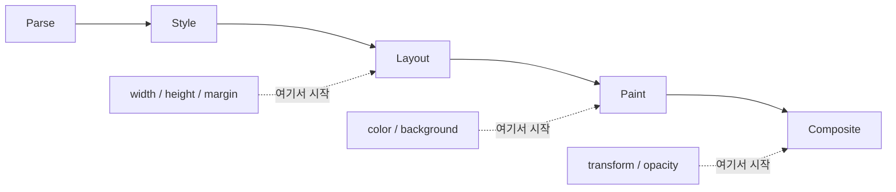
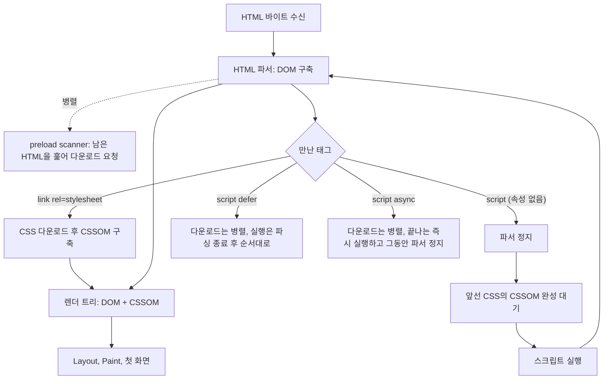
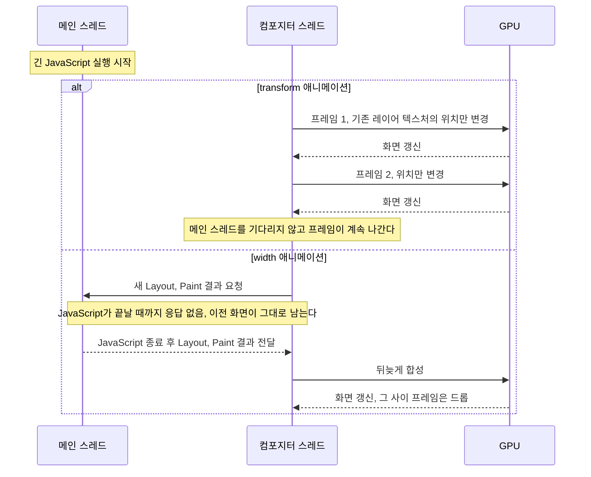
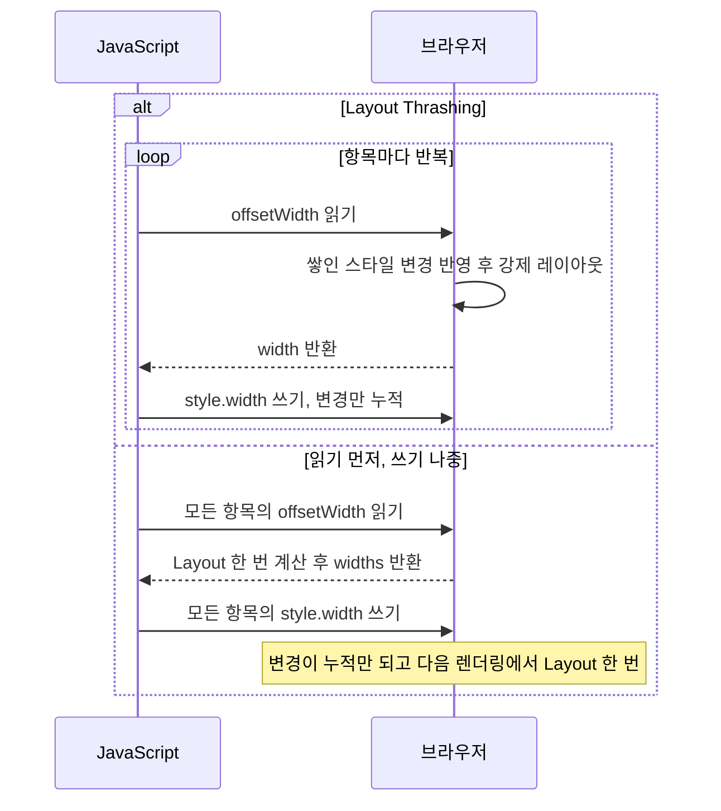
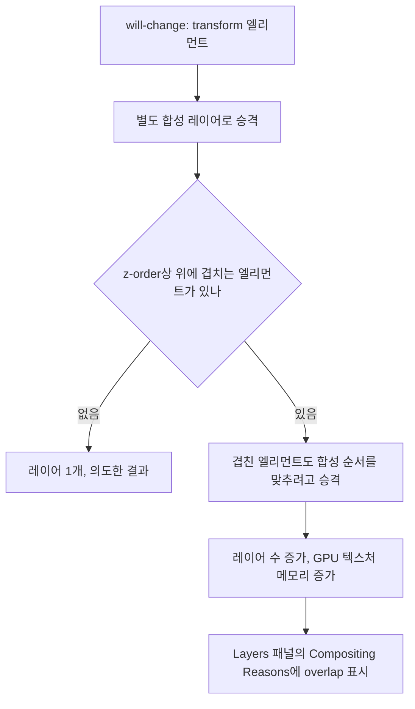
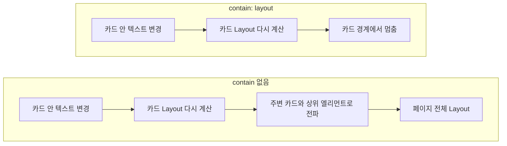
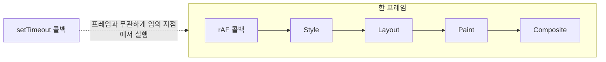
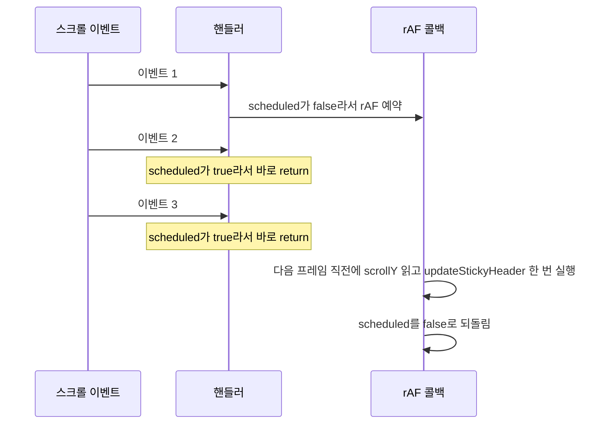
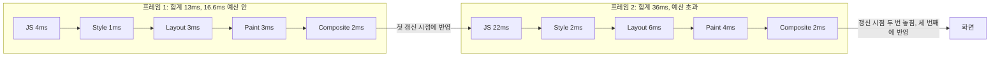
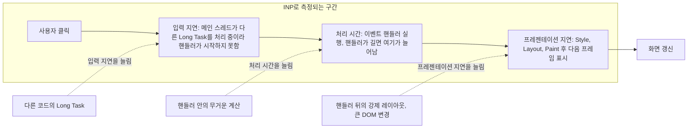

## 파이프라인 다섯 단계

브라우저가 화면을 그리는 과정은 Parse → Style → Layout → Paint → Composite 순서로 진행된다. 각 단계는 앞 단계의 결과를 입력으로 받는다. 어느 단계에서 변경이 발생했느냐에 따라 뒤에 오는 단계 전부가 다시 실행될 수 있다.

**Parse**: HTML을 DOM 트리로, CSS를 CSSOM 트리로 변환한다. `<script>` 태그가 `defer`나 `async` 없이 `<head>`에 있으면 파싱을 멈추고 스크립트를 실행한다. 이 시점에 DOM이 아직 완성되지 않아서 스크립트가 DOM을 조작하면 예상과 다른 결과가 나온다.

**Style**: DOM과 CSSOM을 합쳐서 각 엘리먼트에 최종 스타일을 계산한다(Computed Style). 셀렉터 매칭이 이 단계에서 일어난다. 브라우저는 셀렉터를 오른쪽에서 왼쪽으로 읽는다. `.container .list .item span`은 먼저 모든 `span`을 찾고, 그중 `.item` 자식인 것을 걸러내는 방식이다. 셀렉터가 길고 조상 조건이 많을수록 매칭 비용이 올라간다.

**Layout**(Reflow라고도 한다): 각 엘리먼트의 위치와 크기를 계산한다. `width`, `height`, `margin`, `padding`, `top`, `left` 같은 기하 속성이 이 단계에 영향을 준다. 한 엘리먼트의 크기가 바뀌면 주변 엘리먼트의 레이아웃도 다시 계산해야 한다. DOM 트리 상위 엘리먼트에 변경이 발생하면 하위 트리 전체가 대상이 된다.

**Paint**: Layout 결과를 바탕으로 실제 픽셀을 레이어 단위로 계산한다. `color`, `background`, `box-shadow`, `border-radius` 같은 시각 속성이 이 단계다. Layout을 건드리지 않는 변경은 Paint부터 실행된다.

**Composite**: 페인트된 레이어들을 합성해서 최종 화면을 만든다. GPU가 이 단계를 담당한다. `transform`과 `opacity`만 바뀌면 Layout과 Paint를 건너뛰고 Composite만 실행된다. 애니메이션에서 이 두 속성이 권장되는 이유다.



실선이 한 번의 렌더링에서 거치는 전체 순서이고, 점선은 CSS 속성이 바뀌었을 때 파이프라인에 들어오는 지점이다. 들어온 지점부터 오른쪽 단계가 전부 다시 돈다. `width`는 Layout부터라서 Paint와 Composite까지 따라오고, `transform`은 Composite 하나로 끝난다.

`left: 100px`과 `transform: translateX(100px)`은 결과가 같아 보이지만 브라우저가 처리하는 단계 수가 다르다. 전자는 매 프레임마다 Layout을 다시 계산하고, 후자는 GPU가 레이어만 이동시킨다.

---

## Critical Rendering Path

브라우저가 파이프라인 첫 단계를 시작하려면 HTML 파싱이 어느 정도 진행되어야 하는데, CSS와 스크립트가 그 파싱을 막는 구조가 있다.



CSS는 렌더링을 막고, 속성 없는 스크립트는 파서를 막는다. 스크립트 앞에 CSS가 있으면 두 차단이 겹친다. 파서가 스크립트에서 멈추면 그 스크립트가 `getComputedStyle()`을 부를 수 있으니 앞선 CSS가 끝날 때까지 실행도 기다린다. CSS 다운로드가 늦으면 스크립트 실행이 늦고, 파서 재개가 늦고, DOM 완성이 늦고, 첫 화면이 늦는 연쇄가 된다. 외부 CSS가 `<head>`에 10개 있으면 가장 느린 파일이 도착해야 렌더 트리가 만들어진다.

preload scanner는 이 지연을 줄이려고 파서와 별개로 돈다. 메인 파서가 스크립트 때문에 멈춰 있는 동안 남은 HTML에서 ``, `<link>`, `<script src>`를 찾아 다운로드를 미리 시작한다. 파서가 ``에 도착했을 때 이미지가 이미 내려오고 있는 이유다.

preload scanner가 동작하지 못하는 경우가 있다. JavaScript가 동적으로 주입한 `<script>` 태그, CSS `@import`로 연결된 파일은 파서가 실행 중에 만들기 때문에 미리 볼 수 없다. 빌드 결과물에서 CSS `@import`를 없애야 하는 이유다. 번들러 설정에 따라 `@import`를 인라인으로 합치지 않는 경우 이 문제가 생긴다.

```html
<!-- 문제: 파서 차단 스크립트가 CSS 완료를 기다린다 -->
<head>
  <link rel="stylesheet" href="styles.css">
  <script src="analytics.js"></script>
</head>

<!-- 개선: defer로 파서 차단 제거, preload로 중요 리소스 명시 -->
<head>
  <link rel="preload" href="critical.css" as="style">
  <link rel="stylesheet" href="styles.css">
  <script src="analytics.js" defer></script>
</head>
```

```css
/* preload scanner가 못 보는 패턴 — 직렬 다운로드 */
@import url("typography.css");
@import url("components.css");
```

`<script async>`는 다운로드를 병렬로 하되 완료 즉시 실행한다. 순서 보장이 안 되기 때문에 다른 스크립트에 의존성이 없는 독립적인 스크립트(광고, 분석 툴)에만 쓴다. `<script defer>`는 HTML 파싱이 끝난 후 순서대로 실행하기 때문에 의존 관계가 있는 스크립트에 적합하다.

---

## 메인 스레드와 컴포지터 스레드

브라우저는 렌더링을 두 스레드로 나눠 처리한다.

메인 스레드는 Parse → Style → Layout → Paint 단계를 담당한다. JavaScript 실행도 메인 스레드에서 일어난다. 한 번에 하나씩 처리하는 단일 스레드라서 JavaScript가 실행 중이면 Layout과 Paint가 기다린다.

컴포지터 스레드는 Paint된 레이어들을 합성해 최종 화면을 만드는 Composite 단계를 담당한다. GPU와 직접 통신한다. 메인 스레드 상태와 무관하게 독립적으로 동작한다.

`transform`과 `opacity`가 컴포지터 전용 속성인 이유는 이 구조에서 나온다. 이 두 속성이 바뀌면 이미 Paint된 레이어의 위치나 투명도만 달라진다. 새로 그려야 할 픽셀이 없기 때문에 컴포지터 스레드가 이미 가진 레이어 텍스처를 조합하는 것만으로 충분하다. 메인 스레드가 개입할 필요가 없다.

`width`나 `background-color`를 바꾸면 메인 스레드가 Layout이나 Paint를 다시 실행해야 한다. 이 작업이 끝나야 컴포지터 스레드가 합성을 시작한다.

메인 스레드가 무거운 JavaScript에 묶여 있을 때 두 애니메이션이 어떻게 다르게 움직이는지 아래 시퀀스로 비교한다. 위쪽 블록은 `transform`, 아래쪽 블록은 `width`다.



스크롤도 마찬가지다. 요즘 브라우저는 스크롤을 컴포지터 스레드에서 처리한다. JavaScript 스크롤 이벤트 핸들러가 없거나 `passive: true`로 등록된 경우, 메인 스레드가 바빠도 스크롤은 부드럽게 된다. 핸들러에서 `preventDefault()`를 호출할 가능성이 있으면 브라우저가 핸들러 완료를 기다려야 해서 컴포지터가 스크롤을 미루게 된다.

```javascript
// passive: true — 브라우저가 핸들러 완료를 기다리지 않고 스크롤 처리
window.addEventListener('scroll', handler, { passive: true });
```

스크롤 성능 문제가 있을 때 DevTools Performance 탭에서 "Hit test this layer" 구역을 보면 어느 레이어가 컴포지터 전용으로 처리되는지 확인할 수 있다.

---

## 강제 레이아웃이 발생하는 패턴

JavaScript로 DOM의 기하 속성을 읽으면 브라우저는 현재까지 쌓인 스타일 변경을 즉시 반영하고 Layout을 계산한다. 이걸 강제 동기 레이아웃(Forced Synchronous Layout)이라고 한다.

강제 레이아웃을 발생시키는 속성과 메서드:

- `offsetWidth`, `offsetHeight`, `offsetTop`, `offsetLeft`
- `scrollWidth`, `scrollHeight`, `scrollTop`, `scrollLeft`
- `clientWidth`, `clientHeight`, `clientTop`, `clientLeft`
- `getBoundingClientRect()`
- `getComputedStyle()`

단독으로 읽는 것 자체가 문제는 아니다. **쓰기 후 즉시 읽기**가 문제다.

```javascript
// Layout Thrashing — 매 반복마다 강제 레이아웃 발생
const items = document.querySelectorAll('.item');
items.forEach(item => {
  const width = item.offsetWidth; // 읽기 → 강제 레이아웃
  item.style.width = width * 2 + 'px'; // 쓰기 → 브라우저 내부에 변경 누적
  // 다음 반복에서 offsetWidth를 읽으면 직전 쓰기 때문에 또 레이아웃 실행
});
```

루프가 100번 돌면 Layout이 100번 강제 실행된다. DevTools Performance 탭에서 보면 레이아웃 태스크가 촘촘하게 쌓여 있는 모습으로 나타난다.

아래 시퀀스에서 위쪽 블록은 반복마다 읽기와 쓰기가 번갈아 나오는 경우, 아래쪽 블록은 읽기를 모은 경우다. 읽기마다 Layout이 끼어드는지를 보면 된다.



읽기를 먼저 모아서 처리하고, 쓰기를 나중에 일괄 처리하면 Layout은 한 번만 실행된다.

```javascript
// 읽기 먼저 수집
const items = Array.from(document.querySelectorAll('.item'));
const widths = items.map(item => item.offsetWidth);

// 쓰기를 나중에 일괄 처리
items.forEach((item, i) => {
  item.style.width = widths[i] * 2 + 'px';
});
```

실무에서 이 패턴이 자주 나오는 곳은 드래그 앤 드롭 구현, 스크롤 이벤트 핸들러, 아코디언 애니메이션이다. 스크롤 핸들러 안에서 `getBoundingClientRect()`를 호출하고 스타일을 바꾸면 프레임마다 강제 레이아웃이 발생한다.

---

## Paint 단계의 레이어 분할 기준

Paint는 화면 전체를 한 장으로 그리지 않는다. 브라우저는 페이지를 여러 레이어로 나누고, 레이어마다 따로 그려서 텍스처로 만든 뒤 Composite에서 합친다. 레이어가 나뉘어 있어야 한 레이어만 바뀔 때 나머지를 다시 그리지 않는다. 문제는 나누는 기준이 CSS 문법에 그대로 드러나지 않는다는 점이다.

먼저 stacking context와 합성 레이어를 구분해야 한다. stacking context는 z축 그리기 순서를 정하는 단위다. `position`과 `z-index`를 함께 쓰거나, `opacity`가 1 미만이거나, `transform`·`filter`가 있거나, `isolation: isolate`를 주면 새 stacking context가 생긴다. 이건 "어떤 순서로 칠하느냐"의 문제이고 GPU 레이어와는 별개다. stacking context가 생겼다고 별도 텍스처가 만들어지지는 않는다.

별도 합성 레이어는 이유가 있을 때만 승격된다. Chrome DevTools는 이 이유를 Compositing Reasons로 보여준다. 자주 만나는 이유를 표로 정리한다.

| 승격 이유 | 어떤 코드에서 생기나 |
|---|---|
| 3D transform | `translateZ(0)`, `translate3d()`, `rotateX()` |
| 합성 전용 속성 선언 | `will-change: transform`, `will-change: opacity` |
| 진행 중인 애니메이션 | `transform`·`opacity`에 걸린 CSS 애니메이션/트랜지션 |
| 전용 표면 | `<video>`, 가속되는 `<canvas>` |
| 겹침(overlap) | 이미 승격된 레이어 위에 겹쳐 그려지는 다른 엘리먼트 |

실무에서 문제가 되는 쪽은 마지막 줄이다. 승격된 레이어 위에 z-order상 겹치는 엘리먼트가 있으면, 그 엘리먼트도 합성 순서를 맞추려고 같이 승격된다. 아래에 `will-change: transform`을 준 엘리먼트 하나가 있고 그 위로 `position: absolute` 요소 여러 개가 겹쳐 있으면, 의도한 레이어는 1개인데 실제로는 겹친 요소 수만큼 늘어날 수 있다. 이 현상이 "레이어 폭증"이다. 브라우저 버전에 따라 겹침 판정을 합치거나(squashing) 줄이는 정도가 다르므로 개수를 코드만 보고 예측하지 말고 DevTools로 센다. 관련 설명은 [web.dev의 레이어 수 관리 문서](https://web.dev/articles/stick-to-compositor-only-properties-and-manage-layer-count)에 있다.

아래 도식은 레이어 하나가 겹침 승격을 거쳐 여러 개로 늘어나는 경로다. 분기에서 "겹치는 엘리먼트 있음" 쪽으로 가면 의도하지 않은 레이어가 생긴다.



레이어가 늘어나는 비용은 GPU 메모리로 나온다. 레이어 하나는 대략 `가로 px × 세로 px × 4바이트(RGBA)`만큼의 텍스처를 차지한다. 여기서 px은 CSS px이 아니라 기기 픽셀이라서 `devicePixelRatio`가 2면 가로·세로에 각각 2를 곱해야 한다. 계산해 보면 1920×1080 전체 화면 레이어 하나는 약 7.9MiB이고, 화면이 390×844 CSS px인 기기에서 `devicePixelRatio` 2로 화면 전체를 덮는 레이어는 약 5.0MiB다. 그런 레이어가 20개면 약 100MiB다. 실제 사용량은 타일링과 압축 때문에 이보다 작을 수 있으므로 상한을 가늠하는 계산으로만 본다. 정확한 값은 아래 Layers 패널의 Memory estimate로 확인한다.

### DevTools로 레이어를 확인하는 절차

Layers 패널과 Rendering 탭은 용도가 다르다. Layers 패널은 "지금 레이어가 몇 개이고 왜 만들어졌나"를 보고, Paint flashing은 "움직이는 동안 무엇이 다시 그려지나"를 본다.

1. DevTools를 열고 오른쪽 위 메뉴(점 세 개) → More tools → Layers를 연다. 패널이 비어 있으면 새로고침한다.
2. 왼쪽 트리에서 레이어를 하나 고르면 오른쪽 상세에 Compositing Reasons, Memory estimate, Paint count가 나온다. 의도하지 않은 레이어는 Compositing Reasons에 overlap 계열 문구가 찍혀 있다.
3. Memory estimate가 큰 레이어부터 본다. 화면 전체 크기인데 거의 안 움직이는 레이어가 대표적인 정리 대상이다.
4. Command Menu(`Ctrl+Shift+P`, macOS는 `Cmd+Shift+P`)에서 `Show Rendering`을 실행해 Rendering 탭을 연다.
5. Paint flashing을 켠다. 다시 그려지는 영역이 초록색으로 깜빡인다. Layer borders도 켜면 레이어 경계가 선으로 보인다.
6. 애니메이션을 재생한다. `left`나 `width`를 바꾸는 애니메이션은 움직이는 영역과 주변이 프레임마다 초록으로 깜빡인다. `transform`으로 바꾸면 깜빡임이 거의 없다.

스크롤만 해도 화면 전체가 초록으로 깜빡이는 페이지가 있다. `position: fixed` 헤더 아래 배경이 매 프레임 다시 그려지거나, 스크롤 핸들러가 `box-shadow`·`background`를 바꾸는 경우를 만난 적이 있다. 깜빡이는 영역을 `contain: paint`로 묶거나 `transform`/`opacity`로 표현할 수 있는 변화로 바꾸면 줄어든다.

---

## will-change와 transform으로 GPU 레이어 분리

`will-change` 속성은 브라우저에게 이 엘리먼트가 곧 변경될 것임을 미리 알려서 별도 합성 레이어를 만들도록 한다.

```css
.animated-modal {
  will-change: transform;
}
```

`will-change: transform`이 붙은 엘리먼트는 별도 합성 레이어(Compositing Layer)로 분리된다. 이 엘리먼트에 `transform`이나 `opacity` 변경이 일어나면 다른 엘리먼트에 영향을 주지 않고 GPU가 독립적으로 처리한다. 모달이 올라오는 애니메이션 동안 배경 콘텐츠가 repaint되지 않는 이유다.

`transform: translateZ(0)`이나 `transform: translate3d(0,0,0)`도 레이어를 분리하는 효과가 있다. `will-change` 지원 전에 쓰던 방법이다. 지금은 `will-change`가 의도를 더 명확하게 표현한다.

**남용하면 역효과가 난다.** 레이어를 분리하면 그 레이어를 GPU 메모리(VRAM)에 올려야 한다. 이미지가 많은 큰 엘리먼트에 `will-change: transform`을 붙이면 VRAM 사용량이 급증한다. 모바일에서 특히 문제가 된다. 레이어가 많아지면 합성 작업량도 같이 늘어난다.

레이어 개수와 메모리는 앞 절의 Layers 패널로 센다. 의도하지 않은 레이어가 많으면 `will-change`나 `transform: translateZ(0)`이 남용됐거나 겹침 승격이 일어난 것이다.

사용 원칙은 단순하다. 실제로 애니메이션이 일어나는 엘리먼트에만, 애니메이션 직전에 붙이고 끝나면 제거한다.

```javascript
button.addEventListener('click', () => {
  modal.style.willChange = 'transform, opacity';
  modal.classList.add('modal--entering');
});

modal.addEventListener('transitionend', () => {
  modal.style.willChange = 'auto';
});
```

페이지 로드 시점부터 모든 인터랙티브 엘리먼트에 `will-change`를 붙여두는 CSS를 쓰는 경우가 있는데, 그러면 초기 레이어 생성 비용이 올라간다. CSS에서 `will-change`를 정적으로 쓸 때는 항상 애니메이션이 실행되는 엘리먼트(회전하는 로더, 항상 떠 있는 플로팅 버튼)로 한정한다.

`transform`으로 이동 애니메이션을 구현할 때 주의할 점이 있다. `transform`은 시각적 위치만 바꾼다. 실제 레이아웃 위치는 원래 자리에 그대로 남는다. `transform`으로 이동한 엘리먼트와 다른 엘리먼트가 겹치면 클릭 이벤트는 원래 위치에서 잡힌다.

---

## CSS contain 속성

`contain` 속성은 브라우저에게 "이 엘리먼트의 변경이 외부에 영향을 주지 않는다"고 알려서 파이프라인 재계산 범위를 엘리먼트 단위로 제한한다.

```css
contain: layout;   /* 이 엘리먼트의 레이아웃 변경이 외부 엘리먼트에 영향 없음 */
contain: paint;    /* 하위 엘리먼트가 이 경계 밖으로 페인트되지 않음 */
contain: style;    /* CSS 카운터 같은 스타일 효과가 외부로 누출 안 됨 */
contain: size;     /* 이 엘리먼트의 크기가 하위 내용에 의존하지 않음 */
contain: strict;   /* size + layout + style + paint */
contain: content;  /* layout + style + paint */
```

`contain: layout`이 붙은 엘리먼트 안에서 DOM이 변경되면 브라우저는 그 엘리먼트 바깥의 레이아웃을 재계산하지 않는다. 100개의 카드가 있는 피드에서 한 카드 안의 텍스트가 바뀔 때 전체 페이지 레이아웃이 다시 계산되는 것을 막는다.

아래 도식은 카드 안의 텍스트가 바뀌었을 때 Layout 재계산이 퍼지는 범위를 `contain: layout` 유무로 나눠 비교한다.



독립적인 위젯이나 카드 컴포넌트에 적용한다.

```css
.card {
  contain: content; /* layout + style + paint */
}

/* 크기가 고정된 컨테이너 */
.fixed-sidebar {
  contain: strict;
}
```

`contain: paint`는 `overflow: hidden`과 비슷해 보이지만 다르다. `overflow: hidden`은 시각적으로 잘라내는 것이고, `contain: paint`는 브라우저가 페인트 작업을 이 경계 안에서만 처리한다는 의미다. 브라우저 최적화 힌트에 가깝다.

`contain: layout`을 쓸 때 주의할 케이스가 있다. 이 속성은 해당 엘리먼트를 새로운 포지셔닝 컨텍스트로 만든다. 자식 중에 `position: fixed` 엘리먼트가 있으면 뷰포트 기준이 아니라 이 엘리먼트 기준으로 위치가 잡힌다. 모달이나 드롭다운을 포함한 컴포넌트에 무심코 `contain: layout`을 붙이면 위치가 어긋난다.

---

## content-visibility: auto

`content-visibility: auto`는 뷰포트 밖에 있는 엘리먼트의 Style, Layout, Paint를 건너뛴다. 브라우저가 "지금 화면에 안 보이는 이 섹션은 나중에 그려도 된다"고 판단하고 해당 섹션의 렌더링 작업을 생략한다.

```css
.section {
  content-visibility: auto;
  contain-intrinsic-size: 0 800px; /* 반드시 함께 설정 */
}
```

`contain-intrinsic-size`가 없으면 레이아웃이 무너진다. 브라우저가 해당 섹션의 렌더링을 건너뛰었기 때문에 그 섹션의 실제 높이를 모른다. 높이를 0으로 계산하면 스크롤바 길이가 실제 콘텐츠보다 훨씬 짧아지고, 스크롤을 내리면 콘텐츠가 갑자기 나타나면서 레이아웃이 점프한다.

긴 문서 페이지에 `content-visibility: auto`만 붙였더니 스크롤바가 절반 길이인 상황이 생긴다. 섹션 10개의 높이가 전부 0으로 계산된 것이다. `contain-intrinsic-size`에 예상 높이를 주면 스크롤바가 정상화된다.

```css
.hero-section {
  content-visibility: auto;
  contain-intrinsic-size: 0 600px;
}

.content-section {
  content-visibility: auto;
  contain-intrinsic-size: 0 1200px;
}
```

정확한 높이를 미리 알 수 없을 때는 실제보다 크게 잡는 편이 낫다. 높이를 실제보다 작게 잡으면 스크롤 위치가 틀리고, 크게 잡으면 스크롤이 약간 튀는 정도다.

뷰포트에 들어오는 순간 브라우저가 실제 크기를 계산하면서 `contain-intrinsic-size`로 예약해둔 공간을 실제 크기로 교체한다. 이 전환이 부드럽지 않으면 스크롤 점프가 생길 수 있다.

`content-visibility: auto`는 `IntersectionObserver`로 lazy loading을 구현한 것과 다르다. JavaScript 없이 CSS만으로 동작하고, 브라우저가 렌더링 파이프라인 수준에서 처리하기 때문에 더 이른 단계에서 작업을 생략한다.

---

## requestAnimationFrame을 올바르게 쓰는 방법

`setTimeout(fn, 16)`으로 애니메이션을 만들면 브라우저 렌더링 주기와 동기화되지 않는다. 렌더 직후에 실행되면 다음 렌더까지 거의 32ms를 기다리거나, 렌더 직전에 실행되면 변경이 이번 프레임에 포함되지 못한다. 결과적으로 프레임 드롭이나 불규칙한 애니메이션이 나온다.

`requestAnimationFrame`은 다음 프레임을 그리기 직전에 콜백을 실행한다. 브라우저 렌더링 주기와 정확히 맞물린다.

아래 도식은 한 프레임 안에서 두 방식의 콜백이 들어가는 자리를 비교한다. `setTimeout`은 프레임 경계와 무관한 임의 지점에 끼어들고, rAF는 항상 Style 직전이다.



```javascript
let startTime = null;
const duration = 300; // ms

function animate(timestamp) {
  if (!startTime) startTime = timestamp;
  
  const elapsed = timestamp - startTime;
  const progress = Math.min(elapsed / duration, 1);
  
  element.style.transform = `translateX(${progress * 200}px)`;
  
  if (progress < 1) {
    requestAnimationFrame(animate);
  }
}

requestAnimationFrame(animate);
```

`timestamp` 매개변수를 써야 한다. 프레임당 경과 시간이 일정하지 않기 때문이다. 60fps면 16.6ms, 120fps면 8.3ms, 배터리 절약 모드에서는 30fps로 떨어진다. `timestamp`를 무시하고 매 콜백마다 고정 값을 더하면 화면 주사율에 따라 애니메이션 속도가 달라진다.

rAF 콜백 안에서도 읽기-쓰기를 반복하면 강제 레이아웃이 발생한다. rAF는 타이밍 문제만 해결하고, 읽기-쓰기 순서는 직접 관리해야 한다.

```javascript
// 잘못된 패턴 — rAF 안이어도 강제 레이아웃 발생
function loop() {
  const height = element.offsetHeight; // 읽기
  element.style.height = height + 1 + 'px'; // 쓰기
  requestAnimationFrame(loop);
}
```

탭이 백그라운드로 가면 브라우저가 rAF 콜백 실행을 멈춘다. 애니메이션 루프 안에서 타이머나 게임 상태를 업데이트하고 있었다면 탭 전환 순간 멈춘다. Page Visibility API로 처리한다.

```javascript
document.addEventListener('visibilitychange', () => {
  if (document.hidden) {
    cancelAnimationFrame(animId);
  } else {
    startTime = null; // 복귀 시 타임스탬프 리셋
    animId = requestAnimationFrame(animate);
  }
});
```

컴포넌트 언마운트 시 `cancelAnimationFrame`을 호출하지 않으면 루프가 계속 실행되면서 메모리 누수가 생긴다.

```typescript
useEffect(() => {
  let animId: number;
  let startTime: number | null = null;

  function loop(timestamp: number) {
    if (!startTime) startTime = timestamp;
    const elapsed = timestamp - startTime;
    
    // 애니메이션 로직
    
    animId = requestAnimationFrame(loop);
  }

  animId = requestAnimationFrame(loop);

  return () => {
    cancelAnimationFrame(animId);
  };
}, []);
```

---

## 스크롤·리사이즈 핸들러의 강제 레이아웃 회피

스크롤 이벤트는 초당 수십 번 발생한다. 핸들러 안에서 DOM을 읽고 스타일을 바꾸면 매 이벤트마다 강제 레이아웃이 발생한다.

rAF로 묶으면 프레임 단위로 한 번만 처리된다.

```javascript
let scheduled = false;

window.addEventListener('scroll', () => {
  if (scheduled) return;
  
  scheduled = true;
  requestAnimationFrame(() => {
    const scrollY = window.scrollY;
    updateStickyHeader(scrollY);
    scheduled = false;
  });
});
```

아래 시퀀스는 한 프레임 안에 스크롤 이벤트가 세 번 들어왔을 때의 흐름이다. 두 번째, 세 번째 이벤트는 `scheduled` 플래그에 막혀 rAF를 다시 예약하지 않는다.



스크롤 이벤트가 한 프레임 안에 여러 번 발생해도 rAF 콜백은 다음 프레임에 한 번만 실행된다. `window.scrollY`는 rAF 콜백 안에서 읽으면 강제 레이아웃 없이 읽을 수 있다. rAF 직전에 브라우저가 레이아웃을 이미 계산해둔 상태이기 때문이다.

엘리먼트 크기 변화를 감지할 때는 `ResizeObserver`가 낫다. 이 API는 레이아웃 계산 후에 콜백을 호출하므로 강제 레이아웃 없이 현재 크기를 읽을 수 있다.

```javascript
const observer = new ResizeObserver(entries => {
  for (const entry of entries) {
    const { width, height } = entry.contentRect;
    updateLayout(width, height);
  }
});

observer.observe(container);

// 정리
observer.disconnect();
```

`window.addEventListener('resize', ...)`로 창 크기 변화를 감지하다가 `getBoundingClientRect()`를 호출하면 매 resize 이벤트마다 강제 레이아웃이 발생한다. `ResizeObserver`로 대체하면 브라우저가 레이아웃을 마친 시점에 콜백을 호출하므로 이 문제가 없다.

viewport에 들어온 엘리먼트를 감지할 때도 스크롤 이벤트 + `getBoundingClientRect()` 조합 대신 `IntersectionObserver`를 쓴다. 같은 이유다.

```javascript
const observer = new IntersectionObserver(entries => {
  entries.forEach(entry => {
    if (entry.isIntersecting) {
      entry.target.classList.add('visible');
      observer.unobserve(entry.target); // 한 번만 감지하면 해제
    }
  });
}, {
  rootMargin: '0px 0px -100px 0px', // 뷰포트 하단 100px 전부터 감지
  threshold: 0.1
});

document.querySelectorAll('.lazy-section').forEach(el => {
  observer.observe(el);
});
```

---

## Long Task와 16ms 예산

60Hz 화면은 16.6ms마다 한 번 갱신된다. 그 간격 안에 JavaScript, Style, Layout, Paint, Composite가 전부 끝나야 새 프레임이 나간다. 합계가 16.6ms를 넘으면 그 갱신 시점을 놓치고 이전 화면이 한 번 더 보인다.

아래 도식은 가정한 값으로 그린 두 프레임이다. 프레임 1은 단계 합이 13ms라 예산 안에 들어온다. 프레임 2는 JavaScript 하나가 22ms를 먹어서 합계가 36ms가 되고, 16.6ms와 33.3ms 두 번의 갱신 시점을 지나 세 번째(50ms)에 화면에 반영된다. 이 숫자는 설명을 위한 예시이고 실측값이 아니다.



프레임 2에서 JavaScript를 4ms로 줄여도 합계는 18ms라 예산을 넘긴다. 한 단계만 줄여서는 해결되지 않는 프레임이 있으므로, 느린 프레임을 잡을 때는 DevTools Performance 탭에서 단계별 시간을 먼저 나눠 본다.

브라우저는 50ms 이상 메인 스레드를 점유하는 작업을 Long Task로 분류한다([web.dev: Long Tasks 최적화](https://web.dev/articles/optimize-long-tasks)). Long Task가 도는 동안 클릭과 스크롤 입력은 큐에서 기다리고, 렌더링 파이프라인도 실행될 기회가 없다.

```javascript
const observer = new PerformanceObserver(list => {
  for (const entry of list.getEntries()) {
    console.log('Long Task detected:', {
      duration: entry.duration,
      startTime: entry.startTime,
    });
  }
});

observer.observe({ entryTypes: ['longtask'] });
```

Long Task의 흔한 원인은 대량 데이터를 한 번에 처리하는 루프다. 10,000개 항목을 동기적으로 처리하면 수백 ms를 메인 스레드가 독점한다.

```javascript
// 한 번에 처리 — 메인 스레드 수백 ms 점유
function processAll(items) {
  return items.map(item => heavyCompute(item));
}

// 청크로 분할 — 각 청크 사이에 렌더링 기회를 준다
async function processInChunks(items, chunkSize = 100) {
  const results = [];
  for (let i = 0; i < items.length; i += chunkSize) {
    const chunk = items.slice(i, i + chunkSize);
    results.push(...chunk.map(item => heavyCompute(item)));
    await new Promise(resolve => setTimeout(resolve, 0));
  }
  return results;
}
```

`setTimeout(resolve, 0)`으로 제어권을 브라우저에게 돌려주면 그 사이에 브라우저가 렌더링 파이프라인을 실행할 기회를 얻는다. 100ms짜리 Long Task 하나보다 20ms짜리 작업 5개로 나눈 것이 사용자 입력 응답성 면에서 낫다.

DevTools Performance 탭에서 빨간 삼각형으로 표시되는 것이 Long Task다. 이 탭에서 Long Task 아래 Call Tree를 보면 어떤 함수가 가장 오래 걸리는지 찾을 수 있다.

`scheduler.postTask()`가 지원되는 브라우저에서는 작업 우선순위를 제어할 수 있다.

```javascript
scheduler.postTask(() => {
  return heavyCompute(data);
}, { priority: 'background' }); // 렌더링보다 후순위
```

Long Task 감지와 청크 분할은 짝으로 쓴다. PerformanceObserver로 Long Task를 찾고, 그 함수를 청크 분할로 바꾸는 순서로 작업한다. 청크 크기는 하드코딩하지 않고 측정 후 조정한다. 복잡한 연산은 100개가 50ms를 넘을 수 있고, 단순한 연산은 1,000개로 잡아도 된다.

### Long Task가 INP로 이어지는 경로

INP(Interaction to Next Paint)는 클릭, 탭, 키 입력이 발생한 시점부터 그 입력의 결과가 화면에 다음으로 그려지는 시점까지의 시간이다. 기준값은 200ms 이하가 양호, 500ms 초과가 나쁨이다([web.dev: INP](https://web.dev/articles/inp)). 이 시간은 세 구간으로 나뉘고, Long Task는 세 구간 어디에든 끼어든다.



클릭 직전에 다른 코드가 메인 스레드를 점유하고 있으면, 핸들러는 그 작업이 끝날 때까지 시작하지 못한다. 사용자는 아무것도 안 눌린 것처럼 느끼고, 이 대기 시간이 입력 지연으로 INP에 그대로 더해진다. 핸들러 자체가 무거우면 처리 시간이 늘고, 핸들러가 DOM을 크게 바꾸거나 강제 레이아웃을 일으키면 프레젠테이션 지연이 늘어난다.

그래서 앞에서 다룬 청크 분할은 프레임 드롭만 줄이는 게 아니다. 청크 사이마다 브라우저가 큐에 쌓인 입력을 처리하므로 입력 지연의 상한이 "가장 긴 청크 하나의 길이"로 묶인다. Long Task를 찾을 때는 PerformanceObserver의 `longtask`로 어느 코드가 메인 스레드를 오래 잡는지 보고, INP는 Chrome DevTools Performance 탭의 Interactions 트랙에서 입력 지연·처리 시간·프레젠테이션 지연이 각각 얼마였는지 나눠 본다. 어느 구간이 긴지에 따라 고칠 곳이 다르다.
