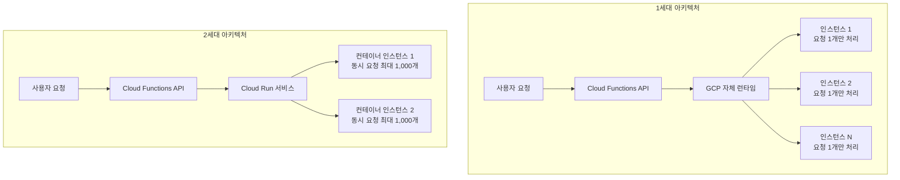
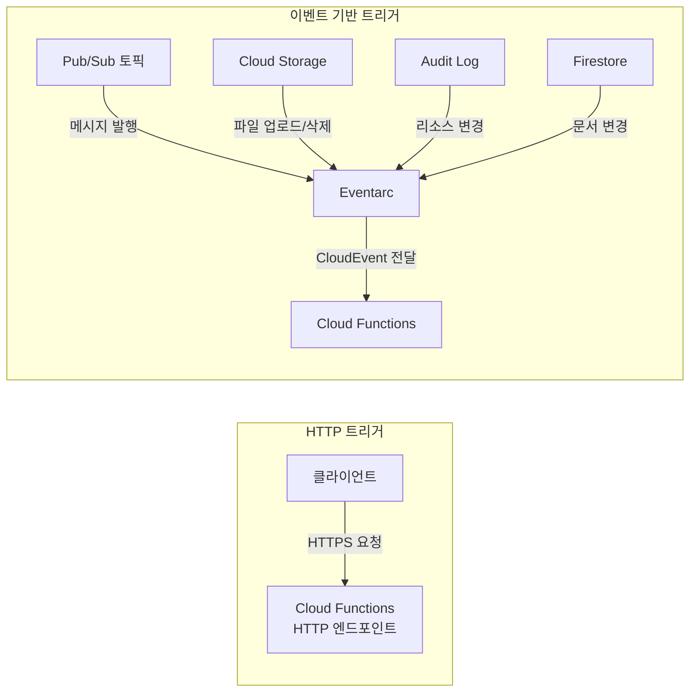
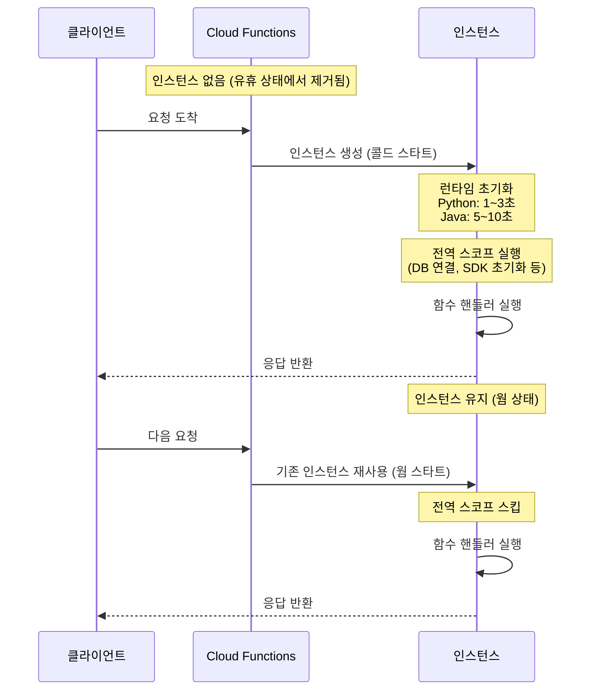
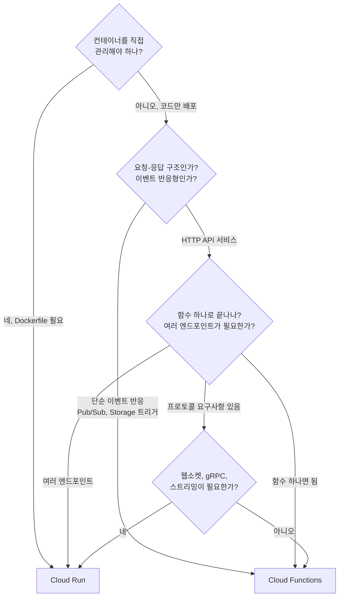

# Cloud Functions

Cloud Functions는 GCP의 FaaS(Function as a Service) 서비스다. 코드를 함수 단위로 배포하면 요청이 들어올 때만 실행되고, 실행 시간 기준으로 과금된다. AWS Lambda와 같은 포지션이다.

현재 1세대(1st gen)와 2세대(2nd gen)가 공존하는데, 2세대는 내부적으로 Cloud Run 위에서 돌아간다. 콘솔에서 함수를 만들 때 세대를 선택하게 되어 있고, 기본값이 2세대로 바뀌었다.

---

## 1세대 vs 2세대

### 아키텍처 차이

1세대와 2세대는 내부 구조 자체가 다르다. 1세대는 GCP 자체 런타임 위에서 돌고, 2세대는 Cloud Run 컨테이너 위에서 돌아간다.



1세대는 요청 하나당 인스턴스 하나가 뜬다. 동시에 100개 요청이 오면 인스턴스 100개가 필요하다. 2세대는 Cloud Run 컨테이너 기반이라 하나의 인스턴스가 여러 요청을 동시에 처리한다. 이 구조 차이가 스펙 제한, 비용, 콜드 스타트 전부에 영향을 준다.

### 핵심 차이

| 항목 | 1세대 | 2세대 |
|------|-------|-------|
| 최대 타임아웃 | 540초 (9분) | 3,600초 (60분) |
| 최대 메모리 | 8GB | 32GB |
| 최대 vCPU | 2 | 8 |
| 동시 요청 처리 | 인스턴스당 1개 | 인스턴스당 최대 1,000개 |
| 최소 인스턴스 | 미지원 | 지원 |
| 트래픽 분할 | 미지원 | 지원 (Cloud Run 리비전 기반) |

### 언제 2세대를 써야 하는가

사실상 신규 프로젝트는 2세대를 쓰면 된다. 1세대를 선택해야 할 이유가 거의 없다. 다만 1세대로 돌고 있는 기존 함수를 2세대로 마이그레이션할 때는 주의할 점이 있다.

1세대에서는 인스턴스당 요청이 1개라서 전역 변수를 대충 써도 문제가 없었다. 2세대에서는 동시 요청이 들어오기 때문에 전역 상태를 공유하면 레이스 컨디션이 발생할 수 있다.

```python
# 1세대에서는 문제 없었지만 2세대에서 위험한 코드
counter = 0

def handle_request(request):
    global counter
    counter += 1  # 동시 요청 환경에서 정확한 값 보장 안 됨
    return f"count: {counter}"
```

1세대에서 `concurrency=1`이 보장되니까 이런 코드가 동작했는데, 2세대로 옮기면서 동시성 설정을 기본값(최대 동시 요청)으로 뒀다가 데이터가 꼬이는 경우가 있다. 마이그레이션할 때 `--concurrency=1`로 설정하면 1세대와 동일하게 동작하긴 하지만, 그러면 2세대를 쓰는 의미가 줄어든다. 코드를 수정하는 게 맞다.

---

## 트리거 종류별 사용법

Cloud Functions의 트리거는 크게 HTTP 직접 호출과 이벤트 기반 호출로 나뉜다. 이벤트 기반 트리거는 내부적으로 Eventarc(2세대)나 직접 이벤트 연동(1세대)을 통해 함수를 실행한다.



### HTTP 트리거

가장 기본적인 트리거다. HTTPS 엔드포인트가 생기고, 요청이 오면 함수가 실행된다.

```python
import functions_framework

@functions_framework.http
def hello(request):
    name = request.args.get("name", "World")
    return f"Hello, {name}"
```

배포 명령어:

```bash
gcloud functions deploy hello \
  --gen2 \
  --runtime=python312 \
  --region=asia-northeast3 \
  --trigger-http \
  --allow-unauthenticated \
  --memory=256Mi \
  --timeout=60s
```

`--allow-unauthenticated`를 넣으면 누구나 호출할 수 있다. 내부 API용이면 이 플래그를 빼고, IAM으로 인증을 제어해야 한다. 실수로 외부에 열어두면 과금 폭탄을 맞을 수 있다. 콘솔에서 함수 만들 때 "인증 필요" 체크를 자주 확인해야 한다.

인증된 호출은 이렇게 한다:

```bash
# 서비스 계정 토큰으로 호출
curl -H "Authorization: Bearer $(gcloud auth print-identity-token)" \
  https://asia-northeast3-my-project.cloudfunctions.net/hello
```

### Pub/Sub 트리거

Pub/Sub 토픽에 메시지가 발행되면 함수가 실행된다. 비동기 처리에 많이 쓴다. 주문 처리, 알림 발송, 로그 집계 같은 작업에 적합하다.

```python
import base64
import json
import functions_framework

@functions_framework.cloud_event
def process_message(cloud_event):
    data = base64.b64decode(cloud_event.data["message"]["data"]).decode()
    payload = json.loads(data)
    
    user_id = payload["user_id"]
    action = payload["action"]
    
    # 처리 로직
    print(f"Processing {action} for user {user_id}")
```

```bash
gcloud functions deploy process-message \
  --gen2 \
  --runtime=python312 \
  --region=asia-northeast3 \
  --trigger-topic=my-topic \
  --memory=512Mi \
  --timeout=120s \
  --retry
```

`--retry` 플래그가 중요하다. 함수가 에러를 반환하면 Pub/Sub가 메시지를 다시 전달한다. 다만 재시도가 무한히 반복되면 곤란하니까, 데드레터 토픽을 설정해서 일정 횟수 실패한 메시지를 따로 빼야 한다.

재시도를 켜면 함수가 멱등(idempotent)해야 한다. 같은 메시지가 두 번 들어와도 결과가 같아야 한다는 뜻이다. DB에 INSERT 하는 함수라면 중복 체크를 넣거나, Pub/Sub 메시지 ID를 기준으로 중복을 걸러야 한다.

```python
import functions_framework
from google.cloud import firestore

db = firestore.Client()

@functions_framework.cloud_event
def idempotent_handler(cloud_event):
    message_id = cloud_event.data["message"]["messageId"]
    
    # 이미 처리한 메시지인지 확인
    doc_ref = db.collection("processed_messages").document(message_id)
    if doc_ref.get().exists:
        print(f"Already processed: {message_id}")
        return
    
    # 처리 로직
    # ...
    
    # 처리 완료 기록
    doc_ref.set({"processed_at": firestore.SERVER_TIMESTAMP})
```

### Cloud Storage 트리거

버킷에 파일이 올라오거나 삭제되면 함수가 실행된다. 이미지 리사이징, 파일 변환, 데이터 파이프라인 시작점으로 많이 쓴다.

```python
import functions_framework
from google.cloud import storage

@functions_framework.cloud_event
def process_upload(cloud_event):
    data = cloud_event.data
    bucket_name = data["bucket"]
    file_name = data["name"]
    
    # 무한 루프 방지: 처리 결과를 같은 버킷에 쓰면 트리거가 다시 발동한다
    if file_name.startswith("processed/"):
        return
    
    client = storage.Client()
    bucket = client.bucket(bucket_name)
    blob = bucket.blob(file_name)
    
    content = blob.download_as_text()
    # 처리 로직
```

```bash
gcloud functions deploy process-upload \
  --gen2 \
  --runtime=python312 \
  --region=asia-northeast3 \
  --trigger-event-filters="type=google.cloud.storage.object.v1.finalized" \
  --trigger-event-filters="bucket=my-bucket" \
  --memory=1Gi \
  --timeout=300s
```

Storage 트리거에서 가장 흔한 실수는 **무한 루프**다. 함수가 파일을 처리하고 결과를 같은 버킷에 쓰면, 그 쓰기가 다시 트리거를 발동시킨다. 위 예제처럼 파일명 prefix로 구분하거나, 처리 결과를 다른 버킷에 쓰는 게 확실하다.

### Eventarc 트리거 (2세대 전용)

2세대에서 추가된 트리거 방식이다. Cloud Audit Log 이벤트를 잡아서 함수를 실행할 수 있다. 예를 들어 BigQuery 테이블이 생성되거나, Compute Engine 인스턴스가 시작될 때 반응하는 함수를 만들 수 있다.

```bash
gcloud functions deploy audit-logger \
  --gen2 \
  --runtime=python312 \
  --region=asia-northeast3 \
  --trigger-event-filters="type=google.cloud.audit.log.v1.written" \
  --trigger-event-filters="serviceName=bigquery.googleapis.com" \
  --trigger-event-filters="methodName=google.cloud.bigquery.v2.TableService.InsertTable" \
  --memory=256Mi \
  --timeout=60s
```

Audit Log 기반이라 이벤트가 들어오기까지 지연이 있다. 실시간 반응이 필요한 곳에는 적합하지 않고, 감사 로그 수집이나 리소스 변경 추적 용도로 쓴다.

---

## 타임아웃과 메모리 설정

### 타임아웃 실수 사례

기본 타임아웃이 60초다. 외부 API 호출이나 대용량 파일 처리를 하면서 타임아웃을 기본값으로 둔 채 배포하는 경우가 많다.

```bash
# 타임아웃 60초(기본값)로 배포 — 대용량 CSV 처리에서 타임아웃 발생
gcloud functions deploy csv-processor \
  --gen2 \
  --runtime=python312 \
  --trigger-topic=csv-process \
  --memory=512Mi
  # --timeout 미설정 → 기본 60초
```

CSV 파일이 작을 때는 괜찮다가, 파일 크기가 커지면 갑자기 함수가 중간에 끊긴다. 로그에 `Function execution took X ms, finished with status: timeout`이 찍히는데, 이걸 못 보고 "함수가 왜 안 도나" 하며 한참 헤매는 경우가 있다.

타임아웃을 늘리는 것만으로 해결하면 안 되는 상황도 있다. 2세대 최대 타임아웃이 60분인데, 처리 시간이 그 이상 걸릴 수 있다면 작업을 나눠야 한다. 큰 파일을 청크로 쪼개서 Pub/Sub으로 분산 처리하는 구조가 일반적이다.

```python
# 큰 파일을 청크로 나눠서 Pub/Sub으로 분산 처리하는 패턴
from google.cloud import pubsub_v1, storage

publisher = pubsub_v1.PublisherClient()
topic_path = publisher.topic_path("my-project", "chunk-process")

@functions_framework.cloud_event
def split_large_file(cloud_event):
    data = cloud_event.data
    client = storage.Client()
    bucket = client.bucket(data["bucket"])
    blob = bucket.blob(data["name"])
    
    content = blob.download_as_text()
    lines = content.strip().split("\n")
    header = lines[0]
    
    chunk_size = 1000
    for i in range(1, len(lines), chunk_size):
        chunk = [header] + lines[i:i + chunk_size]
        publisher.publish(
            topic_path,
            data="\n".join(chunk).encode(),
            source_file=data["name"],
            chunk_index=str(i // chunk_size)
        )
```

### 메모리 설정 실수 사례

메모리를 128MB로 설정해두고 pandas로 CSV를 읽다가 OOM(Out of Memory)으로 죽는 경우가 흔하다. Cloud Functions에서 OOM이 발생하면 로그에 별다른 에러 메시지 없이 함수가 죽는다. 로그에 `Memory limit of XXX MB exceeded`가 찍히면 다행이고, 그냥 `finished with status: error` 한 줄만 나올 때도 있다.

```bash
# 메모리 128MB로 pandas 작업 — 거의 확실하게 OOM
gcloud functions deploy data-processor \
  --gen2 \
  --runtime=python312 \
  --trigger-http \
  --memory=128Mi \
  --timeout=300s
```

pandas의 `read_csv`는 파일 크기의 3~5배 메모리를 잡아먹는다. 10MB CSV를 처리하려면 최소 256MB는 잡아야 하고, 변환 작업이 들어가면 512MB는 필요하다.

2세대에서는 메모리와 vCPU가 연동된다. 메모리를 낮게 잡으면 CPU도 적게 할당된다. 계산이 많은 작업에서 메모리는 남는데 CPU가 부족해서 느려지는 경우가 있다. 이때는 메모리를 더 올려서 CPU를 확보하거나, `--cpu` 플래그로 직접 지정한다.

```bash
# CPU를 직접 지정하는 방법 (2세대)
gcloud functions deploy compute-heavy \
  --gen2 \
  --runtime=python312 \
  --trigger-http \
  --memory=512Mi \
  --cpu=1 \
  --timeout=300s
```

### 콜드 스타트

함수가 한동안 호출되지 않으면 인스턴스가 내려간다. 다시 요청이 오면 인스턴스를 새로 띄우는데, 이게 콜드 스타트다.



콜드 스타트 시간은 런타임마다 다르다. Python이나 Node.js는 1~3초, Java는 5~10초 걸릴 수 있다. 전역 스코프에서 DB 연결이나 SDK 초기화를 하면 그만큼 더 길어진다.

2세대에서는 최소 인스턴스를 설정할 수 있다. 인스턴스를 미리 띄워두면 콜드 스타트가 없어지는데, 유휴 상태에서도 비용이 발생한다.

```bash
gcloud functions deploy latency-sensitive \
  --gen2 \
  --runtime=python312 \
  --trigger-http \
  --memory=256Mi \
  --min-instances=1 \
  --max-instances=100
```

`--min-instances=1`로 설정하면 항상 인스턴스 하나가 떠 있다. 트래픽이 예측 가능하다면 적절한 수를 설정하면 되고, 비용이 부담되면 0으로 두되 런타임을 가벼운 걸로 바꾸는 것도 방법이다. Python이나 Node.js가 Java보다 콜드 스타트가 훨씬 짧다.

---

## VPC 연결

Cloud Functions에서 VPC 내부의 리소스(Cloud SQL, Memorystore, GKE 내부 서비스 등)에 접근하려면 VPC 연결 설정이 필요하다. 두 가지 방식이 있다.

### Serverless VPC Access 커넥터

기존 방식이다. 커넥터를 만들고 함수에 연결하면 VPC 내부로 트래픽을 라우팅한다.

```bash
# VPC 커넥터 생성
gcloud compute networks vpc-access connectors create my-connector \
  --region=asia-northeast3 \
  --network=default \
  --range=10.8.0.0/28 \
  --min-instances=2 \
  --max-instances=3

# 함수에 VPC 커넥터 연결
gcloud functions deploy my-func \
  --gen2 \
  --runtime=python312 \
  --trigger-http \
  --vpc-connector=my-connector \
  --egress-settings=private-ranges-only
```

`--egress-settings`는 두 가지 값이 있다:

- `private-ranges-only`: RFC 1918 대역(10.x, 172.16.x, 192.168.x) 트래픽만 VPC 커넥터를 통과한다. 외부 API 호출은 직접 나간다. 대부분 이 설정으로 충분하다.
- `all-traffic`: 모든 아웃바운드 트래픽이 VPC를 거친다. Cloud NAT로 고정 IP를 잡아야 할 때 쓴다.

커넥터 자체가 VM 인스턴스로 돌아간다. `e2-micro` 기준으로 최소 2개가 항상 떠 있어야 하니까 월 비용이 발생한다. 함수를 안 쓰더라도 커넥터 비용은 나온다. 이걸 모르고 테스트용으로 커넥터를 여러 개 만들어 놓으면 비용이 쌓인다.

### Direct VPC Egress (2세대 전용)

2세대에서 추가된 방식이다. 별도의 커넥터 없이 함수가 직접 VPC 서브넷에 붙는다. 커넥터 비용이 없고 설정도 간단하다.

```bash
gcloud functions deploy my-func \
  --gen2 \
  --runtime=python312 \
  --trigger-http \
  --network=default \
  --subnet=default \
  --region=asia-northeast3 \
  --egress-settings=private-ranges-only
```

커넥터 방식보다 네트워크 레이턴시가 낮고, 커넥터 인스턴스 비용도 안 든다. 2세대를 쓰고 있다면 Direct VPC Egress를 쓰는 게 낫다. 다만 서브넷에 `/28` 이상의 빈 IP 범위가 있어야 한다. IP가 부족한 서브넷에서는 배포가 실패한다.

### Cloud SQL 연결 예시

Cloud Functions에서 Cloud SQL을 연결하는 건 VPC 설정과 별개로 Unix 소켓 방식을 쓸 수 있다. Cloud SQL Auth Proxy가 내장되어 있어서 VPC 커넥터 없이도 연결된다.

```python
import sqlalchemy

def get_pool():
    return sqlalchemy.create_engine(
        sqlalchemy.engine.url.URL.create(
            drivername="postgresql+pg8000",
            username="myuser",
            password="mypassword",  # Secret Manager 사용 권장
            database="mydb",
            query={
                "unix_sock": "/cloudsql/PROJECT:REGION:INSTANCE/.s.PGSQL.5432"
            }
        ),
        pool_size=5,
        max_overflow=2,
        pool_timeout=30,
        pool_recycle=1800,
    )
```

```bash
gcloud functions deploy sql-func \
  --gen2 \
  --runtime=python312 \
  --trigger-http \
  --set-env-vars="INSTANCE_CONNECTION_NAME=my-project:asia-northeast3:my-instance"
```

주의: 2세대에서 Cloud SQL을 Unix 소켓으로 연결할 때, Cloud Run 서비스 설정에서 Cloud SQL 연결을 명시해야 한다. `gcloud functions deploy`에 `--run-service-account`와 Cloud SQL 클라이언트 역할이 있는 서비스 계정을 넣어야 한다.

---

## 모니터링과 로깅

### Cloud Logging에서 함수 로그 확인

Cloud Functions의 `print()`나 `logging` 모듈 출력은 자동으로 Cloud Logging에 수집된다. 별도 설정 없이 바로 사용할 수 있다.

```bash
# 특정 함수의 최근 로그 조회
gcloud functions logs read my-func \
  --gen2 \
  --region=asia-northeast3 \
  --limit=50

# 에러 로그만 필터링
gcloud logging read 'resource.type="cloud_run_revision"
  AND resource.labels.service_name="my-func"
  AND severity>=ERROR' \
  --limit=20 \
  --format="table(timestamp, textPayload)"
```

2세대는 내부적으로 Cloud Run이기 때문에 Logging에서 리소스 타입이 `cloud_run_revision`으로 잡힌다. 처음에 `cloud_function`으로 필터링하면 로그가 안 보여서 당황하는 경우가 있다.

구조화된 로깅을 쓰면 로그 탐색이 편하다. JSON 형태로 출력하면 Cloud Logging이 자동으로 필드를 파싱한다.

```python
import json
import logging

logger = logging.getLogger(__name__)

@functions_framework.http
def my_func(request):
    # 구조화된 로그 출력
    log_entry = {
        "severity": "INFO",
        "message": "Request processed",
        "user_id": request.args.get("user_id"),
        "endpoint": request.path,
        "method": request.method
    }
    print(json.dumps(log_entry))
    
    return "OK"
```

### 에러 추적

Cloud Error Reporting이 기본으로 연동되어 있다. 함수에서 예외가 발생하면 자동으로 Error Reporting에 수집되고, 같은 종류의 에러끼리 그룹핑된다. 콘솔에서 "Error Reporting" 메뉴에 들어가면 에러 발생 빈도와 스택 트레이스를 볼 수 있다.

함수 실행 지표는 Cloud Monitoring에서 확인한다. 콘솔의 Cloud Functions 상세 페이지에서 기본 메트릭을 바로 볼 수 있고, 주요 지표는 다음과 같다:

- **실행 횟수**: `cloudfunctions.googleapis.com/function/execution_count`
- **실행 시간**: `cloudfunctions.googleapis.com/function/execution_times`
- **메모리 사용량**: `cloudfunctions.googleapis.com/function/user_memory_bytes`
- **인스턴스 수**: `cloudfunctions.googleapis.com/function/active_instances`

알림을 설정할 때는 에러율과 실행 시간에 걸어두는 게 기본이다. 에러율이 갑자기 올라가거나 실행 시간이 타임아웃에 근접하면 알림이 오도록 해야 한다.

```bash
# Monitoring 알림 정책 생성 예시 (에러율 기반)
gcloud alpha monitoring policies create \
  --notification-channels="projects/my-project/notificationChannels/12345" \
  --display-name="Cloud Function Error Rate" \
  --condition-display-name="Error rate > 5%" \
  --condition-filter='resource.type="cloud_function" AND metric.type="cloudfunctions.googleapis.com/function/execution_count" AND metric.labels.status!="ok"' \
  --condition-threshold-value=5 \
  --condition-threshold-comparison=COMPARISON_GT
```

---

## Cloud Functions vs Cloud Run 선택 기준

Cloud Functions 2세대가 내부적으로 Cloud Run 위에서 돌아가기 때문에, 이 둘의 경계가 모호하다. 어떤 걸 써야 하는지 실무에서 자주 고민하게 된다.



**Cloud Functions가 맞는 경우:**

- Pub/Sub 메시지 처리, Storage 파일 업로드 반응 같은 이벤트 드리븐 작업
- 단일 함수 하나로 끝나는 단순한 HTTP 엔드포인트
- 빠르게 프로토타이핑하고 싶을 때 (컨테이너 빌드 없이 코드만 올림)
- Cloud Scheduler와 연동하는 크론 작업

**Cloud Run이 맞는 경우:**

- Flask/FastAPI 같은 프레임워크로 여러 라우트를 가진 API 서비스
- 특정 시스템 라이브러리가 필요해서 Dockerfile을 직접 작성해야 할 때
- 웹소켓이나 gRPC, 서버 사이드 스트리밍이 필요할 때
- 컨테이너 이미지를 직접 빌드하고 관리하는 게 익숙한 팀

실무에서 겪는 패턴은 이렇다. 처음에 Cloud Functions로 시작했다가 엔드포인트가 늘어나면 Cloud Run으로 넘어가는 경우가 많다. Cloud Functions 2세대는 사실 Cloud Run 서비스이기 때문에 콘솔에서 Cloud Run 쪽에서도 해당 서비스가 보인다. 마이그레이션이 어렵지 않다.

---

## 비용 구조

Cloud Functions 과금은 세 가지 축으로 나뉜다:

- **호출 횟수**: 월 200만 회까지 무료, 이후 100만 회당 $0.40
- **컴퓨팅 시간**: GB-초(메모리) + GHz-초(CPU) 기준으로 과금. 월 40만 GB-초, 20만 GHz-초까지 무료
- **네트워킹**: 아웃바운드 트래픽은 월 5GB까지 무료, 이후 GB당 $0.12

무료 티어가 넉넉해서 트래픽이 적은 서비스는 비용이 거의 안 나온다. 문제는 예상 못 한 상황에서 비용이 튀는 경우다.

### 과금 실수 사례

**인증 없이 HTTP 함수를 열어둔 경우**: `--allow-unauthenticated`로 배포한 함수 URL이 외부에 노출되면, 봇이 무차별로 요청을 보내서 호출 횟수가 폭증한다. 하루에 수십만 건 호출이 찍히면서 비용이 나온다. `--max-instances`를 설정하면 인스턴스 수는 제한되지만, 호출 자체는 429로 거부되기 전에 과금 카운트가 올라간다.

**무한 루프 트리거**: Storage 트리거에서 결과를 같은 버킷에 쓰면 트리거가 무한히 반복된다. 이건 과금보다 더 심각한 게, 1분 안에 수만 건 실행이 되면서 다운스트림 서비스까지 영향을 준다. max-instances를 걸어두면 피해를 줄일 수 있다.

**최소 인스턴스 비용 간과**: `--min-instances=5`로 설정하면 요청이 없어도 5개 인스턴스가 항상 떠 있다. 인스턴스당 메모리가 1GB이면 유휴 비용만 월 수십 달러가 나온다. 개발 환경에서 min-instances를 프로덕션과 동일하게 설정하는 실수가 흔하다.

**VPC 커넥터 비용**: 커넥터 하나에 최소 `e2-micro` 2대가 항상 돈다. 리전별로 커넥터를 만들면 그만큼 비용이 늘어난다. 테스트 프로젝트에서 커넥터를 만들고 방치하면 월 $10~20씩 나간다.

비용을 관리하려면 Budget Alert을 설정하고, Cloud Billing에서 서비스별 비용을 주기적으로 확인해야 한다.

```bash
# 프로젝트 예산 알림 설정
gcloud billing budgets create \
  --billing-account=BILLING_ACCOUNT_ID \
  --display-name="Cloud Functions Monthly Budget" \
  --budget-amount=50USD \
  --threshold-rule=percent=50 \
  --threshold-rule=percent=90 \
  --threshold-rule=percent=100
```

---

## CI/CD 연동

### Cloud Build로 자동 배포

Cloud Build를 쓰면 Git 푸시 시 함수를 자동으로 배포할 수 있다. 프로젝트 루트에 `cloudbuild.yaml`을 작성한다.

```yaml
# cloudbuild.yaml
steps:
  # 테스트 실행
  - name: 'python:3.12'
    entrypoint: 'bash'
    args:
      - '-c'
      - |
        pip install -r requirements.txt
        pip install pytest
        pytest tests/ -v

  # 함수 배포
  - name: 'gcr.io/google.com/cloudsdktool/cloud-sdk'
    entrypoint: 'bash'
    args:
      - '-c'
      - |
        gcloud functions deploy my-func \
          --gen2 \
          --runtime=python312 \
          --region=asia-northeast3 \
          --trigger-http \
          --memory=512Mi \
          --timeout=120s \
          --service-account=my-func-sa@${PROJECT_ID}.iam.gserviceaccount.com
```

Cloud Build 트리거를 연결한다:

```bash
gcloud builds triggers create github \
  --repo-name=my-repo \
  --repo-owner=my-org \
  --branch-pattern="^main$" \
  --build-config=cloudbuild.yaml
```

이렇게 하면 main 브랜치에 푸시할 때마다 테스트를 돌리고, 통과하면 함수를 배포한다.

### 여러 함수를 한 번에 배포하기

함수가 여러 개일 때 각각 `gcloud functions deploy`를 실행하면 느리다. Cloud Build에서 병렬로 배포하는 건 지원하지 않지만, 쉘 스크립트로 백그라운드 실행을 하면 된다.

```yaml
# cloudbuild.yaml — 여러 함수 병렬 배포
steps:
  - name: 'gcr.io/google.com/cloudsdktool/cloud-sdk'
    entrypoint: 'bash'
    args:
      - '-c'
      - |
        gcloud functions deploy func-a \
          --gen2 --runtime=python312 --region=asia-northeast3 \
          --trigger-topic=topic-a --source=./functions/func-a &
        gcloud functions deploy func-b \
          --gen2 --runtime=python312 --region=asia-northeast3 \
          --trigger-topic=topic-b --source=./functions/func-b &
        wait
```

`--source` 플래그로 각 함수의 소스 디렉토리를 지정한다. 모노레포에서 함수별로 디렉토리를 나눠놓으면 이 방식이 깔끔하다.

### 배포 롤백

2세대는 Cloud Run 리비전 기반이라 트래픽 분할로 롤백할 수 있다. 새 버전에 문제가 있으면 이전 리비전으로 트래픽을 돌린다.

```bash
# 현재 리비전 목록 확인
gcloud run revisions list --service=my-func --region=asia-northeast3

# 이전 리비전으로 트래픽 100% 전환
gcloud run services update-traffic my-func \
  --region=asia-northeast3 \
  --to-revisions=my-func-00001-abc=100
```

카나리 배포도 가능하다. 새 버전에 10%만 보내고, 문제 없으면 100%로 올리는 식이다.

```bash
# 새 리비전에 10%만 트래픽 할당
gcloud run services update-traffic my-func \
  --region=asia-northeast3 \
  --to-revisions=my-func-00002-def=10,my-func-00001-abc=90
```

---

## 로컬 개발과 테스트

### Functions Framework

배포 전에 로컬에서 함수를 테스트할 수 있다. `functions-framework` 패키지를 설치하면 된다.

```bash
pip install functions-framework

# HTTP 트리거 함수 로컬 실행
functions-framework --target=hello --debug --port=8080
```

```bash
# 다른 터미널에서 테스트
curl http://localhost:8080?name=Test
```

Pub/Sub이나 Storage 트리거 함수는 CloudEvent 형식으로 요청을 보내야 한다.

```bash
curl -X POST http://localhost:8080 \
  -H "Content-Type: application/cloudevents+json" \
  -d '{
    "specversion": "1.0",
    "type": "google.cloud.pubsub.topic.v1.messagePublished",
    "source": "//pubsub.googleapis.com/projects/my-project/topics/my-topic",
    "id": "test-id",
    "data": {
      "message": {
        "data": "'$(echo -n '{"user_id": "123", "action": "signup"}' | base64)'"
      }
    }
  }'
```

### 환경 변수와 시크릿

환경 변수는 배포 시 설정한다.

```bash
gcloud functions deploy my-func \
  --gen2 \
  --set-env-vars="DB_HOST=10.0.0.1,DB_NAME=mydb" \
  --runtime=python312 \
  --trigger-http
```

API 키 같은 민감한 값은 환경 변수 대신 Secret Manager를 써야 한다. 환경 변수는 콘솔에서 누구나 볼 수 있고, 배포 설정에 평문으로 남는다.

```bash
# Secret Manager에 시크릿 생성
echo -n "my-api-key" | gcloud secrets create api-key --data-file=-

# 함수에서 시크릿 참조
gcloud functions deploy my-func \
  --gen2 \
  --set-secrets="API_KEY=api-key:latest" \
  --runtime=python312 \
  --trigger-http
```

코드에서는 일반 환경 변수처럼 `os.environ["API_KEY"]`로 읽으면 된다. Secret Manager 클라이언트 라이브러리를 쓸 필요 없이, Cloud Functions가 배포 시점에 시크릿 값을 환경 변수로 주입해준다.

---

## 배포 시 자주 겪는 문제

### requirements.txt 누락

Python 함수를 배포할 때 `requirements.txt`에 의존성을 빼먹으면 배포는 성공하는데 실행 시 `ModuleNotFoundError`가 난다. 로컬에서는 가상환경에 패키지가 깔려 있으니 문제없이 돌아가다가, 배포 후에야 발견하게 된다.

### 리전 불일치

함수와 트리거 리소스의 리전이 다르면 동작하지 않거나 지연이 발생한다. Pub/Sub 토픽은 글로벌이라 상관없지만, Cloud Storage 트리거는 버킷과 함수가 같은 리전에 있어야 한다. 2세대에서 Eventarc 트리거를 쓸 때도 리전을 맞춰야 한다.

### 서비스 계정 권한

Cloud Functions는 기본적으로 프로젝트의 기본 서비스 계정으로 실행된다. 이 계정에 필요한 권한이 없으면 함수가 실행은 되는데 외부 리소스 접근에서 `403 Permission Denied`가 난다. 프로덕션에서는 함수별로 전용 서비스 계정을 만들어서 최소 권한만 부여하는 게 맞다.

```bash
# 전용 서비스 계정으로 배포
gcloud functions deploy my-func \
  --gen2 \
  --runtime=python312 \
  --trigger-http \
  --service-account=my-func-sa@my-project.iam.gserviceaccount.com
```
