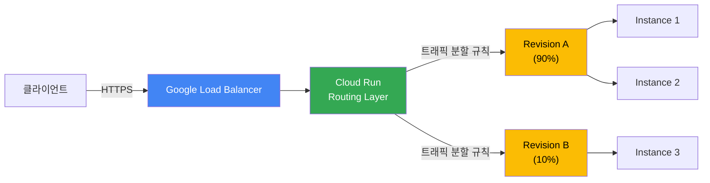
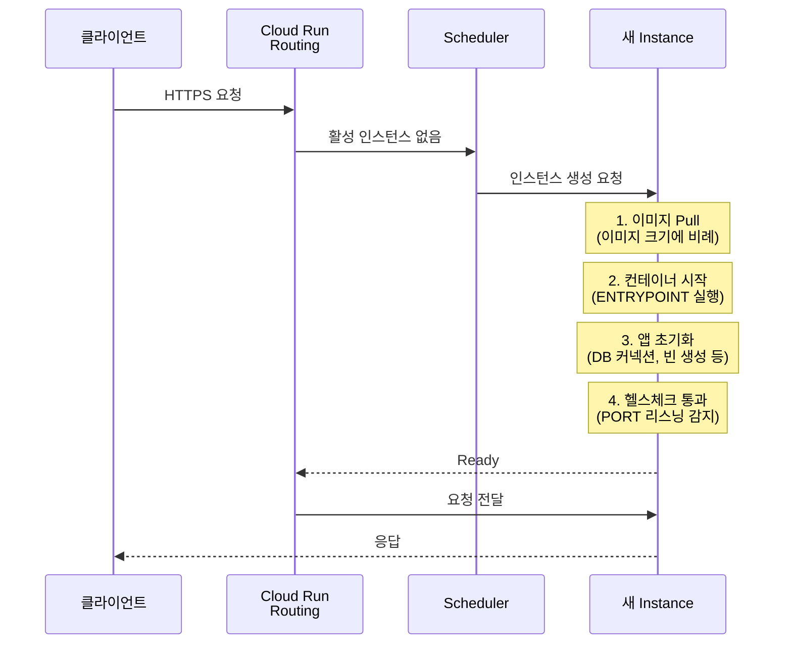
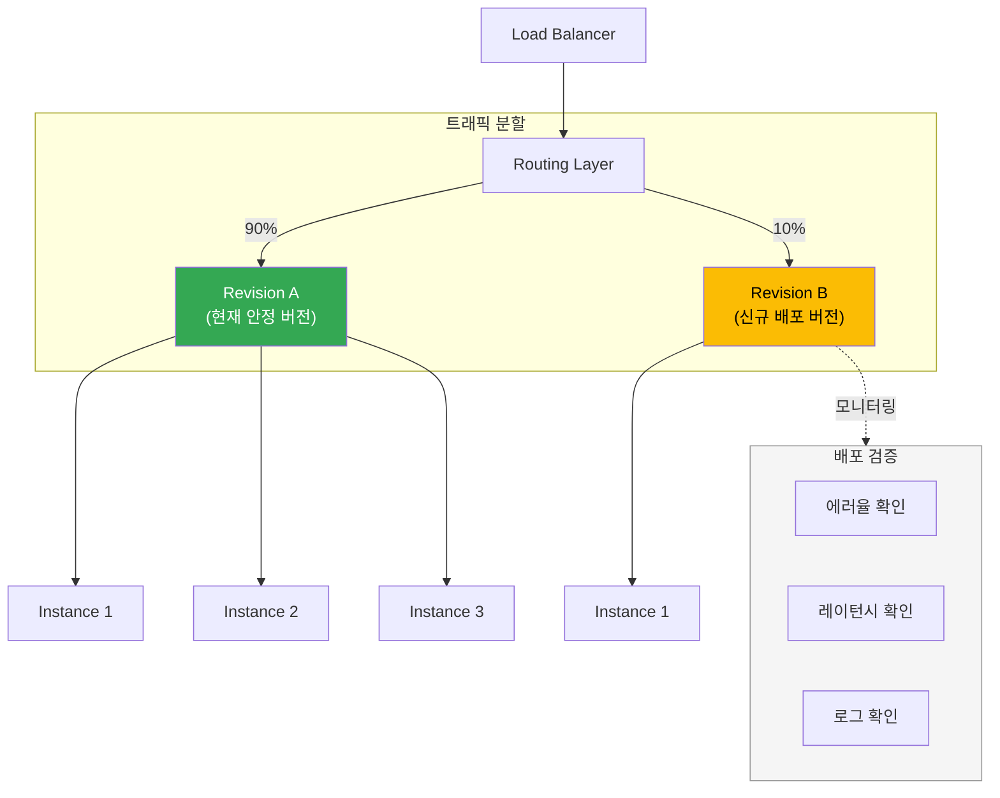

# Cloud Run

Cloud Run은 GCP의 컨테이너 기반 서버리스 서비스다. Docker 이미지를 넣으면 알아서 HTTPS 엔드포인트를 만들어준다. VM 관리가 필요 없고 트래픽이 없으면 인스턴스가 0으로 줄어든다. AWS의 Fargate + Lambda를 합친 것과 비슷한데, 사용 모델은 좀 다르다.

---

## 요청 처리 흐름

Cloud Run이 요청을 받아서 처리하는 과정은 다음과 같다.



클라이언트의 HTTPS 요청은 Google의 로드 밸런서를 거쳐 Cloud Run의 라우팅 레이어에 도달한다. 라우팅 레이어는 트래픽 분할 설정에 따라 적절한 리비전으로 요청을 전달하고, 각 리비전은 오토스케일링 정책에 맞춰 인스턴스에 요청을 분배한다. 인스턴스가 없으면 새로 생성하는데, 이 과정이 콜드 스타트다.

---

## 배포 방식

### 소스 기반 배포

Dockerfile이 있으면 소스 코드를 직접 배포할 수 있다. 내부적으로 Cloud Build가 돌면서 이미지를 빌드하고 Artifact Registry에 올린 뒤 배포한다.

```bash
gcloud run deploy my-service \
  --source . \
  --region=asia-northeast3 \
  --allow-unauthenticated
```

편하긴 한데 빌드 과정을 직접 제어하기 어렵다. `cloudbuild.yaml`을 따로 작성하지 않으면 Buildpacks가 자동으로 이미지를 만드는데, 의존성이 복잡한 프로젝트에서는 빌드가 깨지는 경우가 있다. 처음 테스트할 때는 괜찮지만 프로덕션에서는 이미지를 직접 빌드해서 올리는 게 낫다.

### 이미지 직접 배포

미리 빌드한 이미지를 지정해서 배포한다. Artifact Registry나 Docker Hub 이미지를 쓸 수 있다.

```bash
# Artifact Registry에 이미지 푸시
docker build -t asia-northeast3-docker.pkg.dev/my-project/my-repo/my-service:v1 .
docker push asia-northeast3-docker.pkg.dev/my-project/my-repo/my-service:v1

# Cloud Run에 배포
gcloud run deploy my-service \
  --image=asia-northeast3-docker.pkg.dev/my-project/my-repo/my-service:v1 \
  --region=asia-northeast3 \
  --port=8080 \
  --allow-unauthenticated
```

`--port`를 빠뜨리는 경우가 많다. Cloud Run은 기본적으로 컨테이너의 8080 포트로 요청을 보내는데, 앱이 다른 포트를 사용하면 `PORT` 환경변수를 읽거나 `--port` 플래그로 맞춰야 한다. Spring Boot 기본 포트가 8080이라 잘 맞지만, Express나 FastAPI 같은 프레임워크는 기본 포트가 다를 수 있으니 확인해야 한다.

### YAML 기반 배포

`service.yaml`을 작성해서 배포하는 방법도 있다. 설정이 많아지면 CLI 플래그를 나열하는 것보다 YAML이 관리하기 편하다.

```yaml
apiVersion: serving.knative.dev/v1
kind: Service
metadata:
  name: my-service
spec:
  template:
    metadata:
      annotations:
        autoscaling.knative.dev/minScale: "1"
        autoscaling.knative.dev/maxScale: "10"
    spec:
      containerConcurrency: 80
      timeoutSeconds: 300
      containers:
        - image: asia-northeast3-docker.pkg.dev/my-project/my-repo/my-service:v1
          ports:
            - containerPort: 8080
          resources:
            limits:
              cpu: "2"
              memory: "1Gi"
          env:
            - name: SPRING_PROFILES_ACTIVE
              value: "prod"
```

```bash
gcloud run services replace service.yaml --region=asia-northeast3
```

Git에 `service.yaml`을 커밋해두면 인프라 변경 이력도 추적할 수 있다.

---

## 콜드 스타트

Cloud Run에서 가장 많이 거론되는 문제다. 트래픽이 없어서 인스턴스가 0이 되면, 다음 요청이 들어올 때 컨테이너를 새로 띄워야 한다. 이 시간이 콜드 스타트다.

### 콜드 스타트 시퀀스

인스턴스가 0인 상태에서 요청이 들어오면 아래 순서로 진행된다.



이미지 pull부터 헬스체크 통과까지 전부 합친 시간이 첫 요청의 응답 시간에 포함된다. Spring Boot 앱이면 3단계(앱 초기화)에서 수 초가 걸리는 경우가 흔하다.

### 콜드 스타트가 길어지는 원인

**이미지 크기가 크면 느리다.** 이미지를 pull하는 시간이 길어진다. Alpine 기반 이미지나 distroless 이미지를 쓰면 줄일 수 있다. Java 앱이면 JRE가 포함되어야 해서 이미지가 300MB 이상 나오는 경우가 흔하다.

**애플리케이션 초기화 시간이 문제다.** Spring Boot는 컴포넌트 스캔, 빈 생성, DB 커넥션 풀 초기화까지 수 초가 걸린다. 콜드 스타트와 합치면 첫 요청에 10초 넘게 걸리는 경우도 있다.

**리전과 이미지 저장소 위치가 다르면 느려진다.** 이미지가 `us-central1`에 있는데 Cloud Run이 `asia-northeast3`에서 돌면 이미지 pull이 오래 걸린다. 같은 리전에 Artifact Registry를 두는 게 좋다.

### 콜드 스타트 줄이는 방법

**최소 인스턴스 설정이 가장 확실하다.** `minScale`을 1 이상으로 설정하면 항상 인스턴스가 떠 있다. 대신 유휴 상태에서도 비용이 발생한다.

```bash
gcloud run deploy my-service \
  --image=... \
  --min-instances=1 \
  --region=asia-northeast3
```

**startup CPU boost를 켠다.** 인스턴스 시작 시 CPU를 일시적으로 더 할당해서 초기화 속도를 높인다.

```bash
gcloud run deploy my-service \
  --image=... \
  --cpu-boost \
  --region=asia-northeast3
```

Spring Boot 같은 프레임워크에서 체감할 수 있는 수준으로 차이가 난다.

**Java라면 GraalVM 네이티브 이미지를 고려한다.** Spring Boot 3 + GraalVM으로 네이티브 이미지를 만들면 기동 시간이 수십 ms로 줄어든다. 빌드 시간이 오래 걸리고 리플렉션 설정이 까다롭지만, 콜드 스타트가 치명적인 서비스라면 시도할 만하다.

**이미지를 작게 만든다.** 멀티스테이지 빌드로 빌드 도구를 제외하고, 런타임에 필요한 파일만 포함한다.

```dockerfile
# 빌드 스테이지
FROM gradle:8.5-jdk21 AS build
WORKDIR /app
COPY . .
RUN gradle bootJar --no-daemon

# 런타임 스테이지
FROM eclipse-temurin:21-jre-alpine
WORKDIR /app
COPY --from=build /app/build/libs/*.jar app.jar
EXPOSE 8080
ENTRYPOINT ["java", "-jar", "app.jar"]
```

---

## Concurrency 설정

Cloud Run에서 `containerConcurrency`(또는 `--concurrency`)는 하나의 인스턴스가 동시에 처리할 수 있는 요청 수를 의미한다.

### 기본값은 80

별도 설정이 없으면 한 인스턴스가 동시에 80개 요청을 받는다. 대부분의 웹 서버는 멀티스레드로 동작하니까 이 정도면 무난하다. 하지만 요청 하나당 CPU나 메모리를 많이 먹는 작업이면 낮춰야 한다.

### 설정 기준

**동기 처리 + CPU 집약 작업이면 낮게 잡는다.** 이미지 변환, PDF 생성 같은 작업은 동시 요청이 많으면 인스턴스가 뻗는다. `--concurrency=1`로 설정하면 한 번에 하나만 처리하고, Cloud Run이 알아서 인스턴스를 늘린다.

```bash
gcloud run deploy image-processor \
  --image=... \
  --concurrency=1 \
  --cpu=2 \
  --memory=2Gi \
  --region=asia-northeast3
```

**일반적인 API 서버는 기본값이나 좀 더 높게 설정한다.** Spring Boot의 기본 톰캣 스레드 풀이 200이니까, Cloud Run의 concurrency를 200 이하로 맞추면 된다. 다만 메모리가 부족하면 OOM이 발생하니까 모니터링하면서 조절해야 한다.

```bash
gcloud run deploy api-server \
  --image=... \
  --concurrency=100 \
  --cpu=2 \
  --memory=1Gi \
  --max-instances=20 \
  --region=asia-northeast3
```

**concurrency와 max-instances의 관계를 이해해야 한다.** 예를 들어 concurrency가 80이고 max-instances가 10이면 최대 동시 처리량은 800이다. 이 한도를 넘으면 요청이 큐에 쌓이거나 429 에러가 발생한다. 트래픽 패턴에 맞게 두 값을 같이 조정해야 한다.

### 주의할 점

concurrency를 1로 설정하면 인스턴스가 요청마다 하나씩 생긴다. 트래픽이 많으면 인스턴스 수가 급격히 늘어나서 비용이 크게 올라갈 수 있다. CPU 집약 작업이 아니라면 1로 설정할 이유가 없다.

요청 처리 중에 메모리 누수가 있으면 concurrency가 높을수록 빨리 OOM으로 죽는다. concurrency를 낮추면 당장은 해결된 것처럼 보이지만 근본적인 해결은 아니다. 메모리 프로파일링을 먼저 해야 한다.

---

## Cloud Build 연동

CI/CD 파이프라인을 구성할 때 Cloud Build로 이미지를 빌드하고 Cloud Run에 배포하는 패턴이 일반적이다.

### cloudbuild.yaml 기본 구성

```yaml
steps:
  # Docker 이미지 빌드
  - name: 'gcr.io/cloud-builders/docker'
    args:
      - 'build'
      - '-t'
      - 'asia-northeast3-docker.pkg.dev/$PROJECT_ID/my-repo/my-service:$SHORT_SHA'
      - '.'

  # Artifact Registry에 푸시
  - name: 'gcr.io/cloud-builders/docker'
    args:
      - 'push'
      - 'asia-northeast3-docker.pkg.dev/$PROJECT_ID/my-repo/my-service:$SHORT_SHA'

  # Cloud Run에 배포
  - name: 'gcr.io/google.com/cloudsdktool/cloud-sdk'
    entrypoint: gcloud
    args:
      - 'run'
      - 'deploy'
      - 'my-service'
      - '--image=asia-northeast3-docker.pkg.dev/$PROJECT_ID/my-repo/my-service:$SHORT_SHA'
      - '--region=asia-northeast3'
      - '--quiet'

images:
  - 'asia-northeast3-docker.pkg.dev/$PROJECT_ID/my-repo/my-service:$SHORT_SHA'

options:
  logging: CLOUD_LOGGING_ONLY
```

### 트리거 설정

GitHub 리포지토리 연동 후 특정 브랜치에 푸시하면 자동으로 빌드가 돌게 설정할 수 있다.

```bash
gcloud builds triggers create github \
  --repo-name=my-repo \
  --repo-owner=my-org \
  --branch-pattern="^main$" \
  --build-config=cloudbuild.yaml \
  --region=asia-northeast3
```

### 연동 시 주의점

**서비스 계정 권한을 확인해야 한다.** Cloud Build는 기본적으로 `[PROJECT_NUMBER]@cloudbuild.gserviceaccount.com` 서비스 계정으로 실행된다. 이 계정에 Cloud Run 배포 권한(`roles/run.admin`)과 서비스 계정 사용 권한(`roles/iam.serviceAccountUser`)이 있어야 한다. 권한이 없으면 빌드는 성공하는데 배포에서 실패한다. 에러 메시지가 직관적이지 않아서 삽질하기 쉽다.

```bash
# Cloud Build 서비스 계정에 권한 부여
PROJECT_NUMBER=$(gcloud projects describe $PROJECT_ID --format='value(projectNumber)')

gcloud projects add-iam-policy-binding $PROJECT_ID \
  --member="serviceAccount:${PROJECT_NUMBER}@cloudbuild.gserviceaccount.com" \
  --role="roles/run.admin"

gcloud projects add-iam-policy-binding $PROJECT_ID \
  --member="serviceAccount:${PROJECT_NUMBER}@cloudbuild.gserviceaccount.com" \
  --role="roles/iam.serviceAccountUser"
```

**빌드 타임아웃을 늘려야 할 수 있다.** Cloud Build의 기본 타임아웃은 10분이다. Java 프로젝트에서 의존성이 많으면 빌드 + 테스트만 10분이 넘는다. `timeout` 설정을 넉넉하게 잡아야 빌드가 중간에 끊기지 않는다.

```yaml
options:
  logging: CLOUD_LOGGING_ONLY
timeout: 1800s  # 30분
```

**시크릿 관리에 주의한다.** 빌드 과정에서 환경변수로 DB 패스워드나 API 키를 넘기면 빌드 로그에 남는다. Secret Manager를 사용하고, Cloud Run 서비스에서 시크릿을 마운트하는 방식이 안전하다.

```yaml
# cloudbuild.yaml에서 Secret Manager 사용
steps:
  - name: 'gcr.io/cloud-builders/docker'
    args: ['build', '-t', '...', '.']
    secretEnv: ['DB_PASSWORD']

availableSecrets:
  secretManager:
    - versionName: projects/$PROJECT_ID/secrets/db-password/versions/latest
      env: 'DB_PASSWORD'
```

Cloud Run 서비스에서 시크릿을 환경변수로 주입하는 방법:

```bash
gcloud run deploy my-service \
  --image=... \
  --set-secrets=DB_PASSWORD=db-password:latest \
  --region=asia-northeast3
```

**`latest` 태그 대신 커밋 SHA를 쓴다.** `latest`로 이미지를 배포하면 어떤 버전이 돌고 있는지 추적이 안 된다. `$SHORT_SHA`나 `$COMMIT_SHA`를 태그로 사용하면 어떤 커밋에서 빌드된 이미지인지 바로 확인할 수 있다. 롤백할 때도 이전 SHA 태그를 지정하면 되니까 편하다.

**Container Registry(`gcr.io`)는 쓰지 않는다.** GCR은 이미 deprecated 상태다. Artifact Registry(`pkg.dev`)를 사용해야 한다. 기존에 GCR을 쓰고 있다면 마이그레이션을 계획해야 한다.

---

## 트래픽 분할

새 버전을 배포할 때 한 번에 전체 트래픽을 넘기지 않고 점진적으로 전환할 수 있다.

### 트래픽 분할 구조



안정 버전에 대부분의 트래픽을 유지하면서, 신규 버전에 소량의 트래픽만 보내서 문제가 없는지 확인한다. 모니터링 결과에 따라 트래픽 비율을 조절하거나 롤백한다.

### 트래픽 분할 명령어

```bash
# 새 리비전에 10%만 보내기
gcloud run services update-traffic my-service \
  --to-revisions=my-service-00002-abc=10 \
  --region=asia-northeast3

# 문제 없으면 100%로 전환
gcloud run services update-traffic my-service \
  --to-latest \
  --region=asia-northeast3
```

카나리 배포처럼 쓸 수 있다. 배포 후 에러율이나 레이턴시를 Cloud Monitoring에서 확인하고, 문제가 있으면 이전 리비전으로 롤백하면 된다.

```bash
# 이전 리비전으로 롤백
gcloud run services update-traffic my-service \
  --to-revisions=my-service-00001-xyz=100 \
  --region=asia-northeast3
```

---

## Cloud Run Jobs

Cloud Run Services는 HTTP 요청을 받아서 처리하는 용도다. 반면 Cloud Run Jobs는 요청 없이 시작해서 작업을 수행하고 종료하는 배치 작업용이다. 데이터 마이그레이션, 정기 리포트 생성, 대량 이메일 발송 같은 작업에 쓴다.

### Jobs와 Services의 차이

| 구분 | Services | Jobs |
|------|----------|------|
| 트리거 | HTTP 요청 | 수동 실행, 스케줄, 워크플로우 |
| 실행 시간 | 요청 타임아웃 (최대 60분) | 최대 24시간 |
| 포트 리스닝 | 필수 (PORT 환경변수) | 불필요 |
| 오토스케일링 | 요청 수 기반 | task 수로 병렬 처리 |
| 종료 | 인스턴스 유지 or scale-to-zero | 작업 완료 시 자동 종료 |

### Job 생성과 실행

```bash
# Job 생성
gcloud run jobs create data-migration \
  --image=asia-northeast3-docker.pkg.dev/my-project/my-repo/migration:v1 \
  --region=asia-northeast3 \
  --cpu=2 \
  --memory=4Gi \
  --max-retries=3 \
  --task-timeout=3600

# Job 실행
gcloud run jobs execute data-migration --region=asia-northeast3

# 실행 상태 확인
gcloud run jobs executions list --job=data-migration --region=asia-northeast3
```

### 병렬 처리

`--tasks` 플래그로 여러 task를 병렬로 실행할 수 있다. 각 task는 `CLOUD_RUN_TASK_INDEX` 환경변수를 받아서 자기가 처리할 데이터 범위를 결정한다.

```bash
# 10개 task를 동시에 5개씩 실행
gcloud run jobs create batch-processor \
  --image=... \
  --tasks=10 \
  --parallelism=5 \
  --region=asia-northeast3
```

```java
// 각 task에서 처리할 범위를 결정하는 예시
int taskIndex = Integer.parseInt(System.getenv("CLOUD_RUN_TASK_INDEX"));
int taskCount = Integer.parseInt(System.getenv("CLOUD_RUN_TASK_COUNT"));

List<Item> allItems = loadItems();
int chunkSize = allItems.size() / taskCount;
int start = taskIndex * chunkSize;
int end = (taskIndex == taskCount - 1) ? allItems.size() : start + chunkSize;

List<Item> myChunk = allItems.subList(start, end);
processItems(myChunk);
```

### Cloud Scheduler와 연동

정기적으로 Job을 실행하려면 Cloud Scheduler를 사용한다.

```bash
gcloud scheduler jobs create http daily-report \
  --location=asia-northeast3 \
  --schedule="0 9 * * *" \
  --uri="https://asia-northeast3-run.googleapis.com/apis/run.googleapis.com/v1/namespaces/my-project/jobs/daily-report:run" \
  --http-method=POST \
  --oauth-service-account-email=scheduler-sa@my-project.iam.gserviceaccount.com
```

Scheduler의 서비스 계정에 `roles/run.invoker` 권한이 있어야 한다. 빠뜨리면 403이 발생하는데, Scheduler 로그에서만 확인할 수 있어서 놓치기 쉽다.

---

## IAM 인증

### 공개 서비스와 인증 필수 서비스

Cloud Run은 기본적으로 `--allow-unauthenticated`를 설정하지 않으면 인증이 필요하다. 외부에 공개할 API가 아니라면 인증을 켜두는 게 맞다.

```bash
# 인증 필수 서비스 배포
gcloud run deploy internal-api \
  --image=... \
  --no-allow-unauthenticated \
  --region=asia-northeast3
```

`--no-allow-unauthenticated`로 배포한 서비스는 유효한 ID 토큰 없이 호출하면 403을 반환한다.

### 서비스 간 호출 인증

Cloud Run 서비스 A에서 서비스 B를 호출하는 경우, 서비스 A의 서비스 계정에 서비스 B에 대한 `roles/run.invoker` 권한을 부여해야 한다. 그리고 호출 시 ID 토큰을 Authorization 헤더에 넣어야 한다.

```bash
# 서비스 A의 서비스 계정에 서비스 B 호출 권한 부여
gcloud run services add-iam-policy-binding service-b \
  --member="serviceAccount:service-a-sa@my-project.iam.gserviceaccount.com" \
  --role="roles/run.invoker" \
  --region=asia-northeast3
```

코드에서 ID 토큰을 발급받아 요청에 포함하는 방법:

```java
// Google Auth Library 사용
import com.google.auth.oauth2.IdTokenCredentials;
import com.google.auth.oauth2.IdTokenProvider;
import com.google.auth.oauth2.GoogleCredentials;

String targetUrl = "https://service-b-xxxx-an.a.run.app";

GoogleCredentials credentials = GoogleCredentials.getApplicationDefault();
IdTokenCredentials idTokenCredentials = IdTokenCredentials.newBuilder()
    .setIdTokenProvider((IdTokenProvider) credentials)
    .setTargetAudience(targetUrl)
    .build();

idTokenCredentials.refresh();
String idToken = idTokenCredentials.getIdToken().getTokenValue();

// HTTP 요청에 토큰 포함
HttpRequest request = HttpRequest.newBuilder()
    .uri(URI.create(targetUrl + "/api/data"))
    .header("Authorization", "Bearer " + idToken)
    .GET()
    .build();
```

주의할 점은 `targetAudience`에 서비스의 URL을 넣어야 한다는 것이다. 경로(`/api/data`)가 아닌 서비스의 루트 URL이다. 이걸 잘못 넣으면 토큰 검증에서 실패한다.

로컬 개발 환경에서 인증된 Cloud Run 서비스를 호출하려면 `gcloud`로 프록시를 띄우는 게 편하다.

```bash
# 로컬에서 인증된 서비스 호출
curl -H "Authorization: Bearer $(gcloud auth print-identity-token)" \
  https://service-b-xxxx-an.a.run.app/api/data
```

---

## 커스텀 도메인

Cloud Run은 기본적으로 `*.run.app` 도메인을 제공하지만, 자체 도메인을 매핑할 수 있다.

### 도메인 매핑

```bash
# 도메인 매핑 생성
gcloud run domain-mappings create \
  --service=my-service \
  --domain=api.example.com \
  --region=asia-northeast3
```

매핑을 생성하면 DNS 레코드 설정 정보가 출력된다. DNS 제공자에서 CNAME 레코드를 추가해야 한다. SSL 인증서는 Google이 자동으로 발급하고 갱신한다. 인증서 발급까지 보통 15~30분 정도 걸리는데, DNS 전파가 느린 경우 더 오래 걸릴 수 있다.

```bash
# 매핑 상태 확인
gcloud run domain-mappings describe \
  --domain=api.example.com \
  --region=asia-northeast3
```

### Global External Load Balancer 사용

`gcloud run domain-mappings`은 간단하지만 리전 단위로만 동작한다. 멀티 리전 배포나 CDN, Cloud Armor(WAF)를 사용하려면 Global External Application Load Balancer를 앞에 두는 게 낫다. 설정이 복잡해지지만 프로덕션 환경에서는 이 구성이 일반적이다.

```bash
# Serverless NEG 생성
gcloud compute network-endpoint-groups create my-neg \
  --region=asia-northeast3 \
  --network-endpoint-type=serverless \
  --cloud-run-service=my-service

# 백엔드 서비스에 NEG 추가
gcloud compute backend-services create my-backend \
  --global \
  --load-balancing-scheme=EXTERNAL_MANAGED

gcloud compute backend-services add-backend my-backend \
  --global \
  --network-endpoint-group=my-neg \
  --network-endpoint-group-region=asia-northeast3
```

---

## Cloud Monitoring / Logging 연동

### 기본 제공 메트릭

Cloud Run은 별도 설정 없이 아래 메트릭을 자동으로 수집한다.

- **Request count**: 요청 수 (응답 코드별)
- **Request latency**: 응답 시간 분포
- **Container instance count**: 현재 인스턴스 수
- **Container CPU utilization**: CPU 사용률
- **Container memory utilization**: 메모리 사용률
- **Billable container instance time**: 과금 대상 시간
- **Container startup latency**: 콜드 스타트 시간

Cloud Console의 Cloud Run 서비스 상세 페이지에서 바로 확인할 수 있다. Monitoring 대시보드를 따로 만들 수도 있다.

### 알림 설정

콜드 스타트 시간이 급증하거나 에러율이 높아지면 알림을 받도록 설정해두는 게 좋다.

```bash
# 5xx 에러율이 5%를 넘으면 알림
gcloud monitoring policies create \
  --display-name="Cloud Run 5xx Error Rate" \
  --condition-display-name="High Error Rate" \
  --condition-filter='resource.type="cloud_run_revision" AND metric.type="run.googleapis.com/request_count" AND metric.labels.response_code_class="5xx"' \
  --condition-threshold-value=5 \
  --condition-threshold-duration=300s \
  --notification-channels=projects/my-project/notificationChannels/12345
```

실무에서는 CLI로 알림을 만들기보다 Terraform이나 Console에서 설정하는 경우가 많다. CLI 필터 문법이 복잡해서 오타 하나로 알림이 안 오는 경우가 있다.

### 로그 확인

Cloud Run의 stdout/stderr 출력은 자동으로 Cloud Logging에 수집된다. 별도의 로깅 에이전트가 필요 없다.

```bash
# 최근 로그 조회
gcloud logging read "resource.type=cloud_run_revision AND resource.labels.service_name=my-service" \
  --limit=50 \
  --format="table(timestamp, textPayload)"

# 에러 로그만 조회
gcloud logging read "resource.type=cloud_run_revision AND resource.labels.service_name=my-service AND severity>=ERROR" \
  --limit=20
```

구조화된 로그를 남기면 필터링이 쉬워진다. Cloud Run에서 JSON 형식으로 stdout에 출력하면 자동으로 구조화된 로그로 인식한다.

```java
// 구조화된 로그 예시 (JSON 형식으로 stdout 출력)
import com.google.gson.JsonObject;

JsonObject logEntry = new JsonObject();
logEntry.addProperty("severity", "ERROR");
logEntry.addProperty("message", "주문 처리 실패");
logEntry.addProperty("orderId", orderId);
logEntry.addProperty("errorCode", "PAYMENT_DECLINED");
System.out.println(logEntry.toString());
```

`severity` 필드를 포함하면 Cloud Logging에서 로그 수준별로 필터링할 수 있다. `logName`, `httpRequest` 같은 특수 필드도 사용할 수 있는데, [LogEntry 문서](https://cloud.google.com/logging/docs/reference/v2/rest/v2/LogEntry)에서 확인할 수 있다.

---

## VPC 연결

Cloud Run은 기본적으로 퍼블릭 네트워크에서 실행된다. Cloud SQL 같은 VPC 내부 리소스에 접근하려면 VPC 커넥터를 설정해야 한다.

```bash
# VPC 커넥터 생성
gcloud compute networks vpc-access connectors create my-connector \
  --region=asia-northeast3 \
  --subnet=my-subnet \
  --min-instances=2 \
  --max-instances=10

# Cloud Run에 VPC 커넥터 연결
gcloud run deploy my-service \
  --image=... \
  --vpc-connector=my-connector \
  --vpc-egress=private-ranges-only \
  --region=asia-northeast3
```

`--vpc-egress`에 `all-traffic`을 설정하면 모든 아웃바운드 트래픽이 VPC를 거친다. 외부 API 호출도 VPC NAT를 통과하게 되니까 고정 IP가 필요한 경우에 사용한다. 그 외에는 `private-ranges-only`로 두는 게 낫다. 불필요한 트래픽이 VPC 커넥터를 거치면 성능이 떨어지고 비용도 발생한다.

Direct VPC Egress라는 옵션도 있다. VPC 커넥터 없이 직접 VPC에 접근할 수 있는데, 커넥터 관리 부담이 줄어든다.

```bash
gcloud run deploy my-service \
  --image=... \
  --network=my-vpc \
  --subnet=my-subnet \
  --vpc-egress=private-ranges-only \
  --region=asia-northeast3
```

---

## 비용 구조

Cloud Run은 사용한 만큼만 과금된다. 인스턴스가 0이면 비용이 0이다. 과금 기준은 크게 세 가지다.

### 과금 항목

**CPU:** 인스턴스가 요청을 처리하는 동안 할당된 vCPU 시간에 대해 과금된다. 1 vCPU 기준 초당 약 $0.00002400 (서울 리전). 요청이 없는 유휴 시간에는 기본적으로 CPU가 할당 해제되어 과금되지 않는다.

**메모리:** CPU와 마찬가지로 요청 처리 시간 동안 할당된 메모리에 대해 과금된다. 1GiB 기준 초당 약 $0.00000250 (서울 리전).

**요청 수:** 요청 100만 건당 $0.40. 대부분의 서비스에서 요청 수 과금은 전체 비용의 작은 비율이다.

### CPU 할당 방식

CPU 할당 방식에 따라 과금이 달라진다.

```bash
# 요청 처리 중에만 CPU 할당 (기본값)
gcloud run deploy my-service \
  --image=... \
  --cpu-throttling \
  --region=asia-northeast3

# CPU 항상 할당 (백그라운드 작업이 있는 경우)
gcloud run deploy my-service \
  --image=... \
  --no-cpu-throttling \
  --region=asia-northeast3
```

기본값인 `--cpu-throttling`은 요청을 처리하는 동안에만 CPU를 할당한다. 요청이 없으면 CPU가 거의 할당되지 않아서 비용이 절약된다. 반면 `--no-cpu-throttling`은 인스턴스가 살아있는 동안 계속 CPU를 할당한다. 백그라운드 스레드(메트릭 수집, 캐시 워밍 등)가 동작해야 하는 경우에 쓴다. CPU 항상 할당 모드는 단가가 더 낮지만, 유휴 시간에도 과금되니까 전체 비용은 오히려 높아질 수 있다.

### 비용이 예상보다 높을 때 확인할 것

**min-instances 설정을 확인한다.** `min-instances=1`이면 24시간 인스턴스가 떠있다. 1 vCPU + 512MiB 기준으로 월 $15~20 정도 나온다. 개발/스테이징 환경에서는 0으로 두는 게 낫다.

**concurrency가 너무 낮지 않은지 확인한다.** concurrency를 1로 설정하면 동시 요청마다 인스턴스가 생긴다. 인스턴스가 많아지면 각각 CPU와 메모리 비용이 발생한다.

**max-instances를 설정한다.** 트래픽 스파이크 때 인스턴스가 무한히 늘어나는 걸 방지한다. 비용 상한선을 두는 것과 같다. 다만 한도를 넘는 요청은 429를 받으니까 서비스 특성에 맞게 잡아야 한다.

```bash
gcloud run deploy my-service \
  --image=... \
  --min-instances=0 \
  --max-instances=10 \
  --region=asia-northeast3
```

### 무료 할당량

Cloud Run은 매월 무료 할당량을 제공한다.

- vCPU 시간: 180,000 vCPU-초
- 메모리: 360,000 GiB-초
- 요청 수: 200만 건

트래픽이 적은 개인 프로젝트나 프로토타입이면 무료 할당량 안에서 운영할 수 있다.

---

## 실무에서 자주 겪는 문제

### 요청 타임아웃

Cloud Run의 기본 요청 타임아웃은 300초(5분)다. 최대 3600초(1시간)까지 늘릴 수 있다. 파일 업로드나 배치 처리 같은 긴 작업이 있으면 타임아웃 설정을 확인해야 한다.

```bash
gcloud run deploy my-service \
  --image=... \
  --timeout=600 \
  --region=asia-northeast3
```

타임아웃을 늘리는 것보다 긴 작업은 Cloud Tasks나 Pub/Sub으로 비동기 처리하는 게 낫다. Cloud Run 인스턴스가 요청을 잡고 있는 동안 비용이 발생하고, 중간에 실패하면 재시도도 어렵다.

### 파일 시스템

Cloud Run 컨테이너의 파일 시스템은 인메모리다. 파일을 쓸 수는 있지만 인스턴스가 종료되면 사라진다. 영구 저장이 필요하면 Cloud Storage를 사용해야 한다. `/tmp`에 임시 파일을 쓰는 것은 괜찮지만, 메모리를 소비한다는 점을 기억해야 한다. 메모리 제한에 걸려서 OOM이 발생하는 원인이 되기도 한다.

### Cloud SQL 연결

Cloud SQL Auth Proxy를 사이드카로 넣지 않아도 Cloud Run에서 직접 연결할 수 있다. `--add-cloudsql-instances` 플래그를 사용하면 내장 프록시가 유닉스 소켓을 만들어준다.

```bash
gcloud run deploy my-service \
  --image=... \
  --add-cloudsql-instances=my-project:asia-northeast3:my-db \
  --set-env-vars=DB_HOST=/cloudsql/my-project:asia-northeast3:my-db \
  --region=asia-northeast3
```

커넥션 풀 크기에 주의해야 한다. Cloud Run 인스턴스가 여러 개 뜨면 각각 커넥션 풀을 만든다. 인스턴스 10개에 커넥션 풀 크기 10이면 Cloud SQL에 100개의 커넥션이 생긴다. Cloud SQL의 `max_connections`를 넘으면 연결이 거부된다. 인스턴스 수를 감안해서 풀 크기를 작게 잡거나 커넥션 풀러를 사용해야 한다.
