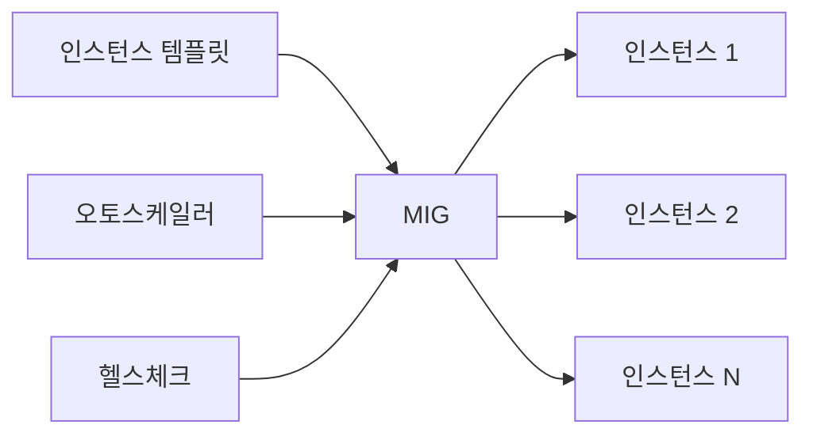
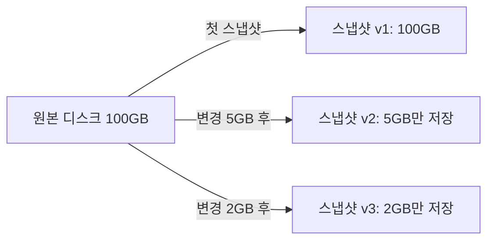
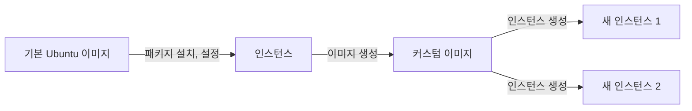
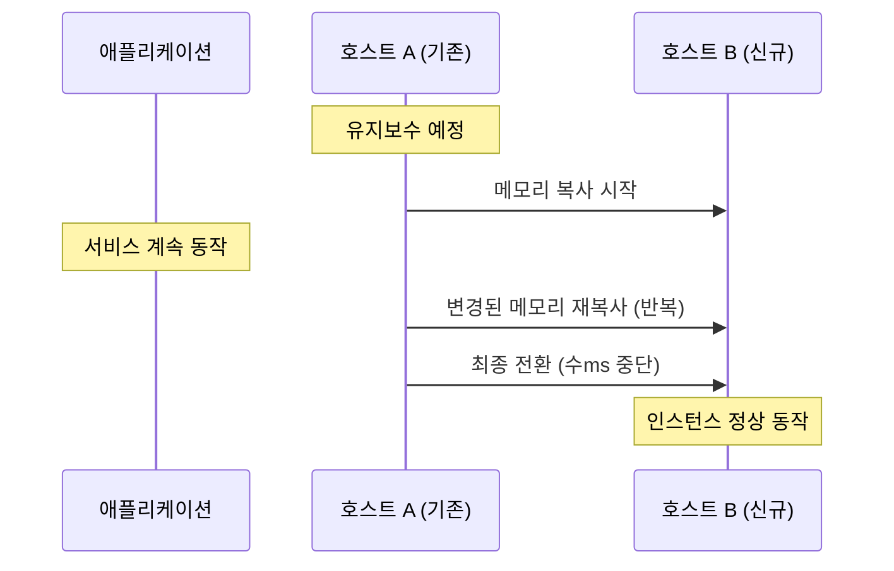
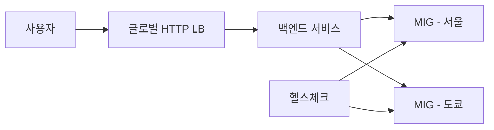

# GCE (Google Compute Engine)

GCE는 GCP에서 제공하는 가상 머신 서비스다. AWS의 EC2에 대응한다. 인스턴스를 직접 생성하고 관리해야 하는 IaaS 서비스이므로 네트워크, 디스크, 방화벽까지 신경 써야 한다.

---

## 인스턴스 생성

### gcloud CLI로 생성

콘솔에서 클릭으로 만들 수도 있지만, 반복 작업이 많으면 CLI가 낫다.

```bash
gcloud compute instances create my-instance \
  --zone=asia-northeast3-a \
  --machine-type=e2-medium \
  --image-family=ubuntu-2204-lts \
  --image-project=ubuntu-os-cloud \
  --boot-disk-size=50GB \
  --boot-disk-type=pd-balanced \
  --tags=http-server,https-server
```

`--zone`은 반드시 지정한다. 생략하면 기본 zone을 쓰는데, 프로젝트 설정에 따라 예상과 다른 리전에 생성될 수 있다. 한국 서비스라면 `asia-northeast3` (서울) 리전을 사용한다.

`--tags`는 방화벽 규칙과 연결된다. `http-server` 태그를 달아도 방화벽 규칙이 없으면 80포트가 열리지 않는다. 콘솔에서 "HTTP 트래픽 허용" 체크박스를 누르면 자동으로 방화벽 규칙까지 만들어주지만, CLI로 할 때는 직접 만들어야 한다.

```bash
gcloud compute firewall-rules create allow-http \
  --direction=INGRESS \
  --action=ALLOW \
  --rules=tcp:80 \
  --target-tags=http-server
```

### 자주 빠뜨리는 설정

**서비스 계정 범위(Scope)**

인스턴스 생성 시 `--scopes` 를 지정하지 않으면 기본 서비스 계정에 제한된 scope가 붙는다. 나중에 인스턴스 안에서 GCS 버킷에 접근하려고 하면 403이 뜬다. 인스턴스를 멈추고 scope를 변경한 뒤 다시 시작해야 한다.

```bash
# 생성 시 필요한 scope를 미리 지정
gcloud compute instances create my-instance \
  --scopes=cloud-platform \
  ...
```

`cloud-platform` scope는 모든 GCP API에 접근 가능하다. 보안상 꺼려지면 필요한 scope만 나열한다. 하지만 실제 권한은 서비스 계정의 IAM 역할로 제어하기 때문에, scope는 넉넉하게 주고 IAM에서 세밀하게 잡는 방식이 관리하기 편하다.

**외부 IP**

`--no-address` 옵션을 주면 외부 IP 없이 생성된다. NAT 게이트웨이를 설정하지 않은 상태에서 이렇게 만들면 인스턴스에서 인터넷 접속이 안 된다. `apt update`도 안 되고 패키지 설치도 안 된다. 개발 환경에서는 외부 IP를 붙이는 게 편하다.

---

## 머신 타입 선택

### 시리즈별 특징

| 시리즈 | 용도 | 비용 |
|--------|------|------|
| E2 | 범용, 개발/테스트 환경 | 가장 저렴 |
| N2/N2D | 범용, 프로덕션 워크로드 | E2보다 10~20% 비쌈 |
| C2/C2D | CPU 집약적 작업 (빌드 서버, 인코딩) | 높음 |
| C3/C3D | 차세대 CPU 집약적 (4세대 Intel/AMD) | C2와 유사, 성능 대비 비용 개선 |
| M2/M3 | 메모리 집약적 (대용량 DB, SAP) | 매우 높음 |
| A2/A3 | GPU 워크로드 (ML 학습, 렌더링) | GPU 종류에 따라 다름 |
| T2D | Arm 기반, 비용 효율 | N2 대비 20~30% 저렴 |

### 실무에서 선택하는 기준

**개발/스테이징 환경**: `e2-medium` (vCPU 2, 메모리 4GB)이면 대부분 충분하다. Spring Boot 애플리케이션 하나 돌리기에 적당하다. 메모리가 부족하면 `e2-standard-2` (vCPU 2, 메모리 8GB)로 올린다.

**프로덕션 환경**: `n2-standard-4` (vCPU 4, 메모리 16GB) 정도에서 시작한다. N2 시리즈는 E2보다 단일 스레드 성능이 높다. 트래픽에 따라 수평 확장을 고려한다면 인스턴스 하나를 크게 잡는 것보다 작은 인스턴스 여러 개가 낫다.

**커스텀 머신 타입**: vCPU와 메모리를 원하는 조합으로 지정할 수 있다. 메모리는 많이 필요한데 CPU는 적게 필요한 경우에 쓴다. 표준 타입보다 단가가 약간 높다.

```bash
# 커스텀 머신 타입: vCPU 4, 메모리 24GB
gcloud compute instances create my-instance \
  --custom-cpu=4 \
  --custom-memory=24GB \
  --zone=asia-northeast3-a
```

### 잘못된 선택을 하면

머신 타입은 인스턴스를 중지한 뒤 변경할 수 있다. 운영 중인 서비스라면 다운타임이 발생한다. 처음에 적절한 타입을 고르는 게 중요한데, GCP 콘솔의 "머신 타입 추천" 기능은 최소 며칠 간의 모니터링 데이터가 쌓여야 작동한다. 신규 프로젝트에서는 도움이 안 된다.

---

## 선점형 VM (Spot VM)

### 개념

선점형 VM은 GCP의 남는 자원을 저렴하게 빌려 쓰는 인스턴스다. 일반 인스턴스 대비 60~91% 저렴하지만, GCP가 자원을 회수해야 할 때 24시간 이내에 종료될 수 있다. 기존에는 "Preemptible VM"이라고 불렀고, 현재는 "Spot VM"으로 이름이 바뀌었다. 기능은 거의 같지만 Spot VM은 24시간 제한이 없다(대신 여전히 언제든 종료될 수 있다).

```bash
gcloud compute instances create batch-worker \
  --provisioning-model=SPOT \
  --instance-termination-action=STOP \
  --zone=asia-northeast3-a \
  --machine-type=e2-standard-4
```

`--instance-termination-action`은 `STOP`과 `DELETE` 중 선택한다. 디스크를 보존해야 하면 `STOP`으로 설정한다.

### 쓸 만한 경우

- CI/CD 빌드 러너: 빌드가 중단되면 다시 돌리면 된다
- 배치 처리: 작업을 청크로 나눠서 중간 결과를 저장하는 구조라면 적합하다
- 데이터 전처리: 대량의 로그 파싱이나 ETL 작업

### 쓰면 안 되는 경우

- 사용자 요청을 직접 처리하는 웹 서버
- 상태를 로컬에 보관하는 서비스 (세션을 로컬 메모리에 저장하는 경우 등)
- SLA가 필요한 서비스

### 종료 알림 처리

Spot VM은 종료 30초 전에 메타데이터 서버를 통해 알림을 보낸다. 이 알림을 받아서 graceful shutdown을 할 수 있다.

```python
import requests
import time

METADATA_URL = "http://metadata.google.internal/computeMetadata/v1/instance/preempted"
HEADERS = {"Metadata-Flavor": "Google"}

def check_preemption():
    while True:
        resp = requests.get(METADATA_URL, headers=HEADERS)
        if resp.text == "TRUE":
            print("선점 알림 수신, 정리 작업 시작")
            # 진행 중인 작업 저장, 커넥션 정리 등
            break
        time.sleep(5)
```

실무에서는 이 코드를 직접 짜기보다 인스턴스 그룹 + 자동 복구 정책을 함께 구성하는 경우가 많다.

---

## 인스턴스 템플릿과 MIG

### 인스턴스 템플릿

인스턴스를 하나씩 만들면 설정이 제각각이 된다. 인스턴스 템플릿에 머신 타입, 디스크, 네트워크, startup-script 등을 정의해두고, 이 템플릿으로 인스턴스를 찍어내는 방식이 운영에서 기본이다.

```bash
gcloud compute instance-templates create web-template \
  --machine-type=n2-standard-2 \
  --image-family=ubuntu-2204-lts \
  --image-project=ubuntu-os-cloud \
  --boot-disk-size=50GB \
  --boot-disk-type=pd-balanced \
  --tags=http-server \
  --metadata-from-file=startup-script=startup.sh \
  --scopes=cloud-platform \
  --region=asia-northeast3
```

템플릿은 수정이 안 된다. 변경이 필요하면 새 템플릿을 만들고 MIG에 연결해야 한다. 템플릿 이름에 날짜나 버전을 넣는 게 관리하기 편하다.

```bash
# 버전 관리가 되는 네이밍
gcloud compute instance-templates create web-template-20260411 \
  --machine-type=n2-standard-4 \
  ...
```

### 관리형 인스턴스 그룹 (MIG)

MIG는 동일한 템플릿으로 만든 인스턴스들의 묶음이다. 인스턴스가 죽으면 자동으로 다시 만들어주고, 오토스케일링도 MIG 단위로 동작한다.



```bash
# MIG 생성
gcloud compute instance-groups managed create web-mig \
  --template=web-template \
  --size=2 \
  --zone=asia-northeast3-a

# 자동 복구 설정 (헬스체크 기반)
gcloud compute health-checks create http web-health-check \
  --port=8080 \
  --request-path=/health \
  --check-interval=10s \
  --timeout=5s \
  --unhealthy-threshold=3

gcloud compute instance-groups managed set-autohealing web-mig \
  --health-check=web-health-check \
  --initial-delay=120 \
  --zone=asia-northeast3-a
```

`--initial-delay`는 인스턴스가 부팅되고 애플리케이션이 준비되기까지 기다리는 시간이다. 이 값을 너무 짧게 잡으면 아직 startup-script가 끝나지 않은 인스턴스를 unhealthy로 판단해서 무한 재생성 루프에 빠진다. Spring Boot 같은 무거운 앱은 180~300초 정도로 넉넉하게 잡는다.

### 오토스케일링

```bash
gcloud compute instance-groups managed set-autoscaling web-mig \
  --zone=asia-northeast3-a \
  --min-num-replicas=2 \
  --max-num-replicas=10 \
  --target-cpu-utilization=0.6 \
  --cool-down-period=120
```

CPU 사용률 기반 스케일링이 가장 간단하다. `--target-cpu-utilization=0.6`은 평균 CPU가 60%를 넘으면 인스턴스를 추가한다는 뜻이다.

CPU 외에 사용할 수 있는 스케일링 기준:

| 기준 | 사용 시점 |
|------|----------|
| CPU 사용률 | 범용 웹 서버, API 서버 |
| HTTP 로드밸런싱 사용률 | 로드밸런서와 연동된 서비스 |
| Cloud Monitoring 커스텀 메트릭 | 큐 길이, 대기 요청 수 등 비즈니스 메트릭 기반 |
| 스케줄 기반 | 트래픽 패턴이 예측 가능한 경우 (예: 출퇴근 시간) |

커스텀 메트릭 기반 스케일링 예시:

```bash
gcloud compute instance-groups managed set-autoscaling web-mig \
  --zone=asia-northeast3-a \
  --min-num-replicas=2 \
  --max-num-replicas=20 \
  --update-stackdriver-metric=custom.googleapis.com/queue/depth \
  --stackdriver-metric-single-instance-assignment=10
```

이 설정은 큐 깊이가 인스턴스당 10개를 넘으면 스케일 아웃한다. 메시지 큐 워커 같은 서비스에 적합하다.

**스케일 인 제어**: 오토스케일링은 스케일 아웃보다 스케일 인이 문제다. 트래픽이 잠깐 줄었다고 인스턴스를 바로 제거하면, 다시 트래픽이 올라왔을 때 대응이 늦다. `--scale-in-control`로 한 번에 줄일 수 있는 인스턴스 수를 제한할 수 있다.

```bash
gcloud compute instance-groups managed set-autoscaling web-mig \
  --zone=asia-northeast3-a \
  --min-num-replicas=2 \
  --max-num-replicas=10 \
  --target-cpu-utilization=0.6 \
  --scale-in-control max-scaled-in-replicas=2,time-window=300
```

300초(5분) 동안 최대 2개까지만 줄인다는 뜻이다.

### 롤링 업데이트

템플릿을 바꾸면 기존 인스턴스에는 반영되지 않는다. 새 템플릿을 적용하려면 롤링 업데이트를 실행한다.

```bash
gcloud compute instance-groups managed rolling-action start-update web-mig \
  --version=template=web-template-20260411 \
  --zone=asia-northeast3-a \
  --max-surge=1 \
  --max-unavailable=0
```

`--max-surge=1 --max-unavailable=0`은 하나씩 새 인스턴스를 추가하고, 정상 확인 후 기존 인스턴스를 제거하는 방식이다. 다운타임 없이 배포할 수 있다. 인스턴스가 많으면 시간이 오래 걸리므로 `--max-surge=3`처럼 늘려서 속도를 높이기도 한다.

카나리 배포도 가능하다:

```bash
gcloud compute instance-groups managed rolling-action start-update web-mig \
  --version=template=web-template-stable \
  --canary-version=template=web-template-canary,target-size=20% \
  --zone=asia-northeast3-a
```

전체 인스턴스의 20%만 새 템플릿으로 돌리고 나머지는 기존 템플릿을 유지한다. 문제가 없으면 비율을 100%로 올린다.

---

## 스냅샷과 커스텀 이미지

### 스냅샷

디스크의 특정 시점 상태를 저장한다. 증분(incremental) 방식이라서 첫 스냅샷만 전체 복사이고, 이후에는 변경된 블록만 저장한다.



```bash
# 스냅샷 생성
gcloud compute disks snapshot my-disk \
  --snapshot-names=my-disk-snap-20260411 \
  --zone=asia-northeast3-a

# 스냅샷에서 디스크 생성
gcloud compute disks create restored-disk \
  --source-snapshot=my-disk-snap-20260411 \
  --zone=asia-northeast3-a
```

**스냅샷 스케줄 정책**: 수동으로 스냅샷을 찍으면 빠뜨리게 된다. 스케줄 정책을 만들어서 디스크에 붙이면 자동으로 찍힌다.

```bash
# 매일 자정에 스냅샷, 7일 보관
gcloud compute resource-policies create snapshot-schedule daily-backup \
  --max-retention-days=7 \
  --on-source-disk-delete=keep-auto-snapshots \
  --daily-schedule \
  --start-time=00:00 \
  --region=asia-northeast3

# 디스크에 정책 연결
gcloud compute disks add-resource-policies my-disk \
  --resource-policies=daily-backup \
  --zone=asia-northeast3-a
```

### 커스텀 이미지

스냅샷과 다르게, 커스텀 이미지는 새 인스턴스를 만들 때 사용하는 부팅 이미지다. startup-script로 매번 패키지를 설치하면 인스턴스 부팅이 느려진다. 필요한 패키지, 설정, 애플리케이션을 미리 설치한 이미지를 만들어두면 부팅 시간을 크게 줄일 수 있다.



```bash
# 인스턴스를 먼저 중지
gcloud compute instances stop my-instance --zone=asia-northeast3-a

# 인스턴스의 디스크에서 이미지 생성
gcloud compute images create my-app-image-v1 \
  --source-disk=my-instance \
  --source-disk-zone=asia-northeast3-a \
  --family=my-app \
  --storage-location=asia-northeast3

# 이미지로 인스턴스 생성
gcloud compute instances create new-instance \
  --image=my-app-image-v1 \
  --zone=asia-northeast3-a
```

`--family`를 지정하면 같은 family에서 가장 최신 이미지를 자동으로 사용할 수 있다. 인스턴스 템플릿에서 `--image-family=my-app`으로 지정하면 이미지를 업데이트할 때 템플릿을 다시 만들 필요가 없다.

**이미지 관리 주의사항**:

- 이미지는 글로벌 리소스라서 리전에 관계없이 사용할 수 있다. 하지만 `--storage-location`으로 저장 위치를 지정하면 해당 리전에서 인스턴스를 만들 때 더 빠르다.
- 오래된 이미지를 정리하지 않으면 스토리지 비용이 늘어난다. `deprecated` 상태로 변경하거나 삭제한다.
- 인스턴스를 중지하지 않고 이미지를 만들 수도 있지만(`--force` 플래그), 파일시스템 일관성이 보장되지 않는다. 운영 DB가 올라간 디스크라면 반드시 중지하고 찍는다.

---

## 디스크 선택

### 디스크 타입별 특성

| 타입 | IOPS (읽기) | 처리량 | 가격 (GB/월) |
|------|------------|--------|-------------|
| pd-standard (HDD) | 낮음 | 낮음 | $0.04 |
| pd-balanced (SSD) | 중간 | 중간 | $0.10 |
| pd-ssd | 높음 | 높음 | $0.17 |
| pd-extreme | 매우 높음 | 매우 높음 | $0.125 + IOPS 비용 |
| hyperdisk-extreme | 최고 | 최고 | IOPS/처리량 별도 과금 |

**pd-balanced**가 대부분의 워크로드에 적합하다. pd-standard는 로그 저장이나 백업 용도로만 쓴다. 데이터베이스를 GCE 위에 직접 올릴 거면 pd-ssd를 쓴다. Hyperdisk는 IOPS와 처리량을 독립적으로 프로비저닝할 수 있어서, 고성능 DB 워크로드에서 pd-extreme 대신 쓸 수 있다.

### 디스크 크기와 성능의 관계

GCE 디스크는 크기에 비례해서 IOPS와 처리량이 올라간다. pd-balanced 10GB 디스크와 500GB 디스크의 IOPS 차이가 크다. 디스크가 작으면 성능이 낮다. "용량은 충분한데 느리다"는 상황이 생기면 디스크 크기를 늘려보는 게 해결책이 되기도 한다.

```bash
# 디스크 크기 확장 (인스턴스 중지 없이 가능)
gcloud compute disks resize my-disk --size=200GB --zone=asia-northeast3-a

# OS 안에서 파티션 확장 (리눅스)
sudo growpart /dev/sda 1
sudo resize2fs /dev/sda1
```

디스크 확장은 가능하지만 축소는 안 된다. 처음부터 필요 이상으로 크게 잡으면 비용이 낭비된다.

### Local SSD

네트워크로 연결되는 Persistent Disk와 달리 물리 서버에 직접 붙어 있는 NVMe SSD다. IOPS가 매우 높지만(디스크당 약 170,000 IOPS), 인스턴스가 중지되거나 삭제되면 데이터가 사라진다.

```bash
gcloud compute instances create cache-server \
  --machine-type=n2-standard-4 \
  --local-ssd=interface=NVME \
  --local-ssd=interface=NVME \
  --zone=asia-northeast3-a
```

Redis나 임시 캐시 서버에 적합하다. 데이터가 날아가도 복구할 수 있는 구조에서만 쓴다.

---

## 라이브 마이그레이션

### 동작 방식

GCE는 호스트 서버의 유지보수(하드웨어 교체, 보안 패치 등)가 필요할 때 인스턴스를 다른 호스트로 옮긴다. 이게 라이브 마이그레이션이다. AWS EC2는 유지보수 이벤트가 발생하면 인스턴스 재부팅이 필요한 경우가 있지만, GCE는 대부분 라이브 마이그레이션으로 처리한다.



마이그레이션 중에 수 밀리초 정도의 네트워크 지연이 발생할 수 있다. 대부분의 애플리케이션은 이 정도는 인지하지 못한다. 하지만 고성능 트레이딩 시스템이나 실시간 게임 서버처럼 지연에 민감한 서비스라면 문제가 될 수 있다.

### 유지보수 정책 설정

```bash
# 라이브 마이그레이션 (기본값)
gcloud compute instances create my-instance \
  --maintenance-policy=MIGRATE \
  ...

# 유지보수 시 종료
gcloud compute instances create latency-sensitive \
  --maintenance-policy=TERMINATE \
  --restart-on-failure \
  ...
```

`TERMINATE`로 설정하면 유지보수 시 인스턴스가 종료되고 다시 시작된다. GPU가 붙은 인스턴스는 라이브 마이그레이션이 지원되지 않으므로 `TERMINATE`가 기본이다.

유지보수 이벤트는 메타데이터 서버로 미리 알림이 온다. 모니터링 에이전트를 설치하면 Cloud Monitoring에서도 확인할 수 있다.

```bash
# 메타데이터로 유지보수 이벤트 확인
curl -H "Metadata-Flavor: Google" \
  http://metadata.google.internal/computeMetadata/v1/instance/maintenance-event
```

정상 상태에서는 `NONE`이 반환되고, 유지보수가 예정되면 `MIGRATE_ON_HOST_MAINTENANCE`가 반환된다.

---

## GPU/TPU 연결

### GPU 인스턴스

ML 모델 학습이나 렌더링 작업에 GPU가 필요하면 GCE 인스턴스에 GPU를 붙일 수 있다.

| GPU 타입 | 메모리 | 용도 |
|----------|--------|------|
| NVIDIA T4 | 16GB | 추론, 가벼운 학습 |
| NVIDIA L4 | 24GB | 추론, 미디어 처리 |
| NVIDIA A100 (40/80GB) | 40/80GB | 대규모 학습 |
| NVIDIA H100 | 80GB | 대규모 LLM 학습 |

```bash
gcloud compute instances create gpu-instance \
  --machine-type=n1-standard-8 \
  --accelerator=type=nvidia-tesla-t4,count=1 \
  --maintenance-policy=TERMINATE \
  --restart-on-failure \
  --image-family=common-cu123 \
  --image-project=deeplearning-platform-release \
  --zone=asia-northeast3-a \
  --boot-disk-size=200GB
```

GPU 인스턴스 생성 시 주의할 점:

- **머신 타입 제약**: GPU는 N1, A2, A3, G2 시리즈에서만 사용 가능하다. E2나 N2에는 붙일 수 없다.
- **이미지 선택**: 일반 Ubuntu 이미지에는 NVIDIA 드라이버가 없다. Deep Learning VM 이미지(`deeplearning-platform-release` 프로젝트)를 쓰면 드라이버와 CUDA가 미리 설치되어 있다.
- **할당량(Quota)**: GPU는 리전별 할당량이 있다. 기본값이 0인 경우도 있어서 할당량 증가 요청을 먼저 해야 한다. 요청 후 승인까지 하루 이상 걸릴 수 있다.
- **비용**: T4 1개 기준 시간당 약 $0.35. 사용하지 않을 때는 인스턴스를 반드시 중지한다.

### TPU

TPU(Tensor Processing Unit)는 구글이 자체 설계한 ML 전용 가속기다. TensorFlow와 JAX에서 가장 잘 동작한다. PyTorch도 지원하지만 추가 설정이 필요하다.

```bash
# TPU VM 생성
gcloud compute tpus tpu-vm create my-tpu \
  --zone=us-central1-a \
  --accelerator-type=v4-8 \
  --version=tpu-ubuntu2204-base
```

TPU는 서울 리전에서 사용할 수 없다. `us-central1`, `europe-west4` 등 제한된 리전에서만 제공된다. 레이턴시보다 처리량이 중요한 학습 작업에 적합하다.

---

## 로드밸런서 연동

### MIG + HTTP(S) 로드밸런서

GCE 인스턴스를 직접 외부에 노출하는 것보다 로드밸런서 뒤에 두는 게 운영에서 기본이다. GCP의 HTTP(S) 로드밸런서는 글로벌로 동작한다.



전체 설정 순서:

```bash
# 1. 헬스체크 생성
gcloud compute health-checks create http web-hc \
  --port=8080 \
  --request-path=/health

# 2. 백엔드 서비스 생성
gcloud compute backend-services create web-backend \
  --protocol=HTTP \
  --port-name=http \
  --health-checks=web-hc \
  --global

# 3. MIG를 백엔드에 추가
gcloud compute backend-services add-backend web-backend \
  --instance-group=web-mig \
  --instance-group-zone=asia-northeast3-a \
  --global

# 4. URL 맵 생성
gcloud compute url-maps create web-map \
  --default-service=web-backend

# 5. 타겟 프록시 생성 (HTTPS의 경우 SSL 인증서 필요)
gcloud compute target-http-proxies create web-proxy \
  --url-map=web-map

# 6. 포워딩 규칙 생성 (외부 IP 할당)
gcloud compute forwarding-rules create web-forwarding \
  --global \
  --target-http-proxy=web-proxy \
  --ports=80
```

설정할 리소스가 많다. 콘솔에서 "부하 분산" 메뉴로 만들면 위 과정을 마법사 형태로 안내해주지만, 재현 가능하려면 CLI나 Terraform으로 관리하는 게 맞다.

### Named Port 설정

MIG를 백엔드 서비스에 추가하려면 MIG에 named port를 설정해야 한다. 이걸 빠뜨리면 "The resource 'xxx' is not found" 에러가 난다.

```bash
gcloud compute instance-groups set-named-ports web-mig \
  --named-ports=http:8080 \
  --zone=asia-northeast3-a
```

애플리케이션이 8080 포트에서 동작하면 `http:8080`으로 매핑한다. 로드밸런서는 이 named port로 트래픽을 보낸다.

### SSL 인증서 자동 관리

HTTPS 로드밸런서를 쓰면 Google-managed SSL 인증서를 사용할 수 있다. 인증서 발급, 갱신이 자동이다.

```bash
gcloud compute ssl-certificates create my-cert \
  --domains=api.example.com \
  --global

gcloud compute target-https-proxies create web-https-proxy \
  --url-map=web-map \
  --ssl-certificates=my-cert
```

인증서 프로비저닝에 10~30분 걸린다. DNS가 로드밸런서 IP를 가리키고 있어야 인증서 발급이 완료된다. DNS 설정을 나중에 하면 인증서 발급이 계속 실패 상태로 남는다.

---

## 모니터링과 로깅

### Ops Agent 설치

GCE 인스턴스의 CPU, 메모리, 디스크 사용률은 기본적으로 Cloud Monitoring에서 확인할 수 있다. 하지만 프로세스 수준의 메트릭이나 애플리케이션 로그를 수집하려면 Ops Agent를 설치해야 한다.

```bash
# Ops Agent 설치 (인스턴스 안에서 실행)
curl -sSO https://dl.google.com/cloudagents/add-google-cloud-ops-agent-repo.sh
sudo bash add-google-cloud-ops-agent-repo.sh --also-install
```

인스턴스 템플릿의 startup-script에 이 설치 명령을 넣어두면 새 인스턴스에 자동으로 설치된다. 단, 커스텀 이미지에 미리 설치해두는 게 부팅 시간 측면에서 낫다.

### 커스텀 메트릭과 로그 수집

Ops Agent의 설정 파일(`/etc/google-cloud-ops-agent/config.yaml`)을 수정하면 특정 로그 파일을 Cloud Logging으로 수집하거나, 커스텀 메트릭을 수집할 수 있다.

```yaml
# /etc/google-cloud-ops-agent/config.yaml
logging:
  receivers:
    app_log:
      type: files
      include_paths:
        - /var/log/myapp/*.log
  service:
    pipelines:
      app_pipeline:
        receivers: [app_log]
metrics:
  receivers:
    jvm:
      type: jvm
      endpoint: localhost:9999
  service:
    pipelines:
      jvm_pipeline:
        receivers: [jvm]
```

JVM 메트릭(힙 사용량, GC 시간, 스레드 수)을 Cloud Monitoring으로 보내면 대시보드와 알림 정책을 구성할 수 있다.

### 알림 정책 예시

Cloud Monitoring에서 알림 정책을 만들어두면 인스턴스 이상을 빠르게 감지할 수 있다. gcloud보다 콘솔에서 만드는 게 편하지만, Terraform으로도 관리할 수 있다.

자주 사용하는 알림 조건:

| 조건 | 임계값 (참고용) | 주의사항 |
|------|----------------|---------|
| CPU 사용률 | 80% 이상 5분 지속 | 오토스케일링이 있으면 불필요할 수 있다 |
| 메모리 사용률 | 90% 이상 | Ops Agent 필요 |
| 디스크 사용률 | 85% 이상 | 로그 로테이션 미설정 시 자주 발생 |
| Uptime Check 실패 | 2회 연속 | 외부에서 접근 가능해야 한다 |

### 시리얼 포트 로그

인스턴스에 SSH 접속이 안 되는 상황에서 디버깅할 때 시리얼 포트 로그가 유일한 수단이 되기도 한다. 커널 패닉, 디스크 마운트 실패, startup-script 에러 등이 여기에 남는다.

```bash
gcloud compute instances get-serial-port-output my-instance \
  --zone=asia-northeast3-a
```

---

## 비용 관련 주의사항

### 중지된 인스턴스도 돈이 나간다

인스턴스를 중지(STOP)하면 CPU/메모리 요금은 안 나오지만, 디스크 요금은 계속 나간다. 100GB pd-balanced 디스크를 한 달 붙여두면 약 $10이다. 테스트용 인스턴스를 중지만 해놓고 방치하면 디스크 비용이 쌓인다. 안 쓰는 인스턴스는 삭제한다. 디스크만 남기고 싶으면 스냅샷을 찍고 디스크를 삭제하는 게 저렴하다.

### 외부 고정 IP 요금

외부 IP를 예약(static IP)해놓고 인스턴스에 연결하지 않으면 시간당 $0.01이 부과된다. 한 달이면 약 $7.2다. 인스턴스를 삭제할 때 고정 IP도 함께 해제해야 한다. 콘솔에서 인스턴스를 삭제해도 고정 IP는 남아있다.

```bash
# 사용하지 않는 고정 IP 확인
gcloud compute addresses list --filter="status=RESERVED"

# 삭제
gcloud compute addresses delete unused-ip --region=asia-northeast3
```

### 지속 사용 할인과 약정 할인

**지속 사용 할인 (Sustained Use Discount)**: 한 달 중 25% 이상 사용하면 자동 적용된다. 별도 설정 없이 알아서 할인된다. N1, N2 시리즈에 적용되고, E2 시리즈는 적용되지 않는다. 개발 서버처럼 업무 시간에만 켜는 인스턴스는 혜택이 적다.

**약정 사용 할인 (Committed Use Discount)**: 1년 또는 3년 약정을 걸면 최대 57% 할인된다. 약정은 특정 인스턴스가 아니라 리전 단위로 vCPU/메모리 수량에 대해 건다. 프로덕션 환경처럼 항시 운영하는 인스턴스가 있다면 1년 약정은 거의 필수다.

### 네트워크 이그레스 비용

GCP에서 외부로 나가는 트래픽에 비용이 붙는다. 같은 리전 내 통신은 무료지만, 리전 간 통신이나 인터넷으로 나가는 트래픽은 GB당 $0.08~$0.12다. 로그를 외부 모니터링 서비스로 전송하거나, 큰 파일을 사용자에게 직접 서빙하면 비용이 빠르게 늘어난다. CDN(Cloud CDN)을 앞에 두면 이그레스 비용이 줄어든다.

---

## 실무에서 자주 하는 실수

### SSH 접속이 안 되는 경우

1. **방화벽 규칙 누락**: IAP(Identity-Aware Proxy)를 통한 SSH가 기본인데, IAP 관련 방화벽 규칙(`35.235.240.0/20`에서 오는 TCP 22)이 없으면 접속이 안 된다
2. **OS Login 설정 충돌**: 프로젝트에 OS Login이 활성화되어 있으면 메타데이터 기반 SSH 키가 무시된다. OS Login을 쓸 건지 메타데이터 SSH 키를 쓸 건지 통일해야 한다
3. **VPC 네트워크 설정**: default VPC를 삭제하고 커스텀 VPC를 만들었는데 라우팅이나 방화벽을 제대로 안 잡은 경우

### 메타데이터 startup-script 디버깅

startup-script가 실패해도 인스턴스는 정상적으로 Running 상태가 된다. 스크립트가 제대로 실행됐는지 확인하려면 시리얼 포트 로그를 봐야 한다.

startup-script에서 `apt install`을 하는 경우, 패키지 미러가 응답하지 않으면 타임아웃 때문에 10분 넘게 걸릴 수 있다. 이미지를 미리 구워놓는(custom image) 방식이 안정적이다.

### 인스턴스 그룹 무한 재생성 루프

MIG에 헬스체크를 연결했는데 `initial-delay`가 너무 짧으면 발생한다. 인스턴스가 부팅 중인데 헬스체크가 실패로 판단하고, 인스턴스를 삭제하고 새로 만들고, 또 부팅 중에 실패로 판단하고... 를 반복한다. Cloud Console에서 인스턴스가 계속 생겼다 사라지는 게 보이면 `initial-delay`를 먼저 확인한다.

### GPU 할당량 미확인

GPU 인스턴스를 만들려고 하면 "Quota 'GPUS_ALL_REGIONS' exceeded" 에러가 나는 경우가 많다. 기본 GPU 할당량이 0인 프로젝트가 있다. IAM > 할당량 페이지에서 GPU 할당량을 확인하고, 부족하면 증가 요청을 한다. 승인에 하루 이상 걸릴 수 있으므로 프로젝트 초기에 미리 요청해둔다.
