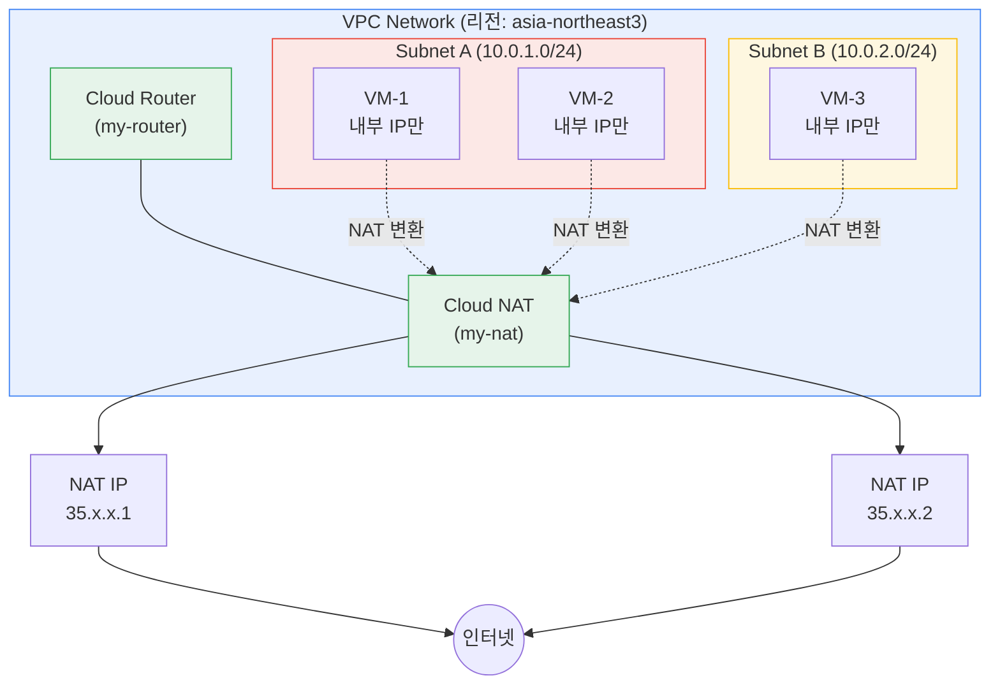
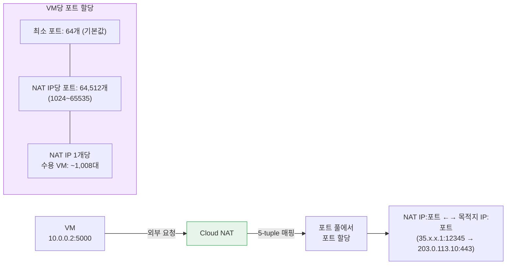
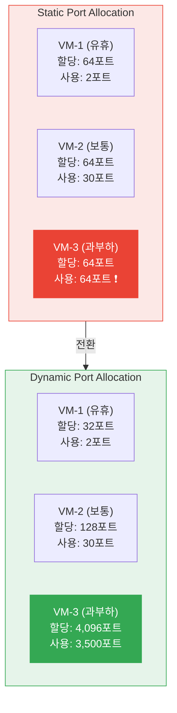
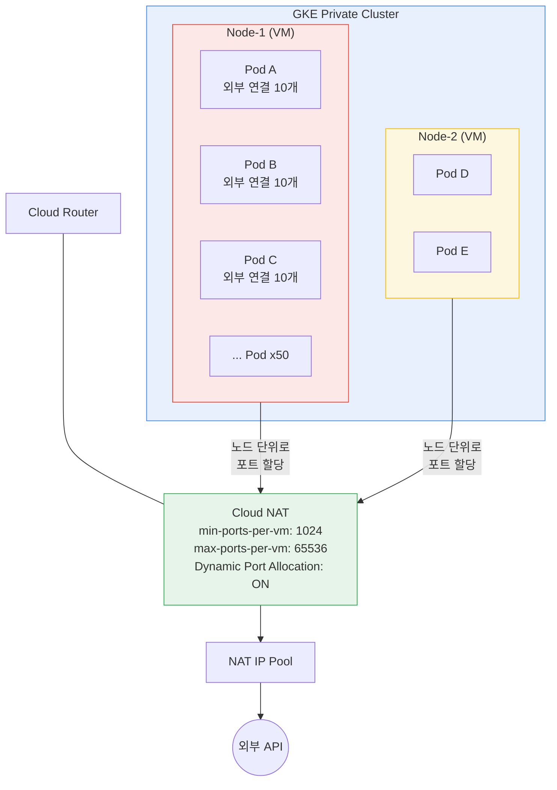
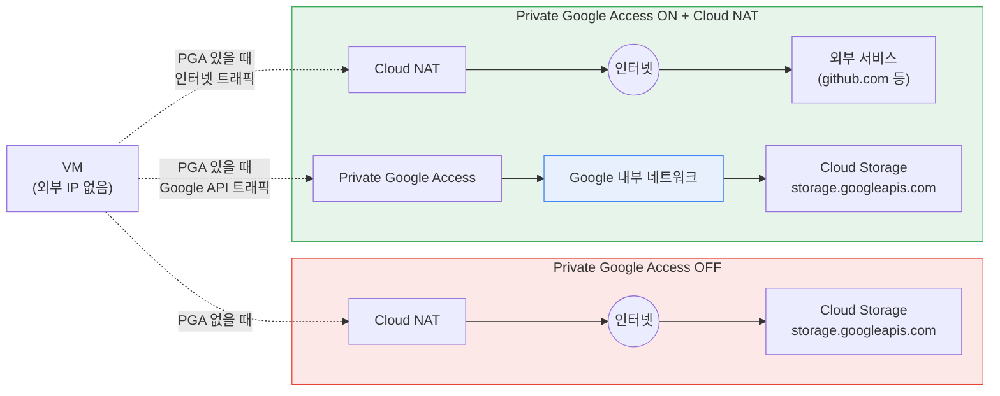

# Cloud NAT

## Cloud NAT란

외부 IP가 없는 VM이 인터넷에 나가야 할 때 쓰는 GCP 관리형 NAT 서비스다. Cloud Router 위에 소프트웨어로 구현되어 있어서, 별도 VM 인스턴스를 띄울 필요가 없다.

AWS NAT Gateway와 비교하면 구조적 차이가 크다.

| 항목 | GCP Cloud NAT | AWS NAT Gateway |
|------|--------------|-----------------|
| 인스턴스 필요 여부 | 불필요. Cloud Router에 설정 | 리전/AZ마다 NAT Gateway 인스턴스 생성 |
| AZ 단위 생성 | 불필요. 리전 단위로 하나만 설정 | AZ마다 각각 생성해야 고가용성 확보 |
| 대역폭 제한 | 자동 스케일링, 별도 제한 없음 | 인스턴스당 45Gbps |
| 비용 구조 | 처리 데이터량 기준 | 인스턴스 시간 + 데이터 처리량 |
| 관리 포인트 | Cloud Router 설정만 | NAT Gateway + 라우팅 테이블 수정 |

AWS에서는 3개 AZ를 쓰면 NAT Gateway 3개를 만들고, 각 프라이빗 서브넷 라우팅 테이블에 연결해야 한다. GCP는 리전 단위로 Cloud NAT 하나만 설정하면 해당 리전 모든 서브넷에 적용된다.


## 기본 구성

Cloud NAT는 Cloud Router에 종속된다. Cloud Router 없이 단독으로 존재할 수 없다.



Cloud Router가 리전 단위로 존재하고, Cloud NAT 설정이 그 위에 올라간다. 서브넷에 있는 VM들은 외부로 나갈 때 Cloud NAT를 거쳐 NAT IP로 변환된다.

```
Cloud Router (리전 단위)
└── Cloud NAT 설정
    ├── NAT IP (자동 할당 또는 수동 지정)
    ├── 적용 대상 서브넷 (전체 또는 지정)
    └── 포트 할당 설정
```

```bash
# Cloud Router 생성
gcloud compute routers create my-router \
    --network=my-vpc \
    --region=asia-northeast3

# Cloud NAT 생성 (기본 설정)
gcloud compute routers nats create my-nat \
    --router=my-router \
    --region=asia-northeast3 \
    --nat-all-subnet-ip-ranges \
    --auto-allocate-nat-external-ips
```

`--nat-all-subnet-ip-ranges`는 해당 리전의 모든 서브넷에 NAT를 적용한다. 특정 서브넷만 적용하려면 `--nat-custom-subnet-ip-ranges`를 쓴다.

```bash
# 특정 서브넷에만 Cloud NAT 적용
gcloud compute routers nats create my-nat \
    --router=my-router \
    --region=asia-northeast3 \
    --nat-custom-subnet-ip-ranges=subnet-a,subnet-b \
    --auto-allocate-nat-external-ips
```


## NAT IP 할당 방식

### 자동 할당

`--auto-allocate-nat-external-ips` 옵션을 사용하면 GCP가 NAT IP를 자동으로 할당하고 관리한다. 트래픽이 늘어나면 IP가 자동 추가되고, 줄어들면 회수된다.

간편하지만 문제가 있다. NAT IP가 언제든 바뀔 수 있어서, 외부 서비스에서 IP 화이트리스트를 요구하는 경우 사용이 어렵다. 결제 API, 파트너사 연동처럼 고정 IP가 필요한 상황에서는 수동 할당을 써야 한다.

### 수동 할당

미리 예약한 외부 고정 IP를 NAT IP로 지정한다.

```bash
# 고정 IP 예약
gcloud compute addresses create nat-ip-1 \
    --region=asia-northeast3

gcloud compute addresses create nat-ip-2 \
    --region=asia-northeast3

# 예약된 IP로 Cloud NAT 생성
gcloud compute routers nats create my-nat \
    --router=my-router \
    --region=asia-northeast3 \
    --nat-all-subnet-ip-ranges \
    --nat-external-ip-pool=nat-ip-1,nat-ip-2
```

수동 할당 시 주의할 점: NAT IP 수가 부족하면 포트가 고갈된다. 자동 할당은 GCP가 알아서 IP를 추가하지만, 수동 할당은 직접 IP를 추가해야 한다. 모니터링 없이 수동 할당을 쓰면 트래픽 증가 시 갑자기 외부 통신이 끊기는 경우가 있다.


## 포트 할당과 포트 고갈

Cloud NAT의 핵심 개념이고, 운영 중 가장 자주 문제가 되는 부분이다.

### 포트 할당 로직

Cloud NAT는 각 VM에 NAT 포트를 할당한다. 하나의 NAT 포트는 `(NAT IP, 프로토콜, 포트 번호, 목적지 IP, 목적지 포트)` 5-tuple로 식별되는 하나의 연결에 매핑된다.



기본 설정에서 VM당 최소 64개 포트가 할당된다. 하나의 NAT IP에 사용 가능한 포트 범위가 1024~65535이므로, NAT IP 하나당 약 64,512개 포트를 사용할 수 있다.

```
NAT IP 1개 기준:
- 사용 가능 포트: 64,512개 (1024~65535)
- VM당 최소 포트: 64개 (기본값)
- 수용 가능 VM 수: 약 1,008대 (64,512 / 64)
```

### 포트 고갈이 발생하는 경우

VM에서 동시에 많은 외부 연결을 맺으면 할당된 포트가 부족해진다. 다음 상황에서 자주 발생한다:

- 외부 API를 대량으로 호출하는 배치 작업
- 크롤러나 스크레이퍼가 동시에 수백 개 연결을 맺는 경우
- GKE 노드에서 Pod 수가 많고, 각 Pod가 외부 연결을 사용하는 경우

포트가 고갈되면 `compute.googleapis.com/nat/dropped_sent_packets_count` 메트릭이 증가한다. 로그에는 `OUT_OF_RESOURCES` 이유로 패킷 드롭이 기록된다.

### 포트 고갈 대응

```bash
# VM당 최소 포트 수 늘리기
gcloud compute routers nats update my-nat \
    --router=my-router \
    --region=asia-northeast3 \
    --min-ports-per-vm=256

# NAT IP 추가 (수동 할당인 경우)
gcloud compute addresses create nat-ip-3 \
    --region=asia-northeast3

gcloud compute routers nats update my-nat \
    --router=my-router \
    --region=asia-northeast3 \
    --nat-external-ip-pool=nat-ip-1,nat-ip-2,nat-ip-3
```

`--min-ports-per-vm` 값을 늘리면 VM당 사용 가능한 포트가 늘어나지만, NAT IP당 수용 가능한 VM 수가 줄어든다. 256으로 설정하면 NAT IP 하나당 약 252대까지만 수용 가능하다. 무작정 늘리면 안 된다.


## Dynamic Port Allocation

GCP에서 포트 고갈 문제를 해결하기 위해 도입한 기능이다. 기본 포트 할당은 정적(static)이라서, 트래픽이 적은 VM도 고정된 수의 포트를 점유한다. Dynamic Port Allocation을 켜면 VM의 실제 사용량에 따라 포트가 동적으로 할당된다.



Static에서는 모든 VM이 동일한 포트를 점유한다. VM-3처럼 트래픽이 많으면 포트가 고갈되고, VM-1처럼 유휴 상태여도 포트를 놓지 않는다. Dynamic으로 전환하면 실제 사용량에 맞게 재분배된다.

```bash
# Dynamic Port Allocation 활성화
gcloud compute routers nats update my-nat \
    --router=my-router \
    --region=asia-northeast3 \
    --enable-dynamic-port-allocation \
    --min-ports-per-vm=32 \
    --max-ports-per-vm=65536
```

`--min-ports-per-vm`은 VM에 항상 보장되는 최소 포트 수다. `--max-ports-per-vm`은 트래픽이 몰릴 때 최대로 할당 가능한 포트 수다. 동적 할당이라 유휴 VM은 최소값만 가지고 있고, 트래픽이 많은 VM에 포트가 몰린다.

동적 할당 활성화 시 주의사항:

- Endpoint-Independent Mapping이 비활성화된다. 동적 할당과 EIM은 동시에 사용할 수 없다.
- 포트 할당/회수에 약간의 지연이 있다. 순간적인 버스트 트래픽에는 할당이 뒤따라가지 못해서 일시적으로 패킷 드롭이 발생할 수 있다.
- `--min-ports-per-vm`을 너무 낮게 설정하면 포트 할당 대기 시간이 길어진다. 32 이하로 내리는 것은 권장하지 않는다.


## Endpoint-Independent Mapping (EIM)

기본적으로 Cloud NAT는 Endpoint-Independent Mapping이 활성화되어 있다. 이 설정은 NAT 매핑 방식을 결정한다.

**EIM 활성화 시**: 동일한 내부 IP:포트에서 나가는 트래픽은 목적지가 달라도 같은 NAT IP:포트로 매핑된다.

```
VM 내부 IP 10.0.0.2:5000 → 외부 서버 A   →  NAT IP 35.x.x.x:12345
VM 내부 IP 10.0.0.2:5000 → 외부 서버 B   →  NAT IP 35.x.x.x:12345 (동일)
```

**EIM 비활성화 시**: 목적지마다 다른 NAT 포트가 할당된다.

```
VM 내부 IP 10.0.0.2:5000 → 외부 서버 A   →  NAT IP 35.x.x.x:12345
VM 내부 IP 10.0.0.2:5000 → 외부 서버 B   →  NAT IP 35.x.x.x:54321 (다름)
```

EIM이 필요한 경우는 P2P 통신이나 일부 VoIP 프로토콜처럼 외부에서 NAT 매핑을 예측해야 하는 경우다. 대부분의 서버-클라이언트 통신에서는 EIM이 없어도 동작한다.

```bash
# EIM 비활성화
gcloud compute routers nats update my-nat \
    --router=my-router \
    --region=asia-northeast3 \
    --no-enable-endpoint-independent-mapping
```

EIM을 비활성화하면 같은 내부 포트를 여러 목적지에 재사용할 수 있어서, 포트 사용 효율이 높아진다. 포트 고갈이 문제라면 EIM 비활성화를 먼저 검토하는 것이 맞다. 단, Dynamic Port Allocation을 쓰려면 EIM을 반드시 비활성화해야 한다.


## Cloud NAT 로그

Cloud NAT는 연결 생성/삭제와 에러 이벤트를 로깅한다. 포트 고갈이나 연결 문제를 진단할 때 필수다.

### 로그 활성화

```bash
# 모든 이벤트 로깅
gcloud compute routers nats update my-nat \
    --router=my-router \
    --region=asia-northeast3 \
    --enable-logging \
    --log-filter=ALL

# 에러만 로깅 (비용 절감)
gcloud compute routers nats update my-nat \
    --router=my-router \
    --region=asia-northeast3 \
    --enable-logging \
    --log-filter=ERRORS_ONLY
```

`--log-filter`는 세 가지 옵션이 있다:
- `ALL`: 모든 NAT 이벤트 (연결 생성, 삭제, 에러)
- `ERRORS_ONLY`: 포트 고갈, 연결 실패 등 에러만
- `TRANSLATIONS_ONLY`: 정상적인 NAT 변환 이벤트만

프로덕션에서는 평소에 `ERRORS_ONLY`로 두고, 문제 발생 시 `ALL`로 변경해서 디버깅하는 방식이 비용 면에서 낫다. ALL로 계속 두면 로그 양이 상당하다.

### 로그 분석

Cloud Logging에서 NAT 로그를 필터링하는 쿼리:

```
# 포트 고갈로 인한 패킷 드롭 확인
resource.type="nat_gateway"
jsonPayload.allocation_status="DROPPED"

# 특정 VM의 NAT 이벤트 확인
resource.type="nat_gateway"
jsonPayload.instance.vm_name="my-vm"

# 특정 목적지로의 연결 이벤트 확인
resource.type="nat_gateway"
jsonPayload.destination.address="203.0.113.10"
```

로그에서 주로 확인하는 필드:

| 필드 | 설명 |
|------|------|
| `allocation_status` | DROPPED이면 포트 고갈 |
| `connection.src_ip` | NAT 변환 전 내부 IP |
| `connection.nat_ip` | NAT 변환 후 외부 IP |
| `connection.nat_port` | NAT 변환 후 포트 |
| `endpoint.vm_name` | 해당 VM 이름 |


## 모니터링

Cloud NAT 운영 시 반드시 감시해야 하는 메트릭이 있다.

```bash
# Cloud Monitoring에서 확인할 주요 메트릭
# 1. NAT 할당 실패 (포트 고갈 징후)
compute.googleapis.com/nat/dropped_sent_packets_count

# 2. 현재 NAT 연결 수
compute.googleapis.com/nat/open_connections

# 3. 할당된 포트 사용률
compute.googleapis.com/nat/port_usage

# 4. NAT IP당 사용 포트 수
compute.googleapis.com/nat/allocated_ports
```

포트 사용률이 80%를 넘어가면 조치가 필요하다. 자동 할당이면 GCP가 IP를 추가하지만, 수동 할당이면 직접 IP를 추가해야 한다. 알럿 정책을 만들어두는 것이 맞다.

```bash
# 포트 고갈 알럿 확인용 - 최근 드롭된 패킷 확인
gcloud logging read \
    'resource.type="nat_gateway" AND jsonPayload.allocation_status="DROPPED"' \
    --limit=10 \
    --format="table(timestamp, jsonPayload.endpoint.vm_name, jsonPayload.destination.address)"
```


## 실무에서 겪는 문제들

### GKE와 Cloud NAT 포트 고갈

GKE 노드는 여러 Pod를 실행하고, 각 Pod가 독립적으로 외부 연결을 맺는다. 노드 하나에 Pod가 50개 있고, 각 Pod가 외부 API에 동시 연결 10개씩 맺으면, 노드 하나가 500개 포트를 쓴다. 기본 설정(VM당 64포트)이면 바로 고갈된다.



Cloud NAT는 Pod 단위가 아니라 노드(VM) 단위로 포트를 할당한다. 노드 위에 Pod가 많을수록 노드당 필요한 포트 수가 급격히 늘어난다.

GKE 환경에서는:

```bash
# GKE 노드용 Cloud NAT - 포트를 넉넉하게 설정
gcloud compute routers nats update my-nat \
    --router=my-router \
    --region=asia-northeast3 \
    --enable-dynamic-port-allocation \
    --min-ports-per-vm=1024 \
    --max-ports-per-vm=65536
```

`--min-ports-per-vm=1024` 정도는 잡아줘야 GKE 노드에서 포트 고갈이 발생하지 않는다. Pod 수와 외부 연결 패턴에 따라 더 높여야 할 수 있다.

### NAT IP 변경 시 외부 연동 장애

자동 할당을 쓰고 있다가 NAT IP가 바뀌면, 외부에서 IP 화이트리스트로 관리하는 서비스와의 연결이 끊긴다. 결제 연동, 파트너사 API 같은 곳에서 발생한다.

이 경우 수동 할당으로 전환하면 되는데, 전환 과정에서 일시적으로 NAT IP가 바뀌므로 트래픽이 없는 시간에 작업해야 한다.

```bash
# 현재 사용 중인 NAT IP 확인
gcloud compute routers nats describe my-nat \
    --router=my-router \
    --region=asia-northeast3 \
    --format="get(natIps)"
```

### Cloud NAT와 Private Google Access

외부 IP 없는 VM에서 Google API(Cloud Storage, BigQuery 등)에 접근할 때, Private Google Access가 꺼져 있으면 Cloud NAT를 통해 인터넷으로 나갔다가 Google API에 도달한다. 동작은 하지만 불필요한 NAT 트래픽과 비용이 발생한다.

Cloud NAT를 설정했으면 Private Google Access도 같이 켜야 한다. 서로 역할이 다르다:

- **Private Google Access**: Google API 접근 전용. Google 내부 네트워크를 통해 라우팅.
- **Cloud NAT**: 인터넷 접근용. 외부 IP를 통해 인터넷으로 나감.



PGA가 꺼져 있으면 Google API 호출도 Cloud NAT → 인터넷 → Google API 경로로 우회한다. PGA를 켜면 Google API 트래픽은 내부 네트워크로 직접 라우팅되고, Cloud NAT는 인터넷 트래픽만 처리한다. NAT 포트 사용량과 비용 둘 다 줄어든다.

두 가지를 같이 설정하면 Google API 트래픽은 내부 네트워크로, 그 외 트래픽은 Cloud NAT를 통해 외부로 나간다.


## Cloud NAT 적용 범위 정리

Cloud NAT가 적용되는 리소스와 적용되지 않는 리소스를 구분해야 한다.

| 리소스 | Cloud NAT 적용 |
|--------|---------------|
| 외부 IP 없는 VM | 적용 |
| GKE 노드 (Private 클러스터) | 적용 |
| Cloud Run, Cloud Functions | 적용 안 됨 (별도 VPC Connector 필요) |
| App Engine Flex | 적용 |
| App Engine Standard | 적용 안 됨 |

Cloud Run이나 Cloud Functions에서 고정 IP로 외부 통신이 필요하면, Serverless VPC Access Connector를 설정하고 해당 VPC에 Cloud NAT를 연결해야 한다. 단계가 하나 더 추가된다.
