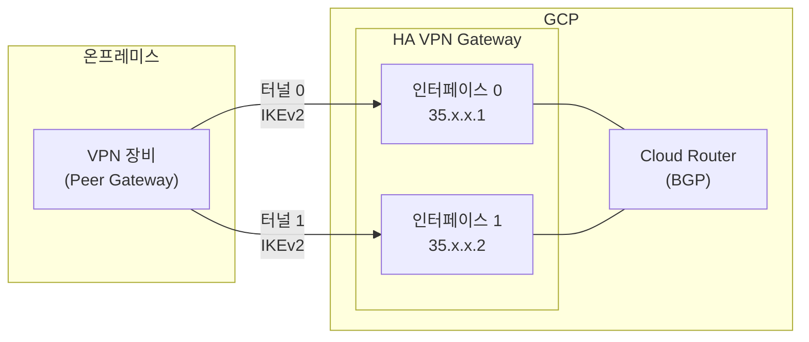
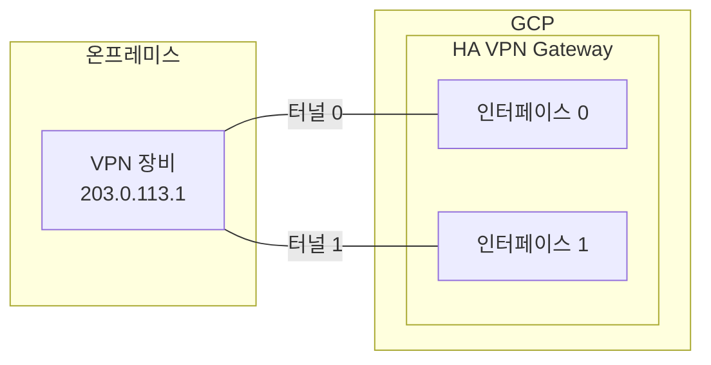
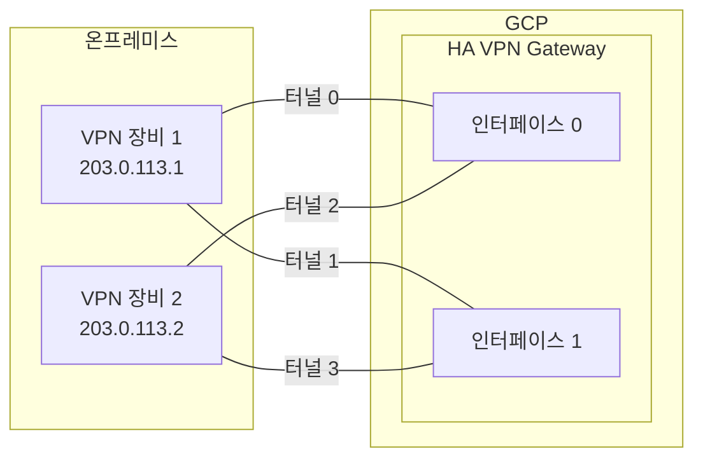

# Cloud VPN

## Cloud VPN이란

온프레미스 네트워크와 GCP VPC를 IPsec VPN 터널로 연결하는 서비스다. 공용 인터넷을 통해 암호화된 터널을 만들어서, 양쪽 네트워크가 내부 IP로 통신할 수 있게 한다.

하이브리드 클라우드 구성에서 가장 먼저 검토하는 방식이다. Dedicated Interconnect는 물리 회선 설치에 몇 주가 걸리고 월 비용도 상당한데, Cloud VPN은 설정만 하면 바로 쓸 수 있다. 대역폭이 터널당 3Gbps로 제한되지만, 소규모 연동이나 Interconnect 구축 전 임시 연결로 자주 사용한다.

```
온프레미스 네트워크                          GCP VPC
192.168.0.0/16                            10.0.0.0/16

[서버들] --- [VPN 장비] ===IPsec 터널=== [Cloud VPN Gateway] --- [VM들]
                         (인터넷 경유, 암호화)
```


## Classic VPN vs HA VPN

GCP Cloud VPN에는 두 가지 유형이 있다.

### Classic VPN

초기 버전이다. VPN 게이트웨이에 외부 IP 하나가 할당되고, 터널을 수동으로 구성한다.

- SLA가 99.9%다.
- 정적 라우팅만 지원한다. Cloud Router 연동 없이 수동으로 원격 네트워크 대역을 지정해야 한다.
- 동적 라우팅(BGP)도 가능하긴 하지만, 이중화 구성이 안 된다.
- 2025년 기준 신규 생성을 권장하지 않는다. 기존에 쓰던 것도 HA VPN으로 마이그레이션하는 게 맞다.

### HA VPN

이중화가 기본 내장된 버전이다. 프로덕션에서는 반드시 HA VPN을 써야 한다.

- SLA가 99.99%다. Classic VPN의 99.9%와 비교하면 연간 다운타임 허용이 52분에서 5분으로 줄어든다.
- 게이트웨이에 인터페이스가 2개 있고, 각 인터페이스에 별도 외부 IP가 할당된다.
- Cloud Router와 BGP 연동이 필수다. 정적 라우팅은 지원하지 않는다.
- 99.99% SLA를 받으려면 터널 2개를 양쪽 인터페이스에 각각 연결해야 한다. 터널 1개만 설정하면 SLA가 99.9%로 내려간다.



| 항목 | Classic VPN | HA VPN |
|------|------------|--------|
| SLA | 99.9% | 99.99% (터널 2개 시) |
| 인터페이스 수 | 1개 | 2개 |
| 라우팅 | 정적/동적 | 동적(BGP) 전용 |
| Cloud Router | 선택 | 필수 |
| 이중화 | 수동 구성 | 기본 내장 |
| IPv6 지원 | 미지원 | 지원 |

HA VPN을 쓰면서 터널을 1개만 만드는 실수를 종종 본다. 터널이 1개면 해당 인터페이스에 장애가 생겼을 때 바로 끊긴다. 99.99% SLA도 적용되지 않는다.


## IKEv2 터널 설정

Cloud VPN은 IKEv1과 IKEv2를 모두 지원하지만, IKEv2를 써야 한다. IKEv1 대비 핸드셰이크가 빠르고, 터널 재협상 시 끊김이 적다.

### 기본 HA VPN 구성

```bash
# 1. Cloud Router 생성
gcloud compute routers create vpn-router \
    --network=my-vpc \
    --region=asia-northeast3 \
    --asn=65001

# 2. HA VPN 게이트웨이 생성
gcloud compute vpn-gateways create my-ha-vpn \
    --network=my-vpc \
    --region=asia-northeast3

# 3. 피어(온프레미스) VPN 게이트웨이 정보 등록
gcloud compute external-vpn-gateways create onprem-vpn \
    --interfaces=0=203.0.113.1,1=203.0.113.2

# 4. VPN 터널 생성 (인터페이스 0)
gcloud compute vpn-tunnels create tunnel-0 \
    --region=asia-northeast3 \
    --vpn-gateway=my-ha-vpn \
    --vpn-gateway-region=asia-northeast3 \
    --peer-external-gateway=onprem-vpn \
    --peer-external-gateway-interface=0 \
    --ike-version=2 \
    --shared-secret=my-shared-secret \
    --router=vpn-router \
    --vpn-gateway-interface=0

# 5. VPN 터널 생성 (인터페이스 1)
gcloud compute vpn-tunnels create tunnel-1 \
    --region=asia-northeast3 \
    --vpn-gateway=my-ha-vpn \
    --vpn-gateway-region=asia-northeast3 \
    --peer-external-gateway=onprem-vpn \
    --peer-external-gateway-interface=1 \
    --ike-version=2 \
    --shared-secret=my-shared-secret \
    --router=vpn-router \
    --vpn-gateway-interface=1
```

`--asn=65001`은 Cloud Router의 BGP ASN(Autonomous System Number)이다. 온프레미스 VPN 장비의 ASN과 달라야 한다. Private ASN 범위(64512~65534, 4200000000~4294967294)에서 선택한다.

`--shared-secret`은 양쪽 VPN에서 동일한 값을 설정해야 한다. 대소문자, 특수문자를 포함한 긴 문자열을 쓰고, 터널마다 다른 secret을 사용하는 것이 맞다.

### IKE 암호화 파라미터

Cloud VPN은 다양한 암호화 조합을 지원한다. 온프레미스 VPN 장비와 동일한 설정을 맞춰야 터널이 올라간다.

| 단계 | 항목 | 권장 설정 |
|------|------|----------|
| IKE Phase 1 | 암호화 | AES-256-CBC 또는 AES-256-GCM |
| IKE Phase 1 | 무결성 | SHA-256 이상 |
| IKE Phase 1 | DH 그룹 | 14 (2048-bit) 이상 |
| IKE Phase 2 | 암호화 | AES-256-GCM |
| IKE Phase 2 | PFS | 활성화 (DH 그룹 14 이상) |

터널이 안 올라가는 원인의 80%는 양쪽 IKE 파라미터 불일치다. Phase 1, Phase 2 각각 암호화 알고리즘, 무결성 알고리즘, DH 그룹이 일치해야 한다. 온프레미스 장비 담당자와 사전에 파라미터를 맞춰야 한다.


## Cloud Router와 BGP 연동

HA VPN은 Cloud Router를 통한 BGP 연동이 필수다. BGP로 양쪽 네트워크의 라우트를 자동으로 교환한다.

### BGP 세션 설정

```bash
# 터널 0에 BGP 세션 추가
gcloud compute routers add-interface vpn-router \
    --interface-name=bgp-if-0 \
    --vpn-tunnel=tunnel-0 \
    --ip-address=169.254.0.1 \
    --mask-length=30 \
    --region=asia-northeast3

gcloud compute routers add-bgp-peer vpn-router \
    --peer-name=onprem-peer-0 \
    --interface=bgp-if-0 \
    --peer-ip-address=169.254.0.2 \
    --peer-asn=65002 \
    --region=asia-northeast3

# 터널 1에 BGP 세션 추가
gcloud compute routers add-interface vpn-router \
    --interface-name=bgp-if-1 \
    --vpn-tunnel=tunnel-1 \
    --ip-address=169.254.1.1 \
    --mask-length=30 \
    --region=asia-northeast3

gcloud compute routers add-bgp-peer vpn-router \
    --peer-name=onprem-peer-1 \
    --interface=bgp-if-1 \
    --peer-ip-address=169.254.1.2 \
    --peer-asn=65002 \
    --region=asia-northeast3
```

`169.254.x.x/30` 대역은 BGP 링크 로컬 주소로 사용한다. 터널마다 서로 다른 /30 대역을 할당해야 한다. 이 주소는 터널 내부에서만 쓰이므로 기존 네트워크 대역과 충돌하지 않는다.

`--peer-asn=65002`는 온프레미스 VPN 장비의 ASN이다. Cloud Router의 ASN(65001)과 달라야 한다.

### BGP 세션 확인

```bash
# Cloud Router BGP 상태 확인
gcloud compute routers get-status vpn-router \
    --region=asia-northeast3

# 출력 예시에서 확인할 것:
# - bgpPeerStatus: state가 "ESTABLISHED"인지
# - advertisedRoutes: GCP에서 온프레미스로 광고하는 라우트
# - bestRoutes: 온프레미스에서 받은 라우트
```

BGP 세션이 ESTABLISHED 상태가 아니면 트래픽이 흐르지 않는다. `ACTIVE`나 `CONNECT` 상태에서 멈춰 있으면 온프레미스 쪽 BGP 설정을 확인해야 한다.

### 라우트 광고 제어

기본적으로 Cloud Router는 VPC의 모든 서브넷 라우트를 온프레미스에 광고한다. 특정 서브넷만 광고하거나, 커스텀 라우트를 추가로 광고할 수 있다.

```bash
# 커스텀 라우트 광고 설정
gcloud compute routers update vpn-router \
    --region=asia-northeast3 \
    --advertisement-mode=CUSTOM \
    --set-advertisement-groups=ALL_SUBNETS \
    --set-advertisement-ranges=10.100.0.0/16
```

온프레미스에서 GCP로의 라우트는 온프레미스 VPN 장비에서 BGP로 광고한다. 양쪽 다 필요한 대역만 광고하는 것이 보안상 맞다.


## 이중화 구성

### 단일 온프레미스 VPN 장비

온프레미스 VPN 장비가 1대인 경우, HA VPN 게이트웨이의 인터페이스 2개에서 각각 터널을 연결한다. 이 구성에서 99.99% SLA를 받을 수 있다.



GCP 측 인터페이스 하나가 장애 나면 나머지 터널로 트래픽이 자동 전환된다. 다만 온프레미스 VPN 장비 자체가 죽으면 연결이 끊긴다. 온프레미스 측도 이중화하려면 VPN 장비를 2대로 구성해야 한다.

### 이중 온프레미스 VPN 장비

온프레미스 VPN 장비가 2대인 경우, 총 4개의 터널을 구성한다. 가장 안정적인 구성이다.



온프레미스 장비 하나가 죽어도, 나머지 장비를 통한 터널 2개가 살아 있으므로 통신이 유지된다. BGP가 자동으로 살아 있는 경로로 트래픽을 전환한다.


## 대역폭 제한

Cloud VPN 터널 하나의 최대 대역폭은 3Gbps다. 이 제한은 GCP 게이트웨이 측 한도이며, 온프레미스 VPN 장비의 성능이나 인터넷 회선 대역폭에 따라 실제 처리량은 더 낮을 수 있다.

대역폭이 부족하면 터널 수를 늘려서 해결한다. HA VPN 게이트웨이를 여러 개 만들고 ECMP(Equal-Cost Multi-Path) 라우팅으로 트래픽을 분산한다.

```
터널 1개: 최대 3Gbps
터널 2개 (기본 HA VPN): 최대 6Gbps (ECMP)
터널 4개 (이중 피어): 최대 12Gbps (ECMP)
HA VPN 게이트웨이 추가: 터널 수에 비례해서 증가
```

```bash
# 현재 터널의 대역폭 사용량 확인
gcloud compute vpn-tunnels describe tunnel-0 \
    --region=asia-northeast3 \
    --format="get(status, detailedStatus)"
```

3Gbps로 부족한 상황이라면 Cloud VPN 대신 Dedicated Interconnect(10Gbps 또는 100Gbps)나 Partner Interconnect를 검토해야 한다. VPN은 어디까지나 인터넷 위의 암호화 터널이라, 대규모 데이터 전송에는 한계가 있다.


## 장애 시 failover 동작

HA VPN에서 터널 하나가 죽었을 때의 동작이다.

### BGP 기반 failover

Cloud Router가 BGP keepalive 메시지(기본 20초 간격)를 보내고, hold timer(기본 60초) 안에 응답이 없으면 해당 BGP 세션을 다운으로 판단한다. 다운된 터널의 라우트가 라우팅 테이블에서 제거되고, 살아 있는 터널로 트래픽이 전환된다.

```
정상 상태:
  터널 0 (active) ← 트래픽 50%
  터널 1 (active) ← 트래픽 50%

터널 0 장애 발생:
  [0~60초] BGP hold timer 대기 — 이 동안 터널 0으로의 패킷 유실 가능
  [60초 후] BGP 세션 다운 판정, 라우트 제거
  터널 1 (active) ← 트래픽 100%

터널 0 복구 시:
  BGP 세션 재수립 → 라우트 재광고 → ECMP 복원
```

BGP hold timer 60초 동안 패킷 유실이 발생할 수 있다. BFD(Bidirectional Forwarding Detection)를 활성화하면 장애 감지 시간을 수 초 이내로 줄일 수 있다.

```bash
# BFD 활성화
gcloud compute routers add-bgp-peer vpn-router \
    --peer-name=onprem-peer-0 \
    --interface=bgp-if-0 \
    --peer-ip-address=169.254.0.2 \
    --peer-asn=65002 \
    --region=asia-northeast3 \
    --bfd-session-initialization-mode=ACTIVE \
    --bfd-min-transmit-interval=1000 \
    --bfd-min-receive-interval=1000 \
    --bfd-multiplier=5
```

`--bfd-min-transmit-interval=1000`은 BFD 패킷 전송 간격(밀리초)이다. `--bfd-multiplier=5`는 연속 실패 횟수인데, 이 설정이면 5초 안에 장애를 감지한다. 온프레미스 VPN 장비도 BFD를 지원해야 동작한다.

### VPN 터널 상태 모니터링

```bash
# 모든 VPN 터널 상태 확인
gcloud compute vpn-tunnels list \
    --region=asia-northeast3 \
    --format="table(name, status, detailedStatus, peerIp)"

# 터널 상태가 ESTABLISHED가 아닌 경우
# - PROVISIONING: 생성 중
# - WAITING_FOR_FULL_CONFIG: BGP 설정 미완료
# - FIRST_HANDSHAKE: IKE 협상 진행 중 (Phase 1 실패 가능성)
# - NO_INCOMING_PACKETS: 상대방에서 응답 없음
# - AUTHORIZATION_ERROR: 인증 실패 (shared secret 불일치)
```

`NO_INCOMING_PACKETS` 상태가 지속되면 온프레미스 VPN 장비의 설정을 확인해야 한다. GCP 측 설정이 맞아도 상대방이 응답하지 않으면 이 상태가 된다. 방화벽에서 UDP 500(IKE)과 UDP 4500(NAT-T)이 열려 있는지도 확인한다.


## AWS Site-to-Site VPN과 비교

AWS에서도 온프레미스 연결에 Site-to-Site VPN을 쓴다. 구조적 차이가 있다.

| 항목 | GCP HA VPN | AWS Site-to-Site VPN |
|------|-----------|---------------------|
| 게이트웨이 | HA VPN Gateway (리전 단위) | Virtual Private Gateway 또는 Transit Gateway |
| 터널 수 | 인터페이스 2개, 터널 직접 구성 | VPN 연결당 자동으로 터널 2개 생성 |
| 라우팅 | Cloud Router + BGP (필수) | 정적 라우팅 또는 BGP (선택) |
| 대역폭 | 터널당 3Gbps | 터널당 1.25Gbps |
| SLA | 99.99% (터널 2개 구성 시) | SLA 별도 명시 없음 (VGW 기준) |
| 이중화 설정 | 직접 터널 구성 | AWS가 터널 2개 자동 생성 |
| ECMP | 지원 (터널 추가로 대역폭 확장) | Transit Gateway에서 지원 |
| 비용 | 터널 시간 + 이그레스 | VPN 연결 시간 + 이그레스 |

AWS Site-to-Site VPN은 연결 하나를 만들면 터널 2개가 자동으로 생성된다. 설정이 간단한 대신 터널당 1.25Gbps 제한이 있어서, 대역폭을 늘리려면 VPN 연결을 여러 개 만들고 Transit Gateway로 ECMP를 구성해야 한다.

GCP HA VPN은 터널당 3Gbps로 AWS 대비 대역폭이 높다. 대신 터널과 BGP 세션을 직접 구성해야 해서 초기 설정이 더 손이 간다. AWS는 VPN 설정 파일을 다운로드해서 온프레미스 장비에 그대로 적용할 수 있는데, GCP는 이런 기능이 없어서 수동으로 맞춰야 한다.

AWS Transit Gateway를 쓰면 여러 VPC에 대한 VPN을 중앙에서 관리할 수 있다. GCP에서 비슷한 역할은 Network Connectivity Center가 한다.


## 실무 트러블슈팅

### 터널이 ESTABLISHED 상태가 안 되는 경우

가장 흔한 원인 순서:

1. **Shared secret 불일치**: 양쪽에서 동일한 값인지 확인한다. 복사 시 공백이 들어가는 경우가 있다.
2. **IKE 버전 불일치**: GCP에서 IKEv2로 설정했는데 온프레미스가 IKEv1만 지원하는 경우.
3. **IKE 암호화 파라미터 불일치**: Phase 1, Phase 2 알고리즘이 양쪽에서 일치하지 않는 경우.
4. **방화벽 차단**: 온프레미스 앞단 방화벽에서 UDP 500, UDP 4500, ESP(IP 프로토콜 50)를 차단하는 경우.
5. **NAT 뒤에 있는 VPN 장비**: 온프레미스 VPN 장비가 NAT 뒤에 있으면 NAT-T(NAT Traversal)가 동작해야 한다. UDP 4500이 열려 있어야 한다.

```bash
# GCP 측 터널 상세 상태 확인
gcloud compute vpn-tunnels describe tunnel-0 \
    --region=asia-northeast3 \
    --format="yaml(status, detailedStatus, ikeVersion, sharedSecretHash)"
```

### BGP 세션은 올라왔는데 통신이 안 되는 경우

BGP 세션이 ESTABLISHED인데도 실제 트래픽이 안 흐르는 경우가 있다.

- **라우트 광고 확인**: 온프레미스에서 GCP로 올바른 대역을 광고하고 있는지 확인한다. `gcloud compute routers get-status`에서 `bestRoutes`를 본다.
- **방화벽 규칙**: VPN 터널을 통해 들어오는 트래픽에 대한 GCP 방화벽 규칙이 있어야 한다. 온프레미스 대역(예: 192.168.0.0/16)에서 오는 트래픽을 허용하는 INGRESS 규칙을 추가한다.
- **비대칭 라우팅**: 터널이 여러 개일 때, 가는 경로와 오는 경로가 다르면 온프레미스 방화벽에서 stateful inspection에 걸려서 차단될 수 있다.

```bash
# VPN 트래픽 허용 방화벽 규칙
gcloud compute firewall-rules create allow-from-onprem \
    --network=my-vpc \
    --direction=INGRESS \
    --action=ALLOW \
    --rules=all \
    --source-ranges=192.168.0.0/16 \
    --priority=1000
```

### 간헐적 터널 끊김

터널이 주기적으로 끊겼다 붙었다 하는 경우:

- **IKE SA lifetime 불일치**: GCP Cloud VPN의 IKE Phase 1 SA lifetime은 36,600초(약 10시간), Phase 2는 10,800초(3시간)다. 온프레미스 장비의 lifetime이 다르면 rekey 타이밍이 맞지 않아서 일시적으로 터널이 끊길 수 있다.
- **DPD(Dead Peer Detection) 설정**: DPD 간격이 너무 짧으면 일시적인 네트워크 지연을 장애로 오판해서 터널을 내릴 수 있다.
- **MTU 문제**: Cloud VPN 터널의 MTU는 1,460바이트다. IPsec 오버헤드 때문에 표준 1,500에서 줄어든 값이다. 큰 패킷이 분할되면서 성능 저하나 패킷 유실이 발생할 수 있다. TCP MSS를 1,420으로 설정하면 된다.

```bash
# VPN 터널 관련 메트릭 확인
# - vpn.googleapis.com/tunnel_established: 터널 상태 (1: 정상, 0: 다운)
# - vpn.googleapis.com/sent_bytes_count: 송신 바이트
# - vpn.googleapis.com/received_bytes_count: 수신 바이트
# - vpn.googleapis.com/dropped_packets_count: 드롭된 패킷
```

### MTU 관련 실제 증상

MTU 문제는 증상이 애매해서 원인 파악이 어렵다.

- SSH는 되는데 SCP로 큰 파일 전송이 실패하거나 극도로 느림
- HTTP API 호출에서 작은 응답은 오는데, 큰 JSON 응답이 타임아웃
- ICMP ping은 되는데 실제 애플리케이션 트래픽이 안 됨

이런 증상이 VPN 터널을 통해서만 발생하면 MTU를 의심해야 한다. `ping -s 1400 -M do` (리눅스) 또는 `ping -f -l 1400` (윈도우)로 PMTUD 테스트를 해서 최대 전송 가능 크기를 확인한다.
