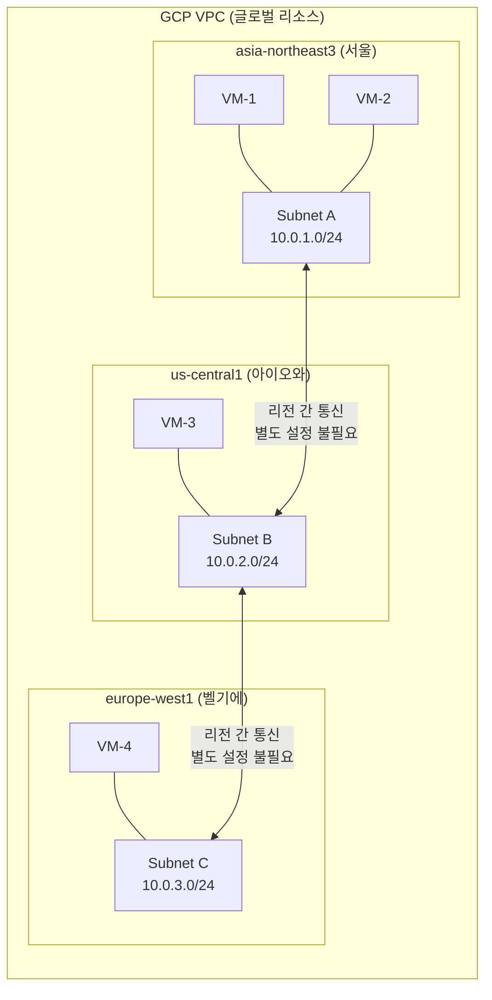
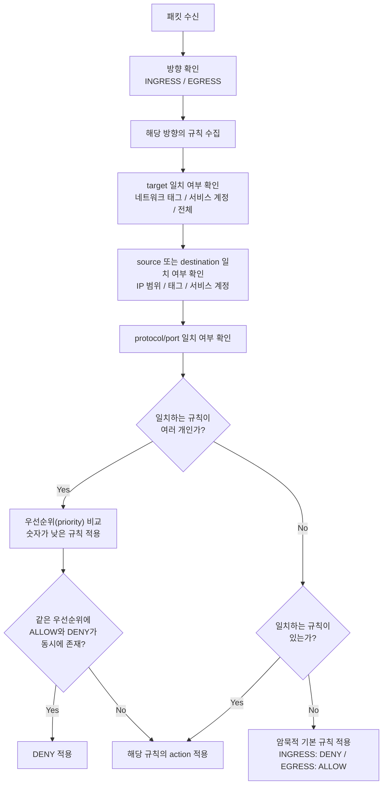
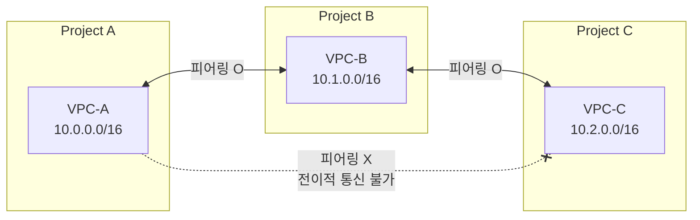
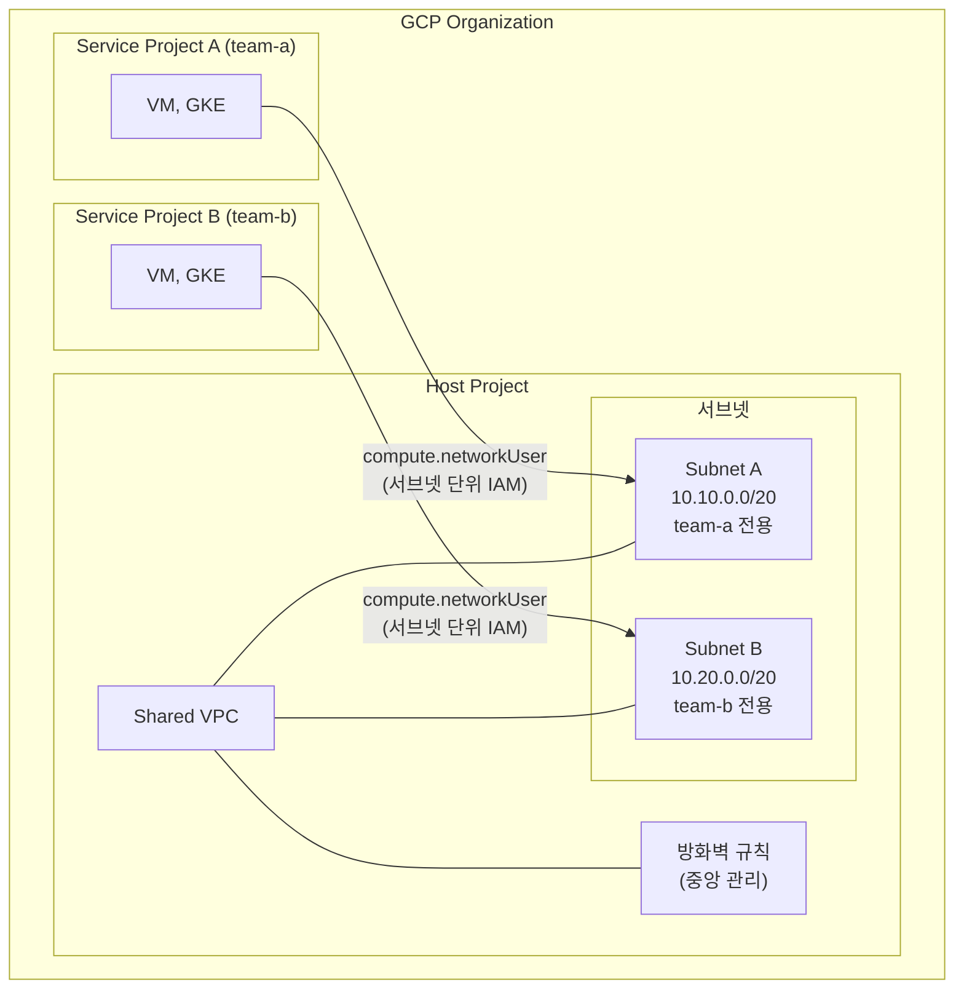
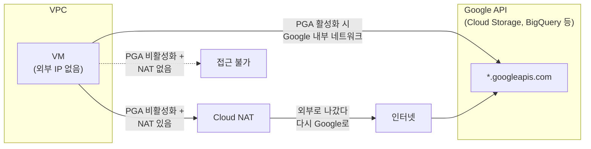

# GCP VPC

## VPC란

Virtual Private Cloud. GCP에서 제공하는 가상 네트워크다. VM, GKE, Cloud SQL 같은 리소스가 이 네트워크 안에서 통신한다.

GCP VPC의 가장 큰 특징은 **글로벌 리소스**라는 점이다. AWS VPC는 리전 단위로 생성하지만, GCP VPC는 하나의 VPC가 모든 리전에 걸쳐 존재한다. 서브넷만 리전 단위로 나뉜다.

```
GCP VPC (글로벌)
├── Subnet A (asia-northeast3)  - 10.0.1.0/24
├── Subnet B (us-central1)      - 10.0.2.0/24
└── Subnet C (europe-west1)     - 10.0.3.0/24
```

다음 다이어그램은 GCP VPC의 글로벌 구조를 나타낸다. 하나의 VPC가 여러 리전에 걸쳐 존재하고, 서브넷은 리전 단위로 나뉜다.



이 구조 때문에 리전 간 통신이 별도 피어링 없이 된다. AWS에서는 서울 리전 VPC와 버지니아 리전 VPC를 연결하려면 피어링이나 Transit Gateway가 필요하지만, GCP는 같은 VPC 안에 있으면 리전이 달라도 바로 통신 가능하다.


## 서브넷

GCP 서브넷은 리전 단위다. 하나의 서브넷은 하나의 리전에 속하고, 해당 리전의 모든 존(zone)에서 사용할 수 있다.

VPC 생성 시 서브넷 모드를 선택한다:

- **Auto mode**: VPC 생성 시 각 리전에 `/20` 서브넷이 자동 생성된다. 테스트용으로만 쓴다. 프로덕션에서 쓰면 IP 대역이 겹치는 문제가 생길 수 있다.
- **Custom mode**: 서브넷을 직접 정의한다. 프로덕션에서는 반드시 Custom mode를 써야 한다.

Auto mode로 시작해서 Custom mode로 전환할 수 있지만, 반대는 안 된다. 처음부터 Custom mode로 만드는 게 맞다.

### 서브넷 IP 범위 확장

GCP 서브넷은 생성 후에도 IP 범위를 확장할 수 있다. `/20`에서 `/16`으로 넓히는 것이 가능하다. 단, 축소는 안 된다.

Secondary IP range도 추가할 수 있는데, GKE Pod/Service IP 범위를 지정할 때 사용한다.

```bash
# 서브넷에 Secondary IP range 추가 (GKE용)
gcloud compute networks subnets update my-subnet \
    --region=asia-northeast3 \
    --add-secondary-ranges=pods=10.4.0.0/14,services=10.8.0.0/20
```


## 방화벽 규칙

GCP 방화벽은 VPC 수준에서 동작한다. AWS의 Security Group + NACL을 하나로 합친 것과 비슷하다.

### 규칙 구조

| 항목 | 설명 |
|------|------|
| direction | INGRESS 또는 EGRESS |
| priority | 0~65535. 숫자가 낮을수록 우선순위 높음 |
| action | ALLOW 또는 DENY |
| target | 규칙이 적용되는 대상. 네트워크 태그, 서비스 계정, 전체 인스턴스 |
| source/destination | IP 범위, 네트워크 태그, 서비스 계정 |
| protocol/port | tcp:80, udp:53 같은 형태 |

AWS Security Group과의 차이:

- AWS Security Group은 ALLOW만 가능하다. DENY는 NACL에서 해야 한다. GCP 방화벽은 ALLOW/DENY 둘 다 가능하다.
- AWS Security Group은 다른 Security Group을 소스로 지정할 수 있다. GCP는 네트워크 태그나 서비스 계정으로 비슷한 처리를 한다.
- GCP 방화벽은 우선순위 기반이라, 규칙 간 충돌 시 우선순위 숫자로 결정된다.

### 기본 규칙

VPC 생성 시 암묵적으로 존재하는 규칙이 두 개 있다:

- 모든 egress 허용 (priority 65535)
- 모든 ingress 거부 (priority 65535)

이 규칙은 삭제할 수 없다. 동일 우선순위 규칙을 추가해도 먼저 생성된 규칙이 적용되므로, 이 기본 규칙을 무효화하려면 더 낮은 숫자(높은 우선순위)의 규칙을 만들어야 한다.

방화벽 규칙이 여러 개 존재할 때, 트래픽에 어떤 규칙이 적용되는지 판단하는 흐름은 다음과 같다.



실무에서 자주 겪는 상황: priority 1000으로 ALLOW 규칙을 만들었는데 접근이 안 된다면, priority 900 같은 더 높은 우선순위로 DENY 규칙이 존재하는 경우다. `gcloud compute firewall-rules list --sort-by=PRIORITY`로 전체 규칙을 우선순위 순으로 확인해야 한다.

### 네트워크 태그 기반 방화벽

```bash
# 특정 태그가 붙은 VM에만 HTTP 허용
gcloud compute firewall-rules create allow-http \
    --network=my-vpc \
    --direction=INGRESS \
    --action=ALLOW \
    --rules=tcp:80,tcp:443 \
    --source-ranges=0.0.0.0/0 \
    --target-tags=web-server \
    --priority=1000
```

네트워크 태그는 VM 인스턴스에 붙이는 문자열이다. 태그를 기반으로 방화벽 규칙을 적용하면, 해당 태그가 붙은 VM에만 규칙이 적용된다.

다만 네트워크 태그는 프로젝트 내 모든 사용자가 VM에 임의로 붙일 수 있어서, 보안이 중요한 환경에서는 서비스 계정 기반 방화벽이 더 적합하다.


## 라우팅

GCP VPC는 암묵적 라우팅을 사용한다. 같은 VPC 내 서브넷 간 라우팅이 자동으로 설정되어 있다. 서브넷을 추가하면 라우팅 테이블에 자동 반영된다.

AWS와의 차이가 크다:

| 항목 | GCP | AWS |
|------|-----|-----|
| 서브넷 간 라우팅 | 자동 (암묵적) | 라우팅 테이블에 명시적 설정 필요 |
| 인터넷 게이트웨이 | 기본 라우트에 포함 | IGW 생성 후 라우팅 테이블에 연결 |
| NAT | Cloud NAT (관리형) | NAT Gateway 생성 후 라우팅 테이블 수정 |
| 라우팅 테이블 관리 | 거의 신경 쓸 필요 없음 | 서브넷마다 연결 관리 필요 |

GCP에서 커스텀 라우트가 필요한 경우는 VPN, Interconnect 연결이나 특정 트래픽을 프록시 VM으로 보내야 할 때 정도다.

```bash
# 커스텀 라우트 추가 (온프레미스 연결용)
gcloud compute routes create to-onprem \
    --network=my-vpc \
    --destination-range=192.168.0.0/16 \
    --next-hop-vpn-tunnel=my-vpn-tunnel \
    --priority=1000
```


## VPC 피어링

서로 다른 VPC 간 내부 IP로 통신이 필요할 때 사용한다. 인터넷을 거치지 않고 Google 내부 네트워크를 통해 통신한다.



제약 사항:

- 전이적(transitive) 피어링이 안 된다. A-B, B-C 피어링이 되어 있어도 A-C는 통신 불가다. A-C도 직접 피어링해야 한다.
- 양쪽 VPC에서 각각 피어링 설정이 필요하다 (양방향 설정).
- IP 대역이 겹치면 피어링이 안 된다.
- 피어링된 VPC의 방화벽 규칙은 각자 관리한다.

```bash
# VPC 피어링 설정 (양쪽 프로젝트에서 각각 실행)
# 프로젝트 A에서
gcloud compute networks peerings create peer-to-b \
    --network=vpc-a \
    --peer-project=project-b \
    --peer-network=vpc-b

# 프로젝트 B에서
gcloud compute networks peerings create peer-to-a \
    --network=vpc-b \
    --peer-project=project-a \
    --peer-network=vpc-a
```

VPC가 많아지면 피어링 수가 N*(N-1)/2로 늘어나서 관리가 어려워진다. 이 경우 Shared VPC나 VPC Network Connectivity Center를 고려해야 한다.


## Shared VPC

하나의 호스트 프로젝트(Host Project)에 VPC를 만들고, 여러 서비스 프로젝트(Service Project)가 이 VPC를 공유하는 구조다.



핵심은 네트워크 관리(Host Project)와 리소스 관리(Service Project)가 분리된다는 점이다. 네트워크 팀이 VPC, 서브넷, 방화벽을 관리하고, 각 서비스 팀은 자기 프로젝트에서 VM이나 GKE만 만들면 된다.

이 구조의 장점:

- 네트워크 관리를 중앙에서 한다. 각 팀은 자기 프로젝트에서 리소스만 만들면 된다.
- IP 대역 관리가 한 곳에서 된다. 팀별로 VPC를 만들면 IP 대역 충돌이 발생하기 쉬운데, Shared VPC는 이 문제를 원천 차단한다.
- 방화벽 규칙을 중앙에서 통제할 수 있다.

IAM 설정이 핵심이다:

- `compute.xpnAdmin`: Organization 또는 Folder 수준에서 Shared VPC 관리자 역할
- `compute.networkUser`: 서비스 프로젝트 사용자가 특정 서브넷을 사용할 수 있는 권한

서브넷 단위로 권한을 부여하는 것이 중요하다. 프로젝트 수준으로 주면 모든 서브넷에 접근 가능해져서 권한 분리가 무의미해진다.


## Private Google Access

VM에 외부 IP가 없으면 기본적으로 Google API(Cloud Storage, BigQuery 등)에 접근할 수 없다. Private Google Access를 서브넷에 활성화하면, 외부 IP 없이도 Google API에 접근 가능하다.

```bash
# 서브넷에 Private Google Access 활성화
gcloud compute networks subnets update my-subnet \
    --region=asia-northeast3 \
    --enable-private-google-access
```

Private Google Access가 활성화되면, 외부 IP가 없는 VM에서 Google API로의 트래픽이 Google 내부 네트워크를 통해 라우팅된다. 인터넷을 거치지 않는다.

다음 다이어그램은 Private Google Access 활성화 여부에 따른 트래픽 경로 차이를 보여준다.



Private Google Access가 꺼져 있으면 Cloud NAT를 경유해서 인터넷으로 나갔다가 다시 Google API에 도달한다. 동작은 하지만 NAT 비용이 불필요하게 발생한다. Cloud NAT도 없으면 아예 접근이 안 된다.

주의할 점: Private Google Access는 Google API에 대한 접근만 해결한다. 외부 인터넷 접근이 필요하면 여전히 Cloud NAT가 필요하다.

Private Service Connect를 쓰면 VPC 내부 IP를 통해 Google API에 접근할 수 있어서, 방화벽 규칙으로 Google API 접근을 더 세밀하게 제어할 수 있다.


## gcloud CLI 기반 VPC 구성 예제

프로덕션 환경에서 VPC를 처음부터 구성하는 과정이다.

### 1. VPC 생성

```bash
# Custom mode VPC 생성
gcloud compute networks create prod-vpc \
    --subnet-mode=custom \
    --bgp-routing-mode=regional
```

`--bgp-routing-mode`는 Cloud Router가 BGP 라우트를 공유하는 범위다. `regional`이면 같은 리전에서만, `global`이면 모든 리전에서 Cloud Router 라우트를 받는다. VPN/Interconnect 구성에 따라 선택한다.

### 2. 서브넷 생성

```bash
# 서울 리전 서브넷
gcloud compute networks subnets create prod-subnet-kr \
    --network=prod-vpc \
    --region=asia-northeast3 \
    --range=10.10.0.0/20 \
    --enable-private-ip-google-access \
    --enable-flow-logs \
    --logging-metadata=include-all

# GKE용 서브넷 (Secondary range 포함)
gcloud compute networks subnets create prod-gke-subnet-kr \
    --network=prod-vpc \
    --region=asia-northeast3 \
    --range=10.20.0.0/20 \
    --secondary-range=pods=10.24.0.0/14,services=10.28.0.0/20 \
    --enable-private-ip-google-access
```

`--enable-flow-logs`는 VPC Flow Logs를 활성화한다. 네트워크 트래픽 로그를 Cloud Logging으로 보내서, 트래픽 분석이나 문제 진단에 쓸 수 있다. 다만 로그 양이 많으면 비용이 발생하므로, 샘플링 비율을 조정하는 게 좋다.

### 3. 방화벽 규칙 설정

```bash
# 내부 통신 허용
gcloud compute firewall-rules create prod-allow-internal \
    --network=prod-vpc \
    --direction=INGRESS \
    --action=ALLOW \
    --rules=tcp:0-65535,udp:0-65535,icmp \
    --source-ranges=10.10.0.0/20,10.20.0.0/20 \
    --priority=1000

# SSH 접근 제한 (IAP를 통한 접근만 허용)
gcloud compute firewall-rules create prod-allow-iap-ssh \
    --network=prod-vpc \
    --direction=INGRESS \
    --action=ALLOW \
    --rules=tcp:22 \
    --source-ranges=35.235.240.0/20 \
    --target-tags=allow-ssh \
    --priority=1000

# Health check 허용 (Load Balancer용)
gcloud compute firewall-rules create prod-allow-health-check \
    --network=prod-vpc \
    --direction=INGRESS \
    --action=ALLOW \
    --rules=tcp:80,tcp:443 \
    --source-ranges=130.211.0.0/22,35.191.0.0/16 \
    --target-tags=web-server \
    --priority=1000
```

`35.235.240.0/20`은 IAP(Identity-Aware Proxy)의 IP 대역이다. SSH 접근을 IAP를 통해서만 허용하면, VM에 외부 IP를 부여하지 않아도 SSH가 가능하다.

`130.211.0.0/22`, `35.191.0.0/16`은 Google Cloud Load Balancer의 health check IP 대역이다. 이 대역을 허용하지 않으면 health check가 실패해서 인스턴스가 unhealthy로 표시된다.

### 4. Cloud NAT 설정

```bash
# Cloud Router 생성
gcloud compute routers create prod-router \
    --network=prod-vpc \
    --region=asia-northeast3

# Cloud NAT 설정
gcloud compute routers nats create prod-nat \
    --router=prod-router \
    --region=asia-northeast3 \
    --nat-all-subnet-ip-ranges \
    --auto-allocate-nat-external-ips
```

외부 IP 없는 VM이 인터넷에 접근해야 할 때 Cloud NAT를 쓴다. `--auto-allocate-nat-external-ips`는 NAT IP를 자동 할당하는 옵션인데, 고정 IP가 필요하면 `--nat-external-ip-pool`로 직접 지정한다.


## 실무 트러블슈팅

### 방화벽 규칙 우선순위 충돌

```
문제: 특정 포트에 ALLOW 규칙을 추가했는데 접근이 안 됨
```

방화벽 규칙은 우선순위 숫자가 낮을수록 먼저 적용된다. DENY 규칙이 더 높은 우선순위(낮은 숫자)로 존재하면, ALLOW 규칙이 있어도 차단된다.

확인 방법:

```bash
# 해당 VPC의 모든 방화벽 규칙 조회
gcloud compute firewall-rules list \
    --filter="network=my-vpc" \
    --sort-by=PRIORITY \
    --format="table(name, direction, priority, action, sourceRanges, targetTags)"

# 특정 VM에 적용되는 방화벽 규칙 확인
gcloud compute instances describe my-vm \
    --zone=asia-northeast3-a \
    --format="get(tags.items)"
```

해결: ALLOW와 DENY 규칙의 우선순위를 확인하고, 필요하면 ALLOW 규칙의 우선순위를 더 낮은 숫자로 변경한다. 또는 DENY 규칙의 target이 의도한 범위보다 넓게 잡혀 있는지 확인한다.

VPC Firewall Insights(Network Intelligence Center)를 쓰면 섀도잉된 규칙(다른 규칙에 의해 무효화된 규칙)을 자동으로 찾아준다.

### Shared VPC 권한 분리 문제

```
문제: 서비스 프로젝트에서 VM 생성 시 "Required 'compute.subnetworks.use' permission" 에러
```

Shared VPC에서 서비스 프로젝트 사용자가 서브넷을 사용하려면 `compute.networkUser` 역할이 필요하다.

```bash
# 서브넷 단위로 networkUser 권한 부여
gcloud compute networks subnets add-iam-policy-binding prod-subnet-kr \
    --region=asia-northeast3 \
    --member="serviceAccount:project-a@project-a.iam.gserviceaccount.com" \
    --role="roles/compute.networkUser" \
    --project=host-project

# GKE를 사용하는 경우 추가 권한 필요
# GKE 서비스 계정에도 networkUser, securityAdmin 부여
gcloud projects add-iam-policy-binding host-project \
    --member="serviceAccount:service-PROJECT_NUMBER@container-engine-robot.iam.gserviceaccount.com" \
    --role="roles/compute.networkUser"
```

자주 하는 실수: 프로젝트 수준으로 `compute.networkUser`를 부여하면 모든 서브넷에 접근 가능해진다. 서브넷 수준으로 부여하는 게 올바른 방법이다.

GKE를 Shared VPC에서 운영하면 추가로 `container.hostServiceAgentUser` 역할이 필요하다. 이걸 빠뜨리면 클러스터 생성이 실패한다.

### Private Google Access 미설정 시 외부 트래픽 발생

```
문제: 외부 IP 없는 VM에서 Cloud Storage 접근이 안 되거나, 
      NAT를 통해 외부로 트래픽이 나감
```

Private Google Access가 비활성화된 서브넷에서 외부 IP 없는 VM이 Google API에 접근하면:
- Cloud NAT가 설정되어 있으면: NAT를 통해 인터넷으로 나가서 Google API에 접근한다. 동작은 하지만 불필요한 외부 트래픽이 발생하고 NAT 비용이 늘어난다.
- Cloud NAT가 없으면: 접근 자체가 안 된다.

```bash
# 서브넷의 Private Google Access 상태 확인
gcloud compute networks subnets describe my-subnet \
    --region=asia-northeast3 \
    --format="get(privateIpGoogleAccess)"

# false면 활성화
gcloud compute networks subnets update my-subnet \
    --region=asia-northeast3 \
    --enable-private-google-access
```

확인 방법: VPC Flow Logs에서 Google API 대상 트래픽의 경로를 본다. `199.36.153.8/30`(private.googleapis.com) 또는 `199.36.153.4/30`(restricted.googleapis.com)으로 가는 트래픽이 NAT IP를 통해 나가고 있으면 Private Google Access가 설정되지 않은 것이다.

### 방화벽 규칙 디버깅 팁

VM 간 통신이 안 될 때 빠르게 확인하는 순서:

```bash
# 1. Connectivity Test로 경로 확인
gcloud network-management connectivity-tests create my-test \
    --source-instance=projects/my-project/zones/asia-northeast3-a/instances/vm-a \
    --destination-instance=projects/my-project/zones/asia-northeast3-a/instances/vm-b \
    --protocol=TCP \
    --destination-port=8080

# 2. 테스트 결과 확인
gcloud network-management connectivity-tests describe my-test \
    --format="yaml(reachabilityDetails)"
```

Connectivity Test는 실제 트래픽을 보내지 않고 네트워크 구성만 분석해서 도달 가능 여부를 판단한다. 방화벽 규칙, 라우팅, VPC 피어링 등 모든 계층을 확인해준다.


## AWS VPC와의 비교 정리

| 항목 | GCP VPC | AWS VPC |
|------|---------|---------|
| 범위 | 글로벌 | 리전 |
| 서브넷 | 리전 단위 | AZ 단위 |
| 리전 간 통신 | VPC 내 자동 | 별도 피어링/TGW 필요 |
| 라우팅 | 서브넷 간 자동 | 라우팅 테이블 명시적 관리 |
| 방화벽 | VPC 수준, ALLOW/DENY, 우선순위 기반 | SG(ALLOW만) + NACL(ALLOW/DENY) |
| NAT | Cloud NAT (관리형, 인스턴스 불필요) | NAT Gateway (AZ별 생성) |
| 공유 | Shared VPC | RAM (Resource Access Manager) |
| DNS | Cloud DNS + 자동 내부 DNS | Route 53 + VPC DNS 설정 |

GCP 네트워크가 AWS보다 관리 요소가 적다. 라우팅 테이블을 거의 신경 쓰지 않아도 되고, NAT도 인스턴스 없이 설정되며, 글로벌 VPC라 리전 간 통신 설정이 불필요하다. 대신 방화벽 규칙의 우선순위 관리에 신경 써야 하고, Shared VPC의 IAM 설정은 AWS RAM보다 복잡하다.
