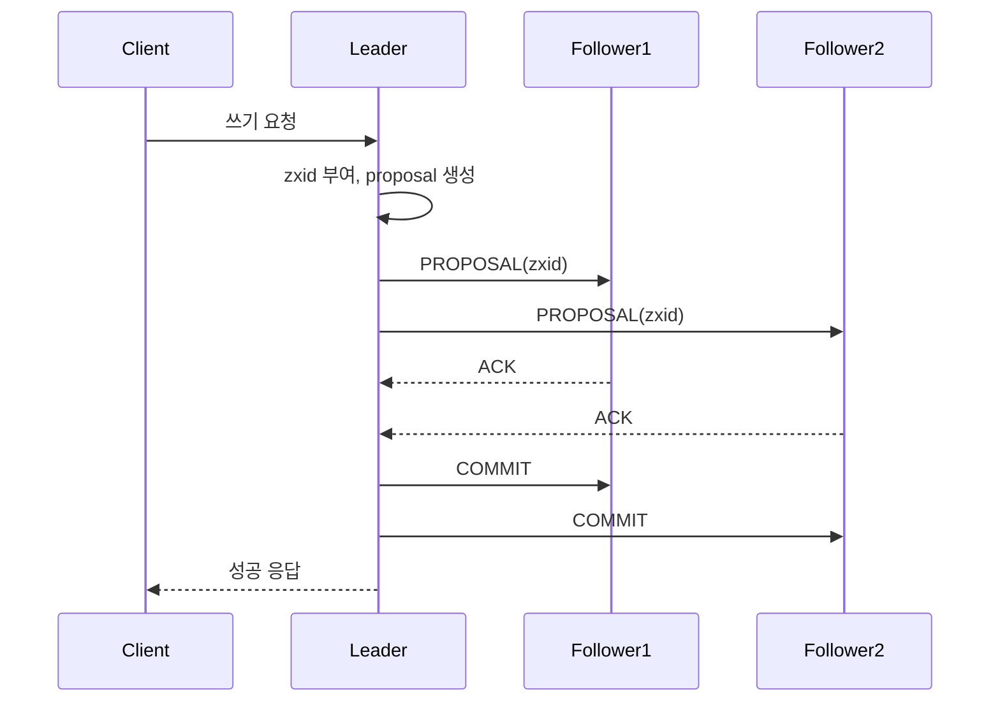

# Apache ZooKeeper

여러 서버가 같이 돌면서 "지금 누가 리더냐", "이 락은 누가 쥐고 있냐", "이 설정값이 바뀌면 알려줘" 같은 걸 한 곳에서 관리해주는 코디네이션 서비스다. 야후에서 만들었고 지금은 아파치 재단 프로젝트다. Hadoop, HBase, Kafka, Solr 같은 분산 시스템들이 자기 내부 조율을 ZooKeeper에 맡겨 왔다.

여기서 헷갈리지 말아야 할 게 있다. ZooKeeper는 범용 데이터 저장소가 아니다. 키 하나당 1MB 제한이 걸려 있고, 실제로는 그보다 훨씬 작게 쓴다. 설정 덩어리나 파일을 넣는 용도가 아니라 "조율에 필요한 작은 메타데이터"를 넣는 곳이다. 이 선을 넘으면 운영에서 바로 문제가 터진다.

etcd와 비교하면 둘 다 강한 일관성을 주는 합의 기반 코디네이션 저장소라는 점은 같다. 차이는 ZooKeeper가 znode라는 계층형 트리 모델을 쓰고 watch와 ephemeral 노드라는 원시 기능을 직접 노출한다는 데 있다. etcd는 평평한 키-값에 lease/watch를 얹은 구조다. 둘을 비교하는 부분은 뒤에서 따로 다룬다.

## znode: 파일시스템처럼 생긴 트리

ZooKeeper의 데이터 모델은 유닉스 파일시스템과 거의 똑같이 생겼다. 경로는 `/app/config/db` 처럼 슬래시로 구분하고, 각 경로마다 노드가 하나 있다. 이 노드를 znode라고 부른다.

파일시스템과 다른 점은 디렉터리와 파일의 구분이 없다는 거다. 모든 znode가 데이터도 가질 수 있고 자식도 가질 수 있다. `/app`에 데이터를 넣으면서 동시에 `/app/config`라는 자식을 둘 수 있다.

```bash
# zkCli로 접속
$ bin/zkCli.sh -server localhost:2181

# znode 생성하면서 데이터 넣기
[zk] create /app "service-root"
Created /app

# 자식 생성
[zk] create /app/config "db=mysql"
Created /app/config

# 데이터 읽기
[zk] get /app/config
db=mysql

# 자식 목록
[zk] ls /app
[config]
```

`get`을 하면 데이터만 나오는 게 아니라 stat 정보가 같이 따라온다. 이게 ZooKeeper를 다룰 때 핵심이다.

```bash
[zk] get -s /app/config
db=mysql
cZxid = 0x300000002      # 생성 시점 트랜잭션 ID
mZxid = 0x300000005      # 마지막 수정 트랜잭션 ID
ctime = ...              # 생성 시각
mtime = ...              # 수정 시각
version = 2              # 데이터 버전 (수정마다 +1)
cversion = 0             # 자식 변경 버전
aclVersion = 0
ephemeralOwner = 0x0     # ephemeral이면 세션 ID, 아니면 0
dataLength = 8
numChildren = 0
```

`version` 필드가 중요하다. 데이터를 쓸 때 버전을 같이 넘기면 그 버전일 때만 쓰기가 성공한다. 다른 클라이언트가 먼저 고쳤으면 버전이 올라가서 내 쓰기가 거부된다. 낙관적 락(optimistic locking)이 데이터 모델에 박혀 있는 셈이다. 분산 환경에서 "내가 읽은 값을 기준으로 갱신"하는 패턴을 안전하게 짤 수 있다.

```bash
# version 2일 때만 쓰기 성공
[zk] set /app/config "db=postgres" 2
# 버전이 안 맞으면 BadVersion 에러
```

## zxid: 모든 변경에 붙는 단조 증가 번호

위 stat에서 본 `cZxid`, `mZxid`의 zxid는 ZooKeeper Transaction ID다. 클러스터에서 일어나는 모든 쓰기 연산에 64비트 번호가 하나씩 붙고, 이 번호는 절대 줄어들지 않는다.

64비트를 둘로 쪼개서 쓴다. 상위 32비트는 epoch(리더가 바뀔 때마다 +1), 하위 32비트는 그 epoch 안에서의 카운터다. `0x300000005`라면 epoch 3, 카운터 5라는 뜻이다. 리더 선출이 일어나면 epoch가 올라가고 카운터는 0부터 다시 센다.

이 구조가 왜 중요하냐면, 오래된 리더가 네트워크에서 잠깐 끊겼다 돌아왔을 때 자기 epoch가 낮으면 더 이상 리더 행세를 못 한다. 새 리더의 epoch가 더 크기 때문이다. etcd의 Raft term과 똑같은 역할을 한다.

## 노드 종류: persistent, ephemeral, sequential

znode를 만들 때 종류를 정한다. 이게 ZooKeeper로 락이나 리더 선출을 짤 때 전부 다 쓰이는 핵심이다.

**persistent**: 기본값. 명시적으로 지우기 전까지 남아 있다. 설정값 보관에 쓴다.

**ephemeral**: 만든 클라이언트의 세션이 살아 있는 동안만 존재한다. 세션이 끊기거나 만료되면 ZooKeeper가 알아서 지운다. 자식을 가질 수 없다. "이 서버가 살아 있다"를 표현하는 데 쓴다. 서버가 죽으면 세션이 끊기고 znode가 사라지니까, 다른 서버들이 그걸 보고 장애를 감지한다.

**sequential**: 만들 때 경로 뒤에 10자리 숫자가 자동으로 붙는다. 이 숫자는 부모 znode 단위로 단조 증가한다. 여러 클라이언트가 같은 경로로 동시에 만들어도 서로 다른 번호를 받는다.

ephemeral과 sequential은 조합할 수 있다. **ephemeral sequential**이 분산 락과 리더 선출의 기본 재료다.

```bash
# persistent (기본)
[zk] create /servers "root"

# ephemeral: 세션 끊기면 사라짐
[zk] create -e /servers/node "alive"

# sequential: 숫자가 붙음
[zk] create -s /tasks/task- "data"
Created /tasks/task-0000000000

[zk] create -s /tasks/task- "data"
Created /tasks/task-0000000001

# ephemeral + sequential
[zk] create -e -s /lock/req- ""
Created /lock/req-0000000003
```

zkCli에서 `-e`로 만든 노드를 보고 싶으면 같은 세션을 유지해야 한다. 셸을 나가면 세션이 끊기고 노드가 사라진다. 처음 ZooKeeper를 만질 때 "ephemeral 노드가 왜 안 보이지" 하고 헤매는 경우가 많은데, 십중팔구 세션이 끊긴 거다.

## watch: 한 번만 발동하는 일회성 트리거

watch는 znode에 변화가 생기면 클라이언트에 알림을 보내는 기능이다. 폴링 없이 변경을 감지한다. 그런데 여기에 ZooKeeper를 처음 쓰는 사람들이 거의 다 한 번씩 데이는 함정이 있다.

**watch는 일회성이다.** 한 번 발동하면 끝이다. 계속 감시하려면 알림을 받을 때마다 다시 watch를 걸어야 한다. 이걸 모르고 "watch 한 번 걸었으니 계속 알림이 오겠지" 하고 짜면 첫 변경 이후로는 아무 알림도 못 받는다.

```bash
# watch 걸고 읽기
[zk] get -w /app/config
db=mysql

# 다른 세션에서 값을 바꾸면
# WatchedEvent state:SyncConnected type:NodeDataChanged path:/app/config
# 알림이 한 번 온다. 그 다음 변경부터는 다시 get -w 해야 알림이 옴
```

watch와 데이터 읽기 사이에는 또 다른 함정이 있다. watch 알림은 "뭔가 바뀌었다"는 신호만 줄 뿐, 바뀐 값을 같이 주지 않는다. 알림을 받고 다시 읽어야 하는데, 그 사이에 또 변경이 일어날 수 있다. 그래서 watch는 "최신 상태를 정확히 추적"하는 용도가 아니라 "지금 다시 읽어봐야 한다"는 신호로만 써야 한다. 여러 번 변경이 일어나도 알림은 합쳐져서 한 번만 올 수 있다는 걸 전제로 코드를 짜야 한다.

watch가 보장하는 건 순서다. 클라이언트가 어떤 변경을 watch로 알림받았다면, 그 변경 이후의 데이터를 읽는 것이 보장된다. 알림보다 오래된 값을 읽는 일은 없다.

## 세션, ticktime, 그리고 세션 만료

클라이언트가 ZooKeeper에 접속하면 세션이 하나 생긴다. 이 세션이 ephemeral 노드의 생명줄이다. 세션이 살아 있으면 ephemeral 노드가 살아 있고, 세션이 끝나면 노드가 사라진다.

세션은 하트비트로 유지된다. 클라이언트 라이브러리가 주기적으로 ping을 보내고, 일정 시간 동안 ping이 안 오면 서버가 세션을 죽인다. 이 타이밍을 정하는 게 ticktime과 session timeout이다.

**ticktime**: ZooKeeper의 기본 시간 단위. 보통 2000ms로 설정한다. 하트비트 주기와 세션 타임아웃의 최소/최대 한계가 이 값을 기준으로 정해진다.

**session timeout**: 클라이언트가 접속할 때 요청하는 값이지만, 서버가 ticktime의 2배~20배 범위로 깎는다. ticktime이 2초면 세션 타임아웃은 최소 4초, 최대 40초 사이로 강제된다. 클라이언트가 60초를 요청해도 서버는 40초로 잘라버린다.

```properties
# zoo.cfg
tickTime=2000
# minSessionTimeout = 2 * tickTime = 4000ms (기본)
# maxSessionTimeout = 20 * tickTime = 40000ms (기본)
# 필요하면 명시적으로 조정
minSessionTimeout=4000
maxSessionTimeout=40000
```

세션 만료가 운영에서 제일 골치 아픈 부분이다. 클라이언트와 서버 사이 네트워크가 잠깐 끊기거나, GC로 클라이언트 JVM이 몇 초 멈추거나, 서버가 디스크 fsync로 느려지면 하트비트가 밀린다. 타임아웃을 넘기면 서버는 세션을 죽이고 그 세션의 ephemeral 노드를 전부 지운다.

문제는 클라이언트 입장에서 이게 비동기로 일어난다는 거다. 클라이언트는 자기 세션이 죽은 줄 모르고 있다가, 네트워크가 돌아와서 재접속을 시도할 때 `SESSIONEXPIRED`를 받는다. 이때 그 클라이언트가 들고 있던 ephemeral 노드(락, 리더 표식 등)는 이미 다 사라진 상태다. 다른 클라이언트가 이미 락을 가져갔을 수도 있다.

그래서 세션 만료는 절대 무시하면 안 되는 이벤트다. `Expired` 상태를 받으면 ZooKeeper 핸들을 새로 만들고, 들고 있던 락이나 리더십을 잃었다고 가정하고 처음부터 다시 시작해야 한다. 기존 핸들로는 아무것도 복구할 수 없다.

```java
// Curator 없이 raw client를 쓸 때 세션 상태 처리
zk = new ZooKeeper(connectString, sessionTimeout, event -> {
    if (event.getState() == Watcher.Event.KeeperState.Expired) {
        // 세션이 죽었다. 들고 있던 ephemeral은 전부 날아갔다.
        // 핸들을 새로 만들고 락/리더십을 처음부터 다시 획득해야 한다.
        recreateSession();
    } else if (event.getState() == Watcher.Event.KeeperState.Disconnected) {
        // 일시적 단절. 아직 세션은 살아 있을 수 있다.
        // 이 동안 ZooKeeper 호출은 막아야 한다. 함부로 락을 가졌다고 가정하면 안 됨.
    }
});
```

Disconnected와 Expired를 구분하는 게 중요하다. Disconnected는 "잠깐 끊겼지만 세션은 아직 살아 있을 수 있음"이고, Expired는 "세션이 확정적으로 죽었음"이다. Disconnected 동안에는 락을 가졌는지 안 가졌는지 알 수 없으니, 보수적으로 작업을 멈춰야 한다. 이걸 직접 다루기가 까다로워서 실무에서는 거의 다 Apache Curator를 쓴다. Curator가 세션 만료 후 재구성과 락 재획득을 알아서 처리해준다.

## ZAB: ZooKeeper의 합의 프로토콜

ZooKeeper는 ZAB(ZooKeeper Atomic Broadcast)라는 자체 합의 프로토콜로 돈다. Raft나 Paxos와 같은 부류인데, ZooKeeper의 요구사항에 맞춰 따로 만든 것이다. Raft가 ZAB보다 나중에 나왔고, 둘은 구조가 많이 닮았다.

ZAB는 두 단계로 돈다.

**리더 선출(leader election)**: 클러스터가 시작되거나 리더가 죽으면 새 리더를 뽑는다. 각 서버는 자기가 본 가장 큰 zxid를 후보 자격으로 내건다. 가장 최신 데이터를 가진 서버(zxid가 가장 큰 서버)가 리더가 된다. 데이터를 가장 많이 가진 놈이 리더가 돼야 손실이 없기 때문이다. 같으면 서버 ID로 정한다.

**원자적 브로드캐스트(atomic broadcast)**: 리더가 정해지면 모든 쓰기는 리더를 거친다. 리더가 쓰기를 proposal로 만들어 팔로워들에게 뿌리고, 과반수가 ack하면 commit 메시지를 보낸다. 이 순서가 zxid 순서대로 엄격하게 지켜진다.



ZAB의 핵심 성질이 두 가지 있다.

첫째, **모든 쓰기는 리더를 통과하고 전역 순서가 있다.** zxid 순서대로 적용되니까 어떤 팔로워에서 봐도 변경 순서가 같다. etcd의 Raft와 동일한 보장이다.

둘째, **읽기는 기본적으로 어느 서버에서나 로컬로 처리된다.** 이게 etcd와 ZooKeeper의 큰 차이다. ZooKeeper는 읽기 성능을 위해 팔로워가 자기 로컬 데이터로 읽기를 바로 응답한다. 그래서 읽기 처리량이 노드 수에 비례해 늘어나지만, 대신 약간 오래된 값을 읽을 수 있다(staleness). 방금 다른 클라이언트가 쓴 값이 내가 접속한 팔로워에 아직 복제 안 됐을 수 있다는 뜻이다.

이 staleness가 신경 쓰이면 `sync` 연산을 먼저 부른다. `sync`는 그 클라이언트가 접속한 서버를 리더와 동기화시킨 뒤 읽게 해서, 적어도 sync 시점까지의 최신 데이터를 보장한다. 락을 잡고 나서 공유 데이터를 읽을 때처럼 최신값이 꼭 필요한 자리에서만 쓴다. 매번 sync를 부르면 로컬 읽기의 장점이 사라진다.

## ensemble과 정족수(quorum): 왜 홀수인가

ZooKeeper 서버 여러 대를 묶은 클러스터를 ensemble이라고 부른다. 쓰기가 커밋되려면 ensemble의 과반수가 ack해야 한다. 이 과반수가 정족수다.

서버를 홀수로 두는 이유는 etcd와 똑같다. 과반수를 만족하면서 장애 허용 개수를 최대로 가져가기 위해서다.

| 서버 수 | 정족수(과반) | 버틸 수 있는 장애 노드 수 |
|---------|--------------|---------------------------|
| 1 | 1 | 0 |
| 3 | 2 | 1 |
| 4 | 3 | 1 |
| 5 | 3 | 2 |
| 7 | 4 | 3 |

3대와 4대는 둘 다 장애 1대까지만 버틴다. 4대는 서버만 하나 더 쓰고 내결함성은 그대로다. 게다가 노드가 많아지면 쓰기마다 ack를 받을 대상이 늘어서 쓰기 지연이 커진다. 그래서 3대나 5대가 표준이다. 7대 넘어가면 쓰기가 눈에 띄게 느려진다.

```properties
# zoo.cfg - 3대 ensemble 구성
tickTime=2000
dataDir=/var/lib/zookeeper
clientPort=2181
initLimit=10      # 팔로워가 리더와 초기 동기화에 쓸 수 있는 tick 수 (10*2초=20초)
syncLimit=5       # 팔로워가 리더와 동기화 유지에 허용되는 tick 수 (5*2초=10초)

# 각 서버 주소. 2888은 팔로워-리더 통신, 3888은 리더 선출용
server.1=zk1:2888:3888
server.2=zk2:2888:3888
server.3=zk3:2888:3888
```

각 서버의 `dataDir`에는 `myid` 파일을 둬야 한다. 그 안에 1, 2, 3 같은 서버 번호를 적는다. `server.1`이면 `myid`에 1이 들어 있어야 한다. 이걸 빼먹거나 잘못 적으면 ensemble이 안 뜬다. 클러스터를 처음 세울 때 자주 하는 실수다.

```bash
# zk1 서버에서
$ echo "1" > /var/lib/zookeeper/myid
# zk2 서버에서
$ echo "2" > /var/lib/zookeeper/myid
```

정족수를 못 채우면 ensemble 전체가 쓰기를 거부한다. 5대 중 3대가 죽으면 남은 2대로는 과반(3)이 안 되니까 읽기는 되더라도 쓰기는 전부 막힌다. 이건 버그가 아니라 일관성을 지키려는 의도된 동작이다. 가용성보다 일관성을 택한 CP 시스템이다.

## 분산 락 구현

ZooKeeper의 ephemeral sequential 노드로 분산 락을 짜는 게 교과서적인 패턴이다. 직접 짜는 일은 거의 없지만, 원리를 알아야 트러블슈팅이 된다.

기본 아이디어는 이렇다. 락을 원하는 클라이언트들이 같은 부모 밑에 ephemeral sequential 노드를 만든다. 번호가 가장 작은 노드를 만든 클라이언트가 락을 가진다. 나머지는 자기 바로 앞 번호 노드를 watch하고 기다린다.

```
/lock
  /lock/req-0000000000   <- 락 보유 (번호가 가장 작음)
  /lock/req-0000000001   <- req-0000000000을 watch하며 대기
  /lock/req-0000000002   <- req-0000000001을 watch하며 대기
```

락을 잡는 절차:

1. `/lock/req-` 로 ephemeral sequential 노드를 만든다. 내 번호를 받는다.
2. `/lock`의 자식을 전부 가져와 번호순으로 정렬한다.
3. 내가 가장 작은 번호면 락을 획득한 것이다.
4. 아니면 나보다 바로 앞 번호 노드에 watch를 건다.
5. watch 알림이 오면(앞 노드가 사라지면) 2번부터 다시 한다.

```java
public class DistributedLock {
    private final ZooKeeper zk;
    private final String lockRoot = "/lock";
    private String myNode;

    public void lock() throws Exception {
        // ephemeral sequential 노드 생성
        myNode = zk.create(lockRoot + "/req-", new byte[0],
                ZooDefs.Ids.OPEN_ACL_UNSAFE,
                CreateMode.EPHEMERAL_SEQUENTIAL);

        while (true) {
            List<String> children = zk.getChildren(lockRoot, false);
            Collections.sort(children);

            String myName = myNode.substring(lockRoot.length() + 1);
            int myIndex = children.indexOf(myName);

            if (myIndex == 0) {
                return; // 내가 제일 작다. 락 획득.
            }

            // 바로 앞 노드에 watch를 걸고 대기
            String predecessor = children.get(myIndex - 1);
            CountDownLatch latch = new CountDownLatch(1);
            Stat stat = zk.exists(lockRoot + "/" + predecessor,
                    event -> latch.countDown());

            if (stat != null) {
                latch.await(); // 앞 노드가 사라질 때까지 대기
            }
            // 사라졌으면 루프 처음으로 가서 다시 확인
        }
    }

    public void unlock() throws Exception {
        zk.delete(myNode, -1); // 내 노드 삭제 → 다음 대기자가 깨어남
    }
}
```

이 패턴에서 ephemeral이 결정적이다. 락을 쥔 클라이언트가 죽으면 세션이 끊기고 그 노드가 자동으로 사라진다. 그러면 다음 대기자가 watch 알림을 받고 락을 가져간다. 락을 쥔 채로 프로세스가 죽어도 데드락이 안 생긴다.

watch를 바로 앞 노드 하나에만 거는 게 중요하다. 모든 대기자가 `/lock`의 자식 변경을 watch하면, 노드 하나가 사라질 때마다 대기자 전부가 깨어나서 한꺼번에 자식 목록을 다시 읽는다. 이걸 herd effect(무리 효과)라고 한다. 대기자가 100개면 락 하나 넘어갈 때마다 100개가 동시에 ZooKeeper를 때린다. 바로 앞 노드만 watch하면 한 번에 하나씩만 깨어난다.

직접 짜면 위에서 본 세션 만료 처리, 재접속, 락 재확인 같은 걸 다 손으로 해야 한다. 그래서 실무에서는 Apache Curator의 `InterProcessMutex`를 쓴다. herd effect 회피, 세션 만료 복구, 재진입까지 다 들어 있다.

```java
// Curator로 분산 락
CuratorFramework client = CuratorFrameworkFactory.newClient(
        "zk1:2181,zk2:2181,zk3:2181",
        new ExponentialBackoffRetry(1000, 3));
client.start();

InterProcessMutex lock = new InterProcessMutex(client, "/lock/resource");
if (lock.acquire(10, TimeUnit.SECONDS)) {
    try {
        // 임계 구역
    } finally {
        lock.release();
    }
}
```

여기서 빠지기 쉬운 함정이 하나 있다. ZooKeeper 락은 세션 만료로 깨질 수 있다. 락을 쥔 동안 GC로 클라이언트가 오래 멈추면, ZooKeeper는 세션을 죽이고 락을 풀어버린다. 그 사이 다른 클라이언트가 락을 가져간다. 그런데 멈췄던 클라이언트는 깨어나서 자기가 여전히 락을 가졌다고 믿고 임계 구역 코드를 실행한다. 두 클라이언트가 동시에 임계 구역에 들어가는 거다. 이건 ZooKeeper만의 문제가 아니라 세션 기반 분산 락 전부의 한계다. 정말 안전이 필요하면 보호 대상 리소스 쪽에서 fencing token(단조 증가 번호)으로 한 번 더 막아야 한다.

## 리더 선출 구현

리더 선출도 분산 락과 거의 같은 구조다. 후보들이 ephemeral sequential 노드를 만들고, 가장 작은 번호를 가진 후보가 리더가 된다. 차이는 락처럼 풀고 다시 잡는 게 아니라, 리더가 죽을 때까지 계속 리더로 있는다는 점이다.

```
/election
  /election/n-0000000000   <- 리더
  /election/n-0000000001   <- 대기 (앞 노드 watch)
  /election/n-0000000002   <- 대기 (앞 노드 watch)
```

절차는 락과 같다. 노드를 만들고, 내가 가장 작으면 리더가 되고, 아니면 바로 앞 노드를 watch한다. 리더가 죽으면 그 ephemeral 노드가 사라지고, 바로 다음 후보가 watch 알림을 받아 리더가 된다.

여기서도 herd effect를 피하려면 바로 앞 노드만 watch해야 한다. 리더가 죽었을 때 모든 후보가 깨어나는 게 아니라, 다음 차례 후보 하나만 깨어나서 리더가 되도록 한다.

Curator에는 이것도 `LeaderLatch`와 `LeaderSelector`로 들어 있다. `LeaderLatch`는 한 번 리더가 되면 계속 리더로 있고, `LeaderSelector`는 리더 역할을 돌아가며 맡는 식이다.

```java
LeaderLatch latch = new LeaderLatch(client, "/election");
latch.addListener(new LeaderLatchListener() {
    @Override
    public void isLeader() {
        // 리더가 됐다. 리더만 하는 작업 시작.
    }
    @Override
    public void notLeader() {
        // 리더십을 잃었다. 작업 중단.
    }
});
latch.start();
```

`notLeader` 콜백이 호출됐을 때 즉시 리더 작업을 멈추는 게 중요하다. 세션이 끊겨서 리더십을 잃었는데도 계속 리더 작업을 하면 두 노드가 동시에 리더 행세를 하게 된다. 리더 선출도 분산 락과 마찬가지로 세션 만료 타이밍에 두 리더가 잠깐 공존할 수 있다는 걸 전제로 설계해야 한다.

## Kafka의 ZooKeeper 의존성과 KRaft 이전

오랫동안 Kafka를 쓰면 ZooKeeper가 항상 같이 따라왔다. Kafka 브로커들이 자기 클러스터 메타데이터를 ZooKeeper에 저장했기 때문이다. 어떤 토픽이 있는지, 파티션이 어느 브로커에 있는지, 누가 컨트롤러(Kafka 클러스터의 리더)인지, ACL 설정은 뭔지를 전부 ZooKeeper에 넣었다. Kafka를 운영하려면 ZooKeeper ensemble을 따로 띄우고 그것까지 같이 모니터링해야 했다.

이 구조에는 불편한 점이 많았다.

운영 부담이 두 배였다. ZooKeeper ensemble과 Kafka 클러스터를 따로 띄우고 따로 관리해야 했다. 장애가 나면 둘 중 어디가 문제인지 봐야 했다.

메타데이터가 커지면 한계가 왔다. 파티션이 수십만 개를 넘어가면 컨트롤러가 ZooKeeper에서 메타데이터를 읽어 메모리에 올리는 데 시간이 오래 걸렸다. 컨트롤러가 바뀔 때마다 전체 메타데이터를 ZooKeeper에서 다시 로드해야 했고, 이게 큰 클러스터에서 수십 초씩 걸렸다. 그동안 일부 동작이 멈췄다.

이 문제를 풀려고 Kafka는 KRaft(Kafka Raft)로 방향을 틀었다. ZooKeeper를 떼고, Kafka 브로커 자체가 Raft 합의로 메타데이터를 관리하게 만든 것이다. 메타데이터를 별도 시스템이 아니라 Kafka 내부 메타데이터 토픽(`__cluster_metadata`)에 로그로 쌓고, 컨트롤러들이 Raft로 그 로그를 복제한다.

KRaft로 가면서 달라진 것:

외부 의존성이 사라졌다. ZooKeeper 없이 Kafka만 띄우면 된다. 운영 대상이 하나로 줄었다.

컨트롤러 장애 복구가 빨라졌다. 새 컨트롤러가 전체 메타데이터를 다시 로드하는 게 아니라, 이미 복제된 메타데이터 로그를 이어받기만 하면 된다. 컨트롤러 전환이 수십 초에서 거의 즉시로 줄었다.

파티션 확장성이 좋아졌다. 메타데이터가 로그 구조로 관리되니까 수백만 파티션도 다룰 수 있게 됐다.

KRaft는 Kafka 2.8에서 실험적으로 들어왔고, 3.3에서 프로덕션 사용 가능 판정을 받았다. 그 이후 신규 클러스터는 KRaft가 기본이 됐고, ZooKeeper 모드는 Kafka 4.0에서 제거됐다. 지금 Kafka를 새로 깔면 ZooKeeper를 만질 일이 없다. 다만 오래된 클러스터를 운영 중이라면 여전히 ZooKeeper가 돌고 있을 거고, KRaft로 마이그레이션하는 작업이 남아 있을 수 있다.

마이그레이션 자체는 한 번에 끊어 옮기는 게 아니라 ZooKeeper와 KRaft를 잠깐 같이 돌리는 듀얼 라이트 단계를 거친다. 컨트롤러 쿼럼을 KRaft로 먼저 띄우고, 메타데이터를 ZooKeeper에서 KRaft로 복제한 뒤, 브로커를 하나씩 KRaft 모드로 재시작하고, 마지막에 ZooKeeper 의존을 끊는 순서다. 운영 중인 클러스터라면 이 단계를 건너뛰면 안 된다.

## ZooKeeper vs etcd vs Consul

셋 다 강한 일관성을 주는 코디네이션 시스템이지만 결이 다르다.

| 항목 | ZooKeeper | etcd | Consul |
|------|-----------|------|--------|
| 합의 프로토콜 | ZAB | Raft | Raft |
| 데이터 모델 | 계층형 트리(znode) | 평평한 키-값 | 키-값 + 서비스 카탈로그 |
| 읽기 일관성 | 기본 로컬(staleness), sync로 강화 | 기본 선형성 보장 | 기본/stale/consistent 선택 |
| 변경 감지 | watch(일회성) | watch(스트림) | blocking query |
| 만료 메커니즘 | 세션 + ephemeral 노드 | lease + TTL | 세션 + 헬스체크 |
| 주 사용처 | Hadoop/HBase/구 Kafka | Kubernetes | 서비스 디스커버리/메시 |
| 인터페이스 | 자체 바이너리 프로토콜 | gRPC | HTTP/DNS |
| 내장 헬스체크 | 없음(세션 기반) | 없음(lease 기반) | 있음(HTTP/TCP/스크립트) |

**ZooKeeper**는 JVM 생태계에서 오래 검증됐다. 분산 락, 리더 선출처럼 코디네이션 원시 기능이 필요하고 이미 Hadoop 계열을 쓰고 있다면 자연스러운 선택이다. 단점은 JVM이라 운영이 무겁고, watch가 일회성이라 직접 다루기 까다롭다는 점이다. 그래서 거의 항상 Curator를 같이 쓴다.

**etcd**는 Kubernetes의 표준 백엔드라 클라우드 네이티브 환경에서 사실상 기본이다. gRPC 인터페이스가 깔끔하고 watch가 스트림이라 다루기 편하다. 평평한 키-값이라 트리 구조가 필요하면 키 네이밍으로 흉내 내야 한다. 자세한 건 [etcd](etcd.md) 문서를 참고.

**Consul**은 코디네이션보다 서비스 디스커버리와 서비스 메시에 무게가 실려 있다. 헬스체크가 내장돼 있고 DNS 인터페이스로 서비스를 찾을 수 있다. 코디네이션 원시 기능(락, 세션)도 있지만, ZooKeeper나 etcd만큼 그 용도로 깊게 쓰이진 않는다.

새 프로젝트에서 순수하게 분산 락이나 리더 선출만 필요하다면, 이미 ZooKeeper를 쓰는 생태계(Kafka 구버전, HBase)가 아닌 이상 etcd나 Consul을 먼저 검토하는 게 보통이다. ZooKeeper는 JVM 운영 부담과 일회성 watch 때문에 신규 도입에서는 점점 밀리는 추세다.

## 트러블슈팅: split-brain

split-brain은 네트워크가 갈라져서 ensemble이 두 그룹으로 쪼개졌을 때 양쪽이 각자 리더를 뽑아 따로 도는 상황이다. ZooKeeper는 정족수 메커니즘으로 이걸 원천 차단한다.

5대 ensemble이 3대와 2대로 갈라졌다고 하자. 3대 쪽은 과반(3)을 채우니까 리더를 뽑고 정상 동작한다. 2대 쪽은 과반을 못 채우니까 리더를 못 뽑고 쓰기를 거부한다. 그래서 양쪽이 동시에 쓰기를 받는 일이 없다. 어느 한쪽만 살아 있게 만드는 게 정족수의 핵심이다.

문제는 짝수 대칭 분할이나 잘못된 구성에서 생긴다. 4대를 2대-2대로 가르면 양쪽 다 과반(3)을 못 채워서 ensemble 전체가 멈춘다. 그래서 홀수 구성이 중요하다.

진짜 위험한 split-brain은 ZooKeeper 자체보다 ZooKeeper를 쓰는 애플리케이션 쪽에서 생긴다. 리더 선출로 뽑힌 애플리케이션 리더가 ZooKeeper와의 세션이 끊겼는데도 자기가 여전히 리더라고 믿고 일을 계속하는 경우다. ZooKeeper는 그 세션을 죽이고 다음 후보를 리더로 뽑았는데, 끊긴 옛 리더는 그걸 모르고 작업을 이어간다. 잠깐이지만 리더가 둘이 된다.

이걸 막으려면 세션 상태 변화를 즉시 반영해야 한다. Disconnected나 Expired를 받으면 리더 작업을 곧바로 멈춰야 한다. 그리고 정말 중요한 작업이라면 ZooKeeper 리더십만 믿지 말고, fencing token으로 다운스트림에서 한 번 더 막는다. 리더가 될 때마다 증가하는 번호를 받아서 작업에 같이 실어 보내고, 받는 쪽은 더 작은 번호를 가진 옛 리더의 요청을 거부한다.

## 트러블슈팅: 세션 만료가 자꾸 일어날 때

세션 만료가 반복되면 거의 다음 셋 중 하나다.

**클라이언트 JVM의 GC 멈춤.** 풀 GC가 세션 타임아웃보다 오래 걸리면 그 동안 하트비트가 안 나가서 세션이 죽는다. 클라이언트 JVM의 GC 로그를 봐서 stop-the-world가 몇 초씩 걸리는지 확인한다. 힙이 너무 크거나 GC 튜닝이 안 됐을 때 자주 생긴다. 세션 타임아웃을 늘리는 건 임시방편이고, 근본 원인은 GC다.

**ZooKeeper 서버의 디스크 latency.** ZooKeeper는 쓰기를 커밋하기 전에 트랜잭션 로그를 디스크에 fsync한다. 이 디스크가 느리면 전체가 느려지고, 하트비트 처리도 밀려서 세션이 만료된다. 트랜잭션 로그(`dataLogDir`)는 반드시 빠른 전용 디스크에 둬야 한다. 데이터 디렉터리와 같은 디스크를 쓰거나 네트워크 스토리지에 올리면 latency가 튄다. 이게 ZooKeeper 운영에서 제일 흔한 성능 함정이다.

```properties
# 트랜잭션 로그를 데이터와 분리. 빠른 전용 디스크에.
dataDir=/var/lib/zookeeper/data
dataLogDir=/var/lib/zookeeper/log   # 별도의 빠른 디스크
```

**네트워크 불안정.** 클라이언트와 서버 사이 패킷 손실이나 지연이 크면 하트비트가 밀린다. 클라우드 환경에서 가용 영역을 넘나드는 트래픽이 불안정할 때 생긴다.

세션 타임아웃 값을 정할 때 트레이드오프가 있다. 짧게 잡으면 장애를 빨리 감지하지만 일시적 끊김에도 세션이 쉽게 죽어서 ephemeral 노드가 자주 사라진다(락이 자주 풀린다). 길게 잡으면 잘 안 죽지만 진짜 죽은 노드를 감지하는 데 오래 걸린다. 보통 GC 최악 멈춤 시간보다 넉넉히 길게, 그러나 장애 감지가 너무 늦지 않을 만큼으로 잡는다. 흔히 ticktime 2초에 세션 타임아웃을 10~30초 사이로 둔다.

## 운영하면서 정리된 것들

ZooKeeper에 큰 데이터를 넣지 마라. znode 1MB 제한은 상한선이지 권장값이 아니다. 실제로는 수 KB 안에서 써야 한다. 설정 파일 전체나 큰 JSON을 넣으면 watch 알림마다 그 데이터가 전송되고 메모리를 먹는다. 전체 데이터셋이 메모리에 다 올라가는 구조라, znode가 많아지거나 커지면 힙이 터진다.

watch가 일회성이라는 걸 절대 잊지 마라. 한 번 발동하면 다시 걸어야 한다. 알림과 재읽기 사이의 변경은 놓칠 수 있으니, watch는 "다시 읽어라" 신호로만 쓰고 최신 상태 추적용으로 믿지 마라.

raw 클라이언트로 직접 짜지 마라. 세션 만료 복구, herd effect 회피, 재접속 백오프를 손으로 다 처리하는 건 버그를 부른다. Apache Curator를 쓴다. 분산 락은 `InterProcessMutex`, 리더 선출은 `LeaderLatch`/`LeaderSelector`, 서비스 디스커버리는 `ServiceDiscovery`로 다 검증된 구현이 있다.

트랜잭션 로그 디스크를 분리하고 빠른 디스크에 둬라. ZooKeeper 성능의 대부분이 fsync에 달려 있다. 네트워크 스토리지나 느린 디스크에 로그를 두면 세션 만료와 리더 선출 폭주로 이어진다.

ensemble은 홀수로, 3대나 5대로 구성해라. 짝수는 내결함성 이득 없이 쓰기만 느려진다. 그리고 가용 영역에 분산 배치하되, 한 영역에 과반이 몰리지 않게 해라. 한 영역이 통째로 죽어도 정족수가 유지돼야 한다.

세션 기반 락은 절대적이지 않다는 걸 전제로 설계해라. 세션 만료 타이밍에 두 클라이언트가 동시에 임계 구역에 들어가거나 리더가 둘이 될 수 있다. 정말 안전이 필요한 곳은 fencing token으로 다운스트림에서 한 번 더 막아라.

신규 시스템이라면 ZooKeeper가 최선인지 다시 보라. Kafka가 KRaft로 떠났고, 클라우드 네이티브는 etcd로 갔다. 이미 Hadoop/HBase 생태계에 있거나 구 Kafka를 운영하는 게 아니라면 etcd나 Consul이 운영하기 더 가볍다.
