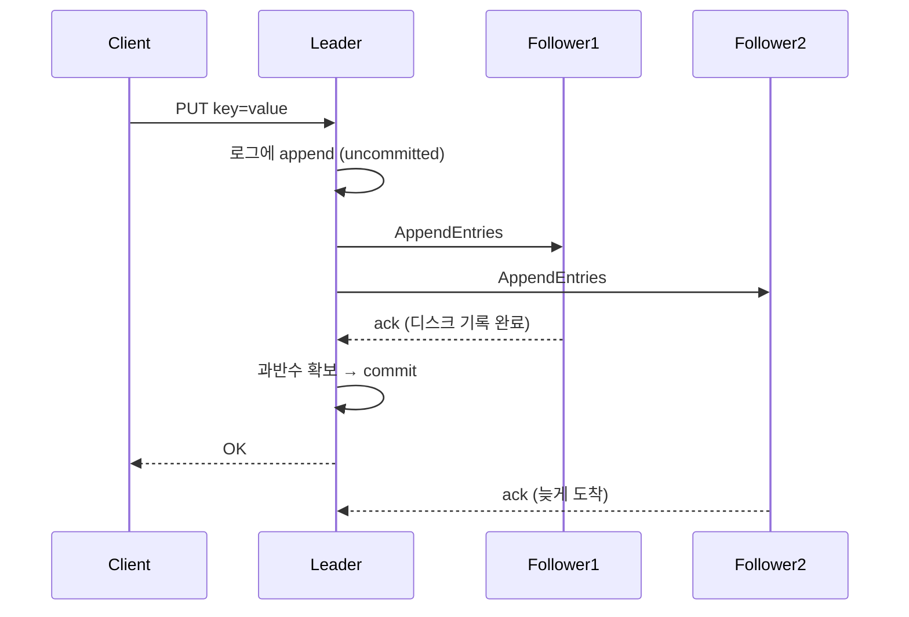
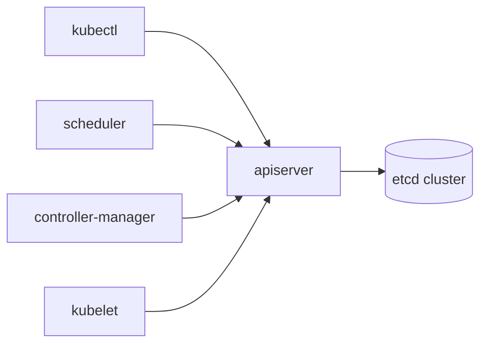

# etcd

분산 환경에서 설정값과 상태를 한 곳에 모아두고, 어느 노드에서 읽어도 같은 값을 보장하는 키-값 저장소다. Kubernetes 컨트롤 플레인이 클러스터의 모든 상태(파드, 서비스, 시크릿, 노드 정보)를 저장하는 곳이기도 하다. CoreOS가 만들었고 지금은 CNCF 프로젝트다.

Redis나 일반 RDB와 다른 점은 합의(consensus)를 깐다는 데 있다. 여러 노드가 같은 데이터를 들고 있으면서, 쓰기 한 건이 과반수 노드에 안전하게 복제되기 전에는 클라이언트에 성공을 돌려주지 않는다. 그래서 일관성은 강하지만 쓰기 지연은 디스크 fsync와 네트워크 왕복에 묶인다. 이 특성을 모르고 쓰면 운영에서 크게 데인다.

## Raft 합의 알고리즘

etcd의 핵심은 Raft다. Paxos보다 이해하기 쉽게 만든 합의 프로토콜이고, 노드를 세 가지 역할로 나눈다.

- **Leader**: 모든 쓰기를 받는 단일 노드. 클라이언트 쓰기는 결국 리더로 모인다.
- **Follower**: 리더의 로그를 복제받는 노드. 읽기는 처리할 수 있다.
- **Candidate**: 리더가 죽었을 때 선거에 나서는 임시 상태.

쓰기가 들어오면 리더가 자기 로그에 엔트리를 append하고 팔로워들에게 복제를 보낸다. 과반수(쿼럼)가 디스크에 기록했다고 응답하면 그 엔트리를 commit으로 표시하고, 그제서야 상태 머신에 적용한 뒤 클라이언트에 성공을 반환한다. 이 "과반수가 확인하기 전엔 커밋 안 함"이 강한 일관성의 근거다.

리더는 주기적으로 하트비트를 보낸다. 팔로워가 election timeout(기본 1초 안팎) 동안 하트비트를 못 받으면 자기 term을 올리고 candidate가 되어 투표를 요청한다. 과반 표를 얻으면 새 리더가 된다. 여기서 중요한 건 term이라는 단조 증가 카운터다. 오래된 리더가 네트워크 단절 후 복귀해도 term이 낮으면 자동으로 팔로워로 내려간다. 스플릿 브레인이 데이터를 깨뜨리지 못하는 이유다.



팔로워 F2의 응답이 늦어도 F1 하나만 ack하면 3노드 클러스터에서는 리더 포함 2표로 과반이 차서 커밋된다. 한 노드가 느려도 클러스터가 멈추지 않는 이유고, 동시에 두 노드가 느리면 멈추는 이유이기도 하다.

## 클러스터 멤버 구성: 왜 홀수인가

노드 개수는 거의 항상 홀수(3, 5, 7)로 잡는다. 쿼럼은 `(N/2) + 1`이다.

| 노드 수 | 쿼럼 | 버틸 수 있는 장애 노드 |
|---------|------|------------------------|
| 1 | 1 | 0 |
| 3 | 2 | 1 |
| 4 | 3 | 1 |
| 5 | 3 | 2 |
| 7 | 4 | 3 |

4노드를 보면 답이 나온다. 3노드와 똑같이 1개 장애만 버티는데 노드는 하나 더 쓴다. 쿼럼을 채울 노드가 늘어나서 쓰기 지연만 커지고 가용성 이득은 없다. 그래서 짝수는 손해다.

운영 규모로는 3노드면 대부분 충분하고, 더 높은 내고장성이 필요하면 5노드로 간다. 7노드 이상은 쓰기 한 건당 복제 대상이 늘어 latency가 눈에 띄게 올라가므로 정말 필요할 때만 쓴다.

노드 수를 키운다고 쓰기 처리량이 올라가지 않는다는 점을 분명히 해야 한다. 모든 쓰기가 단일 리더를 거치고 과반수 복제를 기다리므로, 노드를 늘리면 오히려 쓰기는 느려진다. etcd는 쓰기 확장 도구가 아니라 일관성 보장 도구다.

```bash
# 멤버 목록 확인
etcdctl member list -w table

# 멤버 추가 (스케일 아웃은 한 번에 한 노드씩)
etcdctl member add node4 --peer-urls=https://10.0.0.4:2380

# 멤버 제거
etcdctl member remove <member-id>
```

멤버를 추가/제거할 때는 한 번에 한 노드씩만 한다. 두 노드를 동시에 바꾸면 쿼럼 계산이 꼬여서 클러스터가 일시적으로 쓰기를 거부할 수 있다.

## 리비전, MVCC, watch

etcd는 키 하나에 값 하나만 들고 있는 단순 KV가 아니다. 내부적으로 MVCC(다중 버전 동시성 제어)를 쓴다. 모든 변경에 전역 단조 증가 리비전 번호가 붙는다.

- **revision**: 클러스터 전역에서 모든 쓰기마다 1씩 증가하는 번호. 키와 무관하게 전역이다.
- **create_revision**: 그 키가 처음 생성된 시점의 리비전.
- **mod_revision**: 그 키가 마지막으로 수정된 리비전.
- **version**: 그 키가 생성 이후 수정된 횟수.

```bash
etcdctl put /config/timeout 30
etcdctl get /config/timeout -w json
# {"key":"...","create_revision":5,"mod_revision":5,"version":1,"value":"..."}

etcdctl put /config/timeout 60
etcdctl get /config/timeout -w json
# mod_revision:6, version:2 로 올라감

# 과거 리비전 시점의 값 조회
etcdctl get /config/timeout --rev=5
# 30 (예전 값)
```

이 리비전 덕분에 특정 시점 스냅샷을 읽거나, 변경 이력을 추적하거나, watch를 빠진 이벤트 없이 이어받을 수 있다.

watch는 키 또는 prefix의 변경을 실시간으로 받는 기능이다. Kubernetes 컨트롤러가 리소스 변경을 감지하는 방식이 바로 이 watch다.

```bash
# /config 하위 모든 키 변경 감시
etcdctl watch /config --prefix

# 특정 리비전부터 다시 감시 (놓친 이벤트 복구)
etcdctl watch /config --prefix --rev=100
```

`--rev`로 과거 리비전부터 watch를 걸 수 있는 게 중요하다. 컨트롤러가 재시작돼도 마지막으로 처리한 리비전부터 다시 watch하면 그 사이 변경을 놓치지 않는다. 단, compaction으로 그 리비전이 이미 지워졌다면 watch가 `mvcc: required revision has been compacted` 에러를 낸다. 이건 뒤에서 다룬다.

## lease와 TTL

lease는 만료 시간을 가진 객체다. 키를 lease에 묶어두면 lease가 만료될 때 묶인 키가 같이 삭제된다. 서비스 등록처럼 "살아있는 동안만 유지되어야 하는" 데이터에 쓴다.

```bash
# 60초 TTL lease 생성
etcdctl lease grant 60
# lease 694d... granted with TTL(60s)

# 키를 lease에 연결
etcdctl put /services/api/node1 "10.0.0.1:8080" --lease=694d...

# lease 갱신 (keepalive). 멈추면 60초 후 키 자동 삭제
etcdctl lease keep-alive 694d...

# 남은 TTL 확인
etcdctl lease timetolive 694d... --keys
```

서비스 인스턴스가 살아있는 동안 주기적으로 keep-alive를 보내고, 인스턴스가 죽으면 keep-alive가 끊겨 lease가 만료되고 등록 키가 사라진다. 헬스체크 없이도 죽은 인스턴스가 자동으로 정리되는 구조다. Consul, Vault 같은 도구가 etcd나 비슷한 메커니즘 위에서 동작한다.

주의할 점은 keep-alive 주기를 TTL보다 충분히 짧게 잡아야 한다는 거다. TTL 60초에 keep-alive를 55초마다 보내면 GC 지연이나 네트워크 지터 한 번에 lease가 만료되어 서비스가 통째로 등록 해제된다. 보통 TTL의 1/3 정도 주기로 보낸다.

## 분산락 구현

etcd로 분산락을 만들 수 있다. 핵심은 lease와 트랜잭션, 그리고 리비전 순서다.

원리는 이렇다. 락을 잡으려는 클라이언트들이 같은 prefix 아래에 각자 lease가 붙은 키를 만든다. 가장 낮은 create_revision을 가진 키의 소유자가 락을 잡는다. 나머지는 자기 바로 앞 순번의 키를 watch하며 대기한다. 앞 키가 사라지면(락 해제 또는 클라이언트 죽음) 다음 순번이 락을 넘겨받는다.

```bash
# etcdctl 내장 lock 명령
etcdctl lock /locks/job1
# 락을 잡으면 셸이 락을 쥔 채로 멈춰 있음
# Ctrl+C 또는 프로세스 종료 시 락 해제
```

Go에서 직접 쓸 때는 `concurrency` 패키지를 쓴다.

```go
import (
    clientv3 "go.etcd.io/etcd/client/v3"
    "go.etcd.io/etcd/client/v3/concurrency"
)

cli, _ := clientv3.New(clientv3.Config{
    Endpoints: []string{"10.0.0.1:2379"},
})
defer cli.Close()

// 락 세션은 lease 위에 올라간다. TTL 동안 keep-alive 자동
session, _ := concurrency.NewSession(cli, concurrency.WithTTL(15))
defer session.Close()

mu := concurrency.NewMutex(session, "/locks/job1")

ctx := context.Background()
if err := mu.Lock(ctx); err != nil {
    log.Fatal(err)
}
// 임계 구역
doWork()
mu.Unlock(ctx)
```

lease 위에 락을 올리는 게 핵심이다. 락을 쥔 프로세스가 패닉으로 죽거나 네트워크에서 떨어져도 lease TTL이 만료되면 락이 자동으로 풀린다. Redis Redlock에서 데드락 방지를 위해 만료 시간을 거는 것과 같은 발상이지만, etcd는 합의 기반이라 락 소유권에 대한 split-brain 위험이 없다.

다만 TTL 만료로 락이 풀린 뒤에도 원래 소유자가 자기가 락을 쥐었다고 착각하고 계속 작업할 수 있다(GC stop-the-world 등으로). 이걸 막으려면 보호 대상 리소스 쪽에서 fencing token(여기서는 리비전 번호)을 검사해야 한다. etcd 분산락만 믿고 임계 구역 안에서 외부 시스템에 무한정 쓰기를 날리면 위험하다는 점을 기억해야 한다.

## Kubernetes 컨트롤 플레인에서의 etcd

Kubernetes에서 etcd는 단 하나의 진짜 상태 저장소다. `kubectl apply`로 만든 모든 리소스, 노드 상태, 시크릿, 컨피그맵이 전부 etcd에 들어간다. kube-apiserver만 etcd와 직접 통신하고, 다른 컴포넌트(스케줄러, 컨트롤러 매니저, kubelet)는 전부 apiserver를 거친다.



apiserver가 etcd watch를 깔아두고, 리소스가 바뀌면 watch 이벤트가 컨트롤러들에게 전파된다. 디플로이먼트 리플리카를 3으로 바꾸면, 그 변경이 etcd에 커밋되고 watch로 컨트롤러에 전달되어 파드 생성이 시작된다.

여기서 나오는 운영 결론은 명확하다. etcd가 느려지면 Kubernetes 전체가 느려진다. 클러스터가 갑자기 둔해지고 `kubectl get`이 타임아웃 나면, 십중팔구 etcd 디스크 latency나 DB 사이즈 문제를 먼저 본다.

Kubernetes 시크릿은 etcd에 평문(base64는 인코딩일 뿐 암호화가 아니다)으로 저장된다. etcd 데이터 디렉토리나 스냅샷이 유출되면 모든 시크릿이 그대로 노출된다. `EncryptionConfiguration`으로 저장 시 암호화를 켜고, 디스크와 백업을 암호화해야 한다.

## 백업: snapshot save와 restore

etcd 백업은 snapshot으로 한다. 운영 중인 클러스터에서 무중단으로 일관된 스냅샷을 뜰 수 있다.

```bash
# 스냅샷 저장 (멤버 한 곳에서 실행)
ETCDCTL_API=3 etcdctl snapshot save /backup/etcd-snapshot.db \
  --endpoints=https://10.0.0.1:2379 \
  --cacert=/etc/etcd/ca.crt \
  --cert=/etc/etcd/server.crt \
  --key=/etc/etcd/server.key

# 스냅샷 상태 확인 (해시, 리비전, 키 개수)
etcdctl snapshot status /backup/etcd-snapshot.db -w table
```

복구는 스냅샷에서 새 데이터 디렉토리를 만들어내는 방식이다. 기존 데이터에 덮어쓰는 게 아니라 새 디렉토리를 생성한다.

```bash
ETCDCTL_API=3 etcdctl snapshot restore /backup/etcd-snapshot.db \
  --name node1 \
  --initial-cluster node1=https://10.0.0.1:2380,node2=https://10.0.0.2:2380,node3=https://10.0.0.3:2380 \
  --initial-advertise-peer-urls https://10.0.0.1:2380 \
  --data-dir /var/lib/etcd-restored
```

복구할 때 클러스터의 모든 노드에서 같은 스냅샷으로 각자 restore를 돌리고, `--name`과 peer URL만 노드별로 바꾼다. 그 다음 새 데이터 디렉토리를 가리키도록 etcd를 재시작한다.

실제로 복구해보면 알게 되는 점이 몇 가지 있다.

- restore로 복원하면 멤버 ID가 새로 생긴다. 기존 클러스터에 그냥 한 노드만 restore해서 끼워 넣으려 하면 실패한다. 클러스터 전체를 스냅샷 기준으로 다시 세우는 작업이다.
- 백업은 정기적으로 받되, 받은 스냅샷으로 실제 복구가 되는지 주기적으로 검증해야 한다. 백업 파일만 쌓아두고 복구 리허설을 안 하면 진짜 장애 때 그 스냅샷이 쓸모없는 경우가 있다.
- Kubernetes 클러스터를 백업한다면서 etcd 스냅샷을 안 뜨면 의미가 없다. PV 데이터와 별개로 etcd 스냅샷이 컨트롤 플레인 백업의 본체다.

## DB 사이즈 한계와 quota-backend-bytes

etcd는 DB 크기에 상한을 둔다. 기본값은 2GB, 운영에서는 보통 8GB 정도까지 올린다.

```bash
etcd --quota-backend-bytes=8589934592   # 8GB
```

이 한계를 넘으면 etcd가 `NOSPACE` 알람을 띄우고 클러스터를 읽기 전용으로 만든다. 쓰기가 전부 막힌다. Kubernetes라면 이 순간 클러스터에 아무것도 배포/수정할 수 없게 된다.

크기가 무한정 커지는 안전장치 성격의 상한이라 무조건 키운다고 해결되지 않는다. 64GB 이상으로 올리면 부팅 시 메모리 로드와 스냅샷 시간이 비현실적으로 길어진다. 8GB를 넘기기 시작하면 사이즈를 줄이는 쪽(compaction + defrag)을 먼저 봐야 한다.

DB가 커지는 주된 원인은 MVCC가 과거 리비전을 계속 쌓기 때문이다. compaction과 defrag로 관리한다.

## compaction

compaction은 특정 리비전 이전의 과거 버전들을 버리는 작업이다. MVCC가 모든 변경 이력을 들고 있으면 DB가 끝없이 커지므로, 오래된 리비전은 주기적으로 정리한다.

```bash
# 현재 리비전 확인
etcdctl endpoint status -w json | grep -o '"revision":[0-9]*'

# 리비전 1000000 이전 이력 삭제
etcdctl compact 1000000
```

운영에서는 보통 자동 compaction을 켠다.

```bash
# 시간 기준: 5분 이전 리비전 자동 정리
etcd --auto-compaction-mode=periodic --auto-compaction-retention=5m

# 리비전 개수 기준: 최근 10000 리비전만 유지
etcd --auto-compaction-mode=revision --auto-compaction-retention=10000
```

Kubernetes apiserver는 자체적으로 etcd compaction을 5분마다 돌린다(`--etcd-compaction-interval`). 그래서 kube가 관리하는 etcd라면 보통 별도 설정이 필요 없다.

compaction의 부작용 하나. compact한 리비전보다 오래된 시점부터 watch를 걸려고 하면 `mvcc: required revision has been compacted` 에러가 난다. 컨트롤러가 오래 멈췄다가 옛날 리비전으로 watch를 재개하려 할 때 터진다. 이 경우 클라이언트는 list로 현재 상태를 다시 받고(relist), 거기서 얻은 최신 리비전부터 watch를 다시 거는 식으로 복구해야 한다. Kubernetes informer가 "too old resource version" 에러를 내며 relist하는 게 바로 이 상황이다.

## defrag

compaction은 논리적으로 과거 리비전을 지우지만, 디스크에 할당된 공간을 OS에 돌려주지는 않는다. 비워진 공간이 DB 파일 안에 fragmentation으로 남는다. 이걸 실제로 회수하는 게 defrag다.

```bash
# 단일 엔드포인트 defrag
etcdctl defrag --endpoints=https://10.0.0.1:2379

# 클러스터 전체
etcdctl defrag --cluster --endpoints=https://10.0.0.1:2379
```

defrag는 반드시 알고 써야 하는 함정이 있다. defrag 동안 해당 노드는 멈춘다(blocking). DB 크기가 크면 수 초에서 수십 초간 그 노드가 요청을 처리하지 못한다.

그래서 `--cluster`로 전체를 한 번에 돌리면 안 된다. 노드를 한 대씩 순차로 defrag해야 한다. 리더는 가장 마지막에 한다. 한 노드가 defrag로 멈춰 있어도 나머지 노드가 쿼럼을 유지하므로 클러스터는 살아있다. 동시에 여러 노드를 멈추면 쿼럼이 깨져 클러스터 전체가 멈춘다.

```bash
# 권장: 노드 하나씩
etcdctl defrag --endpoints=https://10.0.0.2:2379   # follower
etcdctl defrag --endpoints=https://10.0.0.3:2379   # follower
etcdctl defrag --endpoints=https://10.0.0.1:2379   # leader 마지막
```

NOSPACE 알람이 떠서 클러스터가 읽기 전용이 됐다면 순서는 compact → defrag → 알람 해제다.

```bash
etcdctl compact <rev>
etcdctl defrag --endpoints=...   # 노드별 순차
etcdctl alarm disarm             # NOSPACE 알람 해제
```

알람을 disarm하지 않으면 공간을 비워도 클러스터가 계속 읽기 전용에 머문다는 점을 놓치기 쉽다.

## 흔한 장애: 디스크 latency와 leader election 폭주

운영에서 가장 자주, 가장 아프게 겪는 etcd 장애는 디스크가 느려서 생긴다.

매커니즘은 이렇다. Raft는 로그 엔트리를 디스크에 fsync로 내려쓴 다음에야 ack를 보낸다. 디스크 fsync가 느려지면 리더의 하트비트와 팔로워의 복제 응답이 election timeout 안에 도착하지 못한다. 그러면 팔로워가 리더가 죽었다고 판단하고 선거를 시작한다. 새 리더가 뽑혀도 그 노드 역시 같은 느린 디스크 환경이면 또 timeout이 나서 다시 선거가 일어난다. leader election이 계속 반복되며 클러스터가 사실상 쓰기를 못 하는 상태에 빠진다.

증상은 이렇게 나타난다.

- 로그에 `leader changed`, `lost the leader`, `failed to send out heartbeat on time`이 반복된다.
- `etcd_disk_wal_fsync_duration_seconds`, `etcd_disk_backend_commit_duration_seconds` 메트릭의 p99가 치솟는다.
- Kubernetes라면 `kubectl` 명령이 간헐적으로 타임아웃 난다.

원인 진단에서 먼저 봐야 할 메트릭이 fsync duration이다. 이 값의 p99가 수십 ms를 넘어가면 디스크가 etcd를 못 따라가고 있다는 신호다. etcd 공식 권장은 WAL fsync p99가 10ms 이하다.

해결과 예방은 결국 디스크다.

- etcd 데이터 디렉토리는 반드시 로컬 SSD/NVMe에 둔다. 네트워크 스토리지(EBS gp2, NFS)에 두면 latency 변동 때문에 election 폭주가 잘 난다. 클라우드라면 io2 같은 프로비저닝 IOPS 볼륨이나 로컬 NVMe를 쓴다.
- etcd 디스크에 다른 I/O 무거운 프로세스를 같이 두지 않는다. 로그 수집기나 다른 DB와 디스크를 공유하면 그쪽 I/O 폭주가 etcd로 번진다.
- 컨테이너로 돌린다면 etcd에 I/O 우선순위(ionice)를 높게 준다.
- 노드 간 네트워크 RTT가 큰 멀티 리전 구성은 피한다. Raft 복제가 매 쓰기마다 RTT를 타므로, 리전을 가로지르는 etcd 클러스터는 쓰기 지연이 심하다. 단일 리전, 가급적 같은 AZ 안에 둔다.

election이 이미 폭주 중이면, 임시로는 부하를 줄이고(트래픽 차단, 대량 쓰기 중단) 디스크 병목을 푸는 게 우선이다. `--election-timeout`을 늘리면 한 박자 여유는 생기지만 근본 원인인 느린 디스크를 안 고치면 재발한다. 파라미터로 가리지 말고 디스크를 고쳐야 한다.

## 운영하면서 정리된 것들

- etcd는 쓰기 확장 도구가 아니다. 노드를 늘리면 쓰기는 느려진다. 일관성이 필요한 작고 중요한 데이터만 넣는다. 대량 데이터나 고빈도 쓰기는 etcd에 넣지 않는다.
- 값 크기를 키워 쓰면 안 된다. 큰 값은 Raft 로그와 스냅샷을 무겁게 만든다. 키당 값은 작게(수 KB 이하) 유지한다.
- 모니터링은 fsync/commit duration, DB 사이즈, leader changes 횟수, 리비전 증가 속도를 본다. DB 사이즈가 quota에 가까워지기 전에 알람을 걸어둬야 NOSPACE로 클러스터가 멈추는 사고를 막는다.
- 백업 스냅샷은 자동으로 받고, 복구 리허설을 정기적으로 한다. 받기만 하고 복구를 안 해보면 정작 필요할 때 못 쓴다.
- TLS와 저장 시 암호화를 켠다. etcd는 클러스터의 모든 비밀을 들고 있으므로 데이터 디렉토리와 스냅샷 파일의 접근 통제가 곧 클러스터 전체의 보안이다.
