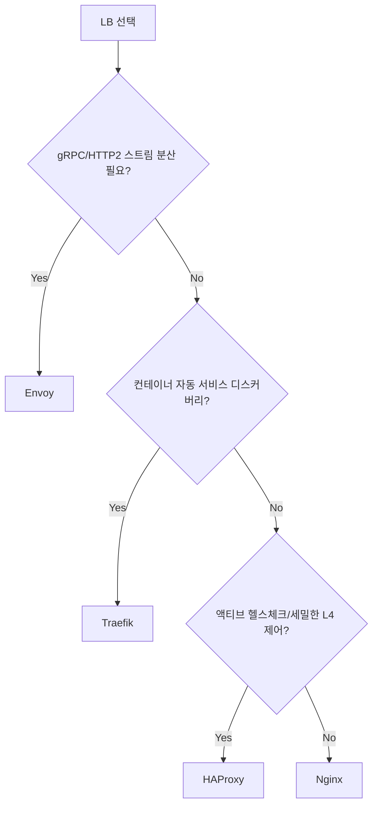

# Nginx (Load Balancer)

이 문서는 Nginx를 웹서버가 아니라 로드밸런서로 쓰는 관점만 다룬다. 정적 파일 서빙, location 매칭, 캐시 같은 웹서버 기능은 `WebServer/Nginx` 쪽에 따로 정리돼 있다. 여기서는 앞단에 Nginx를 세워 뒤쪽 여러 서버로 트래픽을 분산하는 상황, 그리고 그 과정에서 겪는 문제들을 본다.

## 왜 Nginx를 LB로 쓰는가

전용 LB가 필요하면 보통 HAProxy나 Envoy를 먼저 떠올린다. 그런데도 Nginx가 LB 자리에 앉는 경우가 많은 건, 이미 Nginx를 리버스 프록시로 굴리고 있어서 그 설정에 `upstream` 블록 하나 더 얹으면 분산이 끝나기 때문이다. 새 컴포넌트를 도입하지 않고 운영 도구를 그대로 쓸 수 있다는 게 현실에서 제일 큰 이유다.

한계도 분명하다. 오픈소스 Nginx는 액티브 헬스체크가 없고(상용 Nginx Plus에만 있다), L4 분산은 `stream` 모듈을 따로 컴파일/설정해야 하고, gRPC 같은 HTTP/2 멀티플렉싱 트래픽을 스트림 단위로 쪼개 분산하지 못한다. 이 세 가지에 걸리면 Envoy나 HAProxy를 봐야 한다.

## L7 분산: http 컨텍스트의 upstream

가장 흔한 형태다. `http` 블록 안에서 `upstream`으로 백엔드 묶음을 정의하고 `proxy_pass`로 넘긴다.

```nginx
http {
    upstream backend {
        server 10.0.1.10:8080 weight=3;
        server 10.0.1.11:8080;
        server 10.0.1.12:8080 backup;   # 평소엔 안 쓰고, 위 서버가 다 죽으면 투입
    }

    server {
        listen 80;
        location / {
            proxy_pass http://backend;
            proxy_set_header Host $host;
            proxy_set_header X-Real-IP $remote_addr;
            proxy_set_header X-Forwarded-For $proxy_add_x_forwarded_for;
            proxy_set_header X-Forwarded-Proto $scheme;
        }
    }
}
```

`weight=3`은 라운드로빈에서 그 서버에 3배 더 보낸다는 뜻이다. 스펙이 다른 서버를 섞어 쓸 때 쓴다. `backup`은 메인이 전부 빠졌을 때만 받는 예비 서버다.

`X-Forwarded-For`를 빼먹으면 백엔드 로그에 전부 LB의 IP만 찍힌다. 나중에 특정 클라이언트 추적할 때 곤란해지니 LB를 세우는 순간 같이 넣어야 한다.

### 분산 알고리즘

기본은 라운드로빈이고, `upstream` 블록 안에 지시어 한 줄로 바꾼다.

```nginx
upstream backend {
    least_conn;              # 활성 커넥션이 가장 적은 서버로
    server 10.0.1.10:8080;
    server 10.0.1.11:8080;
}
```

- **round-robin (기본)**: 순서대로 돌린다. 요청 처리 시간이 균일할 때 무난하다.
- **least_conn**: 현재 연결 수가 가장 적은 서버로 보낸다. 요청별 처리 시간 편차가 클 때(긴 다운로드, 느린 쿼리가 섞일 때) 라운드로빈보다 쏠림이 덜하다.
- **ip_hash**: 클라이언트 IP를 해시해서 같은 IP는 항상 같은 서버로 보낸다. 세션을 서버 메모리에 들고 있는 레거시 앱에서 sticky 용도로 쓴다. 단점은 NAT 뒤의 수많은 클라이언트가 하나의 IP로 묶여 들어오면 그 서버만 과부하가 걸린다는 점이다.

`hash $request_uri consistent;`처럼 키를 직접 지정하는 방식도 있다. `consistent`를 붙이면 컨시스턴트 해싱이 적용돼서 서버를 한 대 추가/제거해도 키 재배치가 전체가 아니라 일부만 일어난다. 캐시 서버 앞단처럼 키 안정성이 중요한 곳에서 쓴다.

알고리즘을 고를 때 한 가지 주의할 게 있다. `least_conn`이나 `ip_hash`는 worker 프로세스 단위로 상태를 관리한다. worker가 4개면 각 worker가 자기 기준으로 분산하기 때문에 전역으로 완벽히 균등하지는 않다. 트래픽이 많으면 통계적으로 고르게 퍼지지만, 저트래픽에서 분산이 묘하게 치우쳐 보이는 건 이 때문인 경우가 있다.

## L4 분산: stream 모듈

DB, Redis, gRPC, 임의의 TCP/UDP를 분산하려면 `http` 블록이 아니라 `stream` 블록을 쓴다. `stream`은 별도 모듈이라, `nginx -V`로 `--with-stream`이 들어가 있는지 먼저 확인해야 한다. 패키지로 설치한 경우 보통 `dynamic module`로 빠져 있어서 `load_module`을 켜야 할 수도 있다.

```nginx
stream {
    upstream db_read {
        least_conn;
        server 10.0.2.10:5432 max_fails=3 fail_timeout=10s;
        server 10.0.2.11:5432 max_fails=3 fail_timeout=10s;
    }

    server {
        listen 5432;
        proxy_pass db_read;
        proxy_connect_timeout 3s;
        proxy_timeout 30s;          # 양방향 무통신 타임아웃
    }
}
```

`stream` 블록은 `http`와 완전히 별개의 최상위 컨텍스트다. `nginx.conf` 최상단에 `http {}`와 나란히 둔다. `http` 안에 넣으면 설정이 먹지 않는다.

L4는 패킷 페이로드를 안 본다. 그래서 PostgreSQL이든 Redis든 프로토콜을 몰라도 그냥 TCP 바이트를 흘려보낸다. 대신 "이 서버가 실제로 쿼리에 응답하는지"는 모르고, TCP 핸드셰이크가 되는지만 본다. 헬스체크 한계가 여기서 갈린다.

## 헬스체크: passive vs active

오픈소스 Nginx의 헬스체크는 **passive**가 전부다. 실제 트래픽을 보내보고 실패하면 그 서버를 잠시 뺀다.

```nginx
upstream backend {
    server 10.0.1.10:8080 max_fails=3 fail_timeout=15s;
    server 10.0.1.11:8080 max_fails=3 fail_timeout=15s;
}
```

`max_fails=3 fail_timeout=15s`는 "15초 안에 3번 실패하면 이후 15초 동안 이 서버로 안 보낸다"는 뜻이다. 두 값이 한 쌍으로 동작한다는 걸 헷갈리는 경우가 많다. `fail_timeout`은 실패를 세는 창인 동시에, 빼놓는 기간이기도 하다.

passive 방식의 함정은, 서버를 다시 살릴 때 결국 실제 요청을 한 번 던져봐야 한다는 점이다. 15초가 지나면 Nginx가 다시 그 서버로 요청을 보내는데, 그 서버가 아직 안 살아났으면 그 요청을 받은 운 나쁜 사용자 한 명이 에러를 본다. 죽은 서버를 자동 복구하는 구조에서 간헐적 502가 끊이지 않는 이유가 보통 이거다.

무엇을 실패로 칠지는 `proxy_next_upstream`으로 정한다.

```nginx
location / {
    proxy_pass http://backend;
    proxy_next_upstream error timeout http_502 http_503 http_504;
    proxy_next_upstream_tries 2;
    proxy_next_upstream_timeout 5s;
}
```

기본값엔 `error timeout`만 들어 있어서, 백엔드가 500을 뱉어도 Nginx는 "정상 응답"으로 보고 그대로 클라이언트에 전달한다. 502/503을 다른 서버로 재시도하고 싶으면 위처럼 명시해야 한다. 단, `http_503`을 재시도 대상에 넣을 땐 조심해야 한다. 백엔드가 과부하로 503을 던지는 상황이면, 재시도가 멀쩡한 다른 서버까지 같이 무너뜨리는 연쇄 장애가 날 수 있다.

**active 헬스체크**(주기적으로 `/health`를 찔러보고 죽은 서버를 트래픽 들어오기 전에 미리 빼는 것)는 오픈소스에 없다. Nginx Plus의 `health_check` 지시어가 있어야 한다. 이게 필요하면 HAProxy(기본 제공)나 Envoy를 쓰는 게 맞다. 오픈소스에서 억지로 흉내 내려고 외부 스크립트로 `/health` 찔러서 upstream 설정 파일을 갈아끼우고 reload 하는 식으로 운영하는 곳도 있는데, 관리 부담이 크고 reload 빈도가 높아져서 추천하지 않는다.

## keepalive 커넥션 풀

이게 Nginx LB에서 가장 자주 놓치는 설정이다. 기본 상태로 두면 Nginx는 백엔드로 매 요청마다 새 TCP 커넥션을 맺고 끊는다. 트래픽이 조금만 늘어도 `TIME_WAIT` 소켓이 쌓이고, 포트 고갈로 간헐적 502가 터진다.

```nginx
upstream backend {
    server 10.0.1.10:8080;
    server 10.0.1.11:8080;
    keepalive 32;                  # worker당 유지할 idle 커넥션 수
    keepalive_timeout 60s;
    keepalive_requests 1000;
}

server {
    location / {
        proxy_pass http://backend;
        proxy_http_version 1.1;        # 필수
        proxy_set_header Connection "";  # 필수
    }
}
```

세 줄이 세트로 가야 동작한다. `keepalive`만 켜고 `proxy_http_version 1.1`과 `Connection ""`을 빼먹으면 커넥션이 재사용되지 않는다. HTTP/1.0이 기본이라 매번 닫히고, 클라이언트가 보낸 `Connection: close` 헤더가 그대로 백엔드로 전달돼서 커넥션을 끊어버리기 때문이다. 이 조합 실수로 keepalive를 켜놓고도 효과가 없는 경우를 정말 자주 본다.

`keepalive 32`는 풀 크기 상한이 아니라 "idle 상태로 유지할 커넥션 수"다. 동시 요청이 많으면 그 이상으로 커넥션이 열린다. worker 프로세스 수 × 32만큼 백엔드 입장에서 idle 커넥션이 잡히니, 백엔드의 `max_connections`를 고려해서 잡아야 한다.

## proxy 타임아웃과 버퍼링

타임아웃 세 개를 구분해야 502/504 디버깅이 된다.

```nginx
location / {
    proxy_pass http://backend;
    proxy_connect_timeout 5s;    # 백엔드와 TCP 연결 맺기까지
    proxy_send_timeout 60s;      # 요청을 백엔드로 다 보내기까지
    proxy_read_timeout 60s;      # 백엔드 응답을 기다리는 시간
}
```

- `proxy_connect_timeout` 초과 → **502**. 백엔드가 죽었거나 방화벽에 막혀 연결 자체가 안 될 때.
- `proxy_read_timeout` 초과 → **504**. 연결은 됐는데 응답이 정해진 시간 안에 안 올 때.

`proxy_read_timeout`은 "전체 응답 시간"이 아니라 "두 read 사이의 무통신 시간"이다. 60초로 잡아도 백엔드가 30초마다 데이터를 찔끔씩 보내면 타임아웃이 안 난다. SSE나 스트리밍 응답이 504 없이 잘 흘러가는 게 이 때문이다.

버퍼링은 기본값(`proxy_buffering on`)이 대부분 맞다. Nginx가 백엔드 응답을 버퍼에 먼저 다 받아두고 클라이언트에 천천히 흘려보내서, 느린 클라이언트가 백엔드 커넥션을 오래 붙잡는 걸 막는다. 끄는 건 SSE, 실시간 로그 스트림처럼 응답을 즉시 흘려보내야 하는 경우뿐이다.

```nginx
location /stream {
    proxy_pass http://backend;
    proxy_buffering off;
}
```

버퍼가 작으면 응답 헤더가 클 때 `upstream sent too big header` 에러가 나면서 502가 뜬다. 백엔드가 쿠키나 헤더를 잔뜩 실어 보내는데 502가 나면 `proxy_buffer_size`와 `proxy_buffers`를 키워봐야 한다.

```nginx
proxy_buffer_size 16k;
proxy_buffers 8 16k;
```

## sticky session

세션을 서버 메모리에 들고 있는 앱이면 같은 클라이언트를 같은 서버로 묶어야 한다. 오픈소스에서 쓸 수 있는 방법은 `ip_hash`나 `hash`다.

```nginx
upstream backend {
    ip_hash;
    server 10.0.1.10:8080;
    server 10.0.1.11:8080;
}
```

쿠키 기반 sticky(`sticky cookie ...`)는 Nginx Plus 전용이다. 오픈소스에서 굳이 쿠키 sticky가 필요하면 HAProxy로 가는 게 깔끔하다(HAProxy는 `cookie` 지시어로 기본 지원한다).

다만 sticky 자체를 가능하면 안 쓰는 방향으로 가는 게 낫다. 세션을 Redis 같은 외부 저장소로 빼면 어느 서버로 가든 상관없어지고, 배포할 때 특정 서버에 묶인 사용자 세션이 끊기는 문제도 사라진다. sticky는 레거시를 당장 못 고칠 때의 임시방편으로 보는 게 맞다.

## TLS termination vs passthrough

**Termination**: Nginx에서 TLS를 풀고 백엔드로는 평문(또는 내부망 HTTP)으로 보낸다. 인증서 관리가 LB 한 곳에 모이고, L7 라우팅·헤더 조작·캐시가 다 가능하다. 대부분 이 방식을 쓴다.

```nginx
server {
    listen 443 ssl;
    ssl_certificate     /etc/nginx/certs/fullchain.pem;
    ssl_certificate_key /etc/nginx/certs/privkey.pem;
    location / {
        proxy_pass http://backend;   # 백엔드는 평문 HTTP
    }
}
```

**Passthrough**: TLS를 풀지 않고 암호화된 바이트를 그대로 백엔드까지 흘려보낸다. `stream` 모듈로 한다. 백엔드가 직접 TLS를 끝내야 하는 경우(end-to-end 암호화 요구, 또는 클라이언트 인증서를 백엔드가 직접 검증해야 하는 경우)에 쓴다.

```nginx
stream {
    upstream https_backend {
        server 10.0.1.10:443;
        server 10.0.1.11:443;
    }
    server {
        listen 443;
        proxy_pass https_backend;
        ssl_preread on;   # SNI를 보고 라우팅하되, 복호화는 안 함
    }
}
```

`ssl_preread on`을 켜면 TLS ClientHello의 SNI(`$ssl_preread_server_name`)를 읽어서, 복호화 없이 도메인별로 다른 upstream으로 보낼 수 있다. SNI 기반 L4 라우팅이 필요할 때 쓰는 방법이다. passthrough는 Nginx가 평문을 못 보니 L7 기능(경로 라우팅, 헤더 추가, X-Forwarded-For)은 전부 포기해야 한다는 걸 알고 선택해야 한다.

## reload 무중단 처리

설정을 바꾸고 `nginx -s reload`(또는 `systemctl reload nginx`)를 하면 master 프로세스가 새 설정으로 worker를 새로 띄우고, 기존 worker는 처리 중인 요청을 끝낸 뒤 graceful하게 종료한다. 이 과정에서 들어오는 커넥션이 끊기지 않는다. 그래서 upstream 멤버 추가/제거, 타임아웃 조정 같은 건 reload로 무중단 적용된다.

reload 전에 반드시 `nginx -t`로 문법을 먼저 검사해야 한다. 잘못된 설정으로 reload 하면 master가 새 worker를 못 띄우고, 운 나쁘면 기존 설정만 살아 있는 어정쩡한 상태가 된다.

reload에도 끊기는 경우가 있다.

- **장기 커넥션**: WebSocket이나 SSE처럼 오래 붙어 있는 커넥션은 기존 worker가 그 커넥션이 끝날 때까지 종료를 못 한다. `worker_shutdown_timeout`(기본 무제한에 가까움)을 짧게 잡으면 오래된 worker가 강제 종료되면서 그 커넥션들이 끊긴다. 길게 잡으면 옛 worker가 오래 살아남아 메모리에 쌓인다. 트레이드오프를 보고 정해야 한다.
- **잦은 reload + 장기 커넥션**: active 헬스체크를 reload로 흉내 내는 구조에서 reload가 분 단위로 일어나면, 종료 대기 중인 옛 worker가 계속 누적된다. `nginx -T`로 떠 있는 worker 수가 비정상적으로 많으면 이 패턴을 의심한다.

upstream을 자주 바꿔야 하는 환경(오토스케일링, 컨테이너)이라면 reload로 매번 갈아끼우는 것보다, DNS 기반 동적 resolve나 Consul-template 같은 도구로 관리하거나, 아예 동적 upstream을 지원하는 Envoy/Traefik으로 가는 게 운영이 편하다.

## 다른 LB와 비교해 언제 무엇을 고를까



- **Nginx**: 이미 Nginx로 리버스 프록시/웹서버를 쓰고 있고, L7 분산에 passive 헬스체크로 충분하면 가장 손이 덜 간다. 정적 서빙·캐시·LB를 한 프로세스로 묶을 수 있는 게 강점.
- **HAProxy**: 순수 LB로는 가장 성숙하다. 액티브 헬스체크, 쿠키 sticky, 세밀한 L4 튜닝, 풍부한 통계 페이지가 기본 제공이다. TCP/HTTP 분산만 전문으로 할 거면 첫 후보.
- **Envoy**: gRPC/HTTP2를 스트림 단위로 분산해야 하거나, 서비스 메시(Istio 등)를 쓰거나, xDS API로 런타임 동적 설정이 필요할 때. 설정이 복잡한 대신 표현력이 가장 높다.
- **Traefik**: 도커/쿠버네티스 라벨이나 어노테이션을 보고 라우팅을 자동 구성한다. 컨테이너가 뜨고 지는 환경에서 설정을 직접 안 건드려도 되는 게 강점. 같은 디렉토리의 [Traefik 문서](Traefik.md)와 [Envoy 문서](Envoy.md), [HAProxy 문서](HA_Proxy.md) 참고.

정리하면, "새 도구 도입을 피하고 싶다"가 Nginx를 LB로 쓰는 거의 유일한 결정적 이유다. LB가 시스템의 핵심 컴포넌트가 되는 순간부터는 HAProxy나 Envoy 쪽이 운영 기능에서 앞선다.

## 502/504 디버깅 실전

LB로 Nginx를 쓰면 결국 502와 504를 마주하게 된다. 둘을 구분하는 게 디버깅의 시작이다.

**502 Bad Gateway** — Nginx가 백엔드에 연결했거나 응답을 읽으려다 실패했다.

먼저 `error.log`를 본다. 메시지가 원인을 거의 그대로 말해준다.

```
# 백엔드가 죽었거나 포트가 안 열림
connect() failed (111: Connection refused) while connecting to upstream

# 백엔드가 커넥션을 먼저 끊음 (keepalive 설정 실수가 흔한 원인)
upstream prematurely closed connection while reading response header

# 응답 헤더가 버퍼보다 큼
upstream sent too big header while reading response header
```

- `Connection refused`: 백엔드 프로세스가 안 떠 있거나, 보안그룹/방화벽이 막거나, 포트가 틀렸다. LB에서 백엔드로 직접 `curl`이나 `nc`로 찔러보면 바로 갈린다.
- `prematurely closed connection`: 백엔드의 keepalive 타임아웃이 Nginx보다 짧을 때 잘 난다. 백엔드가 idle 커넥션을 먼저 닫았는데 Nginx가 그 커넥션으로 요청을 보내서 터지는 경합이다. 백엔드의 keepalive timeout을 Nginx의 `keepalive_timeout`보다 길게 잡으면 줄어든다. Node.js(기본 5초)나 일부 WAS 앞에 Nginx를 두면 자주 만난다.
- `too big header`: 위에서 본 `proxy_buffer_size`를 키운다.

**504 Gateway Timeout** — 연결은 됐는데 백엔드 응답이 `proxy_read_timeout` 안에 안 왔다.

```
upstream timed out (110: Connection timed out) while reading response header
```

이건 거의 항상 백엔드가 느린 거다. Nginx 타임아웃을 늘리는 건 증상만 가리는 거고, 백엔드의 느린 쿼리나 외부 API 호출이 진짜 원인인 경우가 대부분이다. 타임아웃을 늘리기 전에 백엔드 처리 시간을 먼저 재야 한다. 타임아웃을 키우면 느린 요청이 worker와 백엔드 커넥션을 오래 점유해서, 한 엔드포인트가 느려질 때 전체가 같이 느려지는 식으로 번지기도 한다.

응답 시간을 로그로 남기면 502/504 원인 분리가 빨라진다. `log_format`에 upstream 관련 변수를 넣어둔다.

```nginx
log_format upstreamlog '$remote_addr - $status '
    'rt=$request_time uct=$upstream_connect_time '
    'uht=$upstream_header_time urt=$upstream_response_time '
    'upstream=$upstream_addr ustatus=$upstream_status';
```

- `$request_time`: 클라이언트 기준 전체 시간.
- `$upstream_connect_time`: 백엔드 연결까지. 이게 크면 연결 단계 문제(502 쪽).
- `$upstream_response_time`: 백엔드 처리 시간. 이게 크면 백엔드가 느린 것(504 쪽).
- `$upstream_addr`: 어느 백엔드로 갔는지. 특정 서버에서만 에러가 나는지 보려면 필수다. 재시도가 일어나면 여기에 여러 주소가 콤마로 찍힌다.

`$upstream_addr`에 주소가 여러 개 찍히고 `$upstream_status`에 `502, 200`처럼 나오면, 한 서버에서 실패하고 다른 서버로 재시도해서 성공했다는 뜻이다. 클라이언트는 200을 받았어도 백엔드 한 대가 죽어가고 있는 신호이니 그냥 넘기면 안 된다.
