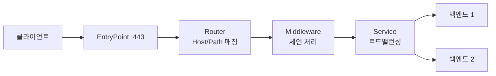

# Traefik

## Traefik를 쓰게 되는 상황

nginx로 리버스 프록시를 구성해 본 사람이라면 컨테이너를 하나 새로 띄울 때마다 `nginx.conf`에 server 블록을 추가하고 `nginx -s reload`를 치는 흐름에 익숙하다. 서비스가 몇 개 안 될 때는 괜찮은데, Docker Compose로 서비스를 수시로 올렸다 내렸다 하거나 오토스케일로 컨테이너 수가 변하면 이 수작업이 금방 부담이 된다. 컨테이너 IP는 재시작할 때마다 바뀌니 정적 설정 파일과는 궁합이 나쁘다.

Traefik는 이 지점을 노린 프록시다. Docker 데몬이나 쿠버네티스 API를 직접 구독해서, 컨테이너가 뜨면 라벨을 읽어 라우팅 규칙을 자동으로 만들고, 컨테이너가 죽으면 규칙을 자동으로 뺀다. 설정 파일을 사람이 고치고 reload하는 과정 자체가 없다. Go로 작성됐고 단일 바이너리로 동작한다.

그래서 Traefik가 빛을 보는 환경은 명확하다. 컨테이너 오케스트레이션 위에서 서비스가 동적으로 바뀌고, HTTPS 인증서까지 자동으로 처리하고 싶은 경우다. 반대로 베어메탈 서버 몇 대에 고정된 백엔드를 물리는 전통적 구성이라면 HAProxy나 nginx가 더 단순하다.

## 정적 설정과 동적 설정의 분리

Traefik 설정을 처음 보면 헷갈리는 게 설정이 두 종류로 나뉜다는 점이다. 이 구분을 모르고 들어가면 "왜 이 설정은 적용되는데 저 설정은 재시작해야 하지?"에서 막힌다.

정적 설정(static configuration)은 Traefik 프로세스가 시작할 때 한 번 읽는 것이다. 어떤 포트를 열지(EntryPoint), 어떤 프로바이더에서 설정을 가져올지(Docker, 파일, 쿠버네티스 등), 인증서 발급은 어떻게 할지 같은 뼈대다. 이걸 바꾸면 Traefik를 재시작해야 한다. `traefik.yml`이나 커맨드라인 플래그, 환경변수로 준다.

동적 설정(dynamic configuration)은 Router, Middleware, Service 같은 실제 라우팅 규칙이다. 이건 런타임에 계속 바뀌어도 되고, 바뀌면 Traefik가 즉시 반영한다. 재시작이 필요 없다. Docker 라벨, 별도 설정 파일, 쿠버네티스 리소스 등에서 온다.

```yaml
# traefik.yml — 정적 설정
entryPoints:
  web:
    address: ":80"
  websecure:
    address: ":443"

providers:
  docker:
    exposedByDefault: false   # 라벨 없는 컨테이너는 노출 안 함
  file:
    directory: /etc/traefik/dynamic
    watch: true               # 파일 변경 감지해서 자동 반영

api:
  dashboard: true

certificatesResolvers:
  myresolver:
    acme:
      email: admin@example.com
      storage: /etc/traefik/acme.json
      httpChallenge:
        entryPoint: web
```

`exposedByDefault: false`는 실무에서 거의 항상 켜 둔다. 기본값(true)으로 두면 Traefik가 보는 모든 컨테이너가 자동으로 라우팅 대상이 돼서, 내부용으로만 띄운 컨테이너가 의도치 않게 외부에 노출되는 사고가 난다. false로 두고 노출할 컨테이너에만 `traefik.enable=true` 라벨을 붙이는 게 안전하다.

## 요청이 흐르는 네 단계: EntryPoint, Router, Middleware, Service

Traefik의 라우팅 모델은 요청이 들어와서 백엔드까지 가는 길을 네 단계로 나눈다. 이 흐름을 머리에 넣어 두면 설정이 한눈에 들어온다.



EntryPoint는 트래픽이 들어오는 입구다. 포트와 프로토콜을 정의한다. 80번은 `web`, 443번은 `websecure`로 이름 붙이는 게 관례다.

Router는 들어온 요청을 규칙(Rule)으로 매칭해서 어느 Service로 보낼지 정한다. `Host(\`api.example.com\`)`, `PathPrefix(\`/v1\`)` 같은 규칙을 쓰고, `&&`나 `||`로 조합한다. 여러 Router가 한 요청에 매칭되면 우선순위(priority)로 결정되는데, 명시하지 않으면 규칙 문자열 길이가 긴 쪽이 이긴다. 이 기본 동작 때문에 의도와 다른 라우터가 잡히는 경우가 있어서, 겹치는 규칙이 있으면 `priority`를 명시적으로 주는 게 낫다.

Middleware는 Router와 Service 사이에서 요청/응답을 가공한다. 인증, rate limit, 헤더 추가, 경로 재작성, 리다이렉트 같은 게 전부 여기 들어간다. 여러 개를 순서대로 엮을 수 있다.

Service는 실제 백엔드 묶음이다. 여기서 로드밸런싱이 일어난다. 헬스체크, 스티키 세션, 가중치도 Service에 붙는다.

## Docker 라벨로 라우팅 정의하기

Docker 프로바이더를 쓰면 라우팅을 컨테이너 라벨로 선언한다. 별도 설정 파일 없이 `docker-compose.yml`에 다 넣을 수 있다.

```yaml
services:
  traefik:
    image: traefik:v3.1
    ports:
      - "80:80"
      - "443:443"
      - "8080:8080"   # 대시보드
    volumes:
      - /var/run/docker.sock:/var/run/docker.sock:ro
      - ./traefik.yml:/etc/traefik/traefik.yml:ro
      - ./acme.json:/etc/traefik/acme.json

  api:
    image: myapp/api:latest
    labels:
      - "traefik.enable=true"
      - "traefik.http.routers.api.rule=Host(`api.example.com`)"
      - "traefik.http.routers.api.entrypoints=websecure"
      - "traefik.http.routers.api.tls.certresolver=myresolver"
      - "traefik.http.services.api.loadbalancer.server.port=8000"
```

라벨 네이밍이 길어서 처음엔 외워지지 않는다. 구조는 `traefik.http.<라우터|미들웨어|서비스>.<이름>.<속성>` 형태로 일정하다. 위 예시에서 라우터 이름과 서비스 이름을 둘 다 `api`로 줬는데, 라우터에 서비스를 명시하지 않으면 Traefik가 같은 이름의 서비스를 자동으로 연결한다.

`loadbalancer.server.port`는 자주 실수하는 부분이다. 여기 적는 포트는 컨테이너가 내부에서 리슨하는 포트지, 호스트에 매핑한 포트가 아니다. Traefik는 같은 Docker 네트워크 안에서 컨테이너 IP로 직접 붙기 때문에 호스트 포트 매핑(`ports:`)이 필요 없다. 오히려 백엔드 컨테이너에 `ports:`로 호스트 포트를 열어 두면 Traefik를 우회하는 통로가 생기니 빼는 게 맞다.

`docker.sock`을 읽기 전용으로라도 마운트하는 건 보안상 주의해야 한다. 소켓 접근 권한은 사실상 호스트 루트 권한과 같다. Traefik 컨테이너가 뚫리면 호스트 전체가 위험해진다. 운영 환경에서는 `docker-socket-proxy` 같은 걸 앞에 둬서 Traefik가 읽기만 하는 일부 API에만 접근하도록 제한하는 구성을 쓰기도 한다.

## Let's Encrypt 자동 인증서

Traefik를 선택하는 큰 이유 하나가 인증서 자동화다. `certificatesResolvers`를 정적 설정에 정의하고, 라우터에 `tls.certresolver`를 붙이면 Traefik가 알아서 ACME 프로토콜로 인증서를 발급받고 만료 전에 갱신한다.

챌린지 방식은 세 가지다.

- HTTP-01: 80번 포트로 들어오는 검증 요청에 응답한다. 가장 단순하지만 80번 포트가 외부에서 접근 가능해야 한다.
- TLS-ALPN-01: 443번 포트에서 TLS 핸드셰이크 중에 검증한다. 80번을 못 여는 환경에 쓴다.
- DNS-01: DNS 레코드에 TXT를 심어 검증한다. 와일드카드 인증서(`*.example.com`)를 받으려면 이 방식이어야 한다. DNS 프로바이더 API 키가 필요하다.

```yaml
certificatesResolvers:
  myresolver:
    acme:
      email: admin@example.com
      storage: /etc/traefik/acme.json
      dnsChallenge:
        provider: cloudflare
        resolvers:
          - "1.1.1.1:53"
```

실무에서 가장 많이 밟는 지뢰가 `acme.json` 파일 권한이다. Traefik는 이 파일에 발급받은 인증서와 개인키를 저장하는데, 권한이 `600`이 아니면 보안 문제로 아예 읽기를 거부하고 인증서 발급이 안 된다. 컨테이너로 마운트할 때 빈 파일을 만들고 `chmod 600 acme.json`을 해 둬야 한다.

또 하나, 테스트할 때 Let's Encrypt 운영 엔드포인트로 막 발급 요청을 날리면 rate limit에 걸린다. 같은 도메인에 일주일 발급 횟수 제한이 있어서, 설정을 시행착오로 맞추는 동안 한도를 다 써 버리면 일주일을 기다려야 한다. 테스트는 반드시 스테이징 CA(`caServer`를 staging 주소로)로 먼저 하고, 다 맞춘 다음에 운영으로 바꾼다. CA를 바꿀 때는 `acme.json`을 비우거나 새 storage를 써야 스테이징 인증서가 운영에 섞이지 않는다.

## 미들웨어 체이닝

미들웨어는 순서대로 엮이고, 순서가 결과를 바꾼다. 인증을 통과한 뒤에 rate limit을 걸지, 그 반대로 할지에 따라 동작이 달라진다.

```yaml
# 동적 설정 파일 — /etc/traefik/dynamic/middlewares.yml
http:
  middlewares:
    api-ratelimit:
      rateLimit:
        average: 100      # 초당 평균 100 요청
        burst: 50         # 순간 버스트 50까지 허용
    api-auth:
      basicAuth:
        users:
          - "admin:$apr1$xyz..."   # htpasswd로 생성한 해시
    secure-headers:
      headers:
        stsSeconds: 31536000
        stsIncludeSubdomains: true
        contentTypeNosniff: true
        frameDeny: true
    strip-prefix:
      stripPrefix:
        prefixes:
          - "/v1"
```

라우터에 미들웨어를 체인으로 붙인다. Docker 라벨이면 이렇게 쓴다.

```yaml
labels:
  - "traefik.http.routers.api.middlewares=api-auth@file,api-ratelimit@file,secure-headers@file"
```

`@file`은 이 미들웨어가 파일 프로바이더에서 정의됐다는 표시다. 프로바이더가 다르면(`@docker`, `@kubernetescrd` 등) 이름 뒤에 출처를 붙여야 참조가 된다. 같은 프로바이더 안에서 참조할 때는 생략 가능하지만, Docker 라벨에서 파일 프로바이더 미들웨어를 가져다 쓸 때처럼 출처가 다르면 반드시 명시해야 한다. 이걸 빠뜨려서 "미들웨어를 못 찾는다"는 에러를 보는 경우가 흔하다.

`stripPrefix`는 경로 재작성에 자주 쓴다. 외부에서는 `/v1/users`로 들어오지만 백엔드는 `/users`만 아는 경우, prefix를 떼고 넘긴다. 다만 백엔드가 리다이렉트나 절대경로 링크를 생성하는 앱이라면 prefix가 사라져서 링크가 깨지는 일이 있으니, 그런 경우엔 백엔드에 base path를 알려 주는 방식과 같이 봐야 한다.

rate limit은 Traefik 인스턴스 단위로 카운트된다. Traefik를 여러 대로 띄워 수평 확장하면 각 인스턴스가 따로 세니 전체 한도는 인스턴스 수만큼 곱해진다. 정확한 전역 rate limit이 필요하면 Traefik 레벨이 아니라 별도 공유 저장소 기반 처리를 백엔드 쪽에서 해야 한다.

## Envoy, HAProxy와 어떻게 다른가

세 프록시는 겨냥하는 지점이 다르다.

HAProxy는 로드밸런서 전용으로 만들어졌고, LB 기능의 밀도와 성능이 가장 높다. 설정은 정적 파일 중심이고, 컨테이너 환경의 자동 디스커버리는 기본 기능이 아니라 외부 도구(DNS 기반, 별도 컨트롤러)를 붙여야 한다. 백엔드가 고정돼 있고 처리량이 중요한 환경에서 강점이 분명하다.

Envoy는 L4/L7을 한 바이너리에서 처리하고, gRPC 멀티플렉싱 분산과 컨트롤플레인이 데이터플레인을 동적으로 조종하는 구조(xDS API)가 핵심이다. 서비스 메시의 사이드카로 쓰는 게 대표 용례다. 설정이 가장 복잡하고 메모리 사용량도 가장 무겁다.

Traefik는 컨테이너 오케스트레이션과의 통합, 자동 서비스 디스커버리, 인증서 자동화에 무게를 둔다. 설정 진입 장벽이 낮고 대시보드가 기본 제공된다. 대신 극한의 처리량이나 정밀한 LB 튜닝에서는 HAProxy에 밀리고, gRPC 스트림 단위 분산이나 메시 데이터플레인 같은 영역은 Envoy의 몫이다.

선택 기준을 거칠게 정리하면 이렇다. Docker Compose나 쿠버네티스 위에서 서비스가 자주 바뀌고 HTTPS까지 자동으로 처리하고 싶으면 Traefik. 고정 백엔드에 최대 처리량과 세밀한 제어가 필요하면 HAProxy. 서비스 메시나 gRPC 트래픽 분산이 핵심이면 Envoy. 셋을 같이 쓰는 구성도 흔하다. 엣지에 Traefik를 두고 내부 메시는 Envoy로 가는 식이다.

## 대시보드와 트러블슈팅

Traefik는 라우터, 서비스, 미들웨어가 현재 어떻게 잡혀 있는지 보여 주는 대시보드를 기본 제공한다. `api.dashboard=true`로 켜고 8080 포트나 `/dashboard/` 경로로 접근한다. 동적으로 라우팅이 바뀌는 환경에서 "내 컨테이너 라벨이 제대로 인식됐나"를 눈으로 확인할 수 있어서 디버깅에 쓸모가 많다.

대시보드는 인증 없이 열어 두면 내부 구성이 다 노출되니, 운영에서는 BasicAuth 미들웨어를 붙이거나 내부망에서만 접근하도록 막아야 한다.

가장 흔한 트러블슈팅 패턴 몇 가지를 정리한다.

라우터가 안 잡힐 때는 먼저 대시보드에서 해당 라우터가 보이는지 확인한다. 안 보이면 `traefik.enable=true`가 빠졌거나, `exposedByDefault: false`인데 enable 라벨을 안 붙인 경우다. 라우터는 보이는데 503이 뜨면 Service가 백엔드를 못 찾는 것이다. `loadbalancer.server.port`가 컨테이너 내부 리슨 포트와 맞는지, Traefik와 백엔드가 같은 Docker 네트워크에 있는지 본다. 별도 네트워크에 있으면 Traefik가 컨테이너에 닿지 못한다.

404가 뜨면 어떤 라우터에도 매칭되지 않은 것이다. Host 규칙의 도메인 철자, `PathPrefix` 경로, EntryPoint 지정이 맞는지 확인한다. HTTP로 접속했는데 라우터가 `websecure` EntryPoint에만 걸려 있으면 80번으로는 매칭이 안 된다.

로그 레벨을 `DEBUG`로 올리면 어떤 프로바이더에서 어떤 설정을 읽었는지, 라우터 매칭이 어떻게 일어나는지가 다 찍힌다. 라벨 인식 문제는 대부분 이 로그에서 원인이 보인다. 운영에서는 로그가 과하니 평소엔 `INFO`로 두고 문제 추적할 때만 올린다.

```yaml
# traefik.yml
log:
  level: INFO        # 디버깅 시 DEBUG
accessLog: {}        # 액세스 로그 활성화
```

액세스 로그를 켜 두면 어떤 요청이 어느 라우터/서비스로 갔고 응답 코드가 뭐였는지 남는다. 동적 환경에서는 설정 파일만 봐서는 실제 라우팅 결과를 알기 어려우니, 액세스 로그와 대시보드를 같이 보면서 추적하는 게 빠르다.

## 운영 중 설정 reload

Traefik의 동적 설정은 reload라는 개념 자체가 거의 없다. 파일 프로바이더는 `watch: true`면 파일이 바뀌는 순간 감지해서 반영하고, Docker 프로바이더는 컨테이너 이벤트를 실시간으로 구독한다. 사람이 명령을 내려 reload할 일이 없다는 게 nginx/HAProxy와 가장 다른 운영 경험이다.

다만 정적 설정(EntryPoint 추가, 프로바이더 변경, 인증서 리졸버 변경)은 프로세스 재시작이 필요하다. 동적 설정으로 해결될 일을 정적 설정에서 만지려다 "왜 재시작해야 하지"로 막히는 경우가 있는데, 라우팅 규칙과 미들웨어는 전부 동적 영역이라는 점을 기억하면 헷갈리지 않는다.

파일 프로바이더로 동적 설정을 줄 때 주의할 점은, 파일을 저장하는 순간 부분적으로 쓰여진 불완전한 YAML을 Traefik가 읽어서 일시적으로 설정이 깨질 수 있다는 것이다. 에디터가 파일을 직접 덮어쓰는 대신 임시 파일에 쓰고 atomic하게 rename하는 방식이면 이 문제가 없다. 자동화 스크립트로 동적 설정 파일을 갱신한다면 `mv`로 교체하도록 짜는 게 안전하다.
