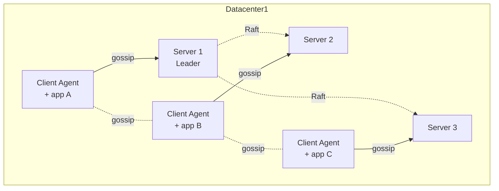

# Consul

## Consul을 쓰게 되는 상황

서비스가 두세 개일 땐 nginx 설정 파일에 upstream을 손으로 박아두면 그만이다. 인스턴스 IP가 바뀌면 nginx 설정 고치고 reload 하면 끝난다. 그런데 서비스가 20개를 넘고 오토스케일링이 붙으면서 인스턴스가 시간 단위로 뜨고 죽기 시작하면 더 이상 손으로 못 따라간다. 누군가 죽은 인스턴스의 IP를 settings에 넣어둔 채로 배포했다가 5xx가 쏟아진다.

이 문제를 정면으로 푸는 도구가 Consul이다. 서비스가 뜨면 자기 정보를 등록하고, 죽으면 health check가 떨어뜨려준다. 클라이언트는 DNS나 HTTP로 "user-service 지금 살아있는 인스턴스 알려줘"라고 물으면 답을 받는다. 거기에 KV store가 붙어있어서 설정값을 중앙에서 관리할 수 있고, Connect라는 모듈이 mTLS까지 자동으로 깔아준다.

처음 Consul을 운영했을 때 가장 헷갈렸던 건 "그냥 서비스 디스커버리만 하면 되는데 왜 이렇게 큰가"였다. 알고 보면 Consul은 서비스 디스커버리, KV store, 헬스 체크, 서비스 메시까지 한 통에 묶인 제품이라 처음 보면 학습 곡선이 가파르다. 필요한 기능만 골라 쓰는 게 정답이다.

## Agent와 Server, 기본 아키텍처

Consul은 모든 노드에 agent를 띄운다. agent는 두 가지 모드로 돌아간다.

- **Server agent**: Raft 합의 알고리즘으로 상태를 복제하는 노드. 보통 3대 또는 5대를 둔다. 실제 데이터(서비스 카탈로그, KV, ACL 토큰)는 server에만 저장된다.
- **Client agent**: 각 애플리케이션 노드에 한 대씩 띄우는 경량 agent. 자기 노드에서 실행되는 서비스의 등록과 health check를 담당하고, server와 통신을 중계한다.

처음 보면 "왜 client agent가 필요한가, 그냥 server에 직접 API 쏘면 되잖아"라고 생각하기 쉽다. 그런데 client agent가 있어야 health check가 로컬에서 돌고, 결과만 server로 보낸다. 만약 client agent 없이 server가 직접 모든 노드의 health check를 하면 server에 부하가 집중되고 네트워크 트래픽도 폭증한다. Consul이 수만 노드까지 견디는 비결이 이 분산 구조다.



### Server 클러스터 크기

3대로 시작한다. 5대까지는 의미가 있고 7대를 넘어가면 Raft 합의 오버헤드가 커져서 오히려 느려진다. 2대는 절대 안 된다. quorum이 2라서 한 대만 죽으면 클러스터 전체가 쓰기 불가 상태가 된다. 5대는 두 대가 죽어도 견딘다. 데이터센터별로 server를 따로 둬야 하고, 데이터센터 간 통신은 WAN gossip으로 묶는다.

## Gossip Protocol의 동작

Consul의 노드 간 멤버십 관리는 Serf 라이브러리 기반의 gossip protocol로 돌아간다. 핵심은 "모든 노드가 모든 노드에 대해 알 필요는 없다, 무작위로 몇 명에게 전파하면 결국 전체에 퍼진다"라는 SWIM 알고리즘이다.

gossip은 두 가지 채널로 나뉜다.

- **LAN gossip**: 같은 데이터센터 내 모든 agent가 참여. 노드 join/leave, 장애 감지를 빠르게 전파.
- **WAN gossip**: 데이터센터 간 server끼리만 참여. 데이터센터를 가로지르는 정보 전파.

운영하면서 마주치는 첫 번째 함정이 gossip 트래픽이다. 노드가 100대 정도면 별 문제 없다. 그런데 1000대를 넘기면 갑자기 네트워크 트래픽 그래프에 의미 모를 봉우리가 보이기 시작한다. gossip은 노드 수에 비례하지 않고 `log(N)`에 비례한다고는 하지만, 실제로는 각 노드가 초당 1번씩 다른 노드에 ping을 날리고 그게 전체로 전파되면서 누적된다.

해결책은 보통 `gossip_lan` 파라미터를 튜닝하는 것이다.

```hcl
performance {
  raft_multiplier = 1
}

# gossip 간격을 늘려서 트래픽 줄이기
gossip_lan {
  gossip_interval = "500ms"   # 기본 200ms
  probe_interval = "2s"        # 기본 1s
  probe_timeout = "1s"         # 기본 500ms
  suspicion_mult = 4           # 기본 3
}
```

`gossip_interval`을 키우면 트래픽은 줄지만 장애 감지가 느려진다. `probe_timeout`이 너무 짧으면 네트워크가 잠깐 출렁일 때 멀쩡한 노드가 dead로 찍힌다. 운영하면서 false positive가 자주 보이면 이 값을 늘려야 한다.

### 노드가 자꾸 죽었다 살아나는 현상

gossip에서 가장 자주 신고되는 증상이 "노드가 죽었다고 떴다가 곧 다시 살아난다"이다. flapping이라고 부른다. 원인은 거의 항상 둘 중 하나다.

- 노드의 CPU가 100% 찍혀서 gossip ping 응답이 느려짐
- 네트워크 패킷 손실(특히 클라우드의 cross-AZ 트래픽)

CPU 문제면 agent에 cgroup으로 CPU를 보장해주고, 네트워크 문제면 `probe_timeout`을 늘린다. flapping이 해결되지 않으면 서비스 카탈로그가 계속 흔들려서 클라이언트가 잘못된 IP를 받는다.

## 서비스 등록과 Health Check

서비스 등록은 두 가지 방식이 있다. 정적 설정 파일로 등록하거나, agent의 HTTP API로 동적 등록하거나.

```json
{
  "service": {
    "name": "user-service",
    "tags": ["v2", "prod"],
    "port": 8080,
    "check": {
      "id": "user-service-http",
      "name": "HTTP API on port 8080",
      "http": "http://localhost:8080/health",
      "method": "GET",
      "interval": "10s",
      "timeout": "1s",
      "deregister_critical_service_after": "1m"
    }
  }
}
```

`deregister_critical_service_after`는 운영에서 반드시 설정한다. 이게 없으면 죽은 서비스가 catalog에 계속 critical 상태로 남는다. 1분이면 충분히 안전하다.

### Health Check 종류

| 타입 | 동작 | 쓰는 시점 |
|---|---|---|
| HTTP | URL에 GET 요청, 2xx면 passing, 4xx면 warning, 그 외 critical | 웹 서비스 표준 |
| TCP | 지정 포트에 TCP connect 시도 | HTTP 엔드포인트가 없는 DB, Redis |
| Script | 임의 명령을 실행하고 exit code로 판단 | 복잡한 검사가 필요할 때 |
| gRPC | gRPC health checking protocol로 검사 | gRPC 서비스 |
| TTL | 서비스가 주기적으로 "나 살아있다"를 신고 | 배치 작업이나 외부 ping 불가능 환경 |
| Docker | 컨테이너 안에서 명령 실행 | Docker 환경 |

script check는 보안 이슈로 기본 비활성화다. `enable_script_checks = true`를 명시적으로 켜야 동작한다. 그것도 외부 입력을 받는 환경에서는 위험하므로 `enable_local_script_checks`로 로컬 정의된 것만 허용하는 게 안전하다.

### Health Check 짤 때 흔히 하는 실수

처음 health check를 짜면 `/health` 엔드포인트에서 DB 연결까지 다 확인하고 싶어진다. 그러다 DB가 잠깐 끊기면 모든 서비스 인스턴스가 동시에 critical로 떨어진다. 그러면 클라이언트가 받을 인스턴스가 0개가 되고, 트래픽이 무방비로 끊긴다.

운영 노하우는 health check를 두 단계로 나누는 것이다. liveness check는 프로세스가 살아있는지만 보고, readiness check는 외부 의존성까지 확인한다. Consul에 등록하는 건 liveness 쪽이다. 외부 의존성이 잠시 끊어졌다고 인스턴스를 죽이지 않는다. 그래야 의존성이 돌아왔을 때 빠르게 회복된다.

```bash
# 등록된 서비스 조회
curl http://localhost:8500/v1/catalog/service/user-service

# 살아있는 인스턴스만 조회
curl http://localhost:8500/v1/health/service/user-service?passing
```

## DNS 인터페이스로 서비스 조회

Consul이 매력적인 이유 중 하나가 DNS 인터페이스다. 애플리케이션 코드를 전혀 바꾸지 않고도 서비스 디스커버리를 적용할 수 있다.

```bash
# 기본 포트 8600
dig @127.0.0.1 -p 8600 user-service.service.consul

# 태그로 필터링 (v2 태그가 붙은 인스턴스만)
dig @127.0.0.1 -p 8600 v2.user-service.service.consul

# SRV 레코드로 포트까지 조회
dig @127.0.0.1 -p 8600 user-service.service.consul SRV
```

DNS로 받은 결과는 랜덤하게 섞여있다. 클라이언트가 첫 번째 결과만 쓰면 자연스럽게 로드밸런싱이 된다. 다만 DNS 응답은 기본 TTL이 0이라 클라이언트가 캐싱하지 않게 설계되어 있는데, 일부 OS의 resolver가 0초 TTL을 무시하고 자체 캐싱을 한다. JVM이 특히 악명 높다. `networkaddress.cache.ttl=0`을 강제로 박아두지 않으면 한 번 받은 IP를 영원히 들고 있는다.

### DNS 포워딩

실제 운영에서는 OS의 resolver가 도메인 `.consul`로 끝나는 쿼리를 Consul agent로 넘기게 설정한다. systemd-resolved나 dnsmasq를 앞에 둔다.

```bash
# dnsmasq 설정
server=/consul/127.0.0.1#8600
```

이걸 하지 않으면 애플리케이션마다 Consul 주소를 따로 박아야 해서 표준화가 깨진다.

## KV Store

KV store는 단순한 키-값 저장소처럼 보이지만 실전에서는 설정 중앙화에 자주 쓰인다.

```bash
# 값 저장
consul kv put config/myapp/db_host postgres.internal

# 값 조회
consul kv get config/myapp/db_host

# JSON 값 저장
consul kv put config/myapp/limits @limits.json

# prefix로 한 번에 조회
consul kv get -recurse config/myapp/
```

값은 최대 512KB까지 저장된다. 더 큰 값을 넣으려고 하면 거부된다. 큰 설정 파일을 통째로 넣고 싶을 때 자주 부딪힌다. 이 경우 S3나 Git에 두고 KV에는 포인터만 둔다.

KV는 watch 기능이 있어서 값이 바뀌면 콜백을 받을 수 있다. consul-template이 이 기능을 이용해서 KV 값이 바뀌면 설정 파일을 다시 렌더링하고 프로세스를 reload한다.

```bash
# consul-template 예시
consul-template -template "/etc/nginx/nginx.conf.ctmpl:/etc/nginx/nginx.conf:nginx -s reload"
```

### Atomic 연산

KV에는 CAS(Check-And-Set)가 있어서 여러 클라이언트가 동시에 같은 키를 수정할 때 race condition을 피할 수 있다.

```bash
# 현재 값과 ModifyIndex 조회
consul kv get -detailed config/counter

# ModifyIndex가 일치할 때만 업데이트
consul kv put -cas -modify-index=42 config/counter 100
```

이걸 응용하면 분산 락도 만들 수 있다. `acquire`와 `release` 파라미터로 session 기반 락을 구현한다. 다만 락을 KV로 구현할 때 session TTL을 너무 짧게 잡으면 락이 의도치 않게 풀린다. 보통 15초~30초가 안전하다.

## ACL 정책

처음 Consul을 띄우면 모든 API가 인증 없이 열려있다. 개발 환경에서는 편하지만 그대로 프로덕션에 두면 누구나 KV의 모든 값을 읽고 서비스 카탈로그를 조작할 수 있다. ACL을 켜는 게 필수다.

```hcl
acl {
  enabled = true
  default_policy = "deny"
  enable_token_persistence = true
  tokens {
    initial_management = "<bootstrap-token>"
  }
}
```

`default_policy = "deny"`가 핵심이다. allow로 두면 정책에 명시되지 않은 모든 작업이 허용된다. deny로 두고 필요한 권한만 명시적으로 부여한다.

### 정책 작성

```hcl
# user-service-policy.hcl
service "user-service" {
  policy = "write"
}

service_prefix "" {
  policy = "read"
}

node_prefix "" {
  policy = "read"
}

key_prefix "config/user-service/" {
  policy = "read"
}
```

이 정책을 토큰에 묶으면 해당 토큰은 user-service만 등록할 수 있고, 모든 서비스를 조회할 수 있고, `config/user-service/` 아래만 읽을 수 있다. 다른 서비스의 KV는 못 읽는다.

```bash
# 정책 생성
consul acl policy create -name "user-service" -rules @user-service-policy.hcl

# 토큰 발급
consul acl token create -policy-name "user-service"
```

### ACL 도입 시 흔한 사고

ACL을 도입하면서 가장 자주 터지는 사고가 "agent token이 누락돼서 client agent들이 일제히 anonymous로 동작"하는 것이다. server에서 default_policy를 deny로 바꿨는데 client agent에 토큰을 안 줬으면, client는 자기 노드 정보를 server에 등록하지 못해서 catalog에서 사라진다. 그러면 그 노드의 모든 서비스가 안 보인다.

```hcl
# 각 agent의 설정
acl {
  tokens {
    agent = "<agent-token>"
    default = "<default-token>"
  }
}
```

agent token은 노드 자체를 등록하는 권한이고, default token은 서비스 등록 같은 일반 작업에 쓰인다. 둘 다 빠뜨리면 안 된다. 그래서 ACL 도입은 항상 default_policy를 allow로 두고 모든 정책을 깐 다음 마지막에 deny로 바꾸는 순서로 한다. 한 번에 deny로 바꾸면 클러스터가 마비된다.

## Consul Connect로 mTLS

Connect는 Consul 1.2 이후로 들어간 서비스 메시 기능이다. 서비스 간 통신을 mTLS로 자동 암호화하고, intentions라는 정책으로 누가 누구한테 호출할 수 있는지 제어한다.

기본 아이디어는 sidecar proxy다. 각 서비스 앞에 Envoy(기본) 또는 내장 proxy를 띄우고, 서비스는 localhost로만 통신한다. proxy 간 통신이 mTLS로 암호화되고, 인증서는 Consul이 자동으로 발급/회전한다.

```hcl
service {
  name = "user-service"
  port = 8080

  connect {
    sidecar_service {
      proxy {
        upstreams = [
          {
            destination_name = "order-service"
            local_bind_port = 9091
          }
        ]
      }
    }
  }
}
```

이렇게 등록하면 user-service는 `localhost:9091`로 요청을 쏘면 자동으로 order-service의 인스턴스 중 하나로 mTLS 통신이 흘러간다.

### Intentions

```bash
# user-service가 order-service를 호출할 수 있게 허용
consul intention create user-service order-service

# 모든 서비스가 payment-service를 호출 금지
consul intention create -deny "*" payment-service
```

intentions는 L4 수준에서 동작한다. 즉 TCP 연결 자체를 막거나 허용한다. L7(HTTP path, header) 수준 제어가 필요하면 service-router, service-resolver 같은 별도 설정을 써야 한다.

### Connect 도입 시 주의

Connect를 도입하면 모든 서비스에 sidecar proxy가 붙으므로 메모리와 CPU 사용량이 늘어난다. Envoy 한 인스턴스가 보통 50~100MB 메모리를 먹는다. 마이크로서비스가 100개라면 sidecar만으로 5~10GB가 추가로 든다. 이걸 미리 계산하지 않으면 노드 자원이 모자라는 사태가 벌어진다.

또 한 가지, Connect로 통신하는 순간부터 서비스 IP는 모두 127.0.0.1이 된다. 기존에 IP 기반으로 동작하던 모니터링/로깅 도구가 갑자기 모든 트래픽을 자기 자신과의 통신으로 인식한다. 옵저버빌리티 스택을 같이 손봐야 한다.

## WAN Federation

여러 데이터센터의 Consul을 묶을 때 WAN federation을 쓴다. 데이터센터별로 독립된 server 클러스터를 두고, server끼리 WAN gossip으로 묶는다.

```bash
# DC1의 server에서 DC2의 server에 join
consul join -wan <dc2-server-ip>
```

WAN federation의 핵심은 "각 데이터센터는 자기 데이터를 자기가 관리한다"이다. DC1의 서비스 카탈로그는 DC1의 server에만 있다. DC2에서 DC1의 서비스를 조회하려면 명시적으로 데이터센터를 지정한다.

```bash
# DC2에서 DC1의 user-service 조회
dig @127.0.0.1 -p 8600 user-service.service.dc1.consul

curl "http://localhost:8500/v1/health/service/user-service?dc=dc1"
```

### WAN federation에서 자주 터지는 문제

처음 WAN federation을 구성하면 "DC 간 통신이 되긴 하는데 가끔 끊긴다"는 증상이 자주 나온다. 원인은 거의 항상 방화벽이다. WAN gossip은 TCP/UDP 8302를 쓰고, RPC는 TCP 8300을 쓴다. 양방향으로 열어야 한다. 한쪽만 열면 처음에는 동작하다가 keepalive가 꺼지면서 끊긴다.

```
DC1 server <-> DC2 server
- TCP 8300 (RPC)
- TCP 8302 (WAN gossip)
- UDP 8302 (WAN gossip)
```

두 번째 함정이 시계 동기화다. server 간 시계가 1초 이상 어긋나면 Raft에서 이상한 동작이 나오기 시작한다. 모든 server 노드에 chrony나 ntp를 깔고 동기화를 확인하는 게 기본이다.

세 번째는 데이터센터 이름을 한 번 정하면 못 바꾼다는 점이다. 처음에 `dc=dc1`로 시작했다가 나중에 `prod-seoul`로 바꾸고 싶어지면 클러스터를 다시 만들어야 한다. 처음부터 운영을 길게 보고 이름을 정한다.

## Raft Quorum 손실 복구

server가 3대인데 2대가 동시에 죽으면 quorum이 깨진다. 이 상태에서는 쓰기가 전혀 안 된다. 새로운 server를 띄워도 자동으로는 합류하지 못한다. Raft는 의도적으로 안전하게 설계되어 있어서, 살아있는 1대가 임의로 quorum을 재구성하지 못한다.

이때 쓰는 게 `peers.json` 복구다.

```json
[
  {
    "id": "server-1-uuid",
    "address": "10.0.0.1:8300",
    "non_voter": false
  }
]
```

`raft/peers.json` 파일을 만들고 살아있는 노드만 적어둔다. agent를 재시작하면 그 파일을 읽어서 peer 구성을 강제로 덮어쓴다. 이걸 잘못 쓰면 데이터가 영구 손실되므로 신중해야 한다. 가능하면 백업에서 복원하는 게 안전하다.

```bash
# 정기적인 snapshot 백업
consul snapshot save backup-$(date +%Y%m%d).snap

# 복구
consul snapshot restore backup-20260603.snap
```

snapshot은 KV, ACL, 서비스 카탈로그 모두를 한 파일에 담는다. 매일 자동으로 떠두고 별도 스토리지에 보관한다.

## 대규모 환경에서의 운영 고려사항

노드 수가 수천을 넘어가면 단일 Consul 클러스터가 버겁다. gossip 트래픽도 늘고, server의 메모리 사용량도 늘고, snapshot 크기도 커진다.

운영에서 자주 쓰는 분리 전략은 다음과 같다.

- **데이터센터 분리**: 물리적 데이터센터마다 별도 Consul 클러스터를 두고 WAN federation으로 묶는다. 가장 깔끔하다.
- **Network Segments**: 같은 데이터센터 안에서도 노드 그룹을 segment로 나눠서 gossip을 격리한다. Enterprise 기능이다.
- **Read replicas**: server는 쓰기만 받고, 읽기는 별도 read replica로 분리한다. 카탈로그 조회가 많은 환경에서 server 부하를 줄인다.

또 하나 자주 놓치는 게 telemetry다. Consul agent가 내보내는 메트릭을 Prometheus로 수집하지 않으면 문제가 생긴 뒤에야 알게 된다.

```hcl
telemetry {
  prometheus_retention_time = "60s"
  disable_hostname = true
}
```

주요 메트릭은 다음과 같다.

- `consul.raft.commitTime`: 100ms를 넘기 시작하면 디스크 I/O 문제
- `consul.serf.queue.Event`: 큐가 쌓이면 gossip이 못 따라간다는 신호
- `consul.runtime.alloc_bytes`: 메모리 사용량
- `consul.catalog.service.query-tag`: catalog 조회 부하

`commitTime`이 갑자기 튄다면 server의 디스크가 느려진 거다. EBS gp2를 쓰다가 IOPS 한도에 걸리는 사례가 자주 보인다. server는 가능하면 로컬 SSD나 io2 같은 보장된 IOPS 스토리지에 둔다.

## 마지막으로

Consul은 도구가 풍부한 만큼 잘못 쓰면 모든 게 같이 망가진다. 서비스 디스커버리만 끄면 서비스 전체가 끊기고, KV가 죽으면 설정을 못 읽고, Connect가 망가지면 mTLS가 깨진다. 그래서 도입할 때 한 번에 모든 기능을 켜지 않는다. 서비스 디스커버리만 먼저 안정시키고, KV를 붙이고, 한참 운영해본 다음에 Connect를 검토하는 순서가 안전하다.

운영 경험상 가장 자주 트러블이 나는 지점은 ACL과 gossip이다. ACL은 사람이 실수하기 쉽고, gossip은 네트워크 환경에 민감하다. 이 두 가지에 대해 모니터링 알람을 먼저 깔아두고, 평소에 audit log를 한 번씩 들여다보는 습관이 사고를 막는다.
