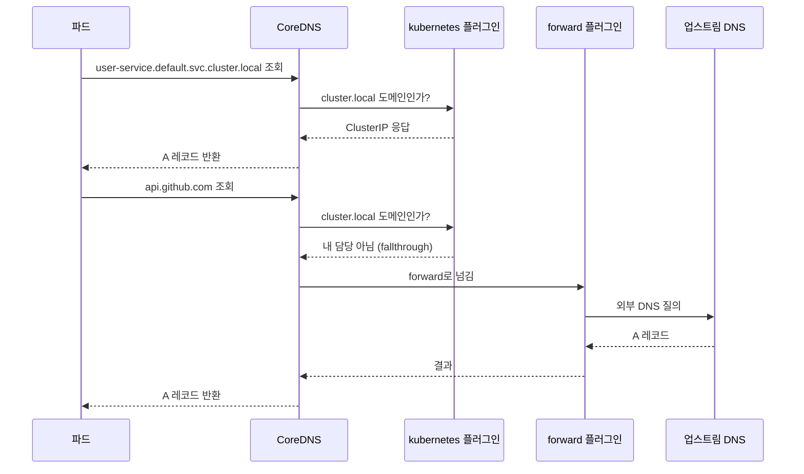

# CoreDNS

## 쿠버네티스 안에서 CoreDNS가 하는 일

쿠버네티스 클러스터를 새로 띄우면 `kube-system` 네임스페이스에 `coredns`라는 Deployment가 두 개 파드로 떠 있다. 클러스터 안에서 도는 모든 파드가 `user-service`, `redis-master.cache.svc.cluster.local` 같은 이름으로 다른 서비스를 부를 수 있는 건 이 CoreDNS 덕분이다. 파드가 어떤 이름을 조회하면 그 요청은 결국 CoreDNS로 들어오고, CoreDNS가 서비스 이름을 ClusterIP로, 혹은 파드 이름을 파드 IP로 바꿔서 돌려준다.

쿠버네티스 1.13 전에는 kube-dns가 이 역할을 했다. kube-dns는 dnsmasq, kubedns, sidecar 세 컨테이너를 한 파드에 묶은 구조라 디버깅이 까다로웠다. CoreDNS는 Go로 짜인 단일 바이너리에 플러그인 체인 하나로 동작이 끝나서 운영하기가 훨씬 단순하다. 지금 새로 만드는 클러스터는 거의 다 CoreDNS다.

여기서 한 가지 짚고 넘어가야 할 게 있다. CoreDNS 자체는 쿠버네티스 전용 도구가 아니다. 그냥 범용 DNS 서버고, 쿠버네티스가 그걸 클러스터 DNS로 채택했을 뿐이다. `kubernetes`라는 플러그인을 끼우면 쿠버네티스 API를 보고 서비스/파드 레코드를 만들어주는 것이고, 그 플러그인을 빼면 일반 authoritative DNS나 forwarding 리졸버로도 쓸 수 있다. 이 구분을 알아두면 Corefile을 읽을 때 머릿속이 정리된다.

## Corefile, 플러그인 체인으로 동작이 결정된다

CoreDNS의 모든 동작은 `Corefile`이라는 설정 파일 하나로 정해진다. 쿠버네티스에서는 이게 `kube-system`의 `coredns` ConfigMap 안에 들어있다.

```bash
kubectl -n kube-system get configmap coredns -o yaml
```

기본 Corefile은 대략 이렇게 생겼다.

```
.:53 {
    errors
    health {
        lameduck 5s
    }
    ready
    kubernetes cluster.local in-addr.arpa ip6.arpa {
        pods insecure
        fallthrough in-addr.arpa ip6.arpa
        ttl 30
    }
    prometheus :9153
    forward . /etc/resolv.conf {
        max_concurrent 1000
    }
    cache 30
    loop
    reload
    loadbalance
}
```

맨 위 `.:53`은 "모든 도메인(`.`)을 53 포트에서 받는다"는 서버 블록 선언이다. 중괄호 안에 한 줄씩 들어간 `errors`, `health`, `kubernetes`, `forward`, `cache` 같은 것들이 전부 플러그인이다. CoreDNS는 쿼리가 들어오면 이 플러그인들을 정해진 순서로 거치게 한다. 이 순서는 Corefile에 적힌 순서가 아니라 CoreDNS 빌드에 박혀있는 고정 순서(`plugin.cfg`)다. 그래서 Corefile에서 `cache`를 `forward` 위에 적든 아래에 적든 실행 순서는 안 바뀐다. 처음에 이걸 모르고 "순서를 바꿨는데 왜 동작이 그대로지?" 하고 한참 헤맸던 적이 있다.

쿼리 하나가 처리되는 흐름은 이렇다.



핵심은 `kubernetes` 플러그인이 `cluster.local`로 끝나는 이름만 자기가 처리하고, 그 외 도메인은 `forward` 플러그인으로 넘긴다는 점이다. `fallthrough`가 그 "넘김"을 담당한다. `fallthrough`가 없으면 `kubernetes` 플러그인이 자기 담당 영역에서 답을 못 찾았을 때 그냥 NXDOMAIN을 내버려서 뒤의 forward까지 안 간다. 역방향 조회(`in-addr.arpa`)에 `fallthrough`를 빠뜨려서 외부 IP의 PTR 조회가 다 깨졌던 사고가 실제로 있다.

## 서비스와 파드 DNS 레코드가 만들어지는 규칙

`kubernetes` 플러그인은 쿠버네티스 API를 watch 하면서 서비스와 엔드포인트가 바뀔 때마다 내부 레코드를 갱신한다. 이름 규칙을 외워두면 디버깅이 빠르다.

일반 서비스(ClusterIP가 있는)는 이렇게 잡힌다.

```
<service>.<namespace>.svc.cluster.local
```

예를 들어 `default` 네임스페이스의 `user-service`는 `user-service.default.svc.cluster.local`이고, 이걸 조회하면 그 서비스의 ClusterIP 한 개가 A 레코드로 나온다. 실제 트래픽 분산은 DNS가 아니라 kube-proxy(iptables/IPVS)가 ClusterIP 뒤에서 한다. 그래서 서비스 DNS는 ClusterIP 하나만 돌려주면 끝이다.

Headless 서비스(`clusterIP: None`)는 다르다. ClusterIP가 없으니 같은 이름을 조회하면 그 서비스에 붙은 모든 파드 IP가 A 레코드 여러 개로 나온다. StatefulSet으로 DB 클러스터를 띄울 때 개별 파드에 직접 붙어야 해서 이 형태를 쓴다. 이때 각 파드는 다음 이름으로도 잡힌다.

```
<pod-hostname>.<service>.<namespace>.svc.cluster.local
```

`redis-0.redis.cache.svc.cluster.local` 같은 안정적인 이름이 이렇게 나온다. StatefulSet의 파드 이름이 `redis-0`, `redis-1`로 고정되니 DNS 이름도 고정된다. 이게 StatefulSet과 Headless 서비스를 같이 쓰는 이유다.

파드 자체의 A 레코드는 기본적으로 잘 안 쓴다. `pods insecure` 옵션이 켜져 있으면 `10-244-1-5.default.pod.cluster.local`처럼 IP에 점 대신 하이픈을 박은 이름으로 조회가 되긴 하는데, 이건 거의 안 쓰고 보안상 권장도 안 된다.

SRV 레코드도 만들어진다. 포트 이름이 붙은 서비스면 `_포트이름._프로토콜.서비스.네임스페이스.svc.cluster.local` 형태로 조회해서 포트 번호까지 받을 수 있다. gRPC나 일부 클라이언트가 SRV로 엔드포인트를 찾는다.

## Consul DNS와 뭐가 다른가

서비스 디스커버리를 DNS로 한다는 점은 Consul도 같다. 그런데 결이 다르다.

CoreDNS의 쿠버네티스 레코드는 쿠버네티스 API의 Service/Endpoints 오브젝트를 그대로 비춘 거다. 즉 "쿠버네티스가 관리하는 것만" DNS에 올라온다. 쿠버네티스 밖에서 도는 VM이나 외부 DB는 CoreDNS의 `kubernetes` 플러그인이 모른다. 그걸 넣으려면 ExternalName 서비스를 만들거나 별도 레코드를 박아야 한다.

Consul은 반대로 쿠버네티스에 묶이지 않는다. VM이든 베어메탈이든 컨테이너든 Consul agent를 띄우면 다 카탈로그에 등록되고 `<service>.service.consul`로 조회된다. 데이터센터를 넘나드는 서비스 디스커버리, KV store, 헬스 체크 정책을 직접 정의하는 유연함은 Consul 쪽이 위다. 대신 그만큼 운영할 게 많다.

헬스 체크 관점에서도 차이가 있다. CoreDNS는 헬스 체크를 직접 안 한다. 쿠버네티스의 readiness probe가 통과한 파드만 Endpoints에 올라오고, CoreDNS는 그 Endpoints를 그대로 읽을 뿐이다. 그래서 "DNS에는 떠 있는데 실제로는 죽은 파드"가 나오는 일은 거의 없다. Consul은 자기가 헬스 체크를 돌려서 그 결과로 DNS 응답에서 빼고 넣고를 한다.

정리하면 쿠버네티스 안에서만 도는 워크로드면 CoreDNS로 충분하고, 쿠버네티스 안팎을 아우르는 디스커버리가 필요하면 Consul을 얹는 식으로 간다. 실제로 둘을 같이 쓰는 클러스터도 있다. CoreDNS에 `forward consul.local <consul-ip>` 한 줄을 추가해서 `.consul` 도메인 조회를 Consul로 넘기는 식이다.

## ndots와 search 도메인 때문에 생기는 조회 지연

CoreDNS 운영에서 제일 자주 만나는 실무 문제가 이거다. 파드 안에서 외부 도메인을 조회할 때 응답이 묘하게 느리거나, DNS 쿼리 수가 비정상적으로 많이 찍힌다.

원인은 파드의 `/etc/resolv.conf`에 있다. 파드를 하나 띄워서 안을 보면 이렇게 생겼다.

```bash
kubectl exec -it some-pod -- cat /etc/resolv.conf
```

```
nameserver 10.96.0.10
search default.svc.cluster.local svc.cluster.local cluster.local
options ndots:5
```

`ndots:5`가 문제의 핵심이다. ndots는 "조회하려는 이름에 점이 이 숫자보다 적으면, 절대 도메인이 아니라 상대 이름으로 보고 search 도메인을 차례로 붙여서 먼저 시도한다"는 규칙이다. 기본값 5는 꽤 크다.

`api.github.com`을 조회한다고 하자. 점이 두 개니 5보다 적다. 그러면 리졸버는 이걸 곧장 외부로 안 보내고, search 도메인을 하나씩 붙여서 순서대로 시도한다.

```
api.github.com.default.svc.cluster.local   → NXDOMAIN
api.github.com.svc.cluster.local           → NXDOMAIN
api.github.com.cluster.local               → NXDOMAIN
api.github.com.                            → 드디어 정답
```

외부 도메인 하나 찾자고 헛질의를 세 번 더 한다. 게다가 IPv4/IPv6(A/AAAA) 둘 다 물으니 실제 쿼리 수는 이것의 두 배다. 트래픽이 많은 서비스면 CoreDNS에 쿼리가 폭주하고, 매 호출이 몇십 ms씩 느려진다. 외부 API를 자주 부르는 서비스에서 레이턴시가 튀면 거의 이 문제다.

해결 방법은 몇 가지가 있다.

가장 간단한 건 외부 도메인을 부를 때 끝에 점을 붙이는 거다(FQDN). `api.github.com.`처럼 끝에 점을 박으면 리졸버가 "이건 완성된 절대 이름"으로 보고 search 도메인을 안 붙인다. 코드에서 이걸 강제하기 까다로우면 파드 스펙에서 ndots를 낮추는 방법을 쓴다.

```yaml
apiVersion: v1
kind: Pod
spec:
  dnsConfig:
    options:
      - name: ndots
        value: "2"
  containers:
    - name: app
      image: my-app:latest
```

ndots를 2로 낮추면 `api.github.com`(점 2개)은 search 도메인을 안 붙이고 바로 외부로 나간다. 다만 너무 낮추면 이번엔 클러스터 내부 짧은 이름(`user-service` 같은 점 0개짜리)을 부를 때 영향이 갈 수 있으니, 내부 호출을 짧은 이름으로 하는지 FQDN으로 하는지 확인하고 정해야 한다. 내부 서비스를 부를 때도 `user-service.default.svc.cluster.local`처럼 풀네임으로 부르는 습관을 들이면 ndots 문제에서 자유로워진다.

## cache 플러그인, 첫 줄 방어선

`cache 30`은 CoreDNS가 응답을 30초간 캐시한다는 뜻이다. 같은 이름을 또 물으면 업스트림까지 안 가고 캐시에서 바로 답한다. 위에서 본 search 도메인 헛질의도, 두 번째 호출부터는 캐시(negative cache 포함)가 받아주니 부담이 준다.

NXDOMAIN 같은 실패 응답도 캐시된다(negative caching). 기본값은 성공 응답 3600초, 실패 응답 30초다. `cache` 한 줄만 쓰면 이 기본값이 적용되고, 세밀하게 잡으려면 이렇게 쓴다.

```
cache {
    success 9984 30
    denial 9984 5
}
```

`success`는 정상 응답, `denial`은 NXDOMAIN/NODATA 같은 실패 응답의 캐시 항목 수와 TTL이다. negative TTL을 너무 길게 잡으면 새로 뜬 서비스가 한동안 NXDOMAIN으로 캐시돼서 "분명 서비스 만들었는데 안 잡힌다"는 상황이 생긴다. 5초 정도로 짧게 두는 편이 안전하다.

캐시 적중률은 prometheus 메트릭(`coredns_cache_hits_total`, `coredns_cache_misses_total`)으로 본다. 적중률이 낮으면 위의 ndots 문제로 매번 다른 이름이 조회되고 있을 가능성이 높다.

## forward 플러그인, 외부 조회를 어디로 넘길까

`forward . /etc/resolv.conf`는 "cluster.local이 아닌 모든 조회를, CoreDNS 파드가 떠 있는 노드의 `/etc/resolv.conf`에 적힌 업스트림 DNS로 넘긴다"는 뜻이다. 보통 노드의 resolv.conf에는 클라우드 제공자의 DNS나 사내 DNS가 들어있다.

특정 도메인만 다른 DNS로 보내고 싶으면 서버 블록을 따로 추가한다. 예를 들어 사내 도메인 `corp.example.com`은 사내 DNS로, 나머지는 8.8.8.8로 보내려면 이렇게 한다.

```
corp.example.com:53 {
    forward . 10.0.0.53
    cache 30
}

.:53 {
    kubernetes cluster.local in-addr.arpa ip6.arpa {
        fallthrough in-addr.arpa ip6.arpa
    }
    forward . 8.8.8.8 8.8.4.4 {
        policy sequential
        max_concurrent 1000
    }
    cache 30
}
```

`forward`에 업스트림을 여러 개 적으면 기본은 `random` 정책으로 분산한다. `policy sequential`로 두면 항상 첫 번째부터 시도하고 죽으면 다음으로 넘어간다. `max_concurrent`는 동시에 보낼 수 있는 쿼리 수 상한인데, 이게 막히면 `forward: concurrent queries exceeded` 에러가 로그에 찍히면서 응답이 늦어진다. 트래픽 많은 클러스터에서 기본값이 모자라면 올려야 한다.

`forward` 관련해서 한 가지 더. CoreDNS가 자기 자신으로 다시 forward 하는 루프가 생기면 `loop` 플러그인이 이걸 감지하고 CoreDNS를 죽인다. 노드의 `/etc/resolv.conf`에 `127.0.0.1`이나 CoreDNS의 ClusterIP가 들어있으면 이 루프가 생긴다. CrashLoopBackOff에 빠진 coredns 파드 로그에서 `Loop ... detected`가 보이면 이 경우다. 노드 resolv.conf를 고치거나 Corefile의 forward 대상을 실제 업스트림 IP로 직접 박아서 푼다.

## 디버깅할 때 쓰는 것들

DNS가 이상하면 클러스터 안에 디버깅용 파드를 하나 띄워서 직접 조회해본다.

```bash
kubectl run -it --rm dnsutils --image=registry.k8s.io/e2e-test-images/agnhost:2.39 -- /bin/sh

# 파드 안에서
nslookup user-service.default.svc.cluster.local
nslookup kubernetes.default
```

`kubernetes.default`는 어느 클러스터에나 있는 서비스라 기본 동작 확인용으로 쓰기 좋다. 이게 안 되면 CoreDNS 자체나 네트워크 문제고, 이건 되는데 특정 서비스만 안 되면 그 서비스/엔드포인트 문제다.

CoreDNS 로그를 자세히 보려면 Corefile에 `log` 플러그인을 넣는다.

```
.:53 {
    log
    errors
    kubernetes cluster.local in-addr.arpa ip6.arpa {
        fallthrough in-addr.arpa ip6.arpa
    }
    forward . /etc/resolv.conf
    cache 30
}
```

`log`를 넣으면 들어오는 쿼리가 전부 찍힌다. ConfigMap을 고치면 `reload` 플러그인이 보통 2분 안에 자동으로 다시 읽지만, 급하면 파드를 롤링 재시작한다.

```bash
kubectl -n kube-system rollout restart deployment coredns
```

CoreDNS 파드가 두 개뿐이라 트래픽 많은 큰 클러스터에서는 이게 병목이 되기도 한다. 노드마다 캐싱 DNS를 띄우는 NodeLocal DNSCache를 붙이면 노드 안에서 캐시를 먼저 받아서 CoreDNS로 가는 쿼리 자체가 줄고, conntrack 관련 DNS 타임아웃 문제도 같이 완화된다. 규모가 커지면 검토해볼 만하다.
