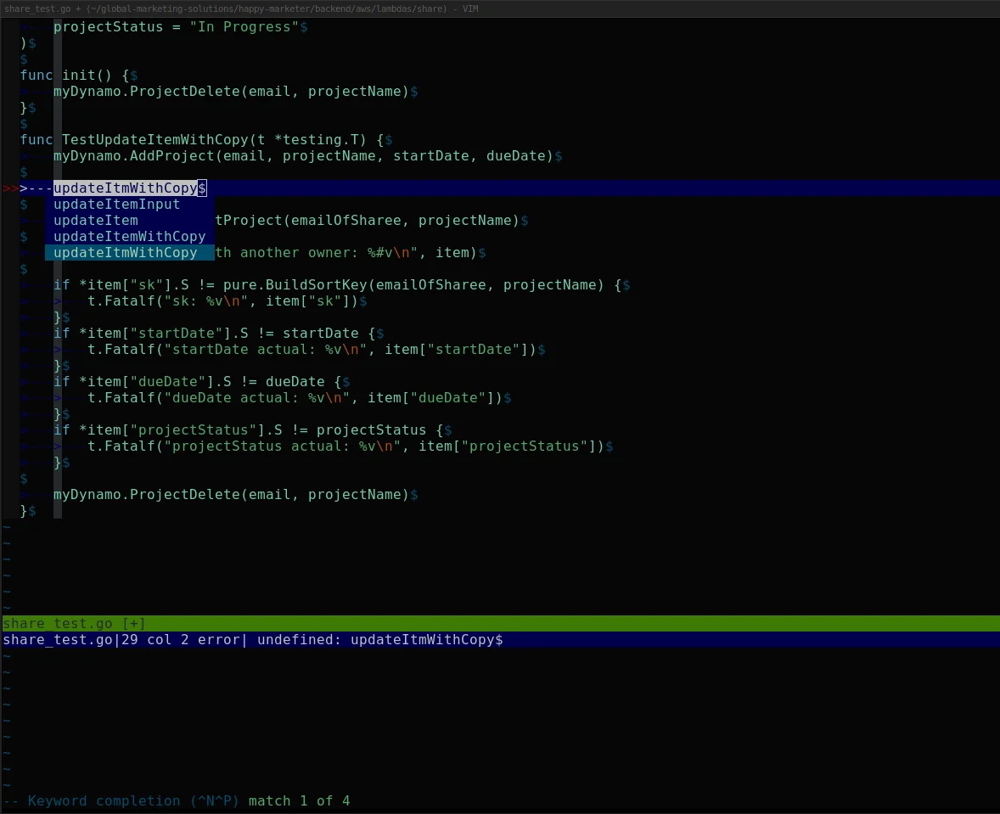

# Go 에러 처리

Go의 에러 처리는 예외(exception) 없이 반환값으로만 에러를 전달한다. 단순해 보이지만 실무에서 제대로 쓰지 않으면 에러가 어디서 발생했는지 추적하기 어렵고, 호출자가 에러를 판별하지 못해 잘못된 분기를 타는 경우가 생긴다.

## 에러 체인 구조

Go 1.13부터 `fmt.Errorf`의 `%w`로 에러를 wrapping하면 원본 에러가 체인에 보존된다. 에러 체인은 다음 형태로 쌓인다.

```
HTTP Handler
    └── UserService.CreateUser: %w
            └── UserRepository.Save: %w
                    └── pq: duplicate key value violates unique constraint "users_email_key"
```

최종 에러 메시지는 왼쪽부터 레이어 순서대로 읽힌다.

```
CreateUser: UserRepository.Save: pq: duplicate key value violates unique constraint "users_email_key"
```

`errors.Is`와 `errors.As`는 이 체인을 `Unwrap()`을 따라 끝까지 탐색한다. 체인 중간에 `%v`를 쓰거나 `Unwrap()`을 구현하지 않은 커스텀 타입이 끼어들면 그 아래 에러는 꺼낼 수 없게 된다.

```go
// 체인이 끊기는 경우
return fmt.Errorf("some context: %v", err)  // %v 는 wrapping 안 됨
```

```go
// 체인이 유지되는 경우
return fmt.Errorf("some context: %w", err)  // %w 로 wrapping
```

## errors.Is / errors.As




### errors.Is

`errors.Is`는 에러 체인을 따라가며 대상 에러와 일치하는지 확인한다.

```go
var ErrNotFound = errors.New("not found")

func findUser(id int) error {
    return fmt.Errorf("findUser: %w", ErrNotFound)
}

err := findUser(42)
if errors.Is(err, ErrNotFound) {
    // wrapping 되어 있어도 감지된다
}
```

`==` 비교는 wrapping된 에러에서 동작하지 않는다. Go 1.13 이전 코드를 마이그레이션할 때 `==`로 sentinel 에러를 비교하는 곳을 놓치면 조용히 버그가 생긴다.

### errors.As

에러 체인에서 특정 타입을 꺼낼 때 쓴다.

```go
type ValidationError struct {
    Field   string
    Message string
}

func (e *ValidationError) Error() string {
    return fmt.Sprintf("validation failed on %s: %s", e.Field, e.Message)
}

func validate(name string) error {
    if name == "" {
        return fmt.Errorf("validate: %w", &ValidationError{
            Field:   "name",
            Message: "must not be empty",
        })
    }
    return nil
}

err := validate("")
var ve *ValidationError
if errors.As(err, &ve) {
    fmt.Println(ve.Field)   // "name"
    fmt.Println(ve.Message) // "must not be empty"
}
```

`errors.As`에 포인터의 포인터를 넘겨야 한다는 점을 자주 틀린다. `errors.As(err, ve)` 처럼 쓰면 컴파일은 되지만 패닉이 난다.

## fmt.Errorf %w로 에러 wrapping

`%w`는 에러를 wrapping해서 체인에 원본 에러를 보존한다.

```go
func getConfig(path string) (*Config, error) {
    data, err := os.ReadFile(path)
    if err != nil {
        return nil, fmt.Errorf("getConfig: %w", err)
    }
    // ...
}

func loadApp(configPath string) error {
    cfg, err := getConfig(configPath)
    if err != nil {
        return fmt.Errorf("loadApp: %w", err)
    }
    // ...
    return nil
}
```

에러 메시지에 함수명을 prefix로 붙이면 스택 없이도 콜 체인을 추적할 수 있다. `loadApp: getConfig: open /etc/app.conf: no such file or directory` 형태로 출력된다.

`%v`를 쓰면 wrapping이 안 된다. `errors.Is`나 `errors.As`로 원본 에러를 꺼낼 수 없게 된다. 호출자가 특정 에러 타입을 분기해야 할 때 문제가 생긴다.

## Sentinel Error vs Custom Error Type

### 선택 기준

실무에서 판단이 자주 어긋나는 지점이다. 단순히 "에러가 발생했다"는 신호만 전달하면 되면 sentinel이 맞다. 에러와 함께 추가 데이터를 전달해야 하거나 호출자가 에러 내용을 파싱해야 하는 상황이면 custom type이 필요하다.

구체적으로는 이렇다.

sentinel을 쓰는 경우:
- `db.Get(key)`가 키를 찾지 못했을 때 → `ErrNotFound` 하나로 충분
- HTTP 클라이언트에서 요청이 타임아웃됐을 때 → `ErrTimeout`
- 에러 종류만 분기하면 되고 추가 정보는 필요 없을 때

custom type을 쓰는 경우:
- DB 에러에서 어떤 쿼리였는지, 어떤 테이블에서 발생했는지 기록해야 할 때
- HTTP 응답 에러에서 상태 코드, 응답 바디를 함께 넘겨야 할 때
- 유효성 검사 에러에서 어떤 필드가 왜 실패했는지 전달해야 할 때

### Sentinel Error

패키지 수준에서 미리 정의해두는 에러 값이다.

```go
package store

var (
    ErrNotFound   = errors.New("not found")
    ErrDuplicate  = errors.New("duplicate entry")
    ErrPermission = errors.New("permission denied")
)

func (s *Store) Get(key string) ([]byte, error) {
    val, ok := s.data[key]
    if !ok {
        return nil, ErrNotFound
    }
    return val, nil
}
```

호출자가 `errors.Is(err, store.ErrNotFound)` 로 간단히 분기할 수 있다. 에러에 추가 정보가 필요 없을 때 적합하다.

sentinel 에러를 `var`가 아닌 `const`로 정의하고 싶을 때가 있는데, `errors.New` 반환값은 인터페이스라 `const`로 선언이 안 된다. 외부 패키지에서 같은 이름의 sentinel을 재정의해서 `errors.Is` 비교를 우회하는 경우는 드물지만 보안 민감한 코드에선 신경 써야 한다.

### Custom Error Type

에러에 추가 정보를 담아야 할 때 구조체로 정의한다.

```go
type DBError struct {
    Op    string
    Query string
    Err   error
}

func (e *DBError) Error() string {
    return fmt.Sprintf("db %s [%s]: %v", e.Op, e.Query, e.Err)
}

func (e *DBError) Unwrap() error {
    return e.Err
}

func (db *DB) Query(q string) ([]Row, error) {
    rows, err := db.conn.Query(q)
    if err != nil {
        return nil, &DBError{Op: "Query", Query: q, Err: err}
    }
    return rows, nil
}
```

`Unwrap()` 메서드를 구현하면 `errors.Is`, `errors.As`가 체인을 타고 내려갈 수 있다. 빠뜨리면 wrapping한 에러를 꺼낼 수 없다.

sentinel과 custom type을 같이 쓸 수도 있다. custom type에 `Is` 메서드를 구현하면 `errors.Is`가 타입 수준 비교를 한다.

```go
type NotFoundError struct {
    Resource string
    ID       int
}

func (e *NotFoundError) Error() string {
    return fmt.Sprintf("%s with id %d not found", e.Resource, e.ID)
}

// errors.Is(err, &NotFoundError{}) 로 타입 매칭
func (e *NotFoundError) Is(target error) bool {
    _, ok := target.(*NotFoundError)
    return ok
}
```

특정 ID를 신경 쓰지 않고 NotFoundError인지만 확인하고 싶을 때 유용하다. HTTP 핸들러에서 `errors.Is(err, &NotFoundError{})` 로 404 응답을 결정하고, 로그에는 실제 Resource와 ID를 남기는 패턴으로 쓴다.

## 레이어별 에러 전파 패턴

실무에서 HTTP 서버를 짤 때 에러가 거치는 레이어는 대략 이렇다.

```
DB 드라이버 에러
    → Repository: 쿼리 컨텍스트 추가 + DBError wrapping
        → Service: 도메인 로직 에러로 변환 또는 그대로 전파
            → HTTP Handler: 에러 분기 후 응답 코드 결정 + 로깅
```

각 레이어가 해야 할 일이 다르다.

**Repository 레이어**는 DB 드라이버 에러를 그대로 올리지 않는다. 드라이버를 교체할 때 인터페이스가 깨지기 때문이다. 드라이버 에러를 내부 에러 타입으로 감싸거나, 의미 있는 sentinel로 변환한다.

```go
func (r *UserRepository) FindByEmail(ctx context.Context, email string) (*User, error) {
    var user User
    err := r.db.QueryRowContext(ctx, selectByEmail, email).Scan(&user.ID, &user.Name, &user.Email)
    if errors.Is(err, sql.ErrNoRows) {
        return nil, ErrNotFound  // 드라이버 에러를 도메인 에러로 변환
    }
    if err != nil {
        return nil, fmt.Errorf("UserRepository.FindByEmail: %w", err)
    }
    return &user, nil
}
```

**Service 레이어**는 Repository에서 올라온 에러를 그대로 올릴지, 도메인 에러로 변환할지 판단한다. 비즈니스 로직 에러(예: 이미 존재하는 이메일)는 여기서 만든다.

```go
func (s *UserService) Register(ctx context.Context, email, password string) (*User, error) {
    existing, err := s.repo.FindByEmail(ctx, email)
    if err != nil && !errors.Is(err, ErrNotFound) {
        return nil, fmt.Errorf("UserService.Register: %w", err)
    }
    if existing != nil {
        return nil, &DuplicateEmailError{Email: email}
    }

    user, err := s.repo.Create(ctx, email, password)
    if err != nil {
        return nil, fmt.Errorf("UserService.Register: %w", err)
    }
    return user, nil
}
```

**HTTP Handler 레이어**는 에러를 분기해서 상태 코드와 응답 바디를 결정한다. 에러 메시지를 그대로 클라이언트에 내보내면 내부 구현이 노출되므로 주의한다.

```go
func (h *Handler) registerUser(w http.ResponseWriter, r *http.Request) {
    var req RegisterRequest
    if err := json.NewDecoder(r.Body).Decode(&req); err != nil {
        http.Error(w, "invalid request body", http.StatusBadRequest)
        return
    }

    user, err := h.service.Register(r.Context(), req.Email, req.Password)
    if err != nil {
        var dupErr *DuplicateEmailError
        if errors.As(err, &dupErr) {
            http.Error(w, "email already registered", http.StatusConflict)
            return
        }
        h.logger.Error("register user failed", "error", err)
        http.Error(w, "internal server error", http.StatusInternalServerError)
        return
    }

    w.WriteHeader(http.StatusCreated)
    json.NewEncoder(w).Encode(user)
}
```

## 로깅 위치 판단

에러를 wrapping해서 위로 올릴 때마다 로그를 남기면 같은 에러가 여러 번 기록된다. 실무에서 흔히 보이는 패턴이다.

```go
// 잘못된 패턴 - 중간 레이어에서 로그
func (s *UserService) Register(ctx context.Context, ...) (*User, error) {
    user, err := s.repo.Create(ctx, ...)
    if err != nil {
        s.logger.Error("repo.Create failed", "error", err)  // 여기서 찍고
        return nil, fmt.Errorf("UserService.Register: %w", err)
    }
    return user, nil
}

// HTTP Handler 에서도 로그 - 같은 에러가 두 번 찍힌다
func (h *Handler) registerUser(w http.ResponseWriter, r *http.Request) {
    user, err := h.service.Register(r.Context(), ...)
    if err != nil {
        h.logger.Error("Register failed", "error", err)  // 두 번째 로그
        http.Error(w, "internal server error", 500)
    }
}
```

에러 로깅은 최상위 핸들러 또는 미들웨어에서 한 번만 한다. 중간 레이어는 wrapping해서 반환만 한다.

로깅 위치를 결정할 때 기준은 두 가지다.

첫째, 에러에 대응(응답 코드 결정, 재시도, 알림 발송 등)하는 레이어에서 로깅한다. 대응 없이 단순히 위로 올리는 레이어는 로깅하지 않는다.

둘째, 레이어를 넘어갈 때 에러 정보가 손실되는 경우 그 직전에 로깅한다. 예를 들어 내부 에러를 외부 API 에러 포맷으로 변환해서 반환해야 할 때, 변환 전 원본 에러를 로깅한다.

```go
// 외부 에러로 변환하기 직전에 내부 에러 로깅
func (h *Handler) registerUser(w http.ResponseWriter, r *http.Request) {
    user, err := h.service.Register(r.Context(), req.Email, req.Password)
    if err != nil {
        var dupErr *DuplicateEmailError
        if errors.As(err, &dupErr) {
            // 비즈니스 에러는 warn 수준, 내부 에러 전체를 로깅
            h.logger.Warn("duplicate email registration attempt",
                "email", dupErr.Email,
                "error", err,
            )
            http.Error(w, "email already registered", http.StatusConflict)
            return
        }
        // 예상치 못한 에러는 error 수준
        h.logger.Error("register user failed",
            "email", req.Email,
            "error", err,  // wrapping 체인 전체가 기록됨
        )
        http.Error(w, "internal server error", http.StatusInternalServerError)
        return
    }
    // ...
}
```

비즈니스 에러(중복, 권한 없음 등)와 시스템 에러(DB 연결 실패, 타임아웃 등)를 로그 레벨로 구분해두면 알림 설정할 때 편하다.

## panic을 써야 하는 경우와 쓰면 안 되는 경우

### panic을 써도 되는 경우

프로그램이 더 이상 실행될 수 없는 상태, 프로그래머 실수로 인한 불변식 위반에 쓴다.

```go
func NewServer(cfg *Config) *Server {
    if cfg == nil {
        panic("NewServer: cfg must not be nil")
    }
    // ...
}
```

`nil` config로 서버를 만들면 어차피 나중에 더 이상한 곳에서 터진다. 초기화 시점에 빠르게 실패하는 게 낫다.

패키지 초기화 때 정규식 컴파일이나 템플릿 파싱에도 관용적으로 쓴다.

```go
var emailRegex = regexp.MustCompile(`^[a-zA-Z0-9._%+\-]+@[a-zA-Z0-9.\-]+\.[a-zA-Z]{2,}$`)
```

`MustCompile`은 내부에서 컴파일 실패 시 panic을 일으킨다. 패턴이 리터럴이라면 런타임 에러가 아니라 배포 전에 발견해야 할 버그이므로 panic이 맞다.

### panic을 쓰면 안 되는 경우

외부 입력이나 런타임 상황에 따라 발생할 수 있는 에러는 panic을 쓰면 안 된다.

```go
// 잘못된 패턴
func ParseConfig(data []byte) *Config {
    var cfg Config
    if err := json.Unmarshal(data, &cfg); err != nil {
        panic(err)  // 외부 데이터 파싱 실패에 panic
    }
    return &cfg
}

// 올바른 패턴
func ParseConfig(data []byte) (*Config, error) {
    var cfg Config
    if err := json.Unmarshal(data, &cfg); err != nil {
        return nil, fmt.Errorf("ParseConfig: %w", err)
    }
    return &cfg, nil
}
```

라이브러리 코드에서 panic을 쓰면 사용자 코드가 recover를 직접 감싸야 한다. 라이브러리는 에러를 반환하고 panic은 쓰지 않는 게 원칙이다.

HTTP 핸들러처럼 goroutine 경계에서는 recover로 panic을 잡아야 한다. goroutine 하나가 panic으로 죽으면 전체 프로세스가 죽는다.

```go
func safeHandler(h http.HandlerFunc) http.HandlerFunc {
    return func(w http.ResponseWriter, r *http.Request) {
        defer func() {
            if rec := recover(); rec != nil {
                log.Printf("panic recovered: %v\n%s", rec, debug.Stack())
                http.Error(w, "internal server error", http.StatusInternalServerError)
            }
        }()
        h(w, r)
    }
}
```

미들웨어에서 한 번 감싸두면 개별 핸들러에서 신경 쓰지 않아도 된다.

## 에러 타입 선택 기준

호출자가 에러 종류를 분기할 필요가 없다면 `fmt.Errorf`로 메시지만 붙여서 반환한다. 호출자가 특정 에러를 구분해서 다르게 처리해야 한다면 sentinel 에러나 custom type을 쓴다. 에러에 추가 데이터(필드명, 쿼리, ID 등)가 필요하면 custom type이 맞다.

패키지 외부에 공개하는 에러는 문서화해야 한다. 내부 구현 에러를 그대로 노출하면 나중에 구현을 바꿀 때 호출자 코드가 깨진다. 패키지 내부에서 DB 드라이버를 PostgreSQL에서 MySQL로 교체했을 때 `pq.Error` 타입을 직접 반환하던 코드가 있으면 호출자 전체를 수정해야 한다. 드라이버 에러를 내부 타입으로 감싸서 반환하면 교체 영향이 패키지 안에서 끝난다.

