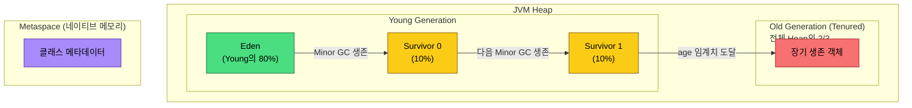
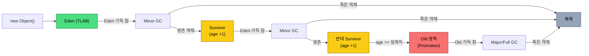
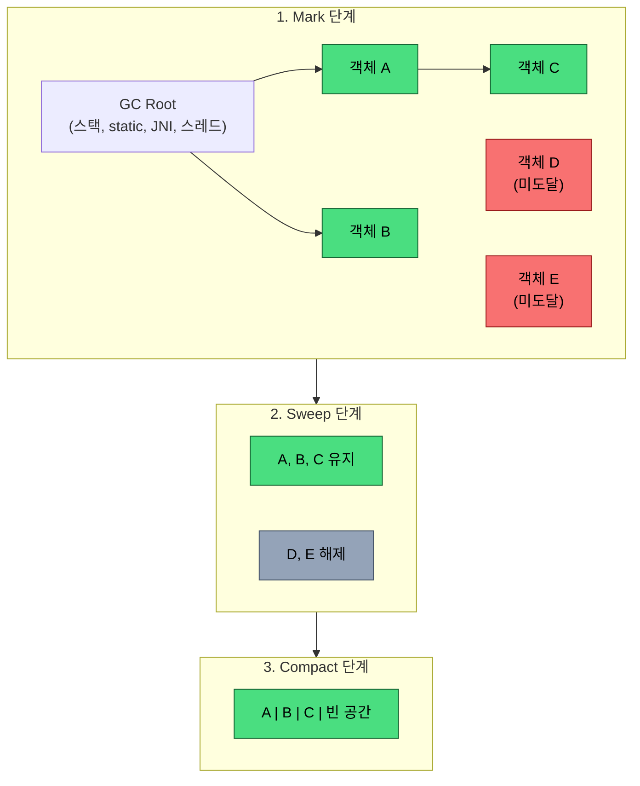
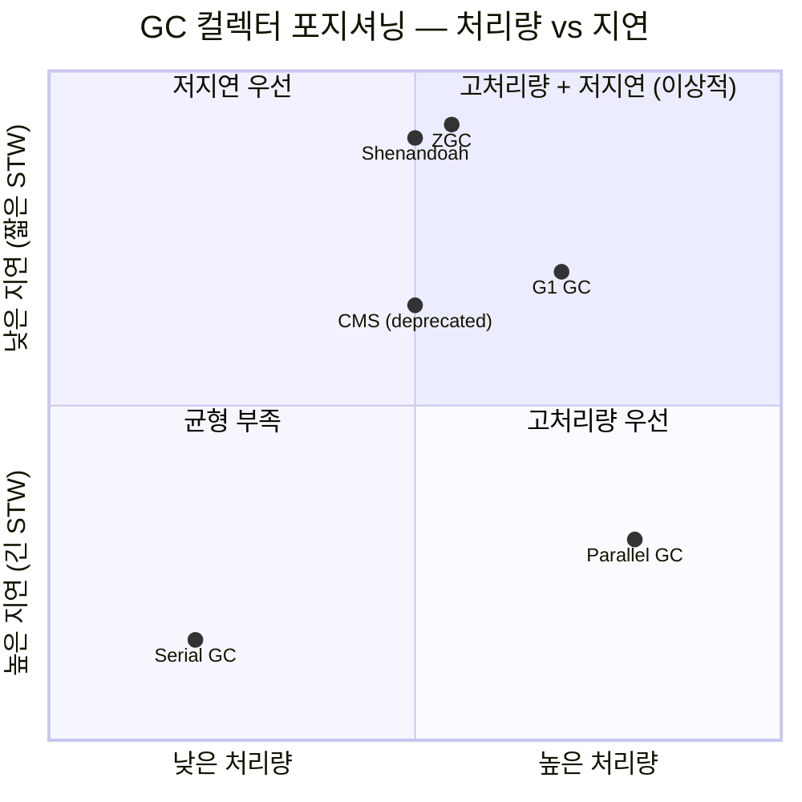
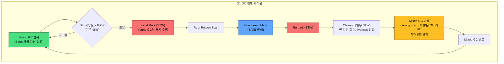
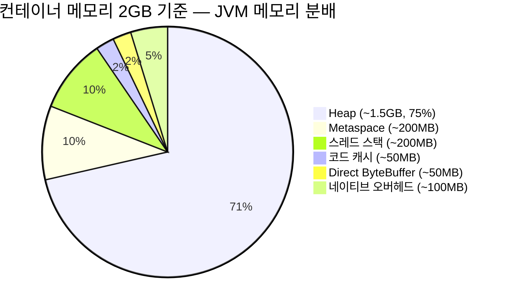

# JVM Garbage Collection Deep Dive

## 개요

GC(Garbage Collection)는 JVM이 사용하지 않는 객체를 자동으로 해제하는 메모리 관리 메커니즘이다. 개발자가 직접 메모리를 해제하지 않아도 되지만, GC 동작을 이해해야 성능 문제를 진단하고 튜닝할 수 있다.

### 왜 GC를 알아야 하는가

```
문제 상황:
  - API 응답이 간헐적으로 1초 이상 걸린다 → GC Pause
  - 서버가 갑자기 OOM으로 죽는다 → 메모리 누수
  - 부하 테스트에서 TPS가 점점 떨어진다 → GC 오버헤드

→ GC 로그를 읽고 튜닝할 수 있어야 한다
```

## 핵심

### 1. JVM 힙 메모리 구조

```
┌──────────────────────────────────────────────┐
│                    Heap                       │
│  ┌─────────────────────┐  ┌───────────────┐  │
│  │    Young Generation  │  │ Old Generation│  │
│  │  ┌─────┬─────┬─────┐│  │               │  │
│  │  │Eden │ S0  │ S1  ││  │  (Tenured)    │  │
│  │  │     │     │     ││  │               │  │
│  │  └─────┴─────┴─────┘│  └───────────────┘  │
│  └─────────────────────┘                      │
├──────────────────────────────────────────────┤
│  Metaspace (클래스 메타데이터, 네이티브 메모리)    │
└──────────────────────────────────────────────┘
```

| 영역 | 역할 | 크기 비율 |
|------|------|----------|
| **Eden** | 새 객체가 생성되는 곳 | Young의 80% |
| **Survivor (S0, S1)** | Minor GC에서 살아남은 객체 | Young의 각 10% |
| **Old (Tenured)** | 오래 살아남은 객체 | 전체 Heap의 2/3 |
| **Metaspace** | 클래스 메타데이터 | 네이티브 메모리 (별도) |



#### TLAB (Thread-Local Allocation Buffer)

멀티스레드 환경에서 객체를 Eden에 할당할 때, 스레드마다 잠금(lock) 없이 독립적으로 사용하는 작은 버퍼다.

```
Eden 영역:
┌────────────────────────────────────────────┐
│  ┌──────┐  ┌──────┐  ┌──────┐             │
│  │TLAB-1│  │TLAB-2│  │TLAB-3│   (공유)     │
│  │(T1)  │  │(T2)  │  │(T3)  │             │
│  └──────┘  └──────┘  └──────┘             │
└────────────────────────────────────────────┘

Thread-1이 new Object()를 호출하면:
  1. 자신의 TLAB 안에서 bump pointer로 할당 (lock 없음)
  2. TLAB이 가득 차면 새 TLAB을 Eden에서 받아옴
  3. 새 TLAB 할당 시에만 CAS 연산 필요
```

TLAB이 없으면 모든 스레드가 Eden의 할당 포인터를 놓고 경쟁한다. 스레드 수가 많을수록 경합이 심해지고, 객체 할당 속도가 급격히 떨어진다.

TLAB 관련 주의사항:

- TLAB 크기는 JVM이 스레드별 할당 속도를 기준으로 자동 조절한다. 수동 설정은 거의 필요 없다.
- TLAB 낭비(waste)가 발생할 수 있다. TLAB에 남은 공간이 할당할 객체보다 작으면 그 공간은 버려진다. `-XX:TLABWasteTargetPercent`로 허용 비율을 조절한다(기본 1%).
- TLAB에 들어가지 않는 큰 객체는 Eden 공유 영역에 직접 할당된다. 이 경우 동기화가 필요하다.
- `-XX:-UseTLAB`로 끌 수 있지만, 끄면 할당 성능이 눈에 띄게 떨어진다. 실제로 끌 이유는 없다.

```bash
# TLAB 관련 진단
-XX:+PrintTLAB           # Java 8
-Xlog:gc+tlab=trace      # Java 9+

# 출력 예시 (Java 9+):
# TLAB: gc thread: 0x00007f... [id: 25] desired_size: 256KB
#   slow allocs: 5  refill waste: 2048B  alloc: 0.98
#
# slow allocs가 높으면 TLAB 크기가 작다는 의미
```

### 2. GC 동작 원리

#### 객체 생명주기

```
1. 객체 생성 → TLAB에 할당 (TLAB이 가득 찼거나 큰 객체면 Eden 직접 할당)
2. Eden이 가득 참 → Minor GC 발생
3. 살아있는 객체 → Survivor 영역으로 이동 (age +1)
4. age가 임계치 도달 → Old 영역으로 이동 (Promotion)
5. Old가 가득 참 → Major GC (Full GC) 발생
```

```
Minor GC:
  Eden [████████████] → GC → Eden [          ]
  살아남은 객체 → S0 [██]

다음 Minor GC:
  Eden [████████████] + S0 [██] → GC
  살아남은 객체 → S1 [███]  (S0 비움)

객체 age가 15 도달:
  Survivor → Old 영역으로 이동 (Promotion)
```



#### GC 유형 비교

| 유형 | 대상 | 빈도 | 시간 | STW |
|------|------|------|------|-----|
| **Minor GC** | Young 영역 | 자주 | 짧음 (ms) | 짧음 |
| **Major GC** | Old 영역 | 가끔 | 길 수 있음 | 길 수 있음 |
| **Full GC** | 전체 Heap + Metaspace | 드물게 | 가장 김 | 가장 김 |

### 3. GC 알고리즘

#### Mark and Sweep

```
1. Mark: 루트(GC Root)에서 시작하여 참조 체인을 따라 살아있는 객체 표시
2. Sweep: 표시되지 않은 객체 해제
3. Compact: 파편화 방지를 위해 객체를 한쪽으로 모음

GC Root:
  - 스택의 지역 변수
  - static 변수
  - JNI 참조
  - 활성 스레드
```



### 4. Reference 타입과 GC

Java에는 일반 참조(Strong Reference) 외에 3가지 특수 참조 타입이 있다. 각각 GC 사이클에서 처리되는 시점이 다르다.

| 타입 | GC 동작 | 용도 |
|------|---------|------|
| **WeakReference** | GC가 돌면 즉시 수거 대상 | 캐시, WeakHashMap |
| **SoftReference** | 메모리가 부족할 때만 수거 | 메모리 민감한 캐시 |
| **PhantomReference** | finalize 이후 수거, get()은 항상 null | 리소스 정리, Cleaner |

#### GC 사이클에서의 처리 순서

```
Mark 단계:
  1. GC Root에서 시작해 참조 체인 탐색
  2. Strong Reference로 도달 가능한 객체 → 살림
  3. Soft Reference만으로 도달 가능한 객체
     → 메모리 충분하면 살림, 부족하면 수거
  4. Weak Reference만으로 도달 가능한 객체
     → 무조건 수거 대상

수거 후:
  5. WeakReference.get() → null 반환
  6. SoftReference.get() → null 반환 (수거된 경우)
  7. PhantomReference → ReferenceQueue에 enqueue

Reference Processing (별도 단계):
  - GC는 Mark 이후 Reference Processing 단계를 거친다
  - 이 단계에서 ReferenceQueue에 등록된 Reference 객체를 큐에 넣는다
  - Reference 수가 많으면 이 단계 자체가 GC pause를 늘린다
```

실무에서 겪는 문제:

```java
// WeakHashMap을 캐시로 쓸 때 주의
// key가 Strong Reference로 다른 곳에서 참조되면 영원히 수거 안 됨
Map<Key, Value> cache = new WeakHashMap<>();
Key key = new Key("data");
cache.put(key, value);
// key 변수가 살아있는 한 entry는 수거되지 않는다

// SoftReference 캐시의 함정
// OOM 직전까지 메모리를 잡아먹고, 한꺼번에 수거되면서
// 짧은 시간에 대량 재생성이 발생한다 (캐시 스톰)
// → SoftReference보다는 크기 제한이 있는 LRU 캐시를 쓰는 게 낫다

// PhantomReference 사용 예 (Java 9+ Cleaner)
Cleaner cleaner = Cleaner.create();
cleaner.register(resource, () -> {
    // GC가 resource를 수거한 후 실행되는 정리 로직
    nativeHandle.release();
});
// finalize()보다 예측 가능하고 안전하다
```

Reference 수가 많으면 GC pause가 늘어난다. G1 GC 로그에서 `Ref Proc` 시간이 눈에 띄게 크면 Reference 객체가 너무 많다는 신호다.

```
# G1 GC 로그에서 Reference Processing 시간 확인
[GC pause (G1 Evacuation Pause) 168M->76M(512M), 0.0234s]
   [Ref Proc: 8.5 ms]   ← 이 값이 크면 Reference 과다

# Reference Processing 병렬화 (Java 9+)
-XX:+ParallelRefProcEnabled    # 기본 활성화
```

### 5. GC 컬렉터

| 컬렉터 | 목표 | STW | 적합한 경우 |
|--------|------|-----|-----------|
| **Serial GC** | 단순함 | 길다 | 소규모 앱, 클라이언트 |
| **Parallel GC** | 처리량 | 보통 | 배치 처리, 백그라운드 |
| **CMS GC** | 저지연 | 짧음 | Java 8 이하 웹 서비스 (deprecated) |
| **G1 GC** | 균형 (처리량+지연) | 짧음 | **프로덕션 기본 (Java 9+)** |
| **ZGC** | 초저지연 | **< 1ms** | 대용량 힙, 실시간 |
| **Shenandoah** | 초저지연 | **< 1ms** | 대용량 힙 (RedHat) |



---

#### CMS GC (Concurrent Mark Sweep)

Java 8까지 저지연이 필요한 웹 서비스에서 많이 사용됐다. Java 9에서 deprecated, Java 14에서 제거됐다. 지금도 Java 8 프로젝트에서는 만날 수 있다.

CMS의 핵심 아이디어: Old 영역 수거를 애플리케이션 스레드와 동시에(concurrent) 처리해서 STW 시간을 줄인다.

```
CMS GC 단계:

1. Initial Mark (STW)
   - GC Root에서 직접 참조하는 Old 객체만 마킹
   - 탐색 범위가 좁아서 STW가 짧다

2. Concurrent Mark
   - 애플리케이션 실행 중에 참조 체인을 따라 마킹
   - STW 없음. CPU를 나눠 쓴다

3. Remark (STW)
   - Concurrent Mark 중에 변경된 참조를 다시 확인
   - Initial Mark보다 오래 걸릴 수 있다

4. Concurrent Sweep
   - 마킹되지 않은 객체를 해제
   - STW 없음

시간축:
|--STW--|------concurrent------|--STW--|------concurrent------|
 Initial     Concurrent Mark    Remark     Concurrent Sweep
  Mark
```



```mermaid
gantt
    title CMS GC 단계별 흐름
    dateFormat X
    axisFormat %s

    section STW
    Initial Mark (STW)       :crit, 0, 2
    Remark (STW)             :crit, 12, 16

    section Concurrent
    Concurrent Mark          :active, 2, 12
    Concurrent Sweep         :active, 16, 24
```

CMS의 치명적 문제점:

**Compaction이 없다.** Sweep 후 메모리 파편화가 누적된다. 파편화가 심해지면 연속된 공간을 확보하지 못해 Full GC가 발생한다. 이 Full GC는 Serial Old GC(단일 스레드)로 동작해서 힙이 크면 수 초~수십 초 멈출 수 있다.

```
파편화 발생:
[사용] [빈] [사용] [빈] [사용] [빈] [빈] [사용]

→ 큰 객체를 할당하려 하면 연속 공간이 없어서
→ Concurrent Mode Failure 발생
→ Serial Old GC(Full GC)로 fallback
→ 힙 전체 Compact → 수 초 STW
```

**Concurrent Mode Failure**: Old 영역이 가득 차기 전에 CMS가 수거를 끝내지 못하면 발생한다. GC 로그에서 `concurrent mode failure`가 보이면 CMS를 포기하고 G1으로 가야 한다.

```bash
# CMS GC 설정 (Java 8)
java -XX:+UseConcMarkSweepGC \
     -XX:CMSInitiatingOccupancyFraction=70 \  # Old 70%에서 CMS 시작
     -XX:+UseCMSInitiatingOccupancyOnly \     # 위 값을 고정 (adaptive 끔)
     -Xms4g -Xmx4g \
     -jar app.jar
```

Java 8에서 CMS를 쓰고 있다면 G1으로 바꾸는 게 맞다. Java 8에서도 `-XX:+UseG1GC`로 G1을 쓸 수 있다. CMS에서 겪던 파편화 문제가 사라진다.

---

#### G1 GC (Garbage-First) 심화

Java 9+ 기본 GC. 힙을 리전(Region) 단위로 나누어 관리한다.

```
G1 힙 구조 (리전 기반):

┌───┬───┬───┬───┬───┬───┬───┬───┐
│ E │ E │ S │ O │ O │ H │ E │ O │
├───┼───┼───┼───┼───┼───┼───┼───┤
│ O │ E │ O │ O │ S │ E │ O │   │
├───┼───┼───┼───┼───┼───┼───┼───┤
│ E │ O │ O │ E │ O │ O │ E │ O │
└───┴───┴───┴───┴───┴───┴───┴───┘

E=Eden, S=Survivor, O=Old, H=Humongous (대형 객체)

→ 가비지가 많은 리전부터 우선 수거 (Garbage-First)
```

##### Remembered Set과 Card Table

Young GC를 할 때 Old 영역의 객체가 Young 객체를 참조하고 있는지 확인해야 한다. 그런데 Old 전체를 스캔하면 Minor GC 의미가 없다. 이 문제를 Remembered Set(RSet)과 Card Table로 해결한다.

```
Card Table (전통적 Generational GC에서 사용):
  - Old 영역을 512 byte 크기의 카드로 나눈다
  - Old → Young 참조가 발생하면 해당 카드를 dirty로 표시
  - Minor GC 시 dirty 카드만 스캔

  Old 영역:
  ┌─────┬─────┬─────┬─────┬─────┐
  │Card0│Card1│Card2│Card3│Card4│
  │     │dirty│     │dirty│     │
  └─────┴─────┴─────┴─────┴─────┘
                ↓
  Minor GC 때 Card1, Card3만 확인

G1의 Remembered Set:
  - 리전별로 "나를 참조하는 리전" 목록을 관리
  - 리전 A의 RSet = {B:card3, D:card7, ...}
  - 특정 리전만 수거할 때 RSet을 보면 어떤 리전을 확인해야 하는지 바로 알 수 있다

  리전 A의 RSet:
  ┌──────────────────────┐
  │ B → card 3           │
  │ D → card 7           │  ← B의 card3, D의 card7이
  │ F → card 1, card 4   │     리전 A를 참조하고 있다
  └──────────────────────┘
```

RSet은 리전마다 유지해야 해서 메모리를 먹는다. 힙의 5~10%를 차지하는 경우가 있다. `-XX:G1HeapRegionSize`를 키우면 리전 수가 줄어들어 RSet 오버헤드가 줄지만, 리전 단위가 커서 수거 효율이 떨어질 수 있다.

**Write Barrier**: 객체 참조가 변경될 때마다 Card Table / RSet을 업데이트해야 한다. JVM은 참조 대입(store) 코드에 Write Barrier를 삽입해서 이 작업을 수행한다. Write Barrier는 모든 참조 대입에 들어가므로 애플리케이션 처리량에 약간의 오버헤드를 준다.

##### SATB (Snapshot-At-The-Beginning)

G1의 Concurrent Marking에서 사용하는 기법이다. Marking을 시작한 시점의 객체 그래프 스냅샷을 기준으로 마킹한다.

```
문제: Concurrent Marking 중에 애플리케이션이 참조를 변경하면?

  Marking 시작 시점:
    A → B → C    (C는 살아있음)

  애플리케이션이 참조 변경:
    A → B → (null)    B가 C 참조를 끊음
    A → C             A가 C를 직접 참조

  만약 마커가 B까지만 봤다면?
    → C를 아직 안 봤는데, B→C 참조가 사라짐
    → C를 수거해버린다 (살아있는 객체를 죽임!)

SATB 해결 방식:
  - 참조가 끊어질 때(B→C가 null이 될 때) 이전 값(C)을 SATB 큐에 기록
  - Write Barrier가 "이전 참조 값"을 캡처
  - Marking 시작 시점에 살아있던 객체는 모두 살린다
  - 대신 이미 죽은 객체를 살릴 수 있다 (floating garbage)
  - floating garbage는 다음 GC 사이클에서 수거
```

CMS는 Incremental Update 방식을 쓴다. 새로운 참조가 생길 때를 추적한다. SATB는 참조가 끊어질 때를 추적한다. SATB가 Remark 단계의 STW를 더 짧게 만든다.

##### Mixed GC 단계별 흐름

G1은 Young GC만으로 Old 영역이 차오르면 Mixed GC를 수행한다. 전체 과정:

```
1. Young GC (반복)
   - Eden이 차면 실행
   - Eden + Survivor를 수거, 일부 객체를 Old로 Promote

2. Concurrent Marking 시작 조건
   - Old 영역 사용률이 IHOP(InitiatingHeapOccupancyPercent, 기본 45%)에 도달
   - G1은 IHOP를 과거 GC 데이터로 자동 조절한다 (Adaptive IHOP)

3. Concurrent Marking 단계
   a. Initial Mark (STW) — Young GC와 동시에 수행 (piggyback)
   b. Root Region Scan — Survivor → Old 참조 스캔
   c. Concurrent Mark — SATB로 Old 리전의 liveness 계산
   d. Remark (STW) — SATB 큐 처리, Reference Processing
   e. Cleanup (일부 STW) — 비어있는 리전 회수, 리전별 liveness 정렬

4. Mixed GC (여러 번 반복)
   - Young 리전 + 가비지가 많은 Old 리전을 함께 수거
   - MaxGCPauseMillis 목표 내에서 수거할 Old 리전 수를 조절
   - G1MixedGCCountTarget(기본 8)만큼 반복해서 점진적으로 처리

  Mixed GC 1회:
  ┌───┬───┬───┬───┬───┬───┬───┬───┐
  │ E │ E │ S │[O]│ O │ H │ E │[O]│  ← [O] = 이번에 수거할 Old 리전
  └───┴───┴───┴───┴───┴───┴───┴───┘

5. Mixed GC 완료 후 다시 Young GC만 반복
   - Old 영역이 다시 차오르면 2번부터 반복
```



```bash
# G1 GC 설정
java -XX:+UseG1GC \
     -XX:MaxGCPauseMillis=200 \
     -XX:G1HeapRegionSize=4m \
     -XX:InitiatingHeapOccupancyPercent=45 \
     -Xms4g -Xmx4g \
     -jar app.jar

# Mixed GC 관련 튜닝
-XX:G1MixedGCCountTarget=8          # Mixed GC 반복 횟수
-XX:G1HeapWastePercent=5             # 수거 가능 가비지가 5% 미만이면 Mixed GC 중단
-XX:G1MixedGCLiveThresholdPercent=85 # liveness가 85% 이상인 리전은 수거 안 함
```

---

#### ZGC (Z Garbage Collector) 심화

1ms 이하의 STW를 보장하는 초저지연 GC. 16TB까지 지원한다.

##### Colored Pointer

ZGC의 핵심 기술. 64비트 객체 포인터의 상위 비트에 메타데이터를 저장한다.

```
64비트 포인터 구조 (ZGC):

  ┌──────────────────────────────────────────────────────────────┐
  │ [unused] [Finalizable] [Remapped] [Marked1] [Marked0] [객체주소 44bit] │
  └──────────────────────────────────────────────────────────────┘
                   ↑            ↑          ↑         ↑
               finalize    재배치완료    마킹(현재)  마킹(이전)

  - 44비트 주소 → 최대 16TB 힙
  - 나머지 비트에 GC 상태를 저장
  - 포인터 자체를 보면 객체의 GC 상태를 알 수 있다
```

Colored Pointer 덕분에 객체 헤더를 건드리지 않고도 GC 상태를 관리한다. 다만 포인터를 사용할 때마다 메타데이터 비트를 처리해야 해서, Load Barrier가 필요하다.

##### Load Barrier

ZGC는 Write Barrier 대신 Load Barrier를 사용한다. 객체 참조를 읽을 때(load) 포인터의 색상 비트를 확인한다.

```
일반적인 객체 참조 읽기:
  Object obj = field.ref;

ZGC의 Load Barrier가 삽입된 코드 (개념):
  Object obj = field.ref;
  if (obj의 color bit가 bad) {
      obj = slow_path(obj);  // 포인터 수정, 필요시 객체 재배치
  }

slow_path에서 하는 일:
  1. 객체가 재배치(relocate)되었으면 → 새 주소로 포인터 갱신
  2. 마킹이 안 되었으면 → 마킹 수행
  3. 수정된 포인터를 원래 필드에 기록 (self-healing)
```

Write Barrier(G1)는 참조를 쓸 때마다 동작하고, Load Barrier(ZGC)는 참조를 읽을 때 동작한다. 읽기가 쓰기보다 훨씬 빈번하지만, ZGC는 bad color인 경우에만 slow path에 진입하기 때문에 실제 오버헤드는 2~5% 수준이다. self-healing 덕분에 같은 포인터에 대해 slow path는 한 번만 실행된다.

##### ZGC 동작 과정

```
1. Pause Mark Start (STW < 1ms)
   - GC Root만 스캔, 직접 참조하는 객체 마킹

2. Concurrent Mark
   - 애플리케이션 실행 중 전체 객체 그래프 마킹
   - Load Barrier가 마킹 안 된 포인터를 만나면 마킹 수행

3. Pause Mark End (STW < 1ms)
   - 마킹 완료 확인, Reference Processing

4. Concurrent Relocate
   - 살아있는 객체를 새 리전으로 복사
   - Forwarding Table에 이전→새 주소 기록
   - 애플리케이션은 Load Barrier로 투명하게 새 주소를 사용

5. 포인터 갱신
   - Load Barrier의 self-healing으로 점진적 갱신
   - 모든 포인터가 갱신되면 Forwarding Table 해제
```



```mermaid
gantt
    title ZGC 동작 과정 — STW vs Concurrent
    dateFormat X
    axisFormat %s

    section STW (< 1ms)
    Pause Mark Start     :crit, 0, 1
    Pause Mark End       :crit, 10, 11

    section Concurrent
    Concurrent Mark      :active, 1, 10
    Concurrent Relocate  :active, 11, 20
    Pointer Self-Healing :active, 20, 25
```

STW가 GC Root 스캔에만 발생하고, 나머지는 전부 concurrent다. 힙이 커져도 STW는 늘어나지 않는다.

##### Generational ZGC (Java 21+)

Java 21부터 ZGC에도 세대 구분이 추가됐다. 기존 ZGC는 세대 구분 없이 전체 힙을 대상으로 GC를 수행해서, Young 객체의 빠른 수거에 불리했다.

```
Generational ZGC:
  - Young Generation과 Old Generation을 분리
  - Young GC와 Old GC를 독립적으로 실행
  - 대부분의 객체는 Young에서 빠르게 수거
  - Old GC 빈도가 크게 줄어듦

성능 개선:
  - 같은 힙 크기에서 할당 속도가 높아진다
  - GC CPU 사용량이 줄어든다
  - 메모리 오버헤드도 줄어든다 (Forwarding Table이 작아짐)
```

```bash
# ZGC 설정
java -XX:+UseZGC \
     -XX:+ZGenerational \       # Generational ZGC (Java 21+, Java 23부터 기본)
     -Xms8g -Xmx8g \
     -jar app.jar

# Java 23+에서는 -XX:+ZGenerational이 기본이다
# 비세대 ZGC를 쓰려면 -XX:-ZGenerational (하지만 쓸 이유가 없다)
```

| 비교 | G1 GC | ZGC |
|------|-------|-----|
| **STW** | ~200ms (목표) | **< 1ms** |
| **힙 크기** | ~32GB 적합 | 수 TB까지 |
| **CPU 오버헤드** | 낮음 | 약간 높음 |
| **Java 버전** | 9+ (기본) | 15+ |
| **적합한 경우** | 일반 서버 | 대용량 힙, 실시간 |

---

### 6. GC Ergonomics — Adaptive Size Policy

JVM은 GC 성능 목표에 맞게 Young/Old 비율, Survivor 크기 등을 자동 조절한다. 이 자동 조절 메커니즘이 Adaptive Size Policy다.

```
Adaptive Size Policy가 조절하는 값:
  - Eden 크기
  - Survivor 크기
  - Tenuring Threshold (Old로 가는 age 기준)

동작 방식 (Parallel GC 기준):
  1. GC pause 목표(-XX:MaxGCPauseMillis)가 설정되면
     → pause를 줄이기 위해 Young 영역을 줄인다
  2. 처리량 목표(-XX:GCTimeRatio)가 설정되면
     → 처리량을 높이기 위해 Young 영역을 키운다
  3. 두 목표가 충돌하면 pause 목표를 우선한다
```

대부분의 경우 Adaptive Size Policy에 맡기는 게 맞다. 하지만 끄는 게 나은 경우가 있다:

```
Adaptive Size Policy를 끄는 경우:
  - Young/Old 비율을 직접 잡아놓고 테스트한 설정이 있을 때
  - GC마다 Eden/Survivor 크기가 변하면서 오히려 불안정할 때
  - 컨테이너 환경에서 메모리 사용량을 예측 가능하게 유지해야 할 때
```

```bash
# Adaptive Size Policy 끄기 (Parallel GC)
-XX:-UseAdaptiveSizePolicy

# 끌 때는 Young/Old 비율을 직접 설정해야 한다
-XX:NewRatio=2                  # Old:Young = 2:1
-XX:SurvivorRatio=8             # Eden:S0:S1 = 8:1:1
-XX:MaxTenuringThreshold=15     # Promotion age

# G1 GC는 자체적으로 리전 단위로 조절하므로
# UseAdaptiveSizePolicy를 명시적으로 끌 필요가 거의 없다
# 대신 G1의 자체 ergonomics를 튜닝한다:
-XX:G1NewSizePercent=5          # Young 최소 비율 (기본 5%)
-XX:G1MaxNewSizePercent=60      # Young 최대 비율 (기본 60%)
```

Adaptive Size Policy가 동작하고 있는지 확인하려면 GC 로그에서 영역 크기 변화를 본다:

```bash
# Java 9+
-Xlog:gc+ergo=debug

# 출력 예시:
# GC(42) Adaptive size policy: Eden 24M -> 32M, Survivor 4M -> 3M
# → GC마다 크기가 변하고 있으면 Adaptive Size Policy가 동작 중
```

### 7. GC 튜닝

#### 기본 JVM 옵션

```bash
# 힙 크기 (Xms = Xmx로 고정 권장)
-Xms4g -Xmx4g

# Metaspace
-XX:MetaspaceSize=256m
-XX:MaxMetaspaceSize=512m

# GC 로그 활성화 (Java 9+)
-Xlog:gc*:file=gc.log:time,level,tags:filecount=5,filesize=100m

# Java 8 GC 로그
-verbose:gc -Xloggc:gc.log -XX:+PrintGCDetails -XX:+PrintGCDateStamps
```

#### GC 로그 분석

```
# G1 GC 로그 예시
[2026-03-01T10:15:30.123+0900] GC(42) Pause Young (Normal) (G1 Evacuation Pause)
[2026-03-01T10:15:30.123+0900] GC(42)   Eden regions: 24->0(24)
[2026-03-01T10:15:30.123+0900] GC(42)   Survivor regions: 3->3(4)
[2026-03-01T10:15:30.123+0900] GC(42)   Old regions: 15->16
[2026-03-01T10:15:30.123+0900] GC(42)   Humongous regions: 0->0
[2026-03-01T10:15:30.123+0900] GC(42) Pause Young (Normal) 168M->76M(512M) 12.345ms

읽는 법:
  168M→76M: 168MB 사용 중 → GC 후 76MB (92MB 해제)
  (512M): 전체 힙 크기
  12.345ms: GC 소요 시간 (STW)
```

#### 분석 도구 — jstat, jmap, GCEasy

```bash
# 실시간 메모리 모니터링
jstat -gc <PID> 1000    # 1초 간격
jstat -gcutil <PID> 1000

# 힙 덤프 생성
jmap -dump:live,format=b,file=heap.hprof <PID>

# OOM 시 자동 힙 덤프
-XX:+HeapDumpOnOutOfMemoryError
-XX:HeapDumpPath=/var/log/java/heap.hprof

# GC 로그 분석 (GCEasy.io — 온라인 무료)
# gc.log 파일을 https://gceasy.io 에 업로드
```

jstat/jmap은 간단한 진단에는 충분하지만, 프로덕션 환경에서 GC 문제의 근본 원인을 파려면 부족한 경우가 많다.

#### 분석 도구 — JFR과 async-profiler

##### JFR (Java Flight Recorder)

JDK에 내장된 프로파일링 도구. 프로덕션에서 상시 켜 놓을 수 있을 정도로 오버헤드가 낮다(1~2%).

```bash
# JFR로 GC 이벤트 수집 (실행 중인 프로세스)
jcmd <PID> JFR.start name=gc_profile duration=60s \
  settings=profile filename=gc_recording.jfr

# 애플리케이션 시작 시 JFR 활성화
java -XX:StartFlightRecording=duration=0,filename=app.jfr,settings=profile \
     -jar app.jar
# duration=0은 무한 기록 (수동으로 dump)

# 기록 중 덤프
jcmd <PID> JFR.dump name=gc_profile filename=dump.jfr

# JFR 파일 분석
# 1) JDK Mission Control (JMC) GUI로 열기
# 2) jfr 명령어로 CLI 분석 (Java 14+)
jfr print --events jdk.GarbageCollection gc_recording.jfr
jfr print --events jdk.GCPhasePause gc_recording.jfr
```

JFR에서 볼 수 있는 GC 관련 이벤트:

```
jdk.GarbageCollection    — GC 발생 시점, 원인, 소요 시간
jdk.GCPhasePause         — STW 구간별 소요 시간
jdk.GCHeapSummary        — GC 전후 힙 사용량
jdk.ObjectAllocationInNewTLAB  — TLAB에서 객체 할당 (할당 핫스팟 추적)
jdk.ObjectAllocationOutsideTLAB — TLAB 밖 할당 (큰 객체 추적)
jdk.OldObjectSample      — 오래 살아남은 객체의 할당 스택 트레이스

→ OldObjectSample이 메모리 누수 추적에 유용하다
  어떤 코드에서 Old로 넘어간 객체를 할당했는지 바로 보인다
```

##### async-profiler

네이티브 수준의 프로파일링 도구. JFR과 다르게 CPU 프로파일링과 메모리 할당 프로파일링을 동시에 할 수 있고, safepoint bias가 없다.

```bash
# async-profiler로 할당 프로파일링
# 어디서 객체를 많이 할당하는지 찾는다 (GC 부하 원인)
./asprof -e alloc -d 30 -f alloc_flame.html <PID>

# CPU + alloc 동시 프로파일링
./asprof -e cpu,alloc -d 30 -f profile.html <PID>

# wall-clock 모드 (GC로 블로킹된 시간도 포함)
./asprof -e wall -d 30 -f wall.html <PID>

# lock contention 프로파일링 (GC와 직접 관련은 없지만 STW 중 잠금 경합 확인)
./asprof -e lock -d 30 -f lock.html <PID>
```

GC 문제 분석 시 도구 선택:

| 상황 | 도구 |
|------|------|
| GC 빈도, pause 시간 추이 확인 | GC 로그 + GCEasy |
| GC 원인(어디서 객체를 많이 할당하는지) 추적 | JFR OldObjectSample 또는 async-profiler alloc |
| 메모리 누수 의심, 어떤 객체가 힙을 차지하는지 | 힙 덤프 + Eclipse MAT |
| 프로덕션 상시 모니터링 | JFR (오버헤드 1~2%) |
| STW 구간 세부 분석 | JFR GCPhasePause |

### 8. 컨테이너 환경에서의 GC

Docker/Kubernetes에서 JVM을 돌릴 때 가장 흔한 문제: **cgroup 메모리 제한과 JVM 힙 설정 불일치**.

#### 문제 상황

```
K8s Pod 설정:
  resources:
    limits:
      memory: 2Gi

JVM 설정:
  -Xmx2g

→ 힙 2GB + Metaspace + 스레드 스택 + 네이티브 메모리 + ...
→ 총 메모리 사용량 > 2GB
→ OOM Killer가 프로세스를 죽임 (JVM OOM이 아니라 OS 레벨에서 kill)
→ 컨테이너가 Reason: OOMKilled로 재시작
```

JVM은 힙만 관리하는 게 아니다. Metaspace, 스레드 스택, JIT 코드 캐시, Direct ByteBuffer, 네이티브 라이브러리 등 힙 밖에서도 메모리를 쓴다. 컨테이너 메모리 제한의 60~75%를 힙에 할당하는 게 안전하다.

#### UseContainerSupport

Java 10+에서 추가된 옵션. JVM이 cgroup 메모리 제한을 인식하고, 그에 맞게 힙 크기를 자동 설정한다.

```bash
# Java 10+ (기본 활성화)
-XX:+UseContainerSupport              # 기본 true
-XX:MaxRAMPercentage=75.0             # 컨테이너 메모리의 75%를 최대 힙으로

# Java 8u191+에서도 backport됨
-XX:+UnlockExperimentalVMOptions
-XX:+UseCGroupMemoryLimitForHeap      # deprecated, 대신 아래 사용
-XX:+UseContainerSupport              # Java 8u191+

# 확인 방법 — 컨테이너 안에서
java -XX:+PrintFlagsFinal -version | grep -i container
java -XshowSettings:vm -version
# Max. Heap Size가 컨테이너 메모리의 75% 근처인지 확인
```

#### 컨테이너 메모리 계산

```
컨테이너 메모리 제한: 2GB 기준

  힙 (Xmx):          ~1.5GB  (75%)
  Metaspace:          ~200MB
  스레드 스택:         ~200MB  (200 스레드 x 1MB)
  코드 캐시:          ~50MB
  Direct ByteBuffer:  ~50MB
  네이티브 오버헤드:   ~100MB
  ────────────────────────
  총합:               ~2.1GB → 초과!

→ 75%가 빡빡하면 60~70%로 낮춰야 한다
→ 스레드 수가 많으면 스택 크기(-Xss)도 줄여야 한다
```



```bash
# 실제 프로덕션에서 쓰는 설정 예시 (K8s + Java 17)
java -XX:+UseContainerSupport \
     -XX:MaxRAMPercentage=65.0 \
     -XX:InitialRAMPercentage=65.0 \
     -XX:+UseG1GC \
     -XX:MaxGCPauseMillis=200 \
     -XX:MaxMetaspaceSize=256m \
     -Xss512k \
     -jar app.jar
```

#### NativeMemoryTracking으로 확인

힙 밖에서 어디가 메모리를 먹고 있는지 확인한다.

```bash
# NMT 활성화 (5~10% 성능 오버헤드)
java -XX:NativeMemoryTracking=summary -jar app.jar

# 메모리 사용 현황 확인
jcmd <PID> VM.native_memory summary

# 출력 예시:
# Total: reserved=3500MB, committed=2100MB
#   Java Heap:   reserved=1536MB, committed=1536MB
#   Class:       reserved=200MB,  committed=180MB     ← Metaspace
#   Thread:      reserved=210MB,  committed=210MB     ← 스레드 스택
#   Code:        reserved=60MB,   committed=55MB      ← JIT
#   GC:          reserved=100MB,  committed=90MB      ← GC 자체 오버헤드
#   Internal:    reserved=30MB,   committed=25MB
#   ...
#
# → committed 합계가 컨테이너 제한을 넘지 않는지 확인
```

### 9. 메모리 누수 패턴

```java
// 1. static 컬렉션에 계속 추가
static List<Object> cache = new ArrayList<>();  // 절대 해제되지 않음

// 2. 클로저/리스너 미해제
eventBus.register(listener);  // unregister 안 하면 누수

// 3. ThreadLocal 미정리
threadLocal.set(largeObject);
// threadLocal.remove() 호출 안 하면 스레드 풀에서 누수

// 4. 커넥션/스트림 미반환
Connection conn = dataSource.getConnection();
// conn.close() 미호출 → 커넥션 풀 고갈
```

### 10. 실전 튜닝 시나리오

```
시나리오: API 응답 P99 지연이 2초를 넘는다

1. GC 로그 확인
   → Full GC가 2초 소요, 30분마다 발생

2. 원인 분석
   → Old 영역이 가득 차서 Full GC 발생
   → 캐시 객체가 Old로 이동 후 해제되지 않음

3. 해결
   → 캐시 크기 제한 (LRU eviction)
   → G1 GC에서 ZGC로 전환
   → 힙 크기 증가 (-Xmx4g → -Xmx8g)

4. 검증
   → GC 로그에서 Full GC 빈도와 소요 시간 확인
   → P99 지연 1초 이내로 감소 확인
```

| 증상 | 가능한 원인 | 해결 |
|------|-----------|------|
| 간헐적 지연 | GC Pause | ZGC 전환 또는 GC 튜닝 |
| OOM 에러 | 메모리 누수 | 힙 덤프 분석 후 원인 제거 |
| TPS 감소 | GC 빈도 증가 | 힙 크기 증가, 객체 할당 줄이기 |
| Metaspace OOM | 클래스 로더 누수 | Metaspace 크기 조절, 리플렉션 확인 |
| K8s OOMKilled | JVM 힙 + 비힙 > 컨테이너 제한 | MaxRAMPercentage 낮추기, NMT로 확인 |

## 참고

- [JVM Garbage Collectors Documentation](https://docs.oracle.com/en/java/javase/21/gctuning/)
- [GCEasy — GC 로그 분석 도구](https://gceasy.io)
- [JVM 구조](JVM/JVM 구조 및 메모리 관리.md) — JVM 기본 구조
- [자바 메모리 구조](../Java 기본 개념/자바 메모리 구조.md) — 메모리 영역
