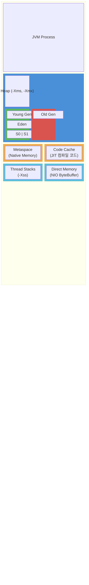
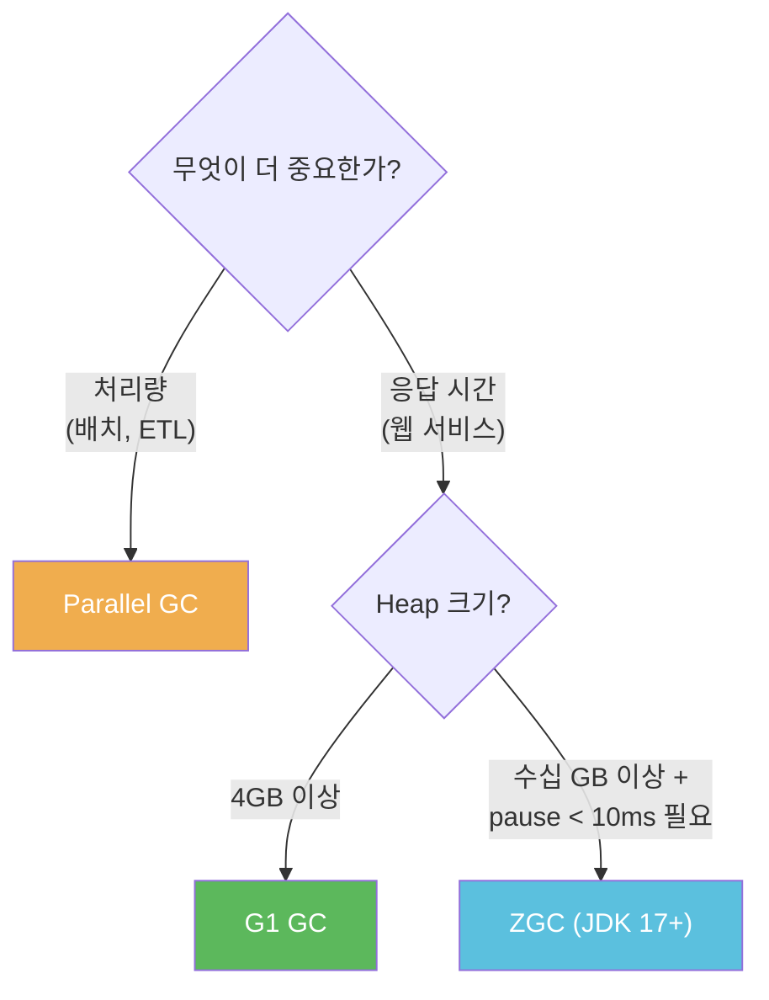
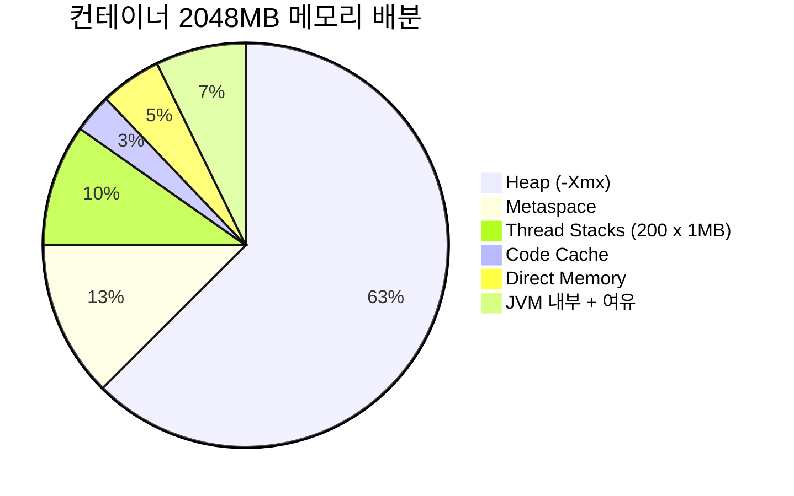
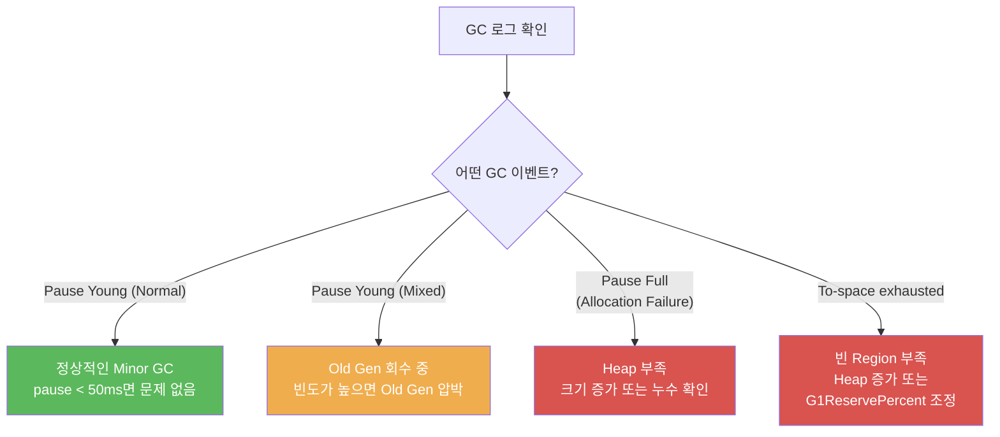
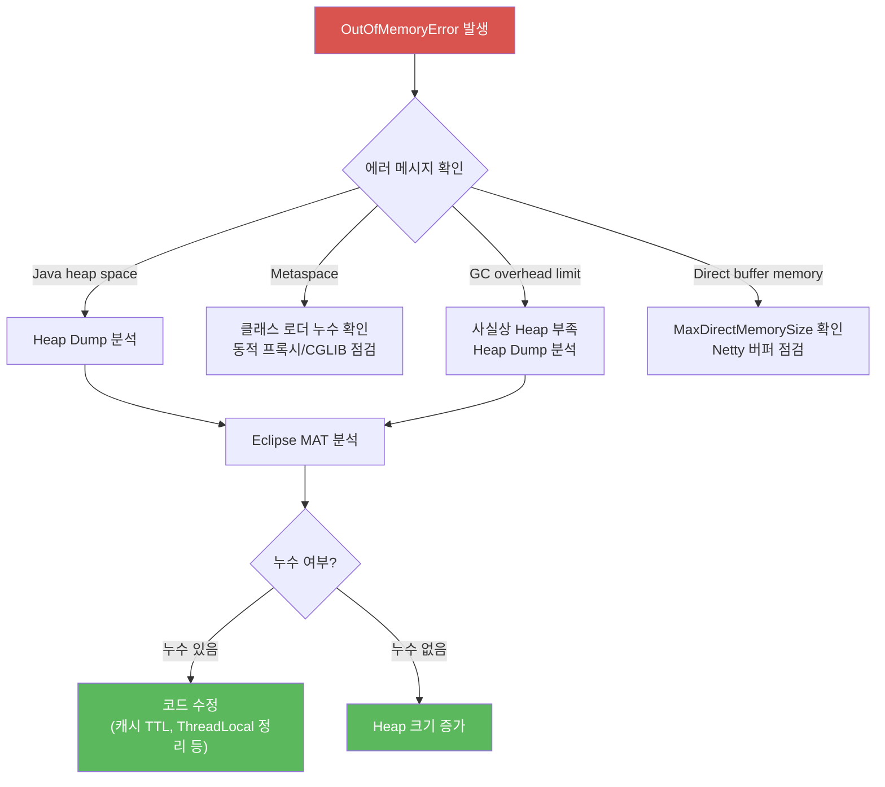

# JVM 옵션 및 메모리 관리

## 1. JVM 옵션 분류

JVM 옵션은 크게 세 가지로 나뉜다.

| 접두사 | 의미 | 안정성 | 예시 |
|--------|------|--------|------|
| `-` | 표준 옵션 | 모든 JVM 구현에서 동일 | `-Xms`, `-Xmx`, `-Xss` |
| `-XX:+/-` | 비표준 옵션 (Boolean) | JDK 버전마다 달라질 수 있음 | `-XX:+UseG1GC` |
| `-XX:Key=Value` | 비표준 옵션 (값 지정) | JDK 버전마다 달라질 수 있음 | `-XX:MaxGCPauseMillis=200` |

`-X` 옵션은 HotSpot JVM 기준으로 거의 표준처럼 쓰이지만, 공식 스펙은 아니다. `-XX` 옵션은 JDK 버전 업그레이드 시 deprecated되거나 삭제되는 경우가 있어서, 버전 변경 시 반드시 확인해야 한다.

현재 JVM에서 사용 가능한 `-XX` 옵션 전체 목록은 다음 명령으로 확인할 수 있다.

```sh
java -XX:+PrintFlagsFinal -version 2>&1 | grep manageable
```

---

## 2. JVM 메모리 구조



흔히 Heap만 신경 쓰지만, 실제 운영 환경에서 문제가 되는 건 Heap 밖의 메모리인 경우가 많다.

**Metaspace**: 클래스 메타데이터가 저장된다. JDK 7까지는 PermGen이라는 Heap 내부 영역이었는데, JDK 8부터 Native Memory로 옮겨졌다. 상한을 안 잡으면 클래스 로딩이 계속될 때 OS 메모리를 잡아먹는다.

**Direct Memory**: NIO의 `ByteBuffer.allocateDirect()`로 할당하는 영역이다. Netty 기반 프레임워크(Spring WebFlux 등)를 쓰면 이 영역 사용량이 꽤 크다. Heap dump에 안 잡히기 때문에 "Heap은 멀쩡한데 프로세스 RSS가 크다"는 상황이 발생한다.

**Thread Stack**: 스레드 하나당 기본 1MB(64bit Linux 기준)를 잡는다. 스레드 500개면 Stack만 500MB다. Tomcat 기본 최대 스레드가 200개인 이유가 있다.

---

## 3. 핵심 JVM 옵션 — 실무 설정

### 3.1 Heap 크기

```sh
java -Xms4g -Xmx4g -jar app.jar
```

`-Xms`와 `-Xmx`를 **같은 값**으로 설정하는 게 운영 환경 기본이다. 이유는:

- Heap이 늘어날 때마다 OS에 메모리를 요청하는 오버헤드가 발생한다
- Heap 확장 과정에서 Full GC가 트리거될 수 있다
- 컨테이너 환경에서 메모리 사용량을 예측 가능하게 만든다

Heap 크기를 정하는 기준은 딱히 공식이 없다. 실제 접근 흐름은 다음과 같다.


구체적으로는 이렇게 접근한다:

1. 애플리케이션을 기본값으로 띄운다
2. 정상 트래픽에서 Old Gen 사용량을 모니터링한다
3. Old Gen 피크 사용량의 3~4배를 `-Xmx`로 잡는다
4. GC 로그를 확인하면서 조정한다

### 3.2 GC 선택

JDK 버전별 기본 GC가 다르다.

| JDK 버전 | 기본 GC | 비고 |
|----------|---------|------|
| JDK 8 | Parallel GC | throughput 위주 |
| JDK 9~16 | G1 GC | pause time 위주 |
| JDK 17+ | G1 GC | ZGC도 production-ready |

실무에서 GC 선택 기준을 정리하면 이렇다.



각 GC별 설정은 다음과 같다.

**G1 GC** — 대부분의 웹 애플리케이션에 적합하다. Heap 4GB 이상일 때 잘 동작한다.

```sh
java -XX:+UseG1GC \
     -XX:MaxGCPauseMillis=200 \
     -XX:G1HeapRegionSize=16m \
     -jar app.jar
```

`MaxGCPauseMillis`는 "이 정도로 맞춰봐"라는 목표값이지 보장이 아니다. 너무 작게 잡으면 GC가 자주 발생하고, 너무 크게 잡으면 한 번에 긴 pause가 생긴다.

**ZGC** — JDK 17 이상에서 pause time이 중요한 경우 쓴다. 수십 GB Heap에서도 pause가 수 ms 수준이다.

```sh
java -XX:+UseZGC \
     -Xmx16g \
     -jar app.jar
```

ZGC는 설정할 게 거의 없다. Heap 크기만 충분히 주면 된다. 다만 메모리 오버헤드가 G1보다 크고, CPU 사용량도 좀 더 높다.

**Parallel GC** — 배치 작업처럼 throughput이 중요하고 pause time은 상관없는 경우에 쓴다.

### 3.3 Metaspace

```sh
java -XX:MetaspaceSize=256m -XX:MaxMetaspaceSize=512m -jar app.jar
```

`MetaspaceSize`는 초기 크기가 아니라, 이 값을 넘으면 Full GC를 트리거하는 임계값이다. 혼동하기 쉬운 부분이다. Spring Boot 애플리케이션은 클래스 수가 많아서 기본값(약 20MB)으로는 부족하다. 시작 시 불필요한 Full GC가 여러 번 발생할 수 있다.

`MaxMetaspaceSize`를 안 잡으면 클래스 로더 누수가 있을 때 프로세스가 OS 메모리를 전부 소진할 수 있다. 운영 환경에서는 반드시 상한을 설정한다.

### 3.4 Stack 크기

```sh
java -Xss512k -jar app.jar
```

기본값은 플랫폼마다 다르지만 대략 512KB~1MB다. 재귀 호출이 깊은 코드가 아니면 512k로 충분하다. 스레드 수가 많은 애플리케이션이라면 Stack 크기를 줄여서 전체 메모리 사용량을 낮출 수 있다.

`StackOverflowError`가 발생하면 Stack 크기를 늘리기 전에 코드의 재귀 깊이부터 확인해야 한다. Stack 크기를 늘리는 건 근본적인 해결이 아니다.

---

## 4. 컨테이너 환경 JVM 옵션

Docker/Kubernetes 환경에서 JVM을 돌릴 때 자주 문제가 된다. 컨테이너의 cgroup 메모리 제한과 JVM 메모리 설정이 안 맞으면 OOM Killer에 의해 프로세스가 죽는다.

### 4.1 UseContainerSupport

JDK 10부터 도입되었고, JDK 8u191에 백포트되었다. JDK 10 이상에서는 **기본으로 켜져 있다**.

```sh
# JDK 8u191 이상에서 컨테이너 지원 활성화
java -XX:+UseContainerSupport -jar app.jar
```

이 옵션이 켜지면 JVM이 호스트 OS의 전체 메모리가 아닌, cgroup에서 할당한 메모리 제한을 인식한다.

**JDK 8u191 미만 버전**에서는 이 옵션이 없다. JVM이 호스트의 전체 물리 메모리를 보고 Heap 크기를 자동 계산하기 때문에, 컨테이너 메모리 제한을 훌쩍 넘기는 Heap을 잡아서 OOM Killer에 죽는 사고가 발생한다. 이 버전대에서는 반드시 `-Xms`, `-Xmx`를 명시해야 한다.

### 4.2 컨테이너 메모리 계산

컨테이너 메모리 제한이 2GB일 때 JVM 메모리 배분 예시:



Heap을 컨테이너 제한의 75% 이상으로 잡으면 안 된다. Non-heap 영역(Metaspace, Thread Stack, Direct Memory, JVM 내부 오버헤드)이 나머지를 차지하는데, 이게 부족하면 컨테이너가 OOM Killer에 의해 강제 종료된다.

```sh
# Kubernetes에서 실제로 쓰는 구성 예시
java -XX:+UseContainerSupport \
     -XX:MaxRAMPercentage=60.0 \
     -XX:MetaspaceSize=256m \
     -XX:MaxMetaspaceSize=256m \
     -jar app.jar
```

`-XX:MaxRAMPercentage`는 컨테이너 메모리 제한 대비 Heap 비율을 지정한다. 60% 정도가 안전한 값이다. `-Xmx`를 직접 지정하는 것보다 컨테이너 리소스 변경에 유연하게 대응할 수 있다.

### 4.3 cgroup v1 vs v2

최근 Kubernetes 환경이 cgroup v2로 넘어가고 있다. JDK 15 이상은 cgroup v2를 지원하지만, 그 이전 버전에서는 cgroup v2 환경에서 메모리 제한을 제대로 읽지 못할 수 있다.

컨테이너 안에서 JVM이 인식하는 메모리를 확인하는 방법:

```sh
# JDK 17 이상
java -XshowSettings:system -version

# JDK 8~16
java -XX:+PrintFlagsFinal -version 2>&1 | grep MaxHeapSize
```

---

## 5. JDK 버전별 주요 옵션 차이

### JDK 8 → JDK 11 마이그레이션 시 확인할 옵션

| JDK 8 | JDK 11 | 변경 사항 |
|--------|--------|-----------|
| `-XX:PermSize` | 삭제됨 | Metaspace로 대체, `-XX:MetaspaceSize` 사용 |
| `-XX:+UseConcMarkSweepGC` | Deprecated | G1 GC 사용 권장 |
| `-XX:+PrintGCDetails` | 삭제됨 | `-Xlog:gc*`로 변경 (Unified Logging) |
| `-XX:+PrintGCDateStamps` | 삭제됨 | `-Xlog:gc*::time`으로 변경 |
| `-XX:+UseCompressedOops` | 기본 활성화 | Heap 32GB 미만에서 자동 적용 |

### JDK 11 → JDK 17 마이그레이션 시 확인할 옵션

| JDK 11 | JDK 17 | 변경 사항 |
|--------|--------|-----------|
| `-XX:+UseConcMarkSweepGC` | 삭제됨 | CMS GC 완전 제거 |
| ZGC: 실험적 | ZGC: production-ready | `-XX:-ZUncommitUnusedMemory` 기본 활성화 |
| G1 GC | G1 GC 개선 | Region 자동 크기 조정 개선 |

JDK 버전을 올릴 때 기존 JVM 옵션을 그대로 복사하면 시작조차 안 되는 경우가 있다. 삭제된 옵션이 있으면 JVM이 에러를 내고 종료한다.

```sh
# 삭제된 옵션을 무시하고 시작하려면 (임시 방편, 권장하지 않음)
java -XX:+IgnoreUnrecognizedVMOptions -jar app.jar
```

---

## 6. GC 로그 설정과 읽는 법

### 6.1 GC 로그 설정

**JDK 8**:

```sh
java -XX:+PrintGCDetails \
     -XX:+PrintGCDateStamps \
     -XX:+PrintGCTimeStamps \
     -Xloggc:/var/log/app/gc.log \
     -XX:+UseGCLogFileRotation \
     -XX:NumberOfGCLogFiles=5 \
     -XX:GCLogFileSize=20m \
     -jar app.jar
```

**JDK 11 이상** (Unified Logging):

```sh
java -Xlog:gc*:file=/var/log/app/gc.log:time,uptime,level,tags:filecount=5,filesize=20m \
     -jar app.jar
```

JDK 9부터 GC 로그 체계가 완전히 바뀌었다. `-XX:+PrintGCDetails` 같은 옵션은 JDK 9 이상에서 동작하지 않는다. 업그레이드할 때 로그 설정도 반드시 바꿔야 한다.

### 6.2 G1 GC 로그 읽기

실제 G1 GC 로그 예시 (JDK 17):

```
[2026-04-09T10:23:45.123+0900][info][gc] GC(142) Pause Young (Normal) (G1 Evacuation Pause) 1843M->1024M(4096M) 12.345ms
```

이 한 줄에서 읽어야 할 정보:

| 항목 | 값 | 의미 |
|------|-----|------|
| `GC(142)` | 142번째 GC | GC 발생 순번 |
| `Pause Young (Normal)` | Young GC | Minor GC라는 뜻 |
| `G1 Evacuation Pause` | GC 원인 | 살아있는 객체를 다른 Region으로 복사 |
| `1843M->1024M` | GC 전후 Heap 사용량 | 819MB가 회수됨 |
| `(4096M)` | 전체 Heap 크기 | `-Xmx4g` |
| `12.345ms` | pause time | 이 시간 동안 애플리케이션이 멈춤 |

GC 로그에서 문제를 판단하는 흐름은 다음과 같다.



주의해서 봐야 할 패턴:

```
# Full GC가 발생하면 문제 신호
[gc] GC(201) Pause Full (Allocation Failure) 3900M->3200M(4096M) 4523.456ms

# Mixed GC가 자주 발생하면 Old Gen 압박
[gc] GC(185) Pause Young (Mixed) (G1 Evacuation Pause) 2048M->1536M(4096M) 35.678ms

# To-space exhausted는 Heap이 부족하다는 신호
[gc] GC(190) To-space exhausted
```

**Full GC + Allocation Failure**: Heap이 부족하다. Old Gen이 가득 찼고, Young Gen에서 승격할 공간이 없다. Heap을 늘리거나 메모리 누수를 확인해야 한다.

**To-space exhausted**: G1 GC가 객체를 복사할 빈 Region을 찾지 못한 상태다. Heap을 늘리거나 `G1ReservePercent`를 조정한다.

### 6.3 GC 로그 분석 도구

로그 파일을 직접 읽는 건 한두 줄이면 되지만, 트렌드를 보려면 도구가 필요하다.

- **GCViewer**: 오픈소스, GUI 기반. GC pause time 추이와 Heap 사용량 변화를 그래프로 볼 수 있다.
- **GCEasy** (gceasy.io): 웹 기반. GC 로그를 업로드하면 분석 리포트를 만들어준다.
- **JClarity Censum**: 상용 도구. 상세한 GC 분석이 필요한 경우 사용한다.

---

## 7. OOM 발생 시 디버깅 절차

### 7.1 OOM 대비 옵션 (운영 환경 필수)

```sh
java -XX:+HeapDumpOnOutOfMemoryError \
     -XX:HeapDumpPath=/var/log/app/heapdump/ \
     -XX:OnOutOfMemoryError="kill -9 %p" \
     -jar app.jar
```

`-XX:+HeapDumpOnOutOfMemoryError`는 반드시 설정해야 한다. OOM이 발생하면 자동으로 heap dump를 생성한다. 이게 없으면 OOM 원인을 사후에 분석할 방법이 없다.

`-XX:OnOutOfMemoryError="kill -9 %p"`는 OOM 발생 후 프로세스를 강제 종료시킨다. OOM 이후의 JVM은 불안정한 상태이므로, 빠르게 죽이고 재시작하는 게 낫다. Kubernetes 환경이면 Pod 재시작으로 자동 복구된다.

### 7.2 OOM 디버깅 흐름

OOM이 발생했을 때 어디서부터 봐야 하는지 정리한 흐름이다.



### 7.3 OOM 종류별 원인

```
java.lang.OutOfMemoryError: Java heap space
```
→ Heap이 부족하다. 객체 생성량에 비해 Heap이 작거나, 메모리 누수가 있다.

```
java.lang.OutOfMemoryError: Metaspace
```
→ 클래스가 너무 많이 로드되었다. 동적 프록시, CGLIB, Groovy 스크립트 등에서 발생할 수 있다. Spring 애플리케이션에서 hot reload 시 클래스 로더 누수로 자주 발생한다.

```
java.lang.OutOfMemoryError: GC overhead limit exceeded
```
→ GC가 전체 실행 시간의 98% 이상을 차지하면서 Heap의 2% 미만만 회수할 때 발생한다. 사실상 메모리가 부족하다는 뜻이다.

```
java.lang.OutOfMemoryError: Direct buffer memory
```
→ Direct Memory 영역이 부족하다. `-XX:MaxDirectMemorySize`를 확인한다. Netty 기반 애플리케이션에서 자주 발생한다.

### 7.4 Heap Dump 분석

#### 수동으로 Heap Dump 생성

```sh
# 프로세스 PID 확인
jps -l

# Heap Dump 생성
jmap -dump:format=b,file=/tmp/heapdump.hprof <PID>

# jmap이 안 될 때 (JDK 9 이상)
jcmd <PID> GC.heap_dump /tmp/heapdump.hprof
```

주의: `jmap -dump`는 프로세스를 잠시 멈추게 한다. 운영 중인 서버에서 실행할 때는 트래픽이 적은 시간에 해야 한다. dump 파일 크기는 Heap 크기와 비슷하므로, 디스크 여유 공간도 확인해야 한다.

#### Eclipse MAT로 분석

Eclipse MAT (Memory Analyzer Tool)은 Heap Dump 분석의 사실상 표준 도구다.

1. `.hprof` 파일을 MAT에서 연다
2. **Leak Suspects Report**를 먼저 확인한다 — 누수 의심 객체를 자동으로 찾아준다
3. **Dominator Tree**에서 메모리를 많이 차지하는 객체를 찾는다
4. 해당 객체의 **Path to GC Roots** (exclude weak references)를 본다 — 누가 이 객체를 붙잡고 있는지 확인

자주 나오는 누수 패턴:

- `HashMap`이나 `ArrayList`에 계속 쌓이는 객체 — 캐시에 만료 정책이 없는 경우
- `ThreadLocal`에 저장한 객체가 해제되지 않음 — 스레드 풀 환경에서 자주 발생
- 리스너/콜백을 등록하고 해제하지 않음
- `static` 컬렉션에 데이터가 계속 추가됨

### 7.5 실시간 모니터링

```sh
# 현재 Heap 상태 확인
jstat -gcutil <PID> 1000

# 출력 예시
# S0     S1     E      O      M     CCS    YGC   YGCT    FGC   FGCT    CGC   CGCT     GCT
# 0.00  45.23  67.89  72.15  95.23  91.45   142   1.234    3   4.567     8   0.123   5.924
```

| 항목 | 의미 |
|------|------|
| `E` | Eden 영역 사용률 (%) |
| `O` | Old Gen 사용률 (%) |
| `M` | Metaspace 사용률 (%) |
| `YGC` / `YGCT` | Young GC 횟수 / 총 소요 시간 |
| `FGC` / `FGCT` | Full GC 횟수 / 총 소요 시간 |

`O`가 지속적으로 올라가면서 FGC가 증가하면 메모리 누수를 의심해야 한다.

---

## 8. 프로덕션 JVM 설정 예시

### Spring Boot 웹 애플리케이션 (Kubernetes, 2GB 컨테이너)

```sh
java \
  -XX:+UseG1GC \
  -XX:MaxRAMPercentage=60.0 \
  -XX:MetaspaceSize=256m \
  -XX:MaxMetaspaceSize=256m \
  -XX:+HeapDumpOnOutOfMemoryError \
  -XX:HeapDumpPath=/var/log/app/heapdump/ \
  -XX:OnOutOfMemoryError="kill -9 %p" \
  -Xlog:gc*:file=/var/log/app/gc.log:time,uptime,level,tags:filecount=5,filesize=20m \
  -jar app.jar
```

### 대용량 배치 처리 (JDK 17, 16GB 서버)

```sh
java \
  -Xms12g -Xmx12g \
  -XX:+UseParallelGC \
  -XX:ParallelGCThreads=8 \
  -XX:MetaspaceSize=256m \
  -XX:MaxMetaspaceSize=512m \
  -XX:+HeapDumpOnOutOfMemoryError \
  -XX:HeapDumpPath=/var/log/batch/heapdump/ \
  -Xlog:gc*:file=/var/log/batch/gc.log:time,uptime,level,tags:filecount=5,filesize=20m \
  -jar batch.jar
```

### 저지연 서비스 (JDK 17, ZGC)

```sh
java \
  -XX:+UseZGC \
  -Xms8g -Xmx8g \
  -XX:MetaspaceSize=256m \
  -XX:MaxMetaspaceSize=256m \
  -XX:+HeapDumpOnOutOfMemoryError \
  -XX:HeapDumpPath=/var/log/app/heapdump/ \
  -Xlog:gc*:file=/var/log/app/gc.log:time,uptime,level,tags:filecount=5,filesize=20m \
  -jar app.jar
```

---

## 9. 트러블슈팅 케이스

### 케이스 1: 컨테이너 OOM Kill

**증상**: Pod가 주기적으로 재시작된다. `kubectl describe pod`에서 `OOMKilled`가 보인다.

**원인**: JVM Heap은 `-Xmx1g`로 잡았는데 컨테이너 메모리 제한도 1GB다. Non-heap 영역이 나머지를 차지하면서 cgroup 메모리 제한을 초과했다.

**해결**: 컨테이너 메모리 제한을 충분히 잡거나, `-XX:MaxRAMPercentage=60.0`을 사용해서 Heap이 전체의 60%만 차지하게 한다.

### 케이스 2: 느린 응답 시간

**증상**: 평소에는 괜찮은데 가끔 응답이 수 초씩 걸린다.

**원인**: GC 로그를 보니 Full GC가 3~5초씩 걸리고 있었다. Old Gen이 거의 가득 찬 상태에서 Young GC 승격이 계속 일어나고 있었다.

**해결**: Heap 크기를 늘리고, G1 GC의 `MaxGCPauseMillis`를 조정했다. 근본 원인은 캐시 객체가 만료 없이 쌓이고 있었던 거라 Caffeine 캐시에 TTL을 설정해서 해결했다.

### 케이스 3: Metaspace OOM

**증상**: 운영 중 갑자기 `OutOfMemoryError: Metaspace`가 발생한다.

**원인**: 리플렉션 기반 직렬화 라이브러리가 매 요청마다 새로운 클래스를 생성하고 있었다. `MaxMetaspaceSize`를 설정하지 않아서 OS 메모리를 계속 소비하다가 결국 터졌다.

**해결**: `MaxMetaspaceSize`를 설정하고, 클래스를 동적 생성하는 코드를 캐싱하도록 수정했다.
