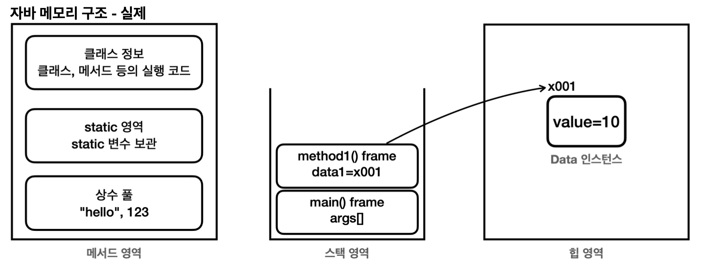
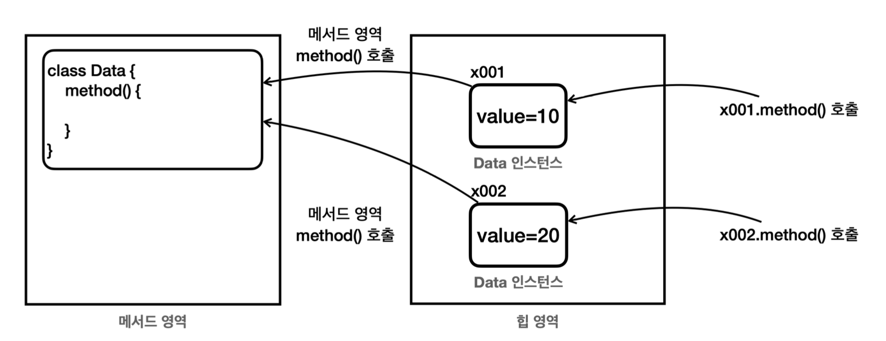
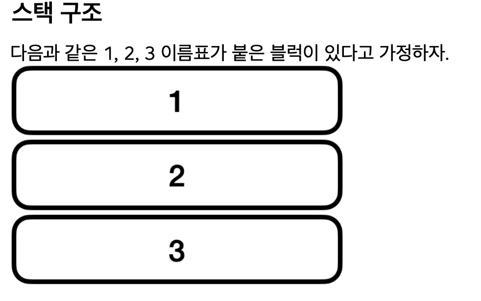
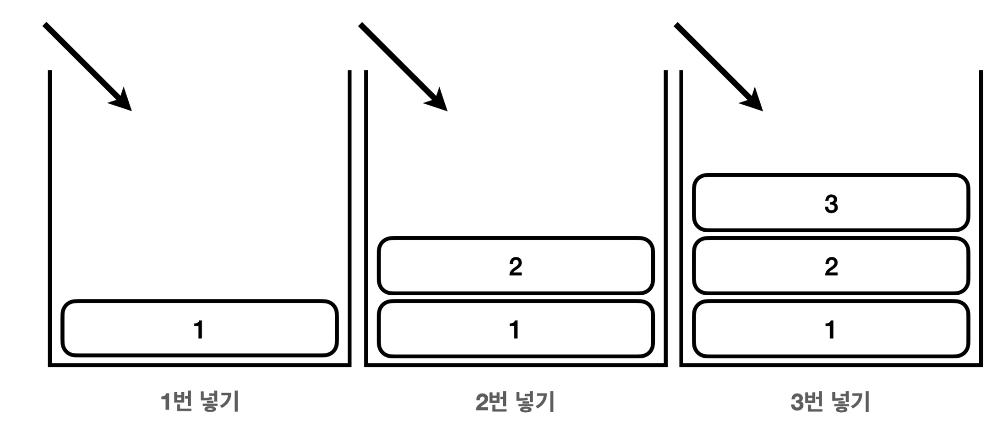
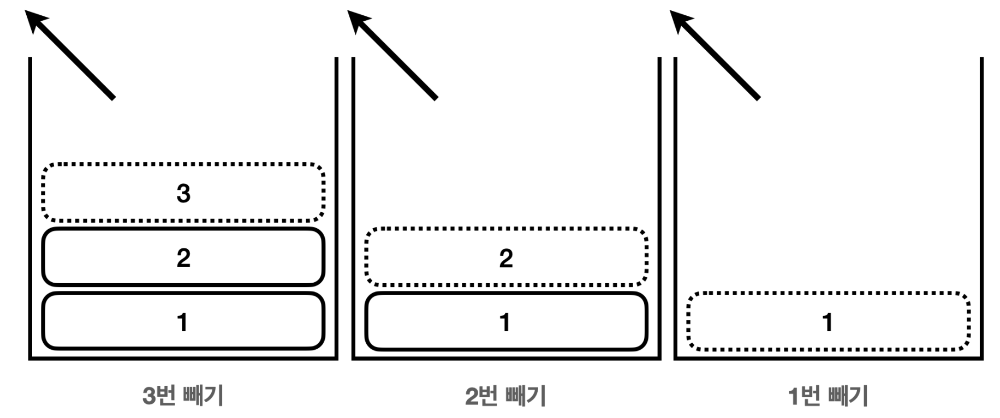
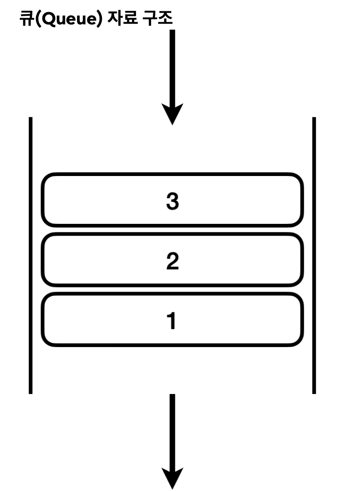

## 배경

### 자바의 메모리 구조는 크게 메서드 영여그 스택 영역, 힙 영역 3개로 나눌  수 있다. 


<div align="center">
    
</div>


**메서드 영역** 
- 메서드 영역은 프로그램을 실행하는데 필요한 공통 데이터를 관리한다.
- 이 영역은 프로그램의 모든 영역에서 공유한다.
  - 클래스 정보: 클래스의 실행 코드(바이트 코드), 필드, 메서드와 생성자 코드등 모든 실행 코드가 존재한다. 
  - static 영역: `static` 변수들을 보관한다. 
  - 런타임 상수 풀: 프로그램을 실행하는데 필요한 공통 리터럴 상수를 보관한다.
  - 예를 들어서 프로그램에 `"hello"` 라는 리터럴 문자가 있으면 이런 문자를 공통으로 묶어서 관리한다. 
  - 이 외에도 프로그램을 효율 적으로 관리하기 위한 상수들을 관리한다. (참고로 문자열을 다루는 문자열 풀은 자바 7부터 힙 영역으로 이 동했다.)


<div align="center">
    
</div>

- 메서드는 공통적으로 사용되어 공유 되고, 필드는 메모리에 각각 저장되고, 다르게 사용이 된다.
- 즉, 인스턴스의 메서드를 호출하면 실제로는 메서드 영역에 있는 코드를 불러서 수행한다.


**스택 영역** 
- 자바 실행 시, 하나의 실행 스택이 생성된다.
- 각 스택 프레임은 **지역 변수, 중간 연산 결과, 메서드 호출 정보** 등을 포함한다.
    - 스택 프레임: 스택 영역에 쌓이는 네모 박스가 하나의 스택 프레임이다. 메서드를 호출할 때 마다 하나의 스택 프레임이 쌓이고, 메서드가 종료되면 해당 스택 프레임이 제거된다.

**힙 영역** 
- 객체(인스턴스)와 배열이 생성되는 영역이다.
- 가비지 컬렉션(GC)이 이루어지는 주요 영역이며, 더 이상 참조되지 않는 객체는 GC에 의해 제거된다.

> 참고 : 스택 영역은, 각 쓰레드 별로 하나의 실해 스택이 생성된다. 따라서 쓰레드 수 만큼 쓰레드 수 만큼 스택 영역이 생성된다. 지금은 쓰레드를 1개만 사용하므로 스택 영역도 하나이다.


---


### 스택 구조
<div align="center">
    
</div>


#### 스택 넣기
<div align="center">
    
</div>

#### 스택 빼기
<div align="center">
    
</div>


> 후입 선출 : 여기서 가장 마지막에 넣은 3버이 가자 먼저 나온다. 이렇게 나중에 넣은 것이 가장 먼저 나오는 것을 후입 선출이라 하고, 이런 자료구조를 스택이라 한다. 

<Br>
<Br>
<Br>
<Br>

### 큐구조
<div align="center">
    
</div>

### 정리
> 프로그램 실행과 메서드 호출에는 스택 구조가 적합하다. ㅅ하지만, 선착순 이벤트 같은 경우는 큐구조가 적합하다.


<div align="center">
    
</div>


#### 스택 넣기
<div align="center">
    
</div>

#### 스택 빼기
<div align="center">
    
</div>


> 후입 선출 : 여기서 가장 마지막에 넣은 3버이 가자 먼저 나온다. 이렇게 나중에 넣은 것이 가장 먼저 나오는 것을 후입 선출이라 하고, 이런 자료구조를 스택이라 한다. 

<Br>
<Br>
<Br>
<Br>

<div align="center">
    
</div>

<div align="center">
    
</div>


> 후입 선출 : 여기서 가장 마지막에 넣은 3버이 가자 먼저 나온다. 이렇게 나중에 넣은 것이 가장 먼저 나오는 것을 후입 선출이라 하고, 이런 자료구조를 스택이라 한다. 

<Br>
<Br>
<Br>
<Br>

<div align="center">
    
</div>

> 프로그램 실행과 메서드 호출에는 스택 구조가 적합하다. ㅅ하지만, 선착순 이벤트 같은 경우는 큐구조가 적합하다.


<div align="center">
    
</div>


#### 스택 넣기
<div align="center">
    
</div>

#### 스택 빼기
<div align="center">
    
</div>


> 후입 선출 : 여기서 가장 마지막에 넣은 3버이 가자 먼저 나온다. 이렇게 나중에 넣은 것이 가장 먼저 나오는 것을 후입 선출이라 하고, 이런 자료구조를 스택이라 한다. 

<Br>
<Br>
<Br>
<Br>

<div align="center">
    
</div>

<div align="center">
    
</div>


> 후입 선출 : 여기서 가장 마지막에 넣은 3버이 가자 먼저 나온다. 이렇게 나중에 넣은 것이 가장 먼저 나오는 것을 후입 선출이라 하고, 이런 자료구조를 스택이라 한다. 

<Br>
<Br>
<Br>
<Br>

<div align="center">
    
</div>

> 프로그램 실행과 메서드 호출에는 스택 구조가 적합하다. ㅅ하지만, 선착순 이벤트 같은 경우는 큐구조가 적합하다.


<div align="center">
    
</div>


#### 스택 넣기
<div align="center">
    
</div>

#### 스택 빼기
<div align="center">
    
</div>


> 후입 선출 : 여기서 가장 마지막에 넣은 3버이 가자 먼저 나온다. 이렇게 나중에 넣은 것이 가장 먼저 나오는 것을 후입 선출이라 하고, 이런 자료구조를 스택이라 한다. 

<Br>
<Br>
<Br>
<Br>

<div align="center">
    
</div>

<div align="center">
    
</div>


> 후입 선출 : 여기서 가장 마지막에 넣은 3버이 가자 먼저 나온다. 이렇게 나중에 넣은 것이 가장 먼저 나오는 것을 후입 선출이라 하고, 이런 자료구조를 스택이라 한다. 

<Br>
<Br>
<Br>
<Br>

<div align="center">
    
</div>

> 프로그램 실행과 메서드 호출에는 스택 구조가 적합하다. ㅅ하지만, 선착순 이벤트 같은 경우는 큐구조가 적합하다.


<div align="center">
    
</div>

<div align="center">
    
</div>


> 후입 선출 : 여기서 가장 마지막에 넣은 3버이 가자 먼저 나온다. 이렇게 나중에 넣은 것이 가장 먼저 나오는 것을 후입 선출이라 하고, 이런 자료구조를 스택이라 한다. 

<Br>
<Br>
<Br>
<Br>

<div align="center">
    
</div>

<div align="center">
    
</div>


> 후입 선출 : 여기서 가장 마지막에 넣은 3버이 가자 먼저 나온다. 이렇게 나중에 넣은 것이 가장 먼저 나오는 것을 후입 선출이라 하고, 이런 자료구조를 스택이라 한다. 

<Br>
<Br>
<Br>
<Br>

<div align="center">
    
</div>

> 프로그램 실행과 메서드 호출에는 스택 구조가 적합하다. ㅅ하지만, 선착순 이벤트 같은 경우는 큐구조가 적합하다.


---

## 코드 예제

### JVM 메모리 영역 구조 다이어그램

```
┌──────────────────────────────────────────────────────────┐
│                      JVM Memory                          │
│                                                          │
│  ┌──────────────────────────────────────────────────┐   │
│  │              Method Area (메서드 영역)            │   │
│  │  클래스 바이트코드, static 변수, 런타임 상수 풀   │   │
│  └──────────────────────────────────────────────────┘   │
│                                                          │
│  ┌─────────────────┐  ┌─────────────────┐               │
│  │  Stack (스레드1) │  │  Stack (스레드2) │  ← 스레드별  │
│  │  - 지역 변수     │  │  - 지역 변수     │    독립적    │
│  │  - 메서드 호출   │  │  - 메서드 호출   │              │
│  └─────────────────┘  └─────────────────┘               │
│                                                          │
│  ┌──────────────────────────────────────────────────┐   │
│  │                  Heap (힙 영역)                   │   │
│  │  ┌─────────────────────┐  ┌──────────────────┐   │   │
│  │  │   Young Generation  │  │  Old Generation  │   │   │
│  │  │  Eden | S0 | S1    │  │ (장기 생존 객체) │   │   │
│  │  └─────────────────────┘  └──────────────────┘   │   │
│  └──────────────────────────────────────────────────┘   │
│                                                          │
│  ┌──────────────────────────────────────────────────┐   │
│  │           Metaspace (Java 8+)                    │   │
│  │      클래스 메타데이터 (Native Memory 사용)       │   │
│  └──────────────────────────────────────────────────┘   │
└──────────────────────────────────────────────────────────┘
```

### JVM 힙/GC 옵션 설정

```bash
# ── 힙 메모리 크기 설정 ──────────────────────────────────
java -Xms512m -Xmx2g -jar app.jar
#  -Xms: 초기 힙 크기 (최소)
#  -Xmx: 최대 힙 크기

# ── GC 알고리즘 선택 ─────────────────────────────────────
java -XX:+UseG1GC          -jar app.jar  # G1GC (Java 9+ 기본값)
java -XX:+UseZGC           -jar app.jar  # ZGC (Java 15+, 저지연)
java -XX:+UseParallelGC    -jar app.jar  # Parallel GC (처리량 최적화)
java -XX:+UseShenandoahGC  -jar app.jar  # Shenandoah (Red Hat)

# ── GC 로그 활성화 (Java 9+) ─────────────────────────────
java -Xmx2g \
     -Xlog:gc*:file=gc.log:time,level,tags:filecount=5,filesize=20m \
     -jar app.jar

# ── Metaspace 설정 ────────────────────────────────────────
java -XX:MetaspaceSize=128m \
     -XX:MaxMetaspaceSize=256m \
     -jar app.jar
```

### GC 로그 분석

```
# gc.log 예시 (G1GC):
[2026-01-06T14:23:00.001+0900] GC(0) Pause Young (Normal) (G1 Evacuation Pause)
[2026-01-06T14:23:00.001+0900] GC(0)   Eden regions: 120->0(120)
[2026-01-06T14:23:00.001+0900] GC(0)   Survivor regions: 0->8(15)
[2026-01-06T14:23:00.001+0900] GC(0)   Old regions: 5->5
[2026-01-06T14:23:00.001+0900] GC(0) Pause Young (Normal) 480M->56M(2048M) 12.345ms

# 핵심 지표:
#  480M→56M: GC 전후 힙 사용량
#  (2048M): 힙 총량
#  12.345ms: Stop-The-World 시간 (짧을수록 좋음)

# Full GC 발생 — 성능 문제 신호!
[2026-01-06T14:25:00.001+0900] GC(5) Pause Full (Allocation Failure)
[2026-01-06T14:25:00.001+0900] GC(5) 1900M->1800M(2048M) 3456.789ms ← 3초 이상이면 위험

# GC 로그 빠른 분석 (gcviewer 또는 gceasy.io 활용)
```

### 메모리 누수 진단

```java
// 메모리 누수가 발생하는 대표적 패턴
public class MemoryLeakExample {

    // ❌ 문제: static 컬렉션에 계속 추가, 제거 안 함
    private static final List<byte[]> leakList = new ArrayList<>();

    public void leak() {
        leakList.add(new byte[1024 * 1024]);  // 1MB씩 추가
    }

    // ✅ 해결: WeakReference 또는 명시적 제거
    private static final List<WeakReference<byte[]>> safeList = new ArrayList<>();

    public void safe() {
        safeList.add(new WeakReference<>(new byte[1024 * 1024]));
        // GC 발생 시 WeakReference 자동 수거
    }
}
```

```bash
# ── jmap — 힙 덤프 생성 및 분석 ──────────────────────────
$ jps                    # Java 프로세스 PID 확인
$ jmap -heap <PID>       # 힙 사용 현황 요약

# 힙 덤프 파일 생성
$ jmap -dump:format=b,file=heap.hprof <PID>

# OutOfMemoryError 발생 시 자동 덤프
java -XX:+HeapDumpOnOutOfMemoryError \
     -XX:HeapDumpPath=/tmp/oom-dump.hprof \
     -jar app.jar

# ── jstat — 실시간 GC 모니터링 ───────────────────────────
$ jstat -gcutil <PID> 1000   # 1초 간격
#  S0     S1     E      O      M     CCS    YGC     YGCT    FGC   FGCT
#  0.00  12.50  60.00  35.00  95.00  92.00   15   0.234     1   1.234
#  ← E(Eden) 60% → GC 임박
#  ← O(Old) 35% → 정상
#  ← FGC(Full GC) 1번 → 문제 신호

# Eclipse Memory Analyzer (MAT)로 heap.hprof 분석
# → Leak Suspects Report로 누수 원인 자동 탐지
```

