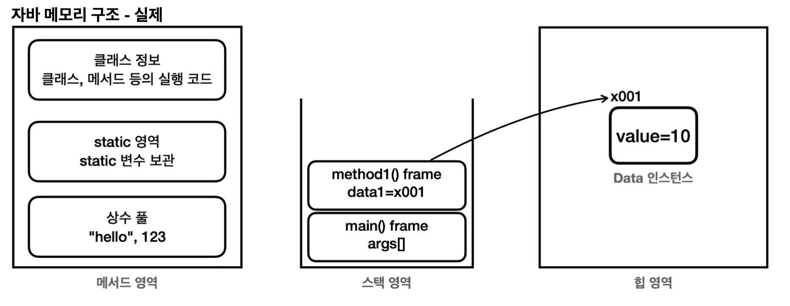
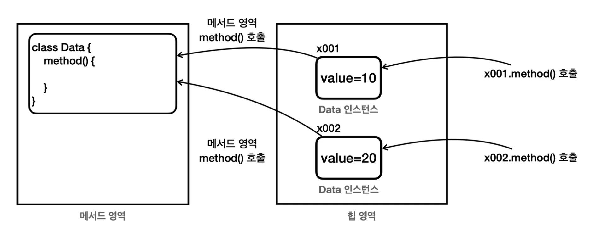
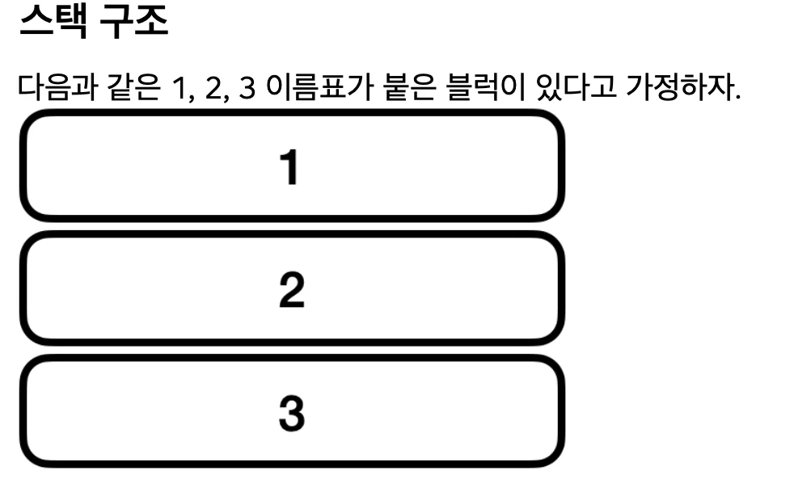

# 자바 메모리 구조

JVM이 프로세스를 시작하면 OS로부터 메모리 블록을 받고, 이를 용도에 따라 나눠 관리한다. 크게 **메서드 영역**, **스택 영역**, **힙 영역** 세 가지다.

<div align="center">
    
</div>

---

## 메서드 영역 (Method Area)

클래스 수준의 데이터를 저장한다. JVM 시작 시 생성되고 모든 스레드가 공유한다.

<div align="center">
    
</div>

저장되는 것들:

- **클래스 정보**: 바이트코드, 필드 정보, 메서드 코드, 생성자 코드
- **static 변수**: `static`으로 선언된 변수
- **런타임 상수 풀**: 리터럴 상수와 심볼릭 레퍼런스

인스턴스 메서드를 호출하면 메서드 영역에 있는 코드를 실행한다. 객체마다 메서드 코드를 복사하는 게 아니다. 필드 데이터만 각 인스턴스별로 힙에 저장된다.

### Metaspace (Java 8 이후)

Java 7까지는 메서드 영역이 힙 안의 **PermGen**에 있었다. PermGen은 고정 크기라 클래스를 많이 로드하면 `java.lang.OutOfMemoryError: PermGen space`가 발생했다. Spring처럼 프록시 클래스를 동적으로 생성하는 프레임워크를 쓰면 이 에러를 자주 만났다.

Java 8부터 PermGen이 사라지고 **Metaspace**로 대체됐다. Metaspace는 힙이 아니라 네이티브 메모리를 사용하고, 기본 크기 제한이 없다. 운영 환경에서는 `MaxMetaspaceSize`를 설정해야 한다. 메모리 누수가 있을 때 서버 전체 메모리를 잡아먹는 걸 막을 수 있다.

```bash
java -XX:MetaspaceSize=128m -XX:MaxMetaspaceSize=256m -jar app.jar
```

---

## 스택 영역 (Stack Area)

메서드 호출 정보를 저장한다. **스레드마다 하나씩** 독립적으로 생성된다.

메서드를 호출하면 **스택 프레임**이 하나 생기고, 메서드가 끝나면 제거된다. 스택 프레임에는 다음이 들어간다:

- **지역 변수**: 메서드 내 선언된 변수와 매개변수
- **오퍼랜드 스택**: 연산 중간 결과를 임시 저장
- **프레임 데이터**: 반환 주소, 예외 처리 정보

### 스택 프레임의 동작

<div align="center">
    
</div>

```java
public class StackExample {
    public static void main(String[] args) {  // 스택 프레임 1 생성
        int result = add(3, 5);                // 스택 프레임 2 생성
        System.out.println(result);
    }  // 스택 프레임 1 제거

    static int add(int a, int b) {
        int sum = a + b;
        return sum;
    }  // 스택 프레임 2 제거 → main으로 돌아감
}
```

스택 크기는 `-Xss`로 조절한다. 기본값은 보통 512KB~1MB다.

```bash
java -Xss1m -jar app.jar
```

---

## 힙 영역 (Heap Area)

`new` 키워드로 생성한 객체와 배열이 저장된다. 모든 스레드가 공유하고, GC가 더 이상 참조되지 않는 객체를 정리한다.

### 힙의 내부 구조

힙은 GC 성능을 위해 세대별로 나뉜다.

```
┌──────────────────────────────────────────────┐
│                  Heap                         │
│                                               │
│  ┌────────────────────────────────────┐      │
│  │         Young Generation           │      │
│  │  ┌────────┬─────────┬─────────┐   │      │
│  │  │  Eden  │   S0    │   S1    │   │      │
│  │  └────────┴─────────┴─────────┘   │      │
│  └────────────────────────────────────┘      │
│                                               │
│  ┌────────────────────────────────────┐      │
│  │         Old Generation             │      │
│  │    (오래 살아남은 객체가 이동)       │      │
│  └────────────────────────────────────┘      │
└──────────────────────────────────────────────┘
```

- **Eden**: 새로 생성된 객체가 처음 할당된다
- **Survivor (S0, S1)**: Minor GC에서 살아남은 객체가 이동한다. 두 영역을 번갈아 사용한다
- **Old Generation**: Survivor에서 여러 번(기본 15회) GC를 견딘 객체가 승격된다

Old Generation이 가득 차면 Major GC(Full GC)가 발생하고 Stop-The-World 시간이 길어진다.

### 힙 크기 설정

```bash
java -Xms512m -Xmx2g -jar app.jar
```

운영 환경에서는 `-Xms`와 `-Xmx`를 같은 값으로 설정하는 경우가 많다. 힙 크기가 동적으로 변할 때 OS에 메모리를 요청하고 반환하는 오버헤드가 생기기 때문이다.

---

## jmap과 jstat으로 메모리 실측하기

영역 구조가 실제로 어떤 크기로 잡혀 있는지는 `jmap -heap`으로 확인한다. OOM 전조 증상이 보이거나 GC 튜닝을 시작할 때 가장 먼저 실행하는 명령이다.

### jmap -heap

```bash
jmap -heap <PID>
```

출력 예시 (Java 17, G1GC, `-Xmx2g`):

```
Heap Configuration:
   MinHeapFreeRatio         = 40
   MaxHeapFreeRatio         = 70
   MaxHeapSize              = 2147483648 (2048.0MB)
   NewSize                  = 1363144 (1.3MB)
   MaxNewSize               = 1287651328 (1228.0MB)
   OldSize                  = 5452592 (5.2MB)
   MetaspaceSize            = 21807104 (20.8MB)
   CompressedClassSpaceSize = 1073741824 (1024.0MB)
   MaxMetaspaceSize         = 17592186044415 MB
   G1HeapRegionSize         = 1048576 (1.0MB)

Heap Usage:
G1 Heap:
   regions  = 2048
   capacity = 2147483648 (2048.0MB)
   used     = 524288000 (500.0MB)
   free     = 1623195648 (1548.0MB)
   24.41% used
G1 Young Generation:
Eden Space:
   regions  = 400
   capacity = 419430400 (400.0MB)
   used     = 209715200 (200.0MB)
   free     = 209715200 (200.0MB)
   50.0% used
Survivor Space:
   regions  = 4
   capacity = 4194304 (4.0MB)
   used     = 4194304 (4.0MB)
   free     = 0 (0.0MB)
   100.0% used
G1 Old Generation:
   regions  = 284
   capacity = 297795584 (284.0MB)
   used     = 296747008 (283.0MB)
   free     = 1048576 (1.0MB)
   99.65% used
```

읽을 때 주목할 부분들:

`G1HeapRegionSize = 1MB`는 힙을 2048개 리전으로 나눠 관리한다는 뜻이다. `G1 Old Generation`의 used가 99.65%면 Full GC 직전 상태다. 여기서 새 객체가 Old Gen으로 승격되면 `Java heap space` OOM이 터진다.

`MaxMetaspaceSize = 17592186044415 MB`는 사실상 제한 없음이다. 운영 환경에서는 `-XX:MaxMetaspaceSize=256m` 식으로 명시적으로 잡아야 한다.

Java 9 이후에는 `jmap -heap`이 deprecated 경고를 내기도 한다. 그 경우 `jhsdb jmap --heap --pid <PID>`를 쓴다.

### jstat -gcutil

GC 활동을 실시간으로 모니터링할 때는 `jstat -gcutil`을 쓴다.

```bash
# 1초(1000ms) 간격으로 10회 출력
jstat -gcutil <PID> 1000 10
```

출력 예시:

```
  S0     S1     E      O      M     CCS    YGC     YGCT    FGC    FGCT     GCT
  0.00  50.00  78.02  45.60  95.24  92.23     12    0.542     1    0.151    0.693
  0.00  50.00  92.15  45.60  95.24  92.23     12    0.542     1    0.151    0.693
  0.00   0.00   4.33  46.80  95.24  92.23     13    0.608     1    0.151    0.759
  0.00  12.00  18.44  46.80  95.24  92.23     13    0.608     1    0.151    0.759
```

각 컬럼의 의미:

| 컬럼 | 설명 |
|---|---|
| S0, S1 | Survivor 0, 1 사용률 (%) |
| E | Eden 사용률 (%) |
| O | Old Generation 사용률 (%) |
| M | Metaspace 사용률 (%) |
| CCS | Compressed Class Space 사용률 (%) |
| YGC | Young GC 발생 횟수 |
| YGCT | Young GC 누적 시간 (초) |
| FGC | Full GC 발생 횟수 |
| FGCT | Full GC 누적 시간 (초) |
| GCT | 전체 GC 누적 시간 (초) |

세 번째 줄을 보면 YGC가 12→13으로 증가하고 E(Eden)가 4.33%로 떨어졌다. Minor GC가 발생해서 Eden이 정리됐다는 뜻이다. O(Old)가 45.60→46.80으로 소폭 증가한 건 이번 Minor GC에서 Old Gen으로 승격된 객체가 생겼기 때문이다.

FGC가 지속적으로 증가하거나 O가 90% 이상을 유지하면 힙 크기를 늘리거나 객체 생존 시간을 줄여야 한다.

---

## OutOfMemoryError 유형별 원인과 재현

OOM이 발생하면 에러 메시지에 어느 영역이 꽉 찼는지가 나온다. 메시지를 무시하고 무조건 `-Xmx`를 늘리는 실수를 자주 본다.

### Java heap space

```
java.lang.OutOfMemoryError: Java heap space
```

힙이 가득 찼다. 원인은 크게 두 가지다:

- 힙 크기 자체가 애플리케이션에 비해 작다
- 메모리 누수로 GC가 수거하지 못하는 객체가 계속 쌓인다

**재현:**

```bash
java -Xms32m -Xmx32m OomHeap
```

```java
import java.util.*;

public class OomHeap {
    public static void main(String[] args) {
        List<byte[]> list = new ArrayList<>();
        while (true) {
            list.add(new byte[1024 * 1024]);  // 1MB씩 계속 할당
        }
    }
}
```

**진단:**

```bash
java -XX:+HeapDumpOnOutOfMemoryError \
     -XX:HeapDumpPath=/tmp/oom.hprof \
     -jar app.jar
```

덤프 파일을 Eclipse MAT으로 열면 어느 객체가 메모리를 점유하는지 확인할 수 있다. MAT의 Leak Suspects 리포트를 먼저 본다.

### Metaspace

```
java.lang.OutOfMemoryError: Metaspace
```

클래스 메타데이터가 Metaspace를 채웠다. 클래스 로더가 동적으로 클래스를 계속 생성하는 경우에 난다. CGLib 기반 프록시(Spring AOP, Hibernate), JSP 서버(JSP 파일마다 서블릿 클래스가 생긴다), Groovy·ByteBuddy 같은 동적 코드 생성 라이브러리가 주범이다.

**재현:**

```bash
java -XX:MaxMetaspaceSize=16m OomMetaspace
```

```java
import javassist.ClassPool;

public class OomMetaspace {
    public static void main(String[] args) throws Exception {
        ClassPool pool = ClassPool.getDefault();
        int i = 0;
        while (true) {
            pool.makeClass("DynClass" + i++).toClass();
        }
    }
}
```

클래스 로더가 GC되지 않으면 로드된 클래스도 Metaspace에서 해제되지 않는다. 웹 앱 재배포 시 이전 클래스 로더가 참조를 붙들고 있으면 Metaspace가 계속 증가한다.

**진단:**

```bash
jstat -gcmetacapacity <PID>
```

### StackOverflowError

```
java.lang.StackOverflowError
```

`OutOfMemoryError`가 아니라 `Error`다. 스택이 가득 찬 것이라 힙과는 무관하다.

종료 조건이 잘못된 재귀, 상호 재귀 호출, 또는 스택 크기가 너무 작게 설정된 경우에 발생한다.

**재현:**

```bash
# 스택 크기를 128KB로 줄여 더 빠르게 재현
java -Xss128k OomStack
```

```java
public class OomStack {
    static void recurse(int depth) {
        recurse(depth + 1);
    }
    public static void main(String[] args) {
        recurse(0);
    }
}
```

기본 스택 크기(~512KB)에서는 수천 단계 재귀 후 발생한다. `-Xss128k`로 줄이면 더 빠르게 재현된다.

주의할 게 있다. 멀티스레드 환경에서 스레드 수가 많고 `-Xss` 값이 크면 전체 메모리 사용량이 급증한다. 스레드 1,000개에 `-Xss1m`이면 스택만 1GB다. 스레드 풀을 많이 쓰는 서버에서 `-Xss`를 무작정 늘리는 건 위험하다.

---

## G1GC의 거대 객체 (Humongous Object)

G1GC는 힙을 고정 크기의 **리전(Region)** 단위로 나눠 관리한다. 리전 크기의 50% 이상인 객체를 **Humongous Object**로 분류하고, Young Generation을 건너뛰어 Old Generation에 직접 할당한다.

리전 크기는 힙 크기에 따라 자동 결정되거나 `-XX:G1HeapRegionSize`로 설정할 수 있다. `-Xmx2g`이면 리전 크기는 보통 1MB다. 즉 **512KB 이상 객체**가 Humongous로 처리된다.

### 왜 GC 빈도가 늘어나나

일반 객체는 Eden에 할당됐다가 Minor GC에서 Young Gen 내에서 정리된다. Humongous Object는 처음부터 Old Gen에 들어간다. Old Gen이 차면 Full GC(Concurrent Mark Cycle)가 시작된다. Humongous Object가 빈번하게 생성되면 Old Gen이 빠르게 차고 GC 사이클이 짧아진다.

Humongous Object는 리전 경계를 넘어 여러 리전을 연속으로 차지한다(Humongous Region). 객체가 해제될 때 이 연속된 리전 전체를 한 번에 반환해야 해서 GC 처리가 복잡해진다.

```
리전 크기 1MB 기준, 1.8MB 객체 할당 시:
┌─────────┬─────────┬─────────┬─────────┐
│  Young  │  Young  │ Humongous Object   │
│ Region  │ Region  │ Region  │ Region  │
│  Eden   │  Eden   │ (시작)  │ (계속)  │
└─────────┴─────────┴─────────┴─────────┘
```

### Humongous 할당 진단

```bash
# GC 로그에서 Humongous allocation 추적
java -Xlog:gc+humongous=debug:file=gc.log:time,level,tags \
     -XX:+UseG1GC \
     -jar app.jar
```

GC 로그에 `Humongous object allocation` 항목이 자주 나오면 해당 객체 크기가 리전 임계값을 넘는다는 뜻이다.

### 대응

리전 크기를 키우면 임계값도 올라간다. 2MB 이상의 객체가 자주 생긴다면 `-XX:G1HeapRegionSize=4m`으로 설정해서 Humongous 분류를 피할 수 있다.

```bash
# 리전 크기를 4MB로 늘림 → 2MB 이상부터 Humongous 처리
java -XX:+UseG1GC -XX:G1HeapRegionSize=4m -jar app.jar
```

단, 리전 크기를 무작정 늘리면 Young Gen 크기가 커지고 Minor GC 당 처리량도 늘어난다. 실제로 Humongous가 문제인지 GC 로그로 확인한 뒤에 조정해야 한다.

큰 배열이나 버퍼를 반복적으로 생성하는 코드가 있다면 객체 재사용이 근본적인 해결책이다. 큰 배열을 루프 밖에서 한 번 생성해 재사용하거나, `ByteBuffer` 풀을 두는 방식으로 Humongous 할당 자체를 줄인다.

---

## 객체 참조 흐름

자바에서 변수에 객체를 대입하면 변수에는 객체 자체가 아니라 **힙에 있는 객체의 참조값**이 저장된다.

```java
public class ReferenceExample {
    public static void main(String[] args) {
        Person p1 = new Person("김철수", 30);  // 힙에 생성, p1은 스택에서 주소 참조
        Person p2 = p1;                         // 참조값만 복사, 같은 객체를 가리킴

        p2.setName("이영희");
        System.out.println(p1.getName());  // "이영희" — 같은 객체이기 때문
    }
}
```

```
스택                          힙
┌──────────────┐         ┌──────────────────┐
│ p1 [0x100]───┼────────▶│ Person           │
├──────────────┤    ┌───▶│ name = "이영희"  │
│ p2 [0x100]───┼────┘    │ age  = 30        │
└──────────────┘         └──────────────────┘
```

기본형 변수는 스택에 값 자체가 저장된다. 참조형 변수는 스택에 주소만 저장되고 실제 데이터는 힙에 있다. 메서드 매개변수로 객체를 넘기면 참조값이 복사되는 것이지 객체가 복사되는 게 아니다. 이 차이를 모르면 원본 객체가 의도치 않게 변경되는 버그를 만들 수 있다.

---

## String Pool

문자열 리터럴은 힙 내의 **String Pool**에 저장된다.

```java
public class StringPoolExample {
    public static void main(String[] args) {
        String s1 = "hello";
        String s2 = "hello";
        System.out.println(s1 == s2);  // true — 같은 Pool 객체 참조

        String s3 = new String("hello");
        System.out.println(s1 == s3);  // false — 별도 힙 객체

        String s4 = s3.intern();
        System.out.println(s1 == s4);  // true — Pool에서 꺼냄
    }
}
```

```
힙 메모리
┌───────────────────────────────────┐
│  String Pool                      │
│  ┌───────────┐                    │
│  │  "hello"  │ ◀── s1, s2, s4    │
│  └───────────┘                    │
│                                    │
│  ┌───────────┐                    │
│  │  "hello"  │ ◀── s3 (별도 객체) │
│  └───────────┘                    │
└───────────────────────────────────┘
```

Java 7부터 String Pool이 힙으로 이동해 GC 대상이 됐다. Java 6까지는 PermGen 안에 있어서 GC가 안 됐다.

`==`로 문자열을 비교하면 참조값을 비교한다. String Pool 덕분에 `true`가 나오는 경우가 있지만 보장되는 동작이 아니다. 문자열 비교는 항상 `equals()`를 써야 한다.

---

## 메모리 할당 과정

`new Person("김철수", 30)` 실행 시 내부 순서:

1. **클래스 로딩 확인**: `Person`이 메서드 영역에 없으면 클래스 로더가 바이트코드를 읽어 올린다
2. **힙에 메모리 확보**: Eden 영역에서 객체 크기만큼 확보한다
3. **메모리 초기화**: 0/null로 초기화한다 (int→0, boolean→false, 참조→null)
4. **객체 헤더 설정**: 클래스 포인터, GC 나이, 해시코드 메타 정보를 기록한다
5. **생성자 실행**: `<init>` 메서드가 실행되어 필드에 값을 대입한다

멀티스레드 환경에서 여러 스레드가 동시에 Eden에 객체를 할당하면 충돌이 발생할 수 있다. 이를 막기 위해 각 스레드에 **TLAB(Thread Local Allocation Buffer)**를 미리 할당하고, 각 스레드는 자기 TLAB 안에서만 객체를 생성한다.

---

## 메모리 누수 패턴

GC가 메모리를 관리하지만, 참조를 놓지 않으면 GC가 수거하지 못한다.

### static 컬렉션에 계속 추가

```java
public class CacheService {
    private static final Map<String, Object> cache = new HashMap<>();

    public void put(String key, Object value) {
        cache.put(key, value);  // 빼는 코드 없으면 계속 쌓임
    }
}
```

크기 제한 없는 캐시를 직접 구현하면 이런 문제가 생긴다. `LinkedHashMap`의 `removeEldestEntry()`를 오버라이드하거나 Caffeine을 쓰는 게 낫다.

### 덤프 분석 흐름

```bash
# 힙 덤프 생성
jmap -dump:format=b,file=heap.hprof <PID>

# OOM 발생 시 자동 덤프
java -XX:+HeapDumpOnOutOfMemoryError \
     -XX:HeapDumpPath=/tmp/oom-dump.hprof \
     -jar app.jar
```

덤프 파일은 Eclipse MAT이나 VisualVM으로 분석한다. MAT의 Leak Suspects 리포트가 누수 원인을 찾아준다.

---

## GC 알고리즘 선택

| GC | Java 버전 | 특징 | 적합한 상황 |
|---|---|---|---|
| G1GC | 9+ 기본 | 힙을 리전 단위로 관리, STW 시간 예측 가능 | 대부분의 서버 애플리케이션 |
| ZGC | 15+ | STW 10ms 이하, 대용량 힙 지원 | 지연 시간에 민감한 서비스 |
| Parallel GC | 전 버전 | 처리량 우선 | 배치 처리, 대량 데이터 연산 |
| Shenandoah | OpenJDK | ZGC와 유사 | OpenJDK 기반 환경 |

```bash
# GC 로그 (Java 9+)
java -Xlog:gc*:file=gc.log:time,level,tags -jar app.jar
```

Full GC가 자주 발생하면 힙 크기가 부족하거나 Old Generation으로 넘어가는 객체가 많다는 뜻이다. `-Xmx`를 늘리거나 객체 생존 시간을 줄이는 방향으로 코드를 수정한다.
