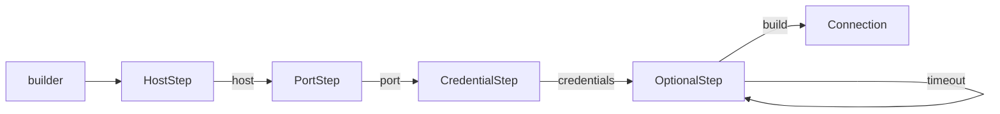

# Java Builder Pattern 심화

기본 빌더와 `@Builder`, `@Builder.Default`, `@NoArgsConstructor` 조합은 별도 문서에서 다뤘다. 여기서는 실무에서 한 단계 더 들어갔을 때 자주 막히는 부분만 정리한다. 컬렉션 누적 처리, 복사-후-변경, 컴파일 타임 필수값 강제, 상속 계층에서의 타입 유지, 그리고 빌더를 공유했을 때 터지는 동시성 문제다.

---

## @Singular — 컬렉션 필드 누적과 불변 컬렉션

리스트나 맵을 받는 빌더를 그냥 만들면 호출하는 쪽에서 컬렉션을 미리 만들어 넘겨야 한다.

```java
@Builder
public class Article {
    private final String title;
    private final List<String> tags;
}

Article article = Article.builder()
    .title("빌더 패턴")
    .tags(List.of("java", "design-pattern"))  // 리스트를 직접 조립해서 넘김
    .build();
```

원소를 하나씩 추가하고 싶거나, 빌드된 객체의 컬렉션을 불변으로 고정하고 싶으면 `@Singular`를 붙인다.

```java
@Builder
public class Article {
    private final String title;

    @Singular
    private final List<String> tags;

    @Singular
    private final Map<String, String> attributes;
}
```

`@Singular`를 붙이면 Lombok이 필드 하나당 세 개의 메서드를 만든다. 단수 추가(`tag`), 복수 일괄 추가(`tags`), 전체 비우기(`clearTags`)다.

```java
Article article = Article.builder()
    .title("빌더 패턴")
    .tag("java")               // 하나씩 추가
    .tag("design-pattern")
    .attribute("author", "kim") // 맵은 키-값 한 쌍씩
    .build();
```

### 빌드된 컬렉션은 불변이다

`@Singular`로 만든 컬렉션은 `build()` 시점에 불변으로 고정된다. 원소 개수에 따라 내부 구현이 달라지는데(0개면 빈 컬렉션, 1개면 단일 원소 컬렉션, 그 이상이면 unmodifiable 래퍼), 공통점은 수정하면 예외가 난다는 것이다.

```java
article.getTags().add("spring");
// java.lang.UnsupportedOperationException
```

이게 `@Singular`를 쓰는 실질적인 이유다. DTO나 Value Object를 불변으로 만들 때 컬렉션 필드만 가변으로 새는 경우가 흔한데, `@Singular`는 그 구멍을 막는다. 직접 `Collections.unmodifiableList()`로 감쌀 필요가 없다.

부수 효과로 NPE도 줄어든다. `tag()`를 한 번도 호출하지 않아도 `getTags()`는 `null`이 아니라 빈 리스트를 돌려준다. 컬렉션을 순회하기 전에 `null` 체크를 넣는 습관이 있다면 `@Singular` 필드에는 필요 없다.

### 복수 메서드는 교체가 아니라 추가다

여기서 한 번씩 당한다. 복수형 메서드(`tags`)는 기존 원소를 갈아끼우는 게 아니라 뒤에 덧붙인다.

```java
Article article = Article.builder()
    .tag("java")
    .tags(List.of("spring", "jpa"))  // 교체가 아니라 추가
    .build();
// tags = [java, spring, jpa]
```

`tags(...)`가 setter처럼 보여서 앞에서 넣은 `java`가 사라질 거라 기대하면 결과가 어긋난다. 진짜로 비우고 다시 채우려면 `clearTags()`를 먼저 부른다.

```java
Article article = Article.builder()
    .tag("java")
    .clearTags()
    .tags(List.of("spring", "jpa"))
    .build();
// tags = [spring, jpa]
```

### 단복수 네이밍 함정

Lombok은 필드명에서 영어 단수형을 자동으로 뽑아낸다. `tags` → `tag`, `entries` → `entry`처럼 규칙적인 복수형은 알아서 처리한다. 문제는 단수형을 추론하지 못하는 이름이다.

```java
@Singular
private final List<String> data;   // 컴파일 에러
```

```
@Singular cannot find a singular form for "data".
Please specify the singular form explicitly (i.e. @Singular("datum")).
```

`data`, `info`, `metadata`처럼 영어 규칙으로 단수화가 안 되는 이름은 단수형을 직접 지정해야 한다.

```java
@Singular("datum")
private final List<String> data;
```

이러면 단수 추가는 `datum(String)`, 복수 추가는 필드명 그대로 `data(Collection)`이 된다. 한글 필드명이나 의미상 단복수가 같은 영어 단어(`series`, `species`)도 같은 이유로 명시가 필요하다.

한 가지 더, `@Singular`는 표준 `java.util` 컬렉션과 Guava 컬렉션만 지원한다. 직접 만든 커스텀 컬렉션 타입에는 못 붙인다. 필드 타입이 `List`, `Set`, `Map`, `SortedMap` 같은 인터페이스여야 하고 구현체를 직접 지정하면 동작이 제한된다.

---

## @Builder(toBuilder = true) — 복사 후 일부만 변경

불변 객체를 쓰다 보면 "한 필드만 바꾼 새 객체"가 필요해진다. 모든 필드가 `final`이라 setter는 없고, 그렇다고 `builder()`로 처음부터 다시 조립하면 안 바꾸는 필드까지 전부 다시 넣어야 한다. `toBuilder = true`가 이걸 해결한다.

```java
@Builder(toBuilder = true)
public class UserInfo {
    private final String id;
    private final String email;
    private final String name;
}
```

`toBuilder()`는 현재 객체의 모든 필드값을 미리 채운 빌더를 돌려준다. 바꿀 필드만 다시 호출하고 빌드하면 된다.

```java
UserInfo original = UserInfo.builder()
    .id("U-1").email("old@example.com").name("kim")
    .build();

UserInfo updated = original.toBuilder()
    .email("new@example.com")  // 이메일만 교체
    .build();

// updated: id=U-1, email=new@example.com, name=kim
// original은 그대로 (불변이므로 영향 없음)
```

엔티티 갱신, 이벤트 객체 변형, 테스트 픽스처 변주 같은 데서 자주 쓴다. 특히 도메인 이벤트나 커맨드 객체를 불변으로 두고 일부 필드만 바꿔 파생시킬 때 코드가 짧아진다.

### 함정 1: @Singular와 함께 쓰면 컬렉션이 누적된다

`toBuilder()`는 기존 컬렉션 원소를 빌더에 그대로 복사한다. 여기에 `tag()`를 또 부르면 교체가 아니라 추가다.

```java
@Builder(toBuilder = true)
public class Article {
    @Singular private final List<String> tags;
}

Article a = Article.builder().tag("java").tag("spring").build();
Article b = a.toBuilder().tag("jpa").build();
// b.tags = [java, spring, jpa]  ← 기존 두 개가 남아있음
```

"빌더를 다시 열었으니 비어 있겠지"라고 생각하면 어긋난다. 태그 목록을 통째로 교체하려는 의도라면 `clearTags()`를 먼저 부른다.

```java
Article c = a.toBuilder().clearTags().tag("jpa").build();
// c.tags = [jpa]
```

### 함정 2: 얕은 복사다

`toBuilder()`는 필드 참조만 복사한다. 깊은 복사가 아니다. `@Singular`가 아닌 일반 가변 컬렉션이나 가변 객체를 필드로 들고 있으면, 원본과 사본이 같은 인스턴스를 가리킨다.

```java
@Builder(toBuilder = true)
public class Order {
    private final List<String> items;  // @Singular 아님, 그냥 List
}

Order o1 = Order.builder()
    .items(new ArrayList<>(List.of("item-1")))
    .build();

Order o2 = o1.toBuilder().build();  // 필드를 안 건드림

o2.getItems().add("item-2");
// o1.getItems()도 [item-1, item-2]  ← 같은 ArrayList를 공유
```

`o2`만 바꿨는데 `o1`까지 바뀐다. 불변 객체라고 믿고 쓰다가 이런 식으로 새는 경우가 실무에서 제일 잡기 어렵다. 해결책은 컬렉션 필드를 `@Singular`로 바꿔 빌드 시점에 불변으로 고정하거나, 애초에 가변 객체를 필드로 두지 않는 것이다.

### 함정 3: @Builder.Default와의 버전 의존성

`@Builder.Default`로 기본값을 잡은 필드를 `toBuilder()`로 복사할 때, 과거 Lombok 버전에서는 기본값이 누락되거나 원래 값이 아니라 디폴트로 되돌아가는 버그가 있었다. 최근 버전에서는 정리됐지만, 낮은 버전을 쓰는 레거시 프로젝트라면 `toBuilder().build()` 결과에서 기본값 필드가 의도대로 유지되는지 한 번 확인하고 넘어가는 게 안전하다.

```java
@Builder(toBuilder = true)
public class Config {
    @Builder.Default
    private final int retry = 3;
    private final String url;
}

Config c1 = Config.builder().url("http://a").build();   // retry=3
Config c2 = c1.toBuilder().url("http://b").build();      // retry=3 유지되는지 확인
```

`retry`를 명시적으로 다시 설정하지 않았을 때 `c2.retry`가 3으로 남는지, 0으로 떨어지는지가 버전에 따라 갈렸던 지점이다.

---

## Step (Staged) Builder — 컴파일 타임 필수값 강제

`@Builder`나 일반 빌더는 모든 메서드가 같은 빌더 타입을 돌려준다. 그래서 필수 필드를 빼먹어도 컴파일은 통과하고, 런타임에 `build()` 안에서 검증 예외가 나야 비로소 안다.

```java
Order.builder().build();  // 컴파일 OK, 실행 시점에야 IllegalStateException
```

필수값을 컴파일러가 막게 하려면 단계별 인터페이스를 직접 만든다. 각 단계가 다음 단계 인터페이스만 노출하면, 호출 순서가 강제되고 필수 메서드를 건너뛸 수 없게 된다.

```java
public class Connection {
    private final String host;
    private final int port;
    private final String username;
    private final String password;
    private final int timeout;

    private Connection(Builder builder) {
        this.host = builder.host;
        this.port = builder.port;
        this.username = builder.username;
        this.password = builder.password;
        this.timeout = builder.timeout;
    }

    // 각 단계는 다음에 호출할 수 있는 메서드만 드러낸다
    public interface HostStep { PortStep host(String host); }
    public interface PortStep { CredentialStep port(int port); }
    public interface CredentialStep { OptionalStep credentials(String user, String pass); }
    public interface OptionalStep {
        OptionalStep timeout(int timeout);  // 선택값은 같은 단계에 둔다
        Connection build();                 // 모든 필수값을 채운 뒤에만 build 노출
    }

    public static HostStep builder() {
        return new Builder();
    }

    private static class Builder
            implements HostStep, PortStep, CredentialStep, OptionalStep {
        private String host;
        private int port;
        private String username;
        private String password;
        private int timeout = 3000;  // 선택값 기본값

        @Override public PortStep host(String host) {
            this.host = host;
            return this;
        }
        @Override public CredentialStep port(int port) {
            this.port = port;
            return this;
        }
        @Override public OptionalStep credentials(String user, String pass) {
            this.username = user;
            this.password = pass;
            return this;
        }
        @Override public OptionalStep timeout(int timeout) {
            this.timeout = timeout;
            return this;
        }
        @Override public Connection build() {
            return new Connection(this);
        }
    }
}
```

호출하는 쪽은 정해진 순서를 따를 수밖에 없다.

```java
Connection conn = Connection.builder()
    .host("localhost")          // HostStep → PortStep
    .port(5432)                 // PortStep → CredentialStep
    .credentials("admin", "pw") // CredentialStep → OptionalStep
    .timeout(5000)              // OptionalStep → OptionalStep (선택)
    .build();
```

필수값을 빠뜨리면 컴파일이 안 된다.

```java
Connection.builder().build();
// 컴파일 에러: HostStep에는 build()가 없다

Connection.builder().host("localhost").build();
// 컴파일 에러: PortStep에는 build()가 없다
```

단계 흐름은 이렇게 생겼다.



선택값(`timeout`)은 마지막 `OptionalStep`에 모아두고 자기 자신을 돌려주게 해서, 부르든 안 부르든 `build()`로 갈 수 있게 한다.

### 언제 쓰고 언제 피하나

장점은 분명하다. 필수값 누락을 런타임이 아니라 빌드 타임에 잡는다. IDE 자동완성도 다음 단계 메서드만 보여줘서 잘못 부를 여지가 적다.

대가도 분명하다. 필드 하나당 인터페이스가 하나씩 늘어 보일러플레이트가 많다. 필드 순서를 바꾸거나 필수/선택을 조정하면 인터페이스 구조를 다시 짜야 한다. Lombok은 이 방식을 생성해주지 않으니 전부 손으로 써야 한다.

필수 필드가 두세 개로 적고, 그 객체가 시스템 경계에서 반드시 올바르게 만들어져야 하는 경우(외부 연결 설정, 결제 요청 같은 것)에 값어치가 있다. 필드가 많거나 자주 바뀌는 일반 DTO에는 유지보수 비용이 더 크다. 그런 데는 `@Builder` + `build()` 검증이 현실적이다.

---

## 재귀 제네릭 빌더 — 상속 계층에서 타입 유지

상속 구조에서 빌더를 직접 구현하면 메서드 체이닝이 부모 타입으로 떨어지는 문제가 생긴다. 부모 빌더의 메서드가 부모 빌더 타입을 돌려주니, 그 뒤에 자식 빌더 메서드를 이어 부를 수 없다.

```java
// self() 없이 부모 빌더 메서드가 Vehicle.Builder를 돌려준다면
Car.builder()
    .manufacturer("Hyundai")  // Vehicle.Builder 반환
    .doors(4)                 // 컴파일 에러: Vehicle.Builder에 doors()가 없다
    .build();
```

재귀 제네릭(self-referential generics)으로 부모 빌더가 "자기를 상속한 실제 타입"을 돌려주게 만들면 해결된다. 타입 파라미터 `T extends Builder<T>`와 추상 `self()`가 핵심이다.

```java
public abstract class Vehicle {
    private final String manufacturer;
    private final int wheels;

    protected Vehicle(Builder<?> builder) {
        this.manufacturer = builder.manufacturer;
        this.wheels = builder.wheels;
    }

    public abstract static class Builder<T extends Builder<T>> {
        private String manufacturer;
        private int wheels;

        public T manufacturer(String manufacturer) {
            this.manufacturer = manufacturer;
            return self();   // 부모 타입이 아니라 실제 하위 타입을 돌려준다
        }
        public T wheels(int wheels) {
            this.wheels = wheels;
            return self();
        }

        protected abstract T self();      // 하위 빌더가 자신을 반환하도록 강제
        public abstract Vehicle build();  // 하위에서 구체 타입으로 빌드
    }
}
```

```java
public class Car extends Vehicle {
    private final int doors;

    private Car(Builder builder) {
        super(builder);
        this.doors = builder.doors;
    }

    public static Builder builder() {
        return new Builder();
    }

    public static class Builder extends Vehicle.Builder<Builder> {
        private int doors;

        public Builder doors(int doors) {
            this.doors = doors;
            return this;
        }
        @Override protected Builder self() { return this; }
        @Override public Car build() { return new Car(this); }
    }
}
```

이제 부모 메서드를 먼저 부르든 자식 메서드를 먼저 부르든 체인이 끊기지 않는다.

```java
Car car = Car.builder()
    .manufacturer("Hyundai")  // self()가 Car.Builder를 반환
    .wheels(4)
    .doors(4)                 // 여전히 Car.Builder라 호출된다
    .build();

// 순서를 섞어도 동작한다
Car car2 = Car.builder()
    .doors(2)
    .manufacturer("Kia")
    .wheels(4)
    .build();
```

`self()`를 추상 메서드로 두는 대신 부모에서 `return (T) this;`로 캐스팅하는 구현도 있다. 동작은 같지만 unchecked 캐스트 경고가 붙고, 하위 빌더가 `self()` 반환을 잘못 구현해도 컴파일러가 못 잡는다. 추상 `self()`를 하위에서 `return this;`로 구현하게 강제하는 쪽이 더 안전하다.

### @SuperBuilder가 만들어주는 것

`@SuperBuilder`는 위에서 손으로 짠 재귀 제네릭 빌더를 코드 생성으로 대신한다. 다만 타입 파라미터가 둘이다. 빌더 타입과 빌드 결과 클래스 타입을 함께 받는다. 생성되는 부모 빌더 시그니처는 대략 이런 모양이다.

```java
// @SuperBuilder가 내부적으로 생성하는 형태 (개념적 표현)
public abstract static class VehicleBuilder<
        C extends Vehicle,
        B extends VehicleBuilder<C, B>> {
    protected abstract B self();
    public abstract C build();
    // 각 필드의 setter는 B를 반환
}
```

하위 클래스에는 `CarBuilderImpl` 같은 구체 빌더가 생성돼서 `self()`와 `build()`를 채운다. 직접 구현에서 `self()`를 추상으로 두고 leaf에서 구현했던 것과 똑같은 구조다.

기본 `@Builder`가 상속에서 깨지는 이유도 여기서 드러난다. `@Builder`는 정적 빌더 하나만 만들 뿐 하위 클래스 필드를 체인에 끼울 방법이 없다. 그래서 부모에 `@Builder`, 자식에 `@Builder`를 따로 붙이면 자식 빌더가 부모 필드를 못 받아 컴파일이 깨진다. `@SuperBuilder`는 재귀 제네릭으로 부모-자식 빌더를 한 체인으로 묶어 그 문제를 푼다. 계층의 모든 레벨에 `@SuperBuilder`를 붙여야 하는 것도, 각 레벨이 자기 필드를 공유 빌더 체인에 기여하고 leaf에서 `self()`/`build()`를 확정해야 하기 때문이다.

직접 구현은 Lombok을 못 쓰는 환경이거나, 빌더에 코드 생성으로 표현 못 하는 커스텀 로직이 들어가야 할 때만 손대면 된다. 그 외에는 `@SuperBuilder`로 충분하다. 손으로 짠 재귀 제네릭 빌더는 한 번 보면 이해되지만 유지보수할 때 타입 파라미터를 따라가기가 번거롭다.

---

## 빌더 스레드 안전성과 가변 상태 공유

빌더 인스턴스는 가변 객체다. 필드를 하나씩 채워나가는 게 빌더의 동작 자체라서, 본질적으로 스레드 안전하지 않다. 반면 잘 만든 빌드 결과물(모든 필드 `final`, 컬렉션은 `@Singular`로 불변)은 스레드 안전하다. 안전한 건 결과물이지 빌더가 아니다. 이 구분을 놓치면 사고가 난다.

### 빌더를 필드로 공유하면 터진다

제일 흔한 실수가 빌더를 싱글톤 빈의 필드에 보관하고 재사용하는 것이다.

```java
// 안티패턴: 싱글톤 빈이 빌더 인스턴스를 필드로 들고 있다
@Component
public class RequestFactory {
    private final SomeRequest.SomeRequestBuilder builder = SomeRequest.builder();

    public SomeRequest create(String id) {
        return builder.id(id).build();  // 동시 요청 시 id가 섞인다
    }
}
```

Spring 빈은 기본이 싱글톤이라 모든 요청이 같은 `RequestFactory` 인스턴스, 곧 같은 `builder`를 쓴다. 두 요청이 거의 동시에 `create()`에 들어오면 이런 순서가 가능하다.

```
스레드 A: builder.id("A-1")  → builder.id 필드 = "A-1"
스레드 B: builder.id("B-2")  → builder.id 필드 = "B-2"  (A의 값 덮어씀)
스레드 A: build()           → id="B-2"  (A가 만든 객체에 B의 id가 들어감)
스레드 B: build()           → id="B-2"
```

A가 만든 객체에 B의 데이터가 섞여 나온다. 평소엔 멀쩡하다가 부하가 몰릴 때만 가끔 데이터가 어긋나는, 재현이 까다로운 버그가 된다. 해결은 단순하다. 빌더를 메서드 안에서 매번 새로 만든다.

```java
@Component
public class RequestFactory {
    public SomeRequest create(String id) {
        return SomeRequest.builder()  // 호출마다 새 빌더
            .id(id)
            .build();
    }
}
```

`SomeRequest.builder()`는 호출할 때마다 새 인스턴스를 돌려주므로 스레드 간 상태 공유가 없다. 정적 팩터리 메서드가 빌더를 돌려주는 패턴이 안전한 것도 같은 이유다.

### 단일 스레드 재사용도 안전하지 않다

동시성과 별개로, 한 스레드 안에서 빌더를 재사용하는 것도 위험하다. 빌더는 직전 빌드의 상태를 그대로 들고 있다.

```java
SomeRequest.SomeRequestBuilder builder = SomeRequest.builder().userId("U-1");
SomeRequest a = builder.productId("P-1").build();
SomeRequest b = builder.productId("P-2").build();
```

`b`를 만들 때 `userId`는 다시 안 넣었지만 빌더에 `U-1`이 남아 있어 그대로 들어간다. 의도였다면 다행이고, 아니라면 버그다. `@Singular` 컬렉션이 끼면 더 헷갈린다. 앞서 본 대로 복수/단수 추가 메서드는 누적이라서, 재사용한 빌더에 원소를 더 넣으면 이전 빌드의 원소까지 그대로 합쳐진다.

```java
Article.ArticleBuilder builder = Article.builder().tag("java");
Article a = builder.build();              // tags = [java]
Article b = builder.tag("spring").build(); // tags = [java, spring]  ← java가 남아있음
```

원칙은 하나다. 빌드 한 번에 빌더 하나. 빌더를 변수에 담아 돌려쓰지 말고 객체 하나당 `builder()`부터 새로 시작한다. 이렇게 하면 동시성 문제도, 상태 잔존 문제도 같이 사라진다.

### 정리

빌더 자체는 동기화 대상이 아니다. 락을 걸어 스레드 안전하게 만들 게 아니라, 애초에 공유하지 않는 게 정답이다. 만들고-쓰고-버리는(생성 즉시 빌드하고 참조를 버리는) 일회용으로 다루면 동시성을 고민할 일이 없다. 공유가 필요한 건 빌더가 아니라 불변인 빌드 결과물이고, 그건 `final` 필드와 `@Singular` 불변 컬렉션으로 이미 안전하게 만들어 둘 수 있다.
