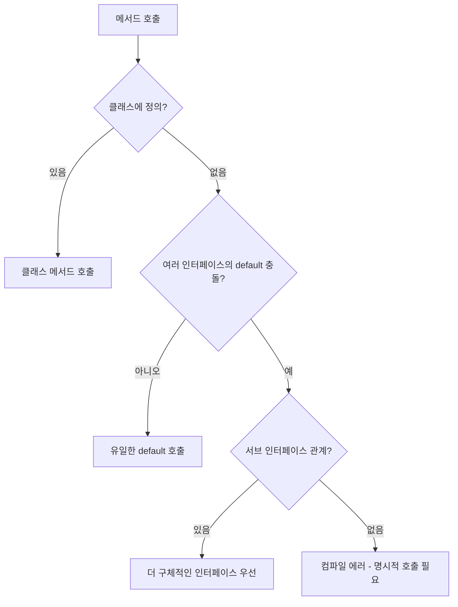

## 추상 클래스와 인터페이스가 갈라진 이유

Java에서 추상화를 표현하는 도구는 두 가지다. 추상 클래스(`abstract class`)와 인터페이스(`interface`)는 비슷해 보이지만 출발점이 다르다. 추상 클래스는 "공통 구현을 일부 갖춘 미완성 부모"이고, 인터페이스는 "구현체가 따라야 하는 계약"이다. 이 차이는 단순히 문법 차이가 아니라 설계 철학에서 비롯된다.

Java가 단일 상속만 허용한다는 제약은 이 분리의 직접적인 원인이다. C++처럼 다중 상속을 허용하면 다이아몬드 문제(같은 조상 메서드를 두 부모가 각자 오버라이드한 경우 어느 쪽을 쓸지 모호해지는 현상)에 부딪힌다. Java는 클래스 상속을 단일로 묶고, 다중 구현은 인터페이스로 풀었다. 그래서 처음 인터페이스는 메서드 시그니처만 나열한 순수 계약이었다.

이 구도가 흔들린 게 Java 8이다. `default` 메서드가 도입되면서 인터페이스도 구현을 가질 수 있게 됐고, 두 개념의 경계가 흐려졌다. 그 이후 실무에서 "이건 추상 클래스로 짜야 하나, 인터페이스로 짜야 하나" 고민이 본격적으로 등장한다.

---

## Java 8 default 메서드는 왜 만들어졌나

`Collection` 인터페이스에 `stream()` 메서드를 추가해야 한다고 가정해 보자. Java 7까지의 규칙대로라면 인터페이스에 메서드를 추가하는 순간 그 인터페이스를 구현한 모든 클래스가 컴파일 오류로 깨진다. JDK 내부의 `ArrayList`, `HashSet`은 물론 외부 라이브러리에 존재하는 수만 개의 구현체까지 전부 다.

이 문제를 해결하려고 도입한 게 `default` 메서드다. 인터페이스에 기본 구현을 두면 기존 구현체는 손대지 않아도 컴파일된다. Java 8에서 `Stream` API를 도입하면서 컬렉션 프레임워크를 깨뜨리지 않은 게 이 메커니즘 덕분이다.

```java
public interface Collection<E> extends Iterable<E> {
    default Stream<E> stream() {
        return StreamSupport.stream(spliterator(), false);
    }

    default boolean removeIf(Predicate<? super E> filter) {
        Objects.requireNonNull(filter);
        boolean removed = false;
        Iterator<E> each = iterator();
        while (each.hasNext()) {
            if (filter.test(each.next())) {
                each.remove();
                removed = true;
            }
        }
        return removed;
    }
}
```

`default` 메서드는 "인터페이스의 진화 도구"로 도입된 것이지, 추상 클래스를 대체하려는 목적이 아니었다. 이 점을 잊으면 인터페이스에 비즈니스 로직을 잔뜩 넣는 실수를 저지른다. 인터페이스의 `default`는 어디까지나 호환성을 유지하면서 새 메서드를 추가하기 위한 장치라는 시각이 안전하다.

### Java 8 static, Java 9 private 메서드

같은 흐름에서 인터페이스는 `static` 메서드(Java 8)와 `private` 메서드(Java 9)를 차례로 받아들였다.

`static` 메서드는 인터페이스에 종속된 유틸리티를 모아두기 위해 추가됐다. `Stream.of(...)`, `List.of(...)`, `Comparator.comparing(...)` 같은 팩토리 메서드가 대표적이다. 이전에는 `Streams`, `Collections` 같은 별도 유틸 클래스를 둬야 했는데, 인터페이스 자체에 정적 메서드를 두면서 그 관습이 사라졌다.

`private` 메서드는 `default` 메서드가 늘어나면서 발생한 코드 중복을 풀기 위해 도입됐다. 여러 `default` 메서드가 공통 로직을 공유할 때 그 공통 부분을 `private` 메서드로 빼낸다. `private`이므로 인터페이스 외부에는 노출되지 않는다.

```java
public interface Logger {
    default void info(String message) {
        log("INFO", message);
    }

    default void warn(String message) {
        log("WARN", message);
    }

    default void error(String message) {
        log("ERROR", message);
    }

    private void log(String level, String message) {
        System.out.printf("[%s] %s%n", level, message);
    }
}
```

이런 변화는 인터페이스를 "메서드만 모아둔 명세서"에서 "구현 일부를 제공하는 행위 모음"으로 바꿔놓았다. 다만 인터페이스는 여전히 상태(인스턴스 필드)를 갖지 못한다는 한계가 있다. 이 부분은 뒤에서 다시 다룬다.

---

## 다이아몬드 문제와 default 메서드 충돌

`default` 메서드가 들어오자 다중 상속에 가까운 상황이 발생한다. 한 클래스가 두 개 이상의 인터페이스를 구현하고, 그 인터페이스들이 동일한 시그니처의 `default` 메서드를 가진다면 어느 쪽이 호출될까. Java는 이 모호함을 컴파일 타임에 잡아내고, 명확한 우선순위 규칙을 정의했다.



규칙은 세 가지다.

첫 번째, **클래스가 항상 우선한다**. 클래스에 정의된 메서드(상속받은 슈퍼클래스 포함)가 인터페이스 `default`보다 우선한다. 슈퍼클래스의 메서드와 인터페이스 `default`가 충돌하면 슈퍼클래스의 것이 이긴다. 이 규칙은 Java 8 이전부터 동작하던 코드의 동작이 바뀌지 않도록 보장한다.

두 번째, **더 구체적인 서브 인터페이스가 우선한다**. 두 인터페이스가 상속 관계라면 자식 인터페이스의 `default`가 부모 인터페이스의 `default`를 덮는다.

세 번째, 위 두 규칙으로도 모호함이 해소되지 않으면 **컴파일 에러가 나며, 구현 클래스가 명시적으로 어느 쪽을 호출할지 골라야 한다**.

```java
interface A {
    default String greet() {
        return "Hello from A";
    }
}

interface B {
    default String greet() {
        return "Hello from B";
    }
}

class C implements A, B {
    @Override
    public String greet() {
        return A.super.greet() + " / " + B.super.greet();
    }
}
```

`A.super.greet()` 같은 문법은 일상적으로 쓸 일이 거의 없다. 실무에서 이게 등장하면 대부분 설계가 잘못된 신호다. 같은 시그니처를 가진 두 인터페이스를 한 클래스가 동시에 구현해야 한다면, 인터페이스를 다시 쪼개거나 `default` 구현을 제거하는 쪽이 낫다.

---

## 추상 클래스와 인터페이스 비교

| 항목 | 추상 클래스 | 인터페이스 |
|------|-------------|------------|
| 키워드 | `abstract class` | `interface` |
| 다중 상속/구현 | 단일 상속만 | 다중 구현 가능 |
| 메서드 구현 | 구현/추상 메서드 자유롭게 혼합 | Java 8+ `default`/`static`, Java 9+ `private` |
| 인스턴스 필드 | 모든 종류 가능 | 불가능 (`public static final` 상수만) |
| 생성자 | 선언 가능 (서브 클래스에서 `super(...)` 호출) | 선언 불가 |
| 접근 제한자 | `public`, `protected`, `package-private`, `private` 모두 | 메서드는 `public`이 기본 (`private` default 메서드는 예외) |
| 의도 | "is-a" 관계, 공통 구현 공유 | "can-do" 관계, 행위 계약 |
| 호환성 | 기존 클래스 계층에 끼워 넣기 어려움 | 기존 클래스에 추가로 구현시키기 쉬움 |

기존 문서의 "속도" 비교는 부정확해서 제거했다. JIT 컴파일러가 인라인 캐시와 인라이닝을 적용하기 때문에 일반적인 경우 인터페이스 호출과 추상 클래스 호출의 성능 차이는 무시 가능하다. 마이크로 벤치마크에서 측정 가능한 차이가 나오긴 하지만 애플리케이션 레벨에서는 거의 의미가 없다. 둘 중 무엇을 고를지의 기준은 성능이 아니라 설계 의도여야 한다.

---

## 인터페이스가 상태를 못 가지는 이유

인터페이스에 인스턴스 필드(`int count = 0;` 같은 비-`final` 변수)를 선언할 수 없다. 이건 단순한 문법 제약이 아니라 다중 구현을 안전하게 하기 위한 설계 결정이다.

만약 인터페이스에 인스턴스 필드를 허용하면 한 클래스가 두 인터페이스를 구현했을 때 두 개의 독립된 상태를 갖게 된다. 어느 인터페이스의 메서드가 어느 필드를 보는지 추적이 어려워진다. C++의 다이아몬드 상속이 가진 문제와 같은 종류의 문제가 인터페이스에서도 재현되는 셈이다. Java는 이 복잡도를 받아들이지 않기로 했다.

대신 우회 방법은 몇 가지 있다.

```java
public interface Cacheable {
    default String cacheKey() {
        return getClass().getSimpleName() + ":" + identifier();
    }

    String identifier();
}
```

상태가 필요한 부분은 추상 메서드로 위임한다. 위 예시에서 `identifier()`는 구현 클래스가 자신의 필드를 활용해 응답한다. 인터페이스는 그 결과를 조합해 `cacheKey()`를 만든다.

좀 더 본격적으로 상태를 다뤄야 한다면 `ThreadLocal`이나 `WeakHashMap`을 외부에 두는 방식, 혹은 인터페이스 + 추상 클래스 조합으로 풀 수도 있다. 하지만 이런 패턴이 등장한다는 건 인터페이스가 아니라 추상 클래스가 적절했다는 신호일 가능성이 크다.

---

## 선택 기준: 실제 도메인으로 보기

### Repository는 왜 인터페이스인가

데이터 접근 계층은 거의 항상 인터페이스로 정의한다. 이유는 두 가지다.

첫 번째, 구현체를 갈아끼울 수 있어야 한다. 같은 `OrderRepository` 계약을 JPA 구현체, MyBatis 구현체, 인메모리 테스트용 구현체가 모두 만족할 수 있어야 한다. 추상 클래스로 만들면 이 자유도가 사라진다.

```java
public interface OrderRepository {
    Order save(Order order);
    Optional<Order> findById(Long id);
    List<Order> findByCustomerId(Long customerId);
}
```

두 번째, 의존성 역전 원칙이다. 도메인 계층이 `OrderRepository` 인터페이스를 정의하고, 인프라 계층이 그것을 구현한다. 도메인이 인프라를 모르는 구조를 만들려면 추상 클래스보다 인터페이스가 자연스럽다.

### Service는 인터페이스가 꼭 필요한가

여기서 의견이 갈린다. 한때 모든 Service를 `XxxService` 인터페이스 + `XxxServiceImpl` 클래스로 짜는 관행이 일반적이었다. Spring AOP가 JDK 동적 프록시를 쓰려면 인터페이스가 필요했기 때문이다.

지금은 그 이유가 약해졌다. Spring은 CGLIB로 클래스 프록시도 만들 수 있고, 실제로 구현체가 하나뿐인 경우가 대부분이라 인터페이스가 형식적인 껍데기가 된다. 그래서 최근에는 Service를 그냥 클래스로 짜고, 정말 여러 구현이 필요할 때만 인터페이스를 도입하는 쪽이 늘었다.

```java
@Service
@RequiredArgsConstructor
public class OrderService {
    private final OrderRepository orderRepository;
    private final PaymentGateway paymentGateway;

    public Order placeOrder(OrderCommand command) {
        // 비즈니스 로직
    }
}
```

### EventListener는 인터페이스 + default 조합

이벤트 리스너처럼 "관심 있는 메서드만 골라서 구현하면 되는" 경우 `default` 메서드의 가치가 크다. Swing의 `MouseAdapter`는 `MouseListener` 인터페이스의 모든 메서드를 빈 구현으로 채워둔 추상 클래스다. Java 8 이후로는 인터페이스 자체에 빈 `default`를 두는 방식이 가능해졌다.

```java
public interface OrderEventListener {
    default void onCreated(OrderCreatedEvent event) {}
    default void onPaid(OrderPaidEvent event) {}
    default void onCancelled(OrderCancelledEvent event) {}
}

public class EmailNotifier implements OrderEventListener {
    @Override
    public void onPaid(OrderPaidEvent event) {
        // 결제 완료 시에만 동작
    }
}
```

이 패턴은 인터페이스 진화의 또 다른 활용법이다. 새 이벤트 타입을 추가할 때 빈 `default`를 추가하면 기존 리스너들이 깨지지 않는다.

---

## 디자인 패턴별 적용 사례

### 템플릿 메서드 패턴은 추상 클래스

알고리즘의 골격은 정해두고 일부 단계만 서브클래스가 구현하도록 하는 패턴이다. 골격이 곧 구현이고, 그 구현 안에서 특정 메서드를 호출하는 구조이므로 추상 클래스가 잘 맞는다.

```java
public abstract class ReportGenerator {

    public final Report generate() {
        Data data = fetchData();
        Data filtered = filter(data);
        return render(filtered);
    }

    protected abstract Data fetchData();

    protected Data filter(Data data) {
        return data;
    }

    protected abstract Report render(Data data);
}

public class MonthlySalesReport extends ReportGenerator {
    @Override
    protected Data fetchData() { /* ... */ }

    @Override
    protected Report render(Data data) { /* ... */ }
}
```

`generate()`를 `final`로 잠가서 알고리즘 순서를 서브클래스가 바꾸지 못하게 만든 점이 핵심이다. 이걸 인터페이스의 `default`로도 흉내 낼 수는 있지만, `default` 메서드는 `final`로 만들 수 없어서 서브클래스가 덮어쓰는 걸 막지 못한다. 알고리즘의 불변성을 보장해야 한다면 추상 클래스가 답이다.

### 전략 패턴은 인터페이스

런타임에 알고리즘을 갈아끼우는 패턴이다. 전략 객체는 자체 상태가 거의 없고, 한 가지 동작을 캡슐화하는 게 목적이다. 인터페이스가 적합하다.

```java
public interface DiscountPolicy {
    Money calculate(Order order);
}

public class RatePolicy implements DiscountPolicy {
    private final BigDecimal rate;

    public RatePolicy(BigDecimal rate) {
        this.rate = rate;
    }

    @Override
    public Money calculate(Order order) {
        return order.totalPrice().multiply(rate);
    }
}

public class FixedAmountPolicy implements DiscountPolicy {
    private final Money amount;

    @Override
    public Money calculate(Order order) {
        return amount;
    }
}
```

전략 패턴을 추상 클래스로 짜면 단일 상속 제약 때문에 다른 부모 클래스를 가질 수 없게 된다. 전략은 다른 책임과 조합되기 쉬워야 하므로 인터페이스가 자연스럽다.

---

## Spring/JPA 코드베이스에서의 실제 사용

Spring과 JPA 소스를 보면 두 도구가 어떻게 갈리는지 명확히 드러난다.

**`JpaRepository`는 인터페이스다.** 사용자가 자신만의 리포지토리 인터페이스를 정의하면 Spring Data가 런타임에 프록시 구현체를 생성한다. 인터페이스이기 때문에 사용자는 추상 클래스 상속에 묶이지 않고 다른 인터페이스도 자유롭게 추가로 구현할 수 있다.

```java
public interface OrderRepository
        extends JpaRepository<Order, Long>, OrderRepositoryCustom {
    List<Order> findByStatus(OrderStatus status);
}
```

**`AbstractAggregateRoot`는 추상 클래스다.** Spring Data가 도메인 이벤트를 발행하기 위해 제공하는 베이스 클래스인데, 이벤트를 모아두는 내부 컬렉션과 발행 메서드를 갖고 있다. 상태(이벤트 리스트)와 구현 로직(이벤트 등록/추출)이 함께 필요하므로 추상 클래스가 맞다.

```java
public class Order extends AbstractAggregateRoot<Order> {

    public void confirm() {
        // 도메인 로직
        registerEvent(new OrderConfirmedEvent(this.id));
    }
}
```

**`@Transactional`이 적용되는 경우 인터페이스가 유리하다.** Spring AOP가 JDK 동적 프록시를 쓸 수 있어서다. 다만 CGLIB 모드에서는 클래스도 동작하므로 절대 규칙은 아니다.

**JPA의 `Persistable`은 인터페이스, `BasicEntity` 패턴은 추상 클래스.** ID/생성일/수정일 같은 공통 컬럼을 모아둔 베이스는 보통 `@MappedSuperclass`가 붙은 추상 클래스다. 필드를 가져야 하기 때문이다. 반면 `Persistable<ID>`는 ID 추출과 신규 여부 판단만 정의한 계약이라 인터페이스로 충분하다.

이 패턴은 일관된 신호를 준다. **공유해야 할 게 필드라면 추상 클래스, 행위라면 인터페이스**라는 규칙이 실제 코드베이스에서 그대로 작동한다.

---

## 추상 클래스를 인터페이스로 바꿀 때의 함정

기존 추상 클래스를 인터페이스로 바꾸려는 시도는 종종 일어난다. 단일 상속 제약을 풀고 싶거나, Spring Data 같은 프레임워크가 인터페이스를 요구할 때다. 이때 부딪히는 함정이 몇 가지 있다.

**첫 번째, 인스턴스 필드를 못 옮긴다.** 추상 클래스의 `protected String name;` 같은 필드는 인터페이스로 옮길 수 없다. 추상 메서드 `String name();`로 바꾸고 구현 클래스가 자신의 필드로 응답하게 만들어야 한다. 구현 클래스 코드가 늘어나는 걸 감수해야 한다.

**두 번째, 생성자가 사라진다.** 추상 클래스는 생성자에서 필수 파라미터를 강제할 수 있다. 인터페이스에는 생성자가 없으니 이 강제력이 사라진다. 팩토리 메서드(`static` 메서드)나 빌더로 대체해야 하는데, 사용자가 그 가이드를 따르지 않으면 잘못 초기화된 객체가 생길 수 있다.

**세 번째, `protected` 가시성이 사라진다.** 추상 클래스의 `protected` 메서드는 서브클래스에서만 호출되는 내부 훅이다. 인터페이스로 옮기면 모두 `public`이 된다. 외부에 노출하면 안 되는 메서드까지 공개 API로 끌려나오는 셈이다. 이걸 막으려면 인터페이스를 둘로 쪼개야 한다.

**네 번째, `final` 메서드를 만들 수 없다.** 추상 클래스의 `final` 메서드는 서브클래스가 덮어쓰지 못하도록 잠근 안전장치다. 인터페이스의 `default`는 항상 오버라이드 가능하다. 템플릿 메서드 패턴처럼 골격을 잠가야 하는 경우 인터페이스로 옮기면 그 보장이 사라진다.

**다섯 번째, 동등성 메서드(`equals`, `hashCode`)를 인터페이스의 `default`로 정의할 수 없다.** Java가 이를 명시적으로 막아뒀다. 두 인터페이스가 서로 다른 `equals`를 정의하면 `Object`의 메서드와 충돌해 어떤 동작을 채택할지 모호해지기 때문이다. 추상 클래스에서 공통으로 쓰던 `equals` 구현이 있다면, 인터페이스 전환 시 각 구현 클래스로 복사해야 한다.

이 함정들을 알면 마이그레이션 전에 비용이 보인다. 단순히 "다중 구현이 필요해서" 인터페이스로 바꾸려는 결정은 자주 후회로 이어진다. 차라리 추상 클래스를 그대로 두고, 그 위에 얇은 인터페이스를 추가로 만들어 다중 구현이 필요한 부분만 분리하는 쪽이 안전한 경우가 많다.

---

## 함께 사용하는 패턴

추상 클래스와 인터페이스를 함께 쓰는 가장 흔한 형태는 "skeletal implementation"이다. 인터페이스에 계약을 정의하고, 추상 클래스로 그 인터페이스의 일부 메서드를 미리 구현해 둔다. 사용자는 둘 중 편한 것을 골라 사용한다.

JDK의 `Collection` 인터페이스와 `AbstractCollection` 클래스, `List`와 `AbstractList`의 관계가 정확히 이 구조다.

```java
public interface Cache<K, V> {
    V get(K key);
    void put(K key, V value);
    void evict(K key);
    int size();
}

public abstract class AbstractCache<K, V> implements Cache<K, V> {

    private long hitCount;
    private long missCount;

    @Override
    public final V get(K key) {
        V value = doGet(key);
        if (value == null) {
            missCount++;
        } else {
            hitCount++;
        }
        return value;
    }

    public double hitRate() {
        long total = hitCount + missCount;
        return total == 0 ? 0.0 : (double) hitCount / total;
    }

    protected abstract V doGet(K key);
}

public class InMemoryCache<K, V> extends AbstractCache<K, V> {

    private final Map<K, V> store = new ConcurrentHashMap<>();

    @Override
    protected V doGet(K key) {
        return store.get(key);
    }

    @Override
    public void put(K key, V value) {
        store.put(key, value);
    }

    @Override
    public void evict(K key) {
        store.remove(key);
    }

    @Override
    public int size() {
        return store.size();
    }
}
```

이 구조의 장점은 두 가지다. 인터페이스가 있어서 다른 구현체(예: Redis 기반)가 `Cache`를 직접 구현해도 되고, 추상 클래스를 상속받으면 통계 수집 같은 공통 기능을 재사용할 수 있다. 단일 상속 제약 때문에 추상 클래스가 부담스러운 경우엔 인터페이스만 구현하면 된다.

---

## 정리

추상 클래스와 인터페이스 중 무엇을 쓸지 고민될 때 던져볼 질문이 있다.

- **공유해야 할 게 상태(필드)인가, 행위(메서드)인가?** 상태면 추상 클래스, 행위면 인터페이스다.
- **알고리즘의 골격을 잠가야 하는가?** `final` 메서드가 필요하다면 추상 클래스다.
- **여러 부모와 조합되어야 하는가?** 다중 구현이 필요하면 인터페이스다.
- **기존 클래스 계층에 끼워 넣어야 하는가?** 기존 코드를 건드릴 수 없다면 인터페이스가 거의 유일한 답이다.
- **계약과 구현을 분리하고 싶은가?** 의존성 역전이 목적이라면 인터페이스다.

이 질문들이 같은 답을 가리킬 때가 가장 명확하다. 답이 갈리는 경우엔 보통 인터페이스 + 추상 클래스 조합이 정답이다.
