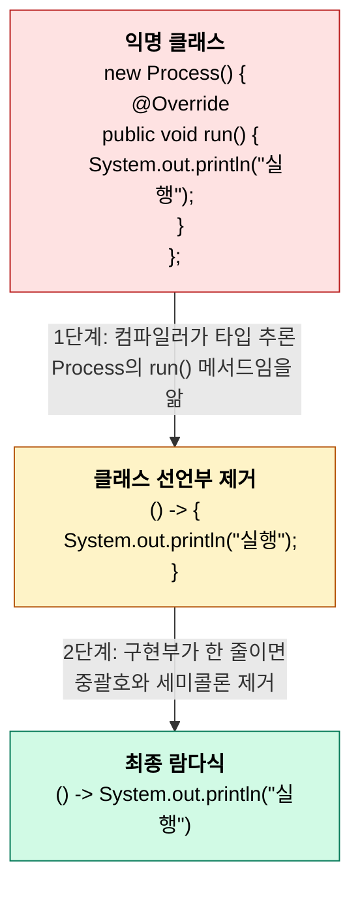
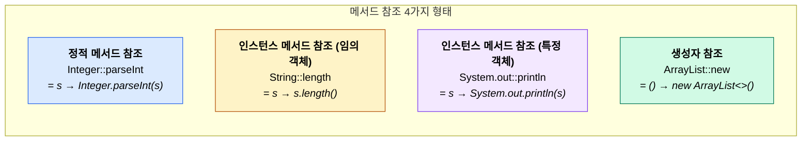
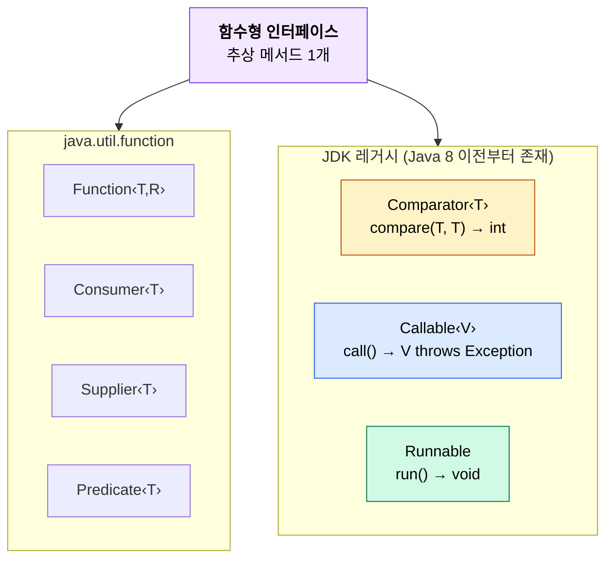

# Java 함수형 인터페이스 (Functional Interface)

함수형 인터페이스는 **추상 메서드가 딱 하나인 인터페이스**다. Java 8에서 람다식과 함께 도입됐고, `java.util.function` 패키지에 자주 쓰는 것들이 미리 정의되어 있다.

추상 메서드가 하나이기 때문에 컴파일러가 람다식을 보고 "이 코드가 어떤 메서드를 구현하는지" 추론할 수 있다. 이것이 람다식이 동작하는 근본적인 이유다.

---

## 1. 함수형 인터페이스의 조건

추상 메서드가 정확히 하나여야 한다. `default` 메서드나 `static` 메서드는 몇 개가 있어도 상관없다. `Object` 클래스의 메서드(`toString`, `equals`, `hashCode`)를 오버라이드하는 것도 추상 메서드 카운트에 포함되지 않는다.

```java
@FunctionalInterface
interface Converter<F, T> {
    T convert(F from);  // 추상 메서드 1개 → 함수형 인터페이스

    // default, static은 개수 제한 없음
    default Converter<F, T> andThen(Converter<T, ?> after) {
        return f -> after.convert(this.convert(f));
    }

    // Object의 메서드 오버라이드는 추상 메서드로 치지 않음
    String toString();
}
```

`@FunctionalInterface`를 붙이면 컴파일러가 조건을 검증해준다. 추상 메서드가 2개 이상이면 컴파일 에러가 난다. 이 어노테이션은 선택 사항이지만, 실수 방지용으로 붙이는 게 좋다.

```java
@FunctionalInterface
interface InvalidExample {
    void methodA();
    void methodB();  // 컴파일 에러: 추상 메서드가 2개
}
```

---

## 2. 익명 클래스에서 람다식으로

람다식이 등장하기 전에는 인터페이스를 즉석에서 구현하려면 익명 클래스를 써야 했다. 람다식은 이 익명 클래스의 보일러플레이트를 제거한 것이다.

### 변환 과정



실제 코드로 비교하면 이렇다.

```java
// 익명 클래스
hello(new Process() {
    @Override
    public void run() {
        System.out.println("주사위 값 출력");
    }
});

// 람다식
hello(() -> System.out.println("주사위 값 출력"));
```

컴파일러 입장에서 보면, `hello()` 메서드의 파라미터 타입이 `Process`이고, `Process`에는 추상 메서드가 `run()` 하나뿐이니, 람다식의 구현부가 곧 `run()`의 구현이라는 것을 추론한다. `@Override`가 없어도 동작하는 이유가 이것이다.

### 람다식 문법 정리

```java
// 파라미터 없음
() -> System.out.println("hello")

// 파라미터 1개 - 괄호 생략 가능
x -> x * 2

// 파라미터 2개
(x, y) -> x + y

// 구현부가 여러 줄이면 중괄호 필요
(x, y) -> {
    int sum = x + y;
    return sum;
}

// 타입 명시 (보통 생략)
(String s) -> s.length()
```

---

## 3. java.util.function 패키지

Java가 기본 제공하는 함수형 인터페이스들이다. 직접 만들기 전에 여기 있는 것을 먼저 확인한다. 대부분의 경우 커스텀 인터페이스를 만들 필요가 없다.

### 핵심 4가지 인터페이스

```mermaid
block-beta
    columns 4
    block:header:4
        columns 4
        h0[""] h1["입력 없음"] h2["입력 있음"] h3["입력 2개"]
    end
    block:row1:4
        columns 4
        r1h["반환 없음\n(void)"]
        r1c1["Runnable\n() → void"]
        r1c2["Consumer‹T›\nT → void"]
        r1c3["BiConsumer‹T,U›\n(T,U) → void"]
    end
    block:row2:4
        columns 4
        r2h["반환 있음"]
        r2c1["Supplier‹T›\n() → T"]
        r2c2["Function‹T,R›\nT → R"]
        r2c3["BiFunction‹T,U,R›\n(T,U) → R"]
    end
    block:row3:4
        columns 4
        r3h["boolean 반환"]
        r3c1["—"]
        r3c2["Predicate‹T›\nT → boolean"]
        r3c3["BiPredicate‹T,U›\n(T,U) → boolean"]
    end
    block:row4:4
        columns 4
        r4h["같은 타입\n입출력"]
        r4c1["—"]
        r4c2["UnaryOperator‹T›\nT → T"]
        r4c3["BinaryOperator‹T›\n(T,T) → T"]
    end

    style r1c1 fill:#dbeafe,stroke:#2563eb,color:#000
    style r1c2 fill:#dbeafe,stroke:#2563eb,color:#000
    style r1c3 fill:#dbeafe,stroke:#2563eb,color:#000
    style r2c1 fill:#fef3c7,stroke:#b45309,color:#000
    style r2c2 fill:#fef3c7,stroke:#b45309,color:#000
    style r2c3 fill:#fef3c7,stroke:#b45309,color:#000
    style r3c1 fill:#f3e8ff,stroke:#7c3aed,color:#000
    style r3c2 fill:#f3e8ff,stroke:#7c3aed,color:#000
    style r3c3 fill:#f3e8ff,stroke:#7c3aed,color:#000
    style r4c1 fill:#d1fae5,stroke:#047857,color:#000
    style r4c2 fill:#d1fae5,stroke:#047857,color:#000
    style r4c3 fill:#d1fae5,stroke:#047857,color:#000
```

> `Runnable`은 `java.lang` 패키지에 있지만, 개념상 함수형 인터페이스로 같이 분류한다.

### 3.1 Function<T, R> — 변환

입력 하나를 받아 다른 타입으로 변환해서 반환한다. Stream의 `map()`에서 가장 많이 쓴다.

```java
Function<String, Integer> strLength = s -> s.length();
Function<String, Integer> strLength2 = String::length;  // 메서드 참조

int len = strLength.apply("hello");  // 5
```

`andThen()`과 `compose()`로 체이닝할 수 있다.

```java
Function<String, String> trim = String::trim;
Function<String, String> toUpper = String::toUpperCase;

// trim 실행 후 toUpper 실행
Function<String, String> trimAndUpper = trim.andThen(toUpper);
trimAndUpper.apply("  hello  ");  // "HELLO"

// compose는 반대 순서: toUpper 먼저, trim은 그 결과에
Function<String, String> upperThenTrim = trim.compose(toUpper);
```

### 3.2 Consumer\<T\> — 소비

값을 받아서 처리하고 반환값이 없다. `forEach()`에서 사용한다.

```java
Consumer<String> printer = s -> System.out.println(s);
Consumer<String> printer2 = System.out::println;  // 메서드 참조

List.of("a", "b", "c").forEach(printer2);
```

### 3.3 Supplier\<T\> — 생성

파라미터 없이 값을 반환한다. 팩토리 패턴이나 지연 초기화에서 쓴다.

```java
Supplier<LocalDateTime> now = LocalDateTime::now;
Supplier<List<String>> listFactory = ArrayList::new;

LocalDateTime time = now.get();
List<String> newList = listFactory.get();
```

실무에서 자주 보는 패턴은 `Optional`과 함께 사용하는 것이다.

```java
// findById가 null이면 Supplier가 제공하는 기본값 사용
User user = Optional.ofNullable(findById(id))
    .orElseGet(() -> new User("guest"));  // Supplier<User>
```

### 3.4 Predicate\<T\> — 조건 판단

값을 받아 `boolean`을 반환한다. `filter()`에서 사용한다.

```java
Predicate<String> isNotEmpty = s -> s != null && !s.isEmpty();
Predicate<Integer> isPositive = n -> n > 0;

// 조합
Predicate<String> isShortAndNotEmpty = isNotEmpty.and(s -> s.length() < 10);
Predicate<String> isEmptyOrNull = isNotEmpty.negate();
```

Stream에서 쓰면 이렇다.

```java
List<String> names = List.of("Kim", "", "Lee", null, "Park");

List<String> valid = names.stream()
    .filter(Objects::nonNull)
    .filter(isNotEmpty)
    .collect(Collectors.toList());
// ["Kim", "Lee", "Park"]
```

### 3.5 UnaryOperator\<T\>와 BinaryOperator\<T\>

`Function<T, T>`와 `BiFunction<T, T, T>`의 특수 형태다. 입력 타입과 반환 타입이 같을 때 쓴다.

```java
UnaryOperator<String> toUpper = String::toUpperCase;
BinaryOperator<Integer> sum = Integer::sum;

toUpper.apply("hello");  // "HELLO"
sum.apply(3, 5);          // 8
```

`List.replaceAll()`은 `UnaryOperator`를 받는다.

```java
List<String> names = new ArrayList<>(List.of("kim", "lee", "park"));
names.replaceAll(String::toUpperCase);
// ["KIM", "LEE", "PARK"]
```

---

## 4. 메서드 참조 (Method Reference)

람다식이 기존 메서드를 그대로 호출하기만 하면, 메서드 참조로 더 줄일 수 있다.



```java
// 정적 메서드 참조
Function<String, Integer> parser = Integer::parseInt;

// 인스턴스 메서드 참조 (임의 객체의)
Function<String, String> upper = String::toUpperCase;

// 인스턴스 메서드 참조 (특정 객체의)
Consumer<String> print = System.out::println;

// 생성자 참조
Supplier<List<String>> listFactory = ArrayList::new;
Function<String, StringBuilder> sbFactory = StringBuilder::new;
```

메서드 참조를 쓸지 람다식을 쓸지는 가독성으로 판단한다. 단순한 위임이면 메서드 참조가 낫고, 변환 로직이 들어가면 람다식이 읽기 편하다.

```java
// 메서드 참조가 나은 경우
list.stream().map(String::toUpperCase)

// 람다식이 나은 경우 - 로직이 섞여 있을 때
list.stream().map(s -> s.substring(0, 3).toUpperCase())
```

---

## 5. 람다식과 변수 캡처

람다식 내부에서 외부 변수를 참조할 수 있다. 단, 그 변수는 `final`이거나 사실상 final(effectively final)이어야 한다.

```java
String prefix = "USER";  // effectively final - 값을 재할당하지 않음

Function<String, String> addPrefix = name -> prefix + "_" + name;
addPrefix.apply("kim");  // "USER_kim"
```

```java
String prefix = "USER";
prefix = "ADMIN";  // 재할당 발생

// 컴파일 에러: Variable used in lambda expression should be final or effectively final
Function<String, String> addPrefix = name -> prefix + "_" + name;
```

이 제약이 있는 이유는 람다식이 별도 스레드에서 실행될 수 있기 때문이다. 외부 변수를 자유롭게 수정할 수 있으면 동시성 문제가 생긴다. 실제로 람다식은 외부 변수의 값을 복사해서 사용한다(캡처).

값을 변경해야 하는 경우 `AtomicInteger`나 배열 같은 래퍼를 쓰는 편법이 있지만, 그런 상황이면 람다식 대신 다른 방식을 쓰는 게 맞다.

```java
// 이런 코드는 쓰지 마라
AtomicInteger count = new AtomicInteger(0);
list.forEach(item -> count.incrementAndGet());  // 동작하지만 의도가 불명확

// 이렇게
long count = list.stream().count();
```

---

## 6. java.util.function 밖의 함수형 인터페이스

`java.util.function` 패키지 외에도 JDK에는 Java 8 이전부터 존재하던 함수형 인터페이스가 여러 개 있다. 추상 메서드가 하나라는 조건만 만족하면 `@FunctionalInterface` 어노테이션이 없어도 람다식으로 쓸 수 있다.



### Comparator\<T\>

`java.util.Comparator<T>`는 `compare(T o1, T o2)` 하나만 추상 메서드로 가지고 있어서 함수형 인터페이스다. `@FunctionalInterface` 어노테이션도 붙어 있다.

`equals(Object)`를 오버라이드하고 있지만, `Object`의 메서드이기 때문에 추상 메서드 카운트에 포함되지 않는다. `reversed()`, `thenComparing()` 같은 건 전부 `default` 메서드다.

```java
// 익명 클래스로 쓰던 코드
Collections.sort(users, new Comparator<User>() {
    @Override
    public int compare(User a, User b) {
        return a.getName().compareTo(b.getName());
    }
});

// 람다식
users.sort((a, b) -> a.getName().compareTo(b.getName()));

// Comparator 정적 메서드 활용 — 가장 읽기 좋다
users.sort(Comparator.comparing(User::getName));
```

`Comparator.comparing()`은 `Function<T, U>`를 받아서 `Comparator<T>`를 반환한다. 함수형 인터페이스끼리 조합되는 구조다. 여러 조건을 연결할 때는 `thenComparing()`을 쓴다.

```java
users.sort(
    Comparator.comparing(User::getAge)
        .thenComparing(User::getName)
        .reversed()
);
```

정수 비교할 때 `(a, b) -> a.getAge() - b.getAge()` 같은 산술 방식은 `Integer.MAX_VALUE` 근처에서 오버플로우가 난다. `Comparator.comparingInt()`를 쓴다.

### Callable\<V\>

`java.util.concurrent.Callable<V>`는 `V call() throws Exception` 하나만 가지고 있다. `Supplier<T>`와 시그니처가 비슷한데, 결정적인 차이는 체크 예외를 던질 수 있다는 점이다.

```java
// Supplier<T>:  T get()                  — 체크 예외 불가
// Callable<V>:  V call() throws Exception — 체크 예외 가능
```

`ExecutorService.submit()`에 넘기는 용도로 설계됐다.

```java
ExecutorService executor = Executors.newFixedThreadPool(4);

Future<String> future = executor.submit(() -> {
    // Callable<String> — 체크 예외를 던져도 컴파일 에러 없음
    return Files.readString(Path.of("/data/config.json"));
});

String content = future.get();  // 블로킹 대기, ExecutionException으로 감싸서 전달
```

람다식 안에서 체크 예외를 던져야 하는 비동기 작업이면 `Callable`을, 체크 예외가 필요 없으면 `Supplier`를 쓴다. `CompletableFuture.supplyAsync()`는 `Supplier`를 받기 때문에, 체크 예외를 던지는 코드를 넣으려면 try-catch로 감싸야 한다.

### Runnable

`java.lang.Runnable`은 Java 1.0부터 있던 인터페이스다. `void run()` 하나만 있어서 함수형 인터페이스 조건을 만족한다.

`Consumer<T>`와 비교하면, `Runnable`은 파라미터를 받지 않고 반환값도 없다. `() -> void` 시그니처다.

```java
// 스레드 생성
new Thread(() -> System.out.println("별도 스레드에서 실행")).start();

// CompletableFuture에서 반환값이 필요 없는 비동기 작업
CompletableFuture.runAsync(() -> sendNotification(userId));
```

`Runnable`과 `Callable<Void>`는 기능적으로 같아 보이지만, `Callable<Void>`는 `return null;`을 명시해야 하고 체크 예외를 던질 수 있다는 차이가 있다. 반환값 없이 체크 예외도 필요 없으면 `Runnable`이 맞다.

---

## 7. 실무에서 겪는 문제들

### 제네릭과 함수형 인터페이스

제네릭 타입 파라미터에 primitive 타입을 쓸 수 없어서, `Function<Integer, Integer>` 같은 코드에서 오토박싱이 발생한다. 성능이 중요한 코드에서는 primitive 특화 인터페이스를 써야 한다.

```java
// 오토박싱 발생 - int → Integer → int
Function<Integer, Integer> square = n -> n * n;

// 오토박싱 없음 - IntUnaryOperator
IntUnaryOperator squarePrimitive = n -> n * n;
```

primitive 특화 인터페이스 목록:

| 인터페이스 | 시그니처 | 대응 |
|---|---|---|
| `IntFunction<R>` | `int → R` | `Function<Integer, R>` |
| `ToIntFunction<T>` | `T → int` | `Function<T, Integer>` |
| `IntUnaryOperator` | `int → int` | `UnaryOperator<Integer>` |
| `IntBinaryOperator` | `(int, int) → int` | `BinaryOperator<Integer>` |
| `IntPredicate` | `int → boolean` | `Predicate<Integer>` |
| `IntConsumer` | `int → void` | `Consumer<Integer>` |
| `IntSupplier` | `() → int` | `Supplier<Integer>` |

`Long`, `Double` 변형도 같은 패턴으로 존재한다 (`LongFunction`, `DoubleFunction` 등).

### 체크 예외 처리

`java.util.function`의 인터페이스들은 체크 예외를 던지지 않도록 선언되어 있다. 체크 예외를 던지는 코드를 람다식에 넣으면 컴파일 에러가 난다.

```java
// 컴파일 에러: IOException은 체크 예외
Function<String, String> readFile = path -> Files.readString(Path.of(path));
```

해결 방법은 몇 가지가 있다.

```java
// 방법 1: 람다 안에서 try-catch
Function<String, String> readFile = path -> {
    try {
        return Files.readString(Path.of(path));
    } catch (IOException e) {
        throw new UncheckedIOException(e);
    }
};

// 방법 2: 체크 예외를 던지는 함수형 인터페이스 직접 정의
@FunctionalInterface
interface ThrowingFunction<T, R> {
    R apply(T t) throws Exception;
}

// 방법 3: 래퍼 메서드
static <T, R> Function<T, R> unchecked(ThrowingFunction<T, R> f) {
    return t -> {
        try {
            return f.apply(t);
        } catch (Exception e) {
            throw new RuntimeException(e);
        }
    };
}

// 사용
List<String> contents = paths.stream()
    .map(unchecked(path -> Files.readString(Path.of(path))))
    .collect(Collectors.toList());
```

실무에서는 방법 3처럼 유틸리티 메서드를 하나 만들어두고 재사용하는 경우가 많다.

### 람다식의 this

람다식 안에서 `this`는 람다식을 감싸고 있는 클래스의 인스턴스를 가리킨다. 익명 클래스와 다른 점이다.

```java
class OrderService {
    private String name = "OrderService";

    public void process() {
        // 익명 클래스의 this → 익명 클래스 인스턴스
        Runnable anon = new Runnable() {
            @Override
            public void run() {
                // this.name → 컴파일 에러. 익명 클래스에 name 필드 없음
                System.out.println(OrderService.this.name);
            }
        };

        // 람다식의 this → OrderService 인스턴스
        Runnable lambda = () -> {
            System.out.println(this.name);  // "OrderService"
        };
    }
}
```

이 차이 때문에 익명 클래스를 람다식으로 기계적으로 변환하면 `this`의 의미가 바뀔 수 있다. IDE의 자동 변환 기능을 쓸 때 주의한다.

### 직렬화 문제

람다식은 기본적으로 직렬화를 지원하지 않는다. 분산 환경(Spark, Hadoop 등)에서 람다식을 직렬화해야 하면 `Serializable`을 캐스팅해야 한다.

```java
// 직렬화 불가
Comparator<String> comp = (a, b) -> a.compareTo(b);

// 직렬화 가능 - 캐스팅
Comparator<String> comp = (Comparator<String> & Serializable) (a, b) -> a.compareTo(b);
```

가능하면 람다식의 직렬화는 피하는 게 좋다. 내부 구현에 의존하는 부분이 많아서 Java 버전이 바뀌면 역직렬화가 실패할 수 있다.

---

## 관련 문서

- [함수형 인터페이스 실무 활용](../../자바 디자인 패턴 및 원칙/Java_Functional_Interface.md) — JDK/Spring에서의 활용, 커스텀 함수형 인터페이스 설계
