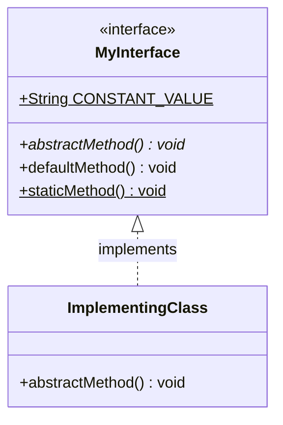
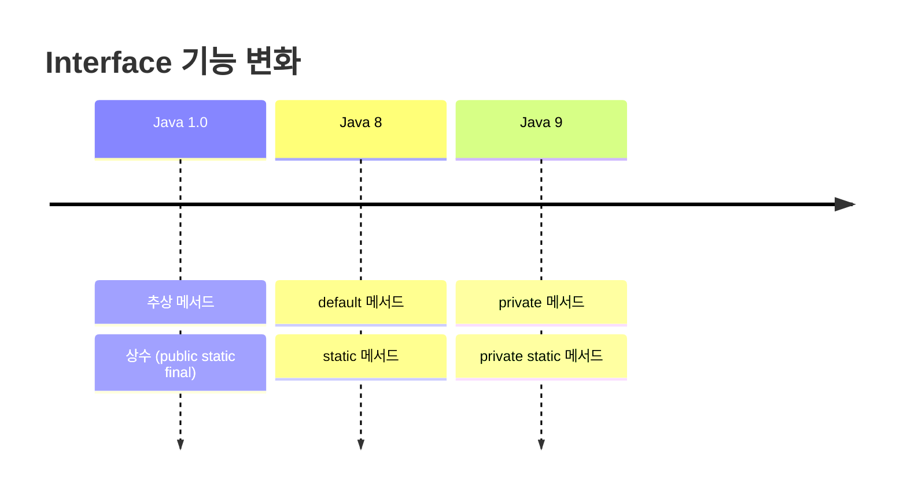
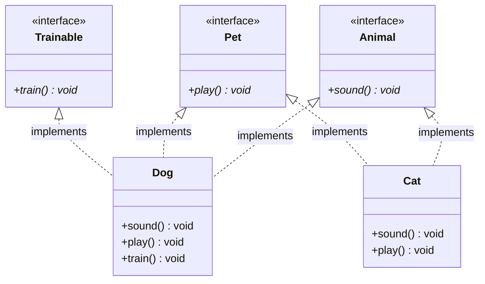
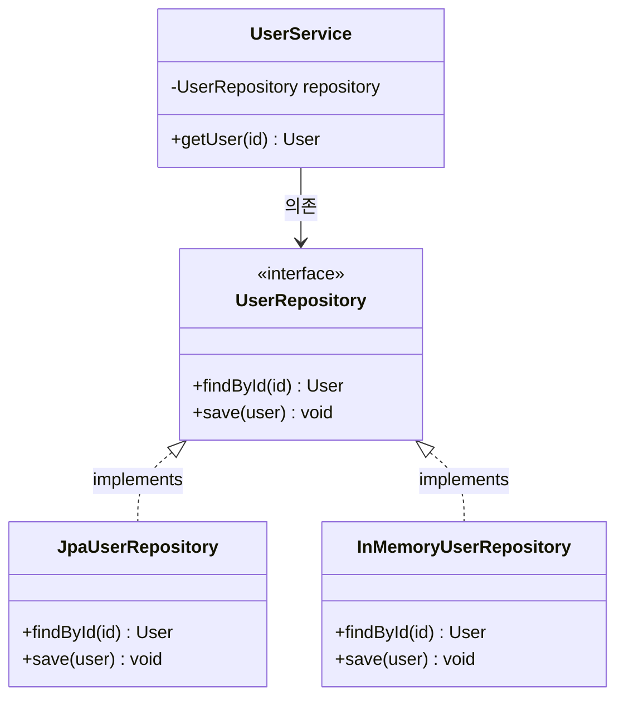
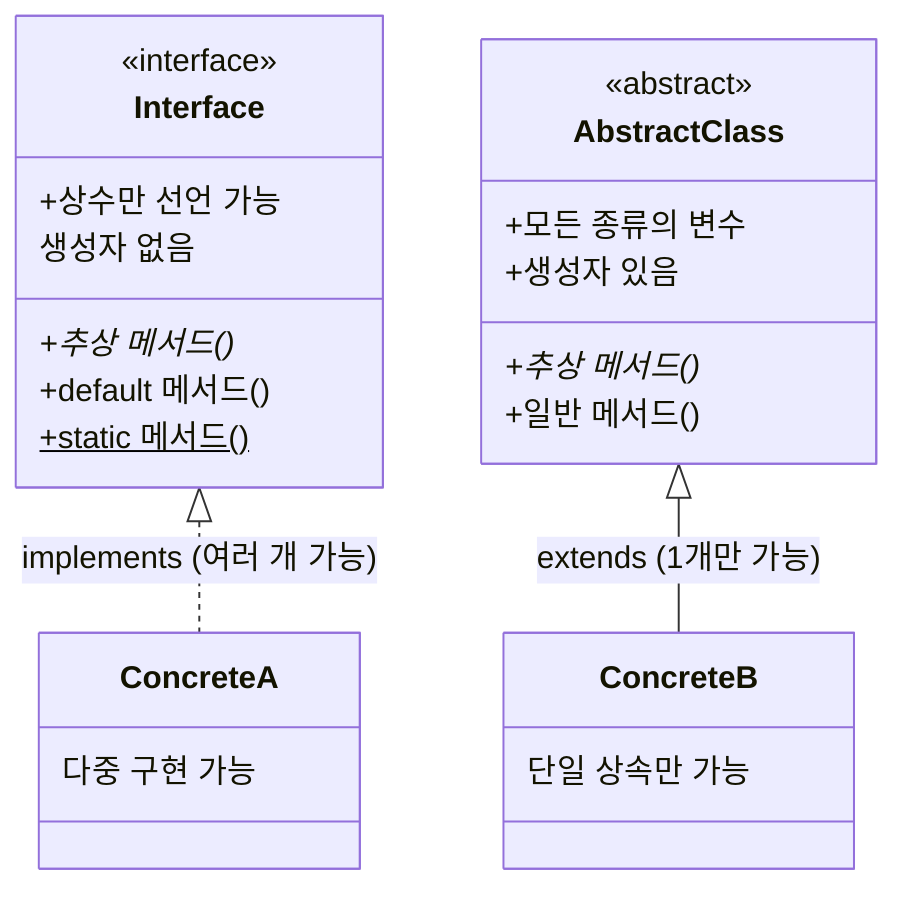
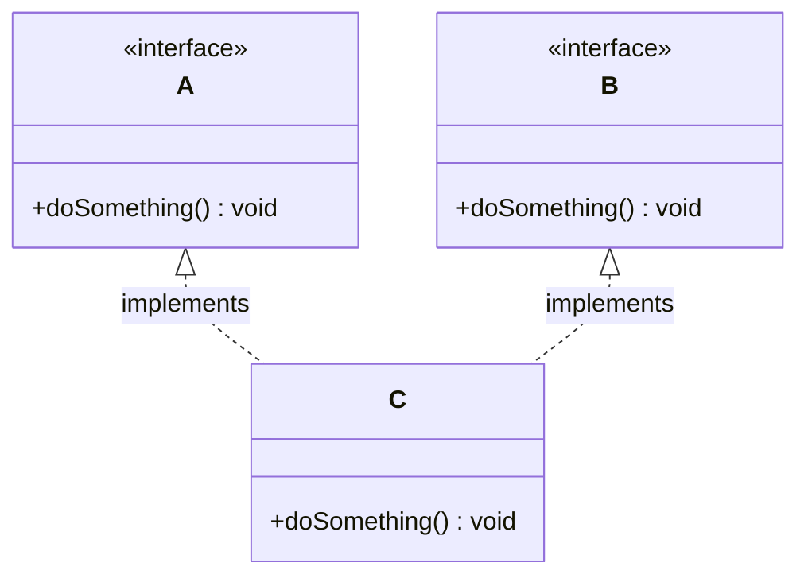

# Java 인터페이스 (Interface)

## 1. 인터페이스란 무엇인가

인터페이스는 구현체가 따라야 하는 계약(Contract)이다. 클래스와 비슷한 형태지만 구현 없이 메서드 시그니처만 정의하고, 실제 동작은 인터페이스를 구현하는 클래스가 작성한다.

- 원래는 추상 메서드와 상수만 가질 수 있었다. Java 8부터 `default`·`static` 메서드, Java 9부터 `private` 메서드가 추가됐다.
- `implements` 키워드로 클래스가 인터페이스를 구현한다.
- 한 클래스가 여러 인터페이스를 동시에 구현한다. 클래스 상속은 단일만 되지만 인터페이스 구현은 개수 제한이 없다.
- 인터페이스 자체로는 객체를 만들지 못한다. 구현 클래스를 거쳐야 인스턴스가 생긴다.

### Interface의 기본 구조



인터페이스는 메서드 시그니처와 상수를 정의하고, 구현 클래스가 실제 동작을 작성한다. `default`·`static` 메서드는 Java 8부터 인터페이스 내부에 구현부를 가진다.

### Java 버전별 Interface 변화



버전이 올라가면서 인터페이스에 구현부를 가진 메서드를 넣게 됐다. 이걸 남발하면 인터페이스의 원래 목적(계약 정의)이 흐려진다. 기존 구현체의 하위 호환성을 유지해야 하는 경우에만 쓰는 게 맞다. Java 8 이후 추가된 기능의 상세한 동작은 [advanced_interface](advanced_interface.md) 문서에서 다룬다.

## 2. Interface의 구성 요소

### 2.1 추상 메서드

인터페이스의 메서드는 별도 키워드를 안 붙여도 기본이 `public abstract`다.

```java
public interface Animal {
    void sound(); // public abstract가 생략된 추상 메서드
}
```

### 2.2 상수

인터페이스 안에 선언된 필드는 `public static final`이 생략된 상태로 항상 상수가 된다. 인스턴스 변수는 둘 수 없다.

```java
public interface Animal {
    String TYPE = "Mammal"; // public static final이 자동 적용된 상수
}
```

이 상수를 모아두려고 인터페이스를 만들고 implements 하는 건 안티패턴이다. 5장에서 다룬다.

### 2.3 Default 메서드 (Java 8+)

구현부를 가진 메서드를 인터페이스에 둔다. 구현 클래스는 이 메서드를 오버라이드하지 않아도 그대로 쓴다.

```java
public interface Animal {
    default void eat() {
        System.out.println("This animal eats food.");
    }
}
```

### 2.4 Static 메서드 (Java 8+)

인터페이스에 종속된 유틸리티 메서드를 정적 메서드로 둔다. 구현 클래스가 상속하지 않으며 `인터페이스명.메서드()`로만 호출한다.

```java
public interface Animal {
    static void info() {
        System.out.println("This is an Animal interface.");
    }
}
```

### 2.5 Private 메서드 (Java 9+)

private 메서드는 `default` 메서드끼리 공유하는 공통 로직을 빼낼 때 쓴다. Java 8에서 default 메서드가 늘면서 같은 코드가 여러 default 메서드에 중복되는 문제가 생겼고, Java 9에서 이걸 풀려고 추가됐다. private이므로 구현 클래스에는 노출되지 않는다.

```java
import java.time.LocalDateTime;

public interface Notifier {
    void send(String to, String body); // 구현 클래스가 채울 추상 메서드

    default void notifyInfo(String to, String message) {
        send(to, decorate("INFO", message));
    }

    default void notifyError(String to, String message) {
        send(to, decorate("ERROR", message));
    }

    // 두 default 메서드가 공유하는 포맷 로직. private이라 구현 클래스나 외부에 노출되지 않는다.
    private String decorate(String level, String message) {
        return "[" + level + "] " + LocalDateTime.now() + " " + message;
    }
}
```

`decorate`를 default나 public으로 두면 구현 클래스가 오버라이드하거나 외부에서 호출할 수 있게 되어 계약이 오염된다. 공통 로직은 private으로 막아야 한다.

## 3. Interface 구현

### 3.1 단일 인터페이스 구현

클래스는 `implements` 키워드로 인터페이스를 구현한다.

```java
public interface Animal {
    void sound();
}

public class Dog implements Animal {
    @Override
    public void sound() {
        System.out.println("Bark!");
    }
}
```

### 3.2 다중 인터페이스 구현

Java는 클래스 다중 상속을 지원하지 않지만, 다중 인터페이스 구현은 된다.



`Dog`는 `Animal`·`Pet`·`Trainable` 세 개를 구현하고, `Cat`은 `Animal`·`Pet` 두 개만 구현한다. 클래스마다 필요한 기능 조합을 다르게 가져간다.

```java
public interface Animal {
    void sound();
}

public interface Pet {
    void play();
}

public class Dog implements Animal, Pet {
    @Override
    public void sound() {
        System.out.println("Bark!");
    }

    @Override
    public void play() {
        System.out.println("Playing fetch!");
    }
}
```

## 4. Interface의 활용

### 4.1 다형성(Polymorphism)

같은 인터페이스 타입으로 여러 구현체를 동일하게 다룬다.

```java
public class Main {
    public static void main(String[] args) {
        Animal myDog = new Dog();
        myDog.sound(); // Bark!
    }
}
```

### 4.2 표준화된 설계

인터페이스는 구현 클래스에 같은 메서드 시그니처를 강제한다. 결제 수단을 추가하는 상황을 보자. `PaymentGateway`를 구현하는 모든 결제사는 `pay`와 `cancel`을 반드시 제공해야 한다.

```java
public interface PaymentGateway {
    PaymentResult pay(Order order);
    void cancel(String transactionId);
}

public class TossPayment implements PaymentGateway {
    @Override
    public PaymentResult pay(Order order) {
        // 토스 결제 API 호출
        return PaymentResult.success();
    }

    @Override
    public void cancel(String transactionId) {
        // 토스 취소 API 호출
    }
}

public class KakaoPayment implements PaymentGateway {
    @Override
    public PaymentResult pay(Order order) {
        // 카카오페이 결제 API 호출
        return PaymentResult.success();
    }

    @Override
    public void cancel(String transactionId) {
        // 카카오페이 취소 API 호출
    }
}
```

호출하는 쪽은 어떤 결제사인지 신경 쓰지 않는다. 네이버페이를 새로 붙여도 같은 시그니처를 따르므로 호출 코드를 고칠 필요가 없다.

```java
public class CheckoutService {
    public void checkout(PaymentGateway gateway, Order order) {
        PaymentResult result = gateway.pay(order); // 구현체가 무엇이든 동일하게 호출
        if (!result.isSuccess()) {
            throw new PaymentException("결제 실패");
        }
    }
}
```

### 4.3 Dependency Injection

인터페이스에만 의존하게 만들면 구현체를 교체하기 쉬운 구조가 된다.



`UserService`는 `UserRepository` 인터페이스에만 의존한다. 운영 환경에서는 `JpaUserRepository`를, 테스트에서는 `InMemoryUserRepository`를 주입한다. 구현체가 바뀌어도 `UserService` 코드는 그대로다.

## 5. 상수 인터페이스 안티패턴

상수만 모아둔 인터페이스를 만들고, 그 상수를 쓰려고 클래스가 implements 하는 패턴이 있다. 안 써야 한다.

```java
// 안티패턴: 상수 인터페이스
public interface PhysicsConstants {
    double AVOGADRO_NUMBER = 6.022e23;
    double BOLTZMANN_CONSTANT = 1.380e-23;
    double ELECTRON_MASS = 9.109e-31;
}

// 상수에 접두사 없이 접근하려고 인터페이스를 구현한다
public class Particle implements PhysicsConstants {
    double calculate() {
        return AVOGADRO_NUMBER * BOLTZMANN_CONSTANT; // 접두사 없이 쓰려는 게 유일한 목적
    }
}
```

문제는 세 가지다.

- `implements`는 "이 클래스는 해당 타입이다"라는 의미인데, 상수를 쓰려고 구현하면 타입 의미가 왜곡된다. `Particle`이 `PhysicsConstants`라는 건 말이 안 된다.
- 상수는 구현 세부사항인데 클래스의 public API로 새어 나간다. `Particle`을 상속한 모든 하위 클래스 네임스페이스에 상수가 딸려 들어간다.
- 나중에 상수를 안 쓰게 돼도 바이너리 호환성 때문에 `implements`를 함부로 떼지 못한다.

상수의 성격에 따라 대안을 고른다. 서로 연관된 값들의 집합이면 enum을 쓴다.

```java
public enum Planet {
    MERCURY(3.303e+23, 2.4397e6),
    EARTH(5.976e+24, 6.37814e6);

    private final double mass;
    private final double radius;

    Planet(double mass, double radius) {
        this.mass = mass;
        this.radius = radius;
    }

    public double surfaceGravity() {
        return 6.67300E-11 * mass / (radius * radius);
    }
}
```

연관성 없는 단순 상수 묶음이면 인스턴스화를 막은 유틸리티 클래스에 `public static final`로 둔다. 호출부에서는 static import로 접두사를 줄인다.

```java
public final class PhysicsConstants {
    private PhysicsConstants() {} // 인스턴스화 방지

    public static final double AVOGADRO_NUMBER = 6.022e23;
    public static final double BOLTZMANN_CONSTANT = 1.380e-23;
}
```

```java
import static com.example.PhysicsConstants.AVOGADRO_NUMBER;

public class Particle {
    double calculate() {
        return AVOGADRO_NUMBER * 2; // static import로 접두사 생략
    }
}
```

## 6. Interface와 Abstract Class 비교



| **특징**           | **Interface**                         | **Abstract Class**               |
|--------------------|---------------------------------------|-----------------------------------|
| **키워드**         | `interface`                          | `abstract class`                 |
| **다중 구현**      | 가능                                  | 불가능 (단일 상속만 가능)          |
| **메서드 구현 여부**| Java 8 이상: `default`/`static` 메서드 | 구현된 메서드 포함 가능             |
| **변수**           | `public static final` (상수만 가능)   | 모든 종류의 변수 선언 가능          |
| **생성자**         | 불가능                                | 가능                              |

둘 중 무엇을 고를지에 대한 판단 기준은 [Abstract Class vs Interface](Abstract%20Class__vs__Interface.md) 문서에서 다룬다.

## 7. Interface 사용 시 주의점

### 7.1 default 메서드 충돌과 해결 규칙

두 인터페이스가 같은 시그니처의 `default` 메서드를 갖고, 한 클래스가 둘 다 구현하면 컴파일 에러가 난다. 어느 쪽을 쓸지 컴파일러가 결정하지 못하기 때문이다(다이아몬드 문제).



이 경우 구현 클래스에서 직접 오버라이드한다. 특정 인터페이스의 default 구현을 그대로 쓰고 싶으면 `인터페이스명.super.메서드()`로 지정한다.

```java
public interface A {
    default void doSomething() {
        System.out.println("A");
    }
}

public interface B {
    default void doSomething() {
        System.out.println("B");
    }
}

// 직접 오버라이드하지 않으면 컴파일 에러
public class C implements A, B {
    @Override
    public void doSomething() {
        A.super.doSomething(); // A의 default 구현을 명시적으로 선택
    }
}
```

메서드 해석에는 우선순위 규칙이 있다.

1. 슈퍼클래스의 구체 메서드가 인터페이스의 default 메서드보다 우선한다. 클래스가 같은 시그니처 메서드를 상속받으면 인터페이스 default는 무시된다(클래스 우선 규칙).
2. 인터페이스끼리 상속 관계가 있으면 더 구체적인(하위) 인터페이스의 default가 우선한다.
3. 위 둘로도 모호하면 위 예제처럼 구현 클래스가 직접 오버라이드해야 한다.

규칙별 상세 동작과 더 복잡한 상속 구조는 [advanced_interface](advanced_interface.md)에서 다룬다.

### 7.2 상수 상속과 이름 충돌

인터페이스 상수는 구현 클래스로 상속된다. 두 인터페이스가 같은 이름의 상수를 가지면 접두사 없이 접근할 때 모호성 컴파일 에러가 난다.

```java
public interface ServiceA {
    int VERSION = 1;
}

public interface ServiceB {
    int VERSION = 2;
}

public class Client implements ServiceA, ServiceB {
    void print() {
        // System.out.println(VERSION); // 컴파일 에러: reference to VERSION is ambiguous
        System.out.println(ServiceA.VERSION); // 1 — 인터페이스명으로 명시
        System.out.println(ServiceB.VERSION); // 2
    }
}
```

런타임에서 더 조심할 부분이 있다. 인터페이스의 `static final` 기본형·문자열 상수는 컴파일 시점에 사용처 코드에 값이 그대로 박힌다(상수 인라이닝). 인터페이스의 상수 값을 바꾸고 그 인터페이스만 다시 컴파일하면, 예전 값이 박힌 호출부는 옛 값을 그대로 쓴다. 상수를 바꾸면 그 상수를 참조하는 모든 모듈을 다시 컴파일해야 한다. 라이브러리로 배포하는 상수라면 특히 주의해야 한다.

### 7.3 인터페이스 분리 원칙(ISP)으로 복잡도 관리

클래스 하나가 5~6개 이상의 인터페이스를 구현하고 있다면 인터페이스가 너무 거칠게 잡혀 있을 가능성이 크다. 인터페이스 분리 원칙(ISP)은 클라이언트가 자신이 쓰지 않는 메서드에 의존하지 않아야 한다는 원칙이다. 거대한 인터페이스 하나는 작고 응집도 높은 여러 인터페이스로 쪼갠다.

복합기 기능을 한 인터페이스에 몰아넣으면, 인쇄만 하는 단순 프린터까지 스캔·팩스를 강제로 구현해야 한다.

```java
// ISP 위반: 거대 인터페이스
public interface Machine {
    void print(Document doc);
    void scan(Document doc);
    void fax(Document doc);
}

public class SimplePrinter implements Machine {
    @Override
    public void print(Document doc) { /* 인쇄 */ }

    @Override
    public void scan(Document doc) {
        throw new UnsupportedOperationException(); // 구현할 게 없는데 강제됨
    }

    @Override
    public void fax(Document doc) {
        throw new UnsupportedOperationException();
    }
}
```

`UnsupportedOperationException`을 던지는 빈 구현이 보이면 인터페이스를 쪼갤 신호다. 기능 단위로 분리하면 각 클래스가 필요한 것만 구현한다.

```java
public interface Printer { void print(Document doc); }
public interface Scanner { void scan(Document doc); }
public interface Fax { void fax(Document doc); }

public class SimplePrinter implements Printer {
    @Override
    public void print(Document doc) { /* 인쇄만 구현 */ }
}

public class MultiFunctionDevice implements Printer, Scanner, Fax {
    @Override
    public void print(Document doc) { /* ... */ }
    @Override
    public void scan(Document doc) { /* ... */ }
    @Override
    public void fax(Document doc) { /* ... */ }
}
```

인터페이스 개수 자체가 문제가 아니라, 클라이언트가 안 쓰는 메서드에 묶이는 게 문제다. 분리하면 변경 영향 범위도 줄어든다. 스캔 기능이 바뀌어도 `SimplePrinter`는 영향받지 않는다.

### 7.4 Default 메서드 남용 금지

default 메서드는 기존 인터페이스에 새 메서드를 추가하면서 하위 호환성을 유지하려는 목적이다. 처음부터 인터페이스에 구현을 잔뜩 넣으면 추상 클래스와 차이가 없어진다. 인터페이스는 "무엇을 하는가"를 정의하고 "어떻게"는 구현 클래스에 맡기는 게 기본이다.

## 8. 인터페이스를 언제 쓰는가

실무에서는 DI, Repository 패턴, 서비스 레이어 추상화, 외부 연동(결제·알림·스토리지)처럼 구현체가 갈리는 지점에 인터페이스를 둔다. 구현체가 2개 이상이 될 가능성이 있거나 테스트에서 대체 구현을 끼워 넣어야 하는 경우가 대표적이다.

반대로 구현체가 하나뿐이고 앞으로도 늘 가능성이 없는데 관습적으로 인터페이스를 만드는 건 과하다. 코드만 늘고 추적이 번거로워진다. 인터페이스는 교체 가능성과 계약 강제가 필요한 곳에 쓴다.
