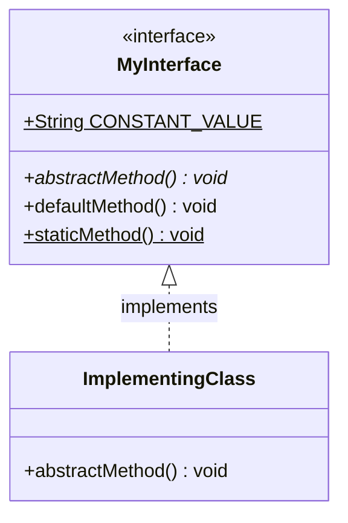
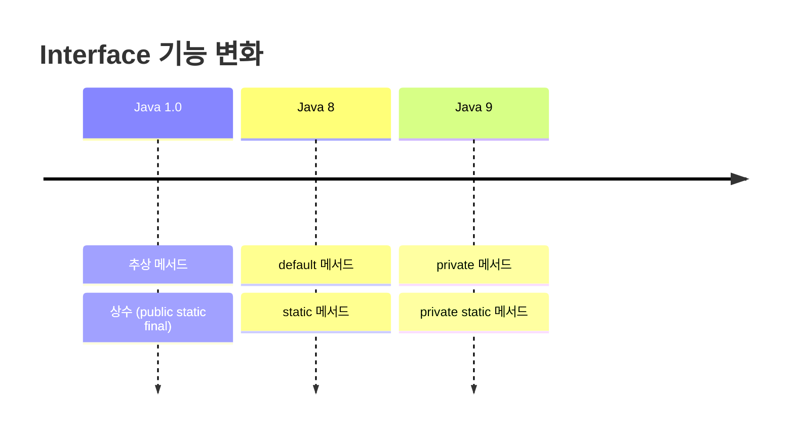
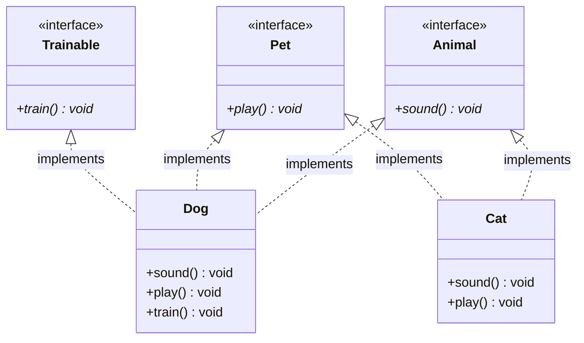
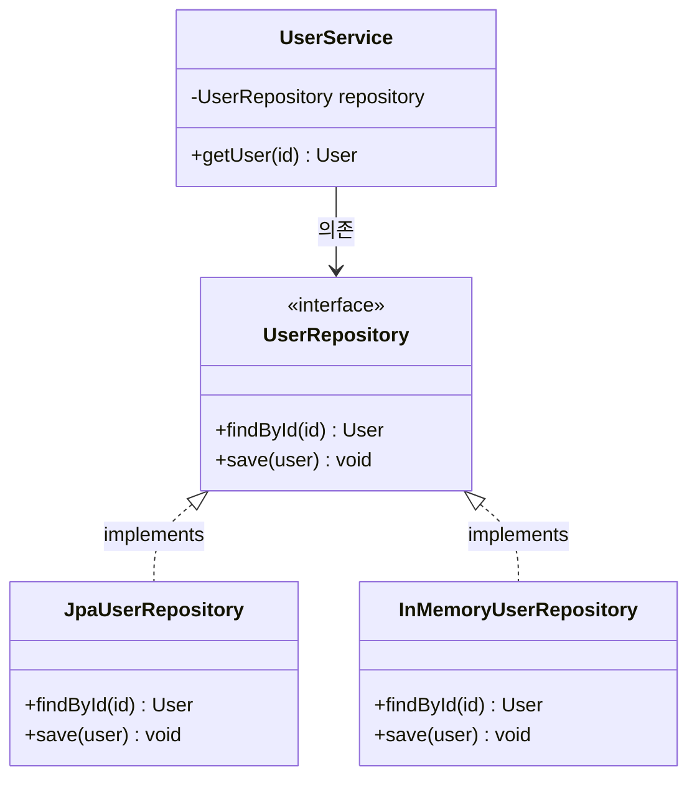
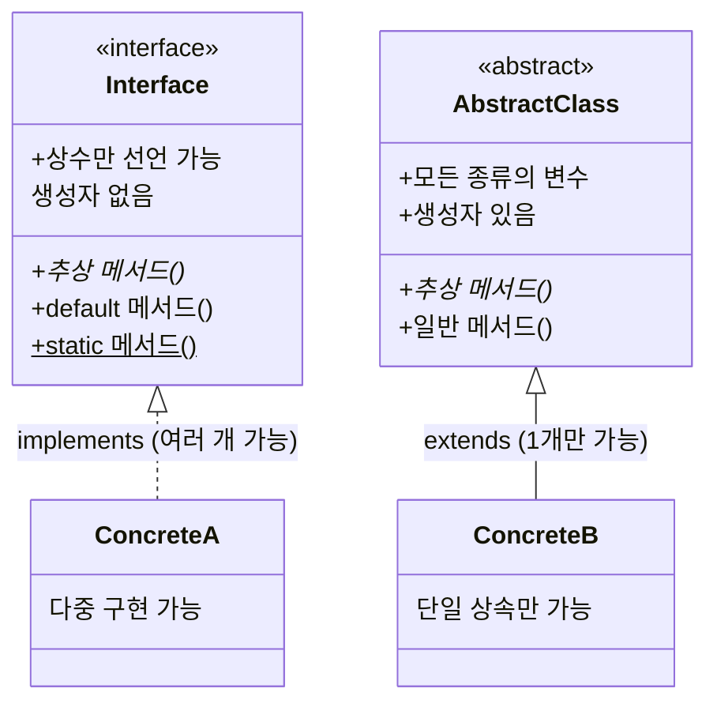
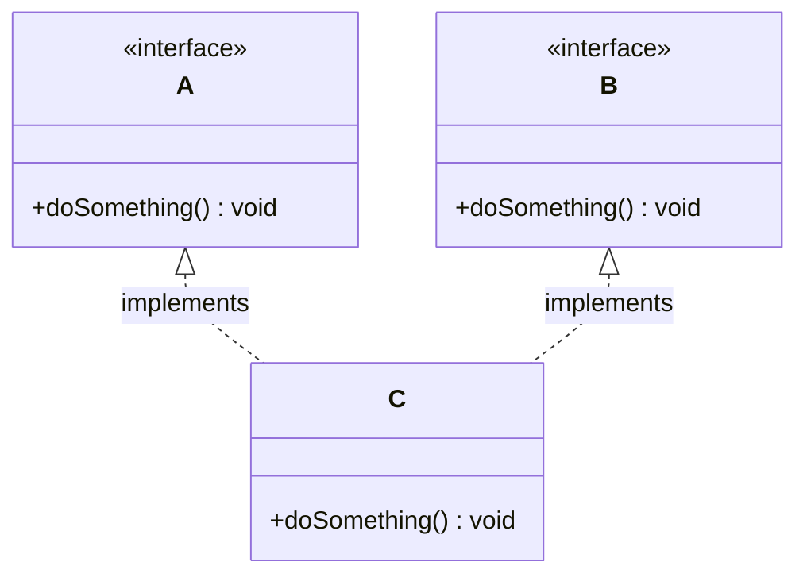

# Java Interface에 대한 자세한 설명

## 1. Interface란 무엇인가?
`Interface`는 Java에서 **다중 상속 문제를 해결하고, 코드의 일관성과 유지보수를 돕기 위한** 일종의 계약(Contract)입니다. `Interface`는 클래스와 비슷하지만, **구현(Implementation)** 없이 메서드의 시그니처(Signature)만 정의합니다.

## 배경
- **추상 메서드**와 **상수**만 포함할 수 있습니다. (Java 8 이상부터는 `default` 메서드와 `static` 메서드도 포함 가능)
- `implements` 키워드를 사용하여 클래스에서 인터페이스를 구현합니다.
- **다중 구현**이 가능합니다.
- 객체를 생성할 수 없습니다. (즉, 직접 인스턴스화 불가)

### Interface의 기본 구조



Interface는 메서드 시그니처와 상수를 정의하고, 구현 클래스가 실제 동작을 작성한다. `default` 메서드와 `static` 메서드는 Java 8부터 Interface 내부에 구현부를 가질 수 있다.


### Java 버전별 Interface 변화



Java 버전이 올라가면서 Interface에 구현부를 가진 메서드를 넣을 수 있게 됐다. 다만 이걸 남발하면 Interface의 원래 목적(계약 정의)이 흐려지므로, 기존 구현체의 하위 호환성을 유지해야 하는 경우에만 사용하는 게 맞다.

## 2. Interface의 구성 요소

### 2.1 추상 메서드
- Interface의 메서드는 기본적으로 **public**과 **abstract**입니다.
```java
public interface Animal {
    void sound(); // 추상 메서드
}
```

### 2.2 상수
- Interface 내에 선언된 변수는 public static final이 생략된 상태로 항상 상수로 동작합니다.

```java
public interface Animal {
    String TYPE = "Mammal"; // 상수
}
```

### 2.3 Default 메서드 (Java 8 이상)
- 구현부를 가지는 메서드를 Interface에 정의할 수 있습니다.

```java
public interface Animal {
    default void eat() {
        System.out.println("This animal eats food.");
    }
}
```

### 2.4 Static 메서드 (Java 8 이상)
- 클래스처럼 정적 메서드도 Interface에 정의 가능합니다.

```java
public interface Animal {
    static void info() {
        System.out.println("This is an Animal interface.");
    }
}
```

### 2.5 Private 메서드 (Java 9 이상)
- Private 접근 제어자를 가진 메서드로, 내부적으로만 사용됩니다.

```java
public interface Animal {
    private void helper() {
        System.out.println("This is a helper method.");
    }
}
```

## 3. Interface 구현
### 3.1 단일 인터페이스 구현
- 클래스는 implements 키워드를 사용하여 인터페이스를 구현합니다.

```java
public interface Animal {
    void sound();
}

public class Dog implements Animal {
    @Override
    public void sound() {
        System.out.println("Bark!");
    }
}
```

### 3.2 다중 인터페이스 구현
- Java는 다중 상속을 지원하지 않지만, 다중 인터페이스 구현은 가능합니다.



하나의 클래스가 여러 Interface를 구현할 수 있다. `Dog`는 `Animal`, `Pet`, `Trainable` 세 개를 구현하고, `Cat`은 `Animal`, `Pet` 두 개만 구현한다. 이런 식으로 필요한 기능 조합을 클래스별로 다르게 가져갈 수 있다.

```java
public interface Animal {
    void sound();
}

public interface Pet {
    void play();
}

public class Dog implements Animal, Pet {
    @Override
    public void sound() {
        System.out.println("Bark!");
    }

    @Override
    public void play() {
        System.out.println("Playing fetch!");
    }
}
```

## 4. Interface의 활용
### 4.1 다형성(Polymorphism)
- Interface는 다형성을 제공하여, 다양한 구현체를 같은 방식으로 처리할 수 있게 합니다.

```java
public class Main {
    public static void main(String[] args) {
        Animal myDog = new Dog();
        myDog.sound(); // Bark!
    }
}
```

### 4.2 표준화된 설계
- Interface는 기능을 표준화하여 여러 클래스가 동일한 메서드를 구현하도록 강제합니다.

### 4.3 Dependency Injection
- Interface를 사용하면 의존성 주입을 통해 구현체를 교체하기 쉬운 구조를 만들 수 있습니다.



`UserService`는 `UserRepository` Interface에만 의존한다. 실제 운영 환경에서는 `JpaUserRepository`를, 테스트에서는 `InMemoryUserRepository`를 주입하면 된다. 구현체가 바뀌어도 `UserService` 코드는 수정할 필요가 없다.

## 5. Interface와 Abstract Class 비교



| **특징**           | **Interface**                         | **Abstract Class**               |
|--------------------|---------------------------------------|-----------------------------------|
| **키워드**         | `interface`                          | `abstract class`                 |
| **다중 구현**      | 가능                                  | 불가능 (단일 상속만 가능)          |
| **메서드 구현 여부**| Java 8 이상: `default`/`static` 메서드 | 구현된 메서드 포함 가능             |
| **변수**           | `public static final` (상수만 가능)   | 모든 종류의 변수 선언 가능          |
| **생성자**         | 불가능                                | 가능                              |


## 6. Interface 사용 시 주의점

### 6.1 다이아몬드 문제 (Diamond Problem)



두 Interface가 같은 시그니처의 `default` 메서드를 갖고 있으면, 구현 클래스에서 컴파일 에러가 발생한다. 이 경우 구현 클래스에서 해당 메서드를 직접 오버라이드해야 한다.

```java
public interface A {
    default void doSomething() {
        System.out.println("A");
    }
}

public interface B {
    default void doSomething() {
        System.out.println("B");
    }
}

// 컴파일 에러 — 직접 오버라이드 필요
public class C implements A, B {
    @Override
    public void doSomething() {
        A.super.doSomething(); // 특정 Interface의 default 메서드를 호출할 수 있다
    }
}
```

### 6.2 복잡도 증가
- 너무 많은 인터페이스를 사용하면 유지보수가 어려워질 수 있다. 클래스 하나가 5~6개 이상의 Interface를 구현하고 있다면 설계를 다시 점검해야 한다.

### 6.3 기능의 명확성
- 인터페이스는 "무엇을 해야 하는가"에 초점을 맞추고, "어떻게"는 구현 클래스에 위임해야 한다.

### 6.4 Default 메서드 남용 금지
- Default 메서드는 기존 Interface에 새 메서드를 추가하면서 하위 호환성을 유지하기 위한 목적이다. 처음부터 Interface에 구현을 잔뜩 넣으면 Abstract Class와 차이가 없어진다.

--- 

## 7. 결론
- Interface는 객체 지향 프로그래밍에서 계약 역할을 한다. 구현체 간의 공통 규약을 정의하고, 다형성을 활용하는 핵심 수단이다.
- 실무에서는 DI, Repository 패턴, 서비스 레이어 추상화 등에서 Interface를 많이 쓴다. 다만 모든 클래스에 Interface를 만드는 건 과도하고, 구현체가 2개 이상 될 가능성이 있는 경우에 사용하는 게 현실적이다.

