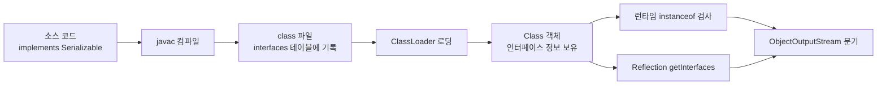

# Java Marker Interface 심화 가이드

마커 인터페이스를 처음 배울 때는 "그냥 빈 인터페이스 아닌가?" 정도로 넘어가기 쉽다. 그런데 실무에서 `Serializable`로 객체를 Redis에 넣다가 `InvalidClassException`을 만나거나, `ArrayList`와 `LinkedList`를 같은 코드로 순회했더니 한쪽은 1초, 다른 쪽은 10분이 걸리는 상황을 겪고 나면 마커 인터페이스가 단순한 빈 껍데기가 아니라는 걸 알게 된다. 이 문서는 5년 차쯤 되어 "빈 인터페이스가 왜 필요한가, 왜 애노테이션으로 안 가나"라는 질문을 진지하게 던지는 사람을 위한 자료다.

## 마커 인터페이스란 정확히 무엇인가

메서드도 상수도 없는 빈 인터페이스를 마커 인터페이스라고 부른다. 자바의 클래스 파일 포맷에서 보면 `interfaces` 테이블에 항목 하나가 추가되는 것이 전부다. 즉, 클래스의 메타데이터 영역에 "이 클래스는 X 타입이다"라는 한 줄짜리 도장을 찍는 것에 지나지 않는다.

```java
public interface Serializable {
}
```

`java.io.Serializable`의 실제 소스를 열어보면 이렇게 정말 비어 있다. 그런데 이 빈 인터페이스 하나가 JVM의 `ObjectOutputStream` 내부에서 객체를 바이트 스트림으로 직렬화할지 말지를 결정한다.

마커 인터페이스가 의미를 가지는 메커니즘은 두 갈래다. 하나는 컴파일 타임에 타입 시스템이 검사해 주는 것이고, 다른 하나는 런타임에 `instanceof` 또는 리플렉션으로 분기 처리되는 것이다. 보통 둘 다 활용한다.

## JVM에서 마커 인터페이스가 동작하는 원리

자바 컴파일러는 클래스가 어떤 인터페이스를 구현하는지 클래스 파일의 상수 풀과 `interfaces` 배열에 기록한다. JVM 명세에 따르면 이 정보는 클래스 로딩 시점에 `Class` 객체의 내부 자료구조로 옮겨진다. 그래서 런타임에 `obj instanceof Marker`나 `clazz.getInterfaces()` 호출이 가능하다.

```java
Class<?> clazz = ArrayList.class;
for (Class<?> i : clazz.getInterfaces()) {
    System.out.println(i.getName());
}
```

위 코드를 돌리면 `java.util.List`, `java.util.RandomAccess`, `java.lang.Cloneable`, `java.io.Serializable`이 출력된다. 이 중에서 `RandomAccess`, `Cloneable`, `Serializable`은 메서드가 단 하나도 없다. 그럼에도 JVM과 표준 라이브러리는 이 정보를 분기 조건으로 사용한다.

`instanceof` 자체는 JVM 바이트코드 명령어다. 핫스팟 JVM은 이 연산을 단순한 비트 비교 수준으로 최적화하고, 자주 호출되는 자리에서는 인라인 캐싱까지 적용한다. 그래서 마커 인터페이스 기반 분기는 생각보다 비용이 작다. 런타임 비용이 거의 없다는 점이 마커 인터페이스가 지금까지도 살아남은 이유 중 하나다.



## 표준 마커 인터페이스의 내부 구현

### Serializable과 ObjectOutputStream

`Serializable`이 어떻게 동작하는지 OpenJDK의 `ObjectOutputStream.writeObject0` 내부를 보면 명확해진다. 단순화하면 이런 흐름이다.

```java
private void writeObject0(Object obj, boolean unshared) throws IOException {
    if (obj instanceof String) {
        writeString((String) obj, unshared);
    } else if (obj.getClass().isArray()) {
        writeArray(obj, desc, unshared);
    } else if (obj instanceof Enum) {
        writeEnum((Enum<?>) obj, desc, unshared);
    } else if (obj instanceof Serializable) {
        writeOrdinaryObject(obj, desc, unshared);
    } else {
        throw new NotSerializableException(obj.getClass().getName());
    }
}
```

`Serializable`이 메서드를 하나도 가지고 있지 않은데도 직렬화가 가능한 이유는 JVM이 리플렉션으로 클래스의 모든 인스턴스 필드를 직접 읽어 내려가기 때문이다. `transient`로 표시되지 않은 필드들을 `Field.get()`으로 꺼내서 바이트로 쓴다. 그래서 마커 인터페이스만으로 충분하다.

이 구조의 부작용은 캡슐화가 깨진다는 점이다. private 필드도 직렬화 대상이 되기 때문에 클래스 작성자가 의도하지 않은 내부 상태가 외부로 노출된다. Effective Java에서 직렬화를 "고의적 보안 취약점"이라고 부르는 이유가 여기에 있다.

### RandomAccess의 성능 분기

`RandomAccess`는 진짜로 마커 인터페이스의 실용성을 보여주는 사례다.

```java
public interface RandomAccess {
}
```

이 빈 인터페이스를 `ArrayList`는 구현하고 `LinkedList`는 구현하지 않는다. 차이점은 `Collections` 유틸리티 메서드들의 구현에서 드러난다.

```java
public static <T> int binarySearch(List<? extends Comparable<? super T>> list, T key) {
    if (list instanceof RandomAccess || list.size() < BINARYSEARCH_THRESHOLD) {
        return Collections.indexedBinarySearch(list, key);
    } else {
        return Collections.iteratorBinarySearch(list, key);
    }
}
```

`indexedBinarySearch`는 `list.get(mid)`로 인덱스 접근을 한다. `ArrayList`라면 O(1)이지만 `LinkedList`에서 이걸 하면 매번 노드를 따라가며 O(n)이 되어 전체 이진 탐색이 O(n log n)이 되어버린다. 그래서 `RandomAccess`가 아닌 컬렉션에서는 `ListIterator`를 사용해 순차적으로 접근하는 `iteratorBinarySearch`를 쓴다.

이 분기를 모르고 `Collections.shuffle`이나 `binarySearch`에 `LinkedList`를 그대로 던졌다가 성능 이슈로 고생한 경우가 적지 않다. 빈 인터페이스 하나로 알고리즘 선택이 갈린다는 게 마커 인터페이스의 본질을 가장 잘 보여준다.

### Cloneable의 안티패턴 논쟁

`Cloneable`은 마커 인터페이스 중에서 가장 욕을 많이 먹는다.

```java
public interface Cloneable {
}
```

문제는 이 인터페이스가 마커임에도 실제 동작은 `Object.clone()` 메서드의 동작을 바꾸는 데 있다. `Object.clone()`은 `Cloneable`을 구현하지 않은 객체에서 호출되면 `CloneNotSupportedException`을 던진다. 메서드를 정의하지도 않으면서 메서드의 동작을 변경하는, 기괴한 인터페이스다.

```java
public class Point implements Cloneable {
    private int x, y;

    @Override
    public Point clone() {
        try {
            return (Point) super.clone();
        } catch (CloneNotSupportedException e) {
            throw new AssertionError(e);
        }
    }
}
```

이 코드의 문제는 한두 가지가 아니다. `super.clone()`은 생성자를 호출하지 않고 필드를 비트 단위로 복사하기 때문에 생성자에서 강제하던 불변성이 깨질 수 있다. 깊은 복사도 자동으로 되지 않아서 컬렉션이나 배열 같은 가변 필드는 별도로 복사해야 한다. 그래서 Effective Java Item 13은 `Cloneable`을 구현하지 말고 복사 생성자나 정적 팩터리 메서드를 사용하라고 권장한다.

```java
public class Point {
    private final int x, y;

    public Point(Point original) {
        this.x = original.x;
        this.y = original.y;
    }
}
```

신규 코드를 작성한다면 `Cloneable`은 잊어도 된다. 다만 라이브러리에서 이미 `Cloneable`을 구현한 클래스를 다룰 때는 위의 함정들을 알고 있어야 한다.

## instanceof 기반 타입 분기 패턴

마커 인터페이스로 동작을 분기하는 일반적인 패턴은 다음과 같다.

```java
public class CacheManager {
    public void store(String key, Object value) {
        if (value instanceof Cacheable) {
            redis.set(key, serialize(value));
        }
        if (value instanceof Auditable) {
            auditLog.record(key, value);
        }
        if (value instanceof Sensitive) {
            encrypt(value);
        }
    }
}
```

여기서 `Cacheable`, `Auditable`, `Sensitive`는 모두 메서드 없는 마커 인터페이스다. 한 객체가 여러 마커를 동시에 구현할 수 있고, 각 분기는 독립적으로 처리된다.

이 패턴의 장점은 컴파일러가 도와준다는 점이다. `Cacheable`을 직접 사용하지 않는 클래스의 인스턴스를 `Cacheable` 타입 변수에 할당하려고 하면 컴파일 에러가 난다. 즉, "이 객체는 캐시 가능하다"라는 의도를 타입 시스템 위에서 검증할 수 있다.

```java
public <T extends Cacheable> void cacheAll(List<T> items) {
    for (T item : items) {
        cache.put(item.cacheKey(), item);
    }
}
```

만약 마커 인터페이스가 아니라 `@Cacheable` 애노테이션이었다면 위 코드의 제네릭 제약은 불가능하다. 애노테이션은 타입이 아니라서 `<T extends @Cacheable>` 같은 문법은 존재하지 않는다.

## 마커 인터페이스 vs 애노테이션 선택 기준

자바 5에서 애노테이션이 들어온 뒤로 "마커 인터페이스는 끝났다"는 얘기가 한동안 돌았다. 실제로는 그렇지 않다. 둘은 서로 다른 문제를 푼다.

| 비교 항목 | 마커 인터페이스 | 마커 애노테이션 |
| --- | --- | --- |
| 검사 시점 | 컴파일 타임 + 런타임 | 주로 런타임 |
| 타입 시스템 통합 | 가능 (`instanceof`, 제네릭 bound) | 불가능 |
| 메타데이터 첨부 | 불가능 (매개변수 없음) | 가능 (요소 값) |
| 적용 대상 | 클래스/인터페이스만 | 클래스, 메서드, 필드, 매개변수 등 |
| 외부 라이브러리 결합 | 강함 (구현 강제) | 약함 (옵션) |

선택 기준을 한 줄로 정리하면 이렇다. **타입을 구분하고 싶으면 마커 인터페이스, 정보를 첨부하고 싶으면 애노테이션이다.**

Effective Java Item 41은 더 구체적인 기준을 준다. 마커가 클래스나 인터페이스에만 적용되고, 그것을 매개변수 타입으로 받거나 컴파일 타임 타입 검사를 활용할 의도가 있다면 마커 인터페이스를 써야 한다. 그렇지 않고 단순히 메타데이터를 다는 용도라면 애노테이션이 낫다.

```java
// 컴파일 타임에 타입 안전성이 필요한 경우 → 마커 인터페이스
public interface Cacheable {}

public <T extends Cacheable> void cache(T item) { ... }

// 런타임에 메타데이터로 처리하는 경우 → 애노테이션
@Retention(RetentionPolicy.RUNTIME)
@Target(ElementType.TYPE)
public @interface Cacheable {
    int ttlSeconds() default 3600;
    String region() default "default";
}
```

위 두 코드의 차이는 매개변수 유무뿐이지만, 사용 방식이 완전히 달라진다. 마커 인터페이스로는 `ttlSeconds` 같은 매개변수를 표현할 방법이 없다.

## 제네릭과 함께 사용하는 bounded type parameter 패턴

마커 인터페이스의 진가는 제네릭과 결합할 때 나온다. 흔히 보는 패턴은 두 가지다.

### 한정적 와일드카드와 결합

```java
public class EventBus {
    public void publish(List<? extends Event> events) {
        for (Event e : events) {
            dispatch(e);
        }
    }
}
```

`Event`가 마커 인터페이스라면 이벤트 타입이 아닌 객체는 컴파일 단계에서 차단된다. 런타임에서 `instanceof`로 검증할 필요가 없어진다.

### 자가 참조 제네릭과 결합

```java
public interface Mergeable<T extends Mergeable<T>> {
}

public class Account implements Mergeable<Account> {
    private long balance;

    public Account merge(Account other) {
        Account merged = new Account();
        merged.balance = this.balance + other.balance;
        return merged;
    }
}

public <T extends Mergeable<T>> T mergeAll(List<T> items) {
    if (items.isEmpty()) return null;
    T result = items.get(0);
    for (int i = 1; i < items.size(); i++) {
        result = combine(result, items.get(i));
    }
    return result;
}
```

여기서 `Mergeable`은 빈 인터페이스지만, 자가 참조 제네릭 `T extends Mergeable<T>`로 "T 자신과만 병합 가능하다"는 제약을 표현한다. 애노테이션으로는 이걸 흉내 낼 방법이 없다.

## 프레임워크 활용 사례

### Spring의 Aware 시리즈

스프링의 `Aware` 인터페이스 가족은 정확히는 마커 인터페이스가 아니라 메서드가 하나씩 있는 콜백 인터페이스지만, 사용 방식은 마커와 거의 같다.

```java
public class MyBean implements ApplicationContextAware {
    private ApplicationContext context;

    @Override
    public void setApplicationContext(ApplicationContext ctx) {
        this.context = ctx;
    }
}
```

스프링 컨테이너는 빈 초기화 단계에서 `bean instanceof ApplicationContextAware` 체크 후 `setApplicationContext`를 호출한다. 진짜 빈 마커는 아니지만 동일한 분기 패턴을 따른다.

순수 마커에 가까운 예는 `org.springframework.beans.factory.DisposableBean`의 자매격인 `org.springframework.core.AliasRegistry` 같은 인터페이스, 또는 Spring Data의 `Persistable` 같은 케이스다. 특히 Spring Data JDBC의 경우 `Persistable`을 구현하면 새 엔티티 판별 로직이 바뀐다.

```java
public class Customer implements Persistable<Long> {
    @Id
    private Long id;
    private boolean isNew = true;

    @Override
    public Long getId() { return id; }

    @Override
    public boolean isNew() { return isNew; }
}
```

Spring Data는 기본적으로 ID가 null이면 새 엔티티로 간주하지만, `Persistable`을 구현하면 `isNew()` 결과를 우선시한다. 인터페이스 구현 여부 자체가 Spring 내부 분기에 영향을 준다.

### Jackson의 Mixin과 마커

Jackson도 마커 인터페이스를 활용한다. 직접적인 마커는 적지만, `JsonNode`나 `TreeNode` 계층의 `ContainerNode`, `ValueNode` 같은 추상 클래스 트리에서 빈 마커성 타입들이 등장한다. 또한 `com.fasterxml.jackson.databind.JsonSerializable` 같은 인터페이스는 메서드를 가지지만, 사용자 정의 마커 인터페이스를 사용해 직렬화 정책을 분기시키는 패턴은 Jackson 모듈을 만들 때 자주 등장한다.

```java
public interface MaskedSensitive {}

public class MaskingSerializer extends StdSerializer<MaskedSensitive> {
    public MaskingSerializer() { super(MaskedSensitive.class); }

    @Override
    public void serialize(MaskedSensitive value, JsonGenerator gen, SerializerProvider sp) throws IOException {
        gen.writeString("***");
    }
}
```

`SimpleModule.addSerializer(MaskedSensitive.class, new MaskingSerializer())`로 등록하면 `MaskedSensitive`를 구현하는 모든 DTO가 마스킹된 값으로 직렬화된다. 마커 인터페이스가 직렬화 정책 차원의 태그 역할을 한다.

## 직렬화 함정과 트러블슈팅

### serialVersionUID 누락이 만드는 InvalidClassException

실무에서 가장 자주 마주치는 마커 인터페이스 관련 사고는 `Serializable`과 `serialVersionUID` 짝꿍이다.

```java
public class UserDto implements Serializable {
    private String name;
    private int age;
}
```

`serialVersionUID`를 명시하지 않으면 컴파일러가 클래스 구조에 기반해 자동으로 생성한다. 자동 생성된 UID는 필드 추가, 메서드 시그니처 변경, 접근 제어자 변경 등에 민감하게 반응한다. 운영 중 클래스에 필드를 하나 추가했더니 Redis에 캐시된 직렬화 객체를 역직렬화할 때 다음 예외가 발생한다.

```
java.io.InvalidClassException: com.example.UserDto;
    local class incompatible:
    stream classdesc serialVersionUID = 8273469873214,
    local class serialVersionUID = 1029384756102
```

해결책은 명확하다. `Serializable`을 구현하면 반드시 `serialVersionUID`를 직접 선언한다.

```java
public class UserDto implements Serializable {
    private static final long serialVersionUID = 1L;
    private String name;
    private int age;
}
```

UID를 어떤 값으로 잡을지 정해진 규칙은 없지만, 일관성을 위해 1부터 시작해 호환성이 깨질 때만 증가시키는 팀도 있고, IDE 자동 생성 값을 그대로 두는 팀도 있다. 중요한 건 명시적으로 선언한다는 것이다.

직렬화 호환성을 깨지 않으면서 필드를 추가하려면 `serialVersionUID`를 유지한 채로 새 필드를 추가하면 된다. 자바 직렬화는 클래스에 새 필드가 추가되어도 기존 스트림에서 누락된 필드는 기본값으로 초기화한다. 반대로 필드를 삭제하면 호환성이 깨지므로 deprecated 처리만 하고 남겨두는 편이 안전하다.

### 직렬화의 보안 이슈와 대안

자바 직렬화는 역직렬화 가젯 체인 공격으로 악명이 높다. 신뢰할 수 없는 입력을 `ObjectInputStream.readObject()`에 넣으면 임의 코드 실행으로 이어질 수 있다. 그래서 외부 통신용 데이터에는 자바 직렬화 대신 JSON, Protobuf, Avro 같은 명시적 스키마 기반 포맷을 쓰는 게 정석이다.

내부 캐시나 짧은 수명의 메시지에서만 자바 직렬화를 쓰고, 그조차도 `ObjectInputFilter`로 역직렬화 가능한 클래스를 화이트리스트로 제한한다.

```java
ObjectInputStream ois = new ObjectInputStream(inputStream);
ois.setObjectInputFilter(filterInfo -> {
    Class<?> clazz = filterInfo.serialClass();
    if (clazz == null) return ObjectInputFilter.Status.ALLOWED;
    if (clazz.getName().startsWith("com.example.dto.")) {
        return ObjectInputFilter.Status.ALLOWED;
    }
    return ObjectInputFilter.Status.REJECTED;
});
```

자바 17 이후로는 `ObjectInputFilter.Config.setSerialFilter`로 JVM 전역 필터도 설정할 수 있다.

## 직접 마커 인터페이스를 만들 때 고려할 점

마지막으로 자기 프로젝트에 마커 인터페이스를 도입할 때 점검하면 좋은 항목들을 정리해 둔다.

첫째, 정말 타입 시스템 차원의 구분이 필요한지 자문한다. 단순히 "이 클래스는 캐시 가능하다" 같은 정보를 다는 거라면 애노테이션이 더 가볍다. 매개변수 타입에 제약을 걸거나 제네릭 bound로 사용할 일이 있을 때만 마커 인터페이스가 가치 있다.

둘째, 마커 인터페이스는 한번 도입하면 빼기 어렵다. 외부에 공개된 API 클래스에 `implements MyMarker`를 추가하면 그 클래스의 모든 사용자가 영향을 받는다. 핵심 도메인 클래스에는 신중하게 적용한다.

셋째, 한 클래스에 여러 마커를 동시에 다는 건 자연스럽다. `Cacheable`, `Auditable`, `Versionable`을 동시에 구현해도 메서드 충돌이 없으므로 다중 상속의 함정이 없다.

넷째, 마커 인터페이스를 검사하는 코드는 한 곳에 모은다. 여기저기 `instanceof Cacheable`이 흩어져 있으면 의도가 흐려진다. 디스패처나 핸들러 클래스 한 곳에서만 분기하고, 도메인 코드에서는 마커만 달아 두는 식이 깔끔하다.

마커 인터페이스는 1990년대 자바의 흔적처럼 보일 때가 있지만, 타입 안전성과 런타임 분기를 동시에 잡는 거의 유일한 도구다. 새로 만드는 코드에서 무턱대고 쓸 건 아니지만, 표준 라이브러리와 프레임워크가 어떻게 활용하는지 이해하지 못하면 직렬화 사고나 성능 이슈를 만났을 때 원인을 짚어내기 어렵다. 적어도 `Serializable`, `RandomAccess`, `Cloneable` 셋의 동작 원리는 머릿속에 정리해 두는 편이 좋다.
