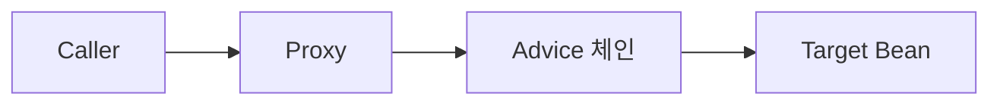

# Java 관점지향 프로그래밍(AOP) Deep Dive

## 1. AOP가 왜 필요한가

5년차쯤 되면 누구나 한 번은 비슷한 경험을 한다. 트랜잭션 시작·종료 로그를 모든 서비스 메서드에 박아넣다가 어느 순간 비즈니스 로직보다 부가 로직이 더 길어진 코드를 보게 된다. 로깅, 트랜잭션, 권한 검사, 실행 시간 측정, 캐시 키 생성처럼 여러 모듈에 횡단으로 흩어지는 관심사(cross-cutting concern)를 본래 로직에서 떼어내는 게 AOP의 출발점이다.

AOP는 OOP를 대체하는 게 아니라 보완한다. 객체 책임은 그대로 두고, 객체 호출 직전·직후·예외 시점에 끼어들어 부가 동작을 실행하는 메커니즘이라고 보면 된다.

## 2. 핵심 용어 — 실무 관점

용어가 많아 보이지만 실제로 손에 익는 건 다섯 개다.

- **Aspect**: 관심사 자체. `@Aspect`가 붙은 클래스 하나가 하나의 Aspect다. 예: `LoggingAspect`, `AuditAspect`.
- **JoinPoint**: 부가 동작이 끼어들 수 있는 지점. Spring AOP에서는 메서드 실행 시점만이 JoinPoint다. 생성자 호출, 필드 접근 같은 건 Spring AOP가 잡지 못한다(AspectJ는 잡음).
- **Pointcut**: JoinPoint를 골라내는 표현식. "어떤 메서드에 끼어들 것인가"를 정의한다.
- **Advice**: 끼어들었을 때 실제로 할 일. `@Before`, `@After`, `@Around` 같은 어노테이션이 Advice 종류를 결정한다.
- **Weaving**: Pointcut으로 골라낸 JoinPoint에 Advice를 결합하는 과정. Spring AOP는 런타임 위빙만 한다.

처음에는 JoinPoint와 Pointcut이 헷갈리는데, JoinPoint는 "후보 지점", Pointcut은 "그 후보 중 내가 고른 것"이라고 외워두면 편하다.

## 3. Spring AOP 동작 원리 — 프록시 기반

Spring AOP는 본질적으로 프록시 객체를 만들어서 빈을 감싼다. 컨테이너에 등록되는 빈은 원본이 아니라 프록시고, 호출자가 메서드를 부르면 프록시가 먼저 받아서 Advice를 실행한 뒤 원본 메서드로 위임한다.

### 3.1 JDK Dynamic Proxy vs CGLIB



프록시를 만드는 방식이 두 가지다.

**JDK Dynamic Proxy**

- `java.lang.reflect.Proxy`로 만들고, **인터페이스가 반드시 있어야** 동작한다.
- 인터페이스 메서드만 프록시된다. 구현체에만 있는 public 메서드는 프록시 우회.
- 프록시 객체는 인터페이스 타입으로만 참조 가능. `(MyServiceImpl) bean`으로 캐스팅하면 `ClassCastException`이 터진다.

**CGLIB**

- 대상 클래스를 상속받아 서브클래스 프록시를 생성한다. 인터페이스가 없어도 됨.
- 상속 기반이라 `final` 클래스/메서드는 프록시할 수 없다. 메서드가 `final`이면 그 메서드만 조용히 프록시 우회되는 함정이 있다.
- `private`, `static` 메서드도 프록시 대상이 아니다.

### 3.2 Spring Boot의 기본값

Spring Boot 2.x부터 `proxyTargetClass=true`가 기본이다. 즉 인터페이스 유무와 무관하게 **CGLIB이 디폴트**다. 이유는 인터페이스가 있다가 나중에 구현체로 캐스팅이 필요해지는 경우 등 운영 사고가 빈번해서다.

명시적으로 바꾸려면:

```java
@SpringBootApplication
@EnableAspectJAutoProxy(proxyTargetClass = false) // JDK Dynamic Proxy 강제
public class Application { }
```

또는 `application.yml`:

```yaml
spring:
  aop:
    proxy-target-class: false
```

### 3.3 프록시 클래스명으로 디버깅하기

운영 중 디버거에 찍히는 클래스명을 보면 어떤 프록시인지 바로 안다.

```java
@Service
public class OrderService { }
```

- CGLIB 프록시: `OrderService$$EnhancerBySpringCGLIB$$abc1234`
- JDK Dynamic Proxy: `com.sun.proxy.$Proxy42` (인터페이스 타입으로 보임)

`AopUtils.isAopProxy(bean)`, `AopUtils.isCglibProxy(bean)`, `AopUtils.isJdkDynamicProxy(bean)`로 코드에서 확인할 수도 있다.

## 4. AspectJ vs Spring AOP — 무엇을 쓸 것인가

대부분의 백엔드 프로젝트에서는 Spring AOP로 충분하다. 하지만 한계를 명확히 알아둬야 한다.

| 항목 | Spring AOP | AspectJ |
|------|-----------|---------|
| 위빙 시점 | 런타임 (프록시) | 컴파일 타임 / 로드 타임 / 런타임 |
| JoinPoint 범위 | public 메서드 호출 | 메서드, 생성자, 필드, static 초기화 등 전부 |
| Self-invocation | 동작 안 함 | 정상 동작 |
| 의존성 | Spring만 있으면 됨 | aspectj-weaver, 별도 컴파일러/javaagent |
| 성능 오버헤드 | 프록시 호출 비용 | 거의 없음 (바이트코드 수정) |

운영 중 도메인 객체의 필드 접근까지 가로채야 하거나, 같은 클래스 내부 호출도 Advice가 적용되어야 하는 요구가 생기면 그제야 AspectJ를 검토하면 된다.

### Weaving 종류

- **Compile-time Weaving (CTW)**: AspectJ 컴파일러(`ajc`)가 `.class` 만들 때 Aspect를 박아넣는다. 빌드는 느려지지만 런타임 오버헤드가 가장 적다.
- **Load-time Weaving (LTW)**: JVM 클래스 로딩 시 javaagent(`aspectjweaver.jar`)가 바이트코드를 수정한다. 컴파일은 손대지 않아도 되지만 실행 옵션 관리가 귀찮다.
- **Runtime Weaving**: Spring AOP 방식. 프록시로 우회한다. 가장 제약이 많지만 가장 쉽다.

## 5. Advice 다섯 가지

같은 메서드에 여러 Advice가 걸리면 실행 순서는 정해져 있다. `@Around` → `@Before` → 메서드 실행 → `@AfterReturning`/`@AfterThrowing` → `@After` → `@Around`(after).

```java
@Aspect
@Component
public class LoggingAspect {

    @Pointcut("execution(* com.example.service..*Service.*(..))")
    public void serviceLayer() {}

    @Before("serviceLayer()")
    public void before(JoinPoint jp) {
        log.info("[Before] {}", jp.getSignature().toShortString());
    }

    @AfterReturning(pointcut = "serviceLayer()", returning = "result")
    public void afterReturning(JoinPoint jp, Object result) {
        log.info("[AfterReturning] {} -> {}", jp.getSignature().getName(), result);
    }

    @AfterThrowing(pointcut = "serviceLayer()", throwing = "ex")
    public void afterThrowing(JoinPoint jp, Throwable ex) {
        log.error("[AfterThrowing] {}: {}", jp.getSignature().getName(), ex.getMessage());
    }

    @After("serviceLayer()")
    public void after(JoinPoint jp) {
        // finally 블록처럼 항상 실행. 정상/예외 모두 통과.
    }

    @Around("serviceLayer()")
    public Object around(ProceedingJoinPoint pjp) throws Throwable {
        long start = System.nanoTime();
        try {
            return pjp.proceed(); // 이거 빠뜨리면 메서드가 아예 실행되지 않음
        } finally {
            long elapsed = System.nanoTime() - start;
            log.info("[Around] {} took {} ns", pjp.getSignature().getName(), elapsed);
        }
    }
}
```

### 5.1 ProceedingJoinPoint.proceed() 누락 사고

`@Around`에서 가장 자주 발생하는 사고다. proceed()를 호출하지 않으면 원본 메서드가 실행되지 않은 채 Advice가 끝나고, 반환값은 null이 된다. 컴파일 에러도 없고 예외도 안 나서 운영에 올라간 뒤에야 "이 API 응답이 항상 비어 있어요"로 발견되곤 한다.

```java
@Around("...")
public Object around(ProceedingJoinPoint pjp) throws Throwable {
    log.info("call");
    return null; // 메서드 실행 누락 — 호출자는 영문도 모르고 NPE
}
```

리턴 타입이 primitive(예: `int`)면 NPE가 터지고, 객체면 조용히 null이 흐른다. 후자가 훨씬 위험하다.

### 5.2 proceed에 인자 넘기기

`pjp.proceed(args)`로 원본 메서드의 인자를 가공해서 넘길 수 있다. 입력 sanitize, 마스킹 같은 데 쓴다.

```java
@Around("execution(* save(..)) && args(dto)")
public Object around(ProceedingJoinPoint pjp, MyDto dto) throws Throwable {
    MyDto sanitized = dto.toBuilder().email(mask(dto.getEmail())).build();
    return pjp.proceed(new Object[] { sanitized });
}
```

## 6. Pointcut 표현식 전종

Pointcut 지정자는 여러 개고, 각각 잡는 대상이 다르다.

### 6.1 execution

가장 많이 쓴다. 메서드 시그니처를 직접 매칭한다.

```
execution([수식어] 리턴타입 [선언타입.]메서드이름(파라미터) [throws 예외])
```

```java
// 모든 public 메서드
@Pointcut("execution(public * *(..))")

// com.example.service 패키지(하위 포함)의 모든 메서드
@Pointcut("execution(* com.example.service..*.*(..))")

// 이름이 find로 시작, 인자 무관
@Pointcut("execution(* find*(..))")

// String 반환, 인자 1개
@Pointcut("execution(String *(*))")

// 인자가 (Long, ..) 형태 — 첫 인자 Long, 나머지 무관
@Pointcut("execution(* *(Long, ..))")
```

`..`은 패키지에서는 "하위 패키지 포함", 인자 자리에서는 "0개 이상의 인자"를 뜻한다. 헷갈리니까 매번 확인해야 한다.

### 6.2 within

타입(클래스) 단위로 매칭. execution보다 가볍게 쓴다.

```java
// OrderService 클래스 내부의 모든 메서드
@Pointcut("within(com.example.service.OrderService)")

// service 패키지 전체
@Pointcut("within(com.example.service..*)")
```

### 6.3 @annotation

메서드에 특정 어노테이션이 붙어 있을 때 매칭. 커스텀 어노테이션 패턴에서 가장 자주 쓴다.

```java
@Pointcut("@annotation(com.example.audit.Audited)")
public void audited() {}
```

### 6.4 @within vs @target

이 둘은 늘 헷갈린다.

- **@within(Annotation)**: 클래스에 어노테이션이 붙어 있는지를 **선언 타입 기준**으로 판단. 정적 결정.
- **@target(Annotation)**: 런타임 객체의 실제 타입에 어노테이션이 붙어 있는지를 판단. 동적 결정.

```java
@MyMarker
public class Parent {}
public class Child extends Parent {} // Child에는 @MyMarker 없음

// @within(MyMarker) — Child의 메서드는 매칭 안 됨 (선언 타입 기준)
// @target(MyMarker) — Child 인스턴스도 매칭됨 (런타임 타입이 @MyMarker 붙은 클래스를 상속)
```

`@target`은 Spring AOP에서는 CGLIB 프록시가 필요해서 비용이 더 든다.

### 6.5 target vs this

이건 AOP 입문자가 거의 다 틀린다.

- **target**: 프록시 뒤에 있는 **실제 객체**의 타입.
- **this**: 호출자 입장에서 본 **프록시 객체**의 타입.

JDK Dynamic Proxy를 쓸 때, `this(OrderServiceImpl)`은 매칭되지 않는다. 왜냐면 프록시가 인터페이스만 구현하지 `OrderServiceImpl`을 상속하지 않기 때문이다. CGLIB이라면 프록시가 `OrderServiceImpl`의 서브클래스라서 매칭된다.

```java
@Pointcut("target(com.example.service.OrderService)") // 실제 빈 타입
@Pointcut("this(com.example.service.OrderService)")   // 프록시 타입
```

운영 중 `target` 쓸 때가 더 많다.

### 6.6 args

런타임 인자 타입으로 매칭. 인자 바인딩에도 쓴다.

```java
@Pointcut("args(java.lang.String)")              // 인자 1개, String
@Pointcut("args(.., java.lang.Long)")            // 마지막 인자가 Long
@Before("args(userId)")                           // userId로 바인딩
public void before(String userId) { ... }
```

### 6.7 bean

빈 이름으로 매칭. Spring AOP 전용.

```java
@Pointcut("bean(orderService)")
@Pointcut("bean(*Service)")
```

### 6.8 조합

`&&`, `||`, `!`로 묶는다.

```java
@Pointcut(
  "execution(* com.example.service..*(..)) "
  + "&& @annotation(com.example.audit.Audited) "
  + "&& !within(com.example.service.internal..*)"
)
public void auditedServiceMethods() {}
```

여러 줄에 나눠 적을 때는 문자열 연결을 빼먹지 않게 주의한다.

## 7. Self-invocation 함정

가장 자주 발생하는 사고이자 신입 디버깅의 통과의례다.

```java
@Service
public class OrderService {

    @Transactional
    public void outer() {
        inner(); // this.inner() — 프록시 우회
    }

    @Transactional(propagation = Propagation.REQUIRES_NEW)
    public void inner() { ... }
}
```

`outer()`가 외부에서 호출되면 프록시를 거친다. 그런데 그 안에서 `inner()`를 부르면 `this.inner()`가 호출되고, 이는 원본 객체의 메서드 직접 호출이다. 프록시를 거치지 않으니 `@Transactional`도, `@Async`도, 모든 Advice가 무시된다.

`@Transactional`이 안 먹는 버그의 90%는 이 문제다.

### 해결법 1 — 자기 자신 주입

```java
@Service
public class OrderService {

    @Lazy
    @Autowired
    private OrderService self; // @Lazy 안 붙이면 순환 참조

    @Transactional
    public void outer() {
        self.inner(); // 프록시 호출
    }

    @Transactional(propagation = Propagation.REQUIRES_NEW)
    public void inner() { ... }
}
```

### 해결법 2 — AopContext.currentProxy()

```java
@SpringBootApplication
@EnableAspectJAutoProxy(exposeProxy = true) // 필수
public class Application { }
```

```java
public void outer() {
    ((OrderService) AopContext.currentProxy()).inner();
}
```

`exposeProxy=true`가 빠지면 `IllegalStateException`이 터진다. 그리고 ThreadLocal을 쓰는 방식이라 비동기 코드와 궁합이 나쁘다.

### 해결법 3 — 클래스 분리 (가장 권장)

내부 호출이 필요하다는 건 보통 책임이 두 개라는 신호다. `inner()`를 별도 빈으로 분리하면 자연스럽게 프록시를 거친다.

```java
@Service
@RequiredArgsConstructor
public class OrderService {
    private final InnerService innerService;

    @Transactional
    public void outer() {
        innerService.run();
    }
}

@Service
public class InnerService {
    @Transactional(propagation = Propagation.REQUIRES_NEW)
    public void run() { ... }
}
```

세 번째 방법을 가장 권한다. 앞의 두 개는 워크어라운드에 가깝다.

## 8. 실무 패턴 — 커스텀 어노테이션 + @Around

대부분의 실전 AOP는 이 조합으로 끝난다.

### 8.1 감사(Audit) 로그

```java
@Target(ElementType.METHOD)
@Retention(RetentionPolicy.RUNTIME)
public @interface Audited {
    String action();
}
```

```java
@Aspect
@Component
@RequiredArgsConstructor
public class AuditAspect {
    private final AuditLogRepository repository;

    @Around("@annotation(audited)")
    public Object record(ProceedingJoinPoint pjp, Audited audited) throws Throwable {
        String userId = SecurityContextHolder.getContext().getAuthentication().getName();
        Object result = pjp.proceed();
        repository.save(AuditLog.of(userId, audited.action(), pjp.getArgs()));
        return result;
    }
}
```

```java
@Audited(action = "ORDER_CANCEL")
public void cancel(Long orderId) { ... }
```

### 8.2 실행 시간 측정

```java
@Around("@annotation(com.example.metric.Timed)")
public Object measure(ProceedingJoinPoint pjp) throws Throwable {
    long start = System.nanoTime();
    try {
        return pjp.proceed();
    } finally {
        long elapsedMs = (System.nanoTime() - start) / 1_000_000;
        meterRegistry.timer("method.elapsed",
            "method", pjp.getSignature().toShortString())
            .record(elapsedMs, TimeUnit.MILLISECONDS);
    }
}
```

운영에서 슬로우 메서드 잡을 때 빠르게 도입할 수 있다.

### 8.3 재시도

```java
@Target(ElementType.METHOD)
@Retention(RetentionPolicy.RUNTIME)
public @interface Retry {
    int max() default 3;
    long backoffMs() default 200;
}
```

```java
@Around("@annotation(retry)")
public Object run(ProceedingJoinPoint pjp, Retry retry) throws Throwable {
    int attempt = 0;
    while (true) {
        try {
            return pjp.proceed();
        } catch (Exception e) {
            attempt++;
            if (attempt >= retry.max()) throw e;
            Thread.sleep(retry.backoffMs() * attempt); // 단순 선형 백오프
        }
    }
}
```

Spring Retry를 쓰면 더 풍부하지만, 단순 케이스는 이걸로 충분하다. 단, 트랜잭션 내부에서 재시도하면 같은 트랜잭션이 롤백 마크된 채 재시도되어 의미가 없다. 트랜잭션 바깥(파사드 레이어 등)에서 적용해야 한다.

### 8.4 메서드 권한 체크

```java
@Target(ElementType.METHOD)
@Retention(RetentionPolicy.RUNTIME)
public @interface RequireRole {
    String value();
}
```

```java
@Before("@annotation(requireRole)")
public void check(JoinPoint jp, RequireRole requireRole) {
    Authentication auth = SecurityContextHolder.getContext().getAuthentication();
    boolean ok = auth.getAuthorities().stream()
        .anyMatch(g -> g.getAuthority().equals("ROLE_" + requireRole.value()));
    if (!ok) throw new AccessDeniedException("권한 없음: " + requireRole.value());
}
```

Spring Security `@PreAuthorize`가 있는데도 굳이 만드는 경우는 도메인 규칙이 SpEL로 표현하기 까다로울 때다.

### 8.5 캐시 키 추출

```java
@Around("@annotation(cacheable)")
public Object cache(ProceedingJoinPoint pjp, MyCacheable cacheable) throws Throwable {
    String key = buildKey(cacheable.keyPrefix(), pjp.getArgs());
    Object hit = redis.opsForValue().get(key);
    if (hit != null) return hit;
    Object result = pjp.proceed();
    redis.opsForValue().set(key, result, cacheable.ttl(), TimeUnit.SECONDS);
    return result;
}
```

Spring Cache 추상화가 있긴 하지만, 키 생성 규칙이 복잡하거나 Redis Hash 같은 비표준 자료구조를 직접 다루고 싶을 때 직접 만든다.

## 9. 트러블슈팅 — 프록시가 안 잡힐 때

"Aspect를 분명히 만들었는데 안 동작해요"라는 질문이 들어오면 거의 다음 중 하나다.

### 9.1 같은 클래스 내부 호출

7장의 self-invocation 문제. 가장 흔하다.

### 9.2 private/static 메서드

Spring AOP는 public 메서드만 프록시한다. CGLIB이라도 `private`은 상속이 안 되므로 불가, `static`은 인스턴스가 아니므로 불가. 개발 중 `private`을 임시로 `public`으로 바꿔 동작 여부 확인하는 식으로 자주 디버깅한다.

### 9.3 final 메서드/클래스

CGLIB은 상속 기반이라 `final`이면 프록시 못 만든다. 대상 클래스가 통째로 `final`이면 빈 등록 시점에 예외, 메서드만 `final`이면 그 메서드는 조용히 우회된다. 후자가 정말 디버깅하기 어렵다.

Kotlin 클래스는 기본 `final`이라 `kotlin-allopen` 플러그인 + `@SpringBootApplication` 조합이 필요하다.

### 9.4 컴포넌트 스캔 누락

`@Aspect`만 붙어 있고 `@Component`(또는 `@Configuration`의 `@Bean`)가 없으면 빈으로 안 올라간다. 두 어노테이션 다 필요하다.

### 9.5 @EnableAspectJAutoProxy 누락

Spring Boot의 `spring-boot-starter-aop`를 쓰면 자동 활성화되지만, 순수 Spring 환경이거나 의존성을 직접 관리하면 명시해야 한다.

```java
@Configuration
@EnableAspectJAutoProxy
public class AopConfig { }
```

### 9.6 Pointcut 표현식 오타

`execution(* com.example.serivce..*(..))` 같은 패키지명 오타는 컴파일러가 안 잡는다. AspectJ 표현식은 문자열이라 IDE 도움도 제한적이다. 동작 안 하면 의심해야 하는 첫 번째 항목이다.

### 9.7 Aspect 자체를 디버깅

빈이 프록시인지 확인하는 가장 빠른 방법.

```java
@Component
@RequiredArgsConstructor
public class StartupCheck implements ApplicationRunner {
    private final OrderService orderService;

    @Override
    public void run(ApplicationArguments args) {
        log.info("class = {}", orderService.getClass()); // CGLIB이면 $$EnhancerBy...
        log.info("isAopProxy = {}", AopUtils.isAopProxy(orderService));
    }
}
```

## 10. 정리하면서

AOP는 적재적소에만 쓰면 코드 가독성이 확연히 올라가는데, 남용하면 "어디서 호출되는지 추적 불가능한 마법" 코드가 된다. 다음 기준으로만 쓴다고 정해두면 사고가 적다.

- 횡단 관심사가 명확한가 (로깅, 감사, 메트릭, 권한, 트랜잭션 같은 것)
- 비즈니스 로직과 무관한가
- 어노테이션 + @Around 조합으로 끝낼 수 있는가

그 외에 "리팩토링 귀찮으니 AOP로 우회"하는 식이면 멈추는 게 맞다. 디버깅은 결국 누가 한다.
