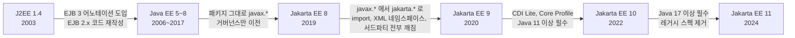
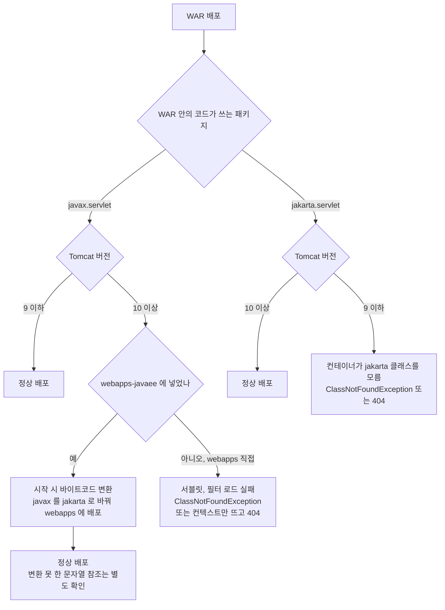

# Java EE (Jakarta EE)

Java EE(Java Platform, Enterprise Edition)는 서블릿, JPA, EJB, JMS 등 엔터프라이즈 애플리케이션에 필요한 스펙을 모아놓은 표준 규격이다. 구현체는 WildFly, GlassFish, WebLogic 같은 애플리케이션 서버가 담당한다.

2017년 Oracle이 Java EE를 Eclipse Foundation에 이관하면서 **Jakarta EE**로 이름이 바뀌었다. 단순한 브랜딩 변경이 아니라, 패키지 네임스페이스가 `javax.*`에서 `jakarta.*`로 변경되는 큰 변화가 있었다.

---

## javax에서 jakarta로의 전환

버전이 바뀔 때마다 무엇이 깨지는지 한 줄로 놓으면 이렇다. 9에서만 소스와 바이너리 호환이 끊기고, 나머지는 기능 추가나 이름 변경이다.



Jakarta EE 8은 이름만 바뀌었으므로 `javax.*` 코드를 그대로 쓴다. 문제는 9에서 시작된다. 9는 기능 변화 없이 패키지 이름만 바꾼 릴리스라서, 코드를 한 줄도 고치지 않았는데 라이브러리 버전만 올려도 부팅이 안 되는 상황이 생긴다. 10 이후로는 패키지가 그대로이고 Java 버전 요구만 올라간다.

### 네임스페이스 변경

Jakarta EE 9(2020)부터 모든 API 패키지가 `javax.*` → `jakarta.*`로 바뀌었다.

```java
// Java EE 8 이전
import javax.servlet.http.HttpServlet;
import javax.persistence.Entity;
import javax.inject.Inject;

// Jakarta EE 9 이후
import jakarta.servlet.http.HttpServlet;
import jakarta.persistence.Entity;
import jakarta.inject.Inject;
```

코드에서 import문만 바꾸면 될 것 같지만, 실제로는 그렇게 단순하지 않다.

### 마이그레이션 시 겪는 문제들

**의존성 충돌**

프로젝트에서 `javax.servlet-api`와 `jakarta.servlet-api`가 동시에 classpath에 올라가는 경우가 많다. 직접 의존하는 라이브러리는 교체할 수 있는데, 서드파티 라이브러리가 내부적으로 `javax.*`를 참조하고 있으면 문제가 된다.

```xml
<!-- 이런 상황이 발생한다 -->
<dependency>
    <groupId>jakarta.servlet</groupId>
    <artifactId>jakarta.servlet-api</artifactId>
    <version>6.0.0</version>
</dependency>
<!-- 그런데 어떤 라이브러리가 내부적으로 javax.servlet을 사용 -->
<dependency>
    <groupId>some-legacy-lib</groupId>
    <artifactId>legacy-filter</artifactId>
    <version>1.2.0</version>
    <!-- 이 안에서 javax.servlet.Filter를 구현하고 있다 -->
</dependency>
```

이 경우 `ClassNotFoundException`이나 `NoClassDefFoundError`가 런타임에 터진다. 컴파일 시점에는 잡히지 않는 경우가 있어서 배포 후에야 발견하는 경우가 있다.

**라이브러리 호환성**

Jakarta EE 전환 시기에 라이브러리마다 지원 버전이 다르다. Hibernate 6.x는 `jakarta.*`를 사용하지만 5.x는 `javax.*`를 사용한다. Spring Boot 3.x는 Jakarta EE 9+를 요구하고, 2.x는 Java EE 8 기반이다.

라이브러리 하나를 올리면 연쇄적으로 다른 라이브러리도 올려야 하는 상황이 생긴다. 특히 Hibernate Validator, Jackson의 Jakarta 지원 모듈, Jersey 같은 라이브러리의 메이저 버전 변경이 동시에 필요할 수 있다.

**Eclipse Transformer**

대규모 프로젝트에서는 Eclipse Transformer 같은 도구로 바이트코드 레벨에서 `javax` → `jakarta` 변환을 자동화하는 방법도 있다. 하지만 리플렉션으로 클래스 이름을 문자열로 참조하는 코드는 변환되지 않으니 주의해야 한다.

Spring Boot 프로젝트에서 이 전환을 겪는 경우라면 Boot 3 업그레이드 절차와 의존성 정리 순서를 [Spring Boot 2에서 3 마이그레이션](../../../Framework/Java/Spring/Spring_Boot_Migration_2_to_3.md)에서 따로 다룬다. 이 문서는 컨테이너와 스펙 쪽, 그 문서는 Spring과 빌드 설정 쪽이다.

### WAR가 어느 Tomcat에서 뜨는가

WAR 안의 코드가 `javax.servlet`을 쓰는지 `jakarta.servlet`을 쓰는지와 Tomcat 메이저 버전이 맞아야 한다. 맞지 않아도 Tomcat은 WAR를 거부하는 경우보다 배포는 성공하고 요청만 처리하지 못하는 경우가 훨씬 많다.



Tomcat 10부터 `webapps-javaee` 디렉터리가 생겼다. Java EE 8 이하용으로 만든 WAR를 이 디렉터리에 넣으면 Tomcat이 `javax`를 `jakarta`로 변환한 결과를 `webapps`에 풀어 배포한다. 반대 방향, 즉 Jakarta WAR를 Tomcat 9에 올리는 경우를 위한 변환은 없다. 그쪽은 빌드 단계에서 Jakarta 의존성을 `javax` 계열로 되돌려야 한다.

**Tomcat 9에 Jakarta WAR를 올렸을 때**

Spring Boot 3로 올린 프로젝트의 WAR를 기존 Tomcat 9 서버에 그대로 복사하면 겪는다. Tomcat 9는 `javax.servlet.*`만 알고 있다.

- 로그에 `java.lang.ClassNotFoundException: jakarta.servlet.ServletContext`나 `jakarta.servlet.Filter`가 찍히면서 컨텍스트 시작이 실패한다. 이때 Manager 화면에서는 앱이 stopped 상태다.
- 시작은 성공하는데 모든 요청이 404인 경우도 있다. Tomcat 9는 `META-INF/services/javax.servlet.ServletContainerInitializer`만 찾기 때문에, `jakarta.servlet.ServletContainerInitializer`를 구현한 Spring 6의 초기화 클래스가 호출되지 않는다. DispatcherServlet이 등록되지 않은 빈 컨텍스트가 떠 있는 셈이다. `localhost.log`에 에러가 없어서 원인을 찾기 어렵다.
- `@WebServlet`, `@WebFilter`를 `jakarta.servlet.annotation` 패키지에서 import한 클래스도 스캔 대상이 되지 않아 같은 식으로 조용히 무시된다.

확인은 `catalina.out`이 아니라 `$CATALINA_BASE/logs/localhost.<날짜>.log`와 `catalina.<날짜>.log` 두 곳을 본다. 시작 실패 스택트레이스는 보통 `localhost.log`에 있다. 서버 버전은 `bin/version.sh`로 확인한다.

**webapps-javaee 마이그레이션 도구 사용법**

반대 경우, 즉 `javax` 기반의 기존 WAR를 Tomcat 10 이상으로 옮기는 경우에 쓴다.

```bash
# Tomcat 10.1 기준
cp legacy-app.war $CATALINA_HOME/webapps-javaee/
$CATALINA_HOME/bin/startup.sh
# webapps 에 변환된 legacy-app.war 가 생기고 legacy-app 디렉터리로 풀린다
```

변환은 `webapps-javaee`에 있는 WAR를 Tomcat 시작 시점에 처리하는 것이 기본 동작이다. WAR를 새 버전으로 교체할 때는 `webapps`에 남은 이전 결과물(`webapps/legacy-app*`)을 지우고 다시 넣는다. 이전 결과물이 남은 채로 두면 새 WAR가 반영됐는지 확인하기 어렵다. 실행 중에 넣었을 때의 동작은 버전별로 차이가 있을 수 있어 사용 중인 버전의 문서를 확인한다.

같은 변환기를 단독 실행 파일로도 받을 수 있다. 배포 전에 CI에서 변환해서 결과를 확인하려는 경우에 이쪽을 쓴다.

```bash
# Tomcat 배포판의 lib/jakartaee-migration-*-shaded.jar 사용
java -jar $CATALINA_HOME/lib/jakartaee-migration-*-shaded.jar \
    legacy-app.war legacy-app-jakarta.war
```

변환기가 못 바꾸는 것도 있다. 문자열로 `"javax.servlet.http.HttpServletRequest"`를 쓰는 리플렉션, 외부 설정 파일에 적힌 `javax.*` 클래스 이름, 변환 대상 라이브러리 안에서 `Class.forName`으로 조립하는 이름이 그렇다. 변환 후에도 부팅 로그에서 `javax`가 들어간 `ClassNotFoundException`을 한 번은 grep해 봐야 한다. 변환기는 임시 수단이고, 오래 쓸 코드라면 소스에서 import를 바꾸고 의존성을 Jakarta 버전으로 올려서 다시 빌드하는 쪽이 낫다.

---

## Web Profile vs Full Platform

Java EE는 두 가지 프로파일로 나뉜다.

### Web Profile

웹 애플리케이션 개발에 필요한 최소한의 스펙만 포함한다.

포함되는 스펙: Servlet, JSP, JSF, CDI, JPA, JTA, Bean Validation, JAX-RS, JSON-P, JSON-B, WebSocket, Security API

대부분의 웹 애플리케이션은 Web Profile만으로 충분하다. Apache TomEE가 Web Profile 구현체의 대표적인 예다.

### Full Platform

Web Profile에 더해 JMS, JCA(Connector Architecture), JAXB, JAX-WS, JavaMail 같은 엔터프라이즈 통합 스펙이 추가된다.

메시지 큐 연동, 레거시 EIS(Enterprise Information System) 연결, SOAP 웹서비스가 필요한 경우에 Full Platform을 사용한다. WildFly, GlassFish, WebLogic이 Full Platform 구현체다.

실무에서는 Web Profile로 시작해서 필요한 스펙만 개별 라이브러리로 추가하는 방식이 일반적이다. Full Platform 서버를 통째로 올리는 건 리소스 낭비가 될 수 있다.

---

## 핵심 스펙 상세

### Servlet

HTTP 요청/응답을 처리하는 가장 기본적인 스펙이다. Spring MVC도 내부적으로 `DispatcherServlet`이라는 서블릿 위에서 동작한다.

```java
@WebServlet("/users")
public class UserServlet extends HttpServlet {

    @Override
    protected void doGet(HttpServletRequest req, HttpServletResponse resp)
            throws ServletException, IOException {
        resp.setContentType("application/json");
        resp.setCharacterEncoding("UTF-8");

        String userId = req.getParameter("id");
        // 서블릿에서 직접 JSON을 만들어야 한다
        // Spring이 이 부분을 자동화해주는 것
        resp.getWriter().write("{\"id\": \"" + userId + "\"}");
    }
}
```

서블릿을 직접 쓸 일은 거의 없지만, 서블릿 필터(Filter)는 Spring 프로젝트에서도 자주 사용한다. 인증, CORS, 로깅 처리에 `OncePerRequestFilter`를 쓰는 것이 대표적이다.

### JPA (Java Persistence API)

ORM 표준 스펙이다. Hibernate, EclipseLink가 구현체이고, 실무에서는 거의 Hibernate를 사용한다.

```java
@Entity
@Table(name = "orders")
public class Order {

    @Id
    @GeneratedValue(strategy = GenerationType.IDENTITY)
    private Long id;

    @ManyToOne(fetch = FetchType.LAZY)
    @JoinColumn(name = "user_id")
    private User user;

    @OneToMany(mappedBy = "order", cascade = CascadeType.ALL, orphanRemoval = true)
    private List<OrderItem> items = new ArrayList<>();

    @Enumerated(EnumType.STRING)
    private OrderStatus status;

    @Column(updatable = false)
    private LocalDateTime createdAt;
}
```

JPA 사용 시 주의할 점은 N+1 문제, 영속성 컨텍스트의 생명주기, LAZY 로딩 시점이다. 이런 것들은 JPA 자체의 문제가 아니라 구현체인 Hibernate의 동작 방식을 이해해야 해결된다.

### JAX-RS (RESTful 웹 서비스)

REST API 표준 스펙이다. Jersey, RESTEasy가 구현체다.

```java
@Path("/orders")
@Produces(MediaType.APPLICATION_JSON)
@Consumes(MediaType.APPLICATION_JSON)
public class OrderResource {

    @Inject
    private OrderService orderService;

    @GET
    @Path("/{id}")
    public Response getOrder(@PathParam("id") Long id) {
        Order order = orderService.findById(id);
        if (order == null) {
            return Response.status(Response.Status.NOT_FOUND).build();
        }
        return Response.ok(order).build();
    }

    @POST
    public Response createOrder(OrderRequest request) {
        Order created = orderService.create(request);
        URI location = UriBuilder.fromResource(OrderResource.class)
                .path("{id}")
                .build(created.getId());
        return Response.created(location).entity(created).build();
    }
}
```

Spring의 `@RestController`, `@GetMapping`과 비슷한 역할이다. 차이점은 JAX-RS는 `Response` 객체를 직접 다루는 반면, Spring MVC는 리턴 타입을 자동으로 응답으로 변환해준다.

### JMS (Java Message Service)

메시지 큐 표준 스펙이다. ActiveMQ, RabbitMQ(JMS 브릿지), IBM MQ가 구현체다.

```java
// 메시지 보내기
@Stateless
public class OrderEventProducer {

    @Inject
    @JMSConnectionFactory("java:/ConnectionFactory")
    private JMSContext jmsContext;

    @Resource(lookup = "java:/jms/queue/OrderQueue")
    private Queue orderQueue;

    public void sendOrderCreated(Long orderId) {
        jmsContext.createProducer()
                .setProperty("eventType", "ORDER_CREATED")
                .send(orderQueue, orderId.toString());
    }
}

// 메시지 받기
@MessageDriven(activationConfig = {
    @ActivationConfigProperty(
        propertyName = "destinationType",
        propertyValue = "jakarta.jms.Queue"),
    @ActivationConfigProperty(
        propertyName = "destination",
        propertyValue = "java:/jms/queue/OrderQueue")
})
public class OrderEventConsumer implements MessageListener {

    @Override
    public void onMessage(Message message) {
        try {
            String orderId = message.getBody(String.class);
            // 주문 후속 처리
        } catch (JMSException e) {
            throw new RuntimeException(e);
        }
    }
}
```

JMS의 한계는 Java 생태계에 종속된다는 점이다. 최근에는 Kafka, RabbitMQ의 AMQP 프로토콜처럼 언어에 독립적인 메시징 시스템을 직접 사용하는 추세다. JMS는 레거시 시스템 연동이나 WAS 내부 메시징에서 여전히 쓰인다.

### JTA (Java Transaction API)

분산 트랜잭션 표준이다. 여러 데이터 소스(DB, MQ 등)에 걸친 트랜잭션을 하나로 묶을 수 있다.

```java
@Stateless
public class TransferService {

    @PersistenceContext(unitName = "bankA")
    private EntityManager emBankA;

    @PersistenceContext(unitName = "bankB")
    private EntityManager emBankB;

    // 컨테이너가 JTA 트랜잭션을 관리한다
    // 두 DB에 대한 작업이 하나의 트랜잭션으로 묶인다
    public void transfer(Long fromAccountId, Long toAccountId, BigDecimal amount) {
        Account from = emBankA.find(Account.class, fromAccountId);
        Account to = emBankB.find(Account.class, toAccountId);

        from.debit(amount);
        to.credit(amount);
        // 두 DB 모두 커밋되거나, 둘 다 롤백된다 (2PC)
    }
}
```

**JTA 분산 트랜잭션의 실무 한계:**

2PC(Two-Phase Commit)는 이론적으로 완벽해 보이지만 실무에서 문제가 많다.

- **성능 저하**: 2PC는 모든 참여자가 준비 완료할 때까지 락을 잡고 있어야 한다. 참여자가 많을수록 대기 시간이 길어지고 처리량이 급격히 떨어진다.
- **장애 전파**: 한 DB가 느려지면 전체 트랜잭션이 멈춘다. 격리된 장애가 시스템 전체로 확산된다.
- **복구 어려움**: 2PC 중간에 코디네이터(트랜잭션 매니저)가 죽으면 참여자들이 in-doubt 상태로 락을 잡고 있게 된다. 수동 개입이 필요한 경우가 있다.
- **마이크로서비스와 맞지 않음**: 서비스별로 DB를 분리하는 구조에서 2PC를 걸면 서비스 간 강결합이 생긴다.

이런 이유로 최근에는 Saga 패턴(보상 트랜잭션)이나 이벤트 기반 최종 일관성(eventual consistency) 방식으로 대체하는 경우가 많다.

### JNDI (Java Naming and Directory Interface)

서버에 등록된 자원(DataSource, JMS Queue 등)을 이름으로 찾는 메커니즘이다.

```java
// 애플리케이션 서버에 등록된 DataSource를 JNDI로 조회
Context ctx = new InitialContext();
DataSource ds = (DataSource) ctx.lookup("java:comp/env/jdbc/MyDB");
Connection conn = ds.getConnection();
```

요즘은 `@Resource`나 `@Inject` 어노테이션으로 주입받으니 직접 JNDI lookup을 할 일은 거의 없다. 하지만 WAS 설정에서 DataSource를 JNDI 이름으로 등록하는 구조는 여전히 쓰인다. Tomcat의 `context.xml`에 DataSource를 설정하는 것이 대표적이다.

---

## EJB는 왜 퇴출되었나

### EJB의 원래 목적

EJB(Enterprise Java Beans)는 트랜잭션 관리, 보안, 원격 호출, 동시성 제어 같은 엔터프라이즈 기능을 컨테이너가 자동으로 처리해주겠다는 목적으로 만들어졌다.

### EJB 2.x 시절의 문제

EJB 2.x까지는 사용하기가 매우 번거로웠다.

```java
// EJB 2.x - 비즈니스 로직 하나 만들려면 이만큼 필요했다
// 1. Remote 인터페이스
public interface Calculator extends EJBObject {
    int add(int a, int b) throws RemoteException;
}

// 2. Home 인터페이스
public interface CalculatorHome extends EJBHome {
    Calculator create() throws RemoteException, CreateException;
}

// 3. Bean 구현 클래스
public class CalculatorBean implements SessionBean {
    public int add(int a, int b) { return a + b; }

    // 컨테이너 콜백 메서드들 - 대부분 비어있지만 구현해야 했다
    public void ejbCreate() {}
    public void ejbRemove() {}
    public void ejbActivate() {}
    public void ejbPassivate() {}
    public void setSessionContext(SessionContext ctx) {}
}

// 4. 배포 서술자 (ejb-jar.xml)도 필요
```

비즈니스 로직은 `add` 메서드 하나인데, 이걸 감싸는 보일러플레이트가 너무 많았다.

### Spring이 대체한 구조적 이유

2003년에 나온 Spring Framework은 같은 문제를 POJO(Plain Old Java Object) 기반으로 해결했다.

```java
// Spring - 같은 기능을 이렇게 구현한다
@Service
@Transactional
public class CalculatorService {
    public int add(int a, int b) {
        return a + b;
    }
}
```

Spring이 EJB를 대체할 수 있었던 핵심 이유:

- **POJO 기반**: 특정 인터페이스를 구현하거나 특정 클래스를 상속할 필요가 없다. 일반 Java 클래스에 어노테이션만 붙이면 된다.
- **애플리케이션 서버 불필요**: EJB는 반드시 Java EE 호환 WAS 위에서 동작해야 했다. Spring은 Tomcat 같은 서블릿 컨테이너면 충분하다. WAS 라이선스 비용과 리소스 오버헤드가 사라진다.
- **테스트 용이성**: EJB는 컨테이너 없이 단위 테스트가 어려웠다. Spring은 컨테이너 밖에서도 일반 객체처럼 테스트할 수 있다.
- **DI 컨테이너**: Spring의 IoC 컨테이너가 EJB 컨테이너의 역할을 대체했다. 트랜잭션, 보안, AOP 같은 횡단 관심사를 프록시 기반으로 처리한다.

EJB 3.x(2006)에서 어노테이션 기반으로 대폭 개선되었지만, 이미 Spring이 시장을 점유한 뒤였다. 현재 신규 프로젝트에서 EJB를 선택하는 경우는 거의 없다.

---

## CDI vs Spring DI

CDI(Contexts and Dependency Injection)는 Java EE의 의존성 주입 표준이다. Spring DI와 비슷한 목적이지만 동작 방식에 차이가 있다.

EJB, CDI, Spring 세 가지는 "누가 객체를 만들고 어떤 경로로 주입하는가"가 다르다. EJB는 서버가 풀(pool)에서 꺼내 프록시로 넘기고, CDI는 컨테이너가 스코프별 컨텍스트에서 찾으며, Spring은 ApplicationContext의 싱글톤 맵에서 꺼낸다.

```mermaid
flowchart TB
    subgraph EJB["EJB"]
        E1["@EJB 또는 JNDI lookup"] --> E2["EJB 컨테이너"]
        E2 --> E3["인스턴스 풀"]
        E3 --> E4["컨테이너 프록시<br/>트랜잭션, 보안 인터셉트"]
    end
    subgraph CDI["CDI"]
        C1["@Inject + Qualifier"] --> C2["Bean Manager"]
        C2 --> C3["스코프 컨텍스트<br/>Request, Session, Application"]
        C3 --> C4["클라이언트 프록시<br/>호출마다 현재 스코프 인스턴스 조회"]
    end
    subgraph SPR["Spring DI"]
        S1["@Autowired 또는 생성자 주입"] --> S2["ApplicationContext"]
        S2 --> S3["BeanDefinition 으로 생성된 싱글톤 맵"]
        S3 --> S4["필요한 빈만 AOP 프록시<br/>@Transactional 등"]
    end
```



세 방식 모두 호출자가 받는 것은 실제 객체가 아니라 프록시인 경우가 많다. 다만 EJB와 CDI는 컨테이너가 모든 빈을 프록시로 감쌀 수 있고, Spring은 어드바이스가 붙는 빈만 감싼다. 그래서 `@RequestScoped` 빈을 `@ApplicationScoped` 빈에 주입하면 CDI는 호출마다 올바른 인스턴스로 연결해 주지만, Spring은 `@RequestScope`의 프록시 모드가 기본으로 켜져 있는 어노테이션 대신 `@Scope("request")`를 `proxyMode` 없이 쓰면 부팅 시점에 "No thread-bound request" 오류가 난다.

### 스코프 관리

```java
// CDI - 표준 스코프
@RequestScoped   // HTTP 요청 단위
@SessionScoped   // HTTP 세션 단위
@ApplicationScoped // 애플리케이션 전체
@ConversationScoped // 여러 요청에 걸친 대화 단위 (CDI 고유)
@Dependent        // 주입 대상의 스코프를 따름

// Spring - 비슷하지만 이름이 다르다
@RequestScope
@SessionScope
@ApplicationScope
// @ConversationScoped에 대응하는 스코프가 없다
// 대신 커스텀 스코프를 만들 수 있다
```

### 주입 방식 차이

```java
// CDI - @Inject + @Qualifier (타입 기반 주입이 기본)
public class OrderService {
    @Inject
    @Priority(1) // 또는 커스텀 Qualifier
    private PaymentProcessor processor;
}

// CDI에서 같은 타입의 빈이 여러 개일 때 Qualifier로 구분
@Qualifier
@Retention(RUNTIME)
@Target({FIELD, PARAMETER, METHOD})
public @interface CreditCard {}

@CreditCard
@ApplicationScoped
public class CreditCardProcessor implements PaymentProcessor { }

// Spring - @Autowired + @Qualifier (이름 기반 구분 가능)
public class OrderService {
    @Autowired
    @Qualifier("creditCard")
    private PaymentProcessor processor;
}
```

### 빈 등록 방식

CDI는 `beans.xml` 파일 존재 여부와 `bean-discovery-mode` 설정으로 빈 스캔 범위를 결정한다. Jakarta EE 10부터는 `beans.xml` 없이도 어노테이션이 붙은 클래스를 자동으로 발견한다.

Spring은 `@ComponentScan`으로 패키지 범위를 지정하거나, `@Configuration` 클래스에서 `@Bean` 메서드로 직접 등록한다.

### 실질적 차이

- CDI는 프록시 기반의 스코프 관리가 기본이다. `@RequestScoped` 빈을 `@ApplicationScoped` 빈에 주입하면, CDI가 프록시를 통해 매 요청마다 올바른 인스턴스를 제공한다.
- Spring은 기본적으로 싱글톤이다. 스코프가 다른 빈을 주입할 때는 `ObjectProvider`나 프록시 모드를 명시적으로 설정해야 한다.
- CDI에는 인터셉터(Interceptor)와 데코레이터(Decorator) 패턴이 표준으로 정의되어 있다. Spring은 AOP로 같은 기능을 구현한다.

Spring 프로젝트에서 CDI를 사용할 일은 없다. Java EE/Jakarta EE 서버에서 개발할 때 CDI를 사용하고, Spring Boot를 쓸 때는 Spring DI를 사용한다.

---

## WAR/EAR 패키징과 배포 구조

### WAR (Web Application Archive)

웹 애플리케이션을 패키징하는 단위다.

```
myapp.war
├── WEB-INF/
│   ├── web.xml              # 서블릿 배포 서술자
│   ├── classes/              # 컴파일된 클래스 파일
│   │   └── com/example/...
│   └── lib/                  # 의존 라이브러리 (JAR 파일들)
│       ├── hibernate-core.jar
│       └── jackson-databind.jar
├── META-INF/
│   └── MANIFEST.MF
└── index.html                # 정적 리소스
```

WAR 파일 하나가 하나의 웹 애플리케이션에 대응한다. Tomcat의 `webapps/` 디렉토리에 WAR를 넣으면 자동으로 압축이 풀리면서 배포된다.

### EAR (Enterprise Application Archive)

여러 WAR와 EJB JAR를 하나로 묶는 패키징 단위다.

```
enterprise-app.ear
├── META-INF/
│   └── application.xml       # 모듈 구성 정의
├── web-module.war            # 웹 모듈
├── ejb-module.jar            # EJB 모듈
└── lib/                      # 공유 라이브러리
    └── common-utils.jar
```

```xml
<!-- application.xml -->
<application>
    <module>
        <web>
            <web-uri>web-module.war</web-uri>
            <context-root>/app</context-root>
        </web>
    </module>
    <module>
        <ejb>ejb-module.jar</ejb>
    </module>
</application>
```

EAR는 모듈 간 클래스 로더 격리, 공유 라이브러리 관리 같은 기능을 제공한다. 하지만 구조가 복잡하고 배포가 느리다.

### 현재 추세

Spring Boot가 나오면서 실행 가능한 JAR(fat JAR) 방식이 주류가 되었다. `java -jar app.jar`로 실행하면 내장 Tomcat이 뜨는 구조다. WAR 배포는 레거시 시스템이나 조직 정책상 WAS를 사용해야 하는 환경에서 쓴다. EAR는 신규 프로젝트에서 거의 사용하지 않는다.

---

## 애플리케이션 서버

Java EE 스펙을 구현한 서버(WAS)는 다음과 같다.

| 서버 | 설명 | 프로파일 |
|------|------|----------|
| WildFly | Red Hat이 관리. 구 JBoss AS | Full Platform |
| GlassFish | Eclipse Foundation이 관리. Jakarta EE 참조 구현 | Full Platform |
| Payara | GlassFish 기반 상용 포크. 프로덕션 지원 | Full Platform |
| WebLogic | Oracle 상용 서버. 금융권에서 많이 사용 | Full Platform |
| Apache TomEE | Tomcat에 Java EE 스펙을 추가한 서버 | Web Profile |
| Open Liberty | IBM이 관리. 필요한 피처만 선택해서 올릴 수 있다 | Full Platform |

Tomcat은 Java EE 서버가 아니다. 서블릿 컨테이너일 뿐이고, JPA, CDI, EJB 같은 스펙은 포함하지 않는다. Spring Boot + Tomcat 조합에서 JPA를 쓰는 건 Spring이 Hibernate를 직접 관리하기 때문이지, Tomcat이 JPA를 지원하는 게 아니다.

---

## Java EE 버전별 변화

| 버전 | 연도 | 주요 변화 |
|------|------|-----------|
| J2EE 1.2 | 1999 | Servlet, JSP, EJB, JDBC |
| J2EE 1.4 | 2003 | Web Services (JAX-RPC), 배포 서술자 개선 |
| Java EE 5 | 2006 | EJB 3.0 (어노테이션 기반), JPA 1.0, JSF 1.2 |
| Java EE 6 | 2009 | CDI 1.0, JAX-RS 1.1, Web Profile 도입 |
| Java EE 7 | 2013 | WebSocket, JSON-P, Batch, Concurrency Utilities |
| Java EE 8 | 2017 | JSON-B, Security API, HTTP/2 지원 |
| Jakarta EE 8 | 2019 | Java EE 8과 동일. 거버넌스만 Eclipse Foundation으로 이전 |
| Jakarta EE 9 | 2020 | javax → jakarta 네임스페이스 변경 |
| Jakarta EE 10 | 2022 | Core Profile 추가, CDI Lite, Java 11+ 필수 |
| Jakarta EE 11 | 2024 | Java 17+ 필수, 레거시 스펙 정리 |

Java EE 6에서 Web Profile이 도입되고, Java EE 5에서 어노테이션 기반 프로그래밍이 시작된 것이 큰 전환점이었다. 하지만 이 시점에 이미 Spring이 시장을 장악한 상태였기 때문에, Java EE의 개선이 채택률로 이어지지는 못했다.
